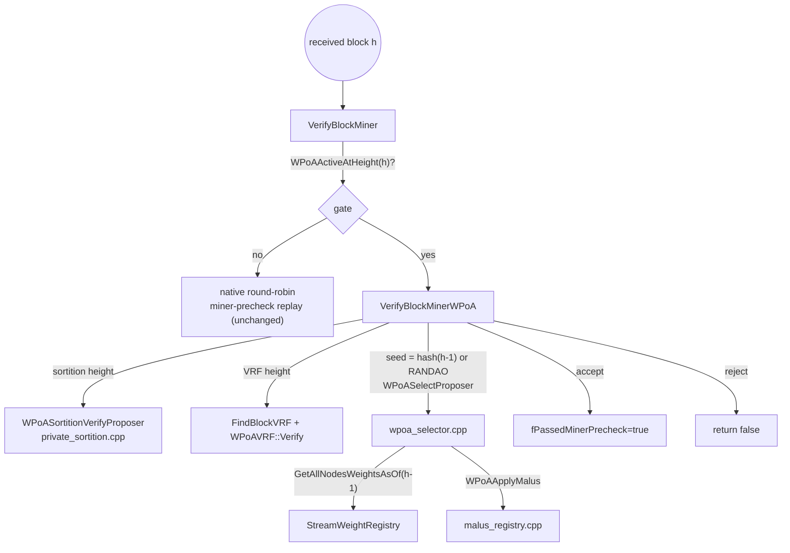

# `protocol/multichainblock.cpp` (wPoA parts)

> **Type:** reference · **Register:** technical-direct · **Verified against the code:**
> 2026-09-26, commit `3d2fc551`
>
> The **validator side of the election**: how `VerifyBlockMiner` hands wPoA-governed
> heights to `VerifyBlockMinerWPoA`, the order of its checks, and the public-argmin
> enforcement of Phases 2/3b. The Phase 3a reveal check is detailed in
> [vrf-verifier.md](vrf-verifier.md), the Phase 3b seed in
> [randao-validator.md](randao-validator.md), the Phase 4 time bar in
> [sortition-validator.md](sortition-validator.md). The production side is
> [miner-integration.md](miner-integration.md).

This is a **modified host file**, not a new module file. The additions are the static
functions `FindBlockVRF` and `VerifyBlockMinerWPoA`, a delegation in `VerifyBlockMiner`,
and a comment-marked change in `CheckBlockPermissions`, all between `/* MCHN START - wPoA … */`
markers. The includes at the top:

```cpp
#include "wpoa/wpoa_selector.h"      // WPoAActiveAtHeight, WPoAVRFActiveAtHeight, WPoASelectProposer
#include "wpoa/vrf_wrapper.h"        // WPoAVRF::Verify
#include "wpoa/randao_accumulator.h" // WPoARANDAOActiveAtHeight, WPoARandaoSelectionSeed
#include "wpoa/private_sortition.h"  // WPoASortitionActiveAtHeight, WPoASortitionVerifyProposer
```

## Table of contents

- [1. The role of VerifyBlockMiner](#1-the-role-of-verifyblockminer)
  - [1.1 The other diversity gate: CheckBlockPermissions](#11-the-other-diversity-gate-checkblockpermissions)
  - [1.2 Who calls it, and fAtAdmission](#12-who-calls-it-and-fatadmission)
- [2. The delegation in VerifyBlockMiner](#2-the-delegation-in-verifyblockminer)
- [3. VerifyBlockMinerWPoA — the order of the checks](#3-verifyblockminerwpoa--the-order-of-the-checks)
  - [3.1 Obtain the block data (with native leniency)](#31-obtain-the-block-data-with-native-leniency)
  - [3.2 Recover the signer address](#32-recover-the-signer-address)
  - [3.3 Sortition heights: the time bar](#33-sortition-heights-the-time-bar)
  - [3.4 VRF heights: the reveal](#34-vrf-heights-the-reveal)
  - [3.5 Recompute the public election](#35-recompute-the-public-election)
  - [3.6 Empty-registry leniency](#36-empty-registry-leniency)
  - [3.7 The enforcement check](#37-the-enforcement-check)
- [4. Miner ↔ validator symmetry](#4-miner--validator-symmetry)
- [5. Connections to the other files](#5-connections-to-the-other-files)

---

## 1. The role of `VerifyBlockMiner`

`VerifyBlockMiner(CBlock* block_in, CBlockIndex* pindexNew, bool fAtAdmission = false)` is
the receiving-side check that a block was produced by an **allowed** miner. Natively it
replays the round-robin mining-diversity rules along the branch to confirm the block's
miner was in turn. It sets `pindexNew->fPassedMinerPrecheck = true` on acceptance and
returns `false` to reject.

wPoA replaces that replay, **only for wPoA-governed heights**, with the checks of
`VerifyBlockMinerWPoA`. The contract is preserved exactly: same `fPassedMinerPrecheck` side
effect, same `return false` = reject.

### 1.1 The other diversity gate: `CheckBlockPermissions`

`VerifyBlockMiner` is a *precheck*; the standing consensus rule that the signer holds the
`mine` permission lives in `CheckBlockPermissions`, applied to every block, which calls
`mc_Permissions::CanMine()`. `CanMine()` folds the mining-diversity spacing in through
`IsBarredByDiversity()` — and that is where wPoA neutralises it, through
`mc_WPoAGovernsMiningHook`, on governed heights once the registry has carried a positive
weight ([wpoa-selector.md §3.3bis](wpoa-selector.md#33bis-the-mining-diversity-hook)). So
`CheckBlockPermissions` needs no special case: a validator that legitimately wins two
consecutive rounds passes, and every other height keeps the native spacing.

An earlier version special-cased the height here and called `CanCustom(MC_PTP_MINE)`
instead. `CanCustom` also honours grants still in the **mempool**, so in a consensus check
it was a fork: a block signed under an unconfirmed grant was accepted by whoever held that
transaction and rejected by everyone else. `CanMine()` reads confirmed permissions only.
The miner's own `canMine` probe in `CreateNewBlock` mirrors the same rule, so a self-elected
proposer does not log "cannot mine now" against itself.

### 1.2 Who calls it, and `fAtAdmission`

`main.cpp` calls `VerifyBlockMiner` from three places:

| Caller | `fAtAdmission` | Why |
|---|---|---|
| `AcceptBlock` | `true` | The block is being admitted: the only point where the sortition score may be written into the index ([§3.3](#33-sortition-heights-the-time-bar)). |
| `FindMostWorkChain` (two calls) | `false` | Re-verifies indices that are already keys of `setBlockIndexCandidates`; writing their score there would mutate the key of an element of an ordered `std::set`, which is undefined behaviour. |

## 2. The delegation in `VerifyBlockMiner`

The existing early guards (unchanged) accept when the protocol is not MultiChain, when
`supportminerprecheck` is off, when anyone can mine, and when there is no previous block.
Then:

```cpp
// wPoA Phase 2: when weighted selection governs this height, validate the
// miner against the weighted election instead of the round-robin diversity
// replay below.
if(WPoAActiveAtHeight(pindexNew->nHeight))
{
    return VerifyBlockMinerWPoA(block_in,pindexNew,fAtAdmission);
}
```

- `WPoAActiveAtHeight(pindexNew->nHeight)` is the **same** predicate the miner used (there
  about `tip+1`, here about the received block's own height). Because it is a pure function
  of height and chain parameters, both sides agree on whether this block is wPoA-governed.
- If false, the unchanged native replay runs — **a node without wPoA, or a height in the
  setup phase, validates exactly as before**.
- The delegation comes after `pprev == NULL` is ruled out, so `VerifyBlockMinerWPoA` may
  dereference `pindexNew->pprev`.

## 3. `VerifyBlockMinerWPoA` — the order of the checks

```text
block data available?                                     no → accept (native leniency)
signer present and pubkey valid?                          no → REJECT
┌ WPoASortitionActiveAtHeight(h)? ──────────────────────────────────────────────┐
│  reveal present?                                        no → REJECT            │
│  WPoASortitionVerifyProposer(...)   REJECT → REJECT                            │
│                                     SKIP   → accept, score = NaN               │
│                                     OK     → accept, cache score if admitting  │
└──────────────────────────────────────────────────────────── return ───────────┘
WPoAVRFActiveAtHeight(h)?  reveal present and verifies over h[n-1]?  no → REJECT
seed = RANDAO(pprev) if WPoARANDAOActiveAtHeight(h), else hash(pprev)
proposer = WPoASelectProposer(seed, h)
proposer empty → accept (registry not synced)
signer ≠ proposer → REJECT
```

The three-valued outcome is deliberate: **REJECT** for every defect attributable to the
block, **accept without verifying** only for conditions global to the node (no block data,
no wallet, empty registry). A proposer therefore cannot craft a block that lands in the
"unverifiable" bucket, and a node that is not synced does not stop the chain.

### 3.1 Obtain the block data (with native leniency)

```cpp
CBlock block_disk;
CBlock *pblock=block_in;
if(pblock == NULL)
{
    if( ((pindexNew->nStatus & BLOCK_HAVE_DATA) == 0) || !ReadBlockFromDisk(block_disk,pindexNew) )
    {
        LogPrintf("VerifyBlockMinerWPoA: Block %s (height %d) not available, miner check skipped\n", ...);
        pindexNew->fPassedMinerPrecheck=true;
        return true;
    }
    pblock=&block_disk;
}
```

If the caller did not pass the block, it is loaded from disk. If the data is unavailable
the check **accepts** rather than rejects, mirroring the native path: a node must not
reject descendants merely because it lacks a block's bytes locally.

### 3.2 Recover the signer address

```cpp
if(pblock->vSigner[0] == 0)                  → REJECT "block has no signer"
std::vector<unsigned char> vchPubKey(pblock->vSigner+1, pblock->vSigner+1+pblock->vSigner[0]);
CPubKey pubKeyMiner(vchPubKey);
if(!pubKeyMiner.IsValid())                   → REJECT "invalid signer pubkey"
std::string sMinerAddr=CBitcoinAddress(pubKeyMiner.GetID()).ToString();
```

`vSigner` is MultiChain's length-prefixed block-signer field. The address is rendered in
the **exact** format the registry and the miner use, which is what makes the comparisons
below meaningful. `vchPubKey` is also the key the VRF proofs are verified against.

### 3.3 Sortition heights: the time bar

On heights where `WPoASortitionActiveAtHeight(h)` holds, the proposer is **not** a publicly
recomputable argmin — each score is private under its owner's VRF key — so the equality of
§3.7 cannot be applied. Instead the block must carry a reveal (`FindBlockVRF`), and
`WPoASortitionVerifyProposer` verifies it over `seed ‖ "PROPOSER" ‖ height`, recomputes the
signer's score over the height-scoped effective weights, and checks
`block.nTime ≥ parent.nTime + MiningDelay(score, …)`. The verdict:

- **REJECT** → the block is rejected with the reason the function returns.
- **SKIP** → the score cannot be recomputed locally (node-global conditions only); the VRF
  proof was still enforced. Accept; when admitting, write `NaN` into the score cache
  explicitly, because any numeric value — zero above all — would read back as a genuine,
  winning score.
- **OK** → accept; when admitting, cache `dSortitionScore` and `dSortitionScoreNorm` on the
  index for the score-based fork choice
  ([wpoa-weight-engine-architecture.md §3.6](wpoa-weight-engine-architecture.md#36-fork-choice-the-true-score-in-the-chain-comparator)).

The branch **returns**: sortition heights never reach the public-argmin code below.
Detail: [sortition-validator.md](sortition-validator.md) and
[private-sortition.md](private-sortition.md).

### 3.4 VRF heights: the reveal

When `WPoAVRFActiveAtHeight(h)` holds (and sortition does not), the block must carry a
reveal that `WPoAVRF::Verify` accepts against the signer's key and the previous block hash;
a missing or forged reveal is rejected outright. The check is independent of the weight
registry, so it holds even on the empty-registry path of §3.6. Detail:
[vrf-verifier.md](vrf-verifier.md).

### 3.5 Recompute the public election

```cpp
uint256 hSeed=pindexNew->pprev->GetBlockHash();
unsigned char randao_seed[32];
if(WPoARANDAOActiveAtHeight(pindexNew->nHeight) && WPoARandaoSelectionSeed(pindexNew->pprev,randao_seed))
{
    memcpy(hSeed.begin(),randao_seed,sizeof(randao_seed));
}
std::string sProposer=WPoASelectProposer(hSeed.begin(),hSeed.size(),pindexNew->nHeight);
```

- The seed is the **previous** block's hash — identical to what the miner used, since its
  tip was this block's parent — or, when the RANDAO beacon governs the height, the beacon
  seed over that same parent ([randao-validator.md](randao-validator.md)).
- `WPoASelectProposer` reads the registry **as of `h − 1`**, applies the malus and the
  configured damping, and returns the argmin. Because the read is bounded by the parent
  height, every node that can evaluate this block derives the same weight map, whatever
  its own sync point. Both the damping function and the malus parameters are hash-enforced
  chain parameters, so miner and validator apply the same ones.

### 3.6 Empty-registry leniency

```cpp
if(sProposer.empty())
{
    LogPrintf("VerifyBlockMinerWPoA: Block %s (height %d): empty weight registry, miner check skipped\n", ...);
    pindexNew->fPassedMinerPrecheck=true;
    return true;
}
```

If this node cannot compute the election — no wallet, or no weight confirmed in the prefix
yet — it **accepts** rather than stalls. Honest blocks come from the deterministic elected
proposer and remain valid on any node that *can* recompute, so this does not let an invalid
proposer through on a synced node. This is also the path that keeps blocks produced under
the native fallback of the bootstrap window acceptable
([miner-integration.md §4](miner-integration.md#4-the-native-fallback)).

### 3.7 The enforcement check

```cpp
if(sMinerAddr != sProposer)
{
    LogPrintf("VerifyBlockMinerWPoA: REJECT block %s (height %d): miner %s is not the elected proposer %s\n", ...);
    return false;
}
LogPrint("wpoa","VerifyBlockMinerWPoA: OK block %s (height %d) miner==proposer==%s\n", ...);
pindexNew->fPassedMinerPrecheck=true;
return true;
```

The heart of the public enforcement: on a non-sortition wPoA height a block is valid only
if its signer is exactly the weighted-election winner. Rejections use `LogPrintf` (always
visible) and name both addresses; success uses the `wpoa` debug category.

## 4. Miner ↔ validator symmetry

| | Miner (`miner.cpp`) | Validator (`multichainblock.cpp`) |
|---|---|---|
| Gate | `WPoAActiveAtHeight(tip+1)` | `WPoAActiveAtHeight(pindexNew->nHeight)` |
| Seed | `hash(tip)`, or the RANDAO seed over `tip` | `hash(pindexNew->pprev)`, or the RANDAO seed over it |
| Weights | `GetAllNodesWeightsAsOf(h−1)` → `WPoAApplyMalus` | the same, inside the same `WPoASelectProposer` |
| Identity compared | local mining address | block signer address |
| Action | elected → mine now; else wait (or native fallback) | signer == proposer → accept; else reject |

Both run the **same** pure `SelectProposer` over the **same** prefix-scoped effective
weights, so for a given block they compute the identical proposer.

## 5. Connections to the other files



- **`wpoa/wpoa_selector.h`** — `WPoAActiveAtHeight`, `WPoAVRFActiveAtHeight`,
  `WPoASelectProposer`. See [wpoa-selector.md](wpoa-selector.md).
- **`wpoa/private_sortition.h`** — the sortition verdict. See
  [sortition-validator.md](sortition-validator.md).
- **`wpoa/vrf_wrapper.h`**, **`wpoa/randao_accumulator.h`** — see
  [vrf-verifier.md](vrf-verifier.md), [randao-validator.md](randao-validator.md).
- **The miner** (`miner/miner.cpp`) is the production counterpart this file enforces. See
  [miner-integration.md](miner-integration.md).
