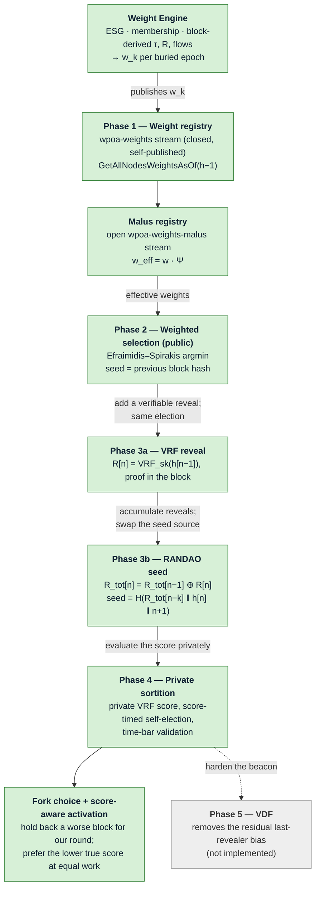

# wPoA Implementation Guide — phase map

> **Type:** reference · **Register:** technical-direct · **Verified against the code:**
> 2026-09-26, commit `3d2fc551`
>
> A high-level map of the whole implementation: what each layer adds, how the layers build
> on one another, and which document covers each component. It carries no code detail and
> no status — status lives only in [implementation-status.md](implementation-status.md),
> parameters only in [protocol-parameters.md](protocol-parameters.md). For the design
> rationale in one place see
> [wpoa-weight-engine-architecture.md](wpoa-weight-engine-architecture.md); for the list of
> every document see [README.md](README.md).

---

## How the layers fit together

The system is two subsystems joined by one stream. The **Weight Engine**
([`src/weight_engine/`](../src/weight_engine/)) produces each cluster's weight once per
epoch and publishes it on `wpoa-weights`; the **wPoA core** ([`src/wpoa/`](../src/wpoa/))
reads the confirmed weights and elects each height's proposer in proportion to them. The
wPoA core is itself a stack of phases, each adding one layer and reusing the one beneath it
unchanged — in particular the height-scoped weight read of Phase 1 is consumed identically
by every later phase.

The through-line: Phase 2 establishes the **scoring + argmin** machinery over a *public*
seed; Phases 3a–4 keep that machinery and only change *how the seed is produced and
consumed* — a VRF/RANDAO beacon, then evaluation inside each validator's secret key. The
malus changes the weights the election consumes, never the election itself. The Weight
Engine changes where the weights come from, never how they are read.

The switches must be enabled bottom-up —
`weights → selection → vrf → randao → sortition → malus`, with the Weight Engine requiring
`weights` and the fork-choice flag requiring `sortition` — and a violation stops the node at
startup ([protocol-parameters.md §1.3](protocol-parameters.md#13-dependency-constraints-hard-failure)).

---

## Layers at a glance

| Layer | What it adds | Reference | Design record |
|---|---|---|---|
| **Weight Engine** | Derives `w_k` per buried epoch from certified ESG, self-attested membership and block-derived activity, restitution and flows; each node publishes only its own cluster's weight and verifies everyone else's. | [weight-engine.md](weight-engine.md) | [adr/reconciliation-onchain.md](adr/reconciliation-onchain.md), [CHANGELOG-weight-engine-refactor.md](CHANGELOG-weight-engine-refactor.md) |
| **1 — Weight registry** | The closed, append-only `wpoa-weights` stream; newest-confirmed-wins, self-publication rule, height-scoped reads; RPCs `getlocalweight` / `getnodeweight` / `getallweights`. | [stream-weight-registry.md](stream-weight-registry.md), [weight-record.md](weight-record.md) | [phase1-implementation-guide.md](phase1-implementation-guide.md) |
| **2 — Weighted selection** | Weight-proportional proposer election (`score_i = -ln(u_i)/f(w_i)`, `u_i` from `HMAC-SHA256(seed, address)`) in the miner and the validator; the mining-diversity spacing neutralised on governed heights; damping `f` = `none`/`sqrt`/`log`. | [wpoa-selector.md](wpoa-selector.md), [miner-integration.md](miner-integration.md), [block-validation.md](block-validation.md) | [phase2-implementation-guide.md](phase2-implementation-guide.md) |
| **3a — VRF reveal** | Every elected proposer publishes `(R, π)` in its block (ECVRF/DLEQ over secp256k1, the validators' own keys); peers reject a missing or invalid reveal. Selection unchanged. | [vrf-wrapper.md](vrf-wrapper.md), [vrf-prover.md](vrf-prover.md), [vrf-verifier.md](vrf-verifier.md), [block-vrf-encoding.md](block-vrf-encoding.md) | [phase3a-implementation-guide.md](phase3a-implementation-guide.md) |
| **3b — RANDAO seed** | The reveals are folded into `R_tot` (bare XOR, Def. 5.3) and the election is seeded by `H(R_tot[n-k] ‖ h[n] ‖ n+1)`. Only the seed source changes. | [randao-accumulator.md](randao-accumulator.md), [randao-miner.md](randao-miner.md), [randao-validator.md](randao-validator.md) | [phase3b-implementation-guide.md](phase3b-implementation-guide.md), [adr/randao-fold-bare-xor.md](adr/randao-fold-bare-xor.md) |
| **4 — Private sortition** | Each validator scores itself with a VRF under its own key and mines after a delay in a band around `target-block-time`; peers accept a block iff its reveal verifies and its `nTime` respects the time bar. The proposer is unknowable until it acts. | [private-sortition.md](private-sortition.md), [sortition-miner.md](sortition-miner.md), [sortition-validator.md](sortition-validator.md) | [phase4-implementation-guide.md](phase4-implementation-guide.md) |
| **Malus registry** | The open `wpoa-weights-malus` stream: four provable offences (`equiv`, `delay`, `selfwrite`, `badweight`), a decaying severity `M`, and the correction `w_eff = w · Ψ` applied before every election. | [malus-registry.md](malus-registry.md) | — |
| **Fork choice** | Under private sortition, at equal work, prefer the block with the lower true sortition score instead of the first seen. Always on, no flag; not a consensus rule. | [wpoa-weight-engine-architecture.md §3.6](wpoa-weight-engine-architecture.md#36-fork-choice-the-true-score-in-the-chain-comparator) | [evidence/local-gossip-hint-inert-2026-09-21.md](evidence/local-gossip-hint-inert-2026-09-21.md) |
| **Score-aware activation** | A node whose own round is still running holds back a worse-scored block for that round instead of connecting it, so the argmin still proposes its full block and the fork choice picks it. The miner counts down from `parent.nTime + D`. | [score-aware-activation.md](score-aware-activation.md), [sortition-miner.md](sortition-miner.md) | — |
| **Audit RPCs** | Read-only `wpoa*` (score, delay, effective and final weight, per-block sortition) and `weight*` (contribution, cluster weight, returns, earnings, balance) families, computed through the same functions the consensus uses. | [rpc-result-shapes.md](rpc-result-shapes.md), [rpc-registration.md](rpc-registration.md) | — |
| **5 — VDF** | A Verifiable Delay Function over the beacon output, removing the last-revealer bias that RANDAO only bounds (Cleve). | [thesis-project-overview.md §7.3](thesis-project-overview.md#73-bias-analysis-cleves-impossibility-theorem-and-vdf-mitigation) | — |

---

## Cross-cutting references

| Document | What it covers |
|---|---|
| [node-startup.md](node-startup.md) | How `AppInit2` resolves the switches from `params.dat` and the command line, validates them and starts the threads. |
| [multichain-internals.md](multichain-internals.md) | The MultiChain host APIs the modules build on. |
| [native-poa-block-delay.md](native-poa-block-delay.md) | The native mining-delay model, for comparison with the Phase 4 band. |
| [testing.md](testing.md) | The unit suites, the network harness in `test/`, manual checks. |
| [thesis-project-overview.md](thesis-project-overview.md) | Research companion: threat model, formal model, probability preservation (§7.4). |

The rules for keeping all of this current are in [README.md](README.md#keeping-the-documentation-current).
