# wPoA — Implementation status

> **Type:** reference · **Register:** technical-direct · **Verified against the code:**
> 2026-09-26, commit `3d2fc551`
>
> **Single source** for implementation status: no other document carries a status table.
> Pointers to code and tests, no design argumentation — for the *why* see
> [wpoa-weight-engine-architecture.md](wpoa-weight-engine-architecture.md) and the module
> references; for parameters and defaults see [protocol-parameters.md](protocol-parameters.md),
> likewise a single source.

**Summary.** Phases 1, 2, 3a, 3b and 4 are complete and validated end-to-end, as are the
behavioural malus registry, the weight engine, the read-only audit RPCs and the optional
score-based fork choice. Phase 5 (a VDF over the beacon output, to remove the residual
last-revealer bias) is planned and not implemented.

---

## Table of contents

- [0. High-level architecture](#0-high-level-architecture)
  - [0.1 How a node's weight is assigned — the authoritative flow](#01-how-a-nodes-weight-is-assigned--the-authoritative-flow)
  - [0.2 mining-turnover and mining-diversity — operational hint vs binding rule](#02-mining-turnover-and-mining-diversity--operational-hint-vs-binding-rule)
- [1. Phase 1 — Weight registry](#1-phase-1--weight-registry)
- [2. Phase 2 — Weighted proposer selection](#2-phase-2--weighted-proposer-selection)
- [3. Phase 3a — VRF randomness beacon](#3-phase-3a--vrf-randomness-beacon)
- [4. Phase 3b — RANDAO beacon seed](#4-phase-3b--randao-beacon-seed)
- [5. Phase 4 — Efraimidis private sortition](#5-phase-4--efraimidis-private-sortition)
- [6. Malus registry](#6-malus-registry)
- [7. Weight engine](#7-weight-engine)
- [7bis. Activation semantics](#7bis-activation-semantics)
- [7ter. Fork choice and audit surface](#7ter-fork-choice-and-audit-surface)
- [8. End-to-end validation](#8-end-to-end-validation)
- [9. Not implemented](#9-not-implemented)

---

## 0. High-level architecture

The system is layered: each layer depends only on the one below it, and the coupling
between the layer that *produces* weights and the layer that *consumes* them goes through
a single on-chain stream.

```
                    +-----------------------------------------------+
   Weight layer     |  src/weight_engine/                           |
   (governance)     |  WeightEngine: ESG + membership (streams),    |
                    |  tau, R, flows (blocks)  ->  w_k per epoch    |
                    +----------------------+------------------------+
                                           |  publishes to
                                           v
                    +-----------------------------------------------+
   On-chain         |  "wpoa-weights" stream  (CLOSED)              |
   contract         |  {address, integer weight > 0, epoch}         |
                    +----------------------+------------------------+
                                           |  reads (newest-confirmed-wins,
                                           |  scoped to height - 1)
                                           v
                    +-----------------------------------------------+
   Consensus        |  src/wpoa/                                    |
   layer            |  StreamWeightRegistry -> malus -> dumping     |
                    |  -> VRF -> RANDAO -> private sortition        |
                    +-----------------------------------------------+
```

The consensus layer never learns **how** `w_k` was produced: it sees only the stream
contract. This makes it possible to replace the weight-assignment policy without touching
the election mechanics.

### 0.1 How a node's weight is assigned — the authoritative flow

> **Single source.** This is the **only** weight-assignment diagram in the repository.
> Other files link to it; none duplicates it.

The primary and authoritative channel is an **RPC write to the on-chain weights stream**,
performed by an **already authorized** node. The `-weight=<n>` flag is merely a local
fallback value.

```mermaid
flowchart TD
    ADM([ADMIN node<br/>global administrator]):::ok
    CA([CERTIFICATION AUTHORITY<br/>delegated by the admin]):::ok
    UNAUTH([UNAUTHORIZED node]):::bad
    ANYNODE([ANY node on the network<br/>company or miner]):::ok

    ADM -->|"grant &lt;addr&gt; high1<br/>confers / revokes CA status"| CA
    CA -->|"RPC: weightsetesg"| GATE_CA
    UNAUTH -.->|"RPC refused"| GATE_CA
    ADM -.->|"admin alone is NOT enough"| GATE_CA

    GATE_CA{{"GATE 1a — IsCertificationAuthority&#40;&#41;<br/>delegated certifiers only"}}:::gate
    GATE_CA -->|passes| PUB["WeightPublisher<br/>round-trip schema validation"]
    GATE_CA -.->|"blocks: RPC_INSUFFICIENT_PERMISSIONS"| DENY1([no write]):::bad

    PUB --> ESGS[("weight-engine-esg  (CLOSED)")]
    ESGS --> INS

    ANYNODE -->|"RPC: weightregistermembership<br/>NO privilege required"| PUBM["WeightPublisher<br/>node_address := caller"]
    PUBM --> MEMS[("weight-engine-membership (CLOSED)<br/>.write granted to every node")]

    MEMS --> GATE_SELF{{"GATE 1' — SELF-ATTESTATION<br/>tx signer == payload node_address"}}:::gate
    GATE_SELF -->|"passes — inverted into C_k"| INS
    GATE_SELF -.->|"record DISCARDED<br/>never enters C_k"| DENY_M([no membership<br/>+ malus grounds]):::bad
    UNAUTH -.->|"forged record: node_address ≠ signer"| GATE_SELF

    CHAIN[("chain: confirmed blocks + undo")] -->|"ComputeEpochFacts&#40;&#41;<br/>τ, R and the flows — one pass, no stream, NO writer"| INS

    INS[/"PIPELINE INPUTS for epoch e<br/>ESG_i · C_k published — τ · R_k · flows derived"/]
    INS --> ENG["WeightEngine — buried epochs only<br/>c_i → W_k → g_k → saldo_k → ρ_k → w_k"]

    CLI([Local flag -weight=N]):::weak
    CLI -.->|"ONLY if -enableweightengine=0<br/>local fallback value"| STAT["ThreadRegisterNodeWeight"]

    ENG -->|"-enableweightengine=1 — AUTHORITATIVE channel<br/>each node publishes ONLY its own cluster"| GATE_W
    STAT --> GATE_W

    GATE_W{{"GATE 2 — wpoa-weights.write required<br/>CLOSED, but granted to every node"}}:::gate
    GATE_W -->|"passes — publishFROM own address"| WSTREAM[("wpoa-weights (CLOSED)<br/>append-only, on-chain")]
    GATE_W -.->|"blocks: publish fails"| DENY2([no weight in the election]):::bad
    UNAUTH -.->|"direct publish refused"| GATE_W

    WSTREAM -->|"newest-confirmed-wins read"| GATE_SELFW
    GATE_SELFW{{"GATE 3 — SELF-PUBLICATION<br/>tx signer == payload node_address"}}:::gate
    GATE_SELFW -.->|"record DISCARDED<br/>weight for another cluster"| DENY3([no weight<br/>+ malus grounds]):::bad
    GATE_SELFW -->|passes| REG["StreamWeightRegistry<br/>GetAllNodesWeightsAsOf&#40;h−1&#41;"]

    ENG -.->|"recompute EVERY cluster from the<br/>public inputs, once per buried epoch"| VER
    WSTREAM -.-> VER
    VER{{"GATE 4 — UNIVERSAL VERIFICATION<br/>published == independently recomputed?"}}:::gate
    VER -.->|"mismatch: provably wrong<br/>reported by weightverifyweights"| DENY4([badweight malus grounds<br/>— the only consensus route]):::bad
    VER -.->|"cannot recompute: FAILS OPEN<br/>record left untouched"| REG

    REG ==>|"OVERRIDE: the on-chain value governs,<br/>never the local flag"| CLI

    REG -->|"w"| MAL["WPoAApplyMalus<br/>w_eff = w · Ψ"]
    MAL -->|"f&#40;w_eff&#41; — whale compression"| ELECT["Proposer election<br/>Efraimidis–Spirakis"]

    classDef ok   fill:#e8f5e9,stroke:#4c9a51,color:#1b3d1f;
    classDef bad  fill:#fdd,stroke:#c66,color:#633;
    classDef weak fill:#f4f4f4,stroke:#aaa,color:#555;
    classDef gate fill:#fff4d6,stroke:#c9a227,color:#5a4708;
```



**Two different kinds of gate.** `GATE 1a` is a **privilege** check: it asks *who* is
writing, and a privilege check is the only defence available for a claim no third party can
verify — which, after the reconciliation stream was removed, means the ESG score and
nothing else. `GATE 1'` is a **cryptographic**
check: it asks whether the writer is the subject of its own claim, and it needs no privilege
at all — which is why `weight-engine-membership.write` can be granted to every node on the
network while the stream stays CLOSED. Membership is the one input that is self-verifiable,
so it is the one input whose write is open.

**The one privilege gate is not the admin's.** ESG requires a **Certification Authority**,
a role the administrator delegates per address (`grant <addr> high1`) and can revoke. Being
an administrator is deliberately *not* sufficient: signing a sustainability certification
and running the network are separate competences, and keeping them separate on chain means
`listpermissions` shows who certifies independently of who administers. **No write path in
the weight layer requires global `admin` any more** — the only one that did was
reconciliation, and `R_k` is now derived from the blocks. Detail:
[weight-engine.md §6.3](weight-engine.md#63-why-opening-membership-is-safe--and-where-the-known-limit-still-bites),
[§6.4](weight-engine.md#64-esg--the-certification-authority-role) and
[adr/reconciliation-onchain.md](adr/reconciliation-onchain.md).

**τ and R have no gate at all**, because nobody writes them. Both are derived from the
epoch's confirmed blocks in a single shared pass, so there is nothing to authorize and
nothing to misstate. `R_k` used to be an administrator attestation on its own stream —
the asymmetry that treated one transaction fact as derived and the other as declared —
and `weight-engine-activity` was a stream name that no code ever created, wrote or read.
Both are removed.

Five properties the diagram makes explicit, all verified against the code:

**(a) The authoritative channel is the stream, not the flag.** The weight that governs
the election is always the one read from `wpoa-weights` through
`StreamWeightRegistry::GetAllNodesWeightsAsOf(height - 1)` — the records confirmed in the
prefix the block extends, so every node derives the same map for the same block. No
consensus path reads `g_node_weight` — that variable serves only the static publication
thread.

**(b) The on-chain value overrides the local flag.** The `OVERRIDE` arrow runs from the
stream branch **towards** the CLI branch, not the other way round. The mechanism is an
**XOR of threads at startup**: with `-enableweightengine=1` the static registrar never
launches, and `-weight` is parsed, validated and logged but **never published**. The
difference is observable — `-weight=500` does not produce a record that is later
superseded: it produces **no** record. Even in the static case, what matters to consensus
is the confirmed record on the stream, not the in-memory value.

**(c) An unauthorized node cannot impose its own weight by any route.** The gates are
independent, and the verification rules catch what a permission alone cannot:

| Attempt | Outcome |
|---|---|
| `-weight=999999` without `wpoa-weights.write` | The publish fails (Gate 2). The address never appears in the weight map: **zero** weight in the election. |
| `weightsetesg` without the Certification Authority role — **including from a global administrator** | `RPC_INSUFFICIENT_PERMISSIONS` (Gate 1a). No write. The admin confers the role; it does not hold it automatically. |
| `weightsetesg` after `revoke <addr> high1`, while `weight-engine-esg.write` is still granted | Refused (Gate 1a): the two grants are independent, and revocation does not wait for `.write` to be withdrawn too. |
| Direct `publish` / `publishfrom` on `wpoa-weights` without permission | Refused by consensus: the stream is CLOSED (Gate 2). |
| Direct `publishfrom` on the **attestation** stream (ESG — the only one left) **with** `.write` but without the CA role | **Succeeds**, and the reader accepts it. This is the known limit in [§9](#9-not-implemented) — the certifier-only guarantee depends on granting `.write` only to addresses that hold the role. |
| Direct `publishfrom` on **membership** with a `node_address` other than the signer | The transaction confirms, but the record is **discarded by every reader** (Gate 1'). It never enters `C_k` — and the discard is itself grounds for a malus accusation. |
| `publishfrom` on **`wpoa-weights`** naming another cluster's address | The transaction confirms, but the record is **discarded by every reader** (Gate 3): it never enters the weight map. |
| Publishing a weight for one's **own** cluster that does not match the independent recomputation | Detected by every node that can recompute (Gate 4), logged unconditionally and reported by `weightverifyweights`. The value still enters the election until a `badweight` malus is proved against it, which lowers `w_eff` from the following epoch. |

**(d) Every node publishes its own weight, and every node checks the others.**
`wpoa-weights.write` is now granted network-wide instead of to one publisher per cluster,
and two independent rules replace the trust that used to be placed in that publisher.
`GATE 3` asks *who wrote it* — the transaction's signer must be the cluster the record is
about, or the record is discarded — and **fails closed**, because one transaction is always
enough to decide it. `GATE 4` asks *whether the value is right*: every pipeline input is
public and deterministic, so any node re-runs the identical computation and a differing
value is **provably** wrong. That one **fails open**, because it needs readable inputs and
a buried epoch, and their absence is normal — treating "cannot verify" as "invalid" would
zero every weight on a syncing node and stall the chain.

`GATE 4` runs **once per buried epoch**, in the weight-engine thread, not per round: the
weights are read on every round while a recomputation is O(chain). Its verdicts are cached
for `weightverifyweights` only — **they never filter the election**, because a verdict cache
depends on when the local node verified, and an election that depended on it would differ
from node to node. The effective-weight consequence of a mismatch is carried instead by the
`badweight` malus (`w_eff = w · Ψ`), an on-chain proof every node re-evaluates identically.
Detail: [weight-engine.md §5.1](weight-engine.md#51-every-node-publishes-its-own-weight-and-every-node-checks-the-others).

**ESG is now the only remaining trusted datum.** Activity and membership are chain-derived,
and every published weight is recomputable — so the integrity of the whole weight system
reduces to the Certification Authority role that gates ESG writes.

**(e) A node cannot declare membership for another node, by any route.** This is the one
input where the guarantee is cryptographic rather than administrative, so it does **not**
depend on how narrowly `.write` was granted. `weightregistermembership` takes no parameter
naming whose membership to declare, and a raw `publishfrom` that forges one is discarded on
the signer mismatch. Conversely, a node may change cluster whenever it likes by calling the
RPC again: latest confirmed declaration wins.

Granting the permissions explicitly:

```bash
multichain-cli <chain> grant <address> wpoa-weights.write

# ESG: the CA role AND the stream write. Both are needed, and they are independent —
# revoking either one stops further ESG writes. Only `admin` can grant a high* slot.
multichain-cli <chain> grant <address> high1
multichain-cli <chain> grant <address> weight-engine-esg.write

# membership: granted to EVERY node, not only governance — the records are
# self-attested, so the permission conveys nothing beyond speaking about oneself
multichain-cli <chain> grant <address> weight-engine-membership.write
```

Authorization model in detail: [weight-engine.md §6](weight-engine.md). Stream and read
API in detail: [stream-weight-registry.md](stream-weight-registry.md).

### 0.2 mining-turnover and mining-diversity — operational hint vs binding rule

These two native MultiChain parameters have similar names and **opposite** roles. The
distinction is verifiable from their flags in
[`paramlist.h`](../src/chainparams/paramlist.h), and it matters because wPoA interacts with
only one of them.

| | `mining-diversity` | `mining-turnover` |
|---|---|---|
| Flags | `UINT32 \| USER \| CLONE \| DECIMAL` — **no `NOHASH`** | `... \| DECIMAL \| `**`NOHASH`** |
| Part of the `params.dat` hash | **Yes** | No |
| Nature | **Binding consensus rule** | **Local operational hint** |
| Default | `0.3` | `0.5` |
| Where it acts | `mc_Permissions::IsBarredByDiversity()`, reached from `CanMine()` and every other spacing consumer in [`permission.cpp`](../src/permissions/permission.cpp) | the native miner's empty-block pacing in [`miner.cpp`](../src/miner/miner.cpp) |
| Effect | A miner must wait `diversity × (active miners)` blocks before mining again. A block violating the spacing is **invalid**: peers reject it. | Affects only the local timing of one's own mining attempt. Makes no block invalid. |
| Consequence of divergence between nodes | Fork | None: every node may hold its own value |

**How wPoA interacts with each.** On wPoA-governed heights the **spacing** of
`mining-diversity` is deliberately **neutralised**, while the `mine` permission still gates
the signer. The switch sits at the source: `IsBarredByDiversity` consults
`mc_WPoAGovernsMiningHook`, which `wpoa_selector.cpp` installs at static initialisation and
which answers `WPoAActiveAtHeight(h) && WPoAEverElectable()`. `CanMine()`, the miner's key
lookup, `nCanMine` and `listminers` all inherit the answer, and all of them keep reading
**confirmed** permissions only.

The reason is structural, not a shortcut: under weighted selection **every** address
holding `mine` takes part in **every** round, and a heavier validator may legitimately win
two consecutive heights — which the round-robin spacing would reject. Every other height,
and every height of the bootstrap window before the first positive weight, keeps the
native spacing. (An earlier version bypassed the spacing with `CanCustom(..., MC_PTP_MINE)`
at the validator only; `CanCustom` also reads grants in the mempool, which in a consensus
check is a fork. Detail:
[wpoa-weight-engine-architecture.md §3.2](wpoa-weight-engine-architecture.md#32-the-mining-diversity-gate-one-function-pointer-instead-of-n-patches).)

`mining-turnover` is not touched by wPoA: it remains the native timing hint. The Phase 4
feedback term `Phi` is **not** derived from it — it is the gap between `target-block-time`
and the mean spacing of the last `MC_WPOA_SORTITION_FEEDBACK_WINDOW` (12) blocks, read from
block timestamps (see [§5](#5-phase-4--efraimidis-private-sortition)).

---

## 1. Phase 1 — Weight registry

| Area | Status | Notes |
|---|---|---|
| `-weight` configuration and validation | Done | Validated in `AppInit2`; startup fails on `-weight <= 0`. |
| Deferred registration (background thread) | Done | Waits for readiness, retries, bounded budget before giving up. Never blocks startup. |
| Append-only on-chain registry (`wpoa-weights`) | Done | Create + subscribe + publish through reused RPC handlers; idempotent re-registration. |
| **CLOSED** stream (restricted write) | Done | Created with `create ["stream","wpoa-weights",false]`: `wpoa-weights.write` required. An unauthorized node carries no weight. |
| Opaque read API | Done | `GetLocalWeight`, `GetAllNodesWeights`, `GetNodeWeight`, and the height-scoped `GetAllNodesWeightsAsOf(height)` that every consensus path uses. Hides the stream mechanics from callers. |
| Self-publication rule | Done | A record counts only if its transaction was signed by the address it declares (`mc_StreamItemIsSelfAttested`, shared with the membership stream); anything else is discarded and logged unconditionally. |
| Height-scoped reads | Done | Miner, validator and audit RPCs read the records confirmed at or below `height - 1`, so the same block yields the same weight map on every node regardless of its sync point. |
| RPC surface | Done | `getlocalweight`, `getnodeweight`, `getallweights`. Confirmed-only, thread-safe, current (unscoped) view. |
| Read-path correctness fixes | Done | The non-WRP read family (WRP snapshot bug) and the 6-argument `OpReturnFormatEntry` overload. |
| Unit tests (pure parsing / aggregation) | Done | [`wpoa_weight_tests.cpp`](../src/wpoa/test/wpoa_weight_tests.cpp), node-free. |

Detail: [phase1-implementation-guide.md](phase1-implementation-guide.md) ·
[stream-weight-registry.md](stream-weight-registry.md) ·
[weight-record.md](weight-record.md).

---

## 2. Phase 2 — Weighted proposer selection

| Area | Status | Notes |
|---|---|---|
| Weighted selection (`WPoASelector` + miner hook) | Done | Efraimidis–Spirakis argmin over `WPoAApplyMalus(GetAllNodesWeightsAsOf(h-1))`. |
| `-enablewpoaselection` switch | Done | Inherited chain parameter plus runtime flag. Gates both the miner and the validation hooks. |
| Proposer validation (`VerifyBlockMiner` hook) | Done | Recomputes the election on receipt; rejects blocks not from the elected proposer. |
| mining-diversity spacing bypass | Done | `mc_WPoAGovernsMiningHook` in `IsBarredByDiversity` neutralises the round-robin spacing on governed heights once the registry has carried a positive weight; confirmed permissions only ([§0.2](#02-mining-turnover-and-mining-diversity--operational-hint-vs-binding-rule)). |
| Deterministic tie-break | Done | Lexicographically smallest address on exact score collision. |
| Whale compression (`-dumpfunction`) | Done | `none` / `sqrt` / `log`, applied to the effective weight before the draw. |
| Unit tests (pure selector math) | Done | [`wpoa_selector_tests.cpp`](../src/wpoa/test/wpoa_selector_tests.cpp); probability preservation over 200k seeds. |

Detail: [phase2-implementation-guide.md](phase2-implementation-guide.md) ·
[wpoa-selector.md](wpoa-selector.md) · [miner-integration.md](miner-integration.md) ·
[block-validation.md](block-validation.md).

---

## 3. Phase 3a — VRF randomness beacon

| Area | Status | Notes |
|---|---|---|
| VRF wrapper (`WPoAVRF`, ECVRF/DLEQ over secp256k1) | Done | Pure `Prove` / `Verify`; no new build dependency. |
| `-enablewpoavrf` switch | Done | Gates reveal production and verification via `WPoAVRFActiveAtHeight`. |
| Per-block reveal embed + verify | Done | The proposer embeds `(R, pi)` as a suffix of the block-signature element; `VerifyBlockMinerWPoA` rejects a missing or invalid reveal. |
| Unit tests (pure VRF crypto) | Done | [`vrf_wrapper_tests.cpp`](../src/wpoa/test/vrf_wrapper_tests.cpp); roundtrip, determinism, tamper / forgery / cross-key rejection. |

Detail: [phase3a-implementation-guide.md](phase3a-implementation-guide.md) ·
[vrf-wrapper.md](vrf-wrapper.md) · [vrf-prover.md](vrf-prover.md) ·
[vrf-verifier.md](vrf-verifier.md) · [block-vrf-encoding.md](block-vrf-encoding.md).

---

## 4. Phase 3b — RANDAO beacon seed

| Area | Status | Notes |
|---|---|---|
| Accumulator and seed (`RandaoAccumulator`) | Done | `R_tot[n] = R_tot[n-1] XOR R[n]` (thesis Def. 5.3) folded over the 3a reveals; `seed[n+1] = H(R_tot[n-k] \|\| h[n] \|\| n+1)` derived and memoized. The hardened variant `H(R_tot XOR H(R))` the module used to fold was dropped: [adr/randao-fold-bare-xor.md](adr/randao-fold-bare-xor.md). |
| `-enablewpoarandao` + `-wpoarandaolookback=k` | Done | `k` is consensus-critical, validated at startup. |
| Seed anchored to `h[n]` and `n+1` | Done | Conforms to Def. 5.4 of the thesis. |
| Selection-seed swap (miner + validator) | Done | Both call sites replace the prev-hash seed with `WPoARandaoSelectionSeed(tip)`; the election stays weight-proportional. |
| Memoised walk | Done | `R_tot` memoised per block hash (`g_randao_cache`, leaf lock `cs_randao_cache`), iterative walk back to the first cached ancestor; reveal extraction on a stack-local `mc_Script`. |
| Unit tests (pure accumulator / seed math) | Done | [`randao_accumulator_tests.cpp`](../src/wpoa/test/randao_accumulator_tests.cpp); spec conformance against an independent reference, order and input sensitivity, chain consistency. |

Detail: [phase3b-implementation-guide.md](phase3b-implementation-guide.md) ·
[randao-accumulator.md](randao-accumulator.md) · [randao-miner.md](randao-miner.md) ·
[randao-validator.md](randao-validator.md).

---

## 5. Phase 4 — Efraimidis private sortition

This is the security fix: it makes the proposer unpredictable until it acts.

| Area | Status | Notes |
|---|---|---|
| Sortition core (`PrivateSortition`) | Done | `VRFInput` / `ScoreFromVRFOutput` / `NormalizedScore` / `MiningDelay`, node-free; reuses the Phase-2 score transform, so the distribution is provably unchanged. |
| `-enablewpoasortition` + `-wpoasortitiondelta` / `-wpoasortitionlambda` | Done | Requires the RANDAO beacon and `k >= 1` (seed↔reveal acyclicity, validated at startup). Both band parameters are consensus-critical and range-checked. |
| Score-timed self-election (miner) | Done | Each validator scores itself privately (VRF under its own key) and mines at `parent.nTime + delay(score)`, the instant the validator's time bar is measured from, so the argmin proposes first and the parent's proposer has no head start. Includes the already-proposed guard, the retarget abort in `CreateNewBlock`, and the reveal-input switch to `seed \|\| "PROPOSER" \|\| height`. |
| **Banded delay** on `target-block-time` | Done | `D = T + delta·T·(2·score_norm − 1) + lambda·Phi` with `score_norm = 1 − e^{−W·score}`. Replaces the earlier open-ended ramp. The `W` factor keeps candidates spread across the band instead of crushed against its early edge. |
| Feedback term `Phi` | Done | `WPoASortitionFeedback`: target spacing minus the mean spacing of the last 12 blocks, from block timestamps, clipped to `±min(0.5·T, T(1−δ)/λ)`; identical for every candidate of a round, so it moves the mean block time without reordering anybody. `lambda = 0` disables it. |
| Eligibility / time-bar validation | Done | Replaces the public-argmin equality: verify the VRF over the sortition input, recompute the score over the height-scoped effective weights, accept iff `block.nTime >= parent.nTime + delay`. Three-valued verdict: REJECT for any block defect, SKIP only for node-global conditions. The auto-relaxing bar **is** the liveness fallback: no zero-proposer gap. |
| Shared round context | Done | `WPoABuildRoundContext` derives weights, `W` and seed for a height for the miner and the audit RPCs; the validator repeats the same steps with the same helpers, so an inspection cannot report a number the consensus would not have computed. |
| Unit tests (pure math + real VRF) | Done | [`private_sortition_tests.cpp`](../src/wpoa/test/private_sortition_tests.cpp); VRF-input encoding, score reuse, delay map, key-dependence (privacy), winner-delay uniformity, and probability preservation with real VRF keys. |

Detail: [phase4-implementation-guide.md](phase4-implementation-guide.md) ·
[private-sortition.md](private-sortition.md) ·
[sortition-miner.md](sortition-miner.md) ·
[sortition-validator.md](sortition-validator.md). For the native delay gate this phase
supersedes: [native-poa-block-delay.md](native-poa-block-delay.md).

---

## 6. Malus registry

| Area | Status | Notes |
|---|---|---|
| Malus core (`MalusAccumulator`) | Done | EMA fold, `Psi`, `w_eff`, `EpochsToClear`; node-free. |
| **Open** `wpoa-weights-malus` stream + `Valid(e)` | Done | Anyone may report, nobody is believed: every node re-derives the evidence, so a false report is discarded identically everywhere. |
| Consensus-behavioural kinds (`equiv`, `delay`) | Done | Evidence is the **block**: the VRF reveal over the beacon seed, plus the time bar for a delay violation. Restricted to sortition-governed heights, where that reveal exists. |
| Published-data integrity kinds (`selfwrite`, `badweight`) | Done | Evidence is the publishing **transaction**. `selfwrite`: a record on a self-attested stream naming another address — validated as the exact **negation** of the readers' rule, through the same shared predicate, so a node can never accuse a record it would have accepted. `badweight`: a `wpoa-weights` value that fails re-running the pipeline over the epoch's public inputs. The two are disjoint (an unsigned record is a `selfwrite`, never a `badweight`), so one act is never scored twice. Both need the weight engine to be decidable, and its flag is hash-enforced, so every node agrees on whether they are decidable at all. |
| `w_eff = w * Psi` in the election | Done | Applied in one place (`WPoAApplyMalus`), consumed by the public selector and by both sides of the private sortition. Inert when disabled or when nobody carries a violation. **Generic over the kind**: adding the two data-integrity kinds touched only the per-kind score dispatch — `Psi`, `w_eff` and the consensus path operate on the accumulated severity `M`, not on what produced it. |
| `-enablewpoamalus` + `mu` / `M_max` / four point weights | Done | Inheritable chain parameters; requires sortition, and both `p(Equiv) > p(Delay)` and `p(BadWeight) > p(SelfWrite)` are enforced at startup. Intended ordering `p(Equiv) > p(BadWeight) > p(SelfWrite) > p(Delay)`. |
| Reversibility of an exclusion | Done | `M` is an exponential moving average with `mu < 1`, so an exclusion clears after a finite number of clean epochs: no permanent ban — for **either** family, since the decay is a property of `M` rather than of the offence. Clearing bound corrected at the threshold. |
| `badweight` recomputation memo | Done | Per-epoch memo keyed on the epoch's last block hash plus the membership and ESG maps as read now; stored only if the key is unchanged across the computation; lock order `cs_main → cs_recomputeMemo`. Keeps the malus fold off a multi-second recomputation on every round. |
| Unit tests | Done | [`wpoa_malus_tests.cpp`](../src/wpoa/test/wpoa_malus_tests.cpp) (37 cases); parsing for both families, every data-integrity rejection (including a report accusing an *honest* record), the four-score dispatch and its ordering, EMA fold, `Psi`, `w_eff` end to end for a proved `badweight`, and reversibility. |

Detail: [malus-registry.md](malus-registry.md).

---

## 7. Weight engine

| Area | Status | Notes |
|---|---|---|
| Pure computation core (`WeightEngine`) | Done | The `c_i → W_k → g_k → saldo_k → rho_k → w_k` restitution-rate pipeline, verbatim from the thesis chapter; `ToIntegerWeight` scales by `kappa` and clamps to `[1, UINT32_MAX]`. Standard library only. |
| Record parsers (W1) | Done | `mc_Parse*RecordJson`; the self-attestation predicate; cluster `C_k` reconstruction by inverting the `node -> miner` relation. |
| Input-stream reader (W3) | Done | `WeightStreamReader`: lifecycle of the **two** published streams (create CLOSED + subscribe), confirmed-only reads, publisher extraction from the tx inputs. |
| Chain-derived `tau`, `R` and flows | Done | `WeightStreamReader::ComputeEpochFacts` derives `tau`, `R_k` and the gross credits/debits behind `saldo_k` from the epoch's confirmed blocks and undo data in **one pass**, under the same buried-epoch guard, accumulating in integer base units. `R_k` is the native-currency value paid to the hash-enforced `weight-treasury-address` by transactions the miner signed — no longer an administrator attestation. `weight-engine-reconciliation` and the vestigial `weight-engine-activity` are **removed**, as is `weightsetreconciliation`. Rationale and rejected option: [adr/reconciliation-onchain.md](adr/reconciliation-onchain.md). |
| Self-attested membership (W3) | Done | Item key = declaring node; latest confirmed declaration wins, so a node changes cluster autonomously. The reader **discards** any record whose tx signer differs from its declared `node_address`. `weight-engine-membership.write` is meant to be granted network-wide. |
| Self-published weights + universal verification | Done | `wpoa-weights.write` is granted network-wide; each node publishes only its **own** cluster, with `publishfrom` so the signer *is* the declared address. The reader **discards** a record whose signer differs (fails closed); the weight engine independently **recomputes every cluster** once per buried epoch and reports mismatches (fails open when it cannot recompute). Exposed by `weightverifyweights`. The mismatch consequence on `w_eff` is carried by the malus registry. |
| Publisher + RPCs (W3) | Done | `weightsetesg` (**Certification Authority** only) and `weightregistermembership` (public self-write) — no write path in this module requires global `admin` any more. The admin-proxy `weightsetmembership` was removed (under self-attestation its records would be discarded) and `weightsetreconciliation` with the stream it wrote. |
| ESG Certification Authority role (W3) | Done | The role is carried by MultiChain's `high1` custom permission — a **high** slot deliberately, since only those require `admin` rather than `activate` to grant. `weightsetesg` checks `IsCertificationAuthority` **instead of** `CanAdmin`, so an administrator that has not granted itself the role is refused. Revocation bites independently of `.write`. Policy decision table: [`weight_authorization.h`](../src/weight_engine/weight_authorization.h). |
| Computation and publication thread | Done | `ThreadWeightEngine`; creates `wpoa-weights` before the epoch gate, verifies every published weight of epoch `e-1`, publishes only for the latest **buried** epoch and only if the node is a cluster miner. Mutually exclusive with the static registrar. |
| `-enableweightengine` + `epochlength` / `kappa` / `alpha` / `lambda` / `treasuryaddress` | Done | Hash-enforced chain parameters; requires Phase 1; validated at startup. `weight-treasury-address` may be empty, which makes `R_k = 0` uniformly — a uniform scaling that leaves the election unchanged. |
| Unit tests | Done | Its own runner: `src/weight_engine/test/run_unit_tests.sh`, suites `records`, `authorization`, `engine`, `verifier` and `epoch`. |

Detail: [weight-engine.md](weight-engine.md) ·
[CHANGELOG-weight-engine-refactor.md](CHANGELOG-weight-engine-refactor.md) (permission
model before/after, per stream) ·
[adr/reconciliation-onchain.md](adr/reconciliation-onchain.md).

---

## 7bis. Activation semantics

Two behaviours that the per-phase status tables above do not capture, because they are
about *when* the machinery engages rather than whether it exists.

**wPoA activates on the first positive weight, not at `setup-first-blocks`.** Until the
registry carries a weight the selector can draw, both mining branches hand the round to
the native MultiChain scheduler and the mining-diversity gate stands down with them; the
chain advances, epochs bury, the engine publishes, and wPoA takes over by itself. The
latch never clears: once activated, "no validator eligible" is a legitimate sortition
outcome and the chain halting is correct behaviour, logged rather than routed around.
Full rule in [weight-engine.md §4bis](weight-engine.md#4bis-deferred-activation--when-wpoa-actually-takes-over). Unit-tested in the `activation` suite.

**Stream auto-creation retries.** The three registries share one bounded-retry state
machine (`src/wpoa/stream_setup_state.h`) that latches only on a real broadcast. It used
to latch before the attempt, which turned any transient failure into a permanent one.

**The `enable-wpoa` master switch expands from `params.dat`**, not only from the
`multichain-util create` command line. See
[protocol-parameters.md §1bis](protocol-parameters.md#1bis-the-master-switch-and-how-it-expands).

**`setup-first-blocks` is raised at genesis** when the weight engine and selection are both
on, so a weight can confirm before wPoA governs (`AdjustSetupFirstBlocks`,
[protocol-parameters.md §1ter](protocol-parameters.md#1ter-setup-first-blocks-is-derived-not-merely-validated)).

---

## 7ter. Fork choice and audit surface

| Area | Status | Notes |
|---|---|---|
| Score-based fork choice | Done | At equal work `CBlockIndexWorkComparator` prefers the lower true sortition score (`CBlockIndex::dSortitionScore`, written once at admission; NaN ranks last). Always on under private sortition; the former `-enablewpoaforkscore` flag was removed. Not a consensus rule. Detail: [wpoa-weight-engine-architecture.md §3.6](wpoa-weight-engine-architecture.md#36-fork-choice-the-true-score-in-the-chain-comparator). |
| Score-aware activation | Done | A node whose own round is still running holds back a worse-scored block for that round (`FindMostWorkChain`), relays it, and releases it if its own slot plus 2 s passes without a block. Measured on `regional-race-check1h` (437 sortition rounds, private scores of all 5 miners): real inversions 0.2 % (1 round), against 2.3 % with the parent-anchored timer alone and 8.0 % before either; 25 heights held, none of the held blocks ended on chain, no release by timeout; blocks built after a hold carried 85 transactions on average against 56 overall. Detail: [score-aware-activation.md](score-aware-activation.md). |
| Fork-choice instrumentation | Done | Under `-debug=wpoafork`, every contested round is logged with the candidates, their scores and arrival order, and the winners under both the live and the legacy (`CBlockIndexLegacyWorkComparator`) rule; the score-aware activation adds `[wpoa-fork] defer` / `defer-release`. |
| Round audit RPCs (`wpoa*`) | Done | `wpoaget/list` × `score`, `delay`, `effectiveweight`, `finalweight`, `blocksortition`; optional height argument; computed through `WPoABuildRoundContext`. Unit-tested in the `audit` suite. |
| Epoch audit RPCs (`weight*`) | Done | `weightget/list` × `contribution`, `clusterweight`, `returns`, `earnings`, `balance`; refuse epochs that are not yet buried (`LastBuriedEpoch`); computed through `WeightEngineComputeEpochDetail`. Unit-tested in the `epoch` suite. |

Result shapes: [rpc-result-shapes.md](rpc-result-shapes.md).

---

## 8. End-to-end validation

End-to-end validation runs on real `multichaind` processes through the Python harness in
[`test/`](../test/README.md), in two regimes: `native` (one host, loopback, no network
emulation — the correctness baseline) and `core` (one namespace per site of a map, with
per-link delay, jitter and loss). Every chain the harness creates runs the complete stack
— weights → selection → VRF → RANDAO → sortition → malus, with the weight engine on — and
the fork-score flag on unless a profile opts out.

A run goes bootstrap → traffic → shutdown → phase 1 (collect) → phase 2 (aggregate and
recompute) → phase 3 (test) → plots. Phase 3 opens with **consistency checks** that must
all pass before any statistic is trusted:

| Check | What it demonstrates |
|---|---|
| `registry_weights_finite_and_positive`, `no_phantom_validator_in_registry` | The weight map is well formed and names only real validators. |
| `delay_recompute_mismatch_rounds_is_zero`, `phi_consistent` | The harness recomputes every sortition delay and `Phi` from the logged inputs and agrees with the node on every round. |
| `every_esg_publication_reached_the_stream`, `certified_scores_reflected_in_the_engine` | CA publications land on chain and enter the pipeline. |
| `traffic_counts_within_configured_range`, `only_miners_pay_the_treasury` | The traffic that feeds `tau` and `R_k` is what the profile asked for. |
| `malus_finite_and_psi_in_unit_interval` and, when a `malicious` section runs, `malus_effective_weight_matches_recompute`, `malus_clean_validator_has_psi_one`, `malus_detector_no_false_positives`, `malus_confirmed_actions_were_detected` | The malus is inert on honest validators and catches every confirmed `selfwrite` / `badweight` action. |
| `at_least_one_fully_measured_epoch` | The run was long enough to measure anything at all. |

The statistics that follow cover the weight↔election relation (Wilson intervals, goodness
of fit, concentration, streaks, the timer race, longitudinal checks) and the weight-engine
feedback. Only the data-integrity malus kinds can be exercised from outside the node;
`equiv` and `delay` are produced inside the consensus core and are covered by the unit
suites only.

Unit tests, all node-free:

```bash
./src/wpoa/test/run_unit_tests.sh            # weight malus selector vrf randao sortition audit activation
./src/weight_engine/test/run_unit_tests.sh   # records authorization engine verifier epoch
python3 -m unittest discover -s test/unit    # the harness's own Python tests
```

Detail: [testing.md](testing.md) · [`test/README.md`](../test/README.md).

---

## 9. Not implemented

| Area | Status | Notes |
|---|---|---|
| **Phase 5 — VDF over the beacon output** | Planned | Would remove the residual last-revealer bias. No code. See Cleve's impossibility theorem in [thesis-project-overview.md](thesis-project-overview.md). |
| Consensus-rule Δ_gossip (pending pool, relay at admission) | Parked | A *local* gossip hint was measured and rejected: [evidence/local-gossip-hint-inert-2026-09-21.md](evidence/local-gossip-hint-inert-2026-09-21.md). |
| Height-scoped `delay` malus predicate | Open | The `delay` evidence check reads the unscoped registry and sums `Σf(w)` itself instead of going through `WPoABuildRoundContext`; see [wpoa-weight-engine-architecture.md §10](wpoa-weight-engine-architecture.md#10-known-limits-and-open-points). |
| Prefix-derived activation latch | Open | `WPoAEverElectable` is node-local state that feeds the diversity gate; a prefix-proof form is described in [wpoa-weight-engine-architecture.md §10](wpoa-weight-engine-architecture.md#10-known-limits-and-open-points). |
| Stability margin as a chain parameter | Not done | `MC_WEIGHT_DEFAULT_STABILITY_MARGIN` is a compile-time constant. The code recommends promoting it to a hash-enforced parameter before production. |
| Reader enforcing the Certification Authority role on **ESG** | Not done, and **rejected on determinism grounds** | The reader accepts any schema-valid confirmed record on that stream, so an address holding `.write` without the role can still land a forged record via `publishfrom`. Enforcing the role in the reader would close that, but permissions are **mutable**: a later revocation would retroactively invalidate historical records and change already-computed epoch weights, so a node re-syncing would fold a different history than the network did. That hazard is worse than the limit. Granting `.write` narrowly remains the control. See [weight-engine.md §6.4](weight-engine.md#64-esg--the-certification-authority-role). **Does not apply to membership**, whose rule is a fact about a transaction (who signed it) and therefore immutable. |
| `weight_engine` suites in the wPoA runner | By design | The five suites have their own runner (`src/weight_engine/test/run_unit_tests.sh`); they are not in the wPoA runner's `ALL_SUITES`. They must be invoked separately. |

Design limits (trusted ESG, no pruned-node support, memory-only fork-choice score, inert
feedback without a premine): [wpoa-weight-engine-architecture.md §10](wpoa-weight-engine-architecture.md#10-known-limits-and-open-points).
