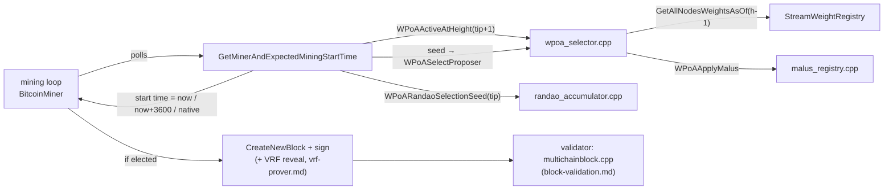

# `miner/miner.cpp` (wPoA Phase 2 parts)

> **Type:** reference · **Register:** technical-direct · **Verified against the code:**
> 2026-09-26, commit `3d2fc551`
>
> The **miner side of the public weighted election** (Phases 2 and 3b): the branch of
> `GetMinerAndExpectedMiningStartTime` that decides whether this node proposes the next
> height, and the native fallback it shares with the sortition branch. The Phase 4 branch
> that precedes it is in [sortition-miner.md](sortition-miner.md), the RANDAO seed swap in
> [randao-miner.md](randao-miner.md), the VRF reveal at signing in
> [vrf-prover.md](vrf-prover.md). The receiving side is [block-validation.md](block-validation.md).

This is a **modified host file**, not a new module file. Every change is delimited by
`/* MCHN START - wPoA … */ … /* MCHN END */`. The wPoA headers are included at the top:

```cpp
#include "wpoa/wpoa_selector.h"      // WPoAActiveAtHeight, WPoASelectProposer, WPoAShouldFallBackToNative
#include "wpoa/vrf_wrapper.h"        // WPoAVRF (Phase 3a, see vrf-prover.md)
#include "wpoa/randao_accumulator.h" // WPoARANDAOActiveAtHeight, WPoARandaoSelectionSeed
#include "wpoa/private_sortition.h"  // the Phase 4 branch (see sortition-miner.md)
```

## Table of contents

- [1. Where the change lives and why there](#1-where-the-change-lives-and-why-there)
- [2. The order of the wPoA branches](#2-the-order-of-the-wpoa-branches)
- [3. The Phase 2 branch, step by step](#3-the-phase-2-branch-step-by-step)
  - [Resolving the local mining key](#resolving-the-local-mining-key)
  - [The seed: previous block hash, or the RANDAO seed](#the-seed-previous-block-hash-or-the-randao-seed)
  - [The four outcomes](#the-four-outcomes)
- [4. The native fallback](#4-the-native-fallback)
- [5. Connections to the other files](#5-connections-to-the-other-files)

---

## 1. Where the change lives and why there

```cpp
double GetMinerAndExpectedMiningStartTime(
    CWallet *pwallet, CPubKey *lpkMiner, set<CTxDestination> *lpsMinerPool,
    double *lpdMiningStartTime, double *lpdActiveMiners, uint256 *lphLastBlockHash,
    int *lpnMemPoolSize, double wAvBlockTime)
```

This function answers the miner loop's core question: **"when should this node try to mine
the next block, and with which key?"** It returns a mining *start time* (seconds, as
`mc_TimeNowAsDouble()` produces) through `*lpdMiningStartTime` and directly; the mining loop
in `BitcoinMiner` sleeps until then:

```cpp
if(mc_TimeNowAsDouble() < GetMinerAndExpectedMiningStartTime(pwallet, &kMiner, ...))
    ... // not yet time to mine
```

So to control **whether and when** this node mines, a wPoA branch sets the start time to
*now* (mine immediately), *parent.nTime + D* (the sortition delay, counted from the
parent's timestamp: [sortition-miner.md §1](sortition-miner.md#1-score-timed-self-election-getminerandexpectedminingstarttime)),
or *now + 3600 s* ("don't mine; wait for the tip to change"). This is exactly the lever the native round-robin schedule
uses; the wPoA branches **replace** it on governed heights without changing the function's
contract.

The function caches its decision per tip: while `*lphLastBlockHash` equals the current tip
hash (and the mempool condition holds), it returns the previous start time without
recomputing. That is why the `+3600` sentinel is cheap — the node stays idle until the tip
advances, at which point the decision is recomputed.

## 2. The order of the wPoA branches

In source order, after `pindexTip = chainActive.Tip()`:

1. **Already-proposed guard** (Phase 4, before the cache) — see
   [sortition-miner.md](sortition-miner.md).
2. The **per-tip cache** return.
3. The native POW / genesis fast path (`Interval() > 0` or the first block).
4. **Phase 4 sortition branch**, if `WPoASortitionActiveAtHeight(tip+1)` —
   [sortition-miner.md](sortition-miner.md). It comes first because sortition heights are a
   strict subset of wPoA heights.
5. **Phase 2/3b public-election branch**, if `WPoAActiveAtHeight(tip+1)` — this document.
6. The label **`wpoa_native_fallback:`**, followed by the unchanged native timing code.

## 3. The Phase 2 branch, step by step

```cpp
/* MCHN START - wPoA Phase 2: weighted proposer election */
if(WPoAActiveAtHeight(pindexTip->nHeight + 1))
{
    pwallet->GetKeyFromAddressBook(kThisMiner,MC_PTP_MINE);
    *lpkMiner=kThisMiner;

    int nWPoAHeight=pindexTip->nHeight+1;
    if(!kThisMiner.IsValid())
    {
        *lpdMiningStartTime=mc_TimeNowAsDouble()+3600;               // no mining key: idle
        return *lpdMiningStartTime;
    }

    std::string sLocalAddr=CBitcoinAddress(kThisMiner.GetID()).ToString();

    uint256 hWPoASeed=pindexTip->GetBlockHash();                     // Phase 2 seed
    unsigned char randao_seed[32];
    if(WPoARANDAOActiveAtHeight(nWPoAHeight) && WPoARandaoSelectionSeed(pindexTip,randao_seed))
    {
        memcpy(hWPoASeed.begin(),randao_seed,sizeof(randao_seed));   // Phase 3b seed
    }
    std::string sProposer=WPoASelectProposer(hWPoASeed.begin(),hWPoASeed.size(),nWPoAHeight);

    if(WPoAShouldFallBackToNative(!sProposer.empty(),WPoAEverElectable()))
    {
        goto wpoa_native_fallback;                                   // bootstrap window
    }
    else if(!sProposer.empty() && sProposer==sLocalAddr)
    {
        *lpdMiningStartTime=mc_TimeNowAsDouble();                    // elected: mine now
        return *lpdMiningStartTime;
    }
    else
    {
        if(sProposer.empty())
            LogPrintf("[wPoA] height %d: wPoA is active but NO validator is eligible ...");
        *lpdMiningStartTime=mc_TimeNowAsDouble()+3600;               // not our slot
        return *lpdMiningStartTime;
    }
}
/* MCHN END */
```

`WPoAActiveAtHeight(tip+1)` is a pure function of the flags, the chain parameters and the
height ([wpoa-selector.md §3.3](wpoa-selector.md#33-wpoaactiveatheight--the-activation-predicate)),
so the miner asking about `tip+1` and the validator asking about the received block's
height always agree on whether wPoA governs it. When it is false the branch is skipped and
the native code runs unchanged.

### Resolving the local mining key

- `GetKeyFromAddressBook(kThisMiner, MC_PTP_MINE)` fills `kThisMiner` with a wallet key
  that holds **mine** — this node's validator identity. On a governed height it finds the
  key even if the native round-robin spacing would bar it, because the diversity hook
  neutralises the spacing at its source
  ([wpoa-selector.md §3.3bis](wpoa-selector.md#33bis-the-mining-diversity-hook)).
- `*lpkMiner = kThisMiner` publishes the key back to the caller on every return path.
- With no mine-permissioned key the node cannot be elected: start time `now + 3600`.

### The seed: previous block hash, or the RANDAO seed

- `sLocalAddr` renders this node's address exactly as the registry stores it
  (`CBitcoinAddress(pubkey.GetID()).ToString()`); it must match the registry key format, or
  `sProposer == sLocalAddr` could never be true.
- The Phase 2 seed is the hash of the current tip (block `h−1` for the block `h` being
  mined). When the RANDAO beacon governs the height, it is replaced by
  `seed[n+1] = H(R_tot[n−k] ‖ h[n] ‖ n+1)` — the only change Phase 3b makes on this side
  ([randao-miner.md](randao-miner.md)).
- `WPoASelectProposer(seed, 32, height)` reads the registry **as of `height − 1`**, applies
  the malus (`w_eff = w · Ψ`) and the configured damping, and returns the argmin
  ([wpoa-selector.md §3.4](wpoa-selector.md#34-wpoaselectproposer--registry-backed-election)).
  The validator replays the same call on the same prefix.

### The four outcomes

| Condition | Start time | Why |
|---|---|---|
| no proposer **and** the registry has never carried a positive weight | native schedule (`goto wpoa_native_fallback`) | The bootstrap window: the engine cannot publish before an epoch buries, and the epoch needs the blocks this decision would refuse to produce. |
| this node is the proposer | now | Phase 2 is deterministic — one proposer per height — so there is no contention to stagger. |
| no proposer, but wPoA was active before | now + 3600, plus an unconditional log line | Every effective weight is 0: a legitimate outcome of a weighted election, not a stall to route around. |
| another node is the proposer | now + 3600 | Not our slot; the cache keeps the node idle until the tip advances. |

The first two rows are decided by `WPoAShouldFallBackToNative(proposer_found, ever_electable)`,
a pure predicate unit-tested in the `activation` suite.

## 4. The native fallback

```cpp
wpoa_native_fallback:

    nMiningStatus &= MC_MST_PROC_MASK;
    dMinerDrift=Params().MiningTurnover();
    ...
```

Both wPoA branches jump here while the protocol has not activated yet, so a clean chain
keeps producing blocks under the native rules until the first weight confirms. A label was
chosen instead of restructuring the function: the two branches sit in separate scopes and
everything after the label is exactly the native path they need. During that window the
diversity hook also stays off, so the native round-robin spacing applies in full.

The resulting regimes:

- wPoA selection **off** → native behaviour, exactly.
- selection **on**, height `< setup-first-blocks` → native (setup phase).
- selection **on**, height `≥ setup-first-blocks`, no positive weight ever confirmed →
  native (deferred activation).
- otherwise → the wPoA branches govern, and exactly one node mines each height (Phase 2/3b)
  or the lowest score mines first (Phase 4).

## 5. Connections to the other files



- **`wpoa/wpoa_selector.h`** — `WPoAActiveAtHeight`, `WPoASelectProposer`,
  `WPoAShouldFallBackToNative`, `WPoAEverElectable`. See [wpoa-selector.md](wpoa-selector.md).
- **`wpoa/randao_accumulator.h`** — the Phase 3b seed. See [randao-miner.md](randao-miner.md).
- **The validator** (`protocol/multichainblock.cpp`) runs the same election on the
  receiving side and rejects any block whose signer is not the elected proposer. See
  [block-validation.md](block-validation.md).
