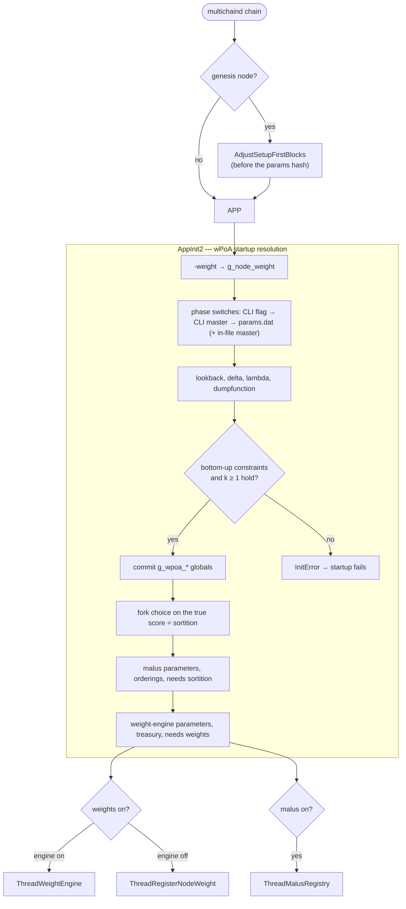

# `core/init.h` + `core/init.cpp` (wPoA parts)

> **Type:** reference · **Register:** technical-direct · **Verified against the code:**
> 2026-09-26, commit `3d2fc551`
>
> How a node reads, resolves, validates and commits the wPoA and weight-engine
> configuration at startup, and which background threads it launches. The parameters
> themselves — names, defaults, ranges — are catalogued only in
> [protocol-parameters.md](protocol-parameters.md); this document explains the mechanism and
> deliberately does not restate them.

`init.cpp` drives the entire MultiChain node bootstrap. The wPoA additions are confined to
four places, all between `/* MCHN START … */` and `/* MCHN END */` markers:

| Where | What |
|---|---|
| includes (`init.cpp:43-48`) | `wpoa/stream_weight_registry.h`, `malus_registry.h`, `wpoa_selector.h`, `randao_accumulator.h`, `private_sortition.h`, `weight_engine/weight_engine.h` — the headers that declare the runtime globals `AppInit2` writes. |
| `HelpMessage` (`init.cpp:569-593`) | One `--help` line per wPoA and weight-engine flag. |
| genesis path (`init.cpp:1762`) | Raises `setup-first-blocks` before the parameter hash is taken ([§3](#3-the-genesis-correction-of-setup-first-blocks)). |
| end of `AppInit2` (`init.cpp:3303`) | The *wPoA startup resolution* block: resolve, validate, commit, launch threads ([§2](#2-the-startup-resolution-block)). |

## Table of contents

- [1. What `init.h` provides](#1-what-inith-provides)
- [2. The startup resolution block](#2-the-startup-resolution-block)
  - [2.1 `-weight`](#21--weight)
  - [2.2 The five phase switches: three levels of precedence](#22-the-five-phase-switches-three-levels-of-precedence)
  - [2.3 Numeric and string parameters](#23-numeric-and-string-parameters)
  - [2.4 Dependency constraints](#24-dependency-constraints)
  - [2.5 Commit, fork choice, divergence warning](#25-commit-fork-choice-divergence-warning)
  - [2.6 The malus block](#26-the-malus-block)
  - [2.7 The weight-engine block](#27-the-weight-engine-block)
  - [2.8 The threads](#28-the-threads)
- [3. The genesis correction of `setup-first-blocks`](#3-the-genesis-correction-of-setup-first-blocks)
- [4. The complete startup flow](#4-the-complete-startup-flow)
- [5. Who writes and who reads the globals](#5-who-writes-and-who-reads-the-globals)
- [Related documents](#related-documents)

---

## 1. What `init.h` provides

`init.h` declares the three node globals the wPoA modules borrow:

```cpp
extern CWallet* pwalletMain;          // the main wallet
extern mc_WalletTxs* pwalletTxsMain;  // the wallet transaction DB
bool ShutdownRequested();             // true once shutdown has been requested
```

- `pwalletMain` — the wallet; used to resolve the node's own address and key.
- `pwalletTxsMain` — the wallet transaction database, the "borrowed" pointer passed to
  `StreamWeightRegistry`, `MalusRegistry` and `WeightStreamReader` for every stream read.
- `ShutdownRequested()` — the exit condition of every wPoA background loop.

`AppInit2(boost::thread_group& threadGroup, …)` is the startup function; `threadGroup` is
the container every wPoA thread is attached to, so each one is interrupted and joined
cleanly at shutdown.

## 2. The startup resolution block

The whole block is inside `#ifdef ENABLE_WALLET`: every wPoA path needs a wallet to sign and
pay for its transactions, and the RPCs in `rpclist.cpp` sit behind the same guard. It runs
at the very end of `AppInit2`, after the chain and wallet are loaded and before any block is
mined or validated, so every global it writes is written once, on the init thread, before
any reader exists — none of them needs a lock.

### 2.1 `-weight`

```cpp
int64_t weight_arg = GetArg("-weight", MC_WPOA_DEFAULT_WEIGHT);
if (weight_arg <= 0)
    return InitError(strprintf(_("Invalid -weight value %d: must be a positive integer."), weight_arg));
g_node_weight = (uint32_t)weight_arg;
```

The one per-node parameter: each validator sets its own, so it is a plain runtime flag and
never a chain parameter. `g_node_weight` is consumed only by the static publication thread
([§2.8](#28-the-threads)); no consensus path reads it.

### 2.2 The five phase switches: three levels of precedence

Every switch is a hash-enforced chain parameter inherited through `params.dat`, so a node
that joins an existing network needs no wPoA flags. The block first reads the file's values
(`np->GetInt64Param("enablewpoaweights")` and siblings), then resolves each phase in this
order — **the first that applies wins**:

1. an explicit runtime phase flag (`-enablewpoaselection=0`);
2. the runtime master `-enablewpoa` / `-wpoaenable`, if present — true forces every phase
   on, false forces the baseline off;
3. the `params.dat` value, **after** the in-file master expansion: if the file carries
   `enable-wpoa = true`, every phase still at its default is turned on.

The in-file expansion exists because the master used to expand only in
`mc_MultichainParams::Read` — that is, only when it arrived as a flag to
`multichain-util create`. A hand-written `params.dat` with `enable-wpoa = true` was parsed,
hashed, echoed by `getblockchainparams`, and inert. The one case the file cannot express is
a phase written explicitly `false` next to a true master: both read as the default, so the
master wins, and a per-node exception is what the runtime flags are for. Detail and the log
line to look for: [protocol-parameters.md §1bis](protocol-parameters.md#1bis-the-master-switch-and-how-it-expands).

### 2.3 Numeric and string parameters

Same rule, simpler: the `params.dat` value is the default, a matching runtime flag
overrides it.

- `-wpoarandaolookback` — an integer read with `GetArg`, range-checked.
- `-wpoasortitiondelta`, `-wpoasortitionlambda` — real-valued, so they travel as
  `MC_PRM_STRING` and go through two static helpers shared with the malus and weight-engine
  blocks: `ResolveWeightRealStr` (`init.cpp:797`) returns the runtime flag if present, else
  the `params.dat` string, else the compile-time default; `ParseWeightDouble`
  (`init.cpp:813`) parses it NaN/Inf-safely. A non-finite or out-of-range value is an
  `InitError`, never propagated.
- `-dumpfunction` — a string, `none` / `sqrt` / `log`, compared case-insensitively
  (`boost::iequals`). Any other value is an `InitError`: the damping function is
  consensus-critical, so a typo must be loud rather than a silent divergence.

### 2.4 Dependency constraints

```cpp
if (selection || vrf || randao || sortition) weights = true;

if (selection && !weights)  return InitError(...);   // selection requires weights
if (vrf && !selection)      return InitError(...);   // vrf requires selection
if (randao && !vrf)         return InitError(...);   // randao requires vrf
if (sortition && !randao)   return InitError(...);   // sortition requires randao
if (sortition && randao_k < 1) return InitError(...); // k = 0 would make the seed circular
```

Any higher phase implies the weights stream. Every other violation refuses to start rather
than run a phase inert — the same rule `mc_MultichainParams::Read` applies at chain
creation, so a contradictory configuration fails at both ends. The `k ≥ 1` guard is the
circularity guard: the sortition reveal `R[n]` feeds `R_tot[n]`, while its own seed reads
`R_tot[n-k]`.

### 2.5 Commit, fork choice, divergence warning

The resolved values are committed to the runtime globals the miner and validator read:
`g_wpoa_weights_enabled`, `g_wpoa_enabled` (Phase 2 selection), `g_wpoa_vrf_enabled`,
`g_wpoa_randao_enabled`, `g_wpoa_randao_lookback`, `g_wpoa_sortition_enabled`,
`g_wpoa_sortition_delta`, `g_wpoa_sortition_lambda`, `g_dumping_function`.

Then the fork choice, which is not a switch at all:

```cpp
g_wpoa_fork_score_enabled = sortition;
```

Fork choice on the true sortition score is on whenever private sortition is. It has no flag,
because the score-aware activation ([score-aware-activation.md](score-aware-activation.md))
depends on it. It does not change which blocks are valid, so it has no `params.dat` field
either. It is committed here, once, before any block is processed: the chain comparator
reads it unlocked, and flipping it later would reorder a live `std::set`.

Finally, if any resolved phase differs from the `params.dat` value, the node logs a loud
`[wPoA] WARNING: runtime flags override the inherited chain configuration …` naming both
sets. The switches are consensus-critical, so such an override forks the node — but it is
not prevented, because isolated tests legitimately use it. The effective configuration is
always logged:

```
[wPoA] weights-stream ON; weighted-selection ON; VRF ON; RANDAO ON (k=1); sortition ON (delta=0.5, lambda=0); dumping=none
```

### 2.6 The malus block

Resolved exactly like the phase switches. `enablewpoamalus` is also expanded by the in-file
master — the creation-time expansion covers the malus, so the in-file one must too, or the
two paths would produce different chains from the same file. The six real parameters go
through `ResolveWeightRealStr` / `ParseWeightDouble`; then:

- `p(equiv) > p(delay)` and `p(badweight) > p(selfwrite)` are enforced (`InitError`);
- the malus requires sortition (`InitError`): the behavioural kinds are proved against the
  block's VRF reveal over the beacon seed;
- the values are committed to `g_wpoa_malus_*`, with the same divergence warning;
- if the weight engine is off, a `NOTE` explains that `selfwrite` on membership and
  `badweight` cannot be decided on this chain. The note resolves the weight-engine switch
  from the parameter and the flag directly, because `g_weight_engine_enabled` is still at
  its default at this point — the weight-engine block runs later.

### 2.7 The weight-engine block

`-enableweightengine`, `-weightepochlength`, `-weightkappa`, `-weightalpha`,
`-weightlambda`, `-weighttreasuryaddress`: `params.dat` baseline, runtime override,
range-checked. The non-obvious steps:

- **Treasury.** Empty is legal (`R_k = 0` for every cluster, a uniform scaling that leaves
  the election unchanged). A non-empty value must be a valid address. If the address does
  not hold a **confirmed** `receive` permission, the node warns: every restitution to it
  would fail with `-704` and the feedback loop would be silently inert. The usual cause is
  restarting to install the parameter before the grant was mined
  ([weight-engine.md §5bis](weight-engine.md#5bis-two-operational-orderings-that-fail-silently)).
- **Requires the weights stream** (`InitError` otherwise).
- **Bootstrap-ordering warning.** If `weight-epoch-length + 6 - 1 >= setup-first-blocks`,
  the node warns that a clean network would stall at `setup-first-blocks`. A warning, not an
  error: a node joining a chain already past that height must still start. On a chain
  created with this code the genesis correction of [§3](#3-the-genesis-correction-of-setup-first-blocks)
  makes the condition impossible, and deferred activation makes it harmless.
- A local override of any engine parameter is logged as a consensus-divergence warning.

### 2.8 The threads

```cpp
if (g_wpoa_weights_enabled && pwalletMain && pwalletTxsMain && !fDisableWallet)
{
    if (g_weight_engine_enabled)
        threadGroup.create_thread(boost::bind(&ThreadWeightEngine));                     // dynamic w_k
    else
        threadGroup.create_thread(boost::bind(&ThreadRegisterNodeWeight, g_node_weight)); // static weight
}
if (g_wpoa_malus_enabled && pwalletMain && pwalletTxsMain && !fDisableWallet)
    threadGroup.create_thread(boost::bind(&ThreadMalusRegistry));
```

- **One publication thread, never two.** With the engine on, `-weight` is parsed and logged
  but never published; there is no runtime overwrite. Both threads write the same
  `wpoa-weights` stream, whose reads are newest-confirmed-wins, so consensus is indifferent
  to which one produced a record.
- **Why threads.** Publishing is a transaction: it needs the wallet, permissions, the stream
  and connectivity, none of which is guaranteed at startup. A background loop retries until
  they are, and `AppInit2` never blocks on it.
- **`ThreadMalusRegistry`** only provisions the open malus stream (create or subscribe);
  reporting is on demand, through `reportmalus`.
- Phases 2–4 and the fork-choice flag launch **no** thread: they set globals the miner and
  validator consult per block.

## 3. The genesis correction of `setup-first-blocks`

On the genesis node only, just before `Build()` computes the parameter hash
(`init.cpp:1762`), `AppInit2` resolves whether the weight engine and selection will run and
calls `mc_MultichainParams::AdjustSetupFirstBlocks(we_on, sel_on, …)`
([`params.cpp`](../src/chainparams/params.cpp)). If both are on and `setup-first-blocks` is
below `weight-epoch-length + 9`, the value is raised in the parameter store, so the
corrected value becomes part of the chain's identity and every joining node inherits it.
Rewriting it on a running chain would be a fork, hence the genesis-only placement. The
formula and its rationale: [protocol-parameters.md §1ter](protocol-parameters.md#1ter-setup-first-blocks-is-derived-not-merely-validated).

The switches are resolved from the command line and `params.dat` here, rather than read
from the file alone, because a genesis node may legitimately start with
`-enableweightengine` on a `params.dat` that still says `false` — exactly the configuration
that would stall.

> **Known gap.** The selection switch at this point honours the runtime master and the
> per-phase keys, but not the *in-file* `enable-wpoa = true` that the resolution block of
> [§2.2](#22-the-five-phase-switches-three-levels-of-precedence) now expands (the comment
> there still says the file's master "is not consulted there either", which is no longer
> true of that block). A hand-written `params.dat` carrying only the master, with the
> weight engine on, therefore skips the correction; deferred activation keeps such a chain
> from stalling, but its setup phase is not lengthened.

## 4. The complete startup flow



## 5. Who writes and who reads the globals

`AppInit2` is the **only** writer of every global below.

| Global | Defined in | Read by |
|---|---|---|
| `g_node_weight` | `stream_weight_registry.cpp` | `ThreadRegisterNodeWeight` only |
| `g_wpoa_weights_enabled` | `stream_weight_registry.cpp` | the thread launch above, the registry's stream setup |
| `g_wpoa_enabled`, `g_dumping_function`, `g_wpoa_vrf_enabled` | `wpoa_selector.cpp` | `WPoAActiveAtHeight`, `WPoAVRFActiveAtHeight`, `ApplyDumping` callers |
| `g_wpoa_randao_enabled`, `g_wpoa_randao_lookback` | `randao_accumulator.cpp` | `WPoARANDAOActiveAtHeight`, `WPoARandaoSelectionSeed` |
| `g_wpoa_sortition_enabled`, `g_wpoa_sortition_delta`, `g_wpoa_sortition_lambda`, `g_wpoa_fork_score_enabled` | `private_sortition.cpp` | `WPoASortitionActiveAtHeight`, the sortition miner and validator paths, `CBlockIndexWorkComparator` |
| `g_wpoa_malus_*` | `malus_registry.cpp` | `WPoAApplyMalus`, the malus predicates |
| `g_weight_engine_enabled`, `g_weight_epoch_length`, `g_weight_kappa`, `g_weight_alpha`, `g_weight_lambda`, `g_weight_treasury_address` | `weight_engine.cpp` | `ThreadWeightEngine`, `WeightStreamReader`, the epoch audit RPCs, `HeightToEpoch` |

The read RPCs (`getlocalweight`, `getallweights`, …) are independent of the threads: they
work before anything has been published, returning 0 or an empty map.

---

## Related documents

- [protocol-parameters.md](protocol-parameters.md) — every parameter, with default, range
  and the `init.cpp` line that validates it.
- [stream-weight-registry.md](stream-weight-registry.md) — `ThreadRegisterNodeWeight` and
  the registry it publishes through.
- [weight-engine.md §4](weight-engine.md#4-the-engine-thread) — `ThreadWeightEngine`.
- [malus-registry.md](malus-registry.md) — `ThreadMalusRegistry` and the malus globals.
- [wpoa-selector.md](wpoa-selector.md), [randao-accumulator.md](randao-accumulator.md),
  [private-sortition.md](private-sortition.md) — the activation predicates that read the
  globals.
- [wpoa-weight-engine-architecture.md §3.1](wpoa-weight-engine-architecture.md#31-parameters-paramsdat-as-the-source-cli-as-the-override)
  and [§7](wpoa-weight-engine-architecture.md#7-bootstrap-and-deferred-activation) — the
  design context.
- [../src/wpoa/README.md](../src/wpoa/README.md) — feature entry point.
