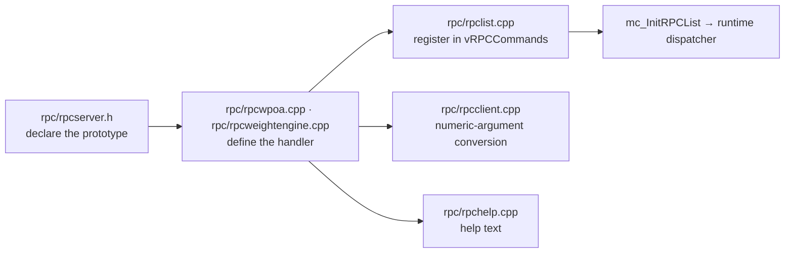

# `rpc/rpclist.cpp` and friends (wPoA and weight-engine parts)

> **Type:** reference · **Register:** technical-direct · **Verified against the code:**
> 2026-09-25, commit `af06a6ef`
>
> How the wPoA and weight-engine RPC commands enter the node: where the handlers live, how
> they are registered in the dispatch table, which flags each family carries and why, and
> the two other tables an RPC with a numeric argument must appear in. What each command
> **returns** is in [rpc-result-shapes.md](rpc-result-shapes.md); the rest of `rpclist.cpp`
> is MultiChain's standard command table and is not detailed.

## Table of contents

- [1. What the dispatch table is](#1-what-the-dispatch-table-is)
- [2. The four files an RPC touches](#2-the-four-files-an-rpc-touches)
- [3. The registered commands](#3-the-registered-commands)
  - [3.1 Registries and weight-engine inputs](#31-registries-and-weight-engine-inputs)
  - [3.2 Read-only audit families](#32-read-only-audit-families)
  - [3.3 Why the flags differ](#33-why-the-flags-differ)
- [4. Argument conversion and help text](#4-argument-conversion-and-help-text)
- [5. How the table reaches the RPC server](#5-how-the-table-reaches-the-rpc-server)
- [6. Adding a command](#6-adding-a-command)
- [Related documents](#related-documents)

---

## 1. What the dispatch table is

`rpclist.cpp` holds the **dispatch table** of every RPC command in the node: the map
"textual command name → C++ function that implements it". When a client sends a call
(e.g. `getallweights`), the RPC server looks the name up and invokes the function.

```cpp
static const CRPCCommand vRPCCommands[] =
{ //  category    name            actor (function)   okSafeMode  threadSafe  reqWallet
  ...
};
```

| Field | Meaning |
|---|---|
| `category` | Category shown in `help` (groups the commands). |
| `name` | The textual command name invoked by the client. |
| `actor` | Pointer to the handler (signature `Value f(const Array&, bool fHelp)`). |
| `okSafeMode` | Whether the command may run in safe mode. |
| `threadSafe` | Whether it runs **without** the dispatcher's global lock (it manages its own locking). |
| `reqWallet` | Whether it requires an enabled wallet. |

## 2. The four files an RPC touches



- **Prototypes** — `rpc/rpcserver.h`, with every other RPC prototype in the node.
  `rpclist.cpp` includes only that header, so it stays a pure dispatch table with no module
  includes.
- **Handlers** — one `.cpp` per command family, MultiChain's own convention:
  [`rpc/rpcwpoa.cpp`](../src/rpc/rpcwpoa.cpp) for the `wpoa` category (registries, malus,
  round audit) and [`rpc/rpcweightengine.cpp`](../src/rpc/rpcweightengine.cpp) for the
  `weight` category (inputs, verification, epoch audit). The modules themselves
  (`wpoa/*`, `weight_engine/*`) carry no RPC code: they expose a C++ API and the handlers
  are one of its callers.
- **Registration** — `rpc/rpclist.cpp`, inside `#ifdef ENABLE_WALLET`: every one of these
  commands reads or writes through the wallet.
- **Conversion and help** — `rpc/rpcclient.cpp` and `rpc/rpchelp.cpp` (§4).

## 3. The registered commands

### 3.1 Registries and weight-engine inputs

```cpp
#ifdef ENABLE_WALLET
    /* wPoA weight registry (Phase 1) */
    { "wpoa",   "getlocalweight",           &getlocalweight,           true,  true,  true },
    { "wpoa",   "getallweights",            &getallweights,            true,  true,  true },
    { "wpoa",   "getnodeweight",            &getnodeweight,            true,  true,  true },
    /* wPoA behavioural malus registry — reads are open, reporting is a write */
    { "wpoa",   "getallmalus",              &getallmalus,              true,  true,  true },
    { "wpoa",   "getnodemalus",             &getnodemalus,             true,  true,  true },
    { "wpoa",   "reportmalus",              &reportmalus,              false, false, true },
    /* WeightEngine inputs — write, wallet-backed */
    { "weight", "weightsetesg",             &weightsetesg,             false, false, true },
    { "weight", "weightregistermembership", &weightregistermembership, false, false, true },
    /* Independent verification of the published weights — a read, open to anyone */
    { "weight", "weightverifyweights",      &weightverifyweights,      true,  true,  true },
```

| Command | What it does | Detail |
|---|---|---|
| `getlocalweight`, `getnodeweight`, `getallweights` | The confirmed weight registry, current view. | [stream-weight-registry.md §2.10](stream-weight-registry.md#210-the-three-rpc-functions-defined-in-rpcrpcwpoacpp) |
| `getallmalus`, `getnodemalus` | `M`, `Ψ`, raw and effective weight, exclusion flag, epochs to clear. | [malus-registry.md §9](malus-registry.md#9-rpc-surface) |
| `reportmalus` | Re-verifies an accusation locally, then publishes it on the open malus stream. | [malus-registry.md §9](malus-registry.md#9-rpc-surface) |
| `weightsetesg` | Publishes a certified ESG score; **Certification Authority** (`high1`) only. | [weight-engine.md §6.2](weight-engine.md#62-application-layer--per-stream-not-uniform) |
| `weightregistermembership` | Publishes the caller's own cluster membership; no privilege. | [weight-engine.md §2.2](weight-engine.md#22-membership-is-self-attested-and-the-key-is-the-declaring-node) |
| `weightverifyweights` | Recomputes every cluster and reports the verdict on each published weight. | [weight-engine.md §5.1](weight-engine.md#51-every-node-publishes-its-own-weight-and-every-node-checks-the-others) |

No command in the `weight` category requires global `admin`. `tau` and `R_k` have no write
path at all: both are derived from the blocks.

### 3.2 Read-only audit families

Every quantity the consensus derives for a round or an epoch can be inspected, through the
**same** functions the consensus path uses (`WPoABuildRoundContext` for a round,
`WeightEngineComputeEpochDetail` for an epoch), so an inspection cannot report a number the
consensus would not have computed. Each family comes as *local* (this node), *node*
(a named address) and *list* (every validator or cluster).

| Category | Family | Commands | Optional argument |
|---|---|---|---|
| `wpoa` | score | `wpoagetlocalscore`, `wpoagetnodescore`, `wpoalistscores` | `height` |
| `wpoa` | delay | `wpoagetlocaldelay`, `wpoagetnodedelay`, `wpoalistdelays` | `height` |
| `wpoa` | effective weight (`w · Ψ`) | `wpoagetlocaleffectiveweight`, `wpoagetnodeeffectiveweight`, `wpoalisteffectiveweights` | `height` |
| `wpoa` | final weight (`f(w · Ψ)`) | `wpoagetlocalfinalweight`, `wpoagetnodefinalweight`, `wpoalistfinalweights` | `height` |
| `wpoa` | block sortition | `wpoagetblocksortition`, `wpoalistblocksortition` | height / range |
| `weight` | contribution `c_i` | `weightgetlocalcontribution`, `weightgetnodecontribution`, `weightlistcontributions` | `epoch` |
| `weight` | cluster weight | `weightgetlocalclusterweight`, `weightgetnodeclusterweight`, `weightlistclusterweights` | `epoch` |
| `weight` | returns `R_k` | `weightgetlocalreturns`, `weightgetnodereturns`, `weightlistreturns` | `epoch` |
| `weight` | earnings (gain) | `weightgetlocalearnings`, `weightgetnodeearnings`, `weightlistearnings` | `epoch` |
| `weight` | balance `saldo_k` | `weightgetlocalbalance`, `weightgetnodebalance`, `weightlistbalances` | `epoch` |

- The round audit reads the registry **as of the audited height − 1**, like the consensus
  path; the score it reports is the **public** Efraimidis–Spirakis form, since a peer's
  private VRF score cannot be computed by anyone else. The block-sortition pair reads the
  reveal a block actually carried (`WPoAExtractBlockReveal`) and re-scores it.
- The epoch audit refuses an epoch that is not yet buried (`LastBuriedEpoch`), the same
  finality bound the publishing thread uses.
- Unit-tested through their pure cores in the `audit` (wPoA) and `epoch` (weight engine)
  suites.

### 3.3 Why the flags differ

| Commands | `okSafeMode` | `threadSafe` | Why |
|---|---|---|---|
| registry and malus reads, `weightverifyweights` | true | **true** | The registries' read methods self-lock (`mc_WalletTxs::Lock()`/`UnLock()` around `FindEntity`, then the self-locking non-WRP list API), so they can run concurrently. |
| `reportmalus`, `weightsetesg`, `weightregistermembership` | **false** | **false** | They build and broadcast a transaction. |
| `wpoa*` round audit | true | **false** | They walk the block index (beacon seed, feedback window), which is `cs_main`-protected and not self-locking, so they run under the dispatcher's lock. |
| `weight*` epoch audit | true | **true** | They drive `WeightStreamReader`, which takes `cs_main` itself for a short snapshot and must **not** hold it across the epoch fold — exactly as the publishing thread runs it. |

All of them have `reqWallet = true`: the reads use `pwalletTxsMain`, and each handler throws
`RPC_WALLET_ERROR` when the wallet is unavailable.

## 4. Argument conversion and help text

`multichain-cli` passes every argument as a string unless `rpc/rpcclient.cpp` says
otherwise. The audit commands take an optional numeric `height` or `epoch`, so each one is
listed in the conversion table with the index of that argument — `0` for the *local* and
*list* forms, `1` for the *node* forms, whose first argument is the address:

```cpp
/* MCHN START -- wPoA/weightengine audit RPCs: the optional height / epoch */
    { "wpoagetlocalscore", 0 },
    { "wpoalistscores", 0 },
    ...
    { "wpoagetnodescore", 1 },
    { "weightgetnodecontribution", 1 },
    ...
/* MCHN END */
```

Forgetting this row makes the CLI send `"123"` instead of `123`, and the handler rejects it.
The help text for every audit command lives in `rpc/rpchelp.cpp`, in
`mc_InitRPCHelpMap26()`; `multichaind --help` / `help <command>` read it from there.

## 5. How the table reaches the RPC server

```cpp
void mc_InitRPCList(std::vector<CRPCCommand>& vStaticRPCCommands,
                    std::vector<CRPCCommand>& vStaticRPCWalletReadCommands)
{
    ...
    for (vcidx = 0; vcidx < (sizeof(vRPCCommands)/sizeof(vRPCCommands[0])); vcidx++)
        vStaticRPCCommands.push_back(vRPCCommands[vcidx]);
    ...
}
```

`mc_InitRPCList` runs at RPC-server startup and copies the static array into the vector the
dispatcher uses at runtime. `sizeof(vRPCCommands) / sizeof(vRPCCommands[0])` is the classic
C idiom for the element count of an array.

## 6. Adding a command

1. **Declare** the handler in `rpc/rpcserver.h`.
2. **Define** it in the `.cpp` of its family (`rpc/rpcwpoa.cpp` or
   `rpc/rpcweightengine.cpp`).
3. **Register** it in `vRPCCommands`, inside `#ifdef ENABLE_WALLET`, with flags chosen as
   in §3.3.
4. If it takes a numeric argument, add it to the conversion table in `rpc/rpcclient.cpp`.
5. Add its help text in `rpc/rpchelp.cpp`.
6. Document its result shape in [rpc-result-shapes.md](rpc-result-shapes.md).

A new `.cpp` also needs one line in `libbitcoin_wallet_a_SOURCES`
([`src/Makefile.am`](../src/Makefile.am)) — the wallet library, because these handlers
require the wallet — followed by `automake --foreign src/Makefile` ([testing.md §1](testing.md#1-building)).

---

## Related documents

- [rpc-result-shapes.md](rpc-result-shapes.md) — what each command returns.
- [stream-weight-registry.md](stream-weight-registry.md) — the weight-registry handlers and
  read internals.
- [malus-registry.md](malus-registry.md) — the malus handlers.
- [weight-engine.md](weight-engine.md) — the weight-engine handlers.
- [node-startup.md](node-startup.md) — the independent startup path of the threads.
