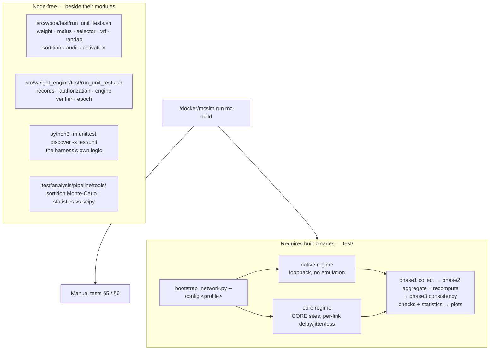
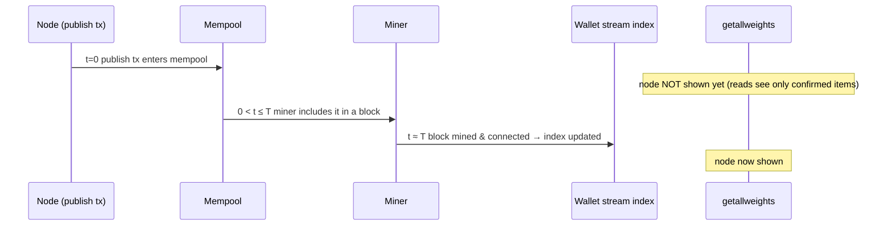

# wPoA + Weight Engine — Testing Guide

> **Type:** reference · **Register:** technical-direct · **Verified against the code:**
> 2026-09-26, commit `3d2fc551`
>
> How to build the node, run the node-free unit suites, run a full network through the
> harness in [`test/`](../test/README.md), and check things by hand — plus the MultiChain
> mining model that explains why reads lag writes. The harness has its own, more detailed
> documentation under `test/`; this page is the map and the manual-testing companion.

Throughout, `CHAIN` is the blockchain name and the binaries are in `./src`
(`multichaind`, `multichain-cli`, `multichain-util`).

## Table of contents

- [Test layers at a glance](#test-layers-at-a-glance)
- [1. Building](#1-building)
- [2. Unit tests](#2-unit-tests)
- [3. The network harness](#3-the-network-harness)
- [4. How MultiChain mining works](#4-how-multichain-mining-works)
  - [4.1 Proof-of-Authority and the native rules](#41-proof-of-authority-and-the-native-rules)
  - [4.2 The lifecycle of a weight registration](#42-the-lifecycle-of-a-weight-registration)
  - [4.3 Confirmed vs. unconfirmed — the key point](#43-confirmed-vs-unconfirmed--the-key-point)
- [5. Manual test — single node](#5-manual-test--single-node)
- [6. Manual test — three nodes](#6-manual-test--three-nodes)
- [7. When exactly do records appear?](#7-when-exactly-do-records-appear)
- [8. Troubleshooting](#8-troubleshooting)
  - [Deep debugging: `-wpoadebug`](#deep-debugging--wpoadebug)
- [Related documents](#related-documents)

---

## Test layers at a glance



Unit suites compile the pure headers directly and need no node build. Everything else runs
real `multichaind` processes.

---

## 1. Building

The binaries are built against Ubuntu 22.04 with GCC 11 and Boost 1.74 and do not run on
an arbitrary host, so building and running go through the project's container:

```bash
./docker/mcsim preflight          # can this container do it?
./docker/mcsim run mc-build       # compile MultiChain into src/
./docker/mcsim shell              # a shell inside the same environment
```

Inside the container, the usual autotools targets apply. To rebuild one translation unit
while iterating, name its object file — the targets carry the per-library prefix automake
generates, which is not obvious from the source path:

```bash
cd src
make weight_engine/libbitcoin_wallet_a-weight_engine.o      # weight layer
make wpoa/libbitcoin_wallet_a-malus_registry.o              # consensus layer
make core/libbitcoin_server_a-init.o                        # parameter resolution
make multichaind multichain-cli multichain-util             # the three binaries
```

> **After adding or removing a source file** in `src/Makefile.am`, regenerate the
> gitignored `src/Makefile.in` before `make` will see it (`automake --foreign src/Makefile`).
> Forgetting this produces a link error naming a symbol whose `.cpp` exists — the object
> was simply never compiled.

> **The binary must be newer than the RPC layer you want to audit.** Against an older
> `src/multichaind` the round and epoch audit RPCs answer `-32601 Method not found`.

---

## 2. Unit tests

Every module has self-contained Boost.Test suites that do **not** require the node to be
built. Two runners, one per module; each builds and runs all its suites, or a named subset:

```bash
./src/wpoa/test/run_unit_tests.sh                     # every wPoA suite
./src/wpoa/test/run_unit_tests.sh selector vrf        # only these
./src/wpoa/test/run_unit_tests.sh --list              # list the suites
./src/weight_engine/test/run_unit_tests.sh            # every weight-engine suite
```

| Runner | Suite | Covers |
|---|---|---|
| wPoA | `weight` | `weight_record.h`: record parsing, the newest-wins fold, the self-publication predicate. |
| wPoA | `malus` | Record parsing for both families, the four-score dispatch and its ordering, EMA fold, `Ψ`, `w_eff`, reversibility. |
| wPoA | `selector` | The Efraimidis–Spirakis argmin, damping, tie-break, probability preservation over 200k seeds. |
| wPoA | `vrf` | ECVRF/DLEQ prove/verify: roundtrip, determinism, tamper / forgery / cross-key rejection. Links secp256k1. |
| wPoA | `randao` | Fold and seed against an independent reference, order and input sensitivity, chain consistency. |
| wPoA | `sortition` | VRF input encoding, score reuse, the band delay, key dependence, winner-delay uniformity, probability preservation with real keys. Links secp256k1. |
| wPoA | `audit` | The pure core behind the round audit RPCs: `TotalEffectiveWeight`, zero and excluded weights, the composition `f(w·Ψ)`, degenerate delay inputs. |
| wPoA | `activation` | The deferred-activation gate and the stream create/subscribe retry state machine. |
| weight engine | `records` | Chain-derived reconciliation rules, record parsing, the self-attestation rule, cluster inversion. |
| weight engine | `authorization` | The Certification Authority decision table. |
| weight engine | `engine` | The pipeline math: gain, `saldo`, `rho`, per-cluster independence, positivity, `ToIntegerWeight`. |
| weight engine | `verifier` | Exact-equality verification, fail-open, epoch scoping. |
| weight engine | `epoch` | The `LastBuriedEpoch` finality bound and the edge cases of the epoch audit RPCs. |

Expected tail of a passing run:

```text
== unit-test summary ==
  PASSED: weight malus selector vrf randao sortition audit activation
OK — all selected wPoA unit tests passed.
```

The `vrf` and `sortition` suites link `src/secp256k1/.libs/libsecp256k1.a`, which a normal
node build produces once. Per-suite detail: [weight-engine.md §9.1](weight-engine.md#91-tests)
for the weight engine, the module references for wPoA.

The harness has its own Python unit tests (configuration, fabric, malicious-miner logic,
malus statistics, the fork-score default), which need no chain either:

```bash
python3 -m unittest discover -s test/unit
```

---

## 3. The network harness

End-to-end testing runs real `multichaind` processes through the Python harness in
[`test/`](../test/README.md). It takes a network from bootstrap to a statistical report in
one command, in one of two regimes chosen by the profile:

| Regime | Nodes | Network |
|---|---|---|
| `native` | one host, loopback | no emulation — the correctness baseline |
| `core` | one CORE namespace per site of a map | per-link delay, jitter, loss, capacity |

```bash
# bootstrap -> traffic -> shutdown -> phase1 -> phase2 -> phase3 -> plots
./docker/mcsim run python3 test/bootstrap/bootstrap_network.py \
    --config test/config/profiles/native/small.yaml

# the same on an emulated map: 4 nodes, 3 sites
./docker/mcsim run python3 test/bootstrap/bootstrap_network.py \
    --config test/config/profiles/core/smoke.yaml

# validate a profile and print the derived plan, without touching a chain
./docker/mcsim run python3 test/bootstrap/bootstrap_network.py \
    --config test/config/profiles/native/small.yaml --dry-run
```

Every chain the harness creates runs the complete stack — weights → selection → VRF →
RANDAO → sortition → malus, with the weight engine on, and with it the score-based fork
choice and the score-aware activation, which have no switch. `runtime.fork_score_log`
(default on) keeps their per-candidate log; the former `runtime.fork_score` key is refused.
A `malicious`
section in the profile turns chosen miners into `selfwrite` / `badweight` attackers and adds
an honest detector, so the malus can be measured end to end; `equiv` and `delay` are
produced inside the consensus core and cannot be injected from outside.

A run writes `test/results/run-<chain>-<UTC>/` and ends in `analysis/phase3/report.md`.
Phase 3 opens with consistency checks; the **critical** ones fail the run:

| Check | Critical | What it catches |
|---|---|---|
| `registry_weights_finite_and_positive` | yes | a NaN or negative in the published registry |
| `no_phantom_validator_in_registry` | yes | an address carrying a weight that `listminers` does not know |
| `malus_finite_and_psi_in_unit_interval` | yes | `Ψ` outside `[0, 1]` |
| `delay_recompute_mismatch_rounds_is_zero` | yes | the harness and the node disagreeing about the delay formula itself |
| `every_esg_publication_reached_the_stream` | yes | an ESG score published but never confirmed |
| `only_miners_pay_the_treasury` | yes | a non-miner paying the treasury, which credits a key no cluster reads |
| `at_least_one_fully_measured_epoch` | yes | a run too short, or entirely inside the setup phase, to test anything |
| `phi_consistent` | no | `Φ` differing across rounds — expected once the feedback gain is non-zero |
| `certified_scores_reflected_in_the_engine` | no | a certified address the engine still scores at 0 |
| `traffic_counts_within_configured_range` | no | a company generating outside its configured band |
| `malus_psi_in_unit_interval`, `malus_effective_weight_matches_recompute`, `malus_clean_validator_has_psi_one`, `malus_detector_no_false_positives` | yes | *(malicious runs only)* the malus diverging from its recomputation, touching an honest validator, or a false report |
| `malus_confirmed_actions_were_detected` | no | *(malicious runs only)* a confirmed attack the detector missed |

Two node-free tools are the cheapest thing to run before a long network run:

```bash
./docker/mcsim run python3 test/analysis/pipeline/tools/valida_sortition_montecarlo.py
./docker/mcsim run python3 test/analysis/pipeline/tools/verify_stat_closed_forms.py
```

Profiles, run layout, roles, the three analysis phases and the pitfalls met while building
the harness: [`test/README.md`](../test/README.md),
[`test/config/schema.md`](../test/config/schema.md),
[`test/docs/core-fabric.md`](../test/docs/core-fabric.md) and
[`test/docs/malicious-miners.md`](../test/docs/malicious-miners.md).

---

## 4. How MultiChain mining works

This matters because **registering a weight is a transaction**, and a transaction is only
visible to the read API once it is **mined into a block**.

### 4.1 Proof-of-Authority and the native rules

MultiChain does not use hash-based PoW. Blocks are produced by addresses that hold the
**`mine` permission**. Under the native rules they take turns; under wPoA, on governed
heights, the proposer is elected by weight instead
([wpoa-weight-engine-architecture.md](wpoa-weight-engine-architecture.md)). The native
parameters that matter for testing (MultiChain defaults shown):

| Parameter | Default | Meaning |
|---|---|---|
| `target-block-time` | 15 s | Target delay between blocks; also the centre of the Phase 4 delay band. |
| `setup-first-blocks` | 60 | Initial phase where `mining-diversity`, `admin-consensus-*` and `mining-requires-peers` are relaxed. Raised at genesis when the weight engine and selection are on ([protocol-parameters.md §1ter](protocol-parameters.md#1ter-setup-first-blocks-is-derived-not-merely-validated)). |
| `mining-requires-peers` | true | A node won't mine unless it has peers — ignored if there is only one permitted miner. |
| `mining-diversity` | 0.3 | A miner must wait `mining-diversity × (active miners)` blocks before mining again. Neutralised on wPoA-governed heights, but binding before activation — at `0.3` it masks the weighted election during bootstrap, which is why the harness profiles ship `0`. |
| `mine-empty-rounds` | 10 | Mine at most this many rounds of empty blocks, then pause and wait for a transaction. |

### 4.2 The lifecycle of a weight registration

With the weights stream on (`enable-wpoa-weights`) and the weight engine **off**, a node
starting with `-weight=N` launches `ThreadRegisterNodeWeight`, which:

1. **Waits until ready** — a chain tip exists and (unless `-offline`) the initial block
   download has finished. Peers are not required: a single permitted miner can confirm its
   own transactions.
2. **Ensures the stream exists** — if `wpoa-weights` is missing it broadcasts a `create`
   (needs the `create` permission) and retries through the shared bounded state machine; the
   stream is usable only once that transaction **confirms**.
3. **Subscribes** to the stream.
4. **Publishes** its weight record with `publishfrom` its own address — unless the latest
   confirmed weight already equals `N` (idempotent). A static record carries no epoch, so
   the weight engine's verification reports it as `other-epoch` rather than checking it.

With the weight engine **on**, `ThreadWeightEngine` replaces it and publishes the computed
`w_k` once per buried epoch ([weight-engine.md §4](weight-engine.md#4-the-engine-thread));
`-weight` is then never published.

Each step is a transaction a miner must include in a block. An idle chain under
`mine-empty-rounds` may have stopped producing empty blocks, but a new transaction wakes
mining up.

### 4.3 Confirmed vs. unconfirmed — the key point

Every read of the weights (`getlocalweight` / `getallweights` / `getnodeweight`, and the
consensus reads) uses the wallet's **confirmed** stream index, updated when a block is
**connected**. A freshly broadcast transaction sits in the mempool and is not in that
index yet:

> A weight becomes visible only **after the block containing its `publish` transaction has
> been mined and connected** on the node you are querying. The consensus reads go one step
> further and consider only records confirmed at or below `height - 1` of the block being
> produced or validated.

---

## 5. Manual test — single node

The fastest way to see the Phase 1 flow end to end. A single node is the only permitted
miner, so it mines its own `create` and `publish` transactions; as the stream's creator it
also holds `wpoa-weights.write`.

```bash
cd src

# 1. Create the chain with the weights stream on (a chain parameter, fixed at creation).
./multichain-util create wpoa1 -enablewpoaweights=1

# 2. (Optional) speed up mining: edit ~/.multichain/wpoa1/params.dat BEFORE the first
#    multichaind run:
#       target-block-time = 2
#       mine-empty-rounds = 50

# 3. Start the node with a weight.
./multichaind wpoa1 -weight=100 -daemon

# 4. Watch it register (a few block times):
watch -n 2 './multichain-cli wpoa1 getallweights'
```

Within a few block times:

```json
{
  "validators" : 1,
  "total" : 100,
  "weights" : {
    "1Node...address...": 100
  }
}
```

Other views:

```bash
./multichain-cli wpoa1 liststreams                             # "wpoa-weights" exists
./multichain-cli wpoa1 liststreamitems wpoa-weights false 100  # raw items (count defaults to 10)
./multichain-cli wpoa1 getlocalweight                          # this node's weight
```

**Change the weight:** stop the node and restart it with a different value
(`-weight=250`). A new record is appended and, once mined, `getallweights` shows `250`
(newest confirmed wins).

---

## 6. Manual test — three nodes

Weights: node A = 100 (admin), node B = 80, node C = 50, on one machine with separate data
directories and ports.

```bash
cd src
mkdir -p ~/wpoa/A ~/wpoa/B ~/wpoa/C

# Create the chain with the weights stream on; params stored under ~/wpoa/A.
./multichain-util create wpoa3 -datadir=$HOME/wpoa/A -enablewpoaweights=1

# Start node A: it initialises the chain, becomes admin + first miner, creates the
# stream and registers weight 100.
./multichaind wpoa3 -datadir=$HOME/wpoa/A -port=7471 -rpcport=7481 -weight=100 -daemon

# First launch of B: it inherits params.dat, prints its address and exits waiting for
# permission.
./multichaind wpoa3@127.0.0.1:7471 -datadir=$HOME/wpoa/B -port=7472 -rpcport=7482 -weight=80

# On A: grant B the global permissions, then — once the stream exists — the stream write.
CLI_A="./multichain-cli -datadir=$HOME/wpoa/A -rpcport=7481 wpoa3"
$CLI_A grant <B-ADDRESS> connect,send,receive,mine
$CLI_A grant <B-ADDRESS> wpoa-weights.write

# Start B for real.
./multichaind wpoa3@127.0.0.1:7471 -datadir=$HOME/wpoa/B -port=7472 -rpcport=7482 -weight=80 -daemon

# Node C: the same steps as B, with its own ports and -weight=50.
```

A stream permission cannot be granted before its stream exists (`-708 Entity with this
name not found`), and a node without `wpoa-weights.write` simply never appears in the map
([weight-engine.md §5bis](weight-engine.md#5bis-two-operational-orderings-that-fail-silently)).

Verify from any node:

```bash
$CLI_A getallweights
```

```json
{
  "validators" : 3,
  "total" : 230,
  "weights" : {
    "<A-ADDRESS>": 100,
    "<B-ADDRESS>": 80,
    "<C-ADDRESS>": 50
  }
}
```

To exercise the election as well, create the chain with `-enablewpoa=1` instead: the same
steps then produce a weighted, private-sortition chain, and the round audit RPCs
(`wpoalistscores`, `wpoalistdelays`, `wpoalisteffectiveweights`) show what each validator's
score and delay were ([rpc-result-shapes.md](rpc-result-shapes.md)). A node that only
observes can read everything after `subscribe wpoa-weights`.

---

## 7. When exactly do records appear?

Timeline after a node broadcasts its `publish` transaction, with `T` = `target-block-time`:



- After a successful publish, `ThreadRegisterNodeWeight` waits for the record to confirm
  (up to `MC_WPOA_CONFIRM_ATTEMPTS` × `MC_WPOA_RETRY_INTERVAL_MS`, about 60 s) and then
  logs `Weight confirmed on-chain`; if the wait times out it logs
  `Weight submitted; awaiting a block` and the value appears with the next block.
- The very first node needs **two** confirmations end to end: one block for `create`, one
  for `publish`.
- On a multi-node chain a record is visible on **other** nodes one block propagation later.
- A block produced at height `h` only takes into account records confirmed at or below
  `h - 1`, so a new weight influences the election from the block after the one that
  confirmed it.

---

## 8. Troubleshooting

| Symptom | Likely cause / fix |
|---|---|
| `getallweights` stays empty | No block has confirmed the `publish` yet; or the chain was created without `-enablewpoaweights` / `-enablewpoa`, so no publication thread runs. |
| Only your node appears | The others lack `wpoa-weights.write`, `connect` or `send`, or their block has not reached you yet. |
| `-708 Entity with this name not found` on a grant | The stream does not exist yet: create it, wait for confirmation, then grant. |
| `-704 … lacks write permission` on a publish | The address has no `.write` on that stream. |
| Stream never created | The first node lacks `create`. Grant it or start from the admin node. |
| Weight did not change after restart | Same `-weight` as before (idempotent), or the weight engine is on and `-weight` is never published. |
| `Invalid -weight value` at startup | `-weight` must be a positive integer. |
| Startup fails naming an `-enablewpoa*` flag | A phase is on without its prerequisite ([protocol-parameters.md §1.3](protocol-parameters.md#13-dependency-constraints-hard-failure)). |
| Chain stops right after `setup-first-blocks` on an old binary | Pre-deferred-activation build; rebuild. On a current build the chain runs under native rules until the first positive weight. |
| Chain stops with `wPoA is active but NO validator is eligible` | Every effective weight is 0 (e.g. all excluded by the malus). This is the protocol, not a stall. |
| Every publish above ~500 bytes fails with `-6 Transaction too large for fee policy` | Raise `-maxtxfee` together with `minimum-relay-fee`. |
| Node with `-offline` never registers | Offline nodes don't mine and have no peers. |

### Deep debugging: `-wpoadebug`

Start the node with `-wpoadebug` to trace the stream read paths of the weight registry and
the weight-engine reader. Each read logs whether the stream and subscription were found,
the confirmed item count, and the per-item decode result:

```text
[wpoa-dbg] ReadAllRecords: FindEntity OK, generation=1, total=1 confirmed=1
[wpoa-dbg] ReadAllRecords: GetList OK, rows=1
[wpoa-dbg]   row 0: hash=8f9e2f… vout=2 decode=OK addr=1U6Wtf… w=137
```

This is what pinpointed the two historical read-path bugs: using the WRP snapshot API off
the RPC thread (list size always 0), and calling the wrong `OpReturnFormatEntry` overload
(every item `decode=FAIL`). If `GetListSize` is non-zero but `decode=FAIL`, compare the
decode against `liststreamitems <stream> true`, which prints the item as MultiChain stored
it. A record rejected by the self-publication rule is logged unconditionally, with or
without `-wpoadebug`.

---

## Related documents

- [`test/README.md`](../test/README.md) — the harness: profiles, roles, run layout, phases.
- [stream-weight-registry.md](stream-weight-registry.md) — the registry and thread under test.
- [weight-engine.md](weight-engine.md) — the pipeline the harness measures.
- [protocol-parameters.md](protocol-parameters.md) — every parameter a profile can set.
- [multichain-internals.md](multichain-internals.md) — the mining model referenced in §4.
- [adr/test-restructure-2026.md](adr/test-restructure-2026.md),
  [adr/core-emulation-2026.md](adr/core-emulation-2026.md) — how the test tree got its
  current shape.
