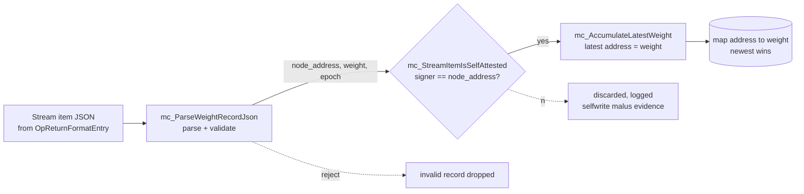
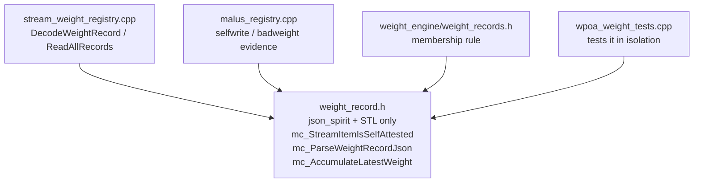

# `weight_record.h`

> **Type:** reference · **Register:** technical-direct · **Verified against the code:**
> 2026-09-25, commit `af06a6ef`
>
> Walkthrough of [`weight_record.h`](../src/wpoa/weight_record.h), the **pure Phase 1
> helpers**: the self-attestation predicate shared by every self-describing stream, the
> record parser, and the newest-wins fold. The registry that calls them is in
> [stream-weight-registry.md](stream-weight-registry.md).

## Table of contents
- [1. Role and philosophy of the file](#1-role-and-philosophy-of-the-file)
  - [Why a separate, "dependency-light" file?](#why-a-separate-dependency-light-file)
  - [Why inline and header-only?](#why-inline-and-header-only)
- [2. Includes](#2-includes)
- [2bis. mc_StreamItemIsSelfAttested — the self-attestation rule](#2bis-mc_streamitemisselfattested--the-self-attestation-rule)
- [3. mc_ParseWeightRecordJson — parsing and validation](#3-mc_parseweightrecordjson--parsing-and-validation)
  - [Contract (from the Doxygen comment)](#contract-from-the-doxygen-comment)
  - [3.1 Zeroing and type check](#31-zeroing-and-type-check)
  - [3.2 The two OpReturnFormatEntry shapes (robustness)](#32-the-two-opreturnformatentry-shapes-robustness)
  - [3.3 Extracting the "json" object](#33-extracting-the-json-object)
  - [3.4 Reading the node_address, weight and epoch fields](#34-reading-the-node_address-weight-and-epoch-fields)
  - [3.5 Final validation and conversion](#35-final-validation-and-conversion)
- [4. mc_AccumulateLatestWeight — "newest wins" aggregation](#4-mc_accumulatelatestweight--newest-wins-aggregation)
- [5. Links to the other files](#5-links-to-the-other-files)
- [Related documents](#related-documents)

---
## 1. Role and philosophy of the file

This is a **header-only** header (all functions are `inline`, there is no associated
`.cpp`). It contains three free functions:

- `mc_StreamItemIsSelfAttested(...)` — the consensus-critical rule that a record is valid
  only if its transaction was signed by the address it declares.
- `mc_ParseWeightRecordJson(...)` — turns the JSON payload of a stream item into
  `(node_address, weight[, epoch])`.
- `mc_AccumulateLatestWeight(...)` — folds one record into the "address → latest
  weight" map.



### Why a separate, "dependency-light" file?

The comment at the top of the file explains it:
> *"This header intentionally depends only on json_spirit (plus `<string>`), so the
> parsing/aggregation logic can be unit-tested in isolation, without linking the
> wallet / node runtime."*

In other words: the **parsing logic** is isolated from the rest of the system.
`stream_weight_registry.cpp` depends on the entire node runtime (wallet, chain,
transaction DB). If the parsing lived there, testing it would require booting half a
node. By extracting it into a header that depends **only** on `json_spirit` +
`<string>` + `<map>`, the unit test (`src/wpoa/test/wpoa_weight_tests.cpp`) can include
only this header, hand-build a `json_spirit::Value` and verify the parsing — without
linking the wallet, network or database.

### Why `inline` and header-only?

`inline` functions defined in a header can be included in several `.cpp` files without
violating the **ODR** (One Definition Rule): the linker merges identical definitions.
This avoids having to create a `weight_record.cpp` and add it to the Makefile just for
three small functions. It is the typical pattern for pure, testable utilities.

## 2. Includes

```cpp
#include <map>
#include <string>
#include <vector>
#include <stdint.h>
#include "json/json_spirit_value.h"
#include <boost/foreach.hpp>
```

- `<map>` → `std::map` for the accumulation function.
- `<string>` → `std::string`.
- `<vector>` → the list of signing addresses the self-attestation rule takes.
- `<stdint.h>` → `uint32_t`, `int64_t` (fixed-width integer types, standard C).
- `json/json_spirit_value.h` → **json_spirit**: `Value`, `Object`, `Pair`, and the type
  enum (`obj_type`, `str_type`, `int_type`, `real_type`).
- `boost/foreach.hpp` → the `BOOST_FOREACH` macro, used to iterate over the members of
  JSON objects in a C++98/03-compatible way (the style of the MultiChain codebase, which
  predates C++11 range-based `for`).

Note: there is **no** `#include` of any wallet/network header here. That is exactly the
point: minimal dependencies.

## 2bis. `mc_StreamItemIsSelfAttested` — the self-attestation rule

```cpp
inline bool mc_StreamItemIsSelfAttested(const std::string& declared_address,
                                        const std::vector<std::string>& publishers)
{
    if (declared_address.empty()) return false;
    for (size_t i = 0; i < publishers.size(); i++)
        if (publishers[i] == declared_address) return true;
    return false;   // includes the empty-publisher case: fail closed
}
```

A record is **self-attested** iff the address that signed the publishing transaction is
the address the payload declares. A payload field can claim anything; an input signature
cannot. Two streams rely on it, for the same reason and with the same consequence:

- `wpoa-weights` — a node declaring its own cluster's weight
  ([stream-weight-registry.md §2.7](stream-weight-registry.md#27-reading-records--the-most-delicate-path));
- `weight-engine-membership` — a node declaring which cluster it joined
  ([weight-engine.md §2.2](weight-engine.md#22-membership-is-self-attested-and-the-key-is-the-declaring-node)).

A record that fails it is **discarded**, never merely flagged.

- `publishers` are the addresses recovered from the transaction's input scripts. A
  transaction funded from several addresses has several publishers, and the record is
  accepted if the declared address is **any** of them — each did authorize it.
- An empty publisher list (signer unrecoverable) is **never** accepted: failing closed
  keeps the rule decidable.
- **One copy, in the lower layer.** The weight engine sits above wPoA and may depend
  downwards, so `weight_engine/weight_records.h` (`mc_MembershipRecordIsSelfAttested`)
  delegates to this function, and the malus registry uses it too — a `selfwrite`
  accusation is validated as its exact negation. Two copies of a consensus-critical
  predicate could drift into a node discarding a record it does not accuse, or accusing
  one it does not discard.

## 3. `mc_ParseWeightRecordJson` — parsing and validation

```cpp
inline bool mc_ParseWeightRecordJson(const json_spirit::Value& data_value,
                                     std::string& node_address, uint32_t& weight,
                                     uint32_t* epoch = NULL)
```

### Contract (from the Doxygen comment)
- **Input** `data_value`: the value produced by `OpReturnFormatEntry` for a JSON item,
  i.e. an object of the form `{ "json": { "node_address": "...", "weight": n, ... } }`.
- **Output** (by reference): `node_address` and `weight`; optionally, through the
  pointer, `epoch` — the epoch the value was computed **for**, or `0` when the record does
  not say.
- **Return**: `true` only for a well-formed record with a non-empty address and a
  **strictly positive** integer weight; `false` otherwise.

**Why the epoch, and why 0 is a legitimate answer.** A weight is a claim about a specific
epoch, so checking a published value against a recomputation is meaningful only when both
refer to the same epoch; without the field, a value legitimately published for epoch `e`
would be compared with epoch `e+1` as soon as the epoch rolled over, and an honest node
would be flagged. The weight engine stamps it; the static `-weight` path does not,
because a hand-set weight is not derived from any epoch. A record with epoch 0 is simply
not subject to value verification — and records predating the field read as 0 too.

Passing by reference (`std::string&`, `uint32_t&`) is the idiomatic pre-C++17 way of
"returning multiple values": the function returns a `bool` for success and writes the
results into the caller's variables.

### 3.1 Zeroing and type check

```cpp
node_address = "";
weight = 0;
if (epoch != NULL) *epoch = 0;
if (data_value.type() != json_spirit::obj_type) return false;
```

It first clears the outputs (so on failure the caller has clean values), then checks
that the JSON value is an **object** (`obj_type`). `.type()` is the json_spirit method
that returns the type of a `Value`.

### 3.2 The two `OpReturnFormatEntry` shapes (robustness)

```cpp
const json_spirit::Object* obj = &data_value.get_obj();

json_spirit::Value formatdata_val;
bool have_formatdata = false;
BOOST_FOREACH(const json_spirit::Pair& p, *obj)
{
    if (p.name_ == "formatdata" && p.value_.type() == json_spirit::obj_type)
    {
        formatdata_val = p.value_;
        have_formatdata = true;
        break;
    }
}
if (have_formatdata)
    obj = &formatdata_val.get_obj();
```

The comment in the file explains that `OpReturnFormatEntry` has **two output shapes**
depending on the overload used:
- the **6/7-argument** overload (like `StreamItemEntry`): `{"json": {...}}` — direct;
- the **3-argument** overload: `{"format":"json","formatdata":{"json":{...}}}` — wrapped.

This function accepts **both**: if it finds a `"formatdata"` key that is an object, it
"descends into it" and keeps looking for `"json"` at that level. This makes the parser
tolerant of whichever overload feeds it.

Technical details:
- `.get_obj()` → extracts the `json_spirit::Object` (a list of `Pair`s) from the `Value`.
- `obj` is a **pointer** to `Object` so it can be redirected to the nested level without
  copying.
- `json_spirit::Pair` has two fields: `p.name_` (key, `std::string`) and `p.value_`
  (value, `Value`). The trailing underscore is json_spirit's convention for members.
- `BOOST_FOREACH(const Pair& p, *obj)` → iterates over all pairs of the object.

> Important link: this is exactly where the bug fix described in
> `stream_weight_registry.cpp` intersects. `DecodeWeightRecord` uses the 6-argument
> overload (the direct `{"json":{...}}` shape); this parser also accepts the wrapped
> shape for safety. See [multichain-internals.md](multichain-internals.md) §5.

### 3.3 Extracting the `"json"` object

```cpp
json_spirit::Value json_val;
bool have_json = false;
BOOST_FOREACH(const json_spirit::Pair& p, *obj)
{
    if (p.name_ == "json") { json_val = p.value_; have_json = true; break; }
}
if (!have_json || json_val.type() != json_spirit::obj_type) return false;
```

It looks for the `"json"` key. If it is missing, or is not an object, the record is
invalid → `false`.

### 3.4 Reading the `node_address`, `weight` and `epoch` fields

```cpp
std::string addr;
int64_t w = -1;
int64_t e = 0;
BOOST_FOREACH(const json_spirit::Pair& p, json_val.get_obj())
{
    if (p.name_ == "node_address" && p.value_.type() == json_spirit::str_type)
        addr = p.value_.get_str();
    else if (p.name_ == "weight")
    {
        if (p.value_.type() == json_spirit::int_type)
            w = p.value_.get_int64();
        else if (p.value_.type() == json_spirit::real_type)
            w = (int64_t)p.value_.get_real();
    }
    else if (p.name_ == "epoch")
    {   /* same int/real handling into e */ }
}
```

Other fields of the record (`timestamp`, `height`) are ignored by the parser.

- `node_address` must be a string (`str_type`) → `.get_str()`.
- `weight` is accepted both as an **integer** (`int_type` → `.get_int64()`) and as a
  **real** (`real_type` → `.get_real()` cast to `int64_t`). This is because json_spirit
  may classify a number as a real depending on how it was serialised/deserialised by the
  UBJSON layer; accepting both avoids false negatives.
- `w` is initialised to `-1` so that, if the `weight` field is missing entirely, it stays
  negative and fails the subsequent validation.

### 3.5 Final validation and conversion

```cpp
if (addr.empty() || w <= 0) return false;
node_address = addr;
weight = (uint32_t)w;
if (epoch != NULL)
    *epoch = (e > 0 && e <= (int64_t)0xffffffff) ? (uint32_t)e : 0;
return true;
```

- Rejects an empty address or a weight ≤ 0 (the weight must be **strictly positive** —
  consistent with `RegisterLocalWeight`, which rejects `weight == 0`).
- Only once validation passes does it write the outputs and return `true`. The cast
  `(uint32_t)w` is safe because `w > 0` is already guaranteed.
- A negative or out-of-range epoch reads as "unstated" (0) rather than wrapping: a bad
  epoch must not make a record look as if it belonged to a different one.

## 4. `mc_AccumulateLatestWeight` — "newest wins" aggregation

```cpp
inline void mc_AccumulateLatestWeight(std::map<std::string, uint32_t>& latest,
                                      const std::string& node_address, uint32_t weight)
{
    latest[node_address] = weight;
}
```

A single line, but with a precise semantics documented by the comment:
> *"...the newest value for an address overwrites any earlier one."*

`latest[node_address] = weight` uses `std::map`'s `operator[]`: if the key exists, it
**overwrites** the value; if not, it inserts it. Because `ReadAllRecords` in
`stream_weight_registry.cpp` iterates records in **ascending chronological order**
(old → new), the overwrite makes the **last confirmed record** of each address prevail.
Extracting this line into its own function makes it:
1. self-documenting (the name expresses intent),
2. testable in isolation,
3. the single place where the "newest wins" policy is encoded (if the policy changed,
   only one spot is touched).

## 5. Links to the other files

- **`stream_weight_registry.cpp`** includes this header and uses:
  - `mc_ParseWeightRecordJson` inside `DecodeWeightRecord` to extract
    `(addr, weight, epoch)` from the `Value` produced by `OpReturnFormatEntry`;
  - `mc_StreamItemIsSelfAttested` right after, to discard a record published on another
    address's behalf;
  - `mc_AccumulateLatestWeight` inside `ReadAllRecords` to build the address→weight map.
- **`malus_registry.cpp`** parses `wpoa-weights` records with the same parser when it
  validates a `badweight` or `selfwrite` report, and uses the same predicate.
- **`weight_engine/weight_records.h`** delegates its membership rule to
  `mc_StreamItemIsSelfAttested`.
- **`src/wpoa/test/wpoa_weight_tests.cpp`** includes **only** this header to test the
  parsing in isolation — which is the entire reason the file exists.
- It depends on no other wPoA file: it is the pure "leaf" of the subsystem.



---

## Related documents

- [../src/wpoa/README.md](../src/wpoa/README.md) — feature entry point and architecture diagram.
- [stream-weight-registry.md](stream-weight-registry.md) — the class that uses these
  helpers on the read path.
- [phase1-implementation-guide.md](phase1-implementation-guide.md) §5.6 — why the pure logic is
  extracted for unit testing (historical).
- [testing.md §2](testing.md#2-unit-tests) — the `weight` suite that exercises these functions.
