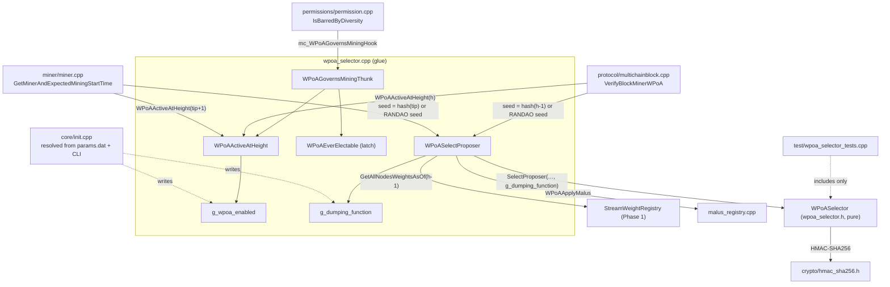

# `wpoa_selector.h` + `wpoa_selector.cpp`

> **Type:** reference · **Register:** technical-direct · **Verified against the code:**
> 2026-09-25, commit `af06a6ef`
>
> Walkthrough of the **Phase 2 selector**: the pure Efraimidis–Spirakis core shared by every
> election (public and private), the activation predicate, the mining-diversity hook, and
> the registry-backed election wrapper. Why the design looks like this:
> [wpoa-weight-engine-architecture.md §4.2](wpoa-weight-engine-architecture.md#42-phase-2-the-efraimidisspirakis-argmin)
> and [§3.2](wpoa-weight-engine-architecture.md#32-the-mining-diversity-gate-one-function-pointer-instead-of-n-patches).

These two files are documented together (interface/pure core + node-coupled glue). The
split is unusual and deliberate — read §1 first.

| File | Role |
|------|------|
| `wpoa_selector.h` | Two things in one header: **(a)** the header-only, node-free `WPoASelector` class (the whole scoring + argmin **math**, defined inline) plus two pure inline predicates (`WPoAShouldFallBackToNative`, `WPoAWeightRecordInScope`), and **(b)** the *declarations* of the node-coupled glue (`g_wpoa_enabled`, `g_dumping_function`, `g_wpoa_vrf_enabled`, `WPoAActiveAtHeight`, `WPoAEverElectable`, `WPoASelectProposer`, `WPoAVRFActiveAtHeight`). |
| `wpoa_selector.cpp` | The *definitions* of the node-coupled glue only: the globals, the height activation predicate, the mining-diversity hook installer, and the registry-backed proposer wrapper. It does **not** re-implement any math — it calls `WPoASelector`. |

### 1. Why is the math in the header and the glue in the `.cpp`?

Because the election is **consensus-critical** and must be tested exhaustively without a
running node. The header comment states it directly:

> *"The scoring core (WPoASelector) is intentionally free of node/wallet dependencies so
> it can be unit-tested in isolation; the node-coupled glue (registry read, activation
> predicate, runtime flag) is declared at the bottom and defined in wpoa_selector.cpp."*

- **The pure core is header-only** (`static` methods defined inline in the class). A unit
  test (`test/wpoa_selector_tests.cpp`) `#include`s the header and links only
  HMAC-SHA256 + Boost.Test — no wallet, no chain, no node. That lets it run 200 000-seed
  statistical tests in milliseconds.
- **The glue must touch the node** (it reads the weight registry, the chain params, a
  global flag), so it cannot be node-free. It lives in the `.cpp`, compiled into
  `libbitcoin_wallet`, and is deliberately kept as thin as possible.

This mirrors the Phase 1 split between `weight_record.h` (pure, testable) and
`stream_weight_registry.cpp` (node-coupled). See
[weight-record.md](weight-record.md).

`static` methods (not free functions) are used for the core so the whole thing is one
self-contained, namespaced unit with no per-instance state — you never construct a
`WPoASelector`.

---

## Table of contents
  - [1. Why is the math in the header and the glue in the .cpp?](#1-why-is-the-math-in-the-header-and-the-glue-in-the-cpp)
- [2. wpoa_selector.h](#2-wpoa_selectorh)
  - [2.1 Includes and their provenance](#21-includes-and-their-provenance)
  - [2.2 Weight-dumping (-dumpfunction) — whale compression](#22-weight-dumping--dumpfunction--whale-compression)
  - [2.3 The score: FoldTop64, ScoreFromEntropy64, ComputeScore](#23-the-score-foldtop64-scorefromentropy64-computescore)
  - [2.4 WPoASelector::SelectProposer — the argmin](#24-wpoaselectorselectproposer--the-argmin)
  - [2.4bis WPoASelector::TotalEffectiveWeight — the band normaliser](#24bis-wpoaselectortotaleffectiveweight--the-band-normaliser)
  - [2.5 The pure predicates and the node-glue declarations](#25-the-pure-predicates-and-the-node-glue-declarations)
- [3. wpoa_selector.cpp — the node glue](#3-wpoa_selectorcpp--the-node-glue)
  - [3.1 Includes](#31-includes)
  - [3.2 The flag definitions](#32-the-flag-definitions)
  - [3.3 WPoAActiveAtHeight — the activation predicate](#33-wpoaactiveatheight--the-activation-predicate)
  - [3.3bis The mining-diversity hook](#33bis-the-mining-diversity-hook)
  - [3.4 WPoASelectProposer — registry-backed election](#34-wpoaselectproposer--registry-backed-election)
- [4. Connections to the other files](#4-connections-to-the-other-files)
- [5. wPoA Phase 3a — VRF beacon activation glue](#5-wpoa-phase-3a--vrf-beacon-activation-glue)
  - [5.1 Header declarations (bottom of wpoa_selector.h)](#51-header-declarations-bottom-of-wpoa_selectorh)
  - [5.2 Definitions (wpoa_selector.cpp)](#52-definitions-wpoa_selectorcpp)
  - [5.3 What is *not* here](#53-what-is-not-here)

---
## 2. `wpoa_selector.h`

### 2.1 Includes and their provenance

```cpp
#include <cmath>       // std::log
#include <limits>      // std::numeric_limits<double>::infinity()
#include <map>         // std::map (the weight map type)
#include <string>      // std::string (addresses)
#include <stdint.h>    // uint32_t (weight), uint64_t (digest fold)
#include "crypto/hmac_sha256.h"  // CHMAC_SHA256
```

- `<cmath>` → `std::log` (natural logarithm, base *e*) and `std::sqrt`. Used for
  `E = -ln(u)` and for the weight-dumping transforms (§2.2).
- `<limits>` → `std::numeric_limits<double>::infinity()`, a portable IEEE-754 `+∞`.
  Returned for a zero-weight node so it can never be the argmin.
- `<map>`, `<string>`, `<stdint.h>` → STL/C standard types.
- `crypto/hmac_sha256.h` → **`CHMAC_SHA256`**, MultiChain/Bitcoin's HMAC-SHA256
  implementation. Its interface (from that header):
  - `static const size_t OUTPUT_SIZE = 32;` — the MAC length (32 bytes = 256 bits).
  - `CHMAC_SHA256(const unsigned char* key, size_t keylen);` — constructor takes the key.
  - `CHMAC_SHA256& Write(const unsigned char* data, size_t len);` — feeds message bytes;
    returns `*this` so calls **chain**.
  - `void Finalize(unsigned char hash[OUTPUT_SIZE]);` — writes the 32-byte MAC.

### 2.2 Weight-dumping (`-dumpfunction`) — whale compression

Before the Efraimidis–Spirakis draw, each validator weight is passed through an optional
**dumping** (damping) function. Without it, election probability is exactly proportional
to raw weight, so a validator with 100× the stake wins ~100× as often — a single
**whale** dominates block production, and its share grows without bound as it accrues more
weight. The dumping function is a **concave, strictly-increasing** transform that
*compresses* that gap while never reordering validators (a heavier node is still more
likely to be chosen — just not proportionally so).

```cpp
enum DumpingFunction
{
    DUMP_NONE = 0,   // f(w) = w         raw weight, no compression   (default)
    DUMP_LOG,        // f(w) = ln(1 + w) strong compression
    DUMP_SQRT        // f(w) = sqrt(w)   moderate compression
};

#define MC_WPOA_DEFAULT_DUMPING_FUNCTION DUMP_NONE

extern DumpingFunction g_dumping_function;   // set from -dumpfunction; defined in the .cpp
```

The transform itself is a pure static helper, so the node-free unit test can exercise
every mode directly:

```cpp
static double ApplyDumping(uint32_t weight, DumpingFunction dumping)
{
    switch (dumping)
    {
        case DUMP_SQRT: return std::sqrt((double)weight);
        case DUMP_LOG:  return std::log(1.0 + (double)weight);
        case DUMP_NONE:
        default:        return (double)weight;
    }
}
```

- **Why `ln(1 + w)` and not `ln(w)`?** The registry's smallest positive weight is `1`, and
  `ln(1) = 0` would make `E / f(w)` divide by zero → `+∞` → a weight-1 validator could
  **never** win. `ln(1 + w)` gives `ln(2) ≈ 0.693 > 0`, so every legal weight keeps a
  positive effective weight and a finite score. `sqrt(1) = 1` is fine unchanged.
- **Return type is `double`, not `int`.** The score math is already floating-point;
  truncating `sqrt`/`log` to an integer would collapse most weights to the same bucket
  (e.g. `sqrt(2) → 1`) and destroy the ordering. The effective weight stays a `double`
  all the way into `E / f(w)`.
- **Effect (measured, `test/wpoa_selector_tests.cpp`):** for weights 50 vs 500 (raw 10×),
  the heavy/light win ratio is ≈ 9.8 under `none`, ≈ 3.15 under `sqrt` (→ √10), and ≈ 1.57
  under `log` (→ ln(501)/ln(51)). Ordering is always preserved; the whale's edge shrinks.
- **CONSENSUS-CRITICAL.** The miner and every validator must apply the **same** function
  or they compute different scores, elect different proposers, and fork. This is why the
  choice is a value **threaded into the pure core** (never read from a global inside it):
  the node glue passes `g_dumping_function` in (§3.4), and so do the sortition paths and
  the audit RPCs. `g_dumping_function` is declared `extern` here and defined in
  `wpoa_selector.cpp` (§3.2), exactly like `g_wpoa_enabled`. It is a hash-enforced chain
  parameter (`dump-function`), so every node agrees on it.
- **`f(0) = 0` under all three** (`ln(1+0) = 0`). That is what lets a validator the malus
  has driven to zero contribute nothing to the total weight `W` of §2.4bis.

### 2.3 The score: `FoldTop64`, `ScoreFromEntropy64`, `ComputeScore`

The score is split in three so that the **same** transform serves both the public Phase 2
election and the private Phase 4 sortition — the only difference between them is where
the 64 bits of entropy come from.

```cpp
static uint64_t FoldTop64(const unsigned char* buf)
{
    uint64_t d = 0;
    for (int i = 0; i < 8; i++)
        d = (d << 8) | (uint64_t)buf[i];
    return d;
}

static double ScoreFromEntropy64(uint64_t d, uint32_t weight,
                                 DumpingFunction dumping = DUMP_NONE)
{
    if (weight == 0)
        return std::numeric_limits<double>::infinity();

    const double two64 = 18446744073709551616.0; // 2^64, exact in double
    double u = ((double)d + 1.0) / two64;        // (0, 1]
    double E = -std::log(u);                     // Exp(1)-distributed
    return E / ApplyDumping(weight, dumping);    // Exp(f(weight))-distributed
}

static double ComputeScore(const unsigned char* seed, size_t seed_len,
                           const std::string& address, uint32_t weight,
                           DumpingFunction dumping = DUMP_NONE)
{
    unsigned char mac[CHMAC_SHA256::OUTPUT_SIZE];
    CHMAC_SHA256(seed, seed_len)
        .Write(reinterpret_cast<const unsigned char*>(address.data()), address.size())
        .Finalize(mac);
    return ScoreFromEntropy64(FoldTop64(mac), weight, dumping);
}
```

**`FoldTop64`** takes the first 8 bytes of a hash-valued buffer, most-significant first
(**big-endian**): each iteration shifts the accumulator left one byte and ORs in the next.
Only 8 bytes are used because a `double` has a 53-bit mantissa — 64 bits already exceed
what the later floating-point math can resolve, so more bytes cannot change the outcome.
Both entropy sources (the HMAC digest here, the VRF output in
[private-sortition.md](private-sortition.md)) fold through it, so they fold identically.

**`ScoreFromEntropy64`** is the single source of truth for the score math:

- **`if (weight == 0) return …infinity();`** — a zero-weight node gets `+∞`, so it can
  never be the minimum. This is also how the malus excludes a validator: a `Ψ = 0` gives an
  effective weight of 0, with no explicit branch anywhere.
- **Normalise to (0, 1].** `2^64` is exactly representable in `double`. `d` ranges over
  `[0, 2^64−1]`, so `(d+1)/2^64` ranges over `(0, 1]`. The `+ 1.0` is done **in `double`**
  so it never wraps the `uint64_t`. This guarantees `u > 0`, so `-ln(u)` is finite;
  `u == 1` (score `0`) is a legitimate minimum reached only when `d == 2^64−1`.
- **The exponential transform.** If `u` is uniform on `(0,1]`, `-ln(u)` is Exponential(1);
  dividing by the **dumped** weight `f(weight)` makes the score Exponential(f(weight)). The
  minimum over independent Exp(f(w_i)) variables is attained by node `i` with probability
  `f(w_i) / Σ f(w_j)` — the Efraimidis–Spirakis result over the transformed weights. Hence
  **argmin of the scores = weighted random selection over the dumped weights**.

**`ComputeScore`** is the Phase 2 public form: the entropy is
`HMAC-SHA256(key = seed, msg = address)`. The *seed is the key* and the *address is the
message*, so each validator gets an independent pseudo-random value that every node can
reproduce from public data — which is exactly what makes Phase 2 predictable, and what
Phase 4 replaces with a VRF under each validator's own key.

- `reinterpret_cast<const unsigned char*>(address.data())` reinterprets the string's bytes
  as unsigned (no copy) because `Write` wants `unsigned char*`; the chained calls work
  because `Write` returns `CHMAC_SHA256&`.

### 2.4 `WPoASelector::SelectProposer` — the argmin

```cpp
static std::string SelectProposer(const unsigned char* seed, size_t seed_len,
                                  const std::map<std::string, uint32_t>& weights,
                                  DumpingFunction dumping = DUMP_NONE)
{
    std::string best_addr;
    double best_score = 0.0;
    bool have = false;

    for (std::map<std::string, uint32_t>::const_iterator it = weights.begin();
         it != weights.end(); ++it)
    {
        if (it->second == 0)
            continue; // defensive: registry never stores weight 0

        double s = ComputeScore(seed, seed_len, it->first, it->second, dumping);

        if (!have || s < best_score || (s == best_score && it->first < best_addr))
        {
            best_score = s;
            best_addr = it->first;
            have = true;
        }
    }
    return best_addr;
}
```

- **Inputs:** the same seed, plus `weights` = the **effective** `address → weight` map
  (the height-scoped registry read, corrected by the malus; `const&` avoids copying the
  map), plus `dumping` — the
  weight-dumping function (§2.2) applied to every weight before the draw. It is threaded
  straight through to each `ComputeScore`, so the whole election runs under one consistent
  transform. Defaults to `DUMP_NONE`; the glue supplies `g_dumping_function`.
- **`best_addr` / `best_score` / `have`** — the running argmin. `have` distinguishes
  "no candidate yet" from a genuine score of `0.0` (which is possible — see §2.3).
- **Iteration** with a `const_iterator` (`it->first` = address, `it->second` = weight).
  Pre-C++11 style, matching the codebase.
- **`if (it->second == 0) continue;`** — skip zero weights defensively.
- **The winner test** is the total order from the spec:
  ```
  !have                                  → first candidate always taken
  || s < best_score                      → strictly smaller score wins
  || (s == best_score && it->first < best_addr)  → exact tie: smaller address wins
  ```
  This is written so the result is **independent of iteration order**: whichever order
  the map yields, the same `(score, address)` pair is globally minimal. That
  order-independence is *why* Phase 2 uses argmin rather than a cumulative-range walk
  (which would depend on a canonical order) — see
  [phase2-implementation-guide.md §5](phase2-implementation-guide.md#5-design-decisions).
- **Return** the winning address, or `""` (default-constructed `std::string`) if the map
  had no positive-weight entry.

### 2.4bis `WPoASelector::TotalEffectiveWeight` — the band normaliser

```cpp
static double TotalEffectiveWeight(const std::map<std::string, uint32_t>& weights,
                                   DumpingFunction dumping = DUMP_NONE)
{
    double total = 0.0;
    for (std::map<std::string, uint32_t>::const_iterator it = weights.begin();
         it != weights.end(); ++it)
    {
        if (it->second == 0) continue;   // excluded: contributes no band weight
        total += ApplyDumping(it->second, dumping);
    }
    return total;
}
```

`W = Σ_j f(w_j)`, the total effective weight of a round's candidates after damping. It is
not used by the Phase 2 argmin; it is the normalising factor of the Phase 4 delay band
(`score_norm = 1 − e^{−W·score}`, [private-sortition.md](private-sortition.md)). It lives
here because it is pure selector math and because **one** implementation is shared by the
sortition miner, the sortition validator and the audit RPCs — the validator used to carry
an open-coded copy of this loop that agreed with the miner only because `f(0) = 0` for all
three damping functions.

- Summed in the map's sorted-key (address) order, identical on every node, so the
  non-associative floating-point total is reproducible.
- A zero weight contributes nothing, so `W` is the weight of the **eligible** set.

### 2.5 The pure predicates and the node-glue declarations

Below the class the header holds two pure inline predicates — testable without a node —
and the declarations of the node glue.

```cpp
inline bool WPoAShouldFallBackToNative(bool proposer_found, bool ever_electable)
{
    if (proposer_found) return false;   // wPoA elected somebody: use it
    return !ever_electable;             // no proposer AND never activated -> native rules
}

inline bool WPoAWeightRecordInScope(int record_block, int max_block)
{
    if (max_block < 0)    return true;   // unbounded read
    if (record_block < 0) return false;  // no height of its own
    return record_block <= max_block;
}

extern bool g_wpoa_enabled;
bool WPoAEverElectable();                 // defined in stream_weight_registry.cpp
bool WPoAActiveAtHeight(int height);
int  WPoAActivationBlock();               // declared only; no definition, no caller
std::string WPoASelectProposer(const unsigned char* seed, size_t seed_len, int height);
```

- **`WPoAShouldFallBackToNative`** separates the two ways of having no proposer. *Never
  electable yet* (the registry has never carried a positive weight) is the bootstrap
  window: the miner hands the round to the native MultiChain rules so the chain keeps
  advancing. *Electable before, not now* is a legitimate weighted-sortition outcome
  (every effective weight at zero): the chain stops, deliberately. Used by both miner
  branches ([miner-integration.md](miner-integration.md),
  [sortition-miner.md](sortition-miner.md)); unit-tested in the `activation` suite.
- **`WPoAWeightRecordInScope`** is the height-scope rule of the registry read
  ([stream-weight-registry.md §2.7](stream-weight-registry.md#27-reading-records--the-most-delicate-path)),
  reduced to one predicate so there is one statement of it.
- **`g_wpoa_enabled`** — the Phase 2 switch, resolved once in `AppInit2` from
  `enable-wpoa-selection` ([node-startup.md](node-startup.md)).
- **`WPoAEverElectable()`** — the activation latch. Declared here because its consumers are
  the diversity hook (§3.3bis) and the miner; defined next to the only read path that sets
  it, in `stream_weight_registry.cpp`.
- **`WPoAActiveAtHeight`** — the activation predicate (§3.3).
- **`WPoAActivationBlock()`** — declared with a comment describing a chain-derived
  activation height, but not defined or called anywhere; the chain-derived value exists as
  `StreamWeightRegistry::FirstPositiveWeightBlock()`.
- **`WPoASelectProposer`** — the registry-backed wrapper the miner and validator call
  (§3.4).

They are declared in this header (not a separate one) so the miner, validator and `init`
only need a single `#include "wpoa/wpoa_selector.h"`.

---

## 3. `wpoa_selector.cpp` — the node glue

### 3.1 Includes

```cpp
#include "wpoa/wpoa_selector.h"          // the declarations above + the pure core
#include "wpoa/stream_weight_registry.h" // StreamWeightRegistry, GetAllNodesWeightsAsOf
#include "wpoa/malus_registry.h"         // WPoAApplyMalus (w_eff = w * Psi)
#include "core/init.h"                   // pwalletTxsMain
#include "utils/util.h"                  // LogPrint, LogPrintf, fDebug
#include "chainparams/state.h"           // mc_gState, IsProtocolMultichain,
                                         //   GetInt64Param, MCP_ANYONE_CAN_MINE
#include "permissions/permission.h"      // mc_WPoAGovernsMiningHook (diversity gate)
#include "core/main.h"                   // chainActive
#include "utils/sync.h"                  // LOCK, CCriticalSection
```

Each include is the source of the symbols used:
- `stream_weight_registry.h` → the Phase 1 `StreamWeightRegistry` class and its
  height-scoped `GetAllNodesWeightsAsOf()`.
- `malus_registry.h` → `WPoAApplyMalus`, the single entry point of the malus into the
  election ([malus-registry.md](malus-registry.md)).
- `permission.h` → the function pointer `mc_WPoAGovernsMiningHook` this file installs
  (§3.3bis).
- `init.h` → the global `pwalletTxsMain` (the wallet-txs DB pointer).
- `util.h` → `LogPrint(category, …)` (category-gated logging), `LogPrintf` (always-on),
  and `fDebug` (the master debug flag).
- `chainparams/state.h` → `mc_gState` (global state singleton), the network-params
  accessors `IsProtocolMultichain()` / `GetInt64Param(...)`, and the `MCP_ANYONE_CAN_MINE`
  macro.

### 3.2 The flag definitions

```cpp
bool g_wpoa_enabled = false;
bool g_wpoa_vrf_enabled = false;                                           // §5
DumpingFunction g_dumping_function = MC_WPOA_DEFAULT_DUMPING_FUNCTION;   // = DUMP_NONE
```
The **definitions** of the globals declared `extern` in the header. `g_wpoa_enabled`
defaults to off — with the flag unset the node keeps its native round-robin
mining-diversity behavior unchanged (see
[protocol-parameters.md](protocol-parameters.md) for the exact values).
`g_dumping_function` defaults `DUMP_NONE` — raw
weights, so a chain created without `dump-function` gets the undamped Efraimidis–Spirakis
distribution. All are written once, on the init thread, before any miner/validator thread
reads them ([node-startup.md](node-startup.md)), so they need no lock.

A file-local `DumpingFunctionName()` helper maps the enum to `"none"`/`"sqrt"`/`"log"` for
the debug log only — it never influences selection.

### 3.3 `WPoAActiveAtHeight` — the activation predicate

```cpp
bool WPoAActiveAtHeight(int height)
{
    if (!g_wpoa_enabled)                                        return false;
    if (mc_gState == NULL || mc_gState->m_NetworkParams == NULL) return false;
    if (!mc_gState->m_NetworkParams->IsProtocolMultichain())    return false;
    if (MCP_ANYONE_CAN_MINE)                                    return false;

    int setup_blocks = (int)mc_gState->m_NetworkParams->GetInt64Param("setupfirstblocks");
    return height >= setup_blocks;
}
```

Four gates, then the height check — **every one must pass** for wPoA to govern `height`:

1. **`!g_wpoa_enabled` → false.** Opt-in: an unflagged node is byte-for-byte native.
2. **null `mc_gState`/`m_NetworkParams` → false.** Defensive; these are set up early in
   startup but the predicate must be safe if called before then.
3. **`!IsProtocolMultichain()` → false.** wPoA is a MultiChain-protocol,
   permissioned-miner mechanism; it does not apply to a plain-Bitcoin-protocol chain.
4. **`MCP_ANYONE_CAN_MINE` → false.** If anyone may mine (no miner permission), there is
   no permissioned validator set to weight, so wPoA does not apply. `MCP_ANYONE_CAN_MINE`
   is a MultiChain chain-parameter macro.
5. **`height >= setupfirstblocks`.** `GetInt64Param("setupfirstblocks")` reads the chain's
   setup period (the initial blocks where the admin bootstraps permissions and the weight
   stream). wPoA engages only at/after it, so the chain bootstraps under native rules and
   weights have time to converge.

The key invariant: because this is a **pure function of the height and chain params**, the
miner (asking about `tip+1`) and the validator (asking about the received block's height)
**always agree** on whether a given block is governed by wPoA. That agreement is what
prevents a fork at the native↔wPoA boundary.

It must also **stay** pure for a second reason: it is called from the mining-diversity
hook, deep inside permission checks that already hold locks. An earlier version of the
deferred activation read the weight registry here, and the wallet read under those locks
hung the node at exactly the height it was meant to rescue. The question "can the registry
elect anybody?" is therefore asked where the registry is already read — in
`WPoASelectProposer` and in the miner, through `WPoAShouldFallBackToNative`.

### 3.3bis The mining-diversity hook

```cpp
static int WPoAGovernsMiningThunk(uint32_t block)
{
    return (WPoAActiveAtHeight((int)block) && WPoAEverElectable()) ? 1 : 0;
}

namespace {
struct WPoADiversityGateInstaller
{
    WPoADiversityGateInstaller() { mc_WPoAGovernsMiningHook = &WPoAGovernsMiningThunk; }
};
static WPoADiversityGateInstaller wpoa_diversity_gate_installer;
}
```

Native `mining-diversity` is a binding round-robin rule; under weighted selection every
permissioned address takes part in every round and a heavy validator may legitimately win
two consecutive heights. The spacing is neutralised at its **source**,
`mc_Permissions::IsBarredByDiversity`, which returns "not barred" whenever the hook says
wPoA governs the height — so every consumer of the `mine` permission agrees without being
special-cased: `CanMine`, `CanMineBlock`, `CanMineBlockOnFork`, `GetAllPermissions` (and
through it `CWallet::GetKeyFromAddressBook`, with which the miner finds its **own** key),
`UpdateChainMiningStatus`, and `listminers`.

- **Why a function pointer.** `permission.cpp` is also compiled into targets that do not
  link `wpoa/*` (`multichain-util`, `multichain-cli`, `libbitcoinconsensus`). The pointer is
  `NULL` there and native behaviour is unchanged; here a static object installs it before
  `main()`, so the predicate keeps one definition.
- **Why the latch.** During the bootstrap window the chain runs under the native rules,
  and the native spacing is part of them — bypassing it then would let a single miner take
  every block of the window. Reading the latch is a plain `bool` load, which is all a hook
  called from inside permission checks can afford.
- **What it replaced.** The validator used to bypass the spacing with
  `CanCustom(MC_PTP_MINE)`, which also reads grants in the **mempool**: in a consensus check
  that is a fork. The hook keeps every path on `CanMine()` and confirmed permissions.

### 3.4 `WPoASelectProposer` — registry-backed election

```cpp
std::string WPoASelectProposer(const unsigned char* seed, size_t seed_len, int height)
{
    if (pwalletTxsMain == NULL)
        return "";

    StreamWeightRegistry registry(pwalletTxsMain);
    std::map<std::string, uint32_t> weights = registry.GetAllNodesWeightsAsOf(height - 1);

    weights = WPoAApplyMalus(weights, height);          // w_eff = w * Psi

    std::string proposer = WPoASelector::SelectProposer(seed, seed_len, weights,
                                                        g_dumping_function);

    if (fDebug)
        LogPrint("wpoa", "[wpoa] SelectProposer height=%d as_of=%d validators=%u dumping=%s -> %s\n",
                 height, height - 1, (unsigned)weights.size(),
                 DumpingFunctionName(g_dumping_function),
                 proposer.empty() ? "(none)" : proposer.c_str());

    return proposer;
}
```

- **`if (pwalletTxsMain == NULL) return "";`** — no wallet/tx store → no weight map → no
  proposer. The callers treat `""` as "cannot elect" (the miner waits; the validator is
  lenient — see [block-validation.md](block-validation.md)).
- **`StreamWeightRegistry registry(pwalletTxsMain);`** — constructs a short-lived Phase 1
  registry over the borrowed wallet-txs pointer. Cheap; no state persists between calls.
- **`registry.GetAllNodesWeightsAsOf(height - 1)`** — the **confirmed** `address → weight`
  map (mempool excluded, newest-record-wins) restricted to records confirmed in the prefix
  the block extends. This election is replayed by every validator to check the argmin;
  reading the node's *current* registry let two validators at different sync points elect
  different proposers for the identical block. Read via the non-WRP self-locking wallet API,
  so it is safe from the miner thread *and* the validation thread. See
  [stream-weight-registry.md §2.7](stream-weight-registry.md#27-reading-records--the-most-delicate-path).
- **`WPoAApplyMalus(weights, height)`** — the election consumes the **effective** weight
  `w_eff = w · Ψ^(e−1)`. An exact no-op (the map comes back unchanged) when the malus is off
  or nobody carries a proved violation.
- **`WPoASelector::SelectProposer(seed, seed_len, weights, g_dumping_function)`** — hands
  the confirmed map *and the configured dumping function* to the pure core and returns the
  winning address. This is the single line that connects the node glue to the math, and the
  **only** place `g_dumping_function` is read — so the pure core stays node-free and every
  height on this node is elected under one consistent transform (§2.2).
- **`if (fDebug) LogPrint("wpoa", …)`** — traces the election under `-debug=wpoa`,
  including the scope height and `dumping=%s` (via `DumpingFunctionName`) so an operator can
  confirm from `debug.log` which transform is live. The `fDebug` guard avoids building the log arguments
  when debugging is off; `proposer.empty() ? "(none)" : proposer.c_str()` prints a readable
  placeholder for the no-proposer case.

---

## 4. Connections to the other files



- **`wpoa_selector.h` (core) ← unit test:** the test includes only the header and links
  only HMAC-SHA256 — the entire reason the math lives in the header.
- **`wpoa_selector.cpp` → `stream_weight_registry.h`:** consumes the Phase 1 height-scoped
  weight map and the activation latch.
- **`wpoa_selector.cpp` → `malus_registry.h`:** applies the malus correction.
- **`wpoa_selector.cpp` → `permission.h`:** installs the diversity hook.
- **`wpoa_selector.cpp` → `core/init.h`:** reads `pwalletTxsMain`; `g_wpoa_enabled` and
  `g_dumping_function` are resolved in `init.cpp`. See [node-startup.md](node-startup.md).
- **`miner/miner.cpp` and `protocol/multichainblock.cpp`** call
  `WPoAActiveAtHeight`/`WPoASelectProposer`; `WPoAActiveAtHeight` is also the base of every
  higher phase's activation predicate. See [miner-integration.md](miner-integration.md)
  and [block-validation.md](block-validation.md).
- **`private_sortition.{h,cpp}`** and the round audit RPCs reuse `FoldTop64`,
  `ScoreFromEntropy64` and `TotalEffectiveWeight` from the pure core.
- **`crypto/hmac_sha256.h`** supplies the keyed hash that generates the per-validator
  randomness.

---

## 5. wPoA Phase 3a — VRF beacon activation glue

Phase 3a adds the *randomness-generation* half of the beacon (see
[phase3a-implementation-guide.md](phase3a-implementation-guide.md)). The VRF **crypto**
lives in its own pure module ([`vrf_wrapper.{h,cpp}`](../src/wpoa/vrf_wrapper.h) →
[vrf-wrapper.md](vrf-wrapper.md)); the only thing that lands in the selector files is the
**node-glue activation** — one flag and one predicate, added exactly like the Phase 2
`g_wpoa_enabled` / `WPoAActiveAtHeight` pair.

### 5.1 Header declarations (bottom of `wpoa_selector.h`)

```cpp
extern bool g_wpoa_vrf_enabled;
bool WPoAVRFActiveAtHeight(int height);
```

- **`extern bool g_wpoa_vrf_enabled;`** — the switch, resolved once in `AppInit2` from
  `enable-wpoa-vrf` (defined in the `.cpp`, §5.2). Default `false` = Phase 2 behavior: no VRF
  reveal is produced or required. The header comment records that it *"must be set uniformly
  across the validator set (like `-enablewpoa`), or nodes disagree on block validity"* — it
  is consensus-affecting.
- **`WPoAVRFActiveAtHeight(int height)`** — true when a block at `height` must carry a
  verified VRF reveal. They are declared next to `g_wpoa_enabled`/`WPoAActiveAtHeight` so
  the miner, validator, and `init` still need only the single
  `#include "wpoa/wpoa_selector.h"`; the VRF wiring reuses the exact include the Phase 2
  glue already established.

### 5.2 Definitions (`wpoa_selector.cpp`)

```cpp
bool g_wpoa_vrf_enabled = false;

bool WPoAVRFActiveAtHeight(int height)
{
    return g_wpoa_vrf_enabled && WPoAActiveAtHeight(height);
}
```

- **`g_wpoa_vrf_enabled = false;`** — the definition of the flag declared `extern` in the
  header, alongside `g_wpoa_enabled` and `g_dumping_function` (§3.2). Written once on the
  init thread before any miner/validator thread reads it, so it needs no lock.
- **`WPoAVRFActiveAtHeight`** — deliberately `g_wpoa_vrf_enabled` **AND** the Phase 2 gate
  `WPoAActiveAtHeight(height)`. So the VRF requirement engages **exactly** on the
  wPoA-governed heights, never on bootstrap/native heights, and never when selection itself
  is off. Because it composes two pure functions of shared data (flags + chain params +
  height), the miner (embedding the reveal) and every validator (requiring it) agree on
  which blocks must carry a verified reveal from the height alone. The comment states this
  is what keeps the produce-side and enforce-side symmetric.

### 5.3 What is *not* here

The VRF `Prove`/`Verify` math, the wire encoding, and the prover/verifier wiring are **not**
in the selector files — they live in `vrf_wrapper.{h,cpp}`, `multichainscript.{h,cpp}`,
`miner.cpp`, and `multichainblock.cpp` respectively. The selector only answers *"is a
verified reveal required at this height?"*. See [vrf-wrapper.md](vrf-wrapper.md),
[block-vrf-encoding.md](block-vrf-encoding.md), [vrf-prover.md](vrf-prover.md), and
[vrf-verifier.md](vrf-verifier.md).
