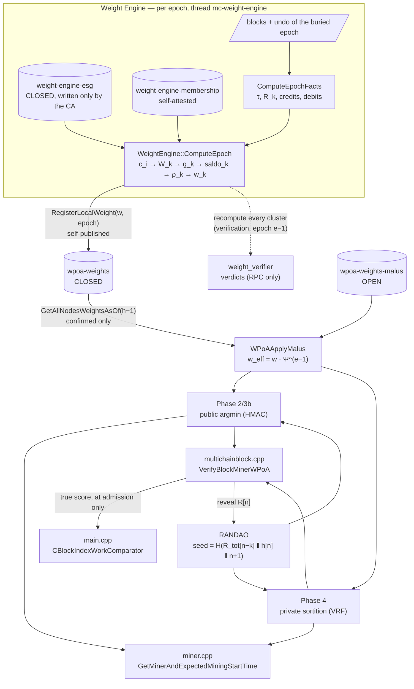

# wPoA + Weight Engine: implementation, integration into MultiChain, design choices

> **Type:** reference · **Register:** technical-direct · **Verified against the code:**
> 2026-09-26, commit `3d2fc551`
>
> The technical synthesis of the whole system. It does not repeat the parameter catalogue
> ([protocol-parameters.md](protocol-parameters.md)) or the implementation status
> ([implementation-status.md](implementation-status.md)): it concentrates on **how** the
> system is built, **where** it touches MultiChain and **why** it is built that way, with
> particular attention to the non-obvious choices — the ones a quick read of the code does
> not explain. Identifiers, flags, streams and RPCs are left verbatim. The `file:line`
> links below were checked against the commit above.

---

## Contents

1. [Overview](#1-overview)
2. [The principle behind everything: consensus as a function of the chain prefix](#2-the-principle-behind-everything-consensus-as-a-function-of-the-chain-prefix)
3. [Integration points in MultiChain](#3-integration-points-in-multichain)
4. [The wPoA core, phase by phase](#4-the-wpoa-core-phase-by-phase)
5. [The malus registry](#5-the-malus-registry)
6. [The Weight Engine](#6-the-weight-engine)
7. [Bootstrap and deferred activation](#7-bootstrap-and-deferred-activation)
8. [Concurrency, locks and cost on the consensus path](#8-concurrency-locks-and-cost-on-the-consensus-path)
9. [Terminology traps](#9-terminology-traps)
10. [Known limits and open points](#10-known-limits-and-open-points)

---

## 1. Overview

The system is made of two subsystems with sharply separated responsibilities:

| Subsystem | Directory | Responsibility | Does not |
|---|---|---|---|
| **Weight Engine** | [src/weight_engine/](../src/weight_engine/) | *Produces* the weight `w_k` of every cluster in every epoch, from on-chain inputs (ESG, membership, and the activity and flows derived from the blocks), and publishes it on `wpoa-weights`. | Elect anybody. |
| **wPoA** | [src/wpoa/](../src/wpoa/) | *Consumes* the confirmed weights, applies the behavioural correction (malus) and elects the proposer of every height in proportion to the effective weight. | Compute weights. |

The contract between the two is minimal and stable: the `wpoa-weights` stream holds
records `{address, weight > 0, epoch}` and the most recent confirmed record wins. Behind the
same contract, the Weight Engine replaces the old static `-weight=<n>`: the wPoA side does
not know where the number comes from.



The phases stack bottom-up and can only be enabled in this order (a violation is an
`InitError`): `weights → selection → vrf → randao → sortition → malus`. The Weight Engine
requires `weights`.

---

## 2. The principle behind everything: consensus as a function of the chain prefix

Almost every non-obvious choice follows from one requirement: **every quantity that enters
the validity of a block must be a pure function of the chain prefix that block extends**,
identical on every node able to evaluate the block, regardless of when and in what sync
state it evaluates it. The requirement sounds obvious. The concrete violations found during
development were much less so, and each one left a discipline in the code:

| Discipline | Where | Divergence it prevents |
|---|---|---|
| **Confirmed records only**, never the mempool | `StreamWeightRegistry::ReadAllRecords` (uses `GetListSize(..., &confirmed)`) | The mempool differs on every node: a weight in the mempool would elect different proposers. |
| **Non-WRP wallet API** | same | The `WRP*` calls read a snapshot that advances only on `WRPSync()`, not when a block connects: a thread that does not take part in the WRP protocol sees 0 records forever. |
| **Height-scoped reads** `GetAllNodesWeightsAsOf(height − 1)` | selector, sortition (miner and validator), audit RPCs | Reading the *current* registry made the verdict depend on the validator's sync point: two nodes looking at the same block could derive different `w_eff`, hence different delays, and disagree on the time bar. |
| **The bound is derived from the block's height**, not from `pindexTip->nHeight` | `WPoABuildRoundContext`, `WPoASortitionVerifyProposer` | Miner, validator and an audit RPC run months later compute the same bound from the one quantity they necessarily agree on. |
| **Records without a height are excluded under a bound** | `WPoAWeightRecordInScope` | Admitting them "by eye" would reintroduce exactly the per-node divergence. |
| **Sums in key order** (a `std::map` ordered by address) | `TotalEffectiveWeight`, `RawWeight`, `ComputeEpoch` | Floating-point addition is not associative: the iteration order must be identical everywhere. |
| **A single implementation** of the shared math | `ScoreFromEntropy64`, `TotalEffectiveWeight`, `MiningDelay` | The validator had an open-coded loop for `Σf(w)` that matched the miner only because `f(0)=0` for all three damping functions. |
| **Block timestamps, not `dTimeReceived`** | `WPoASortitionFeedback` | The local arrival time changes from node to node and is 0 on a node synced from scratch. |
| **Accumulation in integer units**, converted once at the end of the epoch | `ComputeEpochFacts` (`r_raw`, `credits_raw`, `debits_raw` as `int64_t`) | The sum must be bit-identical. |
| **Buried epochs** (`tip − 6`) | `LastBuriedEpoch`, `ComputeEpochFacts` | An epoch close to the tip can change under a reorg. |
| **Hash-enforced parameters in `params.dat`** | [paramlist.h](../src/chainparams/paramlist.h) | Two nodes with different `δ`, `k`, `κ`, `λ` compute different things and fork. |

The architectural consequence is the systematic split **pure core / node glue**: every module
has a pure header-only part (no globals, no node dependency: `wpoa_selector.h`,
`private_sortition.h`, `randao_accumulator.h`, `malus_record.h`, `weight_engine.h`,
`weight_records.h`, `weight_verifier.h`, `weight_authorization.h`) tested with Boost.Test
without building the node, and a `.cpp` that binds the core to the globals, the wallet and
the chain. The miner and the audit RPCs go **through the same function**
(`WPoABuildRoundContext` for a round, `WeightEngineComputeEpochDetail` for an epoch), and
the validator (`WPoASortitionVerifyProposer`) reproduces the same steps with the same
helpers — same height bound, same `WPoAApplyMalus`, same `TotalEffectiveWeight` — so an
inspection cannot report a number the consensus would not have computed.

---

## 3. Integration points in MultiChain

Every change to host code is enclosed between `/* MCHN START - wPoA ... */` and
`/* MCHN END */` markers, so it can be found with a grep.

| Host file | Hook | Role |
|---|---|---|
| [chainparams/paramlist.h](../src/chainparams/paramlist.h) | 22 entries `enable-wpoa*`, `wpoa-*`, `weight-*`, `dump-function` (the 23rd parameter, `-weight`, is per node) | Hash-enforced chain parameters, `MC_PRM_USER \| MC_PRM_CLONE`, protocol 20014. |
| [chainparams/params.cpp:1275](../src/chainparams/params.cpp#L1275) | `AdjustSetupFirstBlocks` | Raises `setup-first-blocks` at genesis if the Weight Engine could not publish in time. |
| [core/init.cpp:3303](../src/core/init.cpp#L3303) | resolution in `AppInit2` | `params.dat` as the baseline + CLI override, bottom-up constraints, thread start. |
| [core/init.cpp:1762](../src/core/init.cpp#L1762) | genesis | Calls `AdjustSetupFirstBlocks` *before* the parameter hash is computed. |
| [permissions/permission.cpp:1985](../src/permissions/permission.cpp#L1985) | `IsBarredByDiversity` + `mc_WPoAGovernsMiningHook` | Neutralises the round-robin spacing on wPoA heights. |
| [miner/miner.cpp](../src/miner/miner.cpp) | `GetMinerAndExpectedMiningStartTime`, `CreateNewBlock`, block signature | Decides *when* this node mines; embeds the VRF reveal. |
| [protocol/multichainblock.cpp:949](../src/protocol/multichainblock.cpp#L949) | `VerifyBlockMiner` → `VerifyBlockMinerWPoA` | Proposer validity rule. |
| [protocol/multichainscript.cpp:1281](../src/protocol/multichainscript.cpp#L1281) | `SetBlockVRF` / `GetBlockVRF` | On-chain carriage of the reveal. |
| [core/main.cpp:171](../src/core/main.cpp#L171) | `CBlockIndexWorkComparatorBase` | Fork choice on the true score (always on under sortition). |
| [core/main.cpp:3677](../src/core/main.cpp#L3677) | `FindMostWorkChain` → `WPoASortitionShouldDeferActivation` | Score-aware activation: holds back a worse-scored block for this node's own round. |
| [core/main.cpp:5284](../src/core/main.cpp#L5284) | `AcceptBlock` → `VerifyBlockMiner(..., true)` | The only place that writes the score into the index. |
| [core/main.cpp:5508](../src/core/main.cpp#L5508) | `ProcessNewBlock` → `WPoASortitionTakeDeferredRelay` | Relays a held block, which does not advance the tip. |
| [chain/chain.h:182](../src/chain/chain.h#L182) | `CBlockIndex::dSortitionScore`, `dSortitionScoreNorm` | Score cache, memory only. |
| [rpc/rpcwpoa.cpp](../src/rpc/rpcwpoa.cpp), [rpc/rpcweightengine.cpp](../src/rpc/rpcweightengine.cpp), [rpc/rpclist.cpp](../src/rpc/rpclist.cpp) | handlers | Writes (`reportmalus`, `weightsetesg`, `weightregistermembership`) and read-only audit. |

### 3.1 Parameters: `params.dat` as the source, CLI as the override

Every wPoA switch is a **chain parameter**: it is fixed with
`multichain-util create <chain> -enablewpoa=1 …`, ends up in `params.dat` and is inherited by
every node that joins. The same name works as a `multichaind` runtime flag and overrides the
inherited value on that node only; `AppInit2` warns loudly about the divergence but does not
prevent it.

Two non-obvious details:

- **The master switch is also expanded from `params.dat`.** It used to be expanded only in
  `mc_MultichainParams::Read`, that is, only when it arrived as a flag to `create`. A
  hand-written `params.dat` with `enable-wpoa = true` was parsed, hashed, shown by
  `getblockchainparams`… and stayed inert. The only symptom was the Weight Engine refusing to
  start with a message about a flag the operator had never touched.
- **`weight-alpha` is dead but cannot be removed.** It parameterised the `A_k` allocation of
  the *compliance rate* formulation, replaced by the *restitution rate*. Nobody reads it any
  more, but removing a field from `params.dat` changes its hash and makes every existing
  chain unjoinable. It is still parsed and validated.

The score-based fork choice is not a switch at all: under private sortition it is always on
(see §3.6), so it has neither a `params.dat` field nor a CLI flag.

### 3.2 The mining-diversity gate: one function pointer instead of N patches

In native MultiChain `mining-diversity` is a **binding** round-robin rule: an address cannot
mine two blocks too close together. Under wPoA every address with the `mine` permission takes
part in every round and a heavy validator can legitimately win two consecutive heights, so
the rule must be switched off on governed heights.

The spacing is consumed in many places: `CanMine`, `CanMineBlock`, `CanMineBlockOnFork`,
`GetAllPermissions` (and hence `CWallet::GetKeyFromAddressBook`, with which **the miner looks
up its own key**), `UpdateChainMiningStatus` (`nCanMine`, which feeds the chain comparator),
the coinbase exemption in the asset checks, the `listminers` estimate. Fixing them one by one
would have left the next one broken. The gate therefore sits at the **source**, in
`IsBarredByDiversity`:

```cpp
// permission.cpp
int (*mc_WPoAGovernsMiningHook)(uint32_t block)=NULL;

int mc_Permissions::IsBarredByDiversity(uint32_t block,uint32_t last,int miner_count)
{
    if(mc_WPoAGovernsMiningHook != NULL)
    {
        if(mc_WPoAGovernsMiningHook(block))
        {
            return 0;
        }
    }
    ...
```

Why a function pointer: `permission.cpp` is also compiled into `multichain-util`,
`multichain-cli` and `libbitcoinconsensus`, which do not link `wpoa/*`. The predicate "wPoA
governs height h" must have **one definition**, so `wpoa_selector.cpp` installs the hook at
static initialisation, before `main()`:

```cpp
// wpoa_selector.cpp
static int WPoAGovernsMiningThunk(uint32_t block)
{
    return (WPoAActiveAtHeight((int)block) && WPoAEverElectable()) ? 1 : 0;
}
namespace {
struct WPoADiversityGateInstaller
{
    WPoADiversityGateInstaller() { mc_WPoAGovernsMiningHook = &WPoAGovernsMiningThunk; }
};
static WPoADiversityGateInstaller wpoa_diversity_gate_installer;
}
```

In the targets that do not link wPoA the hook stays `NULL` and the native behaviour is
unchanged.

**The bug this closed** (comment in `CheckBlockPermissions`): the previous version bypassed
the spacing by calling `CanCustom(MC_PTP_MINE)` instead of `CanMine()`. Unintended side
effect: `CanCustom` also reads grants **in the mempool**. In a consensus check that is a
fork, because a block signed under a grant not yet confirmed was accepted by whoever had the
transaction in its mempool and rejected by everyone else. With the gate at the source the code
is back to `CanMine()` (confirmed permissions only), on the miner side and on the validator
side.

### 3.3 Miner side: `GetMinerAndExpectedMiningStartTime`

The native function decides *when* the node will start mining. wPoA inserts two branches
before the native path, in this order:

1. **Phase 4 (sortition)**, [miner.cpp ~1180](../src/miner/miner.cpp#L1180). It must come
   before the Phase 2 branch because sortition heights are a strict subset of wPoA heights.
   The node privately computes its score and delay and returns `parent.nTime + D`, moved to
   the local clock through the network time offset: the same instant the validator's time bar
   is measured from (§3.5). It also records the round it is counting down for, which the
   score-aware activation reads (§3.7).
2. **Phase 2/3b (public argmin)**. If the elected proposer is the local node it mines at
   once, otherwise it sleeps until `now + 3600` (the cached return keeps it still until the
   tip changes).

Then comes the `wpoa_native_fallback:` label ([miner.cpp:1352](../src/miner/miner.cpp#L1352)),
reached with `goto` from both branches during bootstrap (§7). A label was chosen instead of
restructuring the function: the two branches live in separate scopes and everything after
the label is exactly the native path that is needed.

Three less obvious guards:

- **Already proposed for this height** ([miner.cpp:1119](../src/miner/miner.cpp#L1119)). With
  sortition the node's block can legitimately lose the race; the tip does not change, the
  cache key (the tip hash) stays the same and the cached return would hand back the old
  "mine now", with the miner looping on the same height. The guard is placed *before* the
  cache, so it also applies on cache hits. `WPoASortitionMarkProposed` is called after
  proposing ([miner.cpp:1956](../src/miner/miner.cpp#L1956)).
- **Retarget abort in `CreateNewBlock`** ([miner.cpp:413](../src/miner/miner.cpp#L413)). The
  tip is read **three** times in one mining attempt, and only the third fixes
  `hashPrevBlock`. Without `cs_main` held between the reads, the tip can advance in between
  and the block is built one height above the one the delay was computed and waited for; the
  node's own validator rejected it as "mined too early". The check sits *inside* the same
  `cs_main` acquisition that reads the tip (compare and read are atomic). Checking it at the
  caller would have been a check-then-act, still exposed to the race. It is limited to
  sortition heights so as not to alter any other MultiChain deployment.
- **No key or no secret** → sleep 3600 s instead of failing: the cached return keeps the node
  still until the next tip.

### 3.4 Miner side: the VRF reveal in the block signature

```cpp
// miner.cpp, after SetBlockSignature(...)
if(g_wpoa_vrf_enabled)
{
    std::vector<unsigned char> vrf_input;
    if(!WPoASortitionVRFInputForBlock(block,vrf_input))            // Phase 4: seed‖"PROPOSER"‖h
    {
        vrf_input.assign(block->hashPrevBlock.begin(),block->hashPrevBlock.end()); // Phase 3a
    }
    if(WPoAVRF::Prove(key.begin(),vrf_input.data(),vrf_input.size(),vrf_out,vrf_proof))
    {
        lpScript->SetBlockVRF(vrf_out,WPoAVRF::OUTPUT_SIZE,vrf_proof,WPoAVRF::PROOF_SIZE);
    }
}
```

Format choices ([multichainscript.cpp:1275](../src/protocol/multichainscript.cpp#L1275)):

- The reveal (32 B) and the proof (97 B) are a **suffix of the signature element** in the
  coinbase OP_RETURN: `[…sig…][hash_type][key] [reveal_len][reveal][proof_len][proof]`.
  `SetBlockVRF` does not call `AddElement()` and must immediately follow `SetBlockSignature`.
  `GetBlockSignature` was relaxed to accept an element *longer* than sig+hash+key, so blocks
  without the suffix (pre-3a) stay valid byte for byte.
- **The reveal is not covered by the block signature**: it is appended *after* the signature
  has been computed, and the MultiChain signature excludes the coinbase OP_RETURN from the
  signed hash anyway (`MERKLETREE_NO_COINBASE_OP_RETURN`). It does not need to be: the DLEQ
  proof already binds the reveal to the signer's public key **and** to the input, so nobody
  can swap it for another valid one.
- Embedding on the miner side depends only on the flag; the validator *requires* it only on
  governed heights, so a "stray" reveal on a setup block is harmless.
- Two extractors: `FindBlockVRF` (validator, uses the shared scratch
  `mc_gState->m_TmpScript1`) and `WPoAExtractBlockReveal` (RANDAO and RPC, with a **local
  `mc_Script` on the stack**). The second exists because the accumulator also runs on the
  miner thread and on RPC threads, which must not touch the temporary buffer of the
  validation path.

### 3.5 Validator side: `VerifyBlockMinerWPoA`

`VerifyBlockMiner` dispatches: on heights where `WPoAActiveAtHeight(h)` is true it goes to
`VerifyBlockMinerWPoA` and skips the native diversity replay entirely. Inside, order matters:

```
signature present and pubkey valid?                         no → REJECT
┌ sortition height? ────────────────────────────────────────────────────────────┐
│  reveal present?                                         no → REJECT          │
│  WPoASortitionVerifyProposer(pprev, h, pubkey, addr, reveal, proof, nTime)    │
│     REJECT → REJECT                                                           │
│     SKIP   → accept (not verifiable here), score = NaN                        │
│     OK     → if fAtAdmission: write dSortitionScore / dSortitionScoreNorm     │
└───────────────────────────────────────────────────────────── return ──────────┘
VRF height (3a)?  reveal present and WPoAVRF::Verify(pubkey, h[n-1])?  no → REJECT
seed = RANDAO(pprev) if 3b, else hash(pprev)
proposer = WPoASelectProposer(seed, h)
empty proposer → accept (registry not synced)
miner ≠ proposer → REJECT
```

The three-valued verdict is a precise choice: **REJECT** for every defect attributable to the
block (false VRF proof, unweighted signer, block too early), **SKIP** only for conditions
*global to the node* (no wallet, empty registry, `Σf(w)=0`). So a proposer cannot build a block
that lands in the "unknown" bucket, and a node that is not synced does not stop the chain.
The VRF proof is verified **before** the registry is read, so it stays binding even on the
lenient path.

The heart of the sortition check ([private_sortition.cpp:294](../src/wpoa/private_sortition.cpp#L294)):

```cpp
StreamWeightRegistry registry(pwalletTxsMain);
std::map<std::string, uint32_t> weights = registry.GetAllNodesWeightsAsOf(height - 1);
weights = WPoAApplyMalus(weights, height);                      // same w_eff as the miner
double weff  = WPoASelector::TotalEffectiveWeight(weights, g_dumping_function);
double score = PrivateSortition::ScoreFromVRFOutput(vrf_reveal.data(), weight, g_dumping_function);
double delay = PrivateSortition::MiningDelay(score, weff, (double)Params().TargetSpacing(),
                                             g_wpoa_sortition_delta, g_wpoa_sortition_lambda,
                                             WPoASortitionFeedback(pindexParent));
int64_t earliest = parent_ntime + (int64_t)delay;               // floor: nTime has 1 s resolution
if ((int64_t)block_ntime < earliest) → REJECT "mined too early for its sortition score"
```

The time bar replaces the `miner == argmin` equality: with private scores no peer can compute
the argmin, but anyone can check, *afterwards*, that the block did not arrive earlier than its
score allowed. Getting ahead would require a lower score (unforgeable, by VRF uniqueness) or a
timestamp in the future (bounded by the base *time-too-new* rule).

### 3.6 Fork choice: the true score in the chain comparator

With sortition two proposers can produce a block at the same height: the second starts before
it has seen the first, or it is the argmin and deliberately proposes after a worse-scored block
for its round (§3.7). Native MultiChain picks the first received (`nSequenceId`). Under private
sortition `CBlockIndexWorkComparatorBase` adds a test: at equal work the **lower score** wins,
that is, the real winner of the sortition. The test is always on: `g_wpoa_fork_score_enabled`
is set to `g_wpoa_sortition_enabled` in `AppInit2`, and there is no flag to turn it off,
because the score-aware activation only helps if the second block can win.

Delicate points, all documented in the code:

- **Equal work = equal height.** On a wPoA chain `target-adjust-freq = -1`, so the work per
  block is constant and `nChainWork = height × constant`. Two candidates that reach the test
  are always from the same round, which is why comparing the round score is correct.
- **The score is read, not computed.** The comparator runs on every insert/lookup of a
  `std::set` under `cs_main`; a VRF/HMAC evaluation there would be ruinous. The score is
  written **exactly once**, in `AcceptBlock` with `fAtAdmission=true`, *before*
  `ReceivedBlockTransactions` inserts the index into `setBlockIndexCandidates`. Writing the key
  of an element already inside an ordered `std::set` is undefined behaviour, so the two calls
  to `VerifyBlockMiner` in `FindMostWorkChain` deliberately use `fAtAdmission=false`.
- **NaN always ranks last.** The variant "skip the test if either side has no score" is not a
  strict weak ordering: with A and B scored and C not, `nSequenceId` can put C between them
  while the score puts A above B — a cycle. Ordering by `(has_score ? 0 : 1, score)` is total.
- **The score lives in memory only** (`chain.h`): after a restart the indices loaded by
  `LoadBlockIndexDB` have NaN. Since SKIP depends only on node-global state, within a round a
  node scores either every candidate or none.
- **It is not a consensus rule.** It does not change which blocks are valid, only which of
  two equally valid ones a node prefers. It is fixed once in `AppInit2`: flipping it at runtime
  would reorder a live `std::set`. Without sortition there is no score, so it stays off.
- The body is shared by two wrappers: `CBlockIndexWorkComparator` (the live one) and
  `CBlockIndexLegacyWorkComparator` (the pre-wPoA rule, used only by the instrumentation to
  reconstruct "what I would have chosen before"). A single rule keeps the control arm from
  drifting away from the real one. The instrumentation (`main.cpp`, *wPoA fork-choice
  instrumentation*) logs every contested round under `-debug`, with both arms' winners.

### 3.7 Score-aware activation: the argmin proposes even after a worse block

The tie-break of §3.6 needs two blocks at the same height. Before this rule the argmin i\*
often never produced its own: a worse-scored block B for its round arrived first, i\*
connected it (valid, and alone at that height), `ConnectTip` took B's transactions out of
the mempool and moved `pcoinsTip`, and the miner dropped its countdown on the tip change. The
inversion was final. On the regional 23h run that was 13 % of all rounds.

Now a node whose own round is still running holds such a block back instead of connecting
it. `FindMostWorkChain` skips it while building the candidate set, so the tip stays on the
parent; mempool, UTXO view and countdown are untouched, and when the slot comes
`CreateNewBlock` builds the full block it would have built anyway. The comparator then prefers
it over B on every node that sees both. The rule, the relay of held blocks and the release
after a grace period are in [score-aware-activation.md](score-aware-activation.md).

---

## 4. The wPoA core, phase by phase

### 4.1 Phase 1: the weight registry

`StreamWeightRegistry` is a facade over the `wpoa-weights` stream, which is **closed**:
`wpoa-weights.write` is required. Reading is "newest confirmed wins" per address, with two
filters:

- **Self-publication** (`weight_record.h`): a record is valid only if the declared address is
  among the signers of the transaction. A well-formed record published *on behalf of* another
  address is discarded and logged unconditionally, because it is the evidence the `selfwrite`
  malus rests on.
- **Height scope** (§2).

### 4.2 Phase 2: the Efraimidis–Spirakis argmin

```cpp
// wpoa_selector.h: the single source of truth for the score math
static double ScoreFromEntropy64(uint64_t d, uint32_t weight, DumpingFunction dumping)
{
    if (weight == 0) return std::numeric_limits<double>::infinity();
    const double two64 = 18446744073709551616.0;          // 2^64, exact in a double
    double u = ((double)d + 1.0) / two64;                 // (0,1]: -ln(u) always finite
    double E = -std::log(u);                              // Exp(1)
    return E / ApplyDumping(weight, dumping);             // Exp(f(w))
}
```

The minimum of independent exponentials `Exp(f(w_i))` is won by `i` with probability
`f(w_i)/Σf(w_j)`. In Phase 2 the entropy is `HMAC-SHA256(seed, address)`, hence public.

Non-obvious choices:

- **Argmin, not a walk over cumulative intervals.** The outcome depends only on the set
  `(address, weight)` and on the seed, never on the container's iteration order; the
  tie-break (bit-identical scores, a negligible event) is lexicographic on the address.
- **`FoldTop64`** takes the first 8 bytes big-endian. 64 bits already exceed the 53 of a
  double's mantissa, so using more would change nothing. HMAC (Phase 2) and VRF (Phase 4) go
  through the same `FoldTop64` + `ScoreFromEntropy64`, so the only difference between the
  public and the private form is **where `d` comes from**.
- **Damping** (`none | sqrt | log(1+w)`) compresses the "whales" *at election time*,
  separately from the Weight Engine. `f(0)=0` for all three, so a validator zeroed by the
  malus contributes nothing to `W`.
- **The activation predicate is pure**: `WPoAActiveAtHeight(h)` looks only at flags,
  protocol, `anyone-can-mine` and `h ≥ setup-first-blocks`. An earlier version read the
  registry: the predicate is called by the diversity hook, inside permission checks that
  already hold locks, and the wallet read under those locks **hung the node** at exactly the
  height it was meant to rescue. The question "can the registry elect anybody?" is therefore
  asked where the registry is already read (selector and miner).

### 4.3 Phase 3a: VRF over secp256k1

ECVRF with a Chaum–Pedersen (DLEQ) proof over the curve already present in MultiChain, with
the validators' **own keys** (no new key material):

```
H     = HashToCurve(input)            (try-and-increment)
Γ     = sk · H
R     = SHA256(SUITE ‖ 0x03 ‖ Γ)      32 B, the reveal
π     = Γ ‖ c ‖ s                     33 + 32 + 32 = 97 B
k     = HashToScalar(SUITE ‖ 0x01 ‖ sk ‖ H)   deterministic nonce
```

secp256k1 has cofactor 1, so the cofactor-clearing steps of the RFC 9381 suites are absent.
The nonce is deterministic: no external randomness source, no key leak through a weak nonce.
The property the beacon really needs is **uniqueness**: for a pair `(sk, input)` there is a
single valid `(R, π)`, so the proposer cannot "grind" alternative reveals.

### 4.4 Phase 3b: the RANDAO accumulator

```
R_tot[n]  = R_tot[n−1] ⊕ R[n]                  (bare XOR, Def. 5.3 to the letter)
seed[n+1] = SHA256(R_tot[n−k] ‖ h[n] ‖ n+1)
```

- **Bare XOR, no hash.** An earlier revision used `H(R_tot ⊕ H(R))`. It was brought back to
  the definition because the hardening bought nothing: nobody consumes the raw `R_tot` (the
  seed hashes it anyway); the linearity of XOR could only be exploited by a last revealer
  *free to choose* its reveal, and VRF uniqueness takes that freedom away; the reveal is
  already 32 B wide. XOR is commutative and self-inverse, but neither reordering nor a double
  fold is reachable on a chain (the VRF input `h[n−1]` differs at every height). **Consensus
  break**: a chain with RANDAO on must be restarted from genesis
  (ADR [adr/randao-fold-bare-xor.md](adr/randao-fold-bare-xor.md)).
- **Memo per block hash** (`g_randao_cache`): `R_tot[b]` depends only on `R_tot[pprev]` and on
  the reveal of `b`, and a hash determines its whole ancestry, so the cache is correct across
  forks and reorgs without invalidation. The walk is **iterative** (no recursion, no stack
  overflow) back to the first cached ancestor, then folds forward.
- **Deterministic fallback**: if the data of a governed block is not available (unreachable on
  an accepted chain) the block hash is folded instead, so every node keeps agreeing instead of
  diverging.
- **Lookback `k ≥ 1` is mandatory for sortition**: the sortition reveal enters `R_tot[n]`
  while its seed reads `R_tot[n−k]`; with `k = 0` the seed would be circular.
- `h[n]` and `n+1` in the seed refresh it every round even when `R_tot[n−k]` has not moved.

Phase 3b changes **only** the seed bytes: the election stays public and weight-proportional.
Leader unpredictability is Phase 4's job.

### 4.5 Phase 4: timed private sortition

Every validator computes its own score with its own key:

```
input_i     = seed[n] ‖ "PROPOSER" ‖ height_be32
(y_i, π_i)  = VRF_sk_i(input_i)
score_i     = −ln(u(y_i)) / f(w_eff,i)                    (same ScoreFromEntropy64)
score_norm  = 1 − e^{−W·score_i},   W = Σ_j f(w_eff,j)
D_i         = T + δ·T·(2·score_norm − 1) + λ·Φ
```

and mines at `parent.nTime + D_i`: the lowest score wins, because it starts first; a node
with a worse score sees the new tip and stands down, while a node with a better score holds
the new block back and proposes its own (§3.7). The proposer is unknown until it acts, and the distribution stays
`Pr[i] = f(w_i)/Σf(w)`.

Why the formula looks like this:

- **The `W` factor in the normalisation.** Without it `score_norm` would inherit the scale of
  `E/w`: with weights in the hundreds `E/w ≈ 0` for everybody, and `1 − e^{−score}` would
  collapse onto the lower edge of the band whoever wins. With `W`: `min_i score_i ~ Exp(W)`,
  so `W·min ~ Exp(1)`, and applying its CDF gives an **exact uniform on (0,1)** for the winner,
  whatever the number of candidates and the weight distribution. It follows that the
  winner's delay is uniform over the band and the **mean block time equals `T`**.
- **`x ↦ 1 − e^{−Wx}` is strictly increasing**, so it preserves the order of the scores: the
  argmin (and weight proportionality) survives the normalisation.
- **Band symmetric around `T`** with `ψ(x) = 2x − 1`; `δ` is a *fraction* of `T` (default
  0.5), scale-invariant. `ψ` must remain a monotone transformation of the score and never an
  independent selection channel.
- **`λ·Φ` is identical for every candidate in the round**, so it cancels out of every pairwise
  difference and cannot reorder anybody: it only corrects the aggregate trajectory.
- **`Φ` from timestamps** (mean spacing over the last
  `MC_WPOA_SORTITION_FEEDBACK_WINDOW = 12` blocks), clipped to `±min(0.5·T, M*)` with
  `M* = T(1−δ)/λ` (Cor. 5.15), the condition that guarantees `D ≥ 0` for every candidate in
  every round. A window not yet full → `Φ = 0`.
- **The delay is truncated to whole seconds only in the time bar**: blocks have 1 s
  resolution, and the fine sub-second ordering is done by the miner, which uses the `double`.
- **`MiningDelay` degrades safely**: non-finite inputs → `MaxDelaySeconds()` (the node stands
  down); `d < 0` → 0; a ceiling of 100000 s against `uint32` overflow in
  `parent.nTime + delay`.

---

## 5. The malus registry

A second stream, `wpoa-weights-malus`, collects the evidence of misbehaviour. It is
**deliberately open**: anyone may report, nobody is believed. Every node re-derives the
evidence from public chain data, so a false report is discarded identically everywhere and
moves no weight.

### 5.1 Four violations, two families, one scale

| Kind | Family | Evidence recomputed by every node | Points (default) |
|---|---|---|---|
| `equiv` | consensus behaviour | two **distinct** blocks, same height, **same parent**, same signer, both with a valid VRF. By VRF uniqueness this cannot happen by accident. | 4 |
| `delay` | consensus behaviour | a block with `nTime < parent + D(score)`, reproduced with the validator's own law | 0.25 |
| `badweight` | data integrity | a value on `wpoa-weights` that the **pipeline recomputation** contradicts | 2 |
| `selfwrite` | data integrity | a record published on behalf of another address (always discarded: the attempt is what is priced) | 1 |

Constraints enforced at startup: `p(equiv) > p(delay)`, `p(badweight) > p(selfwrite)`.
Everything after the points (fold, `Ψ`, `w_eff`) is generic over the *accumulated severity*,
so adding a violation kind needed only a new score, with no new correction law.

### 5.2 Accumulator and correction

```
M^(e)  = μ · M^(e−1) + Σ p(kind)   over the valid reports of epoch e
Ψ      = max(0, 1 − M / M_max)
w_eff  = w · Ψ
```

- **Height `h` of epoch `e` uses `Ψ^(e−1)`.** A malus proved in one epoch takes effect from
  the next. This is not a detail: the `delay` predicate must know which `w_eff` was in force
  at the contested height, and if it depended on the reports of the *same* epoch the
  definition would be circular. `GetAccumulators` is a single forward pass per epoch: it
  first validates the reports of `e` against `Ψ^(e−1)`, then accumulates them into `M^(e)`.
- **`μ < 1` makes every exclusion reversible** (an EMA, not a counter). `EpochsToClear`
  computes `k* = ⌈ln(M/M_max)/ln(1/μ)⌉` in closed form and then **adjusts it by direct
  evaluation**, because the closed form solves the non-strict inequality while `Ψ` becomes
  positive again only on the strict one (e.g. `M=8, M_max=4, μ=0.5` would give one epoch too
  few). With the defaults a single equivocation brings `M = 4 = M_max` → `Ψ = 0` (excluded)
  and clears after **1** clean epoch.
- **`EffectiveWeight` rounds but never zeroes by mistake**: if `Ψ > 0` the result is at least
  1. Only `Ψ = 0` excludes, and exclusion needs no explicit branch: `ScoreFromEntropy64`
  returns `+∞` for weight 0.
- **No slashing**: nothing is confiscated; the probability of election is lowered.
- `WPoAApplyMalus` is the **single entry point** into consensus and is an exact no-op (the map
  is returned unchanged) when the malus is off or nobody has violations.

### 5.3 `badweight` and the cost on the consensus path

`badweight` is the only way a wrong weight is actually penalised in consensus (see §6.5). Its
validation is a **full recomputation of the pipeline from epoch 1**, and `GetAccumulators`
re-validates *every* report on *every* call: once per round by every miner, once per received
block by every node (under `cs_main`), and on every audit RPC. Measured on a 100-epoch
regional run, one walk near the end costs 2–3 s: a few dozen accepted reports take every fold
to tens of seconds against an 8 s block time.

The fix (commit `1fa34110`, [weight_verifier.cpp:160](../src/weight_engine/weight_verifier.cpp#L160))
is a **per-epoch memo** whose key contains *everything* the result depends on:

```cpp
struct RecomputeMemoKey
{
    uint256 last_block_hash;                                   // active block at the epoch's last height
    std::map<std::string, std::set<std::string> > clusters;   // membership, as read now
    std::map<std::string, double> esg;                         // ESG, as read now
};
```

- The hash of the block at the epoch's last height commits to the whole prefix.
- Membership and ESG are read "latest confirmed wins" **without a height scope**, so a record
  confirmed later can change the recomputation of a past epoch: they are re-read on every
  call and compared in full.
- The burial gate is re-applied *before* the memo is consulted, so an epoch that a reorg has
  "unburied" fails exactly as it would without the memo.
- The result is stored only if the key **after** the computation equals the key **before** it
  (no reorg and no new records in between).
- Lock order: always `cs_main → cs_recomputeMemo`, never the reverse; the memo lock is not held
  during the computation.

---

## 6. The Weight Engine

### 6.1 The pipeline

```
c_i^(e)     = ESG_i · τ_i^(e) / κ
W_k^(e)     = ESG_Mk · ( τ_Mk^(e) + Σ_{i∈C_k} c_i^(e) )
g_k^(e)     = Entrate_k^(e) − (Uscite_k^(e) − R_k^(e))
saldo_k^(e) = saldo_k^(e−1) + g_k^(e),            saldo^(0) = 0
ρ_k^(e)     = clamp(R_k^(e), [0, saldo]) / saldo   (0 if saldo ≤ 0)
w_k^(1)     = W_k^(1)
w_k^(e)     = W_k^(e) · [ ρ_k^(e−1)·λ + (1−λ) ]    (e ≥ 2)
published   = ToIntegerWeight(w_k, scale = κ) ∈ [1, UINT32_MAX]
```

(`Entrate`/`Uscite` — credits/debits — and `saldo` — balance — keep the thesis' Italian
names, as the code does.) All the math lives in
[weight_engine.h](../src/weight_engine/weight_engine.h), header-only and free of globals; the
`ComputeEpoch` driver processes the clusters in miner-address order and sums the
contributions in company-address order.

### 6.2 The choices the formula does not show

- **`R_k` is excluded from the debits inside `g_k`.** Otherwise `ρ = R/saldo` would become
  self-referential: a cluster that returns everything would divide by the zero created by its
  own restitution and get `ρ = 0` precisely for the behaviour the mechanism wants to reward.
  The reader hands over **gross** flows and `Gain()` adds `R` back: one subtraction in one
  place, instead of a special case scattered through the scan.
- **The balance is not the address's UTXO balance**, even though MultiChain already tracks
  it. Three independent reasons: (1) it is a different quantity, because the recursion adds
  back every past `R`, and reading the ledger would shrink the denominator precisely for good
  behaviour, inverting the incentive; (2) it is the wrong moment, because a UTXO balance is
  state current at the local tip, while the `w_k` of a buried epoch must depend only on *that*
  epoch's blocks; (3) it is not available, because balances are per wallet and MultiChain has
  no per-address index, yet every node must recompute the weight of *every* cluster to verify
  it. The `ClusterState` map carried forward epoch by epoch already is the balance memo.
- **Feedback lags by one epoch.** `w^(e)` uses `ρ^(e−1)`: an epoch's weight never depends on a
  quantity of the same epoch that it would in turn influence. For the same reason one pass over
  the clusters is enough: no cluster result depends on another in the same epoch (the old
  allocation through `W_tot` needed two passes).
- **`λ < 1` is a correctness requirement, not tuning.** For `e ≥ 2` the bracket is a convex
  combination in `[1−λ, 1]`, strictly positive, so `w_k > 0` whenever `W_k > 0`.
- **`ToIntegerWeight` scales by `κ` before rounding**, to recover the precision that `κ` had
  divided away from `c_i`. The selector normalises, so any uniform scale leaves the election
  distribution unchanged and only changes the granularity. The floor of 1 guarantees the
  positivity Efraimidis–Spirakis needs even for a cluster with zero activity; `!(s >= 1.0)`
  also catches NaN.
- **Empty treasury ⇒ `R = 0` for everybody**, hence `w_k = W_k(1−λ)`: a uniform scale that
  does not change the election. A legal, deterministic state.
- **The treasury is a chain parameter**, not derived from "who holds `admin`": the admin set
  is mutable, and a re-syncing node would attribute a historical epoch differently from how
  the network did at the time.

### 6.3 Block-derived inputs: `ComputeEpochFacts`

`τ`, `R_k`, credits and debits **are published by nobody**: they are derived in a single pass
over the epoch's confirmed blocks ([weight_reader.cpp:500](../src/weight_engine/weight_reader.cpp#L500)).
There used to be a reconciliation stream written by the admin; it was removed
(ADR [adr/reconciliation-onchain.md](adr/reconciliation-onchain.md)).

- **The signer is recovered from the undo data** (`CBlockUndo::vtxundo[k−1].vprevout`): the
  `scriptPubKey` of the spent output says who owned the input. It is the only way to attribute
  a transaction to an address without an index.
- `τ_i` = +1 per **distinct signing address** per transaction; debits = the value of **every**
  input (an amount, not a count); credits = every output, change included, so the fee comes
  out accounted exactly without a separate term.
- The coinbase credits the miner but generates no `τ`, debits or reconciliation (it has no
  signer).
- `R_k` = the value paid to the treasury, credited to **every signer** of the transaction (the
  treasury itself excluded). The rules live in the pure core (`mc_ValuePaidToTreasury`,
  `mc_AccumulateReconciliation`); the same address extraction is used for "paid to" and
  "signed by", so the two halves cannot diverge.
- **Snapshot under lock, read outside it.** `cs_main` is held only to copy `nStatus`, the
  block/undo positions and the parent hash of each index of the epoch; all disk reads happen
  afterwards, without touching `CBlockIndex` fields outside the lock.
- **Fail closed**: a block without data (pruned node), missing or inconsistent undo ⇒ `false`,
  never a silent default.

### 6.4 The thread and the publication cycle

`ThreadWeightEngine` ([weight_engine.cpp:327](../src/weight_engine/weight_engine.cpp#L327)),
every 3 s:

1. waits for a tip and for the end of IBD;
2. creates/subscribes the input streams (created by the first node with the `create`
   permission, that is, genesis);
3. `EnsureStreamReady()` on `wpoa-weights` **before** the epoch gate (see §7);
4. `epoch = LastBuriedEpoch(tip, len, 6)`;
5. **verifies the weights published for epoch `e−1`** (§6.5);
6. if it has not yet published for `e`, recomputes the whole map, extracts its own cluster and
   calls `RegisterLocalWeight(w, epoch)` (idempotent: an unchanged value is not republished).

Every node publishes **only its own** weight, signed by itself (the self-publication rule),
and every record carries the epoch it was computed for.

### 6.5 Universal verification: what it does, and what it deliberately does not do

Every input of the pipeline is public and deterministic except ESG. Any honest node can
therefore re-run the pipeline and obtain the **same integer**: the comparison is by **exact
equality**, because a tolerance band would only be a margin to hide in.

- **The previous epoch is verified.** A node can compute `w^(e)` only once `e` is buried, so
  its record for `e` arrives during `e+1`. Verifying `e` while in `e` would compare nothing.
- **Two rules, two failure directions.** Self-publication *fails closed* (decidable from the
  transaction alone: without proof the record is discarded). Value verification *fails open*:
  a node that cannot recompute (syncing, epoch not buried) produces `UNVERIFIED` and touches
  nothing — otherwise it would zero every weight on a freshly started node and stop the chain.
- **The verdicts do not enter consensus.** `mc_FilterVerifiedWeights` exists and is tested, but
  it is not called on the election path; the verdicts are exposed only by
  `weightverifyweights`. Consistently with §2: a filter based on a *local* cache (which
  depends on when the node verified) would make the election node-dependent. The consensus
  consequence of a false weight goes instead through the **`badweight` malus**, an on-chain
  proof that every node re-evaluates the same way, with effect from the following epoch.
- **ESG is the only trusted datum left.** The recomputation checks that the pipeline was
  applied honestly to the published inputs, not that the ESG is truthful.

### 6.6 Write authorisations

| Stream | Model | Reason |
|---|---|---|
| `wpoa-weights` | closed, self-published | writer = subject; the value is verifiable. |
| `weight-engine-membership` | self-attested | a node declares its own cluster; no privilege. |
| `weight-engine-esg` | **Certification Authority only** | ESG is an attestation of trust, not cryptographically verifiable: the only defence is to restrict *who* may assert it. |
| `wpoa-weights-malus` | open | every report is re-verified by everybody. |

The CA role is mapped onto the custom permission **`high1`** (`MC_WEIGHT_CA_PERMISSION_NAME`).
MultiChain has no arbitrary named permissions, only six fixed slots (`low1..3`, `high1..3`). A
**high** slot is needed because `IsActivateEnough` returns 0 for those: granting it requires
`admin`, `activate` is not enough, so only the administrator can appoint a CA. The gate is
**only on local publication** (RPC), not on reading: the reader accepts any confirmed,
well-formed ESG record. Two nodes that disagree on who is a CA do not compute different
weights, so it is not consensus, and that is why the slot is a compile-time constant and not a
`params.dat` parameter.

---

## 7. Bootstrap and deferred activation

The most insidious problem of the project is a deadlock that shows up three levels away from
its cause:

> wPoA governs from height `setup-first-blocks` → the registry is empty because the Weight
> Engine can only publish once an epoch is buried → the selector answers "nobody" → nobody
> mines → no epoch gets buried → no weight will ever be computed.

Observed on a clean chain, it stops one block before `setup-first-blocks`, forever. The fix
has three parts.

**1. The `WPoAEverElectable()` latch.** It is set the first time the confirmed registry read
meets a **positive** weight (a registry of zeros elects nobody, exactly like an empty one) and
is never cleared. It separates two situations that produce the same "no proposer":

```cpp
inline bool WPoAShouldFallBackToNative(bool proposer_found, bool ever_electable)
{
    if (proposer_found) return false;
    return !ever_electable;   // never activated → native rules
}
```

- *never electable so far* = bootstrap window → `goto wpoa_native_fallback` and the chain
  advances under the native rules;
- *electable before, not now* = a legitimate outcome of a weighted sortition (everybody zeroed
  by the malus) → the chain stops, and the miner says so plainly in the log: *"This is the
  protocol, not a stall to route around."*

The diversity hook is also conditioned on the latch: during bootstrap the native rules stay
intact, round-robin spacing included, otherwise a single miner could take every block of the
window.

**2. `setup-first-blocks` raised at genesis** ([params.cpp:1275](../src/chainparams/params.cpp#L1275)):

```
first_computable = weight-epoch-length + STABILITY_MARGIN(6) − 1
required         = first_computable + SETUP_PUBLISH_MARGIN(3) + 1
```

The final `+1` is there because the selector reads only *confirmed* records: the value must
also be published and mined, in a block the native rules can still produce. With the default
of 100 blocks per epoch the minimum is 109. The correction is written directly into the
parameter store **only on the creation path, before the hash is computed**, so it becomes part
of the chain's identity and is inherited normally; rewriting it on a running chain would be a
fork. The switches are resolved from CLI + `params.dat` because genesis can legitimately start
with `-enableweightengine` on a `params.dat` that still says `false`, which is exactly the
configuration that deadlocks.

**3. `wpoa-weights` created before the epoch gate.** The stream used to be created lazily by
`RegisterLocalWeight`, that is, only once the node already had a weight: creation was
sequenced after an event that needed the stream itself. Now `ThreadWeightEngine` creates it
straight away, using only the `create` permission that the genesis admin holds from block 1.

---

## 8. Concurrency, locks and cost on the consensus path

| Constraint | Solution |
|---|---|
| Predicates called inside permission checks that hold locks | `WPoAActiveAtHeight` is pure (flags + parameters + height); the hook reads only a `bool` (the latch). |
| Chain comparator under `cs_main`, called on every set operation | reads the cached `dSortitionScore`, written once before insertion. |
| The validator's shared scratch buffers | RANDAO and RPC use a local `mc_Script` on the stack. |
| RANDAO cache read by miner and validator | leaf lock `cs_randao_cache`. |
| "Already proposed" guard read by two miner functions | leaf lock `cs_sortition_proposed`. |
| Score-aware activation: round state written by the miner, read by `FindMostWorkChain` under `cs_main` | leaf lock `cs_sortition_pending`; `cs_sortition_proposed` is read before it, never under it. |
| Relaying a held block | in `ProcessNewBlock`, after `ActivateBestChain`, outside `cs_main`. |
| Registry reads from the background thread and from RPCs | non-WRP API with `Lock()/UnLock()` around `FindEntity`. |
| Scanning an epoch (slow) | index snapshot under `cs_main`, I/O outside the lock. |
| Verifying every weight (O(chain)) | in the Weight Engine thread, once per epoch, never per round. |
| Malus fold with `badweight` recomputations | per-epoch memo with a complete key, order `cs_main → cs_recomputeMemo`. |

---

## 9. Terminology traps

- **Two different `λ` in two different layers.** `-weightlambda` (Weight Engine) is the damping
  of the restitution feedback in `w_k`, with `λ ∈ [0,1)`. `-wpoasortitionlambda` (sortition) is
  the gain of the **block-time** feedback in `D`, with `λ ∈ [0,1]`.
- **"Dumping"** is the code's name (`-dumpfunction`, `DumpingFunction`, `ApplyDumping`) for what
  in correct English would be *damping*. The documentation follows the code in identifiers and
  says "damping" in prose.
- **Epochs are 1-based**: `epoch(h) = h / len + 1`. Epoch `e` covers `[(e−1)·len, e·len − 1]`.
  The RANDAO lookback `k` is measured in **blocks**, not epochs.
- **`mining-turnover`** (`NOHASH`, a local hint) **≠ `mining-diversity`** (a binding consensus
  rule). Only the latter is neutralised by wPoA.
- **score ≠ probability**: it is an exponential variable, comparable across networks only
  after normalisation by `W`.

---

## 10. Known limits and open points

**Design limits, declared:**

- **ESG is trusted.** The integrity of the weights rests entirely on the CA role.
- **Phase 5 (VDF over the beacon output) is not implemented**: the bounded last-revealer bias
  remains.
- **The score does not survive a restart**, so after one the score-based fork choice treats
  restored indices as unscored until new blocks arrive.
- **No native currency by default** (`initial-block-reward = 0`): without a premine `R_k`,
  credits and debits are 0 and the `ρ` feedback is inert. `ComputeEpochFacts` reads **native**
  values, not assets.
- **Pruned nodes are not supported** by the recomputation: the reader fails closed on
  `BLOCK_HAVE_DATA`, and the recomputation memo assumes the data stays readable.
- **`g_randao_cache` is never emptied**: one 64 B entry per governed block, repopulated from
  scratch at every restart.

**Observations that surfaced while writing this document, still to be verified:**

- **The `delay` predicate reads the registry without a height scope.**
  [malus_registry.cpp:954](../src/wpoa/malus_registry.cpp#L954) uses `GetAllNodesWeights()`,
  while the validator that applied the time bar used `GetAllNodesWeightsAsOf(height − 1)`. It
  also applies `Ψ^(e−1)` only to the accused and sums `Σf(w)` with an open-coded loop, while the
  validator passes the whole map through `WPoAApplyMalus` and uses `TotalEffectiveWeight`. If a
  new weight has been confirmed in the meantime, or another validator has `Ψ < 1`, the `W`
  rebuilt by the predicate can differ from the one actually applied: a `delay` report could be
  judged against a different time bar from the one enforced. Every node still reaches the same
  verdict, but not necessarily the correct one. It needs realigning to `WPoABuildRoundContext`.
- **The `WPoAEverElectable` latch is per-node state, not a function of the height.** It enters
  `IsBarredByDiversity` through the hook, hence a consensus rule, but: it is set by *any*
  registry read, including unscoped ones (`getallweights`, the `delay` predicate); it is never
  cleared, not even by a reorg crossing the activation point; it restarts at `false` on every
  restart. In normal operation it fires at roughly the right height, but the diversity gate for
  a height inside the bootstrap window depends, in principle, on the node's history. A
  prefix-proof form would be "first height with a confirmed positive weight ≤ h", which
  `ReadAllRecords` already computes in `out_first_positive_block`.

---

### Map of the detailed documents

| Topic | Document |
|---|---|
| Parameters (name, default, range, consensus) | [protocol-parameters.md](protocol-parameters.md) |
| Resolution of the switches at startup | [node-startup.md](node-startup.md) |
| Miner / validator hooks per phase | [miner-integration.md](miner-integration.md), [block-validation.md](block-validation.md), [vrf-prover.md](vrf-prover.md), [vrf-verifier.md](vrf-verifier.md), [randao-miner.md](randao-miner.md), [randao-validator.md](randao-validator.md), [sortition-miner.md](sortition-miner.md), [sortition-validator.md](sortition-validator.md) |
| On-chain reveal format | [block-vrf-encoding.md](block-vrf-encoding.md) |
| Weight Engine (full reference) | [weight-engine.md](weight-engine.md) |
| Malus | [malus-registry.md](malus-registry.md) |
| Audit RPC result shapes | [rpc-result-shapes.md](rpc-result-shapes.md) |
| MultiChain host APIs used | [multichain-internals.md](multichain-internals.md) |
| Formal model and security properties | [thesis-project-overview.md](thesis-project-overview.md) |
| Every document, by type | [README.md](README.md) |
