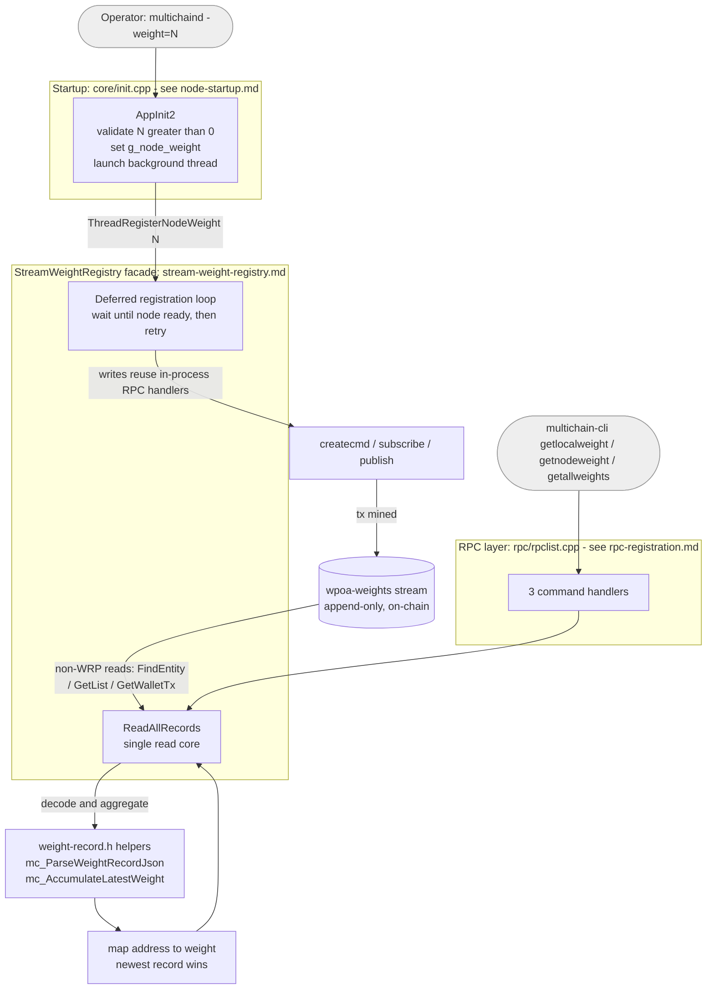

# wPoA — Stream Weight Registry (Phase 1)

> Per-validator **weight** registry for a Weighted Proof-of-Authority selector in
> MultiChain — recorded on a native append-only stream and exposed through a small,
> opaque API. This file is the entry point; the deep documentation lives in
> [`docs/`](docs/).

---

## What POAS is

**POAS** (*Proof-of-Authority Stake / weighted PoA*) extends MultiChain's
round-robin Proof-of-Authority with a notion of **validator weight**. Every
validator advertises a positive integer weight; the set of weights is the raw
material a future selector will use to bias block production toward higher-weight
validators.

**Phase 1 — the scope of this module — is registry only.** It:

- records each node's weight on an append-only MultiChain stream (`wpoa-weights`),
- keeps that record current (newest wins) and identical on every node
  (confirmed-on-chain data only), and
- exposes read access through three RPC commands and a `StreamWeightRegistry`
  class.

Weights are **not yet** used to bias mining — that is Phase 2 (see
[Implementation status](#implementation-status)).

Operators only ever touch two things:

- the startup parameter **`-weight=<n>`** (positive integer, default `100`), and
- the RPC commands **`getlocalweight`**, **`getnodeweight`**, **`getallweights`**.

Everything else — stream layout, transaction plumbing, wallet indexes — is hidden
behind the `StreamWeightRegistry` facade.

---

## Architecture at a glance

> This is the macro view of the whole feature. Each box maps to a document in the
> [table of contents](#documentation) below. **Keep this diagram in sync whenever
> the architecture changes.**



**Two mechanisms, chosen deliberately:**

- **Writes** reuse MultiChain's in-process RPC handlers (`createcmd`, `subscribe`,
  `publish`), inheriting all of its permission, fee and validation logic. They need
  no RPC worker slot, so they are safe to call from the background thread.
- **Reads** use the low-level `mc_WalletTxs` **non-WRP** API, which self-locks and
  reads live confirmed state from **any** thread. (The near-identical `WRP*` methods
  are a trap off the RPC read path — see
  [`multichain-internals.md`](docs/multichain-internals.md) §4.)

Registration is **deferred** to a background thread because writing to a stream is a
blockchain transaction: it needs an unlocked wallet, permissions, a fee, a confirmed
target stream and connectivity — none of which is guaranteed the instant `AppInit2`
finishes. Startup is never blocked, and reads degrade gracefully (return `0` / an
empty map) until data is confirmed.

---

## Documentation

All detailed documentation lives in [`docs/`](docs/). Start with the
**implementation guide**.

| Document | What it covers |
|----------|----------------|
| [implementation-guide.md](docs/implementation-guide.md) | **Start here.** How the code works and *why* every choice was made — mental model, data model, design decisions, threading & locking, full walkthrough, control flow, and concrete "how to modify" recipes. |
| [multichain-internals.md](docs/multichain-internals.md) | Reference to the MultiChain host APIs this module builds on, with exact `file:line` pointers — entities, the wallet-tx store, script decoding, RPC-handler reuse, permissions, mining. |
| [stream-weight-registry.md](docs/stream-weight-registry.md) | Line-by-line walkthrough of the core class and background thread (`stream_weight_registry.h` + `.cpp`). |
| [weight-record.md](docs/weight-record.md) | Walkthrough of the pure, dependency-light parsing/aggregation helpers (`weight_record.h`) that are unit-tested in isolation. |
| [node-startup.md](docs/node-startup.md) | How `-weight` is wired into `AppInit2` and how the background thread is launched (`core/init.h` + `.cpp`, wPoA parts). |
| [rpc-registration.md](docs/rpc-registration.md) | How the three RPC commands are added to the dispatch table (`rpc/rpclist.cpp`). |
| [testing.md](docs/testing.md) | Build steps, unit tests, the MultiChain mining model, manual single-/multi-node tests, the automated smoke test, and troubleshooting. |

### Source & test files

| File | Role |
|------|------|
| [`stream_weight_registry.h`](stream_weight_registry.h) / [`.cpp`](stream_weight_registry.cpp) | Public API + implementation of the registry, background thread and RPC handlers. |
| [`weight_record.h`](weight_record.h) | Pure parsing/aggregation helpers (json_spirit-only, unit-testable). |
| [`test/wpoa_weight_tests.cpp`](test/wpoa_weight_tests.cpp) | Boost.Test unit tests for the pure logic. |
| [`test/run_unit_tests.sh`](test/run_unit_tests.sh) | Build + run the unit tests (no node build needed). |
| [`test/functional_test_wpoa.sh`](test/functional_test_wpoa.sh) | End-to-end smoke test driving a real single node. |
| [`test/functional_test_wpoa_multinode.sh`](test/functional_test_wpoa_multinode.sh) | End-to-end test across multiple nodes. |

Integration points in the host tree: [`../core/init.cpp`](../core/init.cpp),
[`../rpc/rpclist.cpp`](../rpc/rpclist.cpp), [`../rpc/rpchelp.cpp`](../rpc/rpchelp.cpp),
[`../Makefile.am`](../Makefile.am). See
[implementation-guide.md](docs/implementation-guide.md) §7 for details.

---

## Implementation status

| Phase | Area | Status | Notes |
|:-----:|------|--------|-------|
| **1** | Weight configuration (`-weight`) & validation | Done | Validated in `AppInit2`; startup fails on `-weight <= 0`. |
| **1** | Deferred registration (background thread) | Done | Waits for readiness, retries, bounded budget before giving up. |
| **1** | On-chain append-only registry (`wpoa-weights`) | Done | Create + subscribe + publish via reused RPC handlers; idempotent re-registration. |
| **1** | Opaque read API (`GetLocalWeight`, `GetAllNodesWeights`, `GetNodeWeight`) | Done | Backward-search per address; hides stream mechanics from callers. |
| **1** | RPC surface (`getlocalweight`, `getnodeweight`, `getallweights`) | Done | Confirmed-only, thread-safe. |
| **1** | Read-path correctness fixes | Done | non-WRP read family (WRP snapshot bug) and 6-arg `OpReturnFormatEntry` overload. |
| **1** | Unit tests (pure parsing / aggregation) | Done | Boost.Test suite, node-free. |
| **1** | Single-node functional smoke test | Done | [`test/functional_test_wpoa.sh`](test/functional_test_wpoa.sh). |
| **1** | Multi-node functional smoke test | In progress | [`test/functional_test_wpoa_multinode.sh`](test/functional_test_wpoa_multinode.sh) — bootstraps `connect`/`send`/`receive`/`mine`/`wpoa-weights.write` from node 0; asserts per-node weight. |

See [implementation-guide.md §12](docs/implementation-guide.md#12-limitations--phase-2-hooks)
for the full limitations & Phase 2 hooks.

---

## Quick start

```bash
# Build (Makefile.am changed, so regenerate first):
cd /home/mattu/multichain
./autogen.sh && ./configure && make

# Run a node with a weight:
./src/multichaind <chain> -weight=100

# Query weights:
./src/multichain-cli <chain> getallweights
```

Full build and test instructions are in [testing.md](docs/testing.md).
