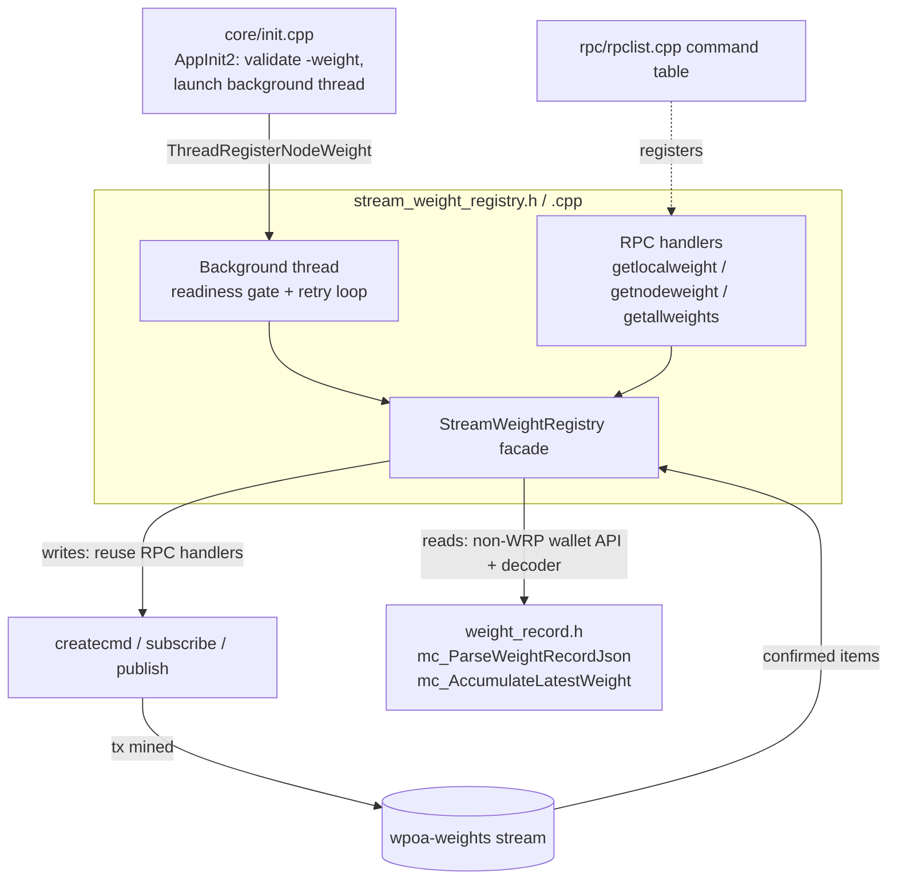
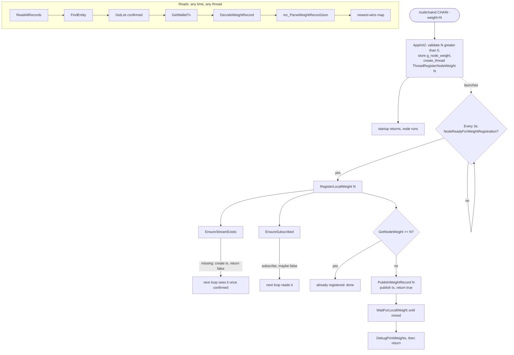

# wPoA Weight Registry — Implementation Guide (Phase 1)

This document explains **how the code works, why every choice was made, and how to
change it**. It is written so you can maintain and extend the module on your own.

Companion documents:
- [../README.md](../README.md) — feature entry point: introduction, architecture
  diagram, table of contents and implementation status.
- [multichain-internals.md](multichain-internals.md) — the MultiChain host APIs this
  module builds on, with exact `file:line` pointers into the codebase.
- [stream-weight-registry.md](stream-weight-registry.md) — line-by-line walkthrough
  of the core class and background thread.
- [weight-record.md](weight-record.md) — walkthrough of the pure parsing helpers.
- [node-startup.md](node-startup.md) — how `-weight` is wired into `AppInit2`.
- [rpc-registration.md](rpc-registration.md) — how the RPC commands are registered.
- [testing.md](testing.md) — build, unit tests, manual/automated testing, mining.

---

## Module structure at a glance



This guide walks the whole subsystem; the per-file walkthroughs
([stream-weight-registry.md](stream-weight-registry.md),
[weight-record.md](weight-record.md), [node-startup.md](node-startup.md),
[rpc-registration.md](rpc-registration.md)) zoom into each box.

---

## Table of contents

1. [What this module does](#1-what-this-module-does)
2. [File map](#2-file-map)
3. [Mental model: 4 facts you must hold in your head](#3-mental-model)
4. [The data model on the stream](#4-the-data-model-on-the-stream)
5. [Design decisions (the "why" of every choice)](#5-design-decisions)
6. [Threading & locking model](#6-threading--locking-model)
7. [Full code walkthrough](#7-full-code-walkthrough)
8. [End-to-end control flow](#8-end-to-end-control-flow)
9. [Error handling & edge cases](#9-error-handling--edge-cases)
10. [Build integration](#10-build-integration)
11. [How to modify — concrete recipes](#11-how-to-modify)
12. [Limitations & Phase 2 hooks](#12-limitations--phase-2-hooks)

---

## 1. What this module does

Phase 1 of a **Weighted Proof-of-Authority** selector. It maintains a per-validator
**weight** (a positive integer) on an append-only MultiChain **stream** named
`wpoa-weights`, and exposes a small, opaque API to read the local and global
weights. Nodes only ever touch:

- the startup parameter `-weight=<n>` (default `100`), and
- the RPC commands `getlocalweight`, `getnodeweight`, `getallweights`.

The internal mechanism (stream layout, transactions, wallet indexes) is hidden
behind the `StreamWeightRegistry` class.

Phase 1 is **registry only**: weights are recorded and queried but not yet used to
bias block production. That is Phase 2 (see §12).

---

## 2. File map

| File | Role |
|------|------|
| [`weight_record.h`](../weight_record.h) | Pure, dependency-light helpers (`mc_ParseWeightRecordJson`, `mc_AccumulateLatestWeight`). Depends only on json_spirit, so it is unit-testable in isolation. |
| [`stream_weight_registry.h`](../stream_weight_registry.h) | Public API: the `StreamWeightRegistry` class, the deferred-thread entry point, the RPC declarations, `g_node_weight`, and the two `#define`s. |
| [`stream_weight_registry.cpp`](../stream_weight_registry.cpp) | Implementation: class methods, the low-level decoder, the background thread, and the three RPC command handlers. |
| Docs | [../README.md](../README.md) (entry point), this guide, [multichain-internals.md](multichain-internals.md), [stream-weight-registry.md](stream-weight-registry.md), [weight-record.md](weight-record.md), [node-startup.md](node-startup.md), [rpc-registration.md](rpc-registration.md), [testing.md](testing.md). |
| [`test/wpoa_weight_tests.cpp`](../test/wpoa_weight_tests.cpp) | Boost.Test unit tests for the pure logic. |
| [`test/run_unit_tests.sh`](../test/run_unit_tests.sh) | Build + run the unit tests (no node build needed). |
| [`test/functional_test_wpoa.sh`](../test/functional_test_wpoa.sh) | End-to-end smoke test driving a real single node. |

Files **modified** in the host tree (integration points):

| File | Change |
|------|--------|
| [`../core/init.cpp`](../../core/init.cpp) | `-weight` help line; validate `-weight`; launch the deferred thread at the end of `AppInit2`. |
| [`../rpc/rpclist.cpp`](../../rpc/rpclist.cpp) | Register the three RPC commands (category `wpoa`). |
| [`../rpc/rpchelp.cpp`](../../rpc/rpchelp.cpp) | Help text for the three commands; allow them offline. |
| [`../Makefile.am`](../../Makefile.am) | Compile `stream_weight_registry.cpp` into `libbitcoin_wallet`; list the two headers. |

---

## 3. Mental model

Four facts explain almost every design decision in this module.

**Fact 1 — A stream is a chain entity; writing to it is a transaction.**
`create` (stream), `publish` (item), and `subscribe` all ultimately build and
broadcast a transaction or mutate wallet state. They need a wallet, permissions,
funds for the fee, and — for the stream to exist — a *confirmed* create tx.

**Fact 2 — Reads see only confirmed data.**
The read path queries the wallet's **chain-position index** for the stream, which
is updated when a block is *connected*. A transaction sitting in the mempool is
**invisible** to reads until it is mined. This is why "publish now, read the value
back now" does not work — you must wait for a block.

**Fact 3 — Reading a stream requires a subscription.**
The wallet only indexes streams you are *subscribed* to. Without a subscription,
the read API reports "not subscribed" (we treat that as "no data yet").

**Fact 4 — The RPC read handlers need an "RPC slot"; the low-level reads do not.**
`liststreamitems` and friends call `GetRPCSlot()`, which returns `-1` on any thread
that is not an RPC worker — so they cannot be reused from our background thread.
We therefore hand-roll the read from the low-level `mc_WalletTxs` API — using its
**non-WRP** methods (`GetListSize`/`GetList`/`GetWalletTx`), which self-lock and read
live state on any thread. (The *WRP* methods look similar but are a trap off the RPC
read path — see §5.3 and [multichain-internals.md](multichain-internals.md) §4.)

The consequences:
- **Writes** reuse the in-process RPC handlers `createcmd`/`subscribe`/`publish`
  (they don't need a slot) → less code, full permission/fee/validation reuse.
- **Reads** use the low-level non-WRP API + a hand-rolled decoder → callable from any
  thread (background thread *and* RPC command threads).
- **Registration is deferred** to a background thread that waits for the node to be
  ready, because none of the write prerequisites hold at the instant `AppInit2`
  finishes.

---

## 4. The data model on the stream

One stream, `wpoa-weights`. Each published item is:

- **key** = the publishing node's address (as a string), and
- **data** = a JSON object:

```json
{ "timestamp": 1751630400, "node_address": "1A1z...KvD", "weight": 100, "height": 42 }
```

**Why key = address?** It lets you fetch one node's records directly with the
built-in `liststreamkeyitems wpoa-weights <address>` for debugging, and it mirrors
the authoritative `node_address` inside the payload.

**Why store `node_address` *inside* the JSON too?** The reader parses weight and
address from the JSON payload — it does not need to walk the transaction inputs to
recover the publisher. The payload is self-describing, which keeps the decoder
simple and independent of how the tx was signed.

**Why append-only + "newest wins"?** Streams are append-only by nature. The
*current* weight of a node is simply the value in its most recent record. The
reader iterates items in chain order (oldest → newest) and overwrites a
`map<address,weight>`, so the last (newest) record wins. Changing a weight is just
appending a new record; there is nothing to mutate or delete.

---

## 5. Design decisions

Each decision below lists the choice, the rationale, and the main alternative that
was rejected.

### 5.1 Deferred (background-thread) registration, not synchronous at startup
- **Choice:** `AppInit2` validates `-weight`, stores it in `g_node_weight`, and
  launches `ThreadRegisterNodeWeight`. The thread waits for readiness and retries.
- **Why:** Fact 1. At the end of `AppInit2` the P2P layer has just started, the
  chain may still be syncing, the stream may not exist, and no block has confirmed
  anything. A synchronous publish there would fail or block startup.
- **Rejected:** publishing inside `AppInit2`. It would either fail (no confirmed
  stream / no peers / not synced) or require blocking the init thread on network
  and mining — unacceptable.

### 5.2 Writes reuse in-process RPC handlers
- **Choice:** call `createcmd`, `subscribe`, `publish` (declared in
  `rpc/rpcserver.h`) directly, passing `json_spirit::Array` params.
- **Why:** these handlers already encode all of MultiChain's permission checks, fee
  selection, OP_RETURN/OP_DROP script construction, filter validation and
  `CommitTransaction` plumbing. Reusing them is far less code and far less risk than
  re-implementing transaction building. They also do **not** call `GetRPCSlot()`,
  so they are safe from our thread (Fact 4).
- **Rejected:** replicating the low-level `SendMoneyToSeveralAddresses` +
  `mc_Script` OP_RETURN assembly (see [multichain-internals.md](multichain-internals.md) §3).
  More control, but a lot of fragile duplicated code.

### 5.3 Reads use the low-level **non-WRP** API, not the RPC read handlers or the WRP API
- **Choice:** `FindEntity` → `GetListSize` (confirmed count) → `GetList` → `GetWalletTx`,
  then decode each tx with a local `mc_Script` + `OpReturnFormatEntry`.
- **Why:** Fact 4. `liststreamitems`/`liststreamkeyitems` throw
  "Couldn't find RPC Slot" off an RPC worker thread, and `StreamItemEntry` uses
  slot-indexed temp buffers. The non-WRP wallet methods self-lock (`Lock(0,0)`) and
  read the live list, so they run correctly on any thread — the background thread
  *and* the RPC command threads.
- **⚠️ Trap we fell into (and why NOT the WRP methods):** the near-identical `WRP*`
  methods (`WRPGetListSize`, …) are what `liststreamitems` uses, so they look like the
  obvious choice. But when the read-lock feature is on (`WRPUsed()==1`, the default)
  `WRPGetListSize` returns a **snapshot** position (`m_ReadLastPos`) that is only
  advanced inside the RPC read-lock protocol (`WRPReadLock()` + writer-side
  `WRPSync()`), *not* on plain block connect. A reader that isn't part of that
  protocol (our background thread, and our own RPC handlers, which don't take the WRP
  read lock) sees the snapshot **stuck at 0** and reports "0 items" forever, even
  after the publish tx is mined. Symptom: `getallweights` returned `total:0`
  indefinitely. Fix: use the non-WRP methods, which read live `m_LastPos`/
  `m_LastClearedPos`. See [multichain-internals.md](multichain-internals.md) §4.
- **Confirmed-only:** `GetListSize`'s out-param gives the confirmed count; we read
  exactly that prefix and ignore mempool items, so every node computes the same
  registry from the same on-chain state (mempool differs per node).
- **Decode overload trap:** call the **6-arg** `OpReturnFormatEntry(...,&format_text)`,
  which returns `{"json":{...}}`. The 5-arg overload wraps it as
  `{"format":..,"formatdata":{"json":..}}` and decoding silently fails. The parser
  also unwraps `formatdata` defensively.
- **Rejected:** reusing `liststreamitems`. It would force all reads onto RPC worker
  threads and complicate the idempotency check inside the background thread.

### 5.4 One uniform read core (`ReadAllRecords`) behind all read methods
- **Choice:** `GetLocalWeight`, `GetNodeWeight`, `GetAllNodesWeights`,
  `IsLocalWeightRegistered`, `DebugPrintWeights` all call `ReadAllRecords` and then
  filter/aggregate the resulting `map`.
- **Why:** single source of truth for "how do I read the stream"; the tricky part
  (subscription check, chain order, decode) exists once. Per-node lookups on small
  streams are cheap; simplicity beats micro-optimising with `liststreamkeyitems`.
- **Rejected:** a separate key-indexed fast path for single-node lookups. Not worth
  the extra code/branching for Phase 1 stream sizes.

### 5.5 Reads exposed as RPC commands, run on RPC threads
- **Choice:** thin handlers `getlocalweight`/`getnodeweight`/`getallweights` that
  construct a `StreamWeightRegistry` and format the result.
- **Why:** gives operators an on-demand, scriptable interface; the class methods do
  the work and are slot-independent so they behave identically here and in the thread.
- **Detail:** registered `threadSafe=true` (the non-WRP wallet reads self-lock, no
  `cs_main` needed) and `reqWallet=true`. Marked allowed-when-offline so you can query
  a non-mining node.

### 5.6 Pure logic extracted into `weight_record.h` for unit testing
- **Choice:** `mc_ParseWeightRecordJson` (payload → address/weight, with validation)
  and `mc_AccumulateLatestWeight` (fold into the newest-wins map) live in a header
  that depends only on json_spirit.
- **Why:** the rest of the module is welded to the running node (wallet, streams,
  RPC), which is not unit-testable in isolation. Isolating the pure, error-prone bit
  (JSON round-trip + validation) gives real, fast, node-free unit tests.
- **Rejected:** testing only via the functional test. That covers happy paths but
  not the dozen malformed-input rejections the parser must get right.

### 5.7 Node identity = mining address (with fallbacks)
- **Choice:** resolve the address as `GetKeyFromAddressBook(MC_PTP_MINE)` →
  `MC_PTP_CONNECT` → `vchDefaultKey`.
- **Why:** a wPoA weight belongs to a *validator*, and validators are the addresses
  with `mine` permission. Falling back to connect/default keeps it working on nodes
  that are not (yet) miners.
- **Rejected:** always using `vchDefaultKey`. Simpler but semantically wrong for a
  weighting-of-validators scheme. (If you prefer connect-identity, see §11.2.)

### 5.8 Idempotency by comparing the latest confirmed weight
- **Choice:** before publishing, read the node's latest confirmed weight; if it
  already equals the requested value, skip publishing.
- **Why:** prevents appending an identical record on every restart. If `-weight`
  changed, the values differ and a new record is appended (and then wins).
- **Rejected:** persisting the last value locally, or never checking (stream bloat).

### 5.9 "Create once" and "subscribe once" guards
- **Choice:** `m_CreateAttempted` / `m_SubscribeAttempted` booleans on the (single,
  thread-owned) registry instance.
- **Why:** the background thread retries every few seconds. Without guards it would
  broadcast a new `create` tx each loop while the first is still unconfirmed
  (duplicate streams) or spam `subscribe`. `GetStreamEntity` is still checked first,
  so if *another* node creates the stream, this node proceeds normally.

### 5.10 Readiness gate does **not** require peers
- **Choice:** ready = tip exists AND (offline OR not in initial block download).
- **Why:** a single permitted miner confirms its own transactions with zero peers.
  Requiring peers would hang single-miner/small chains forever. If a node genuinely
  cannot get a tx mined, `RegisterLocalWeight` just keeps returning false and gives
  up after `MC_WPOA_MAX_ATTEMPTS` — no harm.
- **History:** an earlier version required `!vNodes.empty()`; that was a bug for
  single-node setups and was removed.

### 5.11 Bounded retry, then give up
- **Choice:** retry every `MC_WPOA_RETRY_INTERVAL_MS` (3s), up to
  `MC_WPOA_MAX_ATTEMPTS` (200, ~10 min of ready time), then stop.
- **Why:** avoids an infinite thread if the node can never register (e.g. lacks
  permissions). Readiness-gated loops don't count as attempts, so a slow initial
  sync doesn't burn the budget.

### 5.12 Logging via `LogPrintf`, prefix `[StreamWeightRegistry]`
- **Choice:** all output goes through `LogPrintf` (to `debug.log`, and to console
  with `-printtoconsole`), tagged with a fixed prefix.
- **Why:** matches MultiChain conventions and is greppable. `DebugPrintWeights`
  reproduces the exact box-drawing format the spec asked for.

---

## 6. Threading & locking model

Three execution contexts touch this code:

1. **The init thread** (`AppInit2`) — only *launches* the background thread; does no
   stream I/O itself.
2. **The background thread** (`ThreadRegisterNodeWeight`) — creates one
   `StreamWeightRegistry`, then loops: readiness check → `RegisterLocalWeight` →
   (on success) `DebugPrintWeights`.
3. **RPC worker threads** — each RPC call constructs its own short-lived
   `StreamWeightRegistry` and calls one read method.

Locking rules the code follows:

- **We never hold a global lock while calling an RPC write handler.** In
  `PublishWeightRecord` we take `cs_main` only briefly to read the height, release
  it, and *then* call `publish`. `createcmd`/`subscribe`/`publish` take whatever
  locks they need internally. This avoids lock-order inversions and deadlocks.
- **Reads self-lock.** The non-WRP methods take the wallet-txs DB lock (`Lock(0,0)`)
  internally, so `ReadAllRecords` needs no external lock (it only wraps the
  non-locking `FindEntity` in an explicit `Lock()`/`UnLock()`).
- **`GetKeyFromAddressBook` is guarded by `cs_wallet`.** That function does not lock
  internally and relies on the caller's lock context; since we call it from
  `threadSafe` RPCs (no `cs_main`) and the background thread, we take `cs_wallet`
  explicitly in `ResolveLocalAddress`.
- **Each thread owns its own `StreamWeightRegistry`.** No instance is shared between
  threads, so the `m_CreateAttempted`/`m_SubscribeAttempted` flags need no locking.
- **Local `mc_Script` in the decoder.** `DecodeWeightRecord` uses a stack-local
  `mc_Script` rather than the shared `mc_gState->m_TmpScript`/slot buffers, so
  concurrent decodes on different threads never clash.

---

## 7. Full code walkthrough

### 7.1 `weight_record.h`

Header-only, json_spirit-only. Two inline functions.

**`mc_ParseWeightRecordJson(const Value& data_value, string& node_address, uint32_t& weight)`**
- Clears the outputs first (so failure leaves `""`/`0`).
- Requires `data_value` to be an object, then unwraps the `"json"` member — this is
  the shape `OpReturnFormatEntry` returns for a UBJSON item: `{"json": {...}}`.
- Iterates the inner object's members, reading `node_address` (must be a string) and
  `weight` (accepts `int_type`; also `real_type`, truncated — UBJSON round-tripping
  can surface a numeric as a real).
- Returns `true` only if the address is non-empty **and** `weight > 0`. This is the
  single validation gate for what counts as a "real" record.

**`mc_AccumulateLatestWeight(map<string,uint32_t>& latest, addr, weight)`**
- One line: `latest[node_address] = weight;`. It exists as a named function so the
  "newest wins" semantics are explicit and unit-testable, and so `ReadAllRecords`
  reads self-documentingly.

Why inline in a header (not a `.cpp`): so the unit test can `#include` it and link
nothing but json_spirit. `inline` avoids ODR violations across the two TUs that
include it (`stream_weight_registry.cpp` and the test).

### 7.2 `stream_weight_registry.h`

- Forward-declares `mc_WalletTxs` and `mc_EntityDetails` as **`struct`** (they are
  `typedef struct` in the host headers — declaring them `class` would be a tag
  mismatch). Only pointers to them appear in the header, so forward declarations
  suffice and keep the header light.
- `#define MC_WPOA_WEIGHTS_STREAM_NAME "wpoa-weights"` and
  `#define MC_WPOA_DEFAULT_WEIGHT 100` — the two knobs used across module + init.cpp
  + rpchelp.cpp.
- The `StreamWeightRegistry` class: public API (documented per method) + private
  members (`m_pWalletTxs` borrowed pointer, `m_StreamName`, `m_LocalAddress`, the two
  "attempted" guards) + private helpers.
- `void ThreadRegisterNodeWeight(uint32_t weight);` — background entry point.
- `extern uint32_t g_node_weight;` — filled by `AppInit2`.
- The three RPC declarations (`json_spirit::Value f(const json_spirit::Array&, bool)`).

### 7.3 `stream_weight_registry.cpp`

Top of file:
- Includes are annotated with *why* each is needed. `rpc/rpcwallet.h` transitively
  pulls `rpcserver.h` (the write/RPC handler decls), `wallet.h`, `wallettxs.h`, and
  `multichain/multichain.h` (which pulls `mc_gState`, `mc_Script`, `mc_EntityDetails`,
  `mc_AssetDB`, permission constants). See [multichain-internals.md](multichain-internals.md) §1.
- `g_node_weight` is defined here (declared `extern` in the header).
- `MC_WPOA_RETRY_INTERVAL_MS` (3000) and `MC_WPOA_MAX_ATTEMPTS` (200) are file-local.

**Constructor / destructor.** The constructor stores the borrowed `mc_WalletTxs*`,
sets the stream name and the guards, and calls `ResolveLocalAddress`. The destructor
does nothing (the pointer is not owned).

**`ResolveLocalAddress`** — sets `m_LocalAddress` to `"unknown"` first, then, under
`cs_wallet`, tries mine → connect → default key and renders
`CBitcoinAddress(pkey.GetID()).ToString()`. Warnings are logged for the missing-wallet
and no-valid-key cases.

**`GetStreamEntity(mc_EntityDetails*)`** — `mc_gState->m_Assets->FindEntityByName`
(returns 1 if found), then confirms the entity type is `MC_ENT_TYPE_STREAM`. This is
the single "does the stream exist yet?" check used by both the write and read paths.

**`EnsureStreamExists`** — returns true if the stream exists; else, if not already
attempted, builds `["stream","wpoa-weights",true]` and calls `createcmd`. The
`true` means an *open* stream (any address with write permission may publish). It
sets `m_CreateAttempted` **before** the call and always returns `false` here (the
stream is only usable once the create tx confirms; the next loop iteration will see
it via `GetStreamEntity`). Exceptions (thrown as `json_spirit::Object` by
`JSONRPCError`, or `std::exception`) are caught and logged.

**`EnsureSubscribed`** — requires the stream to exist, then builds an
`mc_TxEntityStat` for it (see the read section for the layout) and checks
`WRPFindEntity`; if already subscribed, returns true. Otherwise calls `subscribe`
once and re-checks (a short stream may import synchronously).

**`PublishWeightRecord`** — builds the JSON `record`, reads the height under a brief
`cs_main`, wraps it as `{"json": record}`, and calls `publish` with
`["wpoa-weights", <address>, {"json":{...}}]`. On success the returned value is the
txid string, which is logged. Returns true iff the publish tx was broadcast.

**`RegisterLocalWeight`** — the orchestrator:
1. reject `weight == 0`;
2. require wallet present;
3. `EnsureStreamExists()` (false → created/awaiting confirmation, try again later);
4. `EnsureSubscribed()` (false → import in progress);
5. idempotency: `GetNodeWeight(local) == weight` → done;
6. else `PublishWeightRecord(weight)`.
Any `false` return means "not done yet, call me again" — which is exactly what the
retry loop does.

**`DecodeWeightRecord` (static)** — turns one `CWalletTx` into `(address, weight)`:
- iterate outputs; parse each `scriptPubKey` into a local `mc_Script`;
- skip non-OP_RETURN scripts;
- `ExtractAndDeleteDataFormat` strips the format meta element (so the last element is
  the payload) and yields the `format`;
- element 0 must be our stream entity (`GetEntity` == 0 and short-txid matches);
- take the last element as the data blob;
- `OpReturnFormatEntry(data, size, txid, vout, format, &format_text)` (the **6-arg**
  overload) → `{"json": {...}}` for UBJSON; hand it to `mc_ParseWeightRecordJson`.
  (The 5-arg overload returns a wrapped shape — see §5.3.)
This mirrors how the host's `StreamItemEntry` decodes items (see
[multichain-internals.md](multichain-internals.md) §5) but uses a local script buffer and needs no RPC slot.

**`ReadAllRecords`** — the read core (uses the **non-WRP** wallet API; see §5.3):
- fail fast if no wallet, or the stream doesn't exist, or we're not subscribed
  (`FindEntity`, guarded by `Lock()`/`UnLock()`);
- `GetListSize(&confirmed)` → read the **confirmed** count; `confirmed <= 0` →
  subscribed-but-no-confirmed-items-yet (return an empty map, which is success);
- allocate a local `mc_Buffer` of `mc_TxEntityRow`;
- `GetList(..., from=1, count=confirmed, ...)` fetches the confirmed items in
  **ascending** chain order;
- for each row: skip extension rows (`MC_TFL_IS_EXTENSION`), copy the 32-byte txid
  into a `uint256`, `GetWalletTx` to load the full tx, `DecodeWeightRecord`, and
  `mc_AccumulateLatestWeight` (newest wins).

**`GetNodeWeight` / `GetLocalWeight` / `GetAllNodesWeights` / `IsLocalWeightRegistered`
/ `DebugPrintWeights`** — all call `ReadAllRecords` and then filter/aggregate the map.
`GetAllNodesWeights` also sums a `total` for the log. `DebugPrintWeights` renders the
spec's box format.

**`NodeReadyForWeightRegistration` (static)** — tip present, and (unless `-offline`)
`!IsInitialBlockDownload()`. No peer requirement (see §5.10).

**`WaitForLocalWeight(weight, max_attempts, interval_ms)`** — polls `ReadAllRecords`
(quietly, no per-attempt warnings) until this node's confirmed weight equals
`weight`, or the attempts/`interval` budget elapses, or shutdown is requested.
Returns whether it confirmed. This is what makes the debug dump accurate: a just-
published tx is unconfirmed, so without this wait the dump would show `0`.

**`ThreadRegisterNodeWeight`** — renames the thread, bails if the wallet is absent,
constructs one registry, and loops: sleep 3s → bail on shutdown → skip if not ready
(not counted as an attempt) → `RegisterLocalWeight`. On success it calls
`WaitForLocalWeight` (up to `MC_WPOA_CONFIRM_ATTEMPTS` × interval, ~60s) so the tx
is mined & imported, logs `Weight confirmed on-chain` (or `awaiting a block` on
timeout), prints `DebugPrintWeights`, and returns. After `MC_WPOA_MAX_ATTEMPTS`
ready-attempts without success, it gives up.

**`getlocalweight` / `getnodeweight` / `getallweights`** — standard RPC handlers:
help text on `fHelp`/bad arity, `JSONRPCError` if the wallet is unavailable,
construct a registry, call the matching method(s), return a `json_spirit::Object`.

### 7.4 `../core/init.cpp` integration

- Include added: `#include "poas/stream_weight_registry.h"`.
- Help line for `-weight` added in `HelpMessage` (uses `MC_WPOA_DEFAULT_WEIGHT`).
- At the **end of `AppInit2`**, just before `return !fRequestShutdown;`, inside
  `#ifdef ENABLE_WALLET`:
  - read `GetArg("-weight", MC_WPOA_DEFAULT_WEIGHT)`; if `<= 0`, `return InitError(...)`
    (fails startup with a clear message);
  - store it in `g_node_weight`;
  - if wallet + tx store are present and the wallet isn't disabled,
    `threadGroup.create_thread(boost::bind(&ThreadRegisterNodeWeight, g_node_weight))`.
- Placed last so the wallet, RPC warmup and node are already up; the thread manages
  the rest of the readiness wait itself.

### 7.5 `../rpc/rpclist.cpp` registration

Three rows added to the command table (guarded by `#ifdef ENABLE_WALLET`, since the
handlers live in the wallet lib):

```
{ "wpoa", "getlocalweight", &getlocalweight, true, true, true },
{ "wpoa", "getallweights",  &getallweights,  true, true, true },
{ "wpoa", "getnodeweight",  &getnodeweight,  true, true, true },
```

Columns are `okSafeMode, threadSafe, reqWallet`. `threadSafe=true` because the reads
use the self-locking non-WRP wallet API and need no `cs_main`; `reqWallet=true`
because they need the wallet/tx store.

### 7.6 `../rpc/rpchelp.cpp` help

- Include added for the stream-name macro.
- Three `mapHelpStrings.insert(...)` entries appended in `mc_InitRPCHelpMap25()`
  (before its `"AAAAAAA"` sentinel), following the existing help style.
- The three commands added to `setAllowedWhenOffline` so operators can query weights
  even on an offline node.

### 7.7 `../Makefile.am`

- `poas/stream_weight_registry.cpp` added to `libbitcoin_wallet_a_SOURCES` (it uses
  wallet + RPC-handler symbols that live in that lib).
- `poas/stream_weight_registry.h` and `poas/weight_record.h` added to
  `BITCOIN_CORE_H` (tracked headers for the dist).
- After editing `Makefile.am` you must regenerate: `./autogen.sh && ./configure`.

---

## 8. End-to-end control flow



The two "return false, next loop sees it" arrows are the crux: the create and publish
transactions must be **mined** before the following step can proceed. On a single
miner this is a few seconds per block; see [testing.md](testing.md) §3/§6.

---

## 9. Error handling & edge cases

| Situation | Where handled | Behaviour |
|-----------|---------------|-----------|
| `-weight <= 0` | `AppInit2` | `InitError` → startup fails with a message. |
| `weight == 0` passed to API | `RegisterLocalWeight` | logs error, returns false. |
| Wallet not loaded | ctor / `RegisterLocalWeight` / RPC handlers | placeholder address / early return / `JSONRPCError`. |
| Stream missing | `EnsureStreamExists` | `create` once, wait for confirmation. |
| No `create` permission | `EnsureStreamExists` catch | logged; retries until stream appears or gives up. |
| Not subscribed | `EnsureSubscribed` / `ReadAllRecords` | subscribe (writes) / return empty (reads). |
| Stream empty | `ReadAllRecords` | returns an empty map (success). |
| Node never registered | `GetLocalWeight` | returns 0 + warning. |
| Malformed record on stream | `mc_ParseWeightRecordJson` | skipped (not counted). |
| Publish tx unconfirmed | reads | invisible until mined (by design). |
| Restart, same weight | `RegisterLocalWeight` idempotency | no new record. |
| Restart, changed weight | `RegisterLocalWeight` | appends; newest wins. |
| Offline node | readiness / mining | can't confirm txs → retries → gives up (harmless). |
| Can't get txs mined | retry loop | gives up after `MC_WPOA_MAX_ATTEMPTS`. |

---

## 10. Build integration

- The module compiles into `libbitcoin_wallet` (it references wallet + RPC-handler
  symbols). `init.cpp`/`rpclist.cpp`/`rpchelp.cpp` (server lib) reference the module's
  symbols; the final binary links both libs, so they resolve.
- The RPC registration and the init hook are under `#ifdef ENABLE_WALLET` so a
  wallet-less build still links.
- Regenerate after the `Makefile.am` change: `./autogen.sh && ./configure && make`.
- **Verification already done:** every touched `.cpp` compiles with the project's
  flags; the module's undefined symbols (`publish`, `createcmd`, `subscribe`,
  `OpReturnFormatEntry`, the non-WRP wallet methods `FindEntity`/`GetListSize`/
  `GetList`/`GetWalletTx`/`Lock`/`UnLock`, `FindEntityByName`, `GetKeyFromAddressBook`)
  match exact mangled definitions in `libbitcoin_wallet.a`; the unit tests pass; and
  the functional smoke test confirms `getallweights` returns the registered weight.

---

## 11. How to modify

### 11.1 Change the stream name or default weight
Edit the two `#define`s in [`stream_weight_registry.h`](../stream_weight_registry.h)
(`MC_WPOA_WEIGHTS_STREAM_NAME`, `MC_WPOA_DEFAULT_WEIGHT`). They flow into the module,
`init.cpp` (help/validation) and `rpchelp.cpp` automatically.

### 11.2 Use the connect address (not the mining address) as node identity
In `ResolveLocalAddress`, reorder the `GetKeyFromAddressBook` calls: try
`MC_PTP_CONNECT` first, then `MC_PTP_MINE`, then `vchDefaultKey`.

### 11.3 Add a field to the record (e.g. a version tag)
1. In `PublishWeightRecord`, add `record.push_back(Pair("version", (int64_t)1));`.
2. If you need to read it back, extend `mc_ParseWeightRecordJson` in
   [`weight_record.h`](../weight_record.h) to pull the new member, and add a unit test in
   [`test/wpoa_weight_tests.cpp`](../test/wpoa_weight_tests.cpp).
Old records without the field still parse (the reader only requires address+weight).

### 11.4 Make the stream read-restricted (only admins may set weights)
Change the `create` call in `EnsureStreamExists` from `true` to a restrict object,
e.g. `{"restrict":"write"}`, and grant explicit per-stream write permission to the
allowed addresses. See MultiChain's `create stream ... {"restrict":...}` docs and
`createstreamfromcmd` ([multichain-internals.md](multichain-internals.md) §3).

### 11.5 Tune retry pacing / give-up budget
Edit `MC_WPOA_RETRY_INTERVAL_MS` and `MC_WPOA_MAX_ATTEMPTS` at the top of the `.cpp`.

### 11.6 Add a new read RPC (e.g. `gettotalweight`)
1. Declare it in [`stream_weight_registry.h`](../stream_weight_registry.h).
2. Implement it in the `.cpp` (construct a registry, call `GetAllNodesWeights`, sum).
3. Register it in [`../rpc/rpclist.cpp`](../../rpc/rpclist.cpp) (category `wpoa`,
   `true,true,true`).
4. Add help in [`../rpc/rpchelp.cpp`](../../rpc/rpchelp.cpp) and, if it should work
   offline, add it to `setAllowedWhenOffline`.

### 11.7 Consume the weights elsewhere in the node (Phase 2 starting point)
Anywhere with the wallet available, construct a `StreamWeightRegistry` and call
`GetAllNodesWeights()`. From non-RPC threads this is safe (the non-WRP reads
self-lock and need no RPC slot), and it returns confirmed-only state, so a selector
built on it is deterministic across nodes.
The natural integration point for weighted selection is the miner
(`src/miner/miner.cpp`), where the round-robin miner set is chosen.

---

## 12. Limitations & Phase 2 hooks

- **Registry only.** Weights are recorded/queried but not yet used to bias mining.
- **On-chain records only** (no off-chain/large payloads).
- **Any writer can set its own weight** (open stream). A future phase should restrict
  who may set weights (admin-signed updates) — see §11.4.
- **Append-only growth.** Re-registration appends rather than mutating; a trimming or
  checkpoint scheme could bound growth.
- **Phase 2 ideas:** dynamic weights, weight decay, slashing, and a weighted miner
  selection in `miner.cpp` driven by `GetAllNodesWeights()`.
