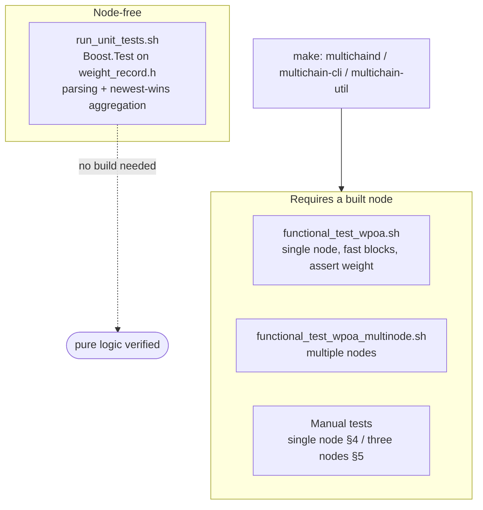
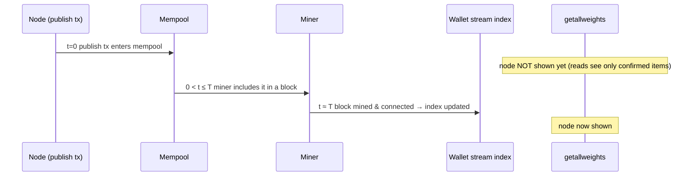

# wPoA Weight Registry — Testing Guide

> How to build, unit-test and functionally test the module — plus the MultiChain
> mining model that explains why reads lag writes.

This document covers:

1. [Building](#1-building)
2. [Automated unit tests](#2-automated-unit-tests)
3. [How MultiChain mining works (and why it matters here)](#3-how-multichain-mining-works)
4. [Manual test — single node (quick)](#4-manual-test--single-node-quick)
5. [Manual test — three nodes with weights 100 / 80 / 50 (full)](#5-manual-test--three-nodes-full)
6. [When exactly do the records appear?](#6-when-exactly-do-records-appear)
7. [Automated functional smoke test](#7-automated-functional-smoke-test)
8. [Troubleshooting](#8-troubleshooting)

Throughout, `CHAIN` is the blockchain name and the binaries are in `./src`
(`multichaind`, `multichain-cli`, `multichain-util`).

## Test layers at a glance



---

## 1. Building

The module lives in `libbitcoin_wallet`. Because `src/Makefile.am` changed,
regenerate the build files first:

```bash
cd /home/mattu/multichain
./autogen.sh            # or: autoreconf -i
./configure             # your usual flags
make                    # produces src/multichaind, src/multichain-cli, src/multichain-util
```

---

## 2. Automated unit tests

The pure record-parsing / aggregation logic (`src/poas/weight_record.h`) has a
self-contained Boost.Test suite that does **not** require the node to be built:

```bash
./src/poas/test/run_unit_tests.sh
```

Expected tail:

```
Running 16 test cases...
*** No errors detected
OK — all wPoA unit tests passed.
```

The suite covers: valid records, field-order independence, real/large weights,
and rejection of malformed input (missing `json` wrapper, missing/empty address,
missing/zero/negative/wrong-typed weight), plus the "newest record wins"
aggregation used by `GetAllNodesWeights`.

---

## 3. How MultiChain mining works

This matters because **registering a weight is a transaction**, and a
transaction is only visible to the read API once it is **mined into a block**.

### 3.1 Proof-of-Authority round-robin
MultiChain does not use hash-based PoW. Blocks are produced by addresses that
hold the **`mine` permission**, in a **round-robin** fashion. The relevant chain
parameters (defaults shown) are:

| Parameter | Default | Meaning |
|-----------|---------|---------|
| `target-block-time` | 15 s | Target delay between blocks. |
| `setup-first-blocks` | 60 | Initial "setup" phase where `mining-diversity`, `admin-consensus-*` and `mining-requires-peers` are **relaxed** — lets the first admin bootstrap the chain alone. |
| `mining-requires-peers` | true | A node won't mine unless it has peers — **ignored if there is only one permitted miner**. |
| `mining-diversity` | 0.3 | A miner must wait `mining-diversity × (active miners)` blocks before mining again (prevents one miner monopolising). |
| `mine-empty-rounds` | 10 | Mine at most this many rounds of **empty** blocks, then pause and wait for a transaction. |

### 3.2 The lifecycle of a weight registration

When a node starts with `-weight=N`, `AppInit2` validates `N` and launches a
background thread (`ThreadRegisterNodeWeight`). That thread:

1. **Waits until ready** — a chain tip exists and (unless `-offline`) the initial
   block download has finished. *Peers are not required*: a single permitted
   miner can confirm its own transactions.
2. **Ensures the stream exists** — if `wpoa-weights` is missing it broadcasts a
   `create` transaction (needs `create` permission) and returns; the stream is
   only usable once that transaction **confirms in a block**.
3. **Subscribes** to the stream (needed to read it back).
4. **Publishes** its weight record (a `publish` transaction) — unless the latest
   confirmed weight already equals `N` (idempotent).

Each of steps 2–4 is a transaction that a miner must include in a block. With
`mine-empty-rounds`, a node may have *stopped* producing empty blocks — but a new
transaction **wakes mining up**, so the next block (within ~`target-block-time`)
includes it.

### 3.3 Confirmed vs. unconfirmed — the key point
The read API (`getlocalweight` / `getallweights` / `getnodeweight`) reads from
the wallet's **confirmed stream index** (chain-position index), which is updated
when a block is **connected**. A freshly broadcast transaction sits in the
mempool and is **not** in that index yet, so:

> A weight becomes visible only **after the block containing its `publish`
> transaction has been mined and connected** on the node you are querying.

---

## 4. Manual test — single node (quick)

The fastest way to see the whole flow end to end. A single node is the only
permitted miner, so it mines its own `create` and `publish` transactions.

```bash
cd /home/mattu/multichain/src

# 1. Create the chain.
./multichain-util create wpoa1

# 2. (Optional) speed up mining for testing: edit ~/.multichain/wpoa1/params.dat
#    BEFORE the first multichaind run and set:
#       target-block-time = 2
#       mine-empty-rounds = 50
#    (These are fixed at chain creation, so they must be set now.)

# 3. Start the node with a weight (foreground; watch the log). Ctrl-C to stop.
./multichaind wpoa1 -weight=100
#    ... or run detached:  ./multichaind wpoa1 -weight=100 -daemon

# 4. In another terminal, watch it register (may take a few block times):
watch -n 2 './multichain-cli wpoa1 getallweights'
```

Within a few block times you should see:

```json
{
  "validators" : 1,
  "total" : 100,
  "weights" : {
    "1Node...address...": 100
  }
}
```

You can also inspect the raw stream and the local view:

```bash
./multichain-cli wpoa1 liststreams                 # confirm "wpoa-weights" exists
./multichain-cli wpoa1 liststreamitems wpoa-weights # raw items (key = address, data = json)
./multichain-cli wpoa1 getlocalweight               # this node's weight
```

**Change the weight:** stop the node, restart with a different value
(`./multichaind wpoa1 -weight=250`). A new record is appended and, once mined,
`getallweights` reflects `250` (newest record wins).

---

## 5. Manual test — three nodes (full)

Weights: node A = 100 (admin), node B = 80, node C = 50. Run all three on one
machine using separate data directories and ports (or one per machine, dropping
the `-datadir`/`-port`/`-rpcport` overrides).

### 5.1 Create the chain and start node A (admin)

```bash
cd /home/mattu/multichain/src
mkdir -p ~/wpoa/A ~/wpoa/B ~/wpoa/C

# Create the chain (params stored under ~/wpoa/A).
./multichain-util create wpoa3 -datadir=$HOME/wpoa/A

# (Optional) edit ~/wpoa/A/wpoa3/params.dat for faster blocks:
#   target-block-time = 3
#   mine-empty-rounds = 50

# Start node A. It initialises the chain, becomes admin + first miner,
# and registers weight 100.
./multichaind wpoa3 -datadir=$HOME/wpoa/A -port=7471 -rpcport=7481 -weight=100 -daemon

# Note node A's own address and the connect string:
./multichain-cli -datadir=$HOME/wpoa/A -rpcport=7481 wpoa3 getinfo
#   -> "nodeaddress" : "wpoa3@<ip>:7471"
A_ADDR=$(./multichain-cli -datadir=$HOME/wpoa/A -rpcport=7481 wpoa3 getaddresses | head)
```

### 5.2 Start node B, get its address, grant permissions

```bash
# First launch of B connects to A; it prints B's address and waits for permission.
./multichaind wpoa3@<A-ip>:7471 -datadir=$HOME/wpoa/B -port=7472 -rpcport=7482 -weight=80 -daemon

# Read B's address from its log / getinfo:
./multichain-cli -datadir=$HOME/wpoa/B -rpcport=7482 wpoa3 getinfo   # "burnaddress"? use the printed address
#   The daemon log prints: "... grant <B-ADDRESS> connect ..."

# On node A, grant B connect/send/receive, and mine (to make it a validator):
./multichain-cli -datadir=$HOME/wpoa/A -rpcport=7481 wpoa3 grant <B-ADDRESS> connect,send,receive
./multichain-cli -datadir=$HOME/wpoa/A -rpcport=7481 wpoa3 grant <B-ADDRESS> mine
```

### 5.3 Start node C, grant permissions

```bash
./multichaind wpoa3@<A-ip>:7471 -datadir=$HOME/wpoa/C -port=7473 -rpcport=7483 -weight=50 -daemon
./multichain-cli -datadir=$HOME/wpoa/A -rpcport=7481 wpoa3 grant <C-ADDRESS> connect,send,receive
./multichain-cli -datadir=$HOME/wpoa/A -rpcport=7481 wpoa3 grant <C-ADDRESS> mine
```

Once B and C have `connect,send`, their background threads publish their weights;
once they also have `mine`, they join the round-robin miner set.

### 5.4 Verify (from any node)

```bash
./multichain-cli -datadir=$HOME/wpoa/A -rpcport=7481 wpoa3 getallweights
```

Expected (order may vary):

```json
{
  "validators" : 3,
  "total" : 230,
  "weights" : {
    "<A-ADDRESS>": 100,
    "<B-ADDRESS>": 80,
    "<C-ADDRESS>": 50
  }
}
```

And in each node's `debug.log` (after its own successful registration):

```
[StreamWeightRegistry] ════════════════════════════════════════
[StreamWeightRegistry] === WEIGHT REGISTRY DEBUG LOG ===
[StreamWeightRegistry] Stream: wpoa-weights
[StreamWeightRegistry] Local Node Address: <this-node-address>
[StreamWeightRegistry] Local Weight: <n>
...
[StreamWeightRegistry] Total Weight (sum): 230
[StreamWeightRegistry] Number of Validators: 3
[StreamWeightRegistry] ════════════════════════════════════════
```

> **Reading on a node that is not a validator:** any node that is subscribed to
> `wpoa-weights` can read all weights. Our code auto-subscribes each participating
> node; a pure observer can subscribe manually with
> `multichain-cli <chain> subscribe wpoa-weights`.

---

## 6. When exactly do records appear?

Timeline after a node broadcasts its `publish` transaction (single-miner or with
a miner peer available), with `T` = `target-block-time`:



Notes:

- After a successful publish, the background thread **waits for the record to be
  confirmed** (polls up to `MC_WPOA_CONFIRM_ATTEMPTS` × `MC_WPOA_RETRY_INTERVAL_MS`,
  ~60s) before it logs `Weight confirmed on-chain` and prints `DebugPrintWeights()`.
  So the debug dump normally shows the committed value, not `0`. If the wait times
  out (e.g. no miner available yet) it logs `Weight submitted; awaiting a block`
  and the dump may show `0` until a block arrives — re-run `getallweights` then.
- The stream itself must be created first, so the very first node needs **two**
  confirmations end to end: one block for `create`, then one block for `publish`.
- On a multi-node chain, a node's record is visible on **other** nodes only after
  the block propagates to them and their wallet imports it — essentially one
  block time after mining, plus network latency.
- `mine-empty-rounds` can make an idle chain stop producing blocks. That is
  normal: the pending `create`/`publish` transaction wakes the miner, so a block
  is produced shortly after. If you see a transaction "stuck", check that at
  least one node has `mine` permission and (for multi-node) that
  `mining-requires-peers` is satisfied.

---

## 7. Automated functional smoke test

`src/poas/test/functional_test_wpoa.sh` drives a **real single node** end to end:
it creates a throwaway chain with fast blocks, starts `multichaind -weight=<N>`,
polls `getallweights` until the weight is confirmed, asserts the value, then
stops the node and cleans up. It requires the node to be built first (§1).

```bash
# after `make`:
./src/poas/test/functional_test_wpoa.sh              # uses ./src binaries, weight 137
BINDIR=./src WEIGHT=200 ./src/poas/test/functional_test_wpoa.sh
```

Exit code `0` and `FUNCTIONAL TEST PASSED` on success; non-zero with diagnostics
on failure.

---

## 8. Troubleshooting

| Symptom | Likely cause / fix |
|---------|--------------------|
| `getallweights` stays empty | No block has confirmed the `publish` tx yet. Ensure a node has `mine` permission; wait `target-block-time`. |
| Only your node appears | Other nodes lack `send`/`connect` (can't publish) or their block hasn't reached you yet. |
| `Not subscribed to this stream` in log | The node hasn't finished subscribing/importing; it retries automatically. |
| Stream never created | The first node lacks `create` permission. Grant it or start the chain from an admin node. |
| Weight didn't change after restart | You restarted with the **same** `-weight` (idempotent — no new record). Use a different value. |
| `Invalid -weight value` at startup | `-weight` must be a positive integer. |
| Node with `-offline` never registers | Offline nodes don't mine and have no peers, so transactions can't confirm. Use a normal (networked or single-miner) node. |

### 8.1 Deep debugging: `-wpoadebug`

Start the node with `-wpoadebug` to trace the stream read path. Each read logs, to
`debug.log`, whether the stream/subscription was found, the confirmed item count, and
the per-item decode result, e.g.:

```
[wpoa-dbg] ReadAllRecords: FindEntity OK, generation=1, total=1 confirmed=1
[wpoa-dbg] ReadAllRecords: GetList OK, rows=1
[wpoa-dbg]   row 0: hash=8f9e2f… vout=2 decode=OK addr=1U6Wtf… w=137
```

This is what pinpointed the two read-path bugs fixed in this module (see
[implementation-guide.md](implementation-guide.md) §5.3):
using the WRP snapshot API off the RPC thread (list size always 0), and calling the
wrong `OpReturnFormatEntry` overload (every item `decode=FAIL`). If you ever see
`GetListSize` non-zero but `decode=FAIL`, compare your decode against the reference
`liststreamitems <stream> true`, which prints the item MultiChain actually stored.

---

## Related documents

- [../README.md](../README.md) — feature entry point and architecture diagram.
- [implementation-guide.md](implementation-guide.md) — the design, including the two
  read-path bugs these tests helped find (§5.3).
- [multichain-internals.md](multichain-internals.md) §8 — the mining model referenced
  in §3.
- [stream-weight-registry.md](stream-weight-registry.md) — the code under test.
