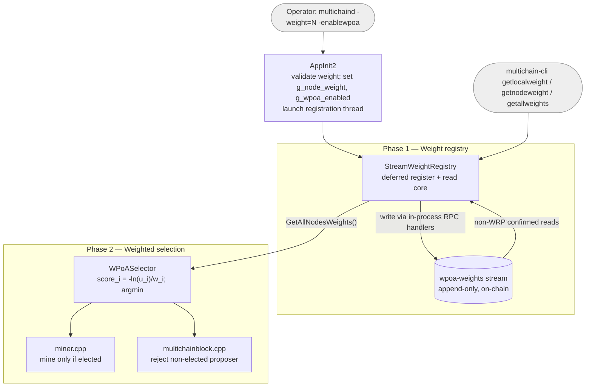

# wPoA — Weighted Proof-of-Authority for MultiChain

> A **Weighted Proof-of-Authority** consensus extension for MultiChain: every
> validator advertises a positive integer **weight** on a native append-only
> stream (Phase 1), and block proposers are elected in **proportion to that
> weight** via the Efraimidis–Spirakis weighted-sampling transform (Phase 2).
> This file is the entry point; the deep, per-phase documentation lives in
> [`docs/`](docs/) — start at the master
> [implementation-guide.md](docs/implementation-guide.md).

---

## What wPoA is

**wPoA** (*Weighted Proof-of-Authority*) extends MultiChain's round-robin
Proof-of-Authority with a notion of **validator weight**, so that block
production is biased toward higher-weight validators instead of being uniform.

Two phases are implemented today:

- **Phase 1 — Weight registry.** Each node records its weight on an append-only
  MultiChain stream (`wpoa-weights`), kept current (newest wins) and identical on
  every node (confirmed-on-chain data only), exposed through three RPC commands
  and a `StreamWeightRegistry` class.
- **Phase 2 — Weighted miner selection.** When `-enablewpoa=1`, the miner and
  the block validator elect each height's proposer in proportion to weight via
  the Efraimidis–Spirakis argmin, seeded by the previous block hash, bypassing
  the native round-robin mining-diversity gate. This phase is intentionally
  public/predictable — the substrate-validation baseline before privacy is added
  in later phases.

Phases 3–5 (RANDAO+VRF beacon, private sortition, VDF) are planned — see the
[Implementation status](#implementation-status) and the master
[implementation-guide.md](docs/implementation-guide.md).

Operators only ever touch a few things:

- the startup parameters **`-weight=<n>`** (positive integer, default `100`) and
  **`-enablewpoa`** (default off; enables weighted selection), and
- the RPC commands **`getlocalweight`**, **`getnodeweight`**, **`getallweights`**.

Everything else — stream layout, transaction plumbing, wallet indexes, the
election math — is hidden behind the `StreamWeightRegistry` facade and the
`WPoASelector`.

---

## Architecture at a glance

> Macro view of the whole feature across phases. This is deliberately
> high-level; the per-phase mechanics live in the phase guides linked from the
> master [implementation-guide.md](docs/implementation-guide.md). **Keep this
> diagram in sync whenever the architecture changes** (see the
> [Documentation Maintenance](docs/implementation-guide.md#documentation-maintenance)
> process).



- **Phase 1** records and serves weights on the `wpoa-weights` stream via the
  `StreamWeightRegistry` facade (deferred background registration; confirmed-only
  reads that are safe from any thread). Full detail:
  [phase1-implementation-guide.md](docs/phase1-implementation-guide.md).
- **Phase 2** consumes `GetAllNodesWeights()` and elects each height's proposer
  in proportion to weight, gating the miner and the block validator behind
  `-enablewpoa`. Full detail:
  [phase2-implementation-guide.md](docs/phase2-implementation-guide.md).

---

## Documentation Structure

This project contains multiple levels of documentation:

1. **[Thesis Project Overview](docs/thesis-project-overview.md)**
   - For researchers & students: Theory, threat modeling, literature review, mathematical foundations
   - Learn WHY we use Efraimidis–Spirakis and what security properties it provides

2. **[Implementation Roadmap](docs/implementation-roadmap.md)**
   - For developers & contributors: Phased plan, current status, components, vulnerabilities
   - Understand what's implemented, what's planned, and how pieces connect

3. **[Implementation Guide (master index)](docs/implementation-guide.md)**
   - The high-level map of all phases + links to each phase's dedicated technical
     guide, and the **Documentation Maintenance** process for future features
   - Start here for code, then dive into the phase guide you need:
     [Phase 1](docs/phase1-implementation-guide.md) ·
     [Phase 2](docs/phase2-implementation-guide.md)

---

## Documentation

All detailed documentation lives in [`docs/`](docs/). Start at the master
**[implementation-guide.md](docs/implementation-guide.md)** (phase map + links),
or the **[Documentation Structure](#documentation-structure)** above if you're
new to the project.

| Document | What it covers |
|----------|----------------|
| [implementation-guide.md](docs/implementation-guide.md) | **Master index.** High-level map of all phases, how they build on each other, links to every per-phase guide, and the Documentation Maintenance process. |
| [phase1-implementation-guide.md](docs/phase1-implementation-guide.md) | **Phase 1 — full technical guide.** Weight registry: mental model, data model, design decisions, threading & locking, full code walkthrough, control flow, "how to modify" recipes. |
| [phase2-implementation-guide.md](docs/phase2-implementation-guide.md) | **Phase 2 — full technical guide.** Weighted miner selection: mental model, algorithm, design decisions, threading, full code walkthrough, control flow, edge cases, "how to modify" recipes, tests, and accepted risks / Phase 3-4 hooks. |
| [thesis-project-overview.md](docs/thesis-project-overview.md) | Research companion: problem statement, threat model, literature review, theoretical contributions behind the wPoA design (bachelor's thesis, Università di Pisa). |
| [implementation-roadmap.md](docs/implementation-roadmap.md) | Engineering companion: phased plan, rationale for private (Efraimidis) sortition over public WRS, current status, vulnerabilities & mitigations. |
| [multichain-internals.md](docs/multichain-internals.md) | Reference to the MultiChain host APIs this module builds on, with exact `file:line` pointers — entities, the wallet-tx store, script decoding, RPC-handler reuse, permissions, mining. |
| [stream-weight-registry.md](docs/stream-weight-registry.md) | Line-by-line walkthrough of the Phase 1 registry class and background thread (`stream_weight_registry.h` + `.cpp`). |
| [weight-record.md](docs/weight-record.md) | Walkthrough of the pure, dependency-light parsing/aggregation helpers (`weight_record.h`) that are unit-tested in isolation. |
| [wpoa-selector.md](docs/wpoa-selector.md) | Line-by-line walkthrough of the Phase 2 selector core and node glue (`wpoa_selector.h` + `.cpp`): scoring, argmin, activation gate, registry read. |
| [miner-integration.md](docs/miner-integration.md) | How the weighted election is wired into block production (`miner/miner.cpp`, `GetMinerAndExpectedMiningStartTime`). |
| [block-validation.md](docs/block-validation.md) | How the election is enforced on the receiving side (`protocol/multichainblock.cpp`, `VerifyBlockMiner` → `VerifyBlockMinerWPoA`). |
| [node-startup.md](docs/node-startup.md) | How `-weight` (Phase 1) and `-enablewpoa` (Phase 2) are wired into `AppInit2` and how the background thread is launched (`core/init.h` + `.cpp`, wPoA parts). |
| [rpc-registration.md](docs/rpc-registration.md) | How the three RPC commands are added to the dispatch table (`rpc/rpclist.cpp`). |
| [testing.md](docs/testing.md) | Build steps, unit tests, the MultiChain mining model, manual single-/multi-node tests, the automated smoke test, and troubleshooting. |

### Source & test files

| File | Role |
|------|------|
| [`stream_weight_registry.h`](stream_weight_registry.h) / [`.cpp`](stream_weight_registry.cpp) | Phase 1: public API + implementation of the registry, background thread and RPC handlers. |
| [`weight_record.h`](weight_record.h) | Phase 1: pure parsing/aggregation helpers (json_spirit-only, unit-testable). |
| [`wpoa_selector.h`](wpoa_selector.h) / [`.cpp`](wpoa_selector.cpp) | Phase 2: pure Efraimidis–Spirakis selector core (header-only) + node-coupled glue (flag, activation predicate, registry-backed election). |
| [`test/wpoa_weight_tests.cpp`](test/wpoa_weight_tests.cpp) | Phase 1: Boost.Test unit tests for the pure registry logic. |
| [`test/wpoa_selector_tests.cpp`](test/wpoa_selector_tests.cpp) | Phase 2: Boost.Test unit tests for the pure selector math (determinism, order-independence, probability preservation). |
| [`test/run_unit_tests.sh`](test/run_unit_tests.sh) / [`test/run_selector_unit_tests.sh`](test/run_selector_unit_tests.sh) | Build + run the unit tests (no node build needed). |
| [`test/functional_test_wpoa.sh`](test/functional_test_wpoa.sh) | End-to-end smoke test driving a real single node. |
| [`test/functional_test_wpoa_multinode.sh`](test/functional_test_wpoa_multinode.sh) / [`test/analyze_distribution.py`](test/analyze_distribution.py) | End-to-end multi-node test + chi-square proposer-distribution analyzer. |

Integration points in the host tree: [`../core/init.cpp`](../core/init.cpp)
(startup flags), [`../rpc/rpclist.cpp`](../rpc/rpclist.cpp) /
[`../rpc/rpchelp.cpp`](../rpc/rpchelp.cpp) (RPCs),
[`../miner/miner.cpp`](../miner/miner.cpp) (Phase 2 mining hook),
[`../protocol/multichainblock.cpp`](../protocol/multichainblock.cpp) (Phase 2
validation hook), [`../Makefile.am`](../Makefile.am) (build). See
[phase1-implementation-guide.md §7](docs/phase1-implementation-guide.md) and
[phase2-implementation-guide.md §5](docs/phase2-implementation-guide.md) for
details.

---

## Implementation status

| Phase | Area | Status | Notes |
|:-----:|------|--------|-------|
| **1** | Weight configuration (`-weight`) & validation | Done | Validated in `AppInit2`; startup fails on `-weight <= 0`. |
| **1** | Deferred registration (background thread) | Done | Waits for readiness, retries, bounded budget before giving up. |
| **1** | On-chain append-only registry (`wpoa-weights`) | Done | Create + subscribe + publish via reused RPC handlers; idempotent re-registration. |
| **1** | Opaque read API (`GetLocalWeight`, `GetAllNodesWeights`, `GetNodeWeight`) | Done | Backward-search per address; hides stream mechanics from callers. |
| **1** | RPC surface (`getlocalweight`, `getnodeweight`, `getallweights`) | Done | Confirmed-only, thread-safe. |
| **1** | Read-path correctness fixes | Done | non-WRP read family (WRP snapshot bug) and 6-arg `OpReturnFormatEntry` overload. |
| **1** | Unit tests (pure parsing / aggregation) | Done | Boost.Test suite, node-free. |
| **1** | Single-node functional smoke test | Done | [`test/functional_test_wpoa.sh`](test/functional_test_wpoa.sh). |
| **1** | Multi-node functional smoke test | Done | [`test/functional_test_wpoa_multinode.sh`](test/functional_test_wpoa_multinode.sh) — bootstraps `connect`/`send`/`receive`/`mine`/`wpoa-weights.write` from node 0; asserts per-node weight. |
| **2** | Weighted miner selection (`WPoASelector` + `miner.cpp` hook) | Done | Efraimidis–Spirakis argmin seeded by prev-block hash; consumes `GetAllNodesWeights()`. See [docs/phase2-implementation-guide.md](docs/phase2-implementation-guide.md). |
| **2** | `-enablewpoa` runtime toggle | Done | Default off (native round-robin unchanged); gates miner + validation hooks. |
| **2** | Proposer validation (`VerifyBlockMiner` hook) | Done | Recomputes the election on receipt; rejects blocks not from the elected proposer. |
| **2** | Deterministic tie-break | Done | Lexicographically smallest address on exact score collision. |
| **2** | Unit tests (pure selector math) | Done | [`test/wpoa_selector_tests.cpp`](test/wpoa_selector_tests.cpp); probability preservation over 200k seeds. |
| **2** | Multi-node distribution test (chi-square) | Done | [`test/functional_test_wpoa_multinode.sh`](test/functional_test_wpoa_multinode.sh) + [`test/analyze_distribution.py`](test/analyze_distribution.py); ~1000 blocks, observed vs. expected. |

**Phases 1 and 2 are complete and validated end-to-end.** The multi-node
functional test bootstraps a permissioned network with distinct per-node
weights, confirms the weight map converges on every node, then mines a long run
of wPoA-governed blocks and verifies the observed proposer distribution matches
the configured weight ratios via a chi-square goodness-of-fit test (with the
observed-vs-expected table printed as evidence). Phases 3–5 are planned.

See [docs/phase2-implementation-guide.md](docs/phase2-implementation-guide.md)
for the Phase 2 design, and
[phase1-implementation-guide.md §12](docs/phase1-implementation-guide.md#12-limitations--phase-2-hooks)
for the full limitations register.

---

## Quick start

```bash
# Build (Makefile.am changed, so regenerate first):
cd /home/mattu/multichain
./autogen.sh && ./configure && make

# Run a node with a weight:
./src/multichaind <chain> -weight=100

# Query weights:
./src/multichain-cli <chain> getallweights
```

Full build and test instructions are in [testing.md](docs/testing.md).
