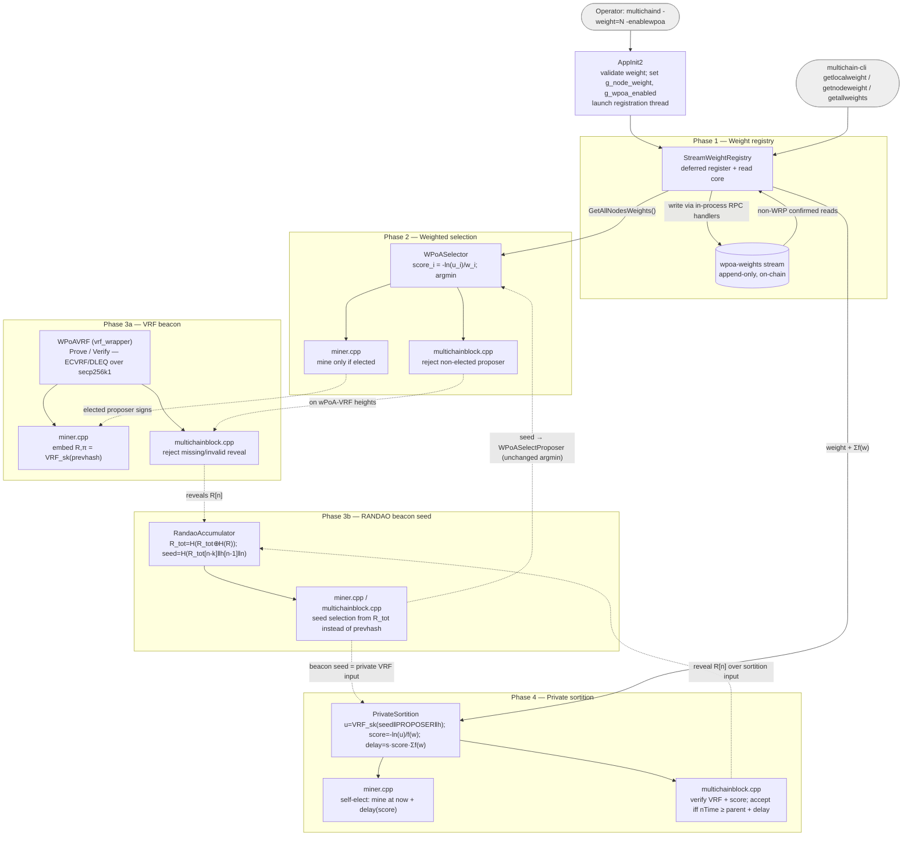

# wPoA — Weighted Proof-of-Authority for MultiChain

> A **Weighted Proof-of-Authority** consensus extension for MultiChain: every
> validator advertises a positive integer **weight** on a native append-only
> stream (Phase 1), and block proposers are elected in **proportion to that
> weight** via the Efraimidis–Spirakis weighted-sampling transform (Phase 2).
> This file is the entry point; the deep, per-phase documentation lives in
> [`docs/`](docs/) — start at the master
> [implementation-guide.md](docs/implementation-guide.md).

---

## What wPoA is

**wPoA** (*Weighted Proof-of-Authority*) extends MultiChain's round-robin
Proof-of-Authority with a notion of **validator weight**, so that block
production is biased toward higher-weight validators instead of being uniform.

Five phases are implemented today:

- **Phase 1 — Weight registry.** Each node records its weight on an append-only
  MultiChain stream (`wpoa-weights`), kept current (newest wins) and identical on
  every node (confirmed-on-chain data only), exposed through three RPC commands
  and a `StreamWeightRegistry` class.
- **Phase 2 — Weighted miner selection.** When `-enablewpoa=1`, the miner and
  the block validator elect each height's proposer in proportion to weight via
  the Efraimidis–Spirakis argmin, seeded by the previous block hash, bypassing
  the native round-robin mining-diversity gate. This phase is intentionally
  public/predictable — the substrate-validation baseline before privacy is added
  in later phases.
- **Phase 3a — VRF randomness beacon (generation).** When `-enablewpoavrf=1`,
  each wPoA-elected proposer additionally publishes a **verifiable pseudorandom
  reveal** `R[n]=VRF_sk(h[n-1])` with proof `π[n]` in its block (an ECVRF/DLEQ
  over the bundled secp256k1), and every peer verifies it before accepting the
  block. Selection is unchanged; the VRF is a grinding-resistant contribution to
  the beacon that Phase 3b accumulates and Phase 4 consumes for private
  sortition.
- **Phase 3b — RANDAO beacon seed (accumulation).** When `-enablewpoarandao=1`,
  the per-block reveals are folded into a running accumulator
  `R_tot[n]=H(R_tot[n-1]⊕H(R[n]))` and the proposer election is seeded by the
  lookback beacon seed `seed[n+1]=H(R_tot[n-k]‖h[n-1]‖n)` instead of the plain
  previous block hash (lookback `k` set by `-wpoarandaolookback`). Only the seed
  source changes — the Efraimidis–Spirakis election stays weight-proportional —
  so the beacon is grinding-resistant with a bounded last-revealer bias, while
  leader unpredictability remains Phase 4's job.
- **Phase 4 — Efraimidis private sortition (the security fix).** When
  `-enablewpoasortition=1`, each validator evaluates its election score
  **privately** — `u_i = VRF_sk_i(seed ‖ "PROPOSER" ‖ height)` under its own
  secret key, scored with the *same* `-ln(u_i)/f(w_i)` transform as Phase 2 — so
  no peer can compute it. A validator self-elects by mining after a delay that
  increases with its score, so the argmin proposes **first**; peers accept a block
  iff its VRF reveal verifies over the sortition input and its `nTime` is no
  earlier than the score entitles (the time bar that replaces the public argmin
  equality). The proposer is thus unknowable until it acts, the distribution stays
  `Pr[i]=w_i/Σw`, and the auto-relaxing time bar is the liveness fallback (no
  zero-proposer gap). Requires `-enablewpoarandao` and lookback `k≥1`; delay scale
  set by `-wpoasortitiondelay`.

Phase 5 (VDF over the beacon output, removing the residual last-revealer bias) is
planned — see the [Implementation status](#implementation-status) and the master
[implementation-guide.md](docs/implementation-guide.md).

Operators only ever touch a few things:

- the startup parameters **`-weight=<n>`** (positive integer, default `100`) and
  **`-enablewpoa`** (default off; enables weighted selection), and
- the RPC commands **`getlocalweight`**, **`getnodeweight`**, **`getallweights`**.

Everything else — stream layout, transaction plumbing, wallet indexes, the
election math — is hidden behind the `StreamWeightRegistry` facade and the
`WPoASelector`.

---

## Architecture at a glance

> Macro view of the whole feature across phases. This is deliberately
> high-level; the per-phase mechanics live in the phase guides linked from the
> master [implementation-guide.md](docs/implementation-guide.md). **Keep this
> diagram in sync whenever the architecture changes** (see the
> [Documentation Maintenance](docs/implementation-guide.md#documentation-maintenance)
> process).



- **Phase 1** records and serves weights on the `wpoa-weights` stream via the
  `StreamWeightRegistry` facade (deferred background registration; confirmed-only
  reads that are safe from any thread). Full detail:
  [phase1-implementation-guide.md](docs/phase1-implementation-guide.md).
- **Phase 2** consumes `GetAllNodesWeights()` and elects each height's proposer
  in proportion to weight, gating the miner and the block validator behind
  `-enablewpoa`. Full detail:
  [phase2-implementation-guide.md](docs/phase2-implementation-guide.md).
- **Phase 3a** adds the VRF beacon behind `-enablewpoavrf`: the elected proposer
  embeds a verifiable reveal `(R, π)` in its block (via `WPoAVRF`, an ECVRF/DLEQ
  over the bundled secp256k1) and every peer verifies it. Selection is unchanged.
  Full detail:
  [phase3a-implementation-guide.md](docs/phase3a-implementation-guide.md).
- **Phase 3b** adds the RANDAO beacon seed behind `-enablewpoarandao`: the
  per-block reveals are folded into `R_tot` (via `RandaoAccumulator`) and the
  selection seed becomes `H(R_tot[n-k]‖h[n-1]‖n)`, consumed identically by the
  miner and validator. Only the seed source changes; the election stays
  weight-proportional. Full detail:
  [phase3b-implementation-guide.md](docs/phase3b-implementation-guide.md).
- **Phase 4** makes selection private behind `-enablewpoasortition` (via
  `PrivateSortition`): each validator scores itself with a VRF over the beacon
  seed under its own key and self-elects by a score-proportional mining delay
  (argmin proposes first); the validator replaces the public argmin equality with
  a VRF-verify + score-recompute + `nTime`-time-bar eligibility check. The
  proposer is unpredictable until it acts; the distribution is unchanged. Full
  detail: [phase4-implementation-guide.md](docs/phase4-implementation-guide.md).

---

## Documentation Structure

This project contains multiple levels of documentation:

1. **[Thesis Project Overview](docs/thesis-project-overview.md)**
   - For researchers & students: Theory, threat modeling, literature review, mathematical foundations
   - Learn WHY we use Efraimidis–Spirakis and what security properties it provides

2. **[Implementation Roadmap](docs/implementation-roadmap.md)**
   - For developers & contributors: Phased plan, current status, components, vulnerabilities
   - Understand what's implemented, what's planned, and how pieces connect

3. **[Implementation Guide (master index)](docs/implementation-guide.md)**
   - The high-level map of all phases + links to each phase's dedicated technical
     guide, and the **Documentation Maintenance** process for future features
   - Start here for code, then dive into the phase guide you need:
     [Phase 1](docs/phase1-implementation-guide.md) ·
     [Phase 2](docs/phase2-implementation-guide.md)

---

## Documentation

All detailed documentation lives in [`docs/`](docs/). Start at the master
**[implementation-guide.md](docs/implementation-guide.md)** (phase map + links),
or the **[Documentation Structure](#documentation-structure)** above if you're
new to the project.

| Document | What it covers |
|----------|----------------|
| [implementation-guide.md](docs/implementation-guide.md) | **Master index.** High-level map of all phases, how they build on each other, links to every per-phase guide, and the Documentation Maintenance process. |
| [phase1-implementation-guide.md](docs/phase1-implementation-guide.md) | **Phase 1 — full technical guide.** Weight registry: mental model, data model, design decisions, threading & locking, full code walkthrough, control flow, "how to modify" recipes. |
| [phase2-implementation-guide.md](docs/phase2-implementation-guide.md) | **Phase 2 — full technical guide.** Weighted miner selection: mental model, algorithm, design decisions, threading, full code walkthrough, control flow, edge cases, "how to modify" recipes, tests, and accepted risks / Phase 3-4 hooks. |
| [phase3a-implementation-guide.md](docs/phase3a-implementation-guide.md) | **Phase 3a — full technical guide.** VRF randomness beacon: the ECVRF/DLEQ construction over secp256k1, on-chain carriage of the reveal, prover/verifier control flow, design decisions, edge cases, tests, and Phase 3b/4 hooks. |
| [phase3b-implementation-guide.md](docs/phase3b-implementation-guide.md) | **Phase 3b — full technical guide.** RANDAO beacon seed: the accumulator fold + lookback seed (thesis §5.4–§5.5), the memoized block-index walk, the seed swap at both selection call sites, design decisions, edge cases, tests, and Phase 4 hooks. |
| [phase4-implementation-guide.md](docs/phase4-implementation-guide.md) | **Phase 4 — full technical guide.** Efraimidis private sortition (the security fix): the private VRF score, score-timed self-election, the validator-side VRF-verify + score + time-bar eligibility that replaces the public argmin, the auto-relaxing liveness fallback, design decisions, edge cases, tests, and Phase 5 hooks. |
| [thesis-project-overview.md](docs/thesis-project-overview.md) | Research companion: problem statement, threat model, literature review, theoretical contributions behind the wPoA design (bachelor's thesis, Università di Pisa). |
| [implementation-roadmap.md](docs/implementation-roadmap.md) | Engineering companion: phased plan, rationale for private (Efraimidis) sortition over public WRS, current status, vulnerabilities & mitigations. |
| [multichain-internals.md](docs/multichain-internals.md) | Reference to the MultiChain host APIs this module builds on, with exact `file:line` pointers — entities, the wallet-tx store, script decoding, RPC-handler reuse, permissions, mining. |
| [stream-weight-registry.md](docs/stream-weight-registry.md) | Line-by-line walkthrough of the Phase 1 registry class and background thread (`stream_weight_registry.h` + `.cpp`). |
| [weight-record.md](docs/weight-record.md) | Walkthrough of the pure, dependency-light parsing/aggregation helpers (`weight_record.h`) that are unit-tested in isolation. |
| [wpoa-selector.md](docs/wpoa-selector.md) | Line-by-line walkthrough of the Phase 2 selector core and node glue (`wpoa_selector.h` + `.cpp`): scoring, argmin, activation gate, registry read. §5 covers the Phase 3a `g_wpoa_vrf_enabled` / `WPoAVRFActiveAtHeight` glue. |
| [miner-integration.md](docs/miner-integration.md) | How the weighted election is wired into block production (`miner/miner.cpp`, `GetMinerAndExpectedMiningStartTime`). |
| [block-validation.md](docs/block-validation.md) | How the election is enforced on the receiving side (`protocol/multichainblock.cpp`, `VerifyBlockMiner` → `VerifyBlockMinerWPoA`). |
| [vrf-wrapper.md](docs/vrf-wrapper.md) | **Phase 3a.** Line-by-line walkthrough of the pure VRF core (`vrf_wrapper.h` + `.cpp`): hash-to-curve, deterministic nonce, DLEQ prove/verify, point/scalar helpers over secp256k1. |
| [block-vrf-encoding.md](docs/block-vrf-encoding.md) | **Phase 3a.** How the reveal is carried on-chain (`protocol/multichainscript.h` + `.cpp`): `SetBlockVRF`/`GetBlockVRF` and the `GetBlockSignature` length relaxation. |
| [vrf-prover.md](docs/vrf-prover.md) | **Phase 3a.** How the reveal is produced and embedded (`miner/miner.cpp`, `CreateBlockSignature`). |
| [vrf-verifier.md](docs/vrf-verifier.md) | **Phase 3a.** How the reveal is extracted and enforced (`protocol/multichainblock.cpp`, `FindBlockVRF` + `VerifyBlockMinerWPoA`). |
| [randao-accumulator.md](docs/randao-accumulator.md) | **Phase 3b.** Deep line-by-line walkthrough of the pure accumulator/seed core (`randao_accumulator.h`) and the node glue (`.cpp`): the fold, the seed derivation, the memoized block-index walk, reveal extraction. |
| [randao-miner.md](docs/randao-miner.md) | **Phase 3b.** The miner-side seed swap (`miner/miner.cpp`, `GetMinerAndExpectedMiningStartTime`): defaulting to the prev-hash seed, then overwriting with the RANDAO seed when the beacon governs the next height. |
| [randao-validator.md](docs/randao-validator.md) | **Phase 3b.** The validator-side seed swap (`protocol/multichainblock.cpp`, `VerifyBlockMinerWPoA`): recomputing the same seed over the block's parent and enforcing the elected proposer. |
| [private-sortition.md](docs/private-sortition.md) | **Phase 4.** Line-by-line walkthrough of the pure sortition core (`private_sortition.h`: `VRFInput`/`ScoreFromVRFOutput`/`MiningDelay`) and the node glue (`.cpp`): activation gate, shared context, local score+delay, reveal-input builder, eligibility/time-bar verdict, anti-respin guard. |
| [sortition-miner.md](docs/sortition-miner.md) | **Phase 4.** The miner-side hook (`miner/miner.cpp`): score-timed self-election, the anti-respin guard, the reveal-input switch, and marking the proposed height. |
| [sortition-validator.md](docs/sortition-validator.md) | **Phase 4.** The validator-side hook (`protocol/multichainblock.cpp`, `VerifyBlockMinerWPoA`): the VRF-verify + score-recompute + time-bar eligibility check that replaces the public argmin equality on sortition heights. |
| [node-startup.md](docs/node-startup.md) | How `-weight` (Phase 1), `-enablewpoa`/`-dumpfunction` (Phase 2), `-enablewpoavrf` (Phase 3a), `-enablewpoarandao`/`-wpoarandaolookback` (Phase 3b) and `-enablewpoasortition`/`-wpoasortitiondelay` (Phase 4) are wired into `AppInit2` and how the background thread is launched (`core/init.h` + `.cpp`, wPoA parts). |
| [rpc-registration.md](docs/rpc-registration.md) | How the three RPC commands are added to the dispatch table (`rpc/rpclist.cpp`). |
| [testing.md](docs/testing.md) | Build steps, unit tests, the MultiChain mining model, manual single-/multi-node tests, the automated smoke test, and troubleshooting. |

### Source & test files

| File | Role |
|------|------|
| [`stream_weight_registry.h`](stream_weight_registry.h) / [`.cpp`](stream_weight_registry.cpp) | Phase 1: public API + implementation of the registry, background thread and RPC handlers. |
| [`weight_record.h`](weight_record.h) | Phase 1: pure parsing/aggregation helpers (json_spirit-only, unit-testable). |
| [`wpoa_selector.h`](wpoa_selector.h) / [`.cpp`](wpoa_selector.cpp) | Phase 2: pure Efraimidis–Spirakis selector core (header-only) + node-coupled glue (flag, activation predicate, registry-backed election). Phase 3a adds the `g_wpoa_vrf_enabled` flag and `WPoAVRFActiveAtHeight`. |
| [`vrf_wrapper.h`](vrf_wrapper.h) / [`.cpp`](vrf_wrapper.cpp) | Phase 3a: pure `WPoAVRF` ECVRF/DLEQ core over secp256k1 (`Prove`/`Verify`), node-free and unit-testable. |
| [`randao_accumulator.h`](randao_accumulator.h) / [`.cpp`](randao_accumulator.cpp) | Phase 3b: pure `RandaoAccumulator` core (`Fold`/`DeriveSeed`/`Genesis`, node-free) + node glue (flag/lookback, `WPoARANDAOActiveAtHeight`, the memoized accumulator walk, and the `WPoARandaoSelectionSeed` helper). |
| [`private_sortition.h`](private_sortition.h) / [`.cpp`](private_sortition.cpp) | Phase 4: pure `PrivateSortition` core (`VRFInput`/`ScoreFromVRFOutput`/`MiningDelay`, node-free) + node glue (flag/scale, `WPoASortitionActiveAtHeight`, local score+delay, reveal-input builder, `WPoASortitionVerifyProposer`, anti-respin guard). Reuses the Phase-2 score transform (`WPoASelector::ScoreFromEntropy64`). |
| [`test/wpoa_weight_tests.cpp`](test/wpoa_weight_tests.cpp) | Phase 1: Boost.Test unit tests for the pure registry logic. |
| [`test/wpoa_selector_tests.cpp`](test/wpoa_selector_tests.cpp) | Phase 2: Boost.Test unit tests for the pure selector math (determinism, order-independence, probability preservation). |
| [`test/vrf_wrapper_tests.cpp`](test/vrf_wrapper_tests.cpp) | Phase 3a: Boost.Test unit tests for the pure VRF core (roundtrip, determinism, tamper/forgery/cross-key rejection, pseudorandomness). |
| [`test/randao_accumulator_tests.cpp`](test/randao_accumulator_tests.cpp) | Phase 3b: Boost.Test unit tests for the pure accumulator/seed core (spec conformance vs. an independent reference, determinism, order/input sensitivity, chain consistency). |
| [`test/private_sortition_tests.cpp`](test/private_sortition_tests.cpp) | Phase 4: Boost.Test unit tests for the pure sortition core (VRF-input encoding, score reuse vs. the shared transform, delay map, key-dependence/privacy, and probability preservation with real VRF keys). |
| [`test/run_unit_tests.sh`](test/run_unit_tests.sh) / [`test/run_selector_unit_tests.sh`](test/run_selector_unit_tests.sh) / [`test/run_vrf_unit_tests.sh`](test/run_vrf_unit_tests.sh) / [`test/run_randao_unit_tests.sh`](test/run_randao_unit_tests.sh) / [`test/run_sortition_unit_tests.sh`](test/run_sortition_unit_tests.sh) | Build + run the unit tests (no node build needed). |
| [`test/functional_test_wpoa.sh`](test/functional_test_wpoa.sh) | End-to-end smoke test driving a real single node. |
| [`test/functional_test_wpoa_multinode.sh`](test/functional_test_wpoa_multinode.sh) / [`test/analyze_distribution.py`](test/analyze_distribution.py) | End-to-end multi-node test + chi-square proposer-distribution analyzer. |
| [`test/functional_test_wpoa_vrf.sh`](test/functional_test_wpoa_vrf.sh) | Phase 3a: end-to-end multi-node VRF beacon test (reveals produced, verified network-wide, chain live and fork-free under mandatory verification). |
| [`test/functional_test_wpoa_randao.sh`](test/functional_test_wpoa_randao.sh) | Phase 3b: end-to-end multi-node RANDAO beacon-seed test (liveness + no-fork under the beacon seed, beacon-engaged evidence, weight-proportional distribution under the seed). |
| [`test/functional_test_wpoa_sortition.sh`](test/functional_test_wpoa_sortition.sh) | Phase 4: end-to-end multi-node private-sortition test (liveness, no persistent fork, private-path-engaged with zero public-argmin acceptances, weight-proportional distribution under private scoring). |

Integration points in the host tree: [`../core/init.cpp`](../core/init.cpp)
(startup flags, incl. `-enablewpoavrf`, `-enablewpoarandao`/`-wpoarandaolookback`
and `-enablewpoasortition`/`-wpoasortitiondelay`),
[`../rpc/rpclist.cpp`](../rpc/rpclist.cpp) /
[`../rpc/rpchelp.cpp`](../rpc/rpchelp.cpp) (RPCs),
[`../miner/miner.cpp`](../miner/miner.cpp) (Phase 2 mining hook + Phase 3a reveal
embedding + Phase 3b selection-seed swap + Phase 4 score-timed self-election &
reveal-input switch),
[`../protocol/multichainblock.cpp`](../protocol/multichainblock.cpp)
(Phase 2 validation hook + Phase 3a reveal verification + Phase 3b selection-seed
swap + Phase 4 eligibility/time-bar check),
[`../protocol/multichainscript.cpp`](../protocol/multichainscript.cpp)
(Phase 3a `SetBlockVRF`/`GetBlockVRF` reveal carriage, reused unchanged by Phase 4),
[`../Makefile.am`](../Makefile.am) (build). See
[phase1-implementation-guide.md §7](docs/phase1-implementation-guide.md),
[phase2-implementation-guide.md §5](docs/phase2-implementation-guide.md),
[phase3a-implementation-guide.md §2](docs/phase3a-implementation-guide.md),
[phase3b-implementation-guide.md §2](docs/phase3b-implementation-guide.md) and
[phase4-implementation-guide.md §2](docs/phase4-implementation-guide.md) for
details.

---

## Implementation status

| Phase | Area | Status | Notes |
|:-----:|------|--------|-------|
| **1** | Weight configuration (`-weight`) & validation | Done | Validated in `AppInit2`; startup fails on `-weight <= 0`. |
| **1** | Deferred registration (background thread) | Done | Waits for readiness, retries, bounded budget before giving up. |
| **1** | On-chain append-only registry (`wpoa-weights`) | Done | Create + subscribe + publish via reused RPC handlers; idempotent re-registration. |
| **1** | Opaque read API (`GetLocalWeight`, `GetAllNodesWeights`, `GetNodeWeight`) | Done | Backward-search per address; hides stream mechanics from callers. |
| **1** | RPC surface (`getlocalweight`, `getnodeweight`, `getallweights`) | Done | Confirmed-only, thread-safe. |
| **1** | Read-path correctness fixes | Done | non-WRP read family (WRP snapshot bug) and 6-arg `OpReturnFormatEntry` overload. |
| **1** | Unit tests (pure parsing / aggregation) | Done | Boost.Test suite, node-free. |
| **1** | Single-node functional smoke test | Done | [`test/functional_test_wpoa.sh`](test/functional_test_wpoa.sh). |
| **1** | Multi-node functional smoke test | Done | [`test/functional_test_wpoa_multinode.sh`](test/functional_test_wpoa_multinode.sh) — bootstraps `connect`/`send`/`receive`/`mine`/`wpoa-weights.write` from node 0; asserts per-node weight. |
| **2** | Weighted miner selection (`WPoASelector` + `miner.cpp` hook) | Done | Efraimidis–Spirakis argmin seeded by prev-block hash; consumes `GetAllNodesWeights()`. See [docs/phase2-implementation-guide.md](docs/phase2-implementation-guide.md). |
| **2** | `-enablewpoa` runtime toggle | Done | Default off (native round-robin unchanged); gates miner + validation hooks. |
| **2** | Proposer validation (`VerifyBlockMiner` hook) | Done | Recomputes the election on receipt; rejects blocks not from the elected proposer. |
| **2** | Deterministic tie-break | Done | Lexicographically smallest address on exact score collision. |
| **2** | Unit tests (pure selector math) | Done | [`test/wpoa_selector_tests.cpp`](test/wpoa_selector_tests.cpp); probability preservation over 200k seeds. |
| **2** | Multi-node distribution test (chi-square) | Done | [`test/functional_test_wpoa_multinode.sh`](test/functional_test_wpoa_multinode.sh) + [`test/analyze_distribution.py`](test/analyze_distribution.py); ~1000 blocks, observed vs. expected. |
| **3a** | VRF wrapper (`WPoAVRF`, ECVRF/DLEQ over secp256k1) | Done | Pure `Prove`/`Verify`; no new build dependency. [docs/phase3a-implementation-guide.md](docs/phase3a-implementation-guide.md). |
| **3a** | `-enablewpoavrf` runtime toggle | Done | Default off; requires `-enablewpoa`. Gates reveal production + verification via `WPoAVRFActiveAtHeight`. |
| **3a** | Per-block reveal embed + verify | Done | Proposer embeds `(R, π)` as a suffix of the block-signature element; `VerifyBlockMinerWPoA` rejects a missing/invalid reveal on wPoA-VRF heights. |
| **3a** | Unit tests (pure VRF crypto) | Done | [`test/vrf_wrapper_tests.cpp`](test/vrf_wrapper_tests.cpp); roundtrip, determinism, tamper/forgery/cross-key rejection. |
| **3a** | Multi-node functional test | Done | [`test/functional_test_wpoa_vrf.sh`](test/functional_test_wpoa_vrf.sh); reveals verified network-wide, chain live and fork-free. |
| **3b** | RANDAO accumulator + seed (`RandaoAccumulator`) | Done | `R_tot[n]=H(R_tot[n-1]⊕H(R[n]))` folded over the 3a reveals; `seed[n+1]=H(R_tot[n-k]‖h[n-1]‖n)` derived and memoized. [docs/phase3b-implementation-guide.md](docs/phase3b-implementation-guide.md). |
| **3b** | `-enablewpoarandao` + `-wpoarandaolookback=k` | Done | Default off; requires `-enablewpoavrf`. Gates the seed swap via `WPoARANDAOActiveAtHeight`; `k` is consensus-critical, validated at startup. |
| **3b** | Selection-seed swap (miner + validator) | Done | Both call sites replace the prev-hash seed with `WPoARandaoSelectionSeed(tip)`; the Efraimidis election is otherwise unchanged (stays weight-proportional). |
| **3b** | Unit tests (pure accumulator/seed math) | Done | [`test/randao_accumulator_tests.cpp`](test/randao_accumulator_tests.cpp); spec conformance vs. an independent reference, order/input sensitivity, chain consistency. |
| **3b** | Multi-node functional test | Done | [`test/functional_test_wpoa_randao.sh`](test/functional_test_wpoa_randao.sh); liveness + no-fork under the beacon seed, 0 fallback folds, weight-proportional distribution (chi-square). |
| **4** | Private sortition core (`PrivateSortition`) | Done | `VRFInput`/`ScoreFromVRFOutput`/`MiningDelay`, node-free; reuses the Phase-2 score transform so the distribution is provably unchanged. [docs/phase4-implementation-guide.md](docs/phase4-implementation-guide.md). |
| **4** | `-enablewpoasortition` + `-wpoasortitiondelay` | Done | Default off; requires `-enablewpoarandao` and lookback `k>=1` (seed↔reveal acyclicity, validated at startup). Gates the private path via `WPoASortitionActiveAtHeight`; the delay scale is consensus-critical. |
| **4** | Score-timed self-election (miner) | Done | Each validator scores itself privately (VRF under its own key) and mines at `now + delay(score)`, so the argmin proposes first; anti-respin guard + reveal-input switch to `seed‖"PROPOSER"‖height`. |
| **4** | Eligibility / time-bar validation (`VerifyBlockMinerWPoA`) | Done | Replaces the public argmin equality: verify the VRF over the sortition input, recompute the score, accept iff `block.nTime ≥ parent.nTime + delay`. Auto-relaxing bar = liveness fallback (no zero-proposer gap). |
| **4** | Unit tests (pure sortition math + real VRF) | Done | [`test/private_sortition_tests.cpp`](test/private_sortition_tests.cpp); VRF-input encoding, score reuse, delay map, privacy, and probability preservation with real VRF keys (chi-square). |
| **4** | Multi-node functional test | Done | [`test/functional_test_wpoa_sortition.sh`](test/functional_test_wpoa_sortition.sh); liveness, no persistent fork, zero public-argmin acceptances (selection is private), weight-proportional distribution (chi-square). |

**Phases 1, 2, 3a, 3b and 4 are complete and validated end-to-end.** The multi-node
functional test bootstraps a permissioned network with distinct per-node
weights, confirms the weight map converges on every node, then mines a long run
of wPoA-governed blocks and verifies the observed proposer distribution matches
the configured weight ratios via a chi-square goodness-of-fit test (with the
observed-vs-expected table printed as evidence). The Phase 3a VRF beacon is
validated by its own multi-node test: with `-enablewpoavrf=1` every wPoA block
carries a reveal that every peer must verify to accept, so the chain advancing
past the setup height with all nodes agreeing (no fork) and zero VRF rejections
is direct end-to-end evidence that reveals are produced and verified network-wide.
The Phase 3b RANDAO beacon seed is validated by its own multi-node test: with
`-enablewpoarandao=1` the proposer is elected from `seed[n+1]=H(R_tot[n-k]‖h[n-1]‖n)`,
which every node recomputes by folding the on-chain reveals, so the chain
advancing past setup with no fork (and zero fallback folds) is direct evidence
that the accumulator and seed are bit-identical network-wide — while the observed
proposer distribution still matches the weight ratios under the new seed.
The Phase 4 private sortition is validated by its own multi-node test: with
`-enablewpoasortition=1` each validator scores itself privately under its own VRF
key and self-elects by a score-proportional mining delay, so the chain advancing
past setup with no persistent fork **and zero public-argmin acceptances** (nobody
elected the proposer from public data) is direct evidence that selection is
private, while the observed proposer distribution still matches the weight ratios
(chi-square) — the argmin over private scores preserves `Pr[i]=w_i/Σw`. Phase 5
(a VDF over the beacon output) is planned.

See [docs/phase3b-implementation-guide.md](docs/phase3b-implementation-guide.md)
for the Phase 3b design,
[docs/phase3a-implementation-guide.md](docs/phase3a-implementation-guide.md)
for the Phase 3a design,
[docs/phase2-implementation-guide.md](docs/phase2-implementation-guide.md)
for the Phase 2 design, and
[phase1-implementation-guide.md §12](docs/phase1-implementation-guide.md#12-limitations--phase-2-hooks)
for the full limitations register.

---

## Quick start

```bash
# Build (Makefile.am changed, so regenerate first):
cd /home/mattu/multichain
./autogen.sh && ./configure && make

# Run a node with a weight:
./src/multichaind <chain> -weight=100

# Enable weighted selection (Phase 2), the VRF beacon (Phase 3a), the RANDAO
# beacon seed (Phase 3b) and private sortition — the security fix (Phase 4).
# All flags (the lookback k and the sortition delay scale) must be identical on
# every validator; sortition requires the beacon and k>=1.
./src/multichaind <chain> -weight=100 -enablewpoa=1 -enablewpoavrf=1 \
                          -enablewpoarandao=1 -wpoarandaolookback=1 \
                          -enablewpoasortition=1 -wpoasortitiondelay=1

# Query weights:
./src/multichain-cli <chain> getallweights
```

Full build and test instructions are in [testing.md](docs/testing.md).
The Phase 3a/3b/4 unit tests run node-free via
[`test/run_vrf_unit_tests.sh`](test/run_vrf_unit_tests.sh),
[`test/run_randao_unit_tests.sh`](test/run_randao_unit_tests.sh) and
[`test/run_sortition_unit_tests.sh`](test/run_sortition_unit_tests.sh); the
multi-node beacon/sortition tests are
[`test/functional_test_wpoa_vrf.sh`](test/functional_test_wpoa_vrf.sh),
[`test/functional_test_wpoa_randao.sh`](test/functional_test_wpoa_randao.sh) and
[`test/functional_test_wpoa_sortition.sh`](test/functional_test_wpoa_sortition.sh).
