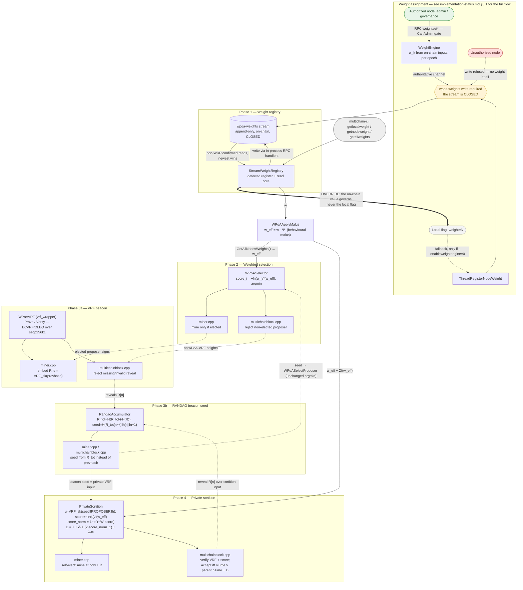

# wPoA — Weighted Proof-of-Authority for MultiChain

> A **Weighted Proof-of-Authority** consensus extension for MultiChain: every
> validator advertises a positive integer **weight** on a native append-only
> stream (Phase 1), and block proposers are elected in **proportion to that
> weight** via the Efraimidis–Spirakis weighted-sampling transform (Phase 2).
> This file is the entry point; the deep, per-phase documentation lives in
> [`docs/`](docs/) — start at the master
> [implementation-guide.md](docs/implementation-guide.md).

---

## What wPoA is

**wPoA** (*Weighted Proof-of-Authority*) extends MultiChain's round-robin
Proof-of-Authority with a notion of **validator weight**, so that block
production is biased toward higher-weight validators instead of being uniform.

Five phases are implemented today:

- **Phase 1 — Weight registry.** When `-enablewpoaweights=1` (default off; forced
  on by any higher phase or by the `-enablewpoa` master switch), each node records
  its weight on an append-only MultiChain stream (`wpoa-weights`), kept current
  (newest wins) and identical on every node (confirmed-on-chain data only), exposed
  through three RPC commands and a `StreamWeightRegistry` class. This phase can run
  standalone (e.g. to collect weights) with everything else off.
- **Phase 2 — Weighted miner selection.** When `-enablewpoaselection=1`, the miner and
  the block validator elect each height's proposer in proportion to weight via
  the Efraimidis–Spirakis argmin, seeded by the previous block hash, bypassing
  the native round-robin mining-diversity gate. This phase is intentionally
  public/predictable — the substrate-validation baseline before privacy is added
  in later phases.
- **Phase 3a — VRF randomness beacon (generation).** When `-enablewpoavrf=1`,
  each wPoA-elected proposer additionally publishes a **verifiable pseudorandom
  reveal** `R[n]=VRF_sk(h[n-1])` with proof `π[n]` in its block (an ECVRF/DLEQ
  over the bundled secp256k1), and every peer verifies it before accepting the
  block. Selection is unchanged; the VRF is a grinding-resistant contribution to
  the beacon that Phase 3b accumulates and Phase 4 consumes for private
  sortition.
- **Phase 3b — RANDAO beacon seed (accumulation).** When `-enablewpoarandao=1`,
  the per-block reveals are folded into a running accumulator
  `R_tot[n]=H(R_tot[n-1]⊕H(R[n]))` and the proposer election is seeded by the
  lookback beacon seed `seed[n+1]=H(R_tot[n-k]‖h[n]‖n+1)` instead of the plain
  previous block hash (lookback `k` set by `-wpoarandaolookback`). Only the seed
  source changes — the Efraimidis–Spirakis election stays weight-proportional —
  so the beacon is grinding-resistant with a bounded last-revealer bias, while
  leader unpredictability remains Phase 4's job.
- **Phase 4 — Efraimidis private sortition (the security fix).** When
  `-enablewpoasortition=1`, each validator evaluates its election score
  **privately** — `u_i = VRF_sk_i(seed ‖ "PROPOSER" ‖ height)` under its own
  secret key, scored with the *same* `-ln(u_i)/f(w_i)` transform as Phase 2 — so
  no peer can compute it. A validator self-elects by mining after a delay that
  increases with its score — a band around `target-block-time`,
  `D = T + δ·T·(2·score_norm − 1) + λ·Φ` with `score_norm = 1 − e^{−W·score}`, whose
  `W` factor is what keeps the candidates spread across the band instead of crushed
  against its early edge — so the argmin proposes **first**; peers accept a block
  iff its VRF reveal verifies over the sortition input and its `nTime` is no
  earlier than the score entitles (the time bar that replaces the public argmin
  equality). The proposer is thus unknowable until it acts, the distribution stays
  `Pr[i]=w_i/Σw`, and the auto-relaxing time bar is the liveness fallback (no
  zero-proposer gap). Requires `-enablewpoarandao` and lookback `k≥1`; delay scale
  set by `-wpoasortitiondelta`; optional global feedback gain `-wpoasortitionlambda`.

- **Behavioural malus registry.** When `-enablewpoamalus=1`, a second — and
  deliberately **open** — stream `wpoa-weights-malus` records proved
  misbehaviour: an *equivocation* (two distinct blocks at one height, which VRF
  uniqueness makes impossible by accident) or a *delay violation* (a block mined
  earlier than its own score entitled it to). Anyone may report; nobody is
  believed. Every node re-derives the evidence from public chain data, so a false
  report is discarded identically everywhere and moves no weight. Valid reports
  accumulate into a decaying severity `M`, which becomes the correction
  `Psi = max(0, 1 - M/M_max)`, and the election consumes the **effective weight**
  `w_eff = w * Psi` instead of the raw one. `M` is an exponential moving average,
  so an exclusion always clears after a finite number of clean epochs — there is
  no permanent ban. Inert on honest behaviour (`Psi = 1`). Requires
  `-enablewpoasortition`. Full detail:
  [malus-registry.md](docs/malus-registry.md).

Phase 5 (VDF over the beacon output, removing the residual last-revealer bias) is
planned — see the [Implementation status](#implementation-status) and the master
[implementation-guide.md](docs/implementation-guide.md).

Operators only ever touch a few things:

- the per-node parameter **`-weight=<n>`** (positive integer, default `100`) — this
  node's own validator weight, published on the `wpoa-weights` stream. It is *not* a
  chain parameter (each node sets its own);
- the wPoA switches (see **Startup configuration** below), and
- the RPC commands **`getlocalweight`**, **`getnodeweight`**, **`getallweights`**,
  and — when the malus registry is on — **`getallmalus`**, **`getnodemalus`**,
  **`reportmalus`**.

Everything else — stream layout, transaction plumbing, wallet indexes, the
election math — is hidden behind the `StreamWeightRegistry` facade and the
`WPoASelector`.

### Startup configuration — flags & `params.dat` inheritance

Every wPoA switch is a **chain parameter**: it is set when the chain is created
(`multichain-util create <chain> -enablewpoa=1 …`), written into `params.dat`, and
**inherited** by any node that joins. A fresh node therefore needs no command-line
flags — it just runs `multichaind <chain>@<seed>` and picks up the right protocol.
A chain created with no wPoA flags is a plain MultiChain instance.

The same names also work as **runtime flags** on `multichaind`, overriding the
inherited value for that node only. Because the parameters are **hash-enforced**,
a divergent override risks a silent fork; `AppInit2` logs a loud warning but does
not prevent startup.

The master switch `-enablewpoa` (alias `-wpoaenable`) turns every phase on; a more
specific `-enablewpoa*` flag then overrides its phase. Phases must be enabled
bottom-up — `weights → selection → vrf → randao → sortition → malus` — and a
violation is a **hard failure** at both chain creation and node startup.

> **Every parameter — name, type, default, valid range, defining and validating code
> line, and effect on consensus — is catalogued in one place:
> [docs/protocol-parameters.md](docs/protocol-parameters.md).**
> Do not duplicate parameter values here.

How the switches are read, resolved and wired into `AppInit2`:
[docs/node-startup.md](docs/node-startup.md).

---

## Architecture at a glance

> Macro view of the whole feature across phases. This is deliberately
> high-level; the per-phase mechanics live in the phase guides linked from the
> master [implementation-guide.md](docs/implementation-guide.md). **Keep this
> diagram in sync whenever the architecture changes** (see the
> [Documentation Maintenance](docs/implementation-guide.md#documentation-maintenance)
> process).


```mermaid
flowchart TD
    subgraph SRC [Weight assignment — see implementation-status.md §0.1 for the full flow]
        ADM([Authorized node: admin / governance]):::ok
        ADM -->|"RPC weightset* — CanAdmin gate"| ENG["WeightEngine<br/>w_k from on-chain inputs, per epoch"]
        OPCLI([Local flag -weight=N]):::weak
        OPCLI -.->|"fallback, only if -enableweightengine=0"| STATREG["ThreadRegisterNodeWeight"]
        GATE{{"wpoa-weights.write required<br/>the stream is CLOSED"}}:::gate
        ENG -->|"authoritative channel"| GATE
        STATREG --> GATE
        UNAUTH([Unauthorized node]):::bad -.->|"write refused — no weight at all"| GATE
    end

    subgraph P1 [Phase 1 — Weight registry]
        STREAM[(wpoa-weights stream<br/>append-only, on-chain, CLOSED)]
        REG["StreamWeightRegistry<br/>deferred register + read core"]
        REG -->|write via in-process RPC handlers| STREAM
        STREAM -->|"non-WRP confirmed reads, newest wins"| REG
    end

    GATE --> STREAM
    REG ==>|"OVERRIDE: the on-chain value governs,<br/>never the local flag"| OPCLI

    MALUS["WPoAApplyMalus<br/>w_eff = w · Ψ  (behavioural malus)"]
    REG -->|"w"| MALUS

    subgraph P2 [Phase 2 — Weighted selection]
        SEL["WPoASelector<br/>score_i = −ln(u_i)/f(w_eff); argmin"]
        MINE["miner.cpp<br/>mine only if elected"]
        VAL["multichainblock.cpp<br/>reject non-elected proposer"]
        SEL --> MINE
        SEL --> VAL
    end

    subgraph P3A [Phase 3a — VRF beacon]
        VRF["WPoAVRF (vrf_wrapper)<br/>Prove / Verify — ECVRF/DLEQ over secp256k1"]
        MVRF["miner.cpp<br/>embed R,π = VRF_sk(prevhash)"]
        VVRF["multichainblock.cpp<br/>reject missing/invalid reveal"]
        VRF --> MVRF
        VRF --> VVRF
    end

    subgraph P3B [Phase 3b — RANDAO beacon seed]
        RND["RandaoAccumulator<br/>R_tot=H(R_tot⊕H(R)); seed=H(R_tot[n−k]‖h[n]‖n+1)"]
        RSEED["miner.cpp / multichainblock.cpp<br/>seed from R_tot instead of prevhash"]
        RND --> RSEED
    end

    subgraph P4 [Phase 4 — Private sortition]
        PS["PrivateSortition<br/>u=VRF_sk(seed‖PROPOSER‖h); score=−ln(u)/f(w_eff)<br/>score_norm = 1−e^(−W·score)<br/>D = T + δ·T·(2·score_norm−1) + λ·Φ"]
        PMINE["miner.cpp<br/>self-elect: mine at now + D"]
        PVAL["multichainblock.cpp<br/>verify VRF + score;<br/>accept iff nTime ≥ parent.nTime + D"]
        PS --> PMINE
        PS --> PVAL
    end

    MALUS -->|"GetAllNodesWeights() → w_eff"| SEL
    MALUS -->|"w_eff + Σf(w_eff)"| PS
    MINE -.->|"elected proposer signs"| MVRF
    VAL -.->|"on wPoA-VRF heights"| VVRF
    VVRF -.->|"reveals R[n]"| RND
    RSEED -.->|"seed → WPoASelectProposer (unchanged argmin)"| SEL
    RSEED -.->|"beacon seed = private VRF input"| PS
    PVAL -.->|"reveal R[n] over sortition input"| RND
    CLI([multichain-cli getlocalweight / getnodeweight / getallweights]):::ext --> REG

    classDef ext  fill:#eee,stroke:#999,color:#333;
    classDef ok   fill:#e8f5e9,stroke:#4c9a51,color:#1b3d1f;
    classDef bad  fill:#fdd,stroke:#c66,color:#633;
    classDef weak fill:#f4f4f4,stroke:#aaa,color:#555;
    classDef gate fill:#fff4d6,stroke:#c9a227,color:#5a4708;
```

- **Phase 1** records and serves weights on the `wpoa-weights` stream via the
  `StreamWeightRegistry` facade (deferred background registration; confirmed-only
  reads that are safe from any thread). Full detail:
  [phase1-implementation-guide.md](docs/phase1-implementation-guide.md).
- **Phase 2** consumes `GetAllNodesWeights()` and elects each height's proposer
  in proportion to weight, gating the miner and the block validator behind
  `-enablewpoaselection` (or the `-enablewpoa` master switch). Full detail:
  [phase2-implementation-guide.md](docs/phase2-implementation-guide.md).
- **Phase 3a** adds the VRF beacon behind `-enablewpoavrf`: the elected proposer
  embeds a verifiable reveal `(R, π)` in its block (via `WPoAVRF`, an ECVRF/DLEQ
  over the bundled secp256k1) and every peer verifies it. Selection is unchanged.
  Full detail:
  [phase3a-implementation-guide.md](docs/phase3a-implementation-guide.md).
- **Phase 3b** adds the RANDAO beacon seed behind `-enablewpoarandao`: the
  per-block reveals are folded into `R_tot` (via `RandaoAccumulator`) and the
  selection seed becomes `H(R_tot[n-k]‖h[n]‖n+1)`, consumed identically by the
  miner and validator. Only the seed source changes; the election stays
  weight-proportional. Full detail:
  [phase3b-implementation-guide.md](docs/phase3b-implementation-guide.md).
- **Phase 4** makes selection private behind `-enablewpoasortition` (via
  `PrivateSortition`): each validator scores itself with a VRF over the beacon
  seed under its own key and self-elects by a mining delay **banded on
  target-block-time**, `D = T + δ·T·(2·score_norm − 1) + λ·Φ` with
  `score_norm = 1 − e^{−W·score}` (argmin proposes first); the validator replaces
  the public argmin equality with a VRF-verify + score-recompute +
  `nTime`-time-bar eligibility check. The proposer is unpredictable until it acts;
  the distribution is unchanged; and because the winner's normalized score is
  exactly uniform, the mean realized block time lands on the target. Full
  detail: [phase4-implementation-guide.md](docs/phase4-implementation-guide.md).

---

## Documentation map

All detailed documentation lives in [`docs/`](docs/). Each file declares its
**linguistic register** in its opening note: *tecnico-diretto* for API, data
structures, RPC flows, configuration and build/troubleshooting;
*formale-accademico* for the consensus model, security properties and comparison
with other mechanisms.

Three files are **single sources of truth**. Nothing else in this repository restates
their content — the other files link to them:

| Single source | What only it may state |
|---|---|
| **[implementation-status.md](docs/implementation-status.md)** | What is implemented and what is not, the high-level architecture, the **authoritative weight-assignment diagram**, and the `mining-turnover` vs `mining-diversity` distinction. |
| **[protocol-parameters.md](docs/protocol-parameters.md)** | Every parameter: name, type, default, valid range, defining and validating code line, consensus effect, network-fixed vs locally overridable. |
| **[testing.md](docs/testing.md)** | Build steps, unit and functional test invocation, troubleshooting. |

### Theory and rationale — *formale-accademico*

| Document | What it covers |
|---|---|
| [thesis-project-overview.md](docs/thesis-project-overview.md) | Problem statement, threat model, literature review, formal model, security properties, probability preservation, comparison with PoW / PoS / PoA / PoSA. The research companion. |
| [implementation-roadmap.md](docs/implementation-roadmap.md) | Rationale for private (Efraimidis) sortition over public WRS, phased plan, vulnerabilities and mitigations, success criteria. Mixed register, declared per section. |
| [implementation-guide.md](docs/implementation-guide.md) | Phase map: how the phases build on one another, plus the Documentation Maintenance process. |

### Configuration and startup — *tecnico-diretto*

| Document | What it covers |
|---|---|
| [protocol-parameters.md](docs/protocol-parameters.md) | **The parameter catalogue.** All 21 parameters, with the two authorization gates and the `-weight` precedence rule. |
| [node-startup.md](docs/node-startup.md) | How the switches are read from `params.dat`, resolved (master + per-phase precedence + hard-fail constraints) and wired into `AppInit2`; how the publication thread is launched. |
| [weight-engine.md](docs/weight-engine.md) | The weight-production layer: the four input streams, the `c_i → W_k → A_k → ρ_k → B_k → w_k` pipeline, the three admin RPCs, the two-gate security model and its known limit. |

### Component architecture — *tecnico-diretto*

One file per real source unit under `src/wpoa/`.

| Document | Source unit |
|---|---|
| [stream-weight-registry.md](docs/stream-weight-registry.md) | `stream_weight_registry.h` / `.cpp` — the registry class and background thread. |
| [weight-record.md](docs/weight-record.md) | `weight_record.h` — pure parsing/aggregation helpers. |
| [wpoa-selector.md](docs/wpoa-selector.md) | `wpoa_selector.h` / `.cpp` — the Efraimidis–Spirakis selector core and node glue. |
| [vrf-wrapper.md](docs/vrf-wrapper.md) | `vrf_wrapper.h` / `.cpp` — the ECVRF/DLEQ core over secp256k1. |
| [randao-accumulator.md](docs/randao-accumulator.md) | `randao_accumulator.h` / `.cpp` — the fold, the lookback seed, the memoized walk. |
| [private-sortition.md](docs/private-sortition.md) | `private_sortition.h` / `.cpp` — VRF input, score, the banded mining delay. |
| [malus-registry.md](docs/malus-registry.md) | `malus_record.h`, `malus_registry.h` / `.cpp` — the open report stream, `Valid(e)`, the decaying accumulator, `w_eff`. |
| [multichain-internals.md](docs/multichain-internals.md) | The MultiChain host APIs this module builds on. |
| [native-poa-block-delay.md](docs/native-poa-block-delay.md) | The native PoA timing gate that Phase 4 supersedes, with its convergence analysis. |

### Integration points — *tecnico-diretto*

Eight files document how the phases hook into **two** host functions. Use this matrix
to find the right one:

| | Miner side — `GetMinerAndExpectedMiningStartTime` | Validator side — `VerifyBlockMinerWPoA` |
|---|---|---|
| **Phase 2** — weighted election | [miner-integration.md](docs/miner-integration.md) | [block-validation.md](docs/block-validation.md) |
| **Phase 3a** — VRF reveal | [vrf-prover.md](docs/vrf-prover.md) | [vrf-verifier.md](docs/vrf-verifier.md) |
| **Phase 3b** — RANDAO seed swap | [randao-miner.md](docs/randao-miner.md) | [randao-validator.md](docs/randao-validator.md) |
| **Phase 4** — private sortition | [sortition-miner.md](docs/sortition-miner.md) | [sortition-validator.md](docs/sortition-validator.md) |

On-chain carriage of the reveal is separate:
[block-vrf-encoding.md](docs/block-vrf-encoding.md).

### RPC and testing — *tecnico-diretto*

| Document | What it covers |
|---|---|
| [rpc-registration.md](docs/rpc-registration.md) | How the RPC commands are added to the dispatch table (`rpc/rpclist.cpp`). |
| [testing.md](docs/testing.md) | Build steps, the MultiChain mining model, unit suites, the single system-level functional run, and troubleshooting. |

### Per-phase development history — *tecnico-diretto*

Retained as the design record of each phase: mental model, design decisions with their
alternatives, code walkthrough, edge cases. **They no longer carry status tables** —
current status lives only in
[implementation-status.md](docs/implementation-status.md).

[Phase 1](docs/phase1-implementation-guide.md) ·
[Phase 2](docs/phase2-implementation-guide.md) ·
[Phase 3a](docs/phase3a-implementation-guide.md) ·
[Phase 3b](docs/phase3b-implementation-guide.md) ·
[Phase 4](docs/phase4-implementation-guide.md)

---

## Source & test files

| File | Role |
|------|------|
| [`stream_weight_registry.h`](stream_weight_registry.h) / [`.cpp`](stream_weight_registry.cpp) | Phase 1: registry API and implementation, background thread, RPC handlers. |
| [`weight_record.h`](weight_record.h) | Phase 1: pure parsing/aggregation helpers (json_spirit only, unit-testable). |
| [`wpoa_selector.h`](wpoa_selector.h) / [`.cpp`](wpoa_selector.cpp) | Phase 2: pure Efraimidis–Spirakis selector core + node glue (flag, activation predicate, registry-backed election). |
| [`vrf_wrapper.h`](vrf_wrapper.h) / [`.cpp`](vrf_wrapper.cpp) | Phase 3a: pure `WPoAVRF` ECVRF/DLEQ core over secp256k1 (`Prove`/`Verify`). |
| [`randao_accumulator.h`](randao_accumulator.h) / [`.cpp`](randao_accumulator.cpp) | Phase 3b: pure `RandaoAccumulator` core + node glue (memoized walk, `WPoARandaoSelectionSeed`). |
| [`private_sortition.h`](private_sortition.h) / [`.cpp`](private_sortition.cpp) | Phase 4: pure `PrivateSortition` core (`VRFInput` / `ScoreFromVRFOutput` / `NormalizedScore` / `MiningDelay`) + node glue. |
| [`malus_record.h`](malus_record.h) | Malus: pure record parsing + accumulator core (`Fold` / `CorrectionFactor` / `EffectiveWeight` / `EpochsToClear`). |
| [`malus_registry.h`](malus_registry.h) / [`.cpp`](malus_registry.cpp) | Malus: the open report stream, the `Valid(e)` predicate, `WPoAApplyMalus` (the single consensus entry point), the RPCs. |
| [`../weight_engine/`](../weight_engine/) | The weight-production layer. See [weight-engine.md](docs/weight-engine.md). |

Unit suites live in [`test/`](test/) and run node-free:

```bash
./test/run_unit_tests.sh                    # weight malus selector vrf randao sortition
../weight_engine/test/run_unit_tests.sh     # records engine
./test/run_all_tests.sh                     # unit + the single functional system run
```

Host-tree integration points: [`../core/init.cpp`](../core/init.cpp) (startup
resolution), [`../rpc/rpclist.cpp`](../rpc/rpclist.cpp) /
[`../rpc/rpchelp.cpp`](../rpc/rpchelp.cpp) (RPCs),
[`../miner/miner.cpp`](../miner/miner.cpp) (all miner-side hooks),
[`../protocol/multichainblock.cpp`](../protocol/multichainblock.cpp) (all
validator-side hooks),
[`../protocol/multichainscript.cpp`](../protocol/multichainscript.cpp) (reveal
carriage), [`../Makefile.am`](../Makefile.am) (build).

---

## Implementation status

Per-phase implementation status — what is done, what is not, with direct pointers to the
source files and to the tests that validate them — lives in **a single place**:

> **[docs/implementation-status.md](docs/implementation-status.md)**

That file also carries the high-level architecture, the authoritative weight-assignment
diagram, and the distinction between `mining-turnover` (a local operational hint) and
`mining-diversity` (a binding consensus rule).

**In short:** Phases 1, 2, 3a, 3b and 4 are complete and validated end-to-end, as are the
behavioural malus registry and the weight engine. Phase 5 (a VDF over the beacon output)
is planned and not implemented.

---

## Quick start

```bash
# Build (Makefile.am changed, so regenerate first):
cd /home/mattu/multichain
./autogen.sh && ./configure && make

# Preferred: bake the configuration into the chain at creation, so every node that
# joins inherits it via params.dat and needs no wPoA flags of its own:
./src/multichain-util create <chain> -enablewpoa=1        # whole protocol on
./src/multichaind <chain>                                 # this node ...
./src/multichaind <chain>@<seed-ip>:<port>                # ... and any joiner

# Run a node with its own validator weight (weight is per-node, not a chain param):
./src/multichaind <chain> -weight=100

# Phase 1 only (just collect weights on the wpoa-weights stream), nothing else:
./src/multichaind <chain> -weight=100 -enablewpoaweights=1

# Full stack as *runtime* flags (equivalent to the master switch). The master
# -enablewpoa=1 alone already turns all phases on; specific flags would override it
# per phase. All consensus knobs (lookback k, delay scale, dump function) must be
# identical on every validator; sortition requires the beacon and k>=1.
./src/multichaind <chain> -weight=100 -enablewpoa=1 \
                          -wpoarandaolookback=1 -wpoasortitiondelta=0.5

# Full stack EXCEPT sortition (specific flag overrides the master):
./src/multichaind <chain> -weight=100 -enablewpoa=1 -enablewpoasortition=0

# Query weights:
./src/multichain-cli <chain> getallweights
```

Full build and test instructions are in [testing.md](docs/testing.md) and
[`test/README.md`](test/README.md). All unit suites (weight, malus, selector, VRF,
RANDAO, sortition) run node-free via
[`test/run_unit_tests.sh`](test/run_unit_tests.sh) — pass a suite name to run
just one, e.g. `run_unit_tests.sh vrf`. The malus suite runs the same way
(`run_unit_tests.sh malus`). The functional tests are now a single
system-level run,
[`test/functional_test_wpoa_system.sh`](test/functional_test_wpoa_system.sh)
(wrapped by [`test/run_functional_tests.sh`](test/run_functional_tests.sh)): it
starts ONE full-stack network and verifies weight, multi-node consistency, VRF,
RANDAO, sortition and the chi-square distribution on that shared run. Run
absolutely everything with [`test/run_all_tests.sh`](test/run_all_tests.sh).

---

## Glossary

One canonical term per concept, used uniformly across the tree. Where the name in the code
is imperfect, the documentation **still follows the code**: a reader searching for an
identifier must find it.

| Canonical term | Meaning | Not to be confused with |
|---|---|---|
| **weight** (`w`) | A validator's **raw** weight: an integer `> 0`, as published on the `wpoa-weights` stream. It is the unit of the on-chain contract. | Not the value the draw operates on: it passes through malus and dumping first. |
| **effective weight** (`w_eff`) | `w_eff = w · Ψ`, the weight after the behavioural-malus correction. This is what enters the election. | Not `f(w_eff)`, which is the next step. |
| **dumping** | The whale compression `f(w)` applied before the draw: `none` / `sqrt` / `log`. **Canonical because it is the name in the code** (`-dumpfunction`, `DumpingFunction`, `ApplyDumping`). *Damping* would be the more accurate English word; the documentation glosses the term where useful but does not rename it. | The weight engine's `λ`, which is a different damping (below). |
| **behavioural-feedback damping** (`λ`, weight engine) | The damping in `w_k = W_k · [ρ_{k,e−1}·λ + (1−λ)]`: how much the previous epoch's compliance influences the weight. | The sortition `λ` (`-wpoasortitionlambda`), which is the gain of the feedback on **block time**. Two distinct `λ`, in two distinct layers. |
| **score** | `score_i = −ln(u_i)/f(w_eff,i)`, the Efraimidis–Spirakis variate. The **minimum** wins. | Not a probability: it is an exponential variate, and it is not comparable across networks with different weight scales without normalisation. |
| **normalized score** (`score_norm`) | `1 − e^{−W·score}`, uniform on `(0,1)` for the winner. This is what maps the score onto the delay band. | Not `score`. |
| **proposer** | The validator that produces the block at a given height. | *miner* in the PoW sense: there is no computational work here. |
| **beacon seed** (`seed[n+1]`) | `H(R_tot[n−k] ‖ h[n] ‖ n+1)`, the public agreed seed of the election. | The **reveal** `R[n]`, which is a single block's VRF contribution. |
| **reveal** (`R`, `π`) | The VRF-output and proof pair published by the proposer in its own block. | The *seed*, which is aggregated and derived. |
| **malus** (`M`, `Ψ`) | The misbehaviour accumulator and the correction `Ψ = max(0, 1 − M/M_max)` derived from it. | *slashing*: nothing is confiscated here, and `μ < 1` makes every exclusion **reversible**. |
| **mining-diversity** | A **binding**, hash-enforced consensus rule. A block violating the spacing is invalid. | **mining-turnover**, which is `NOHASH` and only a local timing hint. See [implementation-status.md §0.2](docs/implementation-status.md#02-mining-turnover-and-mining-diversity--operational-hint-vs-binding-rule). |
| **epoch** | The time unit of the weight engine and the malus registry, **1-based**: `epoch(height) = height / n + 1`. | The RANDAO *lookback* `k`, which is measured in blocks, not epochs. |
| **closed stream** | A stream requiring the `<stream>.write` permission to publish. `wpoa-weights` and the three attestation streams are closed. | **open stream**: `wpoa-weights-malus` is deliberately open, because every report is re-verified by every node. |

**Language.** This documentation is written in English throughout. Identifier, RPC, flag,
stream and class names are always left verbatim: they are strings the reader must be able
to grep for in the source.
