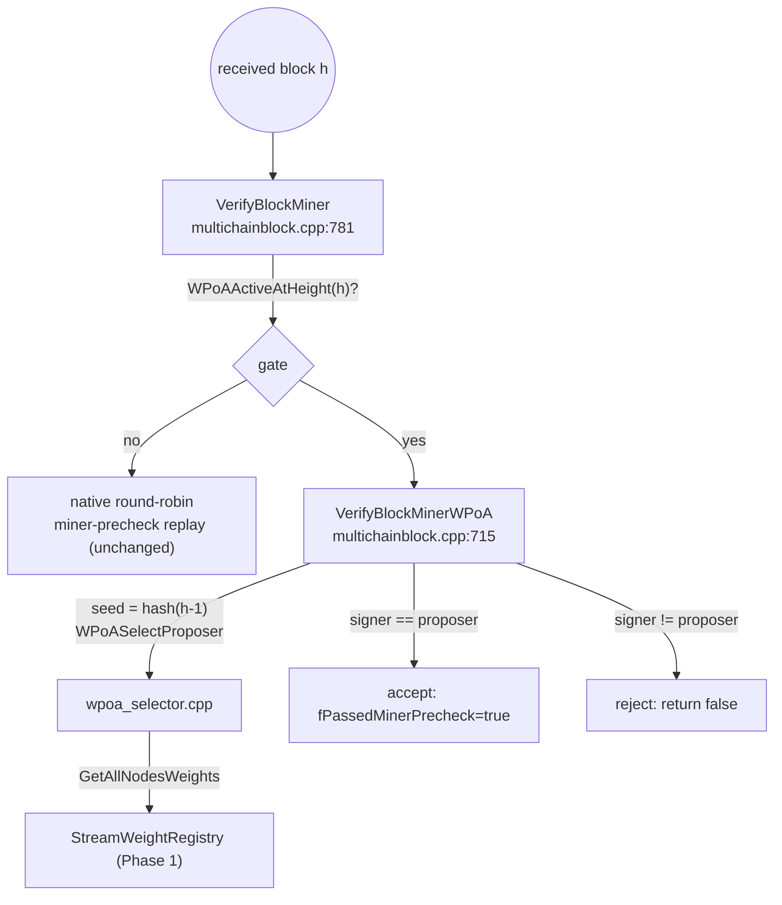

# `protocol/multichainblock.cpp` (wPoA Phase 2 parts)

> Documentation of the **validator-side integration** of wPoA weighted selection.
> `multichainblock.cpp` is a large file implementing MultiChain's block-level protocol
> checks; here we document **only** the wPoA addition: the new `VerifyBlockMinerWPoA`
> function and the one-line delegation added to `VerifyBlockMiner`. The rest — the native
> round-robin miner-precheck replay — is untouched.

This is a **modified host file**, not a new module file. The change is one new static
function plus a guarded early-return, both delimited by `/* MCHN START - wPoA Phase 2 */`
markers.

## 1. The role of `VerifyBlockMiner`

`VerifyBlockMiner(CBlock* block_in, CBlockIndex* pindexNew)` is the receiving-side check
that a block was produced by an **allowed** miner. Natively it replays the round-robin
mining-diversity rules along the branch to confirm the block's miner was in-turn. It sets
`pindexNew->fPassedMinerPrecheck = true` on acceptance and returns `false` to reject.

wPoA replaces that replay, **only for wPoA-governed heights**, with a check that the
block's signer equals the weighted-election proposer. The contract is preserved exactly:
same `fPassedMinerPrecheck` side effect, same `return false` = reject.

The include added at the top of the file:

```cpp
#include "wpoa/wpoa_selector.h"   // multichainblock.cpp:13 — WPoAActiveAtHeight, WPoASelectProposer
```

## 2. The delegation in `VerifyBlockMiner`

The existing early guards (unchanged) short-circuit for non-MultiChain protocol, when
`supportminerprecheck` is off, when anyone can mine, and when there is no previous block:

```cpp
if( (mc_gState->m_NetworkParams->IsProtocolMultichain() == 0) ||
    (mc_gState->m_NetworkParams->GetInt64Param("supportminerprecheck") == 0) ||
    (MCP_ANYONE_CAN_MINE) )
{ pindexNew->fPassedMinerPrecheck=true; return true; }

if(pindexNew->pprev == NULL)
{ pindexNew->fPassedMinerPrecheck=true; return true; }
```

Then the wPoA delegation (`multichainblock.cpp:797-803`):

```cpp
// wPoA Phase 2: when weighted selection governs this height, validate the
// miner against the weighted election instead of the round-robin diversity
// replay below.
if(WPoAActiveAtHeight(pindexNew->nHeight))
{
    return VerifyBlockMinerWPoA(block_in,pindexNew);
}
```

- `WPoAActiveAtHeight(pindexNew->nHeight)` — asks the **same** predicate the miner used
  (there it was `tip+1`; here it is the received block's own height `pindexNew->nHeight`).
  Because the predicate is a pure function of height + chain params, both sides agree on
  whether this block is wPoA-governed.
- If true, delegate to `VerifyBlockMinerWPoA` and return its verdict. If false, fall
  through to the unchanged native replay below — so **an unflagged / pre-setup node
  validates exactly as before**.
- The delegation is placed **after** `pprev == NULL` is ruled out, so
  `VerifyBlockMinerWPoA` may safely dereference `pindexNew->pprev`.

## 3. `VerifyBlockMinerWPoA` — line by line

```cpp
static bool VerifyBlockMinerWPoA(CBlock *block_in,CBlockIndex* pindexNew)
```
`static` = file-local. Inputs: the block (may be `NULL`, meaning "load it from disk") and
its block-index entry.

### 3.1 Obtain the block data (with native leniency)
```cpp
CBlock block_disk;
CBlock *pblock=block_in;
if(pblock == NULL)
{
    if( ((pindexNew->nStatus & BLOCK_HAVE_DATA) == 0) || !ReadBlockFromDisk(block_disk,pindexNew) )
    {
        LogPrintf("VerifyBlockMinerWPoA: Block %s (height %d) not available, miner check skipped\n", ...);
        pindexNew->fPassedMinerPrecheck=true;
        return true;
    }
    pblock=&block_disk;
}
```
- If the caller did not pass the block, try to load it: `pindexNew->nStatus &
  BLOCK_HAVE_DATA` tests the "block data present on disk" status flag; `ReadBlockFromDisk`
  deserializes it into `block_disk`.
- If the data is unavailable, **accept** (set `fPassedMinerPrecheck`, return true) rather
  than reject. This mirrors the native path's "not found" leniency — a node must not
  reject descendants merely because it lacks a block's bytes locally.

### 3.2 Recover the signer address
```cpp
if(pblock->vSigner[0] == 0)
{
    LogPrintf("VerifyBlockMinerWPoA: REJECT ... block has no signer\n", ...);
    return false;
}

std::vector<unsigned char> vchPubKey(pblock->vSigner+1, pblock->vSigner+1+pblock->vSigner[0]);
CPubKey pubKeyMiner(vchPubKey);
if(!pubKeyMiner.IsValid())
{
    LogPrintf("VerifyBlockMinerWPoA: REJECT ... invalid signer pubkey\n", ...);
    return false;
}
std::string sMinerAddr=CBitcoinAddress(pubKeyMiner.GetID()).ToString();
```
- `pblock->vSigner` is MultiChain's block-signer field: a length-prefixed byte array.
  `vSigner[0]` is the length of the pubkey; `vSigner[1 .. 1+len]` are the pubkey bytes.
- `vSigner[0] == 0` → the block carries no signer → **reject**. A wPoA block must be
  signed so its miner can be identified.
- `std::vector<unsigned char> vchPubKey(vSigner+1, vSigner+1+vSigner[0])` copies the
  pubkey bytes out using the iterator-range vector constructor.
- `CPubKey pubKeyMiner(vchPubKey)` reconstructs the public key; `IsValid()` rejects a
  malformed key.
- `sMinerAddr = CBitcoinAddress(pubKeyMiner.GetID()).ToString()` renders the signer's
  address in the **exact same format** the registry and the miner use (`GetID()` →
  hash160, `CBitcoinAddress(...).ToString()` → Base58Check). This is what makes the
  string comparison against the proposer meaningful.

### 3.3 Recompute the election
```cpp
uint256 hSeed=pindexNew->pprev->GetBlockHash();
std::string sProposer=WPoASelectProposer(hSeed.begin(),hSeed.size(),pindexNew->nHeight);
```
- `hSeed = pindexNew->pprev->GetBlockHash()` — the seed is the **previous** block's hash,
  identical to what the miner used when producing this block (there `pindexTip` *was* this
  block's parent). Safe to dereference `pprev` because `VerifyBlockMiner` already ruled
  out `pprev == NULL`.
- `WPoASelectProposer(hSeed.begin(), hSeed.size(), pindexNew->nHeight)` runs the same
  registry read + argmin the miner ran, so — given the same confirmed weight map — it
  produces the **same** proposer.

### 3.4 Empty-registry leniency
```cpp
if(sProposer.empty())
{
    LogPrintf("VerifyBlockMinerWPoA: Block %s (height %d): empty weight registry, miner check skipped\n", ...);
    pindexNew->fPassedMinerPrecheck=true;
    return true;
}
```
- If this node cannot compute the election (no wallet, or the `wpoa-weights` stream is not
  yet synced → empty weight map → `""`), **accept** rather than stall.
- Rationale (comment lines 755-759): honest blocks originate from the deterministic
  elected proposer and stay valid on any node that *has* synced weights, so accepting here
  does not admit an invalid proposer on a fully-synced node. The setup gate plus the
  functional test's wait-for-convergence make this path unreachable in the measured
  sample. See
  [phase2-implementation-guide.md §5.7](phase2-implementation-guide.md#5-design-decisions).

### 3.5 The enforcement check
```cpp
if(sMinerAddr != sProposer)
{
    LogPrintf("VerifyBlockMinerWPoA: REJECT block %s (height %d): miner %s is not the elected proposer %s\n",
              ..., sMinerAddr.c_str(), sProposer.c_str());
    return false;
}

LogPrint("wpoa","VerifyBlockMinerWPoA: OK block %s (height %d) miner==proposer==%s\n", ...);
pindexNew->fPassedMinerPrecheck=true;
return true;
```
- **`sMinerAddr != sProposer` → reject.** This is the heart of Phase 2 enforcement: a
  block is valid only if its signer is exactly the weighted-election winner for its
  height. A node that mines out of turn is rejected network-wide.
- The rejection uses `LogPrintf` (always visible) and names both addresses for
  diagnosis; the success uses category-gated `LogPrint("wpoa", …)`.
- On success set `fPassedMinerPrecheck = true` (the same acceptance side effect the native
  path sets) and return true.

## 4. Miner ↔ validator symmetry

The two sides are mirror images, and their agreement is what keeps the chain fork-free:

| | Miner (`miner.cpp`) | Validator (`multichainblock.cpp`) |
|---|---|---|
| Gate | `WPoAActiveAtHeight(tip+1)` | `WPoAActiveAtHeight(pindexNew->nHeight)` |
| Seed | `hash(tip)` = parent of the new block | `hash(pindexNew->pprev)` = parent of the block |
| Election | `WPoASelectProposer(seed, …)` | `WPoASelectProposer(seed, …)` |
| Identity compared | local mining address | block signer address |
| Action | elected → mine now; else wait | signer == proposer → accept; else reject |

Both read the **same** confirmed weight map and run the **same** pure `SelectProposer`,
so for a given block they compute the identical proposer — the miner produces only blocks
it is elected for, and every validator accepts exactly those.

## 5. Connections to the other files



- **`wpoa/wpoa_selector.h`** — provides `WPoAActiveAtHeight` and `WPoASelectProposer`.
  See [wpoa-selector.md](wpoa-selector.md).
- **Phase 1 registry** — reached through `WPoASelectProposer`.
- **`structs/base58.h` / `CPubKey`** — used to turn the block's `vSigner` field into a
  comparable address.
- **The miner** (`miner/miner.cpp`) is the production counterpart that this file enforces.
  See [miner-integration.md](miner-integration.md).
