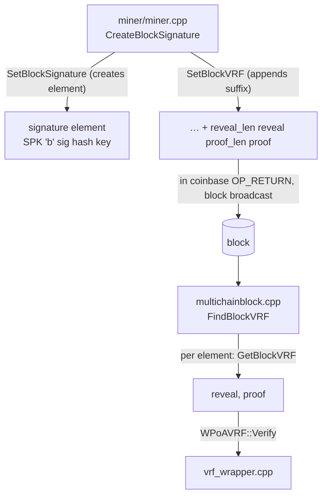

# `protocol/multichainscript.h` + `multichainscript.cpp` (wPoA Phase 3a parts)

> Documentation of the **on-chain carriage** of the wPoA VRF reveal.
> `multichainscript.{h,cpp}` implement MultiChain's `mc_Script` — the builder/parser for
> the tagged pushdata elements MultiChain stores in scripts. This doc covers **only** the
> Phase 3a additions: the two new methods `SetBlockVRF` / `GetBlockVRF`, and the one-line
> relaxation of `GetBlockSignature`. The rest of `mc_Script` is untouched.

These are **modified host files**, not a new module. The additions are delimited by
`/* MCHN START - wPoA Phase 3a … */ … /* MCHN END */`.

## 1. Background: how `mc_Script` stores an element

An `mc_Script` is a flat byte buffer (`m_lpData`) plus a coordinate array (`m_lpCoord`)
holding, for each element, an `(offset, length)` pair:

- `m_lpCoord[e*2 + 0]` — byte offset of element `e` within `m_lpData`.
- `m_lpCoord[e*2 + 1]` — byte length of element `e`.
- `m_CurrentElement` — the index of the element currently being read/written.

Two low-level helpers move bytes:

- `SetData(const unsigned char* src, int len)` — **appends** `len` bytes to the *current*
  element (growing it). It does **not** start a new element; `AddElement()` does that.
- `mc_PutLE(buf, &value, n)` / `mc_GetLE(ptr, n)` — write / read an `n`-byte
  little-endian integer. Here `n = 1`, so these just store/read a single length byte.

A **block-signature element** is one tagged pushdata element with this layout, produced by
the existing `SetBlockSignature`:

```
[ "SPK" ][ 'b' ][ sig_len:1 ][ sig ][ hash_type:1 ][ key_len:1 ][ key ]
  \_____________/
   identifier(3)  prefix(1)
```

- `MC_DCT_SCRIPT_FREE_DATA_IDENTIFIER = "SPK"`, `MC_DCT_SCRIPT_IDENTIFIER_LEN = 3` — the
  3-byte tag that marks a MultiChain free-data element.
- `MC_DCT_SCRIPT_MULTICHAIN_BLOCK_SIGNATURE_PREFIX = 'b'` — the one-byte sub-type that says
  "this free-data element is a block signature".

Phase 3a appends the VRF reveal **after** `key`, inside this same element.

## 2. Why a suffix of the signature element (not a new element/output)

The comment block above `SetBlockVRF` records the two hard MultiChain constraints that
force this design:

1. **`MultiChainTransaction_CheckOpReturnScript` rejects a coinbase OP_RETURN with more
   than one pushdata element** ("Metadata script rejected"). So the reveal cannot be its
   own element in the coinbase metadata.
2. **`CreateBlockSignature` strips every extra zero-value coinbase output before
   re-signing.** So a standalone VRF OP_RETURN *output* would not survive to the final
   block.

Keeping the reveal as a suffix of the single existing signature element sidesteps both: the
element count stays exactly 1, and the bytes ride along with the signature the miner
already manages. The element is **excluded from the signed hash** (like the whole coinbase
OP_RETURN, via `MERKLETREE_NO_COINBASE_OP_RETURN`) but **included in the full merkle root**,
so the reveal is committed by the block hash / PoW even though the block signature does not
cover it — see [phase3a-implementation-guide.md §5](phase3a-implementation-guide.md#5-on-chain-carriage-of-the-reveal).

Layout after `SetBlockVRF`:

```
[ "SPK" ][ 'b' ][ sig_len ][ sig ][ hash_type ][ key_len ][ key ][ reveal_len:1 ][ reveal ][ proof_len:1 ][ proof ]
  \___________ SetBlockSignature ________________________________/\_______________ SetBlockVRF suffix ______________/
```

## 3. `multichainscript.h` — the declarations

```cpp
/* MCHN START - wPoA Phase 3a: per-block VRF reveal (randomness beacon) */
    int GetBlockVRF(unsigned char* reveal,int *reveal_size,unsigned char* proof,int *proof_size);
    int SetBlockVRF(const unsigned char* reveal,int reveal_size,const unsigned char* proof,int proof_size);
/* MCHN END */
```

Declared right next to `GetBlockSignature`/`SetBlockSignature`, because they operate on the
**same element** and are meant to be read as a pair with them. The header comment states
the ordering contract: *`SetBlockVRF` appends `[reveal_len:1][reveal][proof_len:1][proof]`
to the current element and MUST be called right after `SetBlockSignature`; `GetBlockVRF`
decodes that suffix.*

## 4. `SetBlockVRF` — append the reveal to the current element

```cpp
int mc_Script::SetBlockVRF(const unsigned char* reveal,int reveal_size,
                           const unsigned char* proof,int proof_size)
{
    int err;
    unsigned char buf[1];

    if((reveal_size>0xff) || (proof_size>0xff) || (m_CurrentElement<0))
        return MC_ERR_INVALID_PARAMETER_VALUE;

    mc_PutLE(buf,&reveal_size,1);   err=SetData(buf,1);        if(err) return err;
    err=SetData(reveal,reveal_size);                           if(err) return err;

    mc_PutLE(buf,&proof_size,1);    err=SetData(buf,1);        if(err) return err;
    err=SetData(proof,proof_size);                             if(err) return err;

    return MC_ERR_NOERROR;
}
```

- **Guards.** `reveal_size > 0xff` / `proof_size > 0xff` → `MC_ERR_INVALID_PARAMETER_VALUE`,
  because each length is stored in a **single byte** (max 255). The Phase 3a sizes (32 and
  97) are well inside this, and the mirror check in `GetBlockVRF` reads them back as one
  byte. `m_CurrentElement < 0` guards against calling this before any element exists — it
  must be called *after* `SetBlockSignature` created the element.
- **Four appends** via `SetData` — because `SetData` appends to the *current* element and
  `SetBlockVRF` never calls `AddElement()`, all four writes land inside the signature
  element that `SetBlockSignature` just created and left current:
  1. `mc_PutLE(buf,&reveal_size,1)` then `SetData(buf,1)` — the 1-byte reveal length.
  2. `SetData(reveal,reveal_size)` — the reveal bytes.
  3. the 1-byte proof length.
  4. `SetData(proof,proof_size)` — the proof bytes.
- Any `SetData` failure (buffer growth error) propagates out as `err`; the caller
  (`CreateBlockSignature`) does not treat this as fatal — see [vrf-prover.md](vrf-prover.md).

**This is why call order matters:** if anything called `AddElement()` between
`SetBlockSignature` and `SetBlockVRF`, the suffix would land in a *second* element and (a)
`GetBlockVRF` would not find it after the key and (b) the coinbase would have two metadata
elements and be rejected (§2). The header comment makes the ordering requirement explicit.

## 5. `GetBlockVRF` — decode the suffix

```cpp
int mc_Script::GetBlockVRF(unsigned char* reveal,int *reveal_size,
                           unsigned char* proof,int *proof_size)
{
    unsigned char *ptr,*end;
    int sig_len,key_len,reveal_len,proof_len;

    if(m_CurrentElement<0)                                              // (1)
        return MC_ERR_INVALID_PARAMETER_VALUE;

    if(m_lpCoord[m_CurrentElement*2+1] < MC_DCT_SCRIPT_IDENTIFIER_LEN+1+3)  // (2)
        return MC_ERR_WRONG_SCRIPT;

    ptr=m_lpData+m_lpCoord[m_CurrentElement*2+0];                       // (3)
    end=ptr+m_lpCoord[m_CurrentElement*2+1];

    if(memcmp(ptr,MC_DCT_SCRIPT_FREE_DATA_IDENTIFIER,MC_DCT_SCRIPT_IDENTIFIER_LEN) != 0)  // (4)
        return MC_ERR_WRONG_SCRIPT;
    if(ptr[MC_DCT_SCRIPT_IDENTIFIER_LEN] != MC_DCT_SCRIPT_MULTICHAIN_BLOCK_SIGNATURE_PREFIX)
        return MC_ERR_WRONG_SCRIPT;

    ptr+=MC_DCT_SCRIPT_IDENTIFIER_LEN+1;                               // (5) skip "SPK" + 'b'

    sig_len=mc_GetLE(ptr,1); ptr++; ptr+=sig_len;                      //     skip [sig_len][sig]
    ptr++;                                                             //     skip [hash_type]

    if(ptr>=end) return MC_ERR_WRONG_SCRIPT;                           // (6)
    key_len=mc_GetLE(ptr,1); ptr++; ptr+=key_len;                     //     skip [key_len][key]

    if(ptr+2>end) return MC_ERR_WRONG_SCRIPT;                          // (7) no VRF suffix present

    reveal_len=mc_GetLE(ptr,1); ptr++;                                // (8) reveal
    if((reveal_len>*reveal_size) || (ptr+reveal_len+1>end))
        return MC_ERR_WRONG_SCRIPT;
    memcpy(reveal,ptr,reveal_len); *reveal_size=reveal_len; ptr+=reveal_len;

    proof_len=mc_GetLE(ptr,1); ptr++;                                 // (9) proof
    if((proof_len>*proof_size) || (ptr+proof_len>end))
        return MC_ERR_WRONG_SCRIPT;
    memcpy(proof,ptr,proof_len); *proof_size=proof_len;

    return MC_ERR_NOERROR;
}
```

`GetBlockVRF` **re-walks the exact same element `GetBlockSignature` reads**, then decodes
what follows the key:

1. **`m_CurrentElement < 0`** → invalid (nothing selected). The caller (`FindBlockVRF`)
   selects each element with `SetElement(e)` before calling.
2. **Minimum-length guard** — the element must be at least `3 + 1 + 3` bytes (identifier +
   prefix + the 3 fixed one-byte fields `sig_len`, `hash_type`, `key_len`), or it cannot be
   a block signature at all.
3. **`ptr` / `end`** — `ptr` points at the start of the element in `m_lpData`
   (`offset = m_lpCoord[e*2+0]`); `end` is one past its last byte
   (`offset + length`, `length = m_lpCoord[e*2+1]`). Every subsequent bounds check compares
   against `end`, so a truncated element can never read out of the element.
4. **Tag check** — the element must start with `"SPK"` and the `'b'` block-signature
   prefix; otherwise it is some other element and this returns `MC_ERR_WRONG_SCRIPT`. This
   is how `FindBlockVRF` can call `GetBlockVRF` on *every* element and only match the
   signature element.
5. **Skip the identifier + prefix**, then skip `[sig_len][sig]` (read the 1-byte length,
   advance past it and the signature) and the 1-byte `[hash_type]`.
6. **Bounds check before the key length**, then skip `[key_len][key]`. After this, `ptr`
   sits exactly where a pre-Phase-3a signature ends.
7. **`ptr + 2 > end` → no VRF suffix.** A pre-Phase-3a block (or a block signed with VRF
   disabled) ends right at the key; there are no two more bytes for even an empty
   `[reveal_len][proof_len]`. Returning `MC_ERR_WRONG_SCRIPT` here is the "this block simply
   has no reveal" signal — `FindBlockVRF` turns it into "reveal absent", which the verifier
   treats as a **reject** on VRF-governed heights and ignores elsewhere.
8. **Decode the reveal** — read `reveal_len`, then bounds-check twice: `reveal_len` must fit
   the caller's buffer (`> *reveal_size` → error) **and** the element must still hold
   `reveal_len` bytes plus the following proof-length byte (`ptr+reveal_len+1 > end`). Then
   copy out and report the actual length via `*reveal_size`.
9. **Decode the proof** — symmetric: read `proof_len`, check it fits the buffer and that the
   element holds `proof_len` more bytes (`ptr+proof_len > end`), copy out, report length.

The variable-length framing (a length byte before each blob) means the decoder does not
hard-code 32/97; it reports whatever lengths are present. The **fixed** Phase 3a sizes are
re-imposed downstream by `WPoAVRF::Verify`'s vector overload, which rejects any
reveal/proof that is not exactly `OUTPUT_SIZE`/`PROOF_SIZE` (see
[vrf-wrapper.md §3.10](vrf-wrapper.md)). So a malformed/truncated suffix fails here, and a
wrong-sized-but-well-framed suffix fails at verification — either way the block is rejected.

## 6. The `GetBlockSignature` relaxation

The only change to existing code is one operator:

```cpp
// before:  if(m_lpCoord[…] != MC_DCT_SCRIPT_IDENTIFIER_LEN+1+3+sig_len+key_len)
// after:
if(m_lpCoord[m_CurrentElement*2+1] < MC_DCT_SCRIPT_IDENTIFIER_LEN+1+3+sig_len+key_len)
    return MC_ERR_WRONG_SCRIPT;
```

`GetBlockSignature` used to require the element length to **exactly equal**
`identifier + prefix + 3 fixed bytes + sig + key`. With a VRF suffix appended, the element
is now **longer** than that, so the exact-equality check would reject every VRF-carrying
block signature. Relaxing `!=` to `<` means:

- **A block with a VRF suffix** — element is *longer* → passes (`length ≥ expected`),
  `GetBlockSignature` reads exactly `sig`/`hash`/`key` and stops, ignoring the suffix.
- **A pre-Phase-3a block** — element length *equals* the expected value → still passes
  (`length` is not `< expected`), byte-for-byte as before.
- **A truncated / malformed element** — element *shorter* than the fixed prefix → still
  rejected (`length < expected`).

So the relaxation is backward-compatible (old blocks parse identically) and it does not
weaken validation of the signature fields themselves — it only tolerates trailing bytes
that `GetBlockVRF` is responsible for interpreting. The comment above the line records
exactly this rationale.

## 7. Connections to the other files



- **`miner/miner.cpp`** calls `SetBlockSignature` then `SetBlockVRF` (in that order) to
  build the element. See [vrf-prover.md](vrf-prover.md).
- **`protocol/multichainblock.cpp`** (`FindBlockVRF`) selects each coinbase element and
  calls `GetBlockVRF`, then feeds the decoded reveal/proof to `WPoAVRF::Verify`. See
  [vrf-verifier.md](vrf-verifier.md).
- **`vrf_wrapper.{h,cpp}`** define the `OUTPUT_SIZE`/`PROOF_SIZE` the miner writes and the
  vector `Verify` re-imposes. See [vrf-wrapper.md](vrf-wrapper.md).
- The design rationale for carrying the reveal here at all is in
  [phase3a-implementation-guide.md §5](phase3a-implementation-guide.md#5-on-chain-carriage-of-the-reveal).
