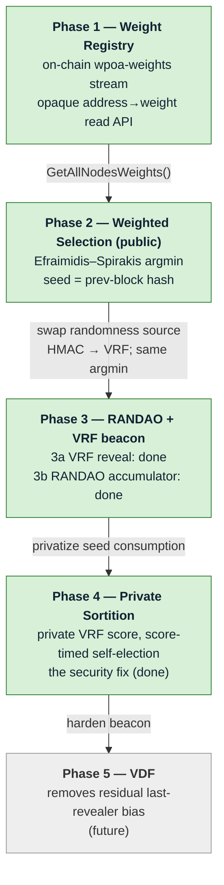

# wPoA Implementation Guide — Master Index

> **What this file is.** A lightweight, high-level map of the whole wPoA
> implementation across all phases. It says, in a few sentences per phase, what
> each phase adds and how the phases build on one another, and links to the
> **dedicated technical guide** for each. It intentionally contains *no* deep
> code detail — that lives in the per-phase guides linked below.
>
> **Where to go next:**
> - *Why* the design looks the way it does → [thesis-project-overview.md](thesis-project-overview.md) (research companion).
> - *What is planned / done and in what order* → [implementation-roadmap.md](implementation-roadmap.md) (engineering companion).
> - *How a specific phase actually works, in code* → the phase guide linked in the table below.

---

## How the phases fit together

wPoA is built as a stack of layers, each phase adding one layer on top of the
previous one. Every phase is independently built, tested, and merged, and each
reuses the layer beneath it unchanged — in particular the **opaque weight-read
API** from Phase 1 is consumed identically by every later phase.

The through-line: Phase 2 establishes the **scoring + argmin** machinery over a
*public* seed; Phases 3–4 keep that machinery and only change *how the seed is
produced and consumed* (adding a VRF/RANDAO beacon and moving evaluation inside
each validator's secret key); Phase 5 hardens the beacon. Because the election
math and the weight-read path never change, later phases are drop-in on top of
Phase 2.

---

## Phases at a glance

| Phase | Status | What it adds (summary) | Technical guide |
|:-----:|:------:|------------------------|-----------------|
| **1** | Done | An append-only on-chain `wpoa-weights` stream where every validator registers a positive integer weight, plus an opaque `address→weight` read API (`GetLocalWeight` / `GetAllNodesWeights` / `GetNodeWeight`) and three RPCs. Registration is deferred to a background thread; reads observe confirmed state from any thread. This is the substrate every later phase reads from. | [phase1-implementation-guide.md](phase1-implementation-guide.md) |
| **2** | Done | Weighted proposer election wired into the miner and block validator. Each height's proposer is chosen in proportion to weight via the Efraimidis–Spirakis argmin (`score_i = -ln(u_i)/w_i`, `u_i` from `HMAC-SHA256(prev-block-hash, address)`), gated by `-enablewpoa`. Intentionally public/predictable — a substrate-validation baseline before privacy. | [phase2-implementation-guide.md](phase2-implementation-guide.md) |
| **3a** | Done | Adds the VRF half of the beacon (randomness *generation*): each wPoA-elected proposer publishes a verifiable pseudorandom reveal `R[n]=VRF_sk(h[n-1])` with proof `π[n]` in its block (an ECVRF/DLEQ over the bundled secp256k1), and every peer verifies it before accepting the block. Selection is unchanged (still the public Phase 2 election); the VRF is a grinding-resistant contribution, not yet the selection mechanism. Gated by `-enablewpoavrf`. | [phase3a-implementation-guide.md](phase3a-implementation-guide.md) |
| **3b** | Done | Accumulates the per-block reveals into a RANDAO beacon `R_tot[n]=H(R_tot[n-1]⊕H(R[n]))` and feeds the lookback seed `H(R_tot[n-k]‖h[n-1]‖n)` back into selection (gated by `-enablewpoarandao`, lookback `-wpoarandaolookback=k`), replacing the plain prev-block-hash seed and bounding manipulation. Selection stays weight-proportional; only the seed source changes. | [phase3b-implementation-guide.md](phase3b-implementation-guide.md) |
| **4** | Done | The security fix: each validator evaluates its election score privately under its own VRF key (`u_i=VRF_sk_i(seed‖"PROPOSER"‖height)`, same `-ln(u)/f(w)` transform as Phase 2) and self-elects by a score-proportional mining delay, so the argmin proposes first and the proposer is unknowable to peers until it acts. The validator replaces the public argmin equality with a VRF-verify + score-recompute + time-bar eligibility check; the auto-relaxing time bar is the liveness fallback (no zero-proposer gap). Gated by `-enablewpoasortition` (+ `-wpoasortitiondelay`; requires `-enablewpoarandao`, `k>=1`). | [phase4-implementation-guide.md](phase4-implementation-guide.md) |
| **5** | Future | A Verifiable Delay Function over the beacon output, removing the residual last-revealer bias that Phase 3's RANDAO only bounds (Cleve's theorem). | *(to be added: `phase5-implementation-guide.md`)* |

Per-item status detail lives in
[implementation-roadmap.md §3](implementation-roadmap.md#3-current-implementation-status).

---

## Supporting references

These are cross-cutting references shared by all phases (not phase guides):

| Document | What it covers |
|----------|----------------|
| [thesis-project-overview.md](thesis-project-overview.md) | Research companion: problem, threat model, formal model, probability-preservation proof (§7.4). |
| [implementation-roadmap.md](implementation-roadmap.md) | Engineering companion: phased plan, rationale, per-item status, vulnerabilities, success criteria. |
| [multichain-internals.md](multichain-internals.md) | Reference to the MultiChain host APIs the module builds on, with `file:line` pointers. |
| [stream-weight-registry.md](stream-weight-registry.md) | Line-by-line walkthrough of the Phase 1 registry class. |
| [weight-record.md](weight-record.md) | Walkthrough of the pure parsing/aggregation helpers (`weight_record.h`). |
| [node-startup.md](node-startup.md) | How `-weight` / `-enablewpoa` are wired into `AppInit2`. |
| [rpc-registration.md](rpc-registration.md) | How the RPC commands are added to the dispatch table. |
| [testing.md](testing.md) | Build steps, unit tests, and the MultiChain mining model used by the functional tests. |

---

## Documentation Maintenance

This section defines the **repeatable documentation process** to apply on every
new feature/branch, so the docs stay consistent and never drift from the code.
Follow it as part of the "docs complete" bar for merging any phase (see the
branch-strategy rules in
[implementation-roadmap.md §5](implementation-roadmap.md#5-branches--branch-strategy)).

For every new feature/phase:

1. **New technical guide per feature.** Add `phaseN-implementation-guide.md` (or
   a feature-named equivalent) in `docs/`, following the structure of
   [phase1-implementation-guide.md](phase1-implementation-guide.md) /
   [phase2-implementation-guide.md](phase2-implementation-guide.md): what it
   delivers, the algorithm/design, a **detailed Mermaid diagram of its own
   flow**, an **integration-points table** (site → file → change), tests, and
   known risks.
2. **Update this master index.** Add a row to *Phases at a glance* (status +
   2–4-sentence summary + link) and extend the *How the phases fit together*
   Mermaid diagram with the new phase node and its dependency edge. Existing
   rows/nodes are not rewritten — only appended.
3. **Update the README.** Refresh the table of contents, the high-level
   architecture diagram, and the *Implementation status* section to include the
   new feature. The README points to this guide rather than duplicating it.
4. **No-duplication rule.** Before adding any explanation, check whether it
   already exists elsewhere in `docs/`. If it does, **link to it** instead of
   repeating it; consolidate any duplicate into the single most appropriate
   file.
5. **Diagram-consistency rule.** Every file that carries implementation detail
   must carry a diagram reflecting its **current** state. A diagram is never
   allowed to go stale relative to the code — updating the diagram is part of the
   same change that alters the behavior it depicts.

Quick checklist to copy into a phase PR:

- [ ] `phaseN-implementation-guide.md` added (detail + detailed Mermaid + integration table + tests + risks)
- [ ] Master `implementation-guide.md`: new row + diagram node/edge
- [ ] `README.md`: ToC + architecture diagram + status updated
- [ ] No duplicated prose (linked instead); diagrams reflect current code
- [ ] `implementation-roadmap.md §3` status rows updated
