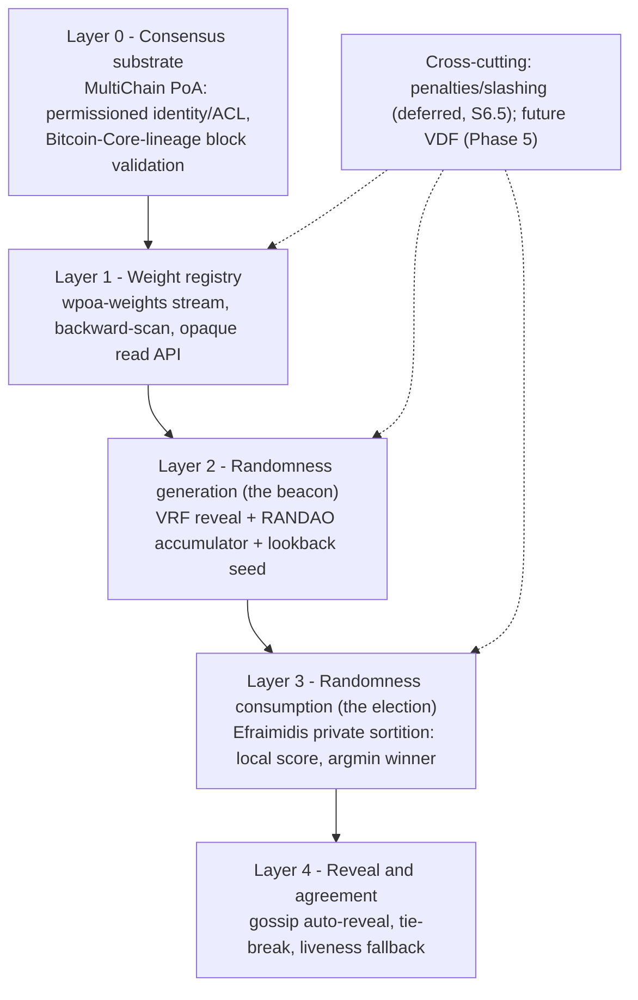
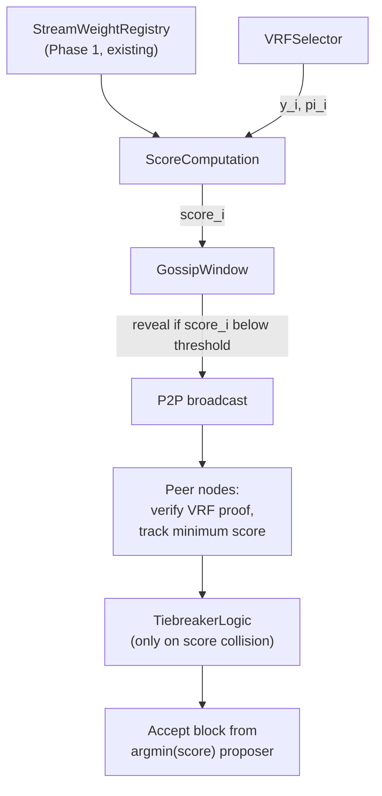
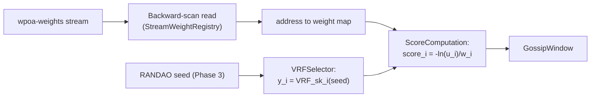
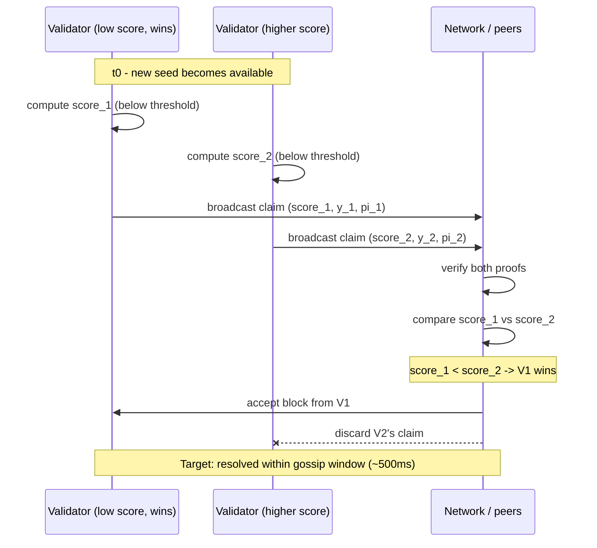

# Implementation Roadmap — wPoA Selector with Efraimidis–Spirakis Sortition

> **Scope of this document.** This is the *engineering* companion to the wPoA
> project: current status, phased plan, branch strategy, components, and
> known risks — self-contained. For the research background, formal model,
> and mathematical justification, see
> [thesis-project-overview.md](thesis-project-overview.md). For code-level
> walkthroughs of what is already built, see the per-phase guides linked from
> the master [implementation-guide.md](implementation-guide.md) — this document
> summarizes what those guides cover rather than duplicating them, and remains
> understandable on its own if they are not read.

---

## Table of Contents

1. [Executive Summary](#1-executive-summary)
2. [Rationale: Why Efraimidis over Public WRS](#2-rationale-why-efraimidis-over-public-wrs)
3. [Current Implementation Status](#3-current-implementation-status)
4. [Directory Structure](#4-directory-structure)
5. [Branches & Branch Strategy](#5-branches--branch-strategy)
6. [Phase-by-Phase Plan](#6-phase-by-phase-plan)
7. [Weight Retrieval via Streams (Conceptual)](#7-weight-retrieval-via-streams-conceptual)
8. [Diagrams](#8-diagrams)
9. [Vulnerabilities & Mitigations](#9-vulnerabilities--mitigations)
10. [Success Criteria](#10-success-criteria)
11. [Known Risks & Edge Cases](#11-known-risks--edge-cases)

---

## 1. Executive Summary

**Goal.** Replace a naïve, publicly-evaluable weighted proposer election with
a **privately-evaluated** one, using the Efraimidis–Spirakis weighted
sampling transform driven by a per-validator VRF, so that the identity of the
next block proposer is unknown to the network until that proposer chooses to
reveal it. This closes the leader-predictability attack surface described in
[thesis-project-overview.md §3](thesis-project-overview.md#3-threat-model--vulnerabilities)
without changing the underlying weight-proportional election probabilities
(proof in
[thesis-project-overview.md §7.4](thesis-project-overview.md#74-probability-preservation-efraimidis-theorem)).

The mechanism is layered so each layer can be built, tested, and merged
independently:



**Phases:**

| Phase | Layer | Deliverable | Status |
|:-----:|---|---|---|
| 1 | 1 | `StreamWeightRegistry` — on-chain weight registry, backward-search read path | Implemented |
| 2 | 1 (consumer) | Weighted miner selection via an intentionally **public** baseline WRS, to validate the registry substrate before adding privacy | **Current — implemented** |
| 3a | 2 | VRF integration — per-block verifiable reveal `(R, π)` embedded and verified by peers (the VRF half of the randomness *generation* layer) | **Implemented** |
| 3b | 2 | RANDAO accumulator + lookback seed over the reveals (the beacon half of *generation*) | **Implemented** |
| 4 | 3 + 4 | Efraimidis private sortition — local scoring, gossip reveal, tie-break, fallback (the *security fix* — randomness *consumption* half) | Planned |
| 5 | Cross-cutting | Weight inizialization, update, slashing mechanisms | Planned |

This is a **bachelor's thesis** engineering track (Università di Pisa,
supervisor Prof. Damiano Di Francesco Maesa). Efraimidis–Spirakis WRS, VRFs,
and RANDAO are **adopted, not invented**, here — see the rationale in
[§2](#2-rationale-why-efraimidis-over-public-wrs) for why the private form is
the one actually being built toward.

---

## 2. Rationale: Why Efraimidis over Public WRS

Efraimidis–Spirakis weighted random sampling is **not proposed here as a new
algorithm** — it is a 2006 result. What this section documents is the
*rationale* for using its private, per-node scoring form rather than the
simpler public cumulative-range form, and why Phase 2 deliberately builds the
public form first.

**Public cumulative WRS.** Every node holds the same ordered validator list,
the same weights, and the same seed. Anyone — validator or outside observer —
can therefore compute the next proposer as soon as the seed is public, i.e.
as soon as the previous block finalizes. That is a full block interval of
advance warning. Phase 2 deliberately builds exactly this form, seeded by the
plain previous-block hash (no VRF, no RANDAO) — its purpose is to isolate and
validate the weight-registry-to-selector wiring before privacy is added, not
to be a production-safe mechanism.

**Efraimidis private sortition (Phase 4).** Each validator evaluates its own
election score locally, using its own secret key as an input no one else has.
Only the winner needs to reveal anything, and it reveals its score
*together with* the block it is proposing — collapsing the predictability
window from "one block ahead" to "the gossip propagation time of that block"
(design target: well under one second).

**The probability distribution is unchanged.** This is the property that
makes the substitution safe to make without re-deriving the consensus'
economic assumptions: `Pr[i elected] = w_i / Σ w_j` in both forms. Proof
sketch and the exponential-race argument are in
[thesis-project-overview.md §7.4](thesis-project-overview.md#74-probability-preservation-efraimidis-theorem).

### Pseudocode Comparison

```text
=== PUBLIC WRS (Phase 2 baseline — vulnerable) ===
target = seed % totalWeight
cumulativeWeight = 0
for node_i in orderedNodes:
    cumulativeWeight += weight[i]
    if target < cumulativeWeight:
        return node_i  # Known by all, 1 block early

=== PRIVATE SORTITION (Phase 4 target — secure) ===
// Each validator i (in private, using sk_i):
y_i = VRF_sk_i(seed || "PROPOSER" || height)
u_i = y_i / 2^256  // Normalize to (0,1)
E_i = -ln(u_i)     // Exp(1) distributed
score_i = E_i / weight[i]

if score_i < threshold:  // Top-N reveal condition
    broadcast (block, y_i, proof_i, PK_i)

// On all nodes (gossip phase):
// Accept block from proposer with argmin(score_i)
// Probability of i winning = weight[i] / totalWeight (SAME as public WRS)
```

Both forms select node `i` with probability `weight[i] / totalWeight`. The
only thing that changes between them is **where the computation happens**
(everywhere, vs. only inside validator `i`'s process) and **when the result
becomes known** (immediately after the seed is public, vs. only when `i`
chooses to broadcast).

### Security Model (Target, End of Phase 4)

| Property | Mechanism |
|---|---|
| Grinding resistance | VRF uniqueness (Micali–Rabin–Vadhan) |
| Bias bound | RANDAO ≤ 1 bit per controlled slot (Cleve), fully addressed only by Phase 5's VDF |
| Leader unpredictability | VRF private evaluation over the RANDAO seed (Phase 4) |
| Sybil resistance | Permissioned admission (inherited from MultiChain, Layer 0) |
| Non-participation deterrence | Deferred — see [§6.5](#65-deferred--out-of-track-items) |

---

## 3. Current Implementation Status

| Phase | Area | Status | Notes |
|:-----:|---|---|---|
| 1 | Weight configuration (`-weight`) & validation | Done | Validated in `AppInit2`; startup fails on `-weight <= 0`. |
| 1 | Deferred registration (background thread) | Done | Waits for readiness, retries, bounded budget before giving up. |
| 1 | On-chain append-only registry (`wpoa-weights`) | Done | Create + subscribe + publish via reused RPC handlers; idempotent re-registration. |
| 1 | Opaque read API (`GetLocalWeight`, `GetAllNodesWeights`, `GetNodeWeight`) | Done | Backward-search per address; hides stream mechanics from callers. |
| 1 | RPC surface (`getlocalweight`, `getnodeweight`, `getallweights`) | Done | Confirmed-only, thread-safe. |
| 1 | Unit tests (pure parsing / aggregation) | Done | Boost.Test suite, node-free — [`test/wpoa_weight_tests.cpp`](../test/wpoa_weight_tests.cpp). |
| 1 | Single-node functional smoke test | Done | [`test/functional_test_wpoa.sh`](../test/functional_test_wpoa.sh). |
| 1 | Multi-node functional smoke test | Done | [`test/functional_test_wpoa_multinode.sh`](../test/functional_test_wpoa_multinode.sh). |
| 2 | Weighted miner selection (`WPoASelector` + miner hook) | Done | Efraimidis–Spirakis argmin seeded by prev-block hash, consuming `GetAllNodesWeights()`. [phase2-implementation-guide.md](phase2-implementation-guide.md). |
| 2 | `-enablewpoa` runtime toggle | Done | Default off; native round-robin unchanged when unset. Gates the miner + validation hooks via `WPoAActiveAtHeight`. |
| 2 | Proposer validation (`VerifyBlockMiner` hook) | Done | Recomputes the election on receipt; rejects blocks whose miner ≠ elected proposer. |
| 2 | Deterministic tie-break | Done | Lexicographically smallest address on exact score collision (§9). |
| 2 | Unit tests (pure selector math) | Done | [`test/wpoa_selector_tests.cpp`](../test/wpoa_selector_tests.cpp); probability preservation over 200k seeds. |
| 2 | Multi-node distribution test (chi-square) | Done | [`test/functional_test_wpoa_multinode.sh`](../test/functional_test_wpoa_multinode.sh) + [`test/analyze_distribution.py`](../test/analyze_distribution.py); ~1000 blocks, observed vs. expected. |
| 3a | VRF wrapper (ECVRF/DLEQ on bundled secp256k1) | Done | Pure `WPoAVRF::Prove`/`Verify`; node-free unit suite (roundtrip, determinism, tamper/forgery/cross-key rejection). [phase3a-implementation-guide.md](phase3a-implementation-guide.md). |
| 3a | Per-block VRF reveal — embed + verify | Done | Proposer embeds `(R, π)` as a suffix of the block-signature element; `VerifyBlockMinerWPoA` rejects a missing/invalid reveal on wPoA-VRF heights. Gated by `-enablewpoavrf`. |
| 3a | Multi-node functional test | Done | [`test/functional_test_wpoa_vrf.sh`](../test/functional_test_wpoa_vrf.sh): reveals produced, verified network-wide, chain live and fork-free under mandatory verification. |
| 3b | RANDAO accumulator + lookback seed | Done | `RandaoAccumulator` folds the 3a reveals into `R_tot[n]=H(R_tot[n-1]⊕H(R[n]))` and derives `seed[n+1]=H(R_tot[n-k]‖h[n-1]‖n)`, swapped into selection at both the miner and validator call sites. Gated by `-enablewpoarandao` (+ `-wpoarandaolookback=k`); consumes the seed only, election unchanged. [phase3b-implementation-guide.md](phase3b-implementation-guide.md). |
| **4** | **Efraimidis private sortition** | Pending | **The security fix.** See [§6.3](#63-phase-4--efraimidis-private-sortition-the-security-fix). |
| 5 | VDF over beacon seed | Future | See [§6.4](#64-phase-5--vdf-future). |

Phase 1 is fully merged into `master` (see [§5](#5-branches--branch-strategy)).
Phase 2 is implemented on `feature/wpoa-miner-integration`
(`wpoa/wpoa_selector.{h,cpp}` plus the miner/validation hooks); see
[phase2-implementation-guide.md](phase2-implementation-guide.md). Phase 3a (VRF
reveal) is implemented (`wpoa/vrf_wrapper.{h,cpp}`; see
[phase3a-implementation-guide.md](phase3a-implementation-guide.md)) and Phase 3b
(RANDAO accumulator) is implemented on `feature/wpoa-randao`
(`wpoa/randao_accumulator.{h,cpp}` plus the seed swap at the two selection call
sites; see [phase3b-implementation-guide.md](phase3b-implementation-guide.md)).
Phases 4–5 are not yet implemented (see [§4](#4-directory-structure)).

---

## 4. Directory Structure

Scanned directly from the working tree (`src/wpoa/`), current as of this
document's writing. Build artifacts (`.deps/`, `.dirstamp`, `*.o`) are
omitted.

```
src/wpoa/
├── README.md                                 ← module entry point
├── stream_weight_registry.h                  (Phase 1, implemented)
├── stream_weight_registry.cpp                (Phase 1, implemented)
├── weight_record.h                           (Phase 1, implemented — pure
│                                                parsing/aggregation helpers)
├── wpoa_selector.h                           (Phase 2, implemented — pure
│                                                Efraimidis–Spirakis selector core;
│                                                Phase 3a VRF flag + predicate)
├── wpoa_selector.cpp                         (Phase 2, implemented — flag +
│                                                activation predicate + registry glue;
│                                                Phase 3a g_wpoa_vrf_enabled + WPoAVRFActiveAtHeight)
├── vrf_wrapper.h                             (Phase 3a, implemented — pure ECVRF/DLEQ
│                                                VRF core over secp256k1)
├── vrf_wrapper.cpp                           (Phase 3a, implemented — Prove/Verify,
│                                                hash-to-curve, DLEQ proof)
├── randao_accumulator.h                      (Phase 3b, implemented — pure RANDAO
│                                                Fold/DeriveSeed/Genesis core + glue decls)
├── randao_accumulator.cpp                    (Phase 3b, implemented — flag/lookback,
│                                                WPoARANDAOActiveAtHeight, memoized
│                                                accumulator walk, seed helper)
├── docs/
│   ├── implementation-guide.md               ← master index (phase map + links + process)
│   ├── phase1-implementation-guide.md         ← Phase 1 full technical guide
│   ├── phase2-implementation-guide.md         ← Phase 2 full technical guide
│   ├── phase3a-implementation-guide.md        ← Phase 3a full technical guide
│   ├── phase3b-implementation-guide.md        ← Phase 3b full technical guide
│   ├── randao-accumulator.md                  ← Phase 3b per-file walkthrough
│   ├── thesis-project-overview.md             ← research companion (self-contained)
│   ├── implementation-roadmap.md              ← this document
│   ├── multichain-internals.md                ← MultiChain host-API reference
│   ├── stream-weight-registry.md              ← walkthrough of the Phase 1 class
│   ├── weight-record.md                       ← walkthrough of parsing helpers
│   ├── node-startup.md                        ← `-weight` / AppInit2 wiring
│   ├── rpc-registration.md                    ← RPC dispatch-table wiring
│   └── testing.md                             ← build/test instructions
└── test/
    ├── wpoa_weight_tests.cpp                  ← Phase 1 Boost.Test unit suite
    ├── wpoa_selector_tests.cpp                ← Phase 2 Boost.Test unit suite
    ├── vrf_wrapper_tests.cpp                  ← Phase 3a Boost.Test unit suite
    ├── randao_accumulator_tests.cpp           ← Phase 3b Boost.Test unit suite
    ├── run_unit_tests.sh                       ← Phase 1 unit test runner
    ├── run_selector_unit_tests.sh             ← Phase 2 unit test runner
    ├── run_vrf_unit_tests.sh                   ← Phase 3a unit test runner
    ├── run_randao_unit_tests.sh               ← Phase 3b unit test runner
    ├── analyze_distribution.py                ← chi-square proposer-distribution analyzer
    ├── functional_test_wpoa.sh                 ← single-node smoke test
    ├── functional_test_wpoa_multinode.sh       ← N-node smoke + distribution test
    ├── functional_test_wpoa_vrf.sh             ← Phase 3a N-node VRF beacon test
    └── functional_test_wpoa_randao.sh          ← Phase 3b N-node RANDAO beacon-seed test
```

**Integration points outside `src/wpoa/`** (per
[phase1-implementation-guide.md §7](phase1-implementation-guide.md) for Phase 1
and [phase2-implementation-guide.md §5](phase2-implementation-guide.md) for
Phase 2): `../core/init.cpp` (startup wiring, incl. the Phase 3a/3b flags),
`../rpc/rpclist.cpp` / `../rpc/rpchelp.cpp` (RPC dispatch), `../miner/miner.cpp`
(Phase 2 mining hook + Phase 3a reveal embed + Phase 3b selection-seed swap),
`../protocol/multichainblock.cpp` (Phase 2 validation hook + Phase 3a reveal
verify + Phase 3b selection-seed swap), `../protocol/multichainscript.cpp`
(Phase 3a reveal carriage), `../Makefile.am` (build).

**Note on filenames.** Phase 2 added `wpoa/wpoa_selector.{h,cpp}` (the
`WPoASelector` class + node-coupled glue), `wpoa/test/wpoa_selector_tests.cpp`
(+ `run_selector_unit_tests.sh`), and `wpoa/test/analyze_distribution.py`, and
`wpoa/docs/phase2-implementation-guide.md`. **Phase 3a has added**
`wpoa/vrf_wrapper.{h,cpp}` (the `WPoAVRF` ECVRF core),
`wpoa/test/vrf_wrapper_tests.cpp` (+ `run_vrf_unit_tests.sh`),
`wpoa/test/functional_test_wpoa_vrf.sh`, and
`wpoa/docs/phase3a-implementation-guide.md`. **Phase 3b has added**
`wpoa/randao_accumulator.{h,cpp}` (the `RandaoAccumulator` core + node glue),
`wpoa/test/randao_accumulator_tests.cpp` (+ `run_randao_unit_tests.sh`),
`wpoa/test/functional_test_wpoa_randao.sh`, and
`wpoa/docs/phase3b-implementation-guide.md` (+ `randao-accumulator.md`). Phase 4
is expected to add `wpoa/private_sortition.{h,cpp}` (or similar) — **that does not
exist yet**. §6 marks every forward-looking filename as planned.

---

## 5. Branches & Branch Strategy


```
main
│
├── feature/wpoa-selector-static           merged — Phase 1
│   └── StreamWeightRegistry + RPCs + tests
│
├── feature/wpoa-miner-integration         next — Phase 2
│   └── WPoASelector + miner.cpp hook, static seed (prev-block hash)
│
├── feature/wpoa-vrf                       Phase 3a
│   └── VRF wrapper + private-sortition path
│
├── feature/wpoa-randao                    Phase 3b
│   └── Commit-reveal accumulator on beacon seed
│
├── feature/wpoa-private-sortition         Phase 4
│   └── Efraimidis–Spirakis weighted random sampling
│
└── feature/wpoa-weight-governance         Phase 5
    └── Authorized weight updates, decay, slashing, stream checkpointing
```

**Branch strategy rules** for all future phases:

- One branch = one phase = one deliverable. A branch is merged into `master`
  only after its functional test suite passes and its documentation is
  complete — this keeps `master` always reflective of a working, defensible
  prototype at the current implementation frontier.
- Each branch includes: source, unit tests, a functional smoke test, and
  updated docs.
- No cross-phase changes on a single branch.
---

## 6. Phase-by-Phase Plan

### 6.1 Phase 2 — Weighted Miner Selection (Public Baseline)

**Deliverable:** `miner.cpp` consumes `GetAllNodesWeights()` and elects a
proposer via the Efraimidis–Spirakis formula seeded by the previous block
hash — intentionally public, as a substrate-validation step before privacy
is added in Phase 4. The `mining-diversity` round-robin gate is bypassed for
authorized wPoA validators.

**Substeps (all implemented — see
[phase2-implementation-guide.md](phase2-implementation-guide.md)):**
1. Implement `WPoASelector::SelectProposer` in `src/wpoa/wpoa_selector.{h,cpp}`.
2. Introduce a runtime toggle `-enablewpoa=1` guarding the new code path.
3. Modify the mining loop so a node only attempts to mine when it is the
   elected proposer for the current height.
4. Add validation on the receiving side: reject blocks whose proposer would
   not have been elected under the current registry state.
5. Extend the multi-node functional test to check the observed proposer
   distribution against the weight ratios (chi-square, ±5% tolerance over
   ~1000 blocks).

### 6.2 Phase 3 — RANDAO Beacon + VRF Integration

> **Status:** split into **3a — VRF integration (implemented)** and **3b — RANDAO
> accumulator (implemented)**. Phase 3a delivered the per-block verifiable reveal
> and its peer verification (an ECVRF/DLEQ over the bundled secp256k1), gated by
> `-enablewpoavrf`, without changing selection — see
> [phase3a-implementation-guide.md](phase3a-implementation-guide.md). Phase 3b
> then accumulates those reveals into the beacon `R_tot` and swaps the derived
> lookback seed into selection, gated by `-enablewpoarandao` (lookback
> `-wpoarandaolookback=k`) — see
> [phase3b-implementation-guide.md](phase3b-implementation-guide.md). The two
> selection call sites (miner + validator) consume the beacon seed identically;
> the election math is otherwise unchanged, so it stays weight-proportional.

**Deliverable:** the seed input to the selector is no longer just the
previous block hash but a RANDAO accumulator, updated block by block via a
commit-reveal scheme (`R_tot[n] = H(R_tot[n-1] ⊕ H(R[n]))`, per
[thesis-project-overview.md §5.4](thesis-project-overview.md#54-global-accumulator-update)),
combined with per-validator VRF evaluation of that seed. The elected
proposer publishes `(y_i, π_i)` and every peer verifies
`VRF_verify(pk_i, seed, y_i, π_i)` before accepting the block. Grinding
attacks become infeasible because the mapping `sk_i → y_i` is unique per key.

**Sub-tasks (all implemented):** VRF integration and proof carriage in the block
(Phase 3a — `src/wpoa/vrf_wrapper.{h,cpp}`, `SetBlockVRF`/`GetBlockVRF`,
verification in `VerifyBlockMinerWPoA`); RANDAO accumulator + lookback seed
(Phase 3b — `src/wpoa/randao_accumulator.{h,cpp}`: `Fold`/`DeriveSeed`, the
memoized block-index walk, and the seed swap at both selection call sites).
Note a deliberate deviation from the abstract deliverable above: the seed
`seed[n+1]=H(R_tot[n-k]‖h[n-1]‖n)` is derived from the accumulated reveals but is
still consumed by the *public* Efraimidis election — moving the VRF evaluation
*into* selection (so each proposer scores privately) is Phase 4, not Phase 3b.
Phase 3b limits the last-revealer bias to ≤ 1 bit per controlled slot (Cleve's
bound — see
[thesis-project-overview.md §7.3](thesis-project-overview.md#73-bias-analysis-cleves-impossibility-theorem-and-vdf-mitigation)).

### 6.3 Phase 4 — Efraimidis Private Sortition (the Security Fix)

This is the phase that actually delivers leader unpredictability: the public
WRS walk from Phase 2 is replaced by the private score/reveal flow motivated
in [§2](#2-rationale-why-efraimidis-over-public-wrs).

**Components:**

| Component | Responsibility |
|---|---|
| `VRFSelector` | Wraps the VRF library; evaluates `y_i, π_i = VRF_sk_i(seed ‖ "PROPOSER" ‖ height)` and exposes verification for peers. |
| `ScoreComputation` | Normalizes `y_i` to `u_i`, derives `E_i = -ln(u_i)`, and computes `score_i = E_i / w_i` against the weight read from `StreamWeightRegistry`. |
| `GossipWindow` | Bounds how long the network waits for reveals before falling back; tracks the best (lowest) score seen so far within the current round. |
| `TiebreakerLogic` | Deterministic resolution when two validators reveal identical scores (see [§9](#9-vulnerabilities--mitigations)). |

**Data structures (pseudo-schema):**

```text
ProposerClaim {
  height:      uint32
  score:       bytes32        // E_i / w_i, fixed-point or rational encoding
  vrf_output:  bytes32        // y_i
  vrf_proof:   bytes          // π_i
  public_key:  bytes          // PK_i
}
```

No API signatures or serialization code are specified here — this is a
structural sketch for planning purposes only, to be refined once VRF library
integration (Phase 3) is in place.

**Integration with `StreamWeightRegistry`:** `ScoreComputation` consumes
weights through the existing opaque read API (`GetLocalWeight()` /
`GetAllNodesWeights()`) exactly as Phase 2's public-WRS selector does. This is
the reason Phase 1 was built with an opaque API in the first place: the
transition from public to private sortition is a change to *how the seed is
consumed*, not to *how weights are read* — no caller of the registry needs
to change.

**Testing strategy:**

- **Unit tests**: score computation is pure math given a fixed VRF output and
  weight — testable node-free, following the same Boost.Test pattern as
  [`wpoa_weight_tests.cpp`](../test/wpoa_weight_tests.cpp).
- **Multi-node functional tests**: extend
  [`functional_test_wpoa_multinode.sh`](../test/functional_test_wpoa_multinode.sh)
  to assert that (a) only the winning node's score is ever broadcast under
  normal operation, and (b) the observed proposer distribution over many
  rounds matches weight ratios within statistical tolerance (chi-square).
- **Byzantine scenarios**: a validator claiming a favorable score without a
  valid VRF proof must be rejected by every honest peer; a validator revealing
  a non-winning score must not be accepted as proposer.

### 6.4 Phase 5 — VDF (Future)

**Deliverable:** a Verifiable Delay Function applied to the beacon output,
eliminating the residual last-revealer bias that Phase 3's RANDAO
construction only bounds (per Cleve's theorem — see
[thesis-project-overview.md §7.3](thesis-project-overview.md#73-bias-analysis-cleves-impossibility-theorem-and-vdf-mitigation)).
Not yet scoped in engineering detail; tracked here as the acknowledged
long-horizon item that closes the last known gap in the design.

### 6.5 Deferred / Out-of-Track Items

These are real, previously-noted items that are **not** part of the
predictability-fix track (Phases 1–5) and are not phase-numbered here:

- **Authorized / admin-restricted weight updates.** Currently any writer can
  set its own weight (open stream); a permissioned update path (M-of-N
  approval) is a governance concern orthogonal to leader unpredictability.
- **Dynamic weights & decay.** Would consume the same opaque API — no callers
  would need to change — but the *semantics* of how weights evolve are out of
  scope for this track (see
  [thesis-project-overview.md §6.3](thesis-project-overview.md#63-stream-based-weight-registry-conceptual):
  weights are treated as an already-synchronized input).
- **Slashing** (double-sign and no-show penalties) and **stream
  trimming/checkpointing** (bounding append-only growth). Conceptually
  motivated in
  [thesis-project-overview.md §5.7](thesis-project-overview.md#57-penalties-and-malicious-behavior),
  but not designed at the engineering level here.
- **Harden the VRF input domain** to use finalized accumulator state rather
  than the previous block hash, once Phase 3 lands.
- **UTXO migration** (optional, tied to broader MultiChain state model) —
  unrelated to sortition privacy.

---

## 7. Weight Retrieval via Streams (Conceptual)

- **Stream name**: `wpoa-weights` (append-only, on-chain, already implemented
  in Phase 1).
- **Backward-scan for latest weight per address**: at node startup and on
  each read, the registry scans the stream from newest to oldest entry and
  keeps the first (most recent) record seen per validator address; older
  records for the same address are superseded, not deleted.
- **Caching strategy**: the resulting address→weight map is held in memory
  and refreshed on read through the existing opaque API — no change needed
  for Phase 4, since sortition consumes weights the same way the public-WRS
  selector would.

No RPC or API call signatures are shown here; see
[phase1-implementation-guide.md](phase1-implementation-guide.md) for the concrete,
code-level treatment of the registry.

---

## 8. Diagrams

### 8.1 Component Architecture — Phase 4



### 8.2 Weight Retrieval + Sortition Data Flow



### 8.3 Gossip Window Resolution (Timing)



---

## 9. Vulnerabilities & Mitigations

**Leader Predictability (Phases 1 & 2).** Under the public cumulative-WRS
form used through Phase 2, the proposer is known to any observer as soon as
the seed is public — one full block interval ahead. Mitigated by Phase 4:
after private sortition lands, the proposer is hidden until auto-reveal (~500
ms gossip target), turning a *targeted* DoS opportunity into, at worst, an
*untargeted* one arriving too late to matter. **Permissioned-context note**:
validators are trusted, but leader unpredictability remains a design goal
even so — it protects against network-layer attacks that do not require
validator misbehavior, and against a compromised or rogue validator gaining
the same advantage an external attacker would. See
[thesis-project-overview.md §3.2](thesis-project-overview.md#32-permissioned-context-mitigating-but-not-eliminating)
for the full argument.

**Zero-Proposer Finality Gap.** If no validator's score clears the reveal
threshold in a round (all scores land above it by chance, or the top-scoring
validators are offline), no block is proposed. Needs a defined fallback:
either a domain-separated seed re-derivation for a retry round, or a bounded
round-extension policy. This is an open design point for Phase 4 and should
be specified before implementation begins.

**Tie-Breaking Determinism.** Two validators producing bit-identical scores
is cryptographically negligible but not impossible to plan for. Rule:
lexicographic ordering of `PK_i` breaks ties deterministically, so all honest
nodes converge on the same winner without an extra round.

**Liveness Under Churn.** If the validators with the lowest (winning) scores
for a given round are offline or partitioned, the gossip window may expire
with no accepted reveal, compounding with the zero-proposer case above. The
fallback mechanism must be tested specifically under validator-churn
scenarios, not just the all-online happy path.

**Last-Revealer Bias.** Inherited from the RANDAO layer (Phase 3), not
introduced by Phase 4: a validator that controls the last reveal in a round
can, per Cleve's bound, bias the resulting seed by up to one bit per round it
controls. Mitigated only in Phase 5 (VDF over the beacon seed) — Phase 4 does
not itself change this bound, since it consumes the seed, it does not produce
it.

---

## 10. Success Criteria

- Proposer identity is unpredictable to any party other than the elected
  validator until auto-reveal.
- Election probability distribution is unchanged from the public-WRS
  baseline: `Pr[i elected] = w_i / Σ w_j` (proof in
  [thesis-project-overview.md §7.4](thesis-project-overview.md#74-probability-preservation-efraimidis-theorem)).
- Gossip resolution completes in well under one second (design target: ~500
  ms) under normal network conditions.
- No chain reorganization is caused by the sortition logic itself (only by
  ordinary network-partition scenarios already handled by the base
  consensus).
- A defined fallback mechanism handles the zero-proposer case without
  stalling the chain indefinitely.

---

## 11. Known Risks & Edge Cases

- **Network delay vs. sorting.** A validator with a winning score that cannot
  reach enough peers within the gossip window before it closes effectively
  loses its slot to whichever valid claim *does* propagate in time — this
  needs to be an accepted design property, not treated as a bug.
- **Byzantine score claims.** A validator claiming an artificially good score
  without a valid VRF proof must be rejected outright by `CheckBlock`-level
  verification; strict proof verification is non-negotiable before any score
  comparison happens.
- **Score collision.** Cryptographically negligible in practice, but the
  tie-break rule (§9) must still be implemented and tested, since "negligible
  probability" is not the same as "zero probability" in a long-running
  network.
- **Weight stream consistency.** Sortition correctness assumes all nodes
  agree on the same weight map at evaluation time. This is already addressed
  structurally by Phase 1's append-only, backward-search design; Phase 4 adds
  no new consistency requirement beyond what Phase 1 already guarantees.

---

**Related documents:** [Thesis Project Overview](thesis-project-overview.md) ·
[Implementation Guide](implementation-guide.md)
