# wPoA — Stato dell'implementazione

> **Registro: tecnico-diretto.** Tabella di stato con puntatori a codice e test.
> Nessuna argomentazione progettuale: per il *perché* di ciascuna scelta si
> rimanda alle guide di fase, per il modello teorico a
> [thesis-project-overview.md](thesis-project-overview.md).

> **Fonte unica.** Questo file è l'**unica** sede autoritativa dello stato di
> implementazione. Nessun altro documento deve ripetere tabelle di stato: gli altri
> file lo **linkano**. Parametri e default stanno invece in
> [protocol-parameters.md](protocol-parameters.md), anch'esso a fonte unica.

**Riepilogo.** Le fasi 1, 2, 3a, 3b e 4 sono complete e validate end-to-end, così
come il registro del malus comportamentale e il weight engine. La fase 5 (VDF sopra
l'output del beacon, per rimuovere il bias residuo dell'ultimo rivelatore) è
pianificata e non implementata.

---

## Indice

- [0. Architettura di alto livello](#0-architettura-di-alto-livello)
  - [0.1 Assegnazione del peso di un nodo — flusso autorevole](#01-assegnazione-del-peso-di-un-nodo--flusso-autorevole)
  - [0.2 mining-turnover e mining-diversity](#02-mining-turnover-e-mining-diversity--hint-operativo-contro-regola-vincolante)
- [1. Fase 1 — Registro dei pesi](#1-fase-1--registro-dei-pesi)
- [2. Fase 2 — Selezione pesata del proposer](#2-fase-2--selezione-pesata-del-proposer)
- [3. Fase 3a — Beacon di casualità VRF](#3-fase-3a--beacon-di-casualità-vrf)
- [4. Fase 3b — Seed RANDAO del beacon](#4-fase-3b--seed-randao-del-beacon)
- [5. Fase 4 — Sortition privata di Efraimidis](#5-fase-4--sortition-privata-di-efraimidis)
- [6. Registro del malus comportamentale](#6-registro-del-malus-comportamentale)
- [7. Weight engine](#7-weight-engine)
- [8. Validazione end-to-end](#8-validazione-end-to-end)
- [9. Non implementato](#9-non-implementato)

---

## 0. Architettura di alto livello

Il sistema è stratificato: ogni livello dipende solo da quello sotto di sé, e
l'accoppiamento fra il livello che *produce* i pesi e quello che li *consuma* passa
per un unico stream on-chain.

```
                    +-----------------------------------------------+
   Livello peso     |  src/weight_engine/                           |
   (governance)     |  WeightEngine: da ESG/membership/activity/     |
                    |  reconciliation  ->  w_k per epoca            |
                    +----------------------+------------------------+
                                           |  pubblica su
                                           v
                    +-----------------------------------------------+
   Contratto        |  stream on-chain "wpoa-weights"  (CLOSED)     |
   on-chain         |  {address, integer weight > 0}                |
                    +----------------------+------------------------+
                                           |  legge (newest-confirmed-wins)
                                           v
                    +-----------------------------------------------+
   Livello          |  src/wpoa/                                    |
   consenso         |  StreamWeightRegistry -> malus -> dumping     |
                    |  -> VRF -> RANDAO -> sortition privata        |
                    +-----------------------------------------------+
```

Il livello del consenso non apprende mai **come** `w_k` è stato prodotto: vede solo
il contratto dello stream. Questo permette di sostituire la politica di assegnazione
del peso senza toccare la meccanica dell'elezione.

### 0.1 Assegnazione del peso di un nodo — flusso autorevole

> **Sede unica.** Questo è l'**unico** diagramma di assegnazione del peso in tutto il
> repository. Gli altri file lo linkano; nessuno lo duplica.

Il canale primario e autorevole è la **scrittura sullo stream on-chain dei pesi
tramite RPC**, effettuata da un nodo **già autorizzato**. Il flag `-weight=<n>` è
solo un valore locale di ripiego.

```mermaid
flowchart TD
    ADM([Nodo GIA' AUTORIZZATO<br/>admin / governance]):::ok
    UNAUTH([Nodo NON autorizzato]):::bad

    ADM -->|"RPC: weightsetesg · weightsetmembership<br/>weightsetreconciliation"| GATE_ADM
    UNAUTH -.->|"RPC rifiutata"| GATE_ADM

    GATE_ADM{{"GATE 1 — CanAdmin&#40;&#41;<br/>solo amministratori globali"}}:::gate
    GATE_ADM -->|passa| PUB["WeightPublisher<br/>valida lo schema in round-trip"]
    GATE_ADM -.->|"blocca: RPC_INSUFFICIENT_PERMISSIONS"| DENY1([nessuna scrittura]):::bad

    PUB --> INS[("weight-engine-esg · -membership<br/>-reconciliation  (CLOSED)")]
    CHAIN[("catena: blocchi confermati")] -->|"ComputeActivityForEpoch&#40;&#41;<br/>derivato, mai pubblicato"| INS

    INS --> ENG["WeightEngine — solo epoche sepolte<br/>c_i → W_k → A_k → ρ_k → B_k → w_k"]

    CLI([Flag locale -weight=N]):::weak
    CLI -.->|"SOLO se -enableweightengine=0<br/>valore locale di ripiego"| STAT["ThreadRegisterNodeWeight"]

    ENG -->|"-enableweightengine=1 — canale AUTOREVOLE"| GATE_W
    STAT --> GATE_W

    GATE_W{{"GATE 2 — permesso wpoa-weights.write<br/>lo stream e' CLOSED"}}:::gate
    GATE_W -->|passa| WSTREAM[("wpoa-weights (CLOSED)<br/>append-only, on-chain")]
    GATE_W -.->|"blocca: publish fallisce"| DENY2([nessun peso nell'elezione]):::bad
    UNAUTH -.->|"publish diretta rifiutata"| GATE_W

    WSTREAM -->|"lettura newest-confirmed-wins"| REG["StreamWeightRegistry<br/>GetAllNodesWeights&#40;&#41;"]
    REG ==>|"OVERRIDE: il valore on-chain<br/>prevale sul flag locale"| CLI

    REG -->|"w"| MAL["WPoAApplyMalus<br/>w_eff = w · Ψ"]
    MAL -->|"f&#40;w_eff&#41; — whale compression"| ELECT["Elezione del proposer<br/>Efraimidis–Spirakis"]

    classDef ok   fill:#e8f5e9,stroke:#4c9a51,color:#1b3d1f;
    classDef bad  fill:#fdd,stroke:#c66,color:#633;
    classDef weak fill:#f4f4f4,stroke:#aaa,color:#555;
    classDef gate fill:#fff4d6,stroke:#c9a227,color:#5a4708;
```



Tre proprietà che il diagramma rende esplicite, tutte verificate nel codice:

**(a) Il canale autorevole è lo stream, non il flag.** Il peso che governa
l'elezione è sempre quello letto da `wpoa-weights` tramite
`StreamWeightRegistry::GetAllNodesWeights()`. Nessun percorso del consenso legge
`g_node_weight` — quella variabile serve solo al thread di pubblicazione statico.

**(b) Il valore on-chain prevale sul flag locale.** La freccia `OVERRIDE` va dal ramo
stream verso il ramo CLI, non il contrario. Il meccanismo è un **XOR di thread
all'avvio**: con `-enableweightengine=1` il registrar statico non parte affatto, e
`-weight` viene parsato, validato e registrato nel log ma **mai pubblicato**. La
differenza è osservabile — `-weight=500` non produce un record poi superato: non
produce **nessun** record. Anche nel caso statico, ciò che conta per il consenso è il
record confermato sullo stream, non il valore in memoria.

**(c) Un nodo non autorizzato non può imporre il proprio peso, per nessuna via.**
I due gate sono indipendenti e coprono entrambi i percorsi:

| Tentativo | Esito |
|---|---|
| `-weight=999999` senza `wpoa-weights.write` | La publish fallisce (Gate 2). L'indirizzo non compare nella mappa dei pesi: peso **nullo** nell'elezione. |
| `weightsetesg` / `weightsetmembership` / `weightsetreconciliation` senza essere admin | `RPC_INSUFFICIENT_PERMISSIONS` (Gate 1). Nessuna scrittura. |
| `publish` / `publishfrom` diretta su `wpoa-weights` senza permesso | Rifiutata dal consenso: lo stream è CLOSED (Gate 2). |
| `publishfrom` diretta su uno stream di attestazione **con** `.write` ma senza admin | **Riesce**, e il reader la accetta. È il limite noto del §9 — la garanzia admin-only dipende dal concedere `.write` solo a indirizzi di governance. |

Concessione esplicita dei permessi:

```bash
multichain-cli <chain> grant <address> wpoa-weights.write
multichain-cli <chain> grant <address> weight-engine-esg.write
```

Dettaglio del modello di autorizzazione: [weight-engine.md §6](weight-engine.md).
Dettaglio dello stream e dell'API di lettura:
[stream-weight-registry.md](stream-weight-registry.md).

### 0.2 mining-turnover e mining-diversity — hint operativo contro regola vincolante

I due parametri nativi di MultiChain hanno nomi simili e ruoli **opposti**. La
distinzione è verificabile dai loro flag in
[`paramlist.h`](../../chainparams/paramlist.h) e conta perché wPoA interagisce con
uno solo dei due.

| | `mining-diversity` | `mining-turnover` |
|---|---|---|
| Flag | `UINT32 \| USER \| CLONE \| DECIMAL` — **senza `NOHASH`** | `... \| DECIMAL \| `**`NOHASH`** |
| Partecipa all'hash di `params.dat` | **Sì** | No |
| Natura | **Regola di consenso vincolante** | **Hint operativo locale** |
| Default | `0.3` | `0.5` |
| Dove agisce | `mc_Permissions::CanMine()` e `GetActiveMinerCount()` in [`permission.cpp`](../../permissions/permission.cpp) | `dMinerDrift = Params().MiningTurnover()` in [`miner.cpp`](../../miner/miner.cpp) |
| Effetto | Un miner deve attendere `diversity × (miner attivi)` blocchi prima di minare di nuovo. Un blocco che viola lo spacing è **invalido**: viene rifiutato dai peer. | Influenza solo la temporizzazione locale del proprio tentativo di mining. Non rende invalido alcun blocco. |
| Conseguenza di una divergenza fra nodi | Fork | Nessuna: ogni nodo può avere il proprio valore |

**Come wPoA interagisce con ciascuno.** Sulle altezze governate da wPoA lo
**spacing** di `mining-diversity` è deliberatamente **bypassato**, ma il permesso
`mine` continua a fare da gate sul firmatario. In
[`multichainblock.cpp`](../../protocol/multichainblock.cpp):

```cpp
int nMinerPerm;
if(WPoAActiveAtHeight(prev_block->nHeight+1))
{
    nMinerPerm=mc_gState->m_Permissions->CanCustom(NULL,pubKeyHash.begin(),MC_PTP_MINE);
}
else
{
    // ... CanMine() nativo, con spacing round-robin
}
```

La motivazione è strutturale, non una scorciatoia: sotto selezione pesata **ogni**
indirizzo con permesso `mine` partecipa a **ogni** round, e un validatore più pesante
può legittimamente vincere due altezze consecutive — cosa che lo spacing round-robin
di `CanMine()` rifiuterebbe. `CanCustom(..., MC_PTP_MINE)` verifica il permesso
grezzo senza applicare lo spacing. Ogni altra altezza conserva `CanMine()` invariato.

`mining-turnover` non è invece toccato da wPoA: resta l'hint di temporizzazione
nativo, e la Fase 4 lo **riusa** come termine di feedback `Φ` che ricentra il tempo
medio di blocco sul target (vedi [§5](#5-fase-4--sortition-privata-di-efraimidis)).

---

## 1. Fase 1 — Registro dei pesi

| Area | Stato | Note |
|---|---|---|
| Configurazione e validazione di `-weight` | Fatto | Validato in `AppInit2`; l'avvio fallisce su `-weight <= 0`. |
| Registrazione differita (thread di background) | Fatto | Attende la readiness, ritenta, budget limitato prima di rinunciare. Non blocca mai l'avvio. |
| Registro on-chain append-only (`wpoa-weights`) | Fatto | Create + subscribe + publish tramite handler RPC riusati; ri-registrazione idempotente. |
| Stream **CLOSED** (scrittura ristretta) | Fatto | Creato con `create ["stream","wpoa-weights",false]`: serve `wpoa-weights.write`. Un nodo non autorizzato non porta peso. |
| API di lettura opaca | Fatto | `GetLocalWeight`, `GetAllNodesWeights`, `GetNodeWeight`. Ricerca a ritroso per indirizzo; nasconde ai chiamanti la meccanica dello stream. |
| Superficie RPC | Fatto | `getlocalweight`, `getnodeweight`, `getallweights`. Solo dati confermati, thread-safe. |
| Correzioni del percorso di lettura | Fatto | Famiglia di lettura non-WRP (bug dello snapshot WRP) e overload a 6 argomenti di `OpReturnFormatEntry`. |
| Unit test (parsing / aggregazione puri) | Fatto | [`wpoa_weight_tests.cpp`](../test/wpoa_weight_tests.cpp), node-free. |

Dettaglio: [phase1-implementation-guide.md](phase1-implementation-guide.md) ·
[stream-weight-registry.md](stream-weight-registry.md) ·
[weight-record.md](weight-record.md).

---

## 2. Fase 2 — Selezione pesata del proposer

| Area | Stato | Note |
|---|---|---|
| Selezione pesata (`WPoASelector` + hook nel miner) | Fatto | Argmin di Efraimidis–Spirakis; consuma `GetAllNodesWeights()`. |
| Switch `-enablewpoaselection` | Fatto | Parametro di catena ereditato più flag runtime. Gatekeeper degli hook di mining e validazione. |
| Validazione del proposer (hook in `VerifyBlockMiner`) | Fatto | Ricalcola l'elezione alla ricezione; rifiuta i blocchi che non provengono dal proposer eletto. |
| Bypass dello spacing mining-diversity | Fatto | Il gate round-robin nativo è rimosso sulle altezze governate da wPoA. |
| Tie-break deterministico | Fatto | Indirizzo lessicograficamente minore in caso di collisione esatta degli score. |
| Compressione whale (`-dumpfunction`) | Fatto | `none` / `sqrt` / `log`, applicata prima del sorteggio. |
| Unit test (matematica pura del selettore) | Fatto | [`wpoa_selector_tests.cpp`](../test/wpoa_selector_tests.cpp); preservazione della probabilità su 200k seed. |

Dettaglio: [phase2-implementation-guide.md](phase2-implementation-guide.md) ·
[wpoa-selector.md](wpoa-selector.md) ·
[miner-integration.md](miner-integration.md) ·
[block-validation.md](block-validation.md).

---

## 3. Fase 3a — Beacon di casualità VRF

| Area | Stato | Note |
|---|---|---|
| Wrapper VRF (`WPoAVRF`, ECVRF/DLEQ su secp256k1) | Fatto | `Prove` / `Verify` puri; nessuna nuova dipendenza di build. |
| Switch `-enablewpoavrf` | Fatto | Gate della produzione e verifica del reveal via `WPoAVRFActiveAtHeight`. |
| Embed + verifica del reveal per blocco | Fatto | Il proposer inserisce `(R, pi)` come suffisso dell'elemento di firma del blocco; `VerifyBlockMinerWPoA` rifiuta un reveal assente o non valido. |
| Unit test (crittografia VRF pura) | Fatto | [`vrf_wrapper_tests.cpp`](../test/vrf_wrapper_tests.cpp); roundtrip, determinismo, rifiuto di tamper / forgery / chiave incrociata. |

Dettaglio: [phase3a-implementation-guide.md](phase3a-implementation-guide.md) ·
[vrf-wrapper.md](vrf-wrapper.md) · [vrf-prover.md](vrf-prover.md) ·
[vrf-verifier.md](vrf-verifier.md) ·
[block-vrf-encoding.md](block-vrf-encoding.md).

---

## 4. Fase 3b — Seed RANDAO del beacon

| Area | Stato | Note |
|---|---|---|
| Accumulatore e seed (`RandaoAccumulator`) | Fatto | `R_tot[n] = H(R_tot[n-1] XOR H(R[n]))` ripiegato sui reveal di 3a; `seed[n+1] = H(R_tot[n-k] || h[n] || n+1)` derivato e memoizzato. |
| `-enablewpoarandao` + `-wpoarandaolookback=k` | Fatto | `k` consensus-critical, validato all'avvio. |
| Ancoraggio del seed a `h[n]` e `n+1` | Fatto | Conforme alla Def. 5.4 della tesi. |
| Swap del seed di selezione (miner + validatore) | Fatto | Entrambi i call site sostituiscono il seed prev-hash con `WPoARandaoSelectionSeed(tip)`; l'elezione resta proporzionale al peso. |
| Unit test (matematica pura accumulatore / seed) | Fatto | [`randao_accumulator_tests.cpp`](../test/randao_accumulator_tests.cpp); conformità alla specifica contro un riferimento indipendente, sensibilità a ordine e input, consistenza di catena. |

Dettaglio: [phase3b-implementation-guide.md](phase3b-implementation-guide.md) ·
[randao-accumulator.md](randao-accumulator.md) ·
[randao-miner.md](randao-miner.md) · [randao-validator.md](randao-validator.md).

---

## 5. Fase 4 — Sortition privata di Efraimidis

È la correzione di sicurezza: rende il proposer imprevedibile finché non agisce.

| Area | Stato | Note |
|---|---|---|
| Core della sortition (`PrivateSortition`) | Fatto | `VRFInput` / `ScoreFromVRFOutput` / `MiningDelay`, node-free; riusa la trasformazione di score della Fase 2, quindi la distribuzione è dimostrabilmente invariata. |
| `-enablewpoasortition` + `-wpoasortitiondelta` / `-wpoasortitionlambda` | Fatto | Richiede il beacon RANDAO e `k >= 1` (aciclicità seed↔reveal, validata all'avvio). Entrambi i parametri di banda sono consensus-critical e range-checked. |
| Auto-elezione temporizzata sullo score (miner) | Fatto | Ogni validatore calcola il proprio score privatamente (VRF sotto la propria chiave) e mina a `now + delay(score)`, così l'argmin propone per primo. Include guardia anti-respin e switch dell'input del reveal a `seed || "PROPOSER" || height`. |
| **Ritardo a banda** su `target-block-time` | Fatto | `D = T + delta·T·(2·score_norm − 1) + lambda·Phi` con `score_norm = 1 − e^{−W·score}`. Sostituisce la rampa aperta precedente. Il fattore `W` mantiene i candidati distribuiti sulla banda anziché schiacciati sul bordo iniziale. |
| Feedback nativo riusato come `Phi` | Fatto | Il termine di correzione globale ricentra il tempo medio di blocco sul target; `lambda = 0` lo disattiva. |
| Validazione di eleggibilità / barriera temporale | Fatto | Sostituisce l'uguaglianza sull'argmin pubblico: verifica il VRF sull'input di sortition, ricalcola lo score, accetta se e solo se `block.nTime >= parent.nTime + delay`. La barriera auto-distendente **è** il fallback di liveness: nessun intervallo a zero proposer. |
| Unit test (matematica pura + VRF reale) | Fatto | [`private_sortition_tests.cpp`](../test/private_sortition_tests.cpp); encoding dell'input VRF, riuso dello score, mappa del ritardo, dipendenza dalla chiave (privacy), uniformità del ritardo del vincitore, e preservazione della probabilità con chiavi VRF reali. |

Dettaglio: [phase4-implementation-guide.md](phase4-implementation-guide.md) ·
[private-sortition.md](private-sortition.md) ·
[sortition-miner.md](sortition-miner.md) ·
[sortition-validator.md](sortition-validator.md). Per il gate di ritardo nativo che
questa fase sostituisce: [native-poa-block-delay.md](native-poa-block-delay.md).

---

## 6. Registro del malus comportamentale

| Area | Stato | Note |
|---|---|---|
| Core del malus (`MalusAccumulator`) | Fatto | Fold EMA, `Psi`, `w_eff`, `EpochsToClear`; node-free. |
| Stream **aperto** `wpoa-weights-malus` + predicato `Valid(e)` | Fatto | Chiunque può segnalare, nessuno è creduto: ogni nodo ri-deriva l'evidenza (VRF sul seed del beacon, più la barriera temporale per una violazione di ritardo), quindi una segnalazione falsa è scartata in modo identico su tutti i nodi. |
| `w_eff = w * Psi` nell'elezione | Fatto | Applicato in un solo punto (`WPoAApplyMalus`), consumato dal selettore pubblico e da entrambi i lati della sortition privata. Inerte quando disabilitato o quando nessuno porta violazioni. |
| Parametri `-enablewpoamalus` + `mu` / `M_max` / punteggi | Fatto | Parametri di catena ereditabili; richiede la sortition, e `p(Equiv) > p(Delay)` è imposto all'avvio. |
| Reversibilità dell'esclusione | Fatto | `M` è una media mobile esponenziale con `mu < 1`, quindi un'esclusione si azzera dopo un numero finito di epoche pulite: nessun ban permanente. Limite di azzeramento corretto alla soglia. |
| Unit test | Fatto | [`wpoa_malus_tests.cpp`](../test/wpoa_malus_tests.cpp); parsing, fold EMA, `Psi`, `w_eff`, reversibilità. |

Dettaglio: [malus-registry.md](malus-registry.md).

---

## 7. Weight engine

| Area | Stato | Note |
|---|---|---|
| Core puro di calcolo (`WeightEngine`) | Fatto | Pipeline `c_i → W_k → A_k → rho_k → B_k → w_k` verbatim dal capitolo di tesi. Solo libreria standard. |
| Parser dei record (W1) | Fatto | `mc_Parse*RecordJson`; ricostruzione del cluster `C_k` dal merge JSON nativo. |
| Reader degli stream di input (W3) | Fatto | `WeightStreamReader`: ciclo di vita degli stream (create CLOSED + subscribe), letture solo confermate, `ComputeActivityForEpoch` derivato dalla catena. |
| Publisher + RPC admin (W3) | Fatto | `weightsetesg`, `weightsetmembership`, `weightsetreconciliation`; validazione in round-trip più `CanAdmin`. |
| Thread di calcolo e pubblicazione | Fatto | `ThreadWeightEngine`; pubblica solo per l'ultima epoca **sepolta** e solo se il nodo è un cluster miner. Mutuamente esclusivo con il registrar statico. |
| Parametri `-enableweightengine` + `epochlength` / `kappa` / `alpha` / `lambda` | Fatto | Parametri di catena hash-enforced; richiede la Fase 1; range-checked all'avvio. |
| Unit test | Fatto | Runner proprio: `src/weight_engine/test/run_unit_tests.sh`, suite `records` e `engine`. |

Dettaglio: [weight-engine.md](weight-engine.md).

---

## 8. Validazione end-to-end

I test funzionali sono un **unico** run di sistema:
[`functional_test_wpoa_system.sh`](../test/functional_test_wpoa_system.sh)
(incapsulato da [`run_functional_tests.sh`](../test/run_functional_tests.sh)). Avvia
UNA rete full-stack, la scalda una volta, poi esegue tutti i controlli sul run
condiviso.

| Controllo | Cosa dimostra |
|---|---|
| `check_weight` | Il peso è registrato e leggibile. |
| `check_stream_permissions` | Le politiche di scrittura opposte dei due registri sono effettive: `wpoa-weights` chiuso, `wpoa-weights-malus` aperto. |
| `check_multinode_consistency` | La mappa dei pesi converge identica su ogni nodo. Bootstrap di `connect`/`send`/`receive`/`mine`/`wpoa-weights.write` dal nodo 0. |
| `check_malus` | Segnalazione, `Valid(e)`, accumulo e correzione di `Psi`. |
| `check_vrf` | I reveal sono prodotti e verificati a livello di rete, 0 rifiuti, catena viva e senza fork. |
| `check_randao` | Accumulatore e seed bit-identici su tutta la rete (0 fold di fallback), liveness sotto il seed del beacon. |
| `check_sortition` | Liveness, nessun fork persistente, e **zero accettazioni da argmin pubblico**: prova diretta che la selezione è privata. È il run full-stack di default. |
| `check_distribution` | La distribuzione osservata dei proposer corrisponde ai rapporti di peso configurati (chi-quadro, con tabella osservato-vs-atteso stampata come evidenza). |

`INCLUDE_PUBLIC_SELECTOR=1` aggiunge il regime a sortition disattiva (argmin
pubblico), necessario per osservare i log del selettore pubblico e il
`VRF reveal OK` standalone. `QUICK=1` usa un campione più piccolo.

**Perché la logica di validazione è a regime esclusivo.** Un singolo run full-stack
non può mostrare sia le accettazioni da argmin pubblico sia la loro assenza: la
sortition privata *sostituisce* l'argmin pubblico. I due regimi vanno quindi
esercitati in run separati.

Unit test, tutti node-free:

```bash
./src/wpoa/test/run_unit_tests.sh                  # weight malus selector vrf randao sortition
./src/weight_engine/test/run_unit_tests.sh         # records engine
./src/wpoa/test/run_all_tests.sh                   # unit + funzionale
```

Dettaglio: [testing.md](testing.md) · [`test/README.md`](../test/README.md).

---

## 9. Non implementato

| Area | Stato | Note |
|---|---|---|
| **Fase 5 — VDF sopra l'output del beacon** | Pianificata | Rimuoverebbe il bias residuo dell'ultimo rivelatore. Nessun codice. Vedi il teorema di impossibilità di Cleve in [thesis-project-overview.md](thesis-project-overview.md). |
| Margine di stabilità come parametro di catena | Non fatto | `MC_WEIGHT_DEFAULT_STABILITY_MARGIN` è una costante a tempo di compilazione. Il codice raccomanda di promuoverlo a parametro hash-enforced prima della produzione. |
| Reader che impone `CanAdmin(publisher)` | Non fatto | Rischio accettato: il reader accetta qualunque record schema-valido confermato. La garanzia admin-only dipende dal concedere `.write` solo a indirizzi di governance. Vedi [weight-engine.md §6.3](weight-engine.md). |
| Suite `weight_engine` nel runner wPoA | Per scelta | Le due suite hanno un runner proprio (`src/weight_engine/test/run_unit_tests.sh`), non sono in `ALL_SUITES` di quello wPoA. Vanno lanciate separatamente. |

Registro completo delle limitazioni:
[phase1-implementation-guide.md §12](phase1-implementation-guide.md#12-limitations--phase-2-hooks).
