# wPoA — Implementation status

> **Register: technical-direct.** A status table with pointers to code and tests. No
> design argumentation: for the *why* of each choice see the phase guides, for the
> theoretical model see [thesis-project-overview.md](thesis-project-overview.md).

> **Single source.** This file is the **only** authoritative place for implementation
> status. No other document carries status tables — the others link here. Parameters and
> defaults live in [protocol-parameters.md](protocol-parameters.md), likewise a single
> source.

**Summary.** Phases 1, 2, 3a, 3b and 4 are complete and validated end-to-end, as are the
behavioural malus registry and the weight engine. Phase 5 (a VDF over the beacon output,
to remove the residual last-revealer bias) is planned and not implemented.

---

## Table of contents

- [0. High-level architecture](#0-high-level-architecture)
  - [0.1 How a node's weight is assigned — the authoritative flow](#01-how-a-nodes-weight-is-assigned--the-authoritative-flow)
  - [0.2 mining-turnover and mining-diversity — operational hint vs binding rule](#02-mining-turnover-and-mining-diversity--operational-hint-vs-binding-rule)
- [1. Phase 1 — Weight registry](#1-phase-1--weight-registry)
- [2. Phase 2 — Weighted proposer selection](#2-phase-2--weighted-proposer-selection)
- [3. Phase 3a — VRF randomness beacon](#3-phase-3a--vrf-randomness-beacon)
- [4. Phase 3b — RANDAO beacon seed](#4-phase-3b--randao-beacon-seed)
- [5. Phase 4 — Efraimidis private sortition](#5-phase-4--efraimidis-private-sortition)
- [6. Behavioural malus registry](#6-behavioural-malus-registry)
- [7. Weight engine](#7-weight-engine)
- [8. End-to-end validation](#8-end-to-end-validation)
- [9. Not implemented](#9-not-implemented)

---

## 0. High-level architecture

The system is layered: each layer depends only on the one below it, and the coupling
between the layer that *produces* weights and the layer that *consumes* them goes through
a single on-chain stream.

```
                    +-----------------------------------------------+
   Weight layer     |  src/weight_engine/                           |
   (governance)     |  WeightEngine: from ESG/membership/activity/  |
                    |  reconciliation  ->  w_k per epoch            |
                    +----------------------+------------------------+
                                           |  publishes to
                                           v
                    +-----------------------------------------------+
   On-chain         |  "wpoa-weights" stream  (CLOSED)              |
   contract         |  {address, integer weight > 0}                |
                    +----------------------+------------------------+
                                           |  reads (newest-confirmed-wins)
                                           v
                    +-----------------------------------------------+
   Consensus        |  src/wpoa/                                    |
   layer            |  StreamWeightRegistry -> malus -> dumping     |
                    |  -> VRF -> RANDAO -> private sortition        |
                    +-----------------------------------------------+
```

The consensus layer never learns **how** `w_k` was produced: it sees only the stream
contract. This makes it possible to replace the weight-assignment policy without touching
the election mechanics.

### 0.1 How a node's weight is assigned — the authoritative flow

> **Single source.** This is the **only** weight-assignment diagram in the repository.
> Other files link to it; none duplicates it.

The primary and authoritative channel is an **RPC write to the on-chain weights stream**,
performed by an **already authorized** node. The `-weight=<n>` flag is merely a local
fallback value.

```mermaid
flowchart TD
    ADM([ADMIN node<br/>global administrator]):::ok
    CA([CERTIFICATION AUTHORITY<br/>delegated by the admin]):::ok
    UNAUTH([UNAUTHORIZED node]):::bad
    ANYNODE([ANY node on the network<br/>company or miner]):::ok

    ADM -->|"grant &lt;addr&gt; high1<br/>confers / revokes CA status"| CA
    CA -->|"RPC: weightsetesg"| GATE_CA
    UNAUTH -.->|"RPC refused"| GATE_CA
    ADM -.->|"admin alone is NOT enough"| GATE_CA

    GATE_CA{{"GATE 1a — IsCertificationAuthority&#40;&#41;<br/>delegated certifiers only"}}:::gate
    GATE_CA -->|passes| PUB
    GATE_CA -.->|"blocks: RPC_INSUFFICIENT_PERMISSIONS"| DENY1

    ADM -->|"RPC: weightsetreconciliation"| GATE_ADM
    UNAUTH -.->|"RPC refused"| GATE_ADM

    GATE_ADM{{"GATE 1b — CanAdmin&#40;&#41;<br/>global administrators only"}}:::gate
    GATE_ADM -->|passes| PUB["WeightPublisher<br/>round-trip schema validation"]
    GATE_ADM -.->|"blocks: RPC_INSUFFICIENT_PERMISSIONS"| DENY1([no write]):::bad

    PUB --> INS[("weight-engine-esg<br/>-reconciliation  (CLOSED)")]

    ANYNODE -->|"RPC: weightregistermembership<br/>NO privilege required"| PUBM["WeightPublisher<br/>node_address := caller"]
    PUBM --> MEMS[("weight-engine-membership (CLOSED)<br/>.write granted to every node")]

    MEMS --> GATE_SELF{{"GATE 1' — SELF-ATTESTATION<br/>tx signer == payload node_address"}}:::gate
    GATE_SELF -->|passes| INS
    GATE_SELF -.->|"record DISCARDED<br/>never enters C_k"| DENY_M([no membership<br/>+ malus grounds]):::bad
    UNAUTH -.->|"forged record: node_address ≠ signer"| GATE_SELF

    CHAIN[("chain: confirmed blocks")] -->|"ComputeActivityForEpoch&#40;&#41;<br/>derived, never published"| INS

    INS --> ENG["WeightEngine — buried epochs only<br/>c_i → W_k → A_k → ρ_k → B_k → w_k"]

    CLI([Local flag -weight=N]):::weak
    CLI -.->|"ONLY if -enableweightengine=0<br/>local fallback value"| STAT["ThreadRegisterNodeWeight"]

    ENG -->|"-enableweightengine=1 — AUTHORITATIVE channel<br/>each node publishes ONLY its own cluster"| GATE_W
    STAT --> GATE_W

    GATE_W{{"GATE 2 — wpoa-weights.write required<br/>CLOSED, but granted to every node"}}:::gate
    GATE_W -->|"passes — publishFROM own address"| WSTREAM[("wpoa-weights (CLOSED)<br/>append-only, on-chain")]
    GATE_W -.->|"blocks: publish fails"| DENY2([no weight in the election]):::bad
    UNAUTH -.->|"direct publish refused"| GATE_W

    WSTREAM -->|"newest-confirmed-wins read"| GATE_SELFW
    GATE_SELFW{{"GATE 3 — SELF-PUBLICATION<br/>tx signer == payload node_address"}}:::gate
    GATE_SELFW -.->|"record DISCARDED<br/>weight for another cluster"| DENY3([no weight<br/>+ malus grounds]):::bad
    GATE_SELFW -->|passes| REG["StreamWeightRegistry<br/>GetAllNodesWeights&#40;&#41;"]

    ENG -.->|"recompute EVERY cluster from the<br/>public inputs, once per buried epoch"| VER
    WSTREAM -.-> VER
    VER{{"GATE 4 — UNIVERSAL VERIFICATION<br/>published == independently recomputed?"}}:::gate
    VER -.->|"mismatch: provably wrong<br/>(consequence via the malus)"| DENY4([dropped from the map<br/>+ malus grounds]):::bad
    VER -.->|"cannot recompute: FAILS OPEN<br/>record left untouched"| REG

    REG ==>|"OVERRIDE: the on-chain value governs,<br/>never the local flag"| CLI

    REG -->|"w"| MAL["WPoAApplyMalus<br/>w_eff = w · Ψ"]
    MAL -->|"f&#40;w_eff&#41; — whale compression"| ELECT["Proposer election<br/>Efraimidis–Spirakis"]

    classDef ok   fill:#e8f5e9,stroke:#4c9a51,color:#1b3d1f;
    classDef bad  fill:#fdd,stroke:#c66,color:#633;
    classDef weak fill:#f4f4f4,stroke:#aaa,color:#555;
    classDef gate fill:#fff4d6,stroke:#c9a227,color:#5a4708;
```



**Two different kinds of gate.** `GATE 1a` / `GATE 1b` are **privilege** checks: they ask
*who* is writing, and a privilege check is the only defence available for a claim no third
party can verify (an ESG score, a reconciled amount). `GATE 1'` is a **cryptographic**
check: it asks whether the writer is the subject of its own claim, and it needs no privilege
at all — which is why `weight-engine-membership.write` can be granted to every node on the
network while the stream stays CLOSED. Membership is the one input that is self-verifiable,
so it is the one input whose write is open.

**The two privilege gates are not the same privilege.** Reconciliation requires the global
administrator; ESG requires a **Certification Authority**, a role the administrator
delegates per address (`grant <addr> high1`) and can revoke. Being an administrator is
deliberately *not* sufficient for ESG: signing a sustainability certification and running
the network are separate competences, and keeping them separate on chain means
`listpermissions` shows who certifies independently of who administers. Detail:
[weight-engine.md §6.3](weight-engine.md#63-why-opening-membership-is-safe--and-where-the-known-limit-still-bites)
and [§6.4](weight-engine.md#64-esg--the-certification-authority-role).

Five properties the diagram makes explicit, all verified against the code:

**(a) The authoritative channel is the stream, not the flag.** The weight that governs
the election is always the one read from `wpoa-weights` through
`StreamWeightRegistry::GetAllNodesWeights()`. No consensus path reads `g_node_weight` —
that variable serves only the static publication thread.

**(b) The on-chain value overrides the local flag.** The `OVERRIDE` arrow runs from the
stream branch **towards** the CLI branch, not the other way round. The mechanism is an
**XOR of threads at startup**: with `-enableweightengine=1` the static registrar never
launches, and `-weight` is parsed, validated and logged but **never published**. The
difference is observable — `-weight=500` does not produce a record that is later
superseded: it produces **no** record. Even in the static case, what matters to consensus
is the confirmed record on the stream, not the in-memory value.

**(c) An unauthorized node cannot impose its own weight by any route.** The two gates are
independent and cover both paths:

| Attempt | Outcome |
|---|---|
| `-weight=999999` without `wpoa-weights.write` | The publish fails (Gate 2). The address never appears in the weight map: **zero** weight in the election. |
| `weightsetreconciliation` without being an admin | `RPC_INSUFFICIENT_PERMISSIONS` (Gate 1b). No write. |
| `weightsetesg` without the Certification Authority role — **including from a global administrator** | `RPC_INSUFFICIENT_PERMISSIONS` (Gate 1a). No write. The admin confers the role; it does not hold it automatically. |
| `weightsetesg` after `revoke <addr> high1`, while `weight-engine-esg.write` is still granted | Refused (Gate 1a): the two grants are independent, and revocation does not wait for `.write` to be withdrawn too. |
| Direct `publish` / `publishfrom` on `wpoa-weights` without permission | Refused by consensus: the stream is CLOSED (Gate 2). |
| Direct `publishfrom` on an **attestation** stream (ESG / reconciliation) **with** `.write` but without admin | **Succeeds**, and the reader accepts it. This is the known limit in [§9](#9-not-implemented) — the admin-only guarantee depends on granting `.write` only to governance addresses. |
| Direct `publishfrom` on **membership** with a `node_address` other than the signer | The transaction confirms, but the record is **discarded by every reader** (Gate 1'). It never enters `C_k` — and the discard is itself grounds for a malus accusation. |
| `publishfrom` on **`wpoa-weights`** naming another cluster's address | The transaction confirms, but the record is **discarded by every reader** (Gate 3): it never enters the weight map. |
| Publishing a weight for one's **own** cluster that does not match the independent recomputation | Detected by every node that can recompute (Gate 4), logged unconditionally, reported by `weightverifyweights`, and grounds for a malus accusation. |

**(d) Every node publishes its own weight, and every node checks the others.**
`wpoa-weights.write` is now granted network-wide instead of to one publisher per cluster,
and two independent rules replace the trust that used to be placed in that publisher.
`GATE 3` asks *who wrote it* — the transaction's signer must be the cluster the record is
about, or the record is discarded — and **fails closed**, because one transaction is always
enough to decide it. `GATE 4` asks *whether the value is right*: every pipeline input is
public and deterministic, so any node re-runs the identical computation and a differing
value is **provably** wrong. That one **fails open**, because it needs readable inputs and
a buried epoch, and their absence is normal — treating "cannot verify" as "invalid" would
zero every weight on a syncing node and stall the chain.

`GATE 4` runs **once per buried epoch**, not per round: `GetAllNodesWeights()` is called on
every round while a recomputation is O(chain), so the verdicts are cached and the consensus
path consults them in O(1). The effective-weight consequence of a mismatch is carried by the
malus (`w_eff = w · Ψ`), the mechanism already in the consensus path for provable findings.
Detail: [weight-engine.md §5.1](weight-engine.md#51-every-node-publishes-its-own-weight-and-every-node-checks-the-others).

**ESG is now the only remaining trusted datum.** Activity and membership are chain-derived,
and every published weight is recomputable — so the integrity of the whole weight system
reduces to the Certification Authority role that gates ESG writes.

**(e) A node cannot declare membership for another node, by any route.** This is the one
input where the guarantee is cryptographic rather than administrative, so it does **not**
depend on how narrowly `.write` was granted. `weightregistermembership` takes no parameter
naming whose membership to declare, and a raw `publishfrom` that forges one is discarded on
the signer mismatch. Conversely, a node may change cluster whenever it likes by calling the
RPC again: latest confirmed declaration wins.

Granting the permissions explicitly:

```bash
multichain-cli <chain> grant <address> wpoa-weights.write

# ESG: the CA role AND the stream write. Both are needed, and they are independent —
# revoking either one stops further ESG writes. Only `admin` can grant a high* slot.
multichain-cli <chain> grant <address> high1
multichain-cli <chain> grant <address> weight-engine-esg.write

# membership: granted to EVERY node, not only governance — the records are
# self-attested, so the permission conveys nothing beyond speaking about oneself
multichain-cli <chain> grant <address> weight-engine-membership.write
```

Authorization model in detail: [weight-engine.md §6](weight-engine.md). Stream and read
API in detail: [stream-weight-registry.md](stream-weight-registry.md).

### 0.2 mining-turnover and mining-diversity — operational hint vs binding rule

These two native MultiChain parameters have similar names and **opposite** roles. The
distinction is verifiable from their flags in
[`paramlist.h`](../../chainparams/paramlist.h), and it matters because wPoA interacts with
only one of them.

| | `mining-diversity` | `mining-turnover` |
|---|---|---|
| Flags | `UINT32 \| USER \| CLONE \| DECIMAL` — **no `NOHASH`** | `... \| DECIMAL \| `**`NOHASH`** |
| Part of the `params.dat` hash | **Yes** | No |
| Nature | **Binding consensus rule** | **Local operational hint** |
| Default | `0.3` | `0.5` |
| Where it acts | `mc_Permissions::CanMine()` and `GetActiveMinerCount()` in [`permission.cpp`](../../permissions/permission.cpp) | `dMinerDrift = Params().MiningTurnover()` in [`miner.cpp`](../../miner/miner.cpp) |
| Effect | A miner must wait `diversity × (active miners)` blocks before mining again. A block violating the spacing is **invalid**: peers reject it. | Affects only the local timing of one's own mining attempt. Makes no block invalid. |
| Consequence of divergence between nodes | Fork | None: every node may hold its own value |

**How wPoA interacts with each.** On wPoA-governed heights the **spacing** of
`mining-diversity` is deliberately **bypassed**, but the `mine` permission still gates the
signer. In [`multichainblock.cpp`](../../protocol/multichainblock.cpp):

```cpp
int nMinerPerm;
if(WPoAActiveAtHeight(prev_block->nHeight+1))
{
    nMinerPerm=mc_gState->m_Permissions->CanCustom(NULL,pubKeyHash.begin(),MC_PTP_MINE);
}
else
{
    // ... native CanMine(), with round-robin spacing
}
```

The reason is structural, not a shortcut: under weighted selection **every** address
holding `mine` takes part in **every** round, and a heavier validator may legitimately win
two consecutive heights — which `CanMine()`'s round-robin spacing would reject.
`CanCustom(..., MC_PTP_MINE)` checks the raw permission without applying the spacing.
Every other height keeps `CanMine()` unchanged.

`mining-turnover` is not touched by wPoA: it remains the native timing hint, and Phase 4
**reuses** it as the feedback term `Phi` that recentres the mean block time on target (see
[§5](#5-phase-4--efraimidis-private-sortition)).

---

## 1. Phase 1 — Weight registry

| Area | Status | Notes |
|---|---|---|
| `-weight` configuration and validation | Done | Validated in `AppInit2`; startup fails on `-weight <= 0`. |
| Deferred registration (background thread) | Done | Waits for readiness, retries, bounded budget before giving up. Never blocks startup. |
| Append-only on-chain registry (`wpoa-weights`) | Done | Create + subscribe + publish through reused RPC handlers; idempotent re-registration. |
| **CLOSED** stream (restricted write) | Done | Created with `create ["stream","wpoa-weights",false]`: `wpoa-weights.write` required. An unauthorized node carries no weight. |
| Opaque read API | Done | `GetLocalWeight`, `GetAllNodesWeights`, `GetNodeWeight`. Backward search per address; hides the stream mechanics from callers. |
| RPC surface | Done | `getlocalweight`, `getnodeweight`, `getallweights`. Confirmed-only, thread-safe. |
| Read-path correctness fixes | Done | The non-WRP read family (WRP snapshot bug) and the 6-argument `OpReturnFormatEntry` overload. |
| Unit tests (pure parsing / aggregation) | Done | [`wpoa_weight_tests.cpp`](../test/wpoa_weight_tests.cpp), node-free. |

Detail: [phase1-implementation-guide.md](phase1-implementation-guide.md) ·
[stream-weight-registry.md](stream-weight-registry.md) ·
[weight-record.md](weight-record.md).

---

## 2. Phase 2 — Weighted proposer selection

| Area | Status | Notes |
|---|---|---|
| Weighted selection (`WPoASelector` + miner hook) | Done | Efraimidis–Spirakis argmin; consumes `GetAllNodesWeights()`. |
| `-enablewpoaselection` switch | Done | Inherited chain parameter plus runtime flag. Gates both the miner and the validation hooks. |
| Proposer validation (`VerifyBlockMiner` hook) | Done | Recomputes the election on receipt; rejects blocks not from the elected proposer. |
| mining-diversity spacing bypass | Done | The native round-robin gate is removed on wPoA-governed heights. |
| Deterministic tie-break | Done | Lexicographically smallest address on exact score collision. |
| Whale compression (`-dumpfunction`) | Done | `none` / `sqrt` / `log`, applied before the draw. |
| Unit tests (pure selector math) | Done | [`wpoa_selector_tests.cpp`](../test/wpoa_selector_tests.cpp); probability preservation over 200k seeds. |

Detail: [phase2-implementation-guide.md](phase2-implementation-guide.md) ·
[wpoa-selector.md](wpoa-selector.md) · [miner-integration.md](miner-integration.md) ·
[block-validation.md](block-validation.md).

---

## 3. Phase 3a — VRF randomness beacon

| Area | Status | Notes |
|---|---|---|
| VRF wrapper (`WPoAVRF`, ECVRF/DLEQ over secp256k1) | Done | Pure `Prove` / `Verify`; no new build dependency. |
| `-enablewpoavrf` switch | Done | Gates reveal production and verification via `WPoAVRFActiveAtHeight`. |
| Per-block reveal embed + verify | Done | The proposer embeds `(R, pi)` as a suffix of the block-signature element; `VerifyBlockMinerWPoA` rejects a missing or invalid reveal. |
| Unit tests (pure VRF crypto) | Done | [`vrf_wrapper_tests.cpp`](../test/vrf_wrapper_tests.cpp); roundtrip, determinism, tamper / forgery / cross-key rejection. |

Detail: [phase3a-implementation-guide.md](phase3a-implementation-guide.md) ·
[vrf-wrapper.md](vrf-wrapper.md) · [vrf-prover.md](vrf-prover.md) ·
[vrf-verifier.md](vrf-verifier.md) · [block-vrf-encoding.md](block-vrf-encoding.md).

---

## 4. Phase 3b — RANDAO beacon seed

| Area | Status | Notes |
|---|---|---|
| Accumulator and seed (`RandaoAccumulator`) | Done | `R_tot[n] = H(R_tot[n-1] XOR H(R[n]))` folded over the 3a reveals; `seed[n+1] = H(R_tot[n-k] \|\| h[n] \|\| n+1)` derived and memoized. |
| `-enablewpoarandao` + `-wpoarandaolookback=k` | Done | `k` is consensus-critical, validated at startup. |
| Seed anchored to `h[n]` and `n+1` | Done | Conforms to Def. 5.4 of the thesis. |
| Selection-seed swap (miner + validator) | Done | Both call sites replace the prev-hash seed with `WPoARandaoSelectionSeed(tip)`; the election stays weight-proportional. |
| Unit tests (pure accumulator / seed math) | Done | [`randao_accumulator_tests.cpp`](../test/randao_accumulator_tests.cpp); spec conformance against an independent reference, order and input sensitivity, chain consistency. |

Detail: [phase3b-implementation-guide.md](phase3b-implementation-guide.md) ·
[randao-accumulator.md](randao-accumulator.md) · [randao-miner.md](randao-miner.md) ·
[randao-validator.md](randao-validator.md).

---

## 5. Phase 4 — Efraimidis private sortition

This is the security fix: it makes the proposer unpredictable until it acts.

| Area | Status | Notes |
|---|---|---|
| Sortition core (`PrivateSortition`) | Done | `VRFInput` / `ScoreFromVRFOutput` / `NormalizedScore` / `MiningDelay`, node-free; reuses the Phase-2 score transform, so the distribution is provably unchanged. |
| `-enablewpoasortition` + `-wpoasortitiondelta` / `-wpoasortitionlambda` | Done | Requires the RANDAO beacon and `k >= 1` (seed↔reveal acyclicity, validated at startup). Both band parameters are consensus-critical and range-checked. |
| Score-timed self-election (miner) | Done | Each validator scores itself privately (VRF under its own key) and mines at `now + delay(score)`, so the argmin proposes first. Includes an anti-respin guard and the reveal-input switch to `seed \|\| "PROPOSER" \|\| height`. |
| **Banded delay** on `target-block-time` | Done | `D = T + delta·T·(2·score_norm − 1) + lambda·Phi` with `score_norm = 1 − e^{−W·score}`. Replaces the earlier open-ended ramp. The `W` factor keeps candidates spread across the band instead of crushed against its early edge. |
| Native feedback reused as `Phi` | Done | The global correction term recentres the mean block time on target; `lambda = 0` disables it. |
| Eligibility / time-bar validation | Done | Replaces the public-argmin equality: verify the VRF over the sortition input, recompute the score, accept iff `block.nTime >= parent.nTime + delay`. The auto-relaxing bar **is** the liveness fallback: no zero-proposer gap. |
| Unit tests (pure math + real VRF) | Done | [`private_sortition_tests.cpp`](../test/private_sortition_tests.cpp); VRF-input encoding, score reuse, delay map, key-dependence (privacy), winner-delay uniformity, and probability preservation with real VRF keys. |

Detail: [phase4-implementation-guide.md](phase4-implementation-guide.md) ·
[private-sortition.md](private-sortition.md) ·
[sortition-miner.md](sortition-miner.md) ·
[sortition-validator.md](sortition-validator.md). For the native delay gate this phase
supersedes: [native-poa-block-delay.md](native-poa-block-delay.md).

---

## 6. Behavioural malus registry

| Area | Status | Notes |
|---|---|---|
| Malus core (`MalusAccumulator`) | Done | EMA fold, `Psi`, `w_eff`, `EpochsToClear`; node-free. |
| **Open** `wpoa-weights-malus` stream + `Valid(e)` | Done | Anyone may report, nobody is believed: every node re-derives the evidence (VRF over the beacon seed, plus the time bar for a delay violation), so a false report is discarded identically everywhere. |
| `w_eff = w * Psi` in the election | Done | Applied in one place (`WPoAApplyMalus`), consumed by the public selector and by both sides of the private sortition. Inert when disabled or when nobody carries a violation. |
| `-enablewpoamalus` + `mu` / `M_max` / point weights | Done | Inheritable chain parameters; requires sortition, and `p(Equiv) > p(Delay)` is enforced at startup. |
| Reversibility of an exclusion | Done | `M` is an exponential moving average with `mu < 1`, so an exclusion clears after a finite number of clean epochs: no permanent ban. Clearing bound corrected at the threshold. |
| Unit tests | Done | [`wpoa_malus_tests.cpp`](../test/wpoa_malus_tests.cpp); parsing, EMA fold, `Psi`, `w_eff`, reversibility. |

Detail: [malus-registry.md](malus-registry.md).

---

## 7. Weight engine

| Area | Status | Notes |
|---|---|---|
| Pure computation core (`WeightEngine`) | Done | The `c_i → W_k → A_k → rho_k → B_k → w_k` pipeline, verbatim from the thesis chapter. Standard library only. |
| Record parsers (W1) | Done | `mc_Parse*RecordJson`; the self-attestation predicate; cluster `C_k` reconstruction by inverting the `node -> miner` relation. |
| Input-stream reader (W3) | Done | `WeightStreamReader`: stream lifecycle (create CLOSED + subscribe), confirmed-only reads, publisher extraction from the tx inputs, chain-derived `ComputeActivityForEpoch`. |
| Self-attested membership (W3) | Done | Item key = declaring node; latest confirmed declaration wins, so a node changes cluster autonomously. The reader **discards** any record whose tx signer differs from its declared `node_address`. `weight-engine-membership.write` is meant to be granted network-wide. |
| Self-published weights + universal verification | Done | `wpoa-weights.write` is granted network-wide; each node publishes only its **own** cluster, with `publishfrom` so the signer *is* the declared address. The reader **discards** a record whose signer differs (fails closed); the weight engine independently **recomputes every cluster** once per buried epoch and reports mismatches (fails open when it cannot recompute). Exposed by `weightverifyweights`. The mismatch consequence on `w_eff` is carried by the malus registry. |
| Publisher + RPCs (W3) | Done | `weightsetreconciliation` (admin, round-trip validation plus `CanAdmin`), `weightsetesg` (**Certification Authority** only) and `weightregistermembership` (public self-write). The former admin-proxy `weightsetmembership` was **removed**: under self-attestation its records would be discarded. |
| ESG Certification Authority role (W3) | Done | The role is carried by MultiChain's `high1` custom permission — a **high** slot deliberately, since only those require `admin` rather than `activate` to grant. `weightsetesg` checks `IsCertificationAuthority` **instead of** `CanAdmin`, so an administrator that has not granted itself the role is refused. Revocation bites independently of `.write`. Policy decision table: [`weight_authorization.h`](../../weight_engine/weight_authorization.h). |
| Computation and publication thread | Done | `ThreadWeightEngine`; publishes only for the latest **buried** epoch and only if the node is a cluster miner. Mutually exclusive with the static registrar. |
| `-enableweightengine` + `epochlength` / `kappa` / `alpha` / `lambda` | Done | Hash-enforced chain parameters; requires Phase 1; range-checked at startup. |
| Unit tests | Done | Its own runner: `src/weight_engine/test/run_unit_tests.sh`, suites `records`, `authorization` and `engine`. |

Detail: [weight-engine.md](weight-engine.md).

---

## 8. End-to-end validation

The functional tests are a **single** system run:
[`functional_test_wpoa_system.sh`](../test/functional_test_wpoa_system.sh) (wrapped by
[`run_functional_tests.sh`](../test/run_functional_tests.sh)). It starts ONE full-stack
network, warms it up once, then runs every check on the shared run.

| Check | What it demonstrates |
|---|---|
| `check_weight` | The weight is registered and readable. |
| `check_stream_permissions` | The two registries' opposite write policies are effective: `wpoa-weights` closed, `wpoa-weights-malus` open. |
| `check_multinode_consistency` | The weight map converges identically on every node. Bootstraps `connect`/`send`/`receive`/`mine`/`wpoa-weights.write` from node 0. |
| `check_malus` | Reporting, `Valid(e)`, accumulation and the `Psi` correction. |
| `check_vrf` | Reveals are produced and verified network-wide, 0 rejections, chain live and fork-free. |
| `check_randao` | Accumulator and seed bit-identical network-wide (0 fallback folds), liveness under the beacon seed. |
| `check_sortition` | Liveness, no persistent fork, and **zero public-argmin acceptances**: direct evidence that selection is private. This is the default full-stack run. |
| `check_distribution` | The observed proposer distribution matches the configured weight ratios (chi-square, with the observed-vs-expected table printed as evidence). |

`INCLUDE_PUBLIC_SELECTOR=1` adds the sortition-off regime (public argmin), which is
required to observe the public-selector logs and the standalone `VRF reveal OK` line.
`QUICK=1` uses a smaller sample.

**Why the validation logic is regime-exclusive.** A single full-stack run cannot show both
public-argmin acceptances and their absence: private sortition *replaces* the public
argmin. The two regimes must therefore be exercised in separate runs.

Unit tests, all node-free:

```bash
./src/wpoa/test/run_unit_tests.sh                  # weight malus selector vrf randao sortition
./src/weight_engine/test/run_unit_tests.sh         # records authorization engine
./src/wpoa/test/run_all_tests.sh                   # unit + functional
```

Detail: [testing.md](testing.md) · [`test/README.md`](../test/README.md).

---

## 9. Not implemented

| Area | Status | Notes |
|---|---|---|
| **Phase 5 — VDF over the beacon output** | Planned | Would remove the residual last-revealer bias. No code. See Cleve's impossibility theorem in [thesis-project-overview.md](thesis-project-overview.md). |
| Stability margin as a chain parameter | Not done | `MC_WEIGHT_DEFAULT_STABILITY_MARGIN` is a compile-time constant. The code recommends promoting it to a hash-enforced parameter before production. |
| Reader enforcing the writer's role on **ESG / reconciliation** | Not done, and **rejected on determinism grounds** for ESG | The reader accepts any schema-valid confirmed record on those two streams, so an address holding `.write` without the role can still land a forged record via `publishfrom`. Enforcing the role in the reader would close that, but permissions are **mutable**: a later revocation would retroactively invalidate historical records and change already-computed epoch weights, so a node re-syncing would fold a different history than the network did. That hazard is worse than the limit. Granting `.write` narrowly remains the control. See [weight-engine.md §6.4](weight-engine.md#64-esg--the-certification-authority-role). **Does not apply to membership**, whose rule is a fact about a transaction (who signed it) and therefore immutable. |
| `weight_engine` suites in the wPoA runner | By design | The two suites have their own runner (`src/weight_engine/test/run_unit_tests.sh`); they are not in the wPoA runner's `ALL_SUITES`. They must be invoked separately. |

Full limitations register:
[phase1-implementation-guide.md §12](phase1-implementation-guide.md#12-limitations--phase-2-hooks).
