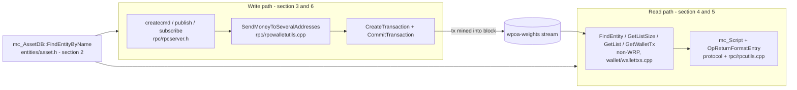

# MultiChain Internals Used by the wPoA Weight Registry

> Reference to the MultiChain host-codebase symbols this module depends on, with exact
> `file:line` pointers so you can navigate and modify with confidence. Line numbers
> are accurate as of this branch; if the tree moves, `grep` the symbol name.

Read [phase1-implementation-guide.md](phase1-implementation-guide.md) first for the design;
this document is the "where does this come from in MultiChain?" companion. See the
[entry point](../README.md) for the feature overview.

---

## Where these APIs sit in the two data paths

The module touches the host codebase along exactly two paths — a **write** path that
reuses RPC handlers, and a **read** path that goes straight to the wallet-tx store.
Each box below is detailed in the numbered section that follows.



---

## 1. Global objects & how includes reach them

`stream_weight_registry.cpp` includes `rpc/rpcwallet.h`, which transitively pulls the
rest. Key globals:

| Symbol | Declared in | What it is |
|--------|-------------|-----------|
| `mc_State* mc_gState` | `chainparams/state.h` | Root of runtime state. `mc_gState->m_Assets` is the entity DB (streams/assets); `mc_gState->m_Permissions` the permission DB. |
| `CWallet* pwalletMain` | `core/init.h:39` | The wallet (keys, address book, coins, signing). |
| `mc_WalletTxs* pwalletTxsMain` | `core/init.h:40` | The wallet transaction / stream-item store and its indexes. **This is what we read streams from.** |
| `CChain chainActive` | `core/main.h:589` | The active chain. `chainActive.Height()` (`chain/chain.h:431`), `chainActive.Tip()` (`chain/chain.h:400`). |

`multichain/multichain.h` is the umbrella header that brings in `utils/define.h`,
`utils/declare.h` (`mc_Buffer`), `protocol/multichainscript.h` (`mc_Script`),
`permissions/permission.h` (`MC_PTP_*`), `entities/asset.h` (`mc_EntityDetails`,
`mc_AssetDB`, `MC_ENT_TYPE_*`, `MC_AST_SHORT_TXID_*`) and `chainparams/state.h`.

---

## 2. Streams are entities (`mc_AssetDB` / `mc_EntityDetails`)

A "stream" is an entity in the asset DB. We look one up by name:

- `int mc_AssetDB::FindEntityByName(mc_EntityDetails* entity, const char* name)`
  — `entities/asset.h:384`. Returns **1** if found (fills `*entity`), 0 otherwise.
  (Sibling: `FindEntityByTxID` at `asset.h:381`.)
- `mc_EntityDetails` — `entities/asset.h:230`. Methods we use:
  - `uint32_t GetEntityType()` → compare to `MC_ENT_TYPE_STREAM` (`asset.h:61` = `0x02`).
  - `const unsigned char* GetTxID()` → the entity's creation txid.

**Short-txid.** Everywhere a stream is referenced inside scripts and wallet indexes,
MultiChain uses a 16-byte "short txid" = `GetTxID() + MC_AST_SHORT_TXID_OFFSET`
(`asset.h:14` = 16), of length `MC_AST_SHORT_TXID_SIZE` (`asset.h:15` = 16). We copy
those 16 bytes into the entity id when building an `mc_TxEntityStat` (see §4) and
compare them when decoding a script (see §5).

---

## 3. Writing to a stream = a transaction

We do **not** call these low-level pieces directly (we reuse the RPC handlers, §6),
but you need to understand them to modify write behaviour.

- **`publish` item RPC:** `Value publishfrom(...)` — `rpc/rpcstreams.cpp:927`.
  It resolves the stream entity, parses the data, builds a `CScript scriptOpReturn`
  of the form `<entity> OP_DROP <key> OP_DROP ... OP_RETURN <data>`
  (`rpcstreams.cpp:1080–1145`), then calls
  `SendMoneyToSeveralAddresses(...)` (`rpcstreams.cpp:1152`).
  The public wrapper `Value publish(...)` (`rpcstreams.cpp:676`) prepends the
  from-address `"*"` and calls `publishfrom`.
- **`create` stream RPC:** `Value createstreamfromcmd(...)` — `rpc/rpcstreams.cpp:331`;
  public wrapper `Value createcmd(...)` (`rpcstreams.cpp:660`) prepends `"*"`.
  Also a transaction; needs the `create` permission.
- **The actual send helper:**
  `void SendMoneyToSeveralAddresses(const std::vector<CTxDestination> addresses,
  CAmount nValue, CWalletTx& wtxNew, mc_Script* dropscript, CScript scriptOpReturn,
  const std::vector<CTxDestination>& fromaddresses)` — declared `rpc/rpcwallet.h:47`,
  implemented in `rpc/rpcwalletutils.cpp`. Internally: `CreateTransaction` →
  filter validation → `CommitTransaction`.

**Implication:** anything published is only visible after its tx is **mined**.

---

## 4. Reading a stream = the wallet-tx store (`mc_WalletTxs`, non-WRP API)

Streams you are subscribed to are indexed in `pwalletTxsMain`. There are **two**
families of read methods on `mc_WalletTxs` (`wallet/wallettxs.cpp`), and choosing
the wrong one silently returns **zero items**. This bit us — see the box below.

- **Non-WRP** — `FindEntity`, `GetListSize`, `GetList`, `GetWalletTx`. These take
  the wallet-txs DB lock internally (`Lock(0,0)`) and read the **live** list
  position (`m_LastPos` / `m_LastClearedPos`). Correct from **any** thread. **This
  is what `ReadAllRecords` uses.**
- **WRP** ("wallet read parallel") — `WRPFindEntity`, `WRPGetListSize`,
  `WRPGetList`, `WRPGetWalletTx`. An optimization for the RPC layer: when the read
  feature is active (`WRPUsed()==1`, the default) they return positions from a
  **read snapshot** (`m_ReadLastPos`) that is only advanced by the writer side via
  `WRPSync()` (on `CommitTransaction` / mempool changes / import completion — **not**
  on plain block connect) **and** only observed correctly by a caller inside the RPC
  read-lock protocol (`WRPReadLock()` on an RPC-worker thread with a slot).

> **Pitfall (real bug we hit).** A self-contained reader (a background thread, or
> an RPC handler that does not itself call `WRPReadLock()`) that uses the WRP methods
> sees a **stale snapshot stuck at 0** — `WRPGetListSize` returns `m_ReadLastPos`
> which is never advanced for that caller, so every read reports "0 items" *forever*,
> even long after the item's block is connected. Use the **non-WRP** methods off the
> RPC read path.

Read recipe (as in `ReadAllRecords`):

1. Build an `mc_TxEntityStat` for the stream:
   ```cpp
   mc_TxEntityStat entStat;
   entStat.Zero();
   memcpy(&entStat, entity.GetTxID() + MC_AST_SHORT_TXID_OFFSET, MC_AST_SHORT_TXID_SIZE);
   entStat.m_Entity.m_EntityType = MC_TET_STREAM | MC_TET_CHAINPOS;
   ```
   `MC_TET_STREAM` (`wallet/wallettxdb.h:28` = `0x5`), `MC_TET_CHAINPOS`
   (`wallettxdb.h:65` = `0x100`) selects the chain-order index. (Use
   `MC_TET_TIMERECEIVED` = `0x200` for local receive order instead.)
2. `bool FindEntity(mc_TxEntityStat*)` — false ⇒ not subscribed. Also fills
   `entStat.m_Generation`. It does not lock internally, so wrap it in
   `mc_WalletTxs::Lock()` / `UnLock()`.
3. `int GetListSize(mc_TxEntity*, int generation, int* confirmed)` — **return value**
   is the total item count (confirmed **+** mempool = `m_LastPos`); the `confirmed`
   out-param is the confirmed count (`m_LastClearedPos`). A consensus-relevant
   registry must read **confirmed only** — pass `&confirmed` and use it, because
   mempool contents differ per node.
4. `int GetList(mc_TxEntity*, int generation, int from, int count, mc_Buffer* out)`
   — fills `out` with `mc_TxEntityRow` records. `from=1` = oldest; `from` non-positive
   counts from the end. Ascending order. Returns `MC_ERR_NOERROR` on success. Reading
   `from=1, count=confirmed` yields exactly the confirmed prefix.
5. Per row: `mc_TxEntityRow* er = (mc_TxEntityRow*)buf.GetRow(i);` skip rows with
   `er->m_Flags & MC_TFL_IS_EXTENSION` (chunked off-chain items), copy `er->m_TxId`
   (32 bytes, `MC_TDB_TXID_SIZE` = `wallettxdb.h:10`) into a `uint256`, then
   `CWalletTx GetWalletTx(uint256, mc_TxDefRow*, int* errOut)`.

Supporting structs (all in `wallet/wallettxdb.h`):
- `mc_TxEntity { unsigned char m_EntityID[20]; uint32_t m_EntityType; }`
- `mc_TxEntityStat` — adds `m_Generation`, etc.
- `mc_TxEntityRow` — has `m_TxId`, `m_Pos`, `m_Block`, `m_Flags`, ...
- `mc_TxDefRow` — tx metadata (block, size, ...).

Buffer: `mc_Buffer` (`utils/declare.h`), initialised with
`Initialize(MC_TDB_ENTITY_KEY_SIZE /*=32, wallettxdb.h:11*/, sizeof(mc_TxEntityRow), MC_BUF_MODE_DEFAULT)`;
iterate with `GetCount()` / `GetRow(i)`.

The **built-in** RPC equivalent, for reference, is `Value liststreamitems(...)`
(`rpc/rpcstreams.cpp:1632`) — same pattern but with the **WRP** methods, wrapped in
an explicit `WRPReadLock()` and using slot buffers. That works because it runs on an
RPC-worker thread inside the read-lock protocol; our off-thread reader cannot, hence
the non-WRP methods.

---

## 5. Decoding an item's data (`mc_Script` + `OpReturnFormatEntry`)

Given a `CWalletTx`, find the OP_RETURN output for our stream and pull the payload.
This mirrors the host's `Object StreamItemEntry(...)`
(`rpc/rpcwalletutils.cpp:713`), but we use a **local** `mc_Script` (no shared
buffers, no RPC slot).

`mc_Script` API (`protocol/multichainscript.h`):
- `int SetScript(const unsigned char* src, size_t bytes, int type)` with
  `type = MC_SCR_TYPE_SCRIPTPUBKEY` (`multichainscript.h:9`).
- `int IsOpReturnScript()`, `int GetNumElements()`, `int SetElement(int)`.
- `int GetEntity(unsigned char* short_txid)` — returns 0 and fills the 16-byte
  short-txid when element 0 is an entity ref.
- `int ExtractAndDeleteDataFormat(uint32_t* format, unsigned char** hashes,
  int* chunk_count, int64_t* total_size)` — strips the format meta element so the
  **last** element is the payload; yields the data `format`.
- `const unsigned char* GetData(int element, size_t* bytes)`.

Element layout after `ExtractAndDeleteDataFormat`: `[0]=entity`, `[1..n-2]=item keys`,
`[n-1]=data`.

Turn the raw data into JSON — **mind the overload** (this caused bug #2):

`OpReturnFormatEntry` has three overloads (`rpc/rpcutils.cpp`), and they return
**different shapes**:
- **6/7-arg** (`…, string* format_text_out [, uint32_t status]`, `rpcutils.cpp:1849`
  / `1759`): returns the **raw** value — `{"json": <value>}` for
  `MC_SCR_DATA_FORMAT_UBJSON`, `{"text": ...}` for UTF8. This is what
  `StreamItemEntry` / `liststreamitems` use.
- **5-arg** (`…, uint32_t format`, `rpcutils.cpp:1854`): **wraps** the above as
  `{"format":"json","formatdata":{"json": <value>}}`.

`mc_ParseWeightRecordJson` needs the inner `{"json": {...}}`. `DecodeWeightRecord`
therefore calls the **6-arg** overload:
```cpp
string format_text;
Value v = OpReturnFormatEntry(data, data_size, wtx.GetHash(), j, format, &format_text);
```
Calling the 5-arg overload instead returns the wrapped shape and every decode
silently fails (empty address ⇒ record dropped). As defense-in-depth,
`mc_ParseWeightRecordJson` also unwraps a `"formatdata"` layer if present.
`OpReturnFormatEntry` uses `GetRPCSlot()` only in debug-log lines, so it is safe off
an RPC thread. (For UBJSON to be parsed rather than returned as a placeholder, the
data must be small — `elem_size <= mc_MaxOpReturnShown()` — which our tiny records
always are.)

---

## 6. Reusing RPC handlers in-process (writes)

The handlers are declared in `rpc/rpcserver.h` and callable directly:

```cpp
json_spirit::Value createcmd (const json_spirit::Array&, bool fHelp); // "create"
json_spirit::Value publish   (const json_spirit::Array&, bool fHelp);
json_spirit::Value subscribe (const json_spirit::Array&, bool fHelp);
```

We build a `json_spirit::Array` of params and call them with `fHelp=false`:
- create: `["stream", "wpoa-weights", true]`
- subscribe: `["wpoa-weights"]`
- publish: `["wpoa-weights", "<address-key>", {"json": {...}}]`

They throw on error — either a `json_spirit::Object` (from
`JSONRPCError(int, const std::string&)`, `rpc/rpcprotocol.h:120`) or a
`std::exception` (e.g. `runtime_error`). We catch both.

**Why these are safe off an RPC thread but the high-level read handlers are not:**
`createcmd`/`publish`/`subscribe` use the shared `mc_gState->m_TmpBuffers`
scripts, not slot-indexed buffers, and never call `GetRPCSlot()`. In contrast,
`liststreamitems`/`StreamItemEntry` call `int GetRPCSlot()` (`rpc/rpcserver.cpp:1046`),
which returns `-1` for any thread not registered as an RPC worker (it looks the
thread id up in `rpc_slots`) and then error out. That is why we do **not** call
`liststreamitems` and instead hand-roll the read from the low-level wallet API — and
why that read must use the **non-WRP** methods (§4), which work on any thread and read
live state, rather than the WRP snapshot methods `liststreamitems` relies on.

---

## 7. Permissions & node address

- Permission bits (`permissions/permission.h`): `MC_PTP_CONNECT` (`:11` = `0x1`),
  `MC_PTP_MINE` (`:18` = `0x100`), plus `MC_PTP_SEND`, `MC_PTP_RECEIVE`,
  `MC_PTP_CREATE`, `MC_PTP_WRITE`, `MC_PTP_ADMIN`.
- Node address resolution:
  `bool CWallet::GetKeyFromAddressBook(CPubKey& result, uint32_t type,
  const std::set<CTxDestination>* = NULL, std::map<uint32_t,uint256>* = NULL)`
  — `wallet/wallet.h:537`. Returns the wallet key holding permission `type`.
  It does **not** lock internally — call it under `LOCK(pwalletMain->cs_wallet)`
  (as `ResolveLocalAddress` does). Fallback: `pwalletMain->vchDefaultKey`.
- Render an address: `CBitcoinAddress(pkey.GetID()).ToString()`
  (`CBitcoinAddress` in `structs/base58.h`). The same pattern is used for the
  node's handshake address in `rpc/rpcmisc.cpp` (`getruntimeparams`) and
  `protocol/handshake.cpp`.

---

## 8. Mining (why reads lag writes)

MultiChain uses round-robin PoA among addresses with `MC_PTP_MINE`. A published
record is only visible to §4 reads after the block containing its tx is connected.
Chain parameters live in `chainparams/paramlist.h` (`target-block-time` default 15s,
`setup-first-blocks` 60, `mining-diversity` 0.3, `mining-requires-peers` true but
ignored with a single miner, `mine-empty-rounds` 10). Full explanation and timeline:
[testing.md](testing.md) §3 and §6.

---

## 9. Quick symbol index

| Need | Symbol | Location |
|------|--------|----------|
| Find stream by name | `mc_AssetDB::FindEntityByName` | `entities/asset.h:384` |
| Stream type constant | `MC_ENT_TYPE_STREAM` | `entities/asset.h:61` |
| Short-txid offset/size | `MC_AST_SHORT_TXID_OFFSET/SIZE` | `entities/asset.h:14-15` |
| Publish item | `publish` / `publishfrom` | `rpc/rpcstreams.cpp:676/927` |
| Create stream | `createcmd` / `createstreamfromcmd` | `rpc/rpcstreams.cpp:660/331` |
| Subscribe | `subscribe` | `rpc/rpcstreams.cpp:1201` |
| Send helper | `SendMoneyToSeveralAddresses` | `rpc/rpcwallet.h:47` |
| Read list (parallel) | `mc_WalletTxs::WRPGetList` | `wallet/wallettxs.cpp` |
| Find subscription | `mc_WalletTxs::WRPFindEntity` | `wallet/wallettxs.cpp` |
| Load a tx | `mc_WalletTxs::WRPGetWalletTx` | `wallet/wallettxs.cpp` |
| Decode item (ref) | `StreamItemEntry` | `rpc/rpcwalletutils.cpp:713` |
| Format data blob | `OpReturnFormatEntry` | `rpc/rpcutils.cpp:1759/1854` |
| RPC slot (the caveat) | `GetRPCSlot` | `rpc/rpcserver.cpp:1046` |
| Entity index flags | `MC_TET_STREAM`, `MC_TET_CHAINPOS` | `wallet/wallettxdb.h:28,65` |
| Node key by permission | `CWallet::GetKeyFromAddressBook` | `wallet/wallet.h:537` |
| Permission bits | `MC_PTP_MINE`, `MC_PTP_CONNECT` | `permissions/permission.h:18,11` |
| Chain height/tip | `chainActive.Height()/Tip()` | `chain/chain.h:431/400` |

---

## Related documents

- [../README.md](../README.md) — feature entry point and architecture diagram.
- [phase1-implementation-guide.md](phase1-implementation-guide.md) — the design these APIs implement.
- [stream-weight-registry.md](stream-weight-registry.md) — how the core class calls
  these APIs, line by line.
- [testing.md](testing.md) — the mining model behind "reads lag writes" (§8 above).
