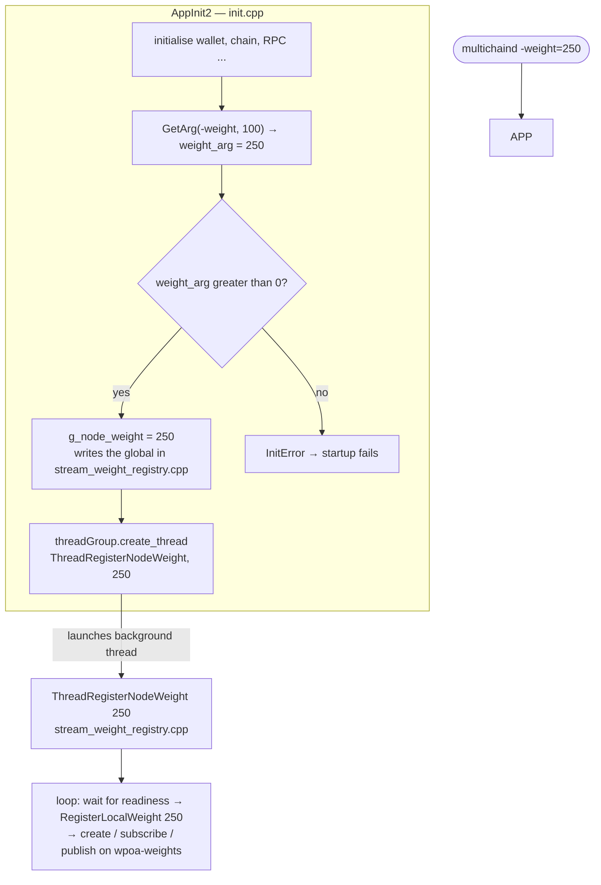

# `core/init.h` + `core/init.cpp` (wPoA parts)

> Documentation of the **node-startup integration** for wPoA weight management.
> `init.cpp` is huge (it drives the entire MultiChain node bootstrap); here we document
> **only** the parts that concern the weight registry. The rest is the standard
> MultiChain/Bitcoin startup engine.

`init.h` and `init.cpp` are documented together because they form the classic
interface/implementation pair: `init.h` declares the global symbols that the other
modules (including `stream_weight_registry.cpp`) use; `init.cpp` defines them and
contains `AppInit2`, the startup function.

## 1. What `init.h` provides to the weight subsystem

`init.h` is the header that `stream_weight_registry.cpp` includes
(`#include "core/init.h"`) to access three things:

```cpp
extern CWallet* pwalletMain;          // the main wallet
extern mc_WalletTxs* pwalletTxsMain;  // the wallet transaction DB
...
bool ShutdownRequested();             // true once shutdown has been requested
```

- `pwalletMain` — global pointer to the wallet (`CWallet`). `ResolveLocalAddress()` uses
  it to derive the validator address. `extern` = declared here, defined in the `.cpp`.
- `pwalletTxsMain` — global pointer to the wallet transaction database (`mc_WalletTxs`).
  It is the "borrowed" pointer passed to the `StreamWeightRegistry` constructor and used
  for all reads (`FindEntity`/`GetList`/`GetWalletTx`).
- `ShutdownRequested()` — used by the `ThreadRegisterNodeWeight` thread and by
  `WaitForLocalWeight` to break out of their loops when the node is shutting down.

The **forward declarations** at the top of the header:
```cpp
class CWallet;
struct mc_WalletTxs;
```
declare the types without including their heavy definitions (the same principle explained
in [stream-weight-registry.md](stream-weight-registry.md)): the header only needs to use
them as pointers.

Also note:
```cpp
bool AppInit2(boost::thread_group& threadGroup, int OutputPipe=STDOUT_FILENO);
```
This is the signature of the node's startup function. The parameter
`boost::thread_group& threadGroup` is Boost's **thread container** into which all of the
node's background threads are registered — and it is there that the weight-registration
thread will be attached.

## 2. The integration in `init.cpp`

### 2.1 The include (line 43)

```cpp
#include "wpoa/stream_weight_registry.h"
```
This brings into `init.cpp` the constant `MC_WPOA_DEFAULT_WEIGHT`, the variable
`g_node_weight` and the function `ThreadRegisterNodeWeight` — everything needed to start
registration.

### 2.2 The help text for the `-weight` parameter (line 564)

Inside `HelpMessage(...)` (the function that generates the `--help` text):

```cpp
strUsage += "  -weight=<n>                              "
    + strprintf(_("wPoA validator weight for this node, positive integer "
                  "(default: %u). Registered on the wpoa-weights stream."),
                MC_WPOA_DEFAULT_WEIGHT) + "\n";
```

- `strUsage += ...` — accumulates lines of help text.
- `_( "..." )` — the Bitcoin/MultiChain **translation** (i18n) macro: it marks the string
  as translatable.
- `strprintf(...)` — a type-safe version of `sprintf` that returns a `std::string`; `%u`
  is replaced with `MC_WPOA_DEFAULT_WEIGHT` (100).

Effect: `multichaind --help` documents the `-weight` parameter.

### 2.3 The registration block (lines 3171-3191)

This is the point where, at the end of `AppInit2`, the node configures and starts weight
registration:

```cpp
/* MCHN START - wPoA weight registry (Phase 1) */
#ifdef ENABLE_WALLET
    {
        int64_t weight_arg = GetArg("-weight", MC_WPOA_DEFAULT_WEIGHT);
        if (weight_arg <= 0)
        {
            return InitError(strprintf(_("Invalid -weight value %d: must be a positive integer."), weight_arg));
        }
        g_node_weight = (uint32_t)weight_arg;
        LogPrintf("[StreamWeightRegistry] Node weight configured: %u\n", g_node_weight);

        if (pwalletMain && pwalletTxsMain && !fDisableWallet)
        {
            threadGroup.create_thread(boost::bind(&ThreadRegisterNodeWeight, g_node_weight));
        }
    }
#endif
/* MCHN END */
```

Line-by-line analysis:

- **`#ifdef ENABLE_WALLET` … `#endif`** — a preprocessor directive: the whole block is
  compiled **only** if the wallet is enabled. The weight requires a wallet (to sign and
  pay for the create/publish transactions). Consistently, in `rpclist.cpp` the three RPCs
  are also inside `#ifdef ENABLE_WALLET`.

- **`{ ... }`** — the brace scope creates a local block so the variables (`weight_arg`)
  do not pollute the rest of `AppInit2`.

- **`GetArg("-weight", MC_WPOA_DEFAULT_WEIGHT)`** — reads the `-weight` parameter from the
  command line / config file. If absent, it uses the default 100. It returns an `int64_t`
  so it can detect negative/zero values before the cast.

- **`if (weight_arg <= 0) return InitError(...)`** — validation: the weight must be
  strictly positive. `InitError(msg)` is the standard MultiChain helper that logs the
  error, shows it to the user and fails startup (returns `false` from `AppInit2`).
  `strprintf` with `%d` inserts the invalid value into the message.

- **`g_node_weight = (uint32_t)weight_arg;`** — sets the global variable (defined in
  `stream_weight_registry.cpp`, declared `extern` in its header). From this moment the
  rest of the system knows the configured weight. The cast is safe because
  `weight_arg > 0` is already guaranteed.

- **`LogPrintf(...)`** — logs the configured weight to `debug.log`.

- **`if (pwalletMain && pwalletTxsMain && !fDisableWallet)`** — launches the thread only
  if the wallet is actually available and not disabled at runtime (`fDisableWallet`).
  Without a wallet you could not publish, so there is no point starting the thread.

- **`threadGroup.create_thread(boost::bind(&ThreadRegisterNodeWeight, g_node_weight))`**
  — the heart of the integration:
  - `boost::bind(&ThreadRegisterNodeWeight, g_node_weight)` creates a **functor** (a
    callable object) that, when invoked, runs `ThreadRegisterNodeWeight(g_node_weight)`.
    `boost::bind` "freezes" the argument `g_node_weight` into the call.
  - `threadGroup.create_thread(...)` creates a new system thread that runs that functor
    and registers it in the node's `boost::thread_group` (so it will be joined/interrupted
    cleanly at shutdown).
  - **Why a separate thread?** The comment explains it: registration is a *transaction*,
    so it can only happen once the wallet, permissions, stream and network connectivity
    are ready. Running it inline would block node startup. By delegating it to a
    background thread, `AppInit2` returns immediately and the thread retries until the
    conditions are met (cf. `NodeReadyForWeightRegistration` in
    [stream-weight-registry.md](stream-weight-registry.md)).

- **`/* MCHN START */ ... /* MCHN END */`** — marker comments used throughout the
  MultiChain codebase to delimit MultiChain additions from the original Bitcoin code.

## 3. The complete startup flow



## 4. Links to the other files

- **`init.h` → `stream_weight_registry.cpp`**: provides `pwalletMain`, `pwalletTxsMain`,
  `ShutdownRequested()` used by the registry.
- **`stream_weight_registry.h` → `init.cpp`**: provides `MC_WPOA_DEFAULT_WEIGHT`,
  `g_node_weight` and `ThreadRegisterNodeWeight` used in the startup block.
- **`init.cpp`** is the **only** place that launches the thread and sets `g_node_weight`;
  it is the bridge between the user's configuration (`-weight`) and the weight subsystem.
- The read RPCs (in `rpclist.cpp`) are **independent** of this startup: they work even if
  the thread has not registered anything yet (they simply return 0 / an empty map).

---

## Related documents

- [../README.md](../README.md) — feature entry point and architecture diagram.
- [stream-weight-registry.md](stream-weight-registry.md) — the thread and class this
  startup launches.
- [rpc-registration.md](rpc-registration.md) — the (independent) RPC-command path.
- [implementation-guide.md](implementation-guide.md) §7.4 — the same integration from the
  design guide's perspective.
