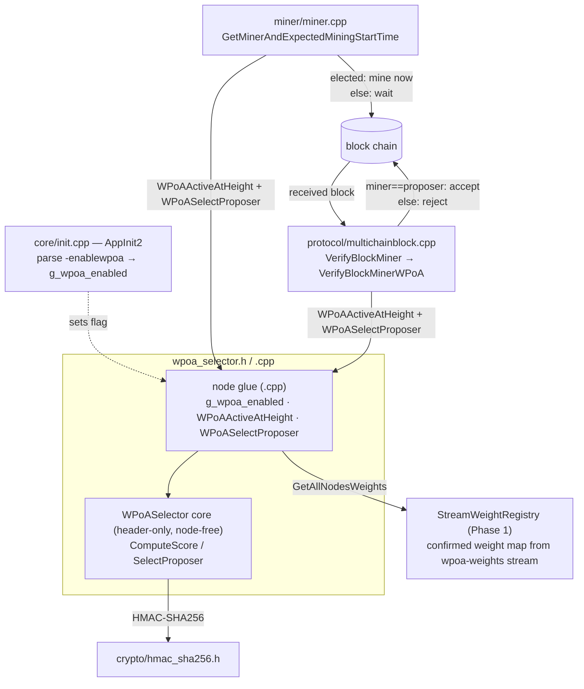
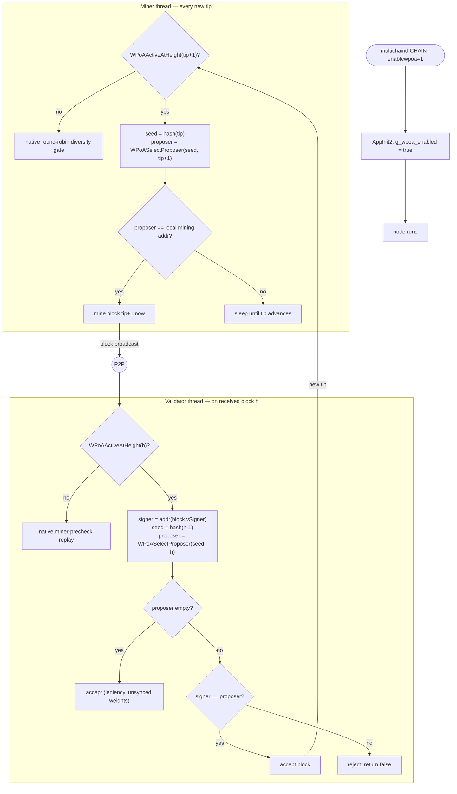

# wPoA Weighted Miner Selection — Implementation Guide (Phase 2)

This document explains **how the Phase 2 code works, why every choice was made, and
how to change it**. It is the Phase 2 sibling of
[phase1-implementation-guide.md](phase1-implementation-guide.md) and is written so you
can maintain and extend the weighted-selection module on your own.

Companion documents:
- [../README.md](../README.md) — feature entry point: introduction, architecture
  diagram, table of contents and implementation status.
- [wpoa-selector.md](wpoa-selector.md) — line-by-line walkthrough of the selector core
  (`wpoa_selector.h` + `.cpp`): scoring, argmin, activation gate, registry glue.
- [miner-integration.md](miner-integration.md) — how the election is wired into the
  miner (`miner/miner.cpp`, `GetMinerAndExpectedMiningStartTime`).
- [block-validation.md](block-validation.md) — how the election is enforced on the
  receiving side (`protocol/multichainblock.cpp`, `VerifyBlockMiner`).
- [node-startup.md](node-startup.md) — how `-weight` (Phase 1) and `-enablewpoa`
  (Phase 2) are wired into `AppInit2`.
- [multichain-internals.md](multichain-internals.md) — the MultiChain host APIs this
  module builds on, with exact `file:line` pointers.
- [thesis-project-overview.md §7.4](thesis-project-overview.md#74-probability-preservation-efraimidis-theorem)
  — the probability-preservation proof.
- [implementation-roadmap.md §6.1](implementation-roadmap.md#61-phase-2--weighted-miner-selection-public-baseline)
  / [§9](implementation-roadmap.md#9-vulnerabilities--mitigations) — phased plan and
  the accepted-risk register.
- [testing.md](testing.md) — build, unit tests, functional/distribution tests.

---

## Module structure at a glance



The per-file walkthroughs ([wpoa-selector.md](wpoa-selector.md),
[miner-integration.md](miner-integration.md),
[block-validation.md](block-validation.md), [node-startup.md](node-startup.md)) zoom
into each box; this guide walks the whole subsystem end to end.

---

## Table of contents

1. [What this module does](#1-what-this-module-does)
2. [File map](#2-file-map)
3. [Mental model: 5 facts you must hold in your head](#3-mental-model)
4. [The algorithm](#4-the-algorithm)
5. [Design decisions (the "why" of every choice)](#5-design-decisions)
6. [Threading & locking model](#6-threading--locking-model)
7. [Full code walkthrough](#7-full-code-walkthrough)
8. [End-to-end control flow](#8-end-to-end-control-flow)
9. [Error handling & edge cases](#9-error-handling--edge-cases)
10. [Build integration](#10-build-integration)
11. [How to modify — concrete recipes](#11-how-to-modify)
12. [Tests](#12-tests)
13. [Accepted properties, risks & Phase 3/4 hooks](#13-accepted-properties-risks--phase-34-hooks)

---

## 1. What this module does

Phase 2 turns the Phase 1 **weight registry** into an actual **block-production
policy**. It elects the proposer of the next block *in proportion to the on-chain
validator weights* and enforces that election on both sides of the network:

- **Miner side** (`miner/miner.cpp`): for the next height, if the locally-elected
  proposer is this node's mining address, mine immediately; otherwise wait.
- **Validator side** (`protocol/multichainblock.cpp`): recompute the election for a
  received block's height and **reject** the block if its signer is not the elected
  proposer.

Both sides run the **same** deterministic election, so from the height and the
previous block hash alone every honest node agrees on who is allowed to mine.

Nodes only ever touch one new knob:

- the startup flag `-enablewpoa` (default **off**).

Everything else (scoring, argmin, activation) is internal and hidden behind the
`WPoASelector` class and three free functions.

Phase 2 is a **public, predictable baseline** on purpose: the seed is the plain
previous block hash, so any observer can compute the next proposer a full block in
advance. This validates the *weight-registry → selector → miner/validator* wiring
before privacy is added. The privacy fix (evaluating the per-validator randomness
under a VRF secret key) is Phase 3/4 and swaps **only** the randomness source, not the
scoring/argmin logic here.

---

## 2. File map

New files (the module):

| File | Role |
|------|------|
| [`wpoa_selector.h`](../wpoa_selector.h) | Header-only pure core `WPoASelector` (`ComputeScore`, `SelectProposer`) **plus** the declarations of the node-coupled glue (`g_wpoa_enabled`, `WPoAActiveAtHeight`, `WPoASelectProposer`). Depends only on the C++ stdlib + HMAC-SHA256, so the core is unit-testable without the node. |
| [`wpoa_selector.cpp`](../wpoa_selector.cpp) | Definitions of the node-coupled glue: the runtime flag, the height activation predicate, and the registry-backed `WPoASelectProposer`. |
| [`test/wpoa_selector_tests.cpp`](../test/wpoa_selector_tests.cpp) | Boost.Test unit suite for the pure core (determinism, order-independence, degenerate cases, probability preservation). |
| [`test/run_selector_unit_tests.sh`](../test/run_selector_unit_tests.sh) | Build + run the selector unit tests (no node build needed). |
| [`test/functional_test_wpoa_multinode.sh`](../test/functional_test_wpoa_multinode.sh) | Multi-node end-to-end distribution test. |
| [`test/analyze_distribution.py`](../test/analyze_distribution.py) | Chi-square goodness-of-fit analysis of the observed proposer distribution. |

Files **modified** in the host tree (integration points):

| File | Change |
|------|--------|
| [`../core/init.cpp`](../../core/init.cpp) | Parse `-enablewpoa` into `g_wpoa_enabled` in `AppInit2`; log enabled/disabled. |
| [`../miner/miner.cpp`](../../miner/miner.cpp) | In `GetMinerAndExpectedMiningStartTime`, add a wPoA branch that replaces the round-robin timing gate with the weighted election. |
| [`../protocol/multichainblock.cpp`](../../protocol/multichainblock.cpp) | `VerifyBlockMiner` delegates to the new `VerifyBlockMinerWPoA` for wPoA-governed heights. |
| [`../Makefile.am`](../../Makefile.am) | Compile `wpoa/wpoa_selector.cpp`; track `wpoa/wpoa_selector.h`. |

Depends on (Phase 1):

| File | Used for |
|------|----------|
| [`stream_weight_registry.h/.cpp`](../stream_weight_registry.h) | `StreamWeightRegistry::GetAllNodesWeights()` — the confirmed weight map that the election consumes. |
| [`../crypto/hmac_sha256.h`](../../crypto/hmac_sha256.h) | `CHMAC_SHA256` — the keyed hash that turns `(seed, address)` into per-node randomness. |

---

## 3. Mental model

Five facts explain almost every design decision in this module.

**Fact 1 — The election must be deterministic and identical on every node.**
It is *consensus-critical*: the miner uses it to decide whether to produce a block,
and every validator uses it to decide whether to accept that block. If two nodes
disagreed on the winner, the network would fork. So the election is a pure function of
`(seed, weight map)` with no hidden inputs (no wall-clock, no per-node state, no
iteration-order dependence).

**Fact 2 — The seed is the previous block hash, and that is public.**
`seed = hash(block h−1)`. It is fresh every block and uniquely encodes the height on a
linear chain, so no separate height term is folded in. Because it is public, the next
proposer is computable one block ahead — an **accepted** Phase 2 property, fixed only
in Phase 3/4.

**Fact 3 — Weights come from Phase 1, and only *confirmed* weights count.**
The election reads `GetAllNodesWeights()`, which returns the *confirmed* on-chain
weight map (mempool excluded). Since every synced node sees the same confirmed state,
every node computes the same election.

**Fact 4 — Miner and validator must agree on *when* wPoA applies, from the height
alone.** `WPoAActiveAtHeight(h)` is a pure function of the flag + chain params +
height. The miner asks it about `tip+1` (the height it is about to mine); the validator
asks it about the received block's height. Because the predicate depends only on data
both sides share, they always agree on which rule governs a given block.

**Fact 5 — The scoring core is pure; only the glue touches the node.**
`WPoASelector::ComputeScore`/`SelectProposer` depend on nothing but the C++ stdlib and
HMAC-SHA256. The node coupling (reading the registry, the flag, the height gate) lives
in three free functions in the `.cpp`. This lets the consensus-critical math be
unit-tested in isolation (200 000-seed probability tests) without a running node.

The consequences:
- **Election = `argmin` of an independent per-node score**, not a walk over an ordered
  list, so it cannot depend on container iteration order (Fact 1).
- **Off by default** (`-enablewpoa` unset) → zero behavioral change; the node keeps its
  native round-robin mining-diversity gate.
- **Static weights in Phase 2** → validation may recompute the election from the
  *current* confirmed map rather than a historical snapshot.

---

## 4. The algorithm

The **Efraimidis–Spirakis** weighted-sampling transform. For each validator with
address `addr_i` and weight `w_i > 0`:

### 4.1 Seed

```
seed = prev_block_hash            # the 32 raw bytes of hash(block h-1)
```

### 4.2 Per-node score (`WPoASelector::ComputeScore`)

```
digest_i = HMAC-SHA256(key = seed, msg = addr_i)          # 32 bytes
D_i      = top 64 bits of digest_i, big-endian            # uint64
u_i      = (D_i + 1) / 2^64            ∈ (0, 1]           # +1 in double ⇒ u>0 ⇒ ln finite
E_i      = -ln(u_i)                    ∈ [0, +∞)          # Exp(1)-distributed
score_i  = E_i / w_i                                       # Exp(w_i)-distributed
```

- `u_i` uses only the **top 64 bits** because an IEEE-754 `double` carries 53 mantissa
  bits — more bytes cannot change the result.
- The `+1` (added in `double`, so it never wraps the `uint64`) guarantees `u_i > 0`, so
  `-ln(u_i)` is finite. `u_i = 1` (score `0`) is a legitimate minimum, reached only when
  `D_i = 2^64 − 1`.
- A weight of `0` yields `+∞` so a zero-weight node can never win (defensive; the
  registry never stores `0`).

### 4.3 Winner (`WPoASelector::SelectProposer`)

A **total order** over validators, so a unique winner always exists:

```
i beats j  ⟺  (score_i < score_j)  OR  (score_i == score_j AND addr_i < addr_j)
proposer   = the unique validator that beats all others
```

The tie-break — lexicographically smallest address — applies only on a bit-exact
`score` collision (cryptographically negligible, but implemented for determinism). An
empty or all-zero-weight map yields `""` (no proposer).

### 4.4 Probability preservation

```
Pr[i elected] = w_i / Σ_j w_j
```

Proven in [thesis §7.4](thesis-project-overview.md#74-probability-preservation-efraimidis-theorem)
and empirically verified by the unit tests (§12.1) and the multi-node distribution test
(§12.2).

---

## 5. Design decisions

Each decision lists the choice, the rationale, and the main alternative rejected.

### 5.1 Efraimidis exponential-key form, not cumulative-range
- **Choice:** `score_i = -ln(u_i)/w_i`, winner = `argmin_i score_i`.
- **Why:** it is **order-free**. Each score is independent and the winner is a global
  argmin, so the result depends only on the `(address, weight)` set and the seed — never
  on how `GetAllNodesWeights()` happens to iterate.
- **Rejected:** the cumulative-range form (`target = seed mod ΣW`; walk validators
  accumulating weight; first to exceed `target` wins). It is distribution-equivalent but
  needs a **canonical agreed iteration order**. The registry contract calls its map
  *opaque*; relying on `std::map`'s ascending-address order would couple consensus to an
  implementation detail (a later switch to `unordered_map`/vector would silently fork).
  The argmin form has no such coupling. It is also the exact primitive Phase 4's VRF path
  reuses, and the literal object of the thesis proof.

### 5.2 Seed = previous block hash alone
- **Choice:** `seed = hash(h−1)`, with the `height` argument carried only for logging /
  Phase 4 forward-compatibility.
- **Why:** the prev-hash is fresh every block and uniquely encodes the height on a
  linear chain, so folding in `height` adds nothing. Keeping the seed minimal keeps the
  Phase 2 core identical to the value the Phase 4 VRF will consume as *input*.
- **Rejected:** `hash(h−1) ‖ "PROPOSER" ‖ height` domain separation — that belongs to
  the Phase 4 VRF input, not the Phase 2 public seed.

### 5.3 Runtime toggle `-enablewpoa`, default off
- **Choice:** a single boolean flag parsed once into `g_wpoa_enabled`.
- **Why:** wPoA changes consensus behavior; it must be opt-in so an unflagged node is
  byte-for-byte the native node. Verified by the single-node functional test (no flag →
  native round-robin path unchanged).
- **Rejected:** a chain param baked into `params.dat`. Heavier to iterate on during a
  prototype; a runtime flag is enough to gate the branch.

### 5.4 Height-based activation gate, pure function of shared data
- **Choice:** `WPoAActiveAtHeight(h)` = `g_wpoa_enabled` AND MultiChain protocol AND
  `!MCP_ANYONE_CAN_MINE` AND `h >= setupfirstblocks`.
- **Why:** Fact 4 — both sides must agree from the height alone. The setup-blocks gate
  lets the chain bootstrap with native rules (admin grants permissions, the
  `wpoa-weights` stream is created, weights are published and confirmed) and hands over
  to wPoA only once weights have had time to converge.
- **Rejected:** activating from height 0. There would be no confirmed weights yet, so
  the election would be empty/unstable during bootstrap.

### 5.5 Pure core / node glue split
- **Choice:** the math (`ComputeScore`/`SelectProposer`) is header-only and node-free;
  the node coupling (`g_wpoa_enabled`, `WPoAActiveAtHeight`, `WPoASelectProposer`) is in
  the `.cpp`.
- **Why:** the election is consensus-critical and must be tested exhaustively. Isolating
  it from the wallet/chain lets the unit test link only HMAC-SHA256 + Boost.Test and run
  200 000-seed statistical checks in milliseconds. Mirrors Phase 1's
  `weight_record.h` split.
- **Rejected:** putting everything in the `.cpp`. Then the math could only be exercised
  through a full node — slow, and it would hide statistical bugs.

### 5.6 Elected proposer mines immediately (no per-miner staggering)
- **Choice:** when elected, set the mining start time to *now*; when not elected, sleep
  (start time now + 3600 s) until the tip advances.
- **Why:** Phase 2 is deterministic — exactly one proposer per height, and the proposer
  for `h+1` is unknown until block `h` is mined and propagated (the hash-chain
  dependency serializes rounds). So there is no proposer contention to stagger, unlike
  the native diversity gate which spaces multiple eligible miners in time.
- **Rejected:** keeping the diversity spacing. It exists to avoid collisions between
  several eligible miners; under wPoA there is only one, so spacing just adds latency.

### 5.7 Empty-registry leniency on the validator side
- **Choice:** if `WPoASelectProposer` returns `""` (no local weight view, e.g. the
  stream is not yet synced), `VerifyBlockMinerWPoA` **accepts** rather than stalls.
- **Why:** honest blocks originate from the deterministic elected proposer and remain
  valid on any node that *has* synced weights, so accepting on a node that cannot yet
  compute the election does not admit an invalid proposer on a synced node. The setup
  gate (§5.4) plus the test's wait-for-convergence make this path unreachable in the
  measured sample.
- **Rejected:** rejecting on empty view — it would stall sync on a node whose weight
  stream lags the block stream.

### 5.8 Recompute from the *current* confirmed map (static-weight assumption)
- **Choice:** validation recomputes the election from the current confirmed weight map,
  not a per-height historical snapshot.
- **Why:** Phase 2 weights are static, so current == historical. Correct and far
  simpler.
- **Rejected:** snapshotting weights per height. Needed only once dynamic weight updates
  land (deferred — [roadmap §6.5](implementation-roadmap.md#65-deferred--out-of-track-items)).

### 5.9 Reuse the Phase 1 registry read verbatim
- **Choice:** `WPoASelectProposer` constructs a `StreamWeightRegistry(pwalletTxsMain)`
  and calls `GetAllNodesWeights()`.
- **Why:** that method already returns confirmed-only, order-stable, any-thread-safe
  state (the non-WRP read path, see
  [phase1 §5.3](phase1-implementation-guide.md#5-design-decisions)). No new read code,
  and identical semantics on the miner thread and the validation thread.

### 5.10 Logging under the `wpoa` category
- **Choice:** all Phase 2 tracing uses `LogPrint("wpoa", ...)`; hard failures use
  `LogPrintf`.
- **Why:** `LogPrint(category, ...)` only emits when `-debug=wpoa` (or `-debug=1`) is
  set, so tracing is free in production but available for troubleshooting. Rejections in
  the validator use `LogPrintf` so they are always visible.

---

## 6. Threading & locking model

Three execution contexts touch this code:

1. **The init thread** (`AppInit2`) — only *parses* `-enablewpoa` into `g_wpoa_enabled`.
   `g_wpoa_enabled` is written once here, before any miner/validator thread reads it, so
   it needs no lock.
2. **The miner thread** (`GetMinerAndExpectedMiningStartTime`) — calls
   `WPoAActiveAtHeight(tip+1)` and `WPoASelectProposer(hash(tip), …)` once per new tip.
3. **The block-connection / validation thread** (`VerifyBlockMiner`) — calls the same
   two functions for a received block's height.

Locking rules the code follows:

- **The election itself takes no locks.** `ComputeScore`/`SelectProposer` are pure
  functions over their arguments.
- **The registry read self-locks.** `WPoASelectProposer` → `GetAllNodesWeights()` →
  `ReadAllRecords` uses the non-WRP wallet API, which locks the wallet-txs DB internally
  (`Lock(0,0)`), so it is safe from both the miner thread and the validation thread with
  no external lock (see [phase1 §6](phase1-implementation-guide.md#6-threading--locking-model)).
- **Callers already hold their own locks.** The miner and validator sites read
  `pindexTip`/`pindexNew` under the locks their surrounding code already holds; the wPoA
  branch does not add or drop any chain lock.
- **No shared mutable state.** Nothing in the selector is written after startup, so
  concurrent elections on different threads never race.

---

## 7. Full code walkthrough

This section summarizes each site; the per-file docs
([wpoa-selector.md](wpoa-selector.md), [miner-integration.md](miner-integration.md),
[block-validation.md](block-validation.md), [node-startup.md](node-startup.md)) give the
exhaustive line-by-line treatment.

### 7.1 `wpoa_selector.h` — the pure core

- Includes `<cmath>` (`std::log`), `<limits>` (`std::numeric_limits<double>::infinity`),
  `<map>`, `<string>`, `<stdint.h>`, and `crypto/hmac_sha256.h` (`CHMAC_SHA256`).
- `WPoASelector::ComputeScore(seed, seed_len, address, weight)` — implements §4.2:
  guards `weight==0` → `+inf`; computes `HMAC-SHA256(seed, address)`; folds the top 8
  bytes big-endian into a `uint64_t`; normalizes to `(0,1]`; returns `-log(u)/weight`.
- `WPoASelector::SelectProposer(seed, seed_len, weights)` — implements §4.3: iterates the
  map, skips zero weights, and keeps the running argmin with the lexicographic
  tie-break, written so the outcome is iteration-order independent.
- At the bottom it **declares** the node glue (`extern bool g_wpoa_enabled;`,
  `WPoAActiveAtHeight`, `WPoASelectProposer`) defined in the `.cpp`.

### 7.2 `wpoa_selector.cpp` — the node glue

- `bool g_wpoa_enabled = false;` — the definition of the runtime flag (default off).
- `WPoAActiveAtHeight(height)` — implements §5.4: the four-part predicate over
  `g_wpoa_enabled`, `IsProtocolMultichain()`, `MCP_ANYONE_CAN_MINE`, and
  `GetInt64Param("setupfirstblocks")`.
- `WPoASelectProposer(seed, seed_len, height)` — implements §5.9: `pwalletTxsMain` null
  check → build a `StreamWeightRegistry` → `GetAllNodesWeights()` →
  `WPoASelector::SelectProposer` → `LogPrint("wpoa", …)` under `fDebug`.

### 7.3 `../miner/miner.cpp` integration

Inside `GetMinerAndExpectedMiningStartTime`, a `/* MCHN START - wPoA Phase 2 */` branch
runs when `WPoAActiveAtHeight(pindexTip->nHeight + 1)`:

```cpp
if(WPoAActiveAtHeight(pindexTip->nHeight + 1))
{
    pwallet->GetKeyFromAddressBook(kThisMiner,MC_PTP_MINE);
    *lpkMiner=kThisMiner;
    int nWPoAHeight=pindexTip->nHeight+1;
    if(!kThisMiner.IsValid()) { *lpdMiningStartTime=mc_TimeNowAsDouble()+3600; ... return ...; }

    std::string sLocalAddr=CBitcoinAddress(kThisMiner.GetID()).ToString();
    uint256 hWPoASeed=pindexTip->GetBlockHash();
    std::string sProposer=WPoASelectProposer(hWPoASeed.begin(),hWPoASeed.size(),nWPoAHeight);

    if(!sProposer.empty() && sProposer==sLocalAddr)
        *lpdMiningStartTime=mc_TimeNowAsDouble();          // elected: mine now
    else
        *lpdMiningStartTime=mc_TimeNowAsDouble()+3600;     // not our slot: wait
    return *lpdMiningStartTime;
}
```

It resolves the local mining key, seeds from the current tip hash, elects, and sets the
mining start time to *now* iff this node is the proposer, otherwise far in the future so
the miner idles until the tip changes. See [miner-integration.md](miner-integration.md).

### 7.4 `../protocol/multichainblock.cpp` integration

`VerifyBlockMiner` gains an early delegation:

```cpp
if(WPoAActiveAtHeight(pindexNew->nHeight))
    return VerifyBlockMinerWPoA(block_in,pindexNew);
```

`VerifyBlockMinerWPoA` recovers the signer address from `pblock->vSigner`, recomputes
the proposer from `seed = hash(pindexNew->pprev)`, and:
- accepts (leniently) if the block data is unavailable or the weight view is empty;
- **rejects** (`return false`) if the block has no signer, an invalid signer pubkey, or
  `sMinerAddr != sProposer`;
- otherwise sets `fPassedMinerPrecheck=true` and accepts.
See [block-validation.md](block-validation.md).

### 7.5 `../core/init.cpp` integration

Inside `AppInit2`, next to the Phase 1 `-weight` handling:

```cpp
g_wpoa_enabled = GetBoolArg("-enablewpoa", false);
LogPrintf("[wPoA] Weighted proposer selection %s\n",
          g_wpoa_enabled ? "ENABLED (-enablewpoa=1)" : "disabled (native mining-diversity)");
```

See [node-startup.md](node-startup.md) §Phase 2.

### 7.6 `../Makefile.am`

- `wpoa/wpoa_selector.cpp` added to `libbitcoin_wallet_a_SOURCES`.
- `wpoa/wpoa_selector.h` added to `BITCOIN_CORE_H`.
- Regenerate after editing: `./autogen.sh && ./configure && make`.

---

## 8. End-to-end control flow



The hash-chain dependency is the crux: the proposer for `h+1` cannot be computed until
block `h` exists, so rounds are serialized and there is never proposer contention.

---

## 9. Error handling & edge cases

| Situation | Where handled | Behaviour |
|-----------|---------------|-----------|
| `-enablewpoa` unset | `WPoAActiveAtHeight` | returns false → native round-robin path, zero change. |
| Not MultiChain protocol / anyone-can-mine | `WPoAActiveAtHeight` | returns false → native path. |
| Height `< setupfirstblocks` | `WPoAActiveAtHeight` | returns false → native bootstrap. |
| `mc_gState`/`m_NetworkParams` null | `WPoAActiveAtHeight` | returns false (defensive). |
| Wallet/tx store absent | `WPoASelectProposer` | returns `""` (no proposer). |
| Empty / all-zero weight map | `SelectProposer` | returns `""`. |
| Zero-weight validator | `ComputeScore` / `SelectProposer` | score `+inf` / skipped — can never win. |
| No local mining key (miner) | miner branch | sleeps (start time +3600 s), waits for tip. |
| Not the elected proposer (miner) | miner branch | sleeps, waits for tip. |
| Block has no signer | `VerifyBlockMinerWPoA` | **reject**. |
| Invalid signer pubkey | `VerifyBlockMinerWPoA` | **reject**. |
| Signer ≠ elected proposer | `VerifyBlockMinerWPoA` | **reject**. |
| Block data unavailable locally | `VerifyBlockMinerWPoA` | accept (mirror native "not found" leniency). |
| Empty weight view on validator | `VerifyBlockMinerWPoA` | accept (leniency, §5.7). |
| Exact score tie | `SelectProposer` | lexicographically smallest address wins. |
| Two nodes' lowest scores within ~1 ulp | float determinism | negligible; covered by tie-break for the exact case (§13). |

---

## 10. Build integration

- The module compiles into `libbitcoin_wallet` (it references the Phase 1 registry and
  wallet symbols). `miner.cpp`/`multichainblock.cpp`/`init.cpp` (other libs) reference
  `WPoAActiveAtHeight`/`WPoASelectProposer`/`g_wpoa_enabled`; the final binary links both
  libs, so they resolve.
- The pure core (`wpoa_selector.h`) links against only `crypto/hmac_sha256` + `sha256`
  for the unit test — no wallet, no node.
- Regenerate after the `Makefile.am` change: `./autogen.sh && ./configure && make`.
- **Verification done:** the selector unit tests pass (determinism, order-independence,
  probability preservation); the multi-node distribution test passes the chi-square gate
  (§12); with `-enablewpoa` unset the single-node functional test confirms the native
  path is unchanged.

---

## 11. How to modify

### 11.1 Change when wPoA engages
Edit `WPoAActiveAtHeight` in [`wpoa_selector.cpp`](../wpoa_selector.cpp) — e.g. gate on a
different chain param, or add a hard minimum height. Keep it a **pure function of data
both the miner and validator share**, or they will disagree and fork.

### 11.2 Change the seed derivation
Edit the seed construction at the two call sites
([miner-integration.md](miner-integration.md) and
[block-validation.md](block-validation.md)) — currently `hash(h−1)`. **Both** sites must
change identically. This is the exact hook Phase 3/4 uses to swap in the VRF output.

### 11.3 Change the tie-break or scoring
Edit `WPoASelector::ComputeScore`/`SelectProposer` in
[`wpoa_selector.h`](../wpoa_selector.h) and add a unit test in
[`test/wpoa_selector_tests.cpp`](../test/wpoa_selector_tests.cpp). Because the core is
node-free, you can validate distribution changes without a node.

### 11.4 Add a `-enablewpoa` help line
Add a `strUsage += "  -enablewpoa ..."` line in `HelpMessage` in
[`../core/init.cpp`](../../core/init.cpp), mirroring the `-weight` line (Phase 1). The
flag is already parsed; this only documents it in `--help`.

### 11.5 Harden floating-point determinism
Replace the `double` `-ln`/division in `ComputeScore` with a fixed-point or
integer-comparison formulation (compare `−ln(u_i)·w_j` vs `−ln(u_j)·w_i` via a
deterministic integer routine). Not required for the prototype (§13) but removes the
cross-`libm` assumption.

---

## 12. Tests

### 12.1 Unit tests (node-free, pure math)

[test/wpoa_selector_tests.cpp](../test/wpoa_selector_tests.cpp), run with
[test/run_selector_unit_tests.sh](../test/run_selector_unit_tests.sh). Links only
HMAC-SHA256/SHA256 + Boost.Test. Covers: determinism, iteration-order independence,
single-validator / empty-map / zero-weight degenerate cases, weight-monotonicity, and
**probability preservation** — over 200 000 distinct seeds the empirical share of each
validator matches `w_i/Σw` (e.g. weights 1:2:3:4 → observed 0.100/0.200/0.299/0.401,
χ² = 2.5 on df = 3).

### 12.2 Multi-node functional test (chi-square distribution)

[test/functional_test_wpoa_multinode.sh](../test/functional_test_wpoa_multinode.sh) +
[test/analyze_distribution.py](../test/analyze_distribution.py). Bootstraps N
permissioned nodes with distinct weights and `-enablewpoa=1`, waits until every node has
the full weight map confirmed (so the whole sample is elected from an identical,
converged weight map), mines `DIST_BLOCKS` wPoA-governed blocks (default 1000; ~200 for
fast validation), then tallies per-node proposer counts (via `listblocks`) against the
weight ratios. It also asserts all nodes agree on the chain (no fork) at the end.

**Pass gate: chi-square goodness-of-fit** at α = 0.001 (df = k − 1). This is robust to
sampling noise; a broken selector produces a χ² orders of magnitude above the critical
value. The per-validator ±5% deviation is printed as an **advisory** bound only — over a
finite sample a high-share validator can deviate by ±5% purely by chance (for a 0.5 share
over 1000 blocks one standard deviation is already ~1.6%), which would make a hard ±5%
gate flaky. It tightens toward zero as the sample grows.

Representative run (`WEIGHTS="100 200 300"`, 200 blocks):

```
  wPoA Phase 2 — observed proposer distribution vs. weight ratios
  sampled blocks: 200   validators: 3   total weight: 600
  validator                                 weight   expected   observed    obs/exp       dev
  ------------------------------------------------------------------------------------------
  1ZoWYu5C5FvEUMJAbBkoB2PRyw2uiR1XjTtT9W       300     50.00%     48.00%      0.960    -2.00%
  16dfR1HekmPuKYdNHgQjqKaA3EEXVMTCzd2QgT       200     33.33%     39.50%      1.185    +6.17%  <-- OUT OF ±5%
  1KRKTX2kNU7Kvv92tfgded1KQWuJuDuCgqNc5C       100     16.67%     12.50%      0.750    -4.17%
  ------------------------------------------------------------------------------------------
  chi-square = 4.525   (df = 2)
  chi-square critical values:  α=0.05 -> 5.94   α=0.01 -> 9.22   α=0.001 -> 14.13

  chi-square goodness-of-fit (α=0.001): PASS  [PASS GATE]
  per-validator ±5% deviation:        some exceed (sampling noise)  [advisory]
  RESULT: PASS — proposer distribution matches weight ratios (chi-square).
```

The observed shares track the 1:2:3 weight ratio closely (χ² = 4.525 on df = 2, well
under even the α = 0.05 critical value of 5.94). One validator's +6.17% exceeds the
advisory ±5% purely as sampling noise at 200 blocks; the chi-square gate is the sound
criterion and the deviations tighten toward zero as the sample grows.

**On sample size and wall-clock.** `DIST_BLOCKS` defaults to 1000, but MultiChain paces
block timestamps ~`target-block-time` seconds apart (2 s in this harness) regardless of
how fast a proposer *could* mine, so accruing N wPoA-governed blocks takes ≈ `2·N`
seconds. A full 1000-block run needs `DIST_TIMEOUT` raised (≈ 2400 s); the 200-block run
(≈ 500 s) already demonstrates weight-proportional selection with a passing chi-square
and is the quick default for CI-style validation.

Run it:

```
# ~1000-block run (raise the accrual timeout to match ~2 s/block pacing)
NODES=3 WEIGHTS="100 200 300" DIST_BLOCKS=1000 DIST_TIMEOUT=2400 \
    ./src/wpoa/test/functional_test_wpoa_multinode.sh

# fast validation: 200-block distribution test (the run shown above)
NODES=3 WEIGHTS="100 200 300" DIST_BLOCKS=200 SETUP_BLOCKS=30 DIST_TIMEOUT=500 \
    ./src/wpoa/test/functional_test_wpoa_multinode.sh

# legacy mode: aggregate-weight check only (no wPoA / no distribution)
ENABLEWPOA=0 DIST_BLOCKS=0 ./src/wpoa/test/functional_test_wpoa_multinode.sh
```

---

## 13. Accepted properties, risks & Phase 3/4 hooks

- **Leader predictability (accepted, by design).** The proposer is public one block
  ahead. Not mitigated here — Phase 4's job (VRF private evaluation). The seed is the
  single hook: Phase 4 replaces `hash(h−1)` at both call sites with a per-validator VRF
  output while leaving scoring/argmin/tie-break untouched (§11.2).
- **Floating-point determinism (Phase-2-relevant consensus concern).** `-ln` and the
  division are `double` operations. Two nodes disagree on the argmin only if the two
  lowest scores fall within ~1 ulp (~2⁻⁵²) of each other — cryptographically negligible
  (same order as an exact tie) and covered by the deterministic tie-break for the exact
  case. It holds *exactly* when all nodes run the same binary/libm. Hardening to a
  fixed-point `ln` is noted for later (§11.5); not required for the prototype.
- **Static-weight assumption.** Validation recomputes from the *current* confirmed weight
  map, not a per-height snapshot. Correct for Phase 2 because weights are static; dynamic
  weights/updates are deferred
  ([roadmap §6.5](implementation-roadmap.md#65-deferred--out-of-track-items)).
- **Empty-registry leniency.** A node that cannot compute the election (empty weight
  view) accepts rather than stalls. Honest blocks come from the deterministic elected
  proposer and stay valid on any synced node, so this does not admit an invalid proposer
  on a synced node. The setup gate plus the test's wait-for-convergence make this path
  unreachable in the measured sample.
- **Setup→wPoA handover.** wPoA engages at `height >= setupfirstblocks`; all weights must
  be confirmed by then or nodes could briefly disagree on the proposer. The setup gate is
  sized with margin; the functional test additionally verifies global weight convergence
  and a fork-free tip before measuring.
- **Phase 3/4 hooks.** (1) Swap the seed for a VRF output at both call sites. (2) Add a
  proof field to the block header and verify it in `VerifyBlockMinerWPoA` before the
  `signer == proposer` check. (3) Snapshot weights per height once dynamic weights land.
