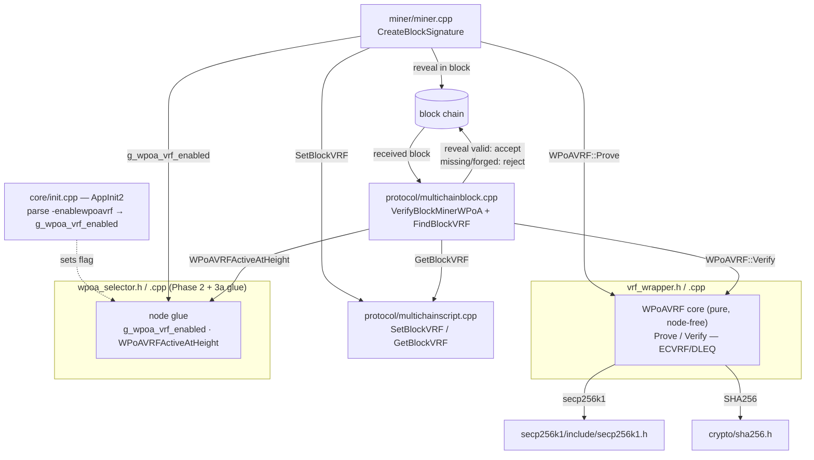
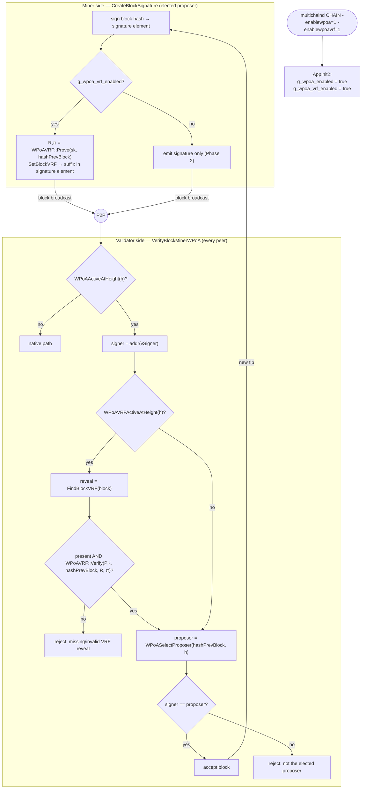

# wPoA VRF Randomness Beacon — Implementation Guide (Phase 3a)

This document explains **how the Phase 3a code works, why every choice was made, and
how to change it**. It is the Phase 3a sibling of
[phase1-implementation-guide.md](phase1-implementation-guide.md) and
[phase2-implementation-guide.md](phase2-implementation-guide.md), and is written so you
can maintain and extend the VRF beacon on your own.

Companion documents:
- [../README.md](../README.md) — feature entry point: introduction, architecture
  diagram, table of contents and implementation status.
- [implementation-guide.md](implementation-guide.md) — master phase index.
- [vrf-wrapper.md](vrf-wrapper.md) — line-by-line walkthrough of the pure VRF core
  (`vrf_wrapper.h` + `.cpp`): hash-to-curve, deterministic nonce, DLEQ prove/verify,
  point/scalar helpers over secp256k1.
- [block-vrf-encoding.md](block-vrf-encoding.md) — how the reveal is carried on-chain
  (`protocol/multichainscript.h` + `.cpp`, `SetBlockVRF`/`GetBlockVRF`).
- [vrf-prover.md](vrf-prover.md) — how the reveal is produced and embedded
  (`miner/miner.cpp`, `CreateBlockSignature`).
- [vrf-verifier.md](vrf-verifier.md) — how the reveal is extracted and enforced
  (`protocol/multichainblock.cpp`, `FindBlockVRF` + `VerifyBlockMinerWPoA`).
- [node-startup.md](node-startup.md) — how `-enablewpoavrf` is wired into `AppInit2`.
- [implementation-roadmap.md §6.2](implementation-roadmap.md#62-phase-3--randao-beacon--vrf-integration)
  — the phased plan (Phase 3 = the randomness-*generation* half; 3a = VRF, 3b = RANDAO).
- [thesis-project-overview.md §5.2–§5.3](thesis-project-overview.md#52-local-vrf-phase)
  — the formal VRF reveal model this implements; [§7.1–§7.2](thesis-project-overview.md#71-cryptographic-assumptions)
  — the cryptographic assumptions and security properties.
- [phase2-implementation-guide.md](phase2-implementation-guide.md) — the public
  selection this beacon rides on top of, unchanged.

---

## Module structure at a glance



The per-file walkthroughs ([vrf-wrapper.md](vrf-wrapper.md),
[block-vrf-encoding.md](block-vrf-encoding.md), [vrf-prover.md](vrf-prover.md),
[vrf-verifier.md](vrf-verifier.md)) zoom into each box; this guide walks the whole
subsystem end to end.

---

## Table of contents

1. [What this module does](#1-what-this-module-does)
2. [File map](#2-file-map)
3. [Mental model: 5 facts you must hold in your head](#3-mental-model)
4. [The VRF construction](#4-the-vrf-construction)
5. [On-chain carriage of the reveal](#5-on-chain-carriage-of-the-reveal)
6. [Design decisions (the "why" of every choice)](#6-design-decisions)
7. [Threading & locking model](#7-threading--locking-model)
8. [Full code walkthrough](#8-full-code-walkthrough)
9. [End-to-end control flow](#9-end-to-end-control-flow)
10. [Error handling & edge cases](#10-error-handling--edge-cases)
11. [Build integration](#11-build-integration)
12. [How to modify — concrete recipes](#12-how-to-modify)
13. [Tests](#13-tests)
14. [Accepted properties, risks & Phase 3b/4 hooks](#14-accepted-properties-risks--phase-3b4-hooks)

---

## 1. What this module does

Phase 2 elects each block's proposer in proportion to weight, over a **public** seed
(the previous block hash). Phase 3a adds the **randomness-generation half** of the wPoA
beacon (Layer 2 in [roadmap §1](implementation-roadmap.md#1-executive-summary)): the
proposer that Phase 2 elects additionally publishes a **verifiable pseudorandom reveal**
in its block, and every peer verifies it before accepting the block.

Concretely, when `-enablewpoavrf` is set, for a wPoA-governed block at height `n`:

- **Prover (miner side).** The elected proposer computes, with its own secret key,
  `R[n] = VRF_sk(h[n-1])` and a proof `π[n]`, and embeds `(R[n], π[n])` in the block.
- **Verifier (every peer).** On receipt, each node recomputes the VRF check from the
  proposer's public key and `h[n-1]`, and **rejects** the block if the reveal is absent
  or does not verify.

Because a VRF is **unique** and **unforgeable** (only the holder of `sk` can produce a
verifying `(R, π)` for a given input — [thesis §7.1](thesis-project-overview.md#71-cryptographic-assumptions)),
the reveal is an unbiased, grinding-resistant contribution bound to the proposer's
identity. Phase 3b will accumulate these reveals into a RANDAO beacon and feed the
resulting seed back into selection; Phase 4 will move the VRF *into* the selection
itself. **Phase 3a does not change selection** — selection is still the public Phase 2
election. This is the deliberate scope of 3a: build and prove out the VRF machinery
first, with the reveal produced/embedded/verified on every block, before it drives
anything.

Nodes touch one new knob:

- the startup flag `-enablewpoavrf` (default **off**; requires `-enablewpoa`).

Everything else (the VRF math, the wire encoding, the prover/verifier wiring) is
internal and hidden behind the `WPoAVRF` class, two `mc_Script` methods, and the
`WPoAVRFActiveAtHeight` gate.

---

## 2. File map

New files (the module):

| File | Role |
|------|------|
| [`vrf_wrapper.h`](../vrf_wrapper.h) | Pure, node-free `WPoAVRF` class: `Prove` / `Verify` for an ECVRF / Chaum–Pedersen DLEQ over secp256k1. Depends only on secp256k1 + SHA256, so it is unit-testable without the node. |
| [`vrf_wrapper.cpp`](../vrf_wrapper.cpp) | The ECVRF implementation: hash-to-curve, deterministic nonce, DLEQ prove/verify, point/scalar helpers over the core secp256k1 API. |
| [`test/vrf_wrapper_tests.cpp`](../test/vrf_wrapper_tests.cpp) | Boost.Test unit suite for the pure VRF core (correctness, determinism, tamper/forgery rejection, pseudorandomness sanity). |
| [`test/run_vrf_unit_tests.sh`](../test/run_vrf_unit_tests.sh) | Build + run the VRF unit tests (no node build needed; links the prebuilt `libsecp256k1.a`). |
| [`test/functional_test_wpoa_vrf.sh`](../test/functional_test_wpoa_vrf.sh) | Multi-node end-to-end test: reveals produced, verified network-wide, chain live and fork-free under mandatory verification. |

Files **modified** in the host tree (integration points):

| Site | File | Change | Detail doc |
|------|------|--------|------------|
| Startup flag | [`../../core/init.cpp`](../../core/init.cpp) | Parse `-enablewpoavrf` into `g_wpoa_vrf_enabled` in `AppInit2`; help lines for `-enablewpoa`/`-enablewpoavrf`. | [node-startup.md](node-startup.md) |
| Activation glue | [`wpoa_selector.h`](../wpoa_selector.h) / [`.cpp`](../wpoa_selector.cpp) | Declare/define `g_wpoa_vrf_enabled` and `WPoAVRFActiveAtHeight(height)` (= flag AND `WPoAActiveAtHeight`). | [wpoa-selector.md §5](wpoa-selector.md) |
| Block encoding | [`../../protocol/multichainscript.h`](../../protocol/multichainscript.h) / [`.cpp`](../../protocol/multichainscript.cpp) | `SetBlockVRF` / `GetBlockVRF`: encode/decode the reveal as a suffix of the block-signature element; relax `GetBlockSignature`'s length check to tolerate that suffix. | [block-vrf-encoding.md](block-vrf-encoding.md) |
| Prover | [`../../miner/miner.cpp`](../../miner/miner.cpp) | In `CreateBlockSignature`, when enabled, compute the VRF reveal over `hashPrevBlock` with the signer key and append it via `SetBlockVRF`. | [vrf-prover.md](vrf-prover.md) |
| Verifier | [`../../protocol/multichainblock.cpp`](../../protocol/multichainblock.cpp) | `FindBlockVRF` extracts the reveal; `VerifyBlockMinerWPoA` rejects wPoA-VRF blocks whose reveal is missing or fails `WPoAVRF::Verify`. | [vrf-verifier.md](vrf-verifier.md) |
| Build | [`../../Makefile.am`](../../Makefile.am) | Compile `wpoa/vrf_wrapper.cpp`; track `wpoa/vrf_wrapper.h`. | §11 |

Depends on:

| File | Used for |
|------|----------|
| `secp256k1/include/secp256k1.h` | The curve arithmetic (`pubkey_create/parse/serialize/tweak_mul/combine`, `seckey_verify`, `privkey_tweak_add/mul`) the VRF is built on — the same library the validator keys use. |
| [`../../crypto/sha256.h`](../../crypto/sha256.h) | `CSHA256` — the hash used for hash-to-curve, the challenge, and the output. |
| [`wpoa_selector.h`](../wpoa_selector.h) | `WPoAActiveAtHeight` — the Phase 2 height gate the VRF requirement composes with. |

---

## 3. Mental model

Five facts explain almost every design decision in this module.

**Fact 1 — The VRF is *generation*, not *consumption*.**
Phase 3a produces a verifiable random value per block but does **not** use it to pick the
proposer — selection is still the public Phase 2 election. The reveal is raw material for
later phases (Phase 3b accumulates it into a RANDAO beacon; Phase 4 moves the VRF into the
selection). Everything here is about producing, carrying, and mandatorily verifying that
reveal — nothing about *who* mines.

**Fact 2 — The VRF prover *is* the block signer.**
No separate VRF key material exists. The reveal is produced with the very same secp256k1
key that signs the block (`key` in `CreateBlockSignature`), and verified against the very
same public key recovered from `vSigner`. So "the signer", "the elected proposer" and "the
VRF prover" are one identity, checked once. This is why the VRF lives on the bundled
secp256k1 curve (Fact 5).

**Fact 3 — The VRF input is the previous block hash — the same bytes Phase 2 seeds from.**
`input = h[n-1]`. The miner has it as `block->hashPrevBlock`; the validator has it as
`pindexNew->pprev->GetBlockHash()`. Both sides therefore feed the VRF *identical* bytes
they already hold, with no height lookup and no extra state, so prover and verifier are
perfectly symmetric (§4.4).

**Fact 4 — Verification is mandatory and self-authenticating.**
On a wPoA-VRF-governed height a block with a missing or non-verifying reveal is **rejected**
network-wide. The reveal is not covered by the block *signature* (it lives in the coinbase
OP_RETURN excluded from the signed hash) but it does not need to be: the VRF proof binds it
to the signer's key and the input, and it is committed by the block hash / PoW via the full
merkle root (§5). Mandatory verification is what turns "a reveal exists" into "a *correct*
reveal exists".

**Fact 5 — The crypto core is pure; only the flag/gate touches the node.**
`WPoAVRF::Prove`/`Verify` depend on nothing but secp256k1 + SHA256 — no wallet, no chain,
no globals. The node coupling is just the boolean `g_wpoa_vrf_enabled` and the
`WPoAVRFActiveAtHeight` predicate (in the Phase 2 selector glue). This mirrors the Phase 2
pure-core/glue split and lets the consensus-critical VRF math be unit-tested in isolation
(§13.1).

The consequences:
- **Off by default** (`-enablewpoavrf` unset) → a Phase-2 or plain node is byte-for-byte
  unchanged; no reveal is produced or required (Fact 1 + the gate).
- **VRF requirement engages exactly on wPoA-governed heights** — `WPoAVRFActiveAtHeight` =
  the flag AND `WPoAActiveAtHeight`, both pure functions of shared data, so miner and every
  validator agree from the height alone (Fact 4).
- **The reveal is unforgeable and unique** — grinding for a "nicer" reveal is infeasible
  because only one `(R, π)` verifies per `(sk, input)` (Fact 2, §4).

---

## 4. The VRF construction

An **ECVRF / Chaum–Pedersen DLEQ** over secp256k1. secp256k1 has cofactor 1, so a curve
point of the hash-to-curve map has prime order and the plain equal-discrete-log proof is
a sound VRF (none of RFC 9381's cofactor-clearing steps are needed).

Let `G` be the generator, `n` the group order, `sk ∈ [1,n-1]`, `PK = sk·G`.

### 4.1 Prove (`WPoAVRF::Prove`)

```
H       = HashToCurve(input)                              # try-and-increment
Gamma   = sk · H                                           # VRF pre-output
output  = SHA256(SUITE ‖ 0x03 ‖ compressed(Gamma))         # the reveal R[n]  (32 B)
k       = HashToScalar(SUITE ‖ 0x01 ‖ sk ‖ compressed(H))  # deterministic nonce
U       = k · G
V       = k · H
c       = HashToScalar(SUITE ‖ 0x02 ‖ H ‖ PK ‖ Gamma ‖ U ‖ V)
s       = k + c · sk   (mod n)
proof   = compressed(Gamma) ‖ c ‖ s                        # π[n]  (33+32+32 = 97 B)
```

### 4.2 Verify (`WPoAVRF::Verify`)

```
parse PK, Gamma, c, s;  require c, s ∈ [1,n-1]
require output == SHA256(SUITE ‖ 0x03 ‖ compressed(Gamma))
H  = HashToCurve(input)
U' = s·G − c·PK
V' = s·H − c·Gamma
accept iff c == HashToScalar(SUITE ‖ 0x02 ‖ H ‖ PK ‖ Gamma ‖ U' ‖ V')
```

Correctness: for an honest proof `U' = s·G − c·PK = (k + c·sk)·G − c·(sk·G) = k·G = U`,
and likewise `V' = V`, so the recomputed challenge matches.

### 4.3 Primitives, and why they are safe on the bundled API

- **HashToCurve** — try-and-increment: hash `(SUITE ‖ 0x04 ‖ counter ‖ input)` to 32
  bytes, prepend the `0x02` compressed-point prefix, and parse; bump `counter` until a
  valid point is found (≈ 2 tries on average). Deterministic, so prover and verifier
  derive the same `H`.
- **HashToScalar** — hash then reject-and-retry with a counter until
  `secp256k1_ec_seckey_verify` accepts, which yields a uniform scalar in `[1,n-1]`.
  Rejection is astronomically rare (`n` is within ~`2^-128` of `2^256`).
- **Point negation** — this secp256k1 vintage has no `pubkey_negate`, so `−P` is computed
  as `(n-1)·P` via `pubkey_tweak_mul` with the constant `NEG_ONE = n-1` (since
  `n-1 ≡ -1 mod n`).
- Only the **core** secp256k1 API is used (present in MultiChain's build, which enables
  only the recovery module); no internal secp256k1 headers.

The full line-by-line implementation is in [vrf-wrapper.md](vrf-wrapper.md).

### 4.4 The public input in Phase 3a

The VRF input is `h[n-1]` — the raw previous block hash, exactly the Phase 2 selection
seed. The thesis's formal reveal input is `H(h[n-1] ‖ n)`
([thesis §5.2](thesis-project-overview.md#52-local-vrf-phase)); the height term `n` is
omitted here for the same reason Phase 2 omits it from its seed
([phase2 §5.2](phase2-implementation-guide.md#5-design-decisions)): on a linear chain the
previous hash already uniquely identifies the round, and the VRF's own hash-to-curve
supplies the `H(·)`. Phase 3b re-introduces `n` via the RANDAO seed
`seed[n+1] = H(R_tot[n-k] ‖ h[n-1] ‖ n)`. Keeping the input equal to the Phase 2 seed
also keeps the miner and validator perfectly symmetric on data they both already hold
(`hashPrevBlock` / `pindexNew->pprev` hash), with no height lookup in the signing path.

---

## 5. On-chain carriage of the reveal

The reveal is carried as a **suffix inside the single block-signature element** in the
coinbase OP_RETURN — not as its own element or output. Two MultiChain constraints force
this (see the comment block in [`multichainscript.cpp`](../../protocol/multichainscript.cpp)
and [block-vrf-encoding.md](block-vrf-encoding.md)):

1. `MultiChainTransaction_CheckOpReturnScript` rejects a coinbase OP_RETURN with more than
   one pushdata element ("Metadata script rejected"), and
2. `CreateBlockSignature` strips every extra zero-value coinbase output before re-signing,
   so a standalone VRF OP_RETURN output would not survive.

Keeping the reveal in the existing signature element keeps the element count at 1 and
rides along with data the miner already manages. Layout of the element:

```
"SPK" 'b' [sig_len][sig][hash_type][key_len][key]              ← SetBlockSignature
                                            [reveal_len][reveal][proof_len][proof]  ← SetBlockVRF suffix
```

`SetBlockVRF` appends to the *current* element (it does **not** `AddElement`) and so must
be called immediately after `SetBlockSignature`. `GetBlockVRF` re-walks the element past
`sig`/`hash`/`key` and decodes the trailing reveal; `GetBlockSignature`'s final exact-length
check was relaxed from `!=` to `<` so it tolerates the suffix (a pre-Phase-3a block with no
suffix still matches exactly).

**Commitment.** The coinbase OP_RETURN is excluded from the *signed* hash
(`MERKLETREE_NO_COINBASE_OP_RETURN`) but included in the *full* merkle root / block hash.
So the reveal is committed by PoW / the block hash (tamper-evident) even though it is not
covered by the block signature. It does not need to be signature-covered: the VRF proof
already binds the reveal to the signer's key and to `h[n-1]`, and mandatory verification
(§9) means a stripped or swapped reveal makes the block invalid.

---

## 6. Design decisions

Each decision lists the choice, the rationale, and the main alternative rejected.

### 6.1 ECVRF / DLEQ on the bundled secp256k1, not an external VRF library
- **Choice:** implement the VRF on the secp256k1 already in the tree, on the same curve as
  the validator keys.
- **Why:** no new build dependency; the reveal is bound to the *same* key that signs the
  block, so "the signer" and "the VRF prover" are one identity with no extra key
  management; and secp256k1's cofactor 1 makes the DLEQ proof a clean, sound ECVRF.
- **Rejected:** libsodium's ECVRF-EDWARDS25519 — a second curve and a new dependency for
  no security gain in this setting.

### 6.2 Selection unchanged in Phase 3a (VRF is generation, not consumption)
- **Choice:** the proposer is still elected by the public Phase 2 WRS; the VRF reveal is a
  verifiable *contribution*, produced by whoever was elected.
- **Why:** this is the layered plan — Phase 3 is the randomness-*generation* half
  ([roadmap §1](implementation-roadmap.md#1-executive-summary)); moving the VRF into the
  election (private sortition) is Phase 4. Building generation first yields a standalone,
  testable, mergeable increment and de-risks the crypto before it drives consensus.
- **Rejected:** pulling private VRF-scored selection forward — that is Phase 4 and needs
  the gossip/reveal window, tie-break and liveness fallback that 3a intentionally omits.

### 6.3 Reveal as a suffix of the signature element
- **Choice / why / rejected:** see [§5](#5-on-chain-carriage-of-the-reveal) and
  [block-vrf-encoding.md](block-vrf-encoding.md). Forced by the one-element OP_RETURN rule
  and by `CreateBlockSignature` stripping extra outputs.

### 6.4 Deterministic nonce, no external randomness
- **Choice:** `k = HashToScalar(SUITE ‖ 0x01 ‖ sk ‖ compressed(H))`.
- **Why:** determinism gives reproducible reveals and removes the catastrophic nonce-reuse
  / bad-RNG failure mode; binding `k` to `sk` and the input is the standard
  RFC 6979-style construction.
- **Rejected:** a randomized nonce from the OS RNG — reintroduces the nonce-reuse footgun
  and makes the reveal non-reproducible for testing, for no benefit (the VRF output is
  already pseudorandom).

### 6.5 New flag `-enablewpoavrf`, default off, requires `-enablewpoa`
- **Choice:** a second boolean, gated on top of `-enablewpoa` via `WPoAVRFActiveAtHeight`.
- **Why:** keeps a plain node and a Phase-2 node byte-for-byte unchanged; lets the beacon
  be toggled independently of selection. Like `-enablewpoa`, it is consensus-affecting and
  **must be uniform** across the validator set — documented, matching the Phase 2 flag.
- **Rejected:** folding the VRF into `-enablewpoa` — that would force the beacon on with
  selection and remove the ability to prove the selection layer in isolation.

### 6.6 Embed height-independently; require height-gated
- **Choice:** the miner embeds a reveal whenever `g_wpoa_vrf_enabled` (no height check in
  `CreateBlockSignature`); the validator only *requires* it on wPoA-VRF-governed heights.
- **Why:** the miner does not always have the target height cheaply at hand in the signing
  path, and a stray reveal on a pre-setup block is harmless (nobody checks it there).
  Keeping the produce-side unconditional is simpler and cannot cause a false rejection.
- **Rejected:** height-gating the producer too — extra plumbing for no correctness gain.

---

## 7. Threading & locking model

Three execution contexts touch this code:

1. **The init thread** (`AppInit2`) — only *parses* `-enablewpoavrf` into
   `g_wpoa_vrf_enabled`. Written once here, before any miner/validator thread reads it, so
   it needs no lock (identical treatment to `g_wpoa_enabled`).
2. **The miner thread** (`CreateBlockSignature`) — when `g_wpoa_vrf_enabled`, calls
   `WPoAVRF::Prove` and `SetBlockVRF` once per block it signs.
3. **The block-connection / validation thread** (`VerifyBlockMinerWPoA`) — when
   `WPoAVRFActiveAtHeight`, calls `FindBlockVRF` and `WPoAVRF::Verify` for a received block.

Locking rules the code follows:

- **The VRF math takes no locks.** `Prove`/`Verify` are pure functions over their byte
  arguments. The single shared object is the process-wide `secp256k1_context` returned by
  `VRFContext()`; it is created once via a C++11 function-local `static` (thread-safe
  initialization) and thereafter used **read-only** (sign/verify contexts are immutable
  after creation), so concurrent `Prove`/`Verify` on different threads never race.
- **No shared mutable state.** `g_wpoa_vrf_enabled` is write-once-at-startup, read-only
  afterward; the domain-separation constants (`VRF_SUITE_TAG`, `NEG_ONE`, roles) are
  `const`. Nothing in the module is mutated after startup.
- **Callers already hold their own locks.** The prover runs inside the miner's block
  assembly and the verifier inside block connection; the VRF code reads only its arguments
  (the key, `hashPrevBlock`, the parsed script) and adds no chain lock.
- **The `mc_Script` scratch buffers are per-context.** `FindBlockVRF` uses
  `mc_gState->m_TmpScript1`, the same single-threaded validation-path scratch object the
  surrounding block-check code already uses; it is not shared with the miner thread.

---

## 8. Full code walkthrough

This section summarizes each site; the per-file docs give the exhaustive line-by-line
treatment.

### 8.1 `vrf_wrapper.h` / `.cpp` — the pure VRF core

- Header declares the `WPoAVRF` class: byte-length constants (`OUTPUT_SIZE = 32`,
  `GAMMA_SIZE = 33`, `SCALAR_SIZE = 32`, `PROOF_SIZE = 97`) and the four static methods
  (`Prove`/`Verify` in raw-pointer and `std::vector` flavours). Depends only on
  `<stddef.h>`, `<stdint.h>`, `<vector>`.
- The `.cpp` implements the construction of §4 over the core secp256k1 API: an anonymous
  namespace holds the suite tag, role bytes, the `NEG_ONE` constant, the context
  singleton, and the helpers `SerializePoint`, `HashToCurve`, `HashToScalar`,
  `ComputeOutput`, `ComputeChallenge`; `Prove`/`Verify` compose them.
See [vrf-wrapper.md](vrf-wrapper.md).

### 8.2 `../../protocol/multichainscript.{h,cpp}` — the wire encoding

- `SetBlockVRF(reveal, reveal_size, proof, proof_size)` appends
  `[reveal_len:1][reveal][proof_len:1][proof]` to the *current* element via `SetData`; it
  is called right after `SetBlockSignature`.
- `GetBlockVRF(...)` re-walks the block-signature element (identifier + `'b'` prefix +
  `sig` + `hash_type` + `key`) and decodes the trailing suffix, with bounds checks against
  the element end.
- `GetBlockSignature`'s final length check is relaxed from `!=` to `<` so a signature
  element carrying the suffix still parses. See [block-vrf-encoding.md](block-vrf-encoding.md).

### 8.3 `../../miner/miner.cpp` — the prover

Inside `CreateBlockSignature`, right after `SetBlockSignature`, a
`/* MCHN START - wPoA Phase 3a */` branch runs when `g_wpoa_vrf_enabled`:

```cpp
if(g_wpoa_vrf_enabled)
{
    unsigned char vrf_out[WPoAVRF::OUTPUT_SIZE];
    unsigned char vrf_proof[WPoAVRF::PROOF_SIZE];
    if(WPoAVRF::Prove(key.begin(),block->hashPrevBlock.begin(),block->hashPrevBlock.size(),
                      vrf_out,vrf_proof))
    {
        lpScript->SetBlockVRF(vrf_out,WPoAVRF::OUTPUT_SIZE,vrf_proof,WPoAVRF::PROOF_SIZE);
    }
    else
    {
        LogPrintf("wPoA-VRF: failed to produce VRF reveal for block, prev %s\n", ...);
    }
}
```

It proves over `block->hashPrevBlock` with the signer's key (`key`, the same one that just
signed), then appends the reveal to the signature element. A `Prove` failure logs and
embeds nothing — fail-safe, since the block then fails peer verification (§10). See
[vrf-prover.md](vrf-prover.md).

### 8.4 `../../protocol/multichainblock.cpp` — the verifier

- `FindBlockVRF(block, reveal, proof)` scans the coinbase outputs' script elements calling
  `GetBlockVRF`, returning the first suffix found (or false).
- `VerifyBlockMinerWPoA` gains, *before* the Phase 2 proposer check, a
  `/* MCHN START - wPoA Phase 3a */` block guarded by `WPoAVRFActiveAtHeight(pindexNew->nHeight)`:

```cpp
if(WPoAVRFActiveAtHeight(pindexNew->nHeight))
{
    std::vector<unsigned char> vrf_reveal,vrf_proof;
    if(!FindBlockVRF(pblock,vrf_reveal,vrf_proof))
        return false;   // REJECT: missing VRF reveal
    uint256 hVRFInput=pindexNew->pprev->GetBlockHash();
    std::vector<unsigned char> vVRFInput(hVRFInput.begin(),hVRFInput.end());
    if(!WPoAVRF::Verify(vchPubKey,vVRFInput,vrf_reveal,vrf_proof))
        return false;   // REJECT: invalid VRF reveal
    LogPrint("wpoa","VerifyBlockMinerWPoA: VRF reveal OK ...");
}
```

`vchPubKey` is the signer key already recovered for the Phase 2 check; the input is
`hash(pindexNew->pprev)` — the same bytes the prover used. The check runs *before* the
weight lookup, so it is enforced even on the empty-registry leniency path. See
[vrf-verifier.md](vrf-verifier.md).

### 8.5 `wpoa_selector.{h,cpp}` — the activation glue

```cpp
extern bool g_wpoa_vrf_enabled;                 // header (declaration)
bool WPoAVRFActiveAtHeight(int height);         // header (declaration)

bool g_wpoa_vrf_enabled = false;                // .cpp (definition)
bool WPoAVRFActiveAtHeight(int height)          // .cpp
{
    return g_wpoa_vrf_enabled && WPoAActiveAtHeight(height);
}
```

The predicate is deliberately the Phase 2 gate AND the flag, so the VRF requirement
engages exactly on wPoA-governed heights and both sides agree from the height alone. See
[wpoa-selector.md §5](wpoa-selector.md).

### 8.6 `../../core/init.cpp` — startup

```cpp
g_wpoa_vrf_enabled = GetBoolArg("-enablewpoavrf", false);
LogPrintf("[wPoA] VRF randomness beacon %s\n",
          g_wpoa_vrf_enabled ? "ENABLED (-enablewpoavrf=1)" : "disabled");
```

Parsed in the same `#ifdef ENABLE_WALLET` block as `-enablewpoa`, plus a `HelpMessage`
line. See [node-startup.md §2.6](node-startup.md).

### 8.7 `../../Makefile.am`

- `wpoa/vrf_wrapper.cpp` added to `libbitcoin_wallet_a_SOURCES`.
- `wpoa/vrf_wrapper.h` added to `BITCOIN_CORE_H`.
- Regenerate after editing: `./autogen.sh && ./configure && make`.

---

## 9. End-to-end control flow



The verifier requires the reveal *before* the Phase 2 proposer check and independently of
the weight registry, so it is enforced even on the empty-weight leniency path.

---

## 10. Error handling & edge cases

| Situation | Where handled | Behaviour |
|-----------|---------------|-----------|
| `-enablewpoavrf` unset | `WPoAVRFActiveAtHeight` | returns false → no reveal produced or required (Phase 2 behavior). |
| wPoA not active at height | `WPoAVRFActiveAtHeight` | returns false → reveal not required (bootstrap/native). |
| `Prove` fails (invalid key / degenerate scalar) | `CreateBlockSignature` | logs, embeds no reveal → the block fails peer verification and is not accepted (fail-safe). |
| Reveal missing on a VRF-governed block | `VerifyBlockMinerWPoA` | **reject**. |
| Reveal present but does not verify | `VerifyBlockMinerWPoA` | **reject**. |
| Malformed VRF suffix (truncated) | `GetBlockVRF` | returns error → `FindBlockVRF` reports "no suffix" → treated as missing → **reject**. |
| Pre-Phase-3a / non-VRF block | `GetBlockSignature` (relaxed check) | parses normally; `GetBlockVRF` reports "no suffix". |
| Reveal/proof buffer too small for suffix | `GetBlockVRF` | `reveal_len > *reveal_size` (or `proof`) → `MC_ERR_WRONG_SCRIPT` → treated as missing. |
| `c` or `s` out of `[1,n-1]` in a proof | `WPoAVRF::Verify` | reject (range-checked before use as tweaks). |
| `U'`/`V'` land on infinity (`s·G==c·PK`) | `WPoAVRF::Verify` | `pubkey_combine` fails → reject (an honest proof never does this). |
| Wrong public key / wrong input | `WPoAVRF::Verify` | recomputed challenge mismatches → reject. |

---

## 11. Build integration

- `vrf_wrapper.cpp` compiles into `libbitcoin_wallet` (it uses secp256k1 + SHA256, both on
  the wallet lib's include/link path). `miner.cpp` / `multichainblock.cpp` reference
  `WPoAVRF` and `g_wpoa_vrf_enabled` and link against it.
- The pure core links against only `libsecp256k1.a` + `sha256` for the unit test — no node
  (see [`test/run_vrf_unit_tests.sh`](../test/run_vrf_unit_tests.sh)).
- Regenerate after the `Makefile.am` change: `./autogen.sh && ./configure && make` (or just
  `make`, which regenerates under maintainer mode).
- **Verification done:** the VRF unit tests pass (roundtrip, determinism,
  tamper/forgery/cross-key rejection, pseudorandomness); the multi-node functional test
  drives the chain past setup under mandatory verification with no fork and zero VRF
  rejections; with `-enablewpoavrf` unset a Phase-2 node is unchanged.

---

## 12. How to modify

### 12.1 Change the VRF input (e.g. consume the Phase 3b RANDAO seed)
Change it at **both** call sites — the miner's `CreateBlockSignature`
([vrf-prover.md](vrf-prover.md)) and the validator's `VerifyBlockMinerWPoA`
([vrf-verifier.md](vrf-verifier.md)) — to the same bytes. This is the exact hook Phase 3b
uses. Currently both pass `hash(h−1)`; they must always match or every block is rejected.

### 12.2 Change the reveal/proof size
Adjust `WPoAVRF::OUTPUT_SIZE` / `PROOF_SIZE` in [`vrf_wrapper.h`](../vrf_wrapper.h). The
single-byte length fields in `SetBlockVRF`/`GetBlockVRF` already carry the length, so no
wire-format constant changes as long as each field stays ≤ 255 bytes.

### 12.3 Swap the VRF construction
Reimplement `WPoAVRF::Prove`/`Verify` behind the same interface and re-run
[`test/run_vrf_unit_tests.sh`](../test/run_vrf_unit_tests.sh); no caller changes. Keep the
domain-separation discipline (distinct role bytes per hash use) if you add hash usages.

### 12.4 Change when the VRF is required
Edit `WPoAVRFActiveAtHeight` in [`wpoa_selector.cpp`](../wpoa_selector.cpp). Keep it a
**pure function of data both the miner and validator share**, or they will disagree on
which blocks must carry a reveal and fork.

### 12.5 Make the reveal drive selection (Phase 4 preview)
Replace the Phase 2 public HMAC score with a per-validator VRF score
`u_i = VRF_sk_i(seed)/2^256` in the selector, and add a gossip/reveal window. This is a
Phase 4 change, not a tweak — see [§14](#14-accepted-properties-risks--phase-3b4-hooks).

---

## 13. Tests

### 13.1 Unit tests (node-free, pure crypto)

[test/vrf_wrapper_tests.cpp](../test/vrf_wrapper_tests.cpp), run with
[test/run_vrf_unit_tests.sh](../test/run_vrf_unit_tests.sh). Links only
`libsecp256k1.a` + SHA256 + Boost.Test. Covers: prove→verify roundtrip (compressed and
uncompressed keys); determinism; and the soundness/uniqueness guards — a tampered output,
a bit-flip in any proof field (Gamma, c, s), a wrong public key, a wrong input, and a
cross-key reveal are all rejected. A pseudorandomness sanity check confirms 500 distinct
inputs give 500 distinct outputs; the vector API round-trips and rejects a short key.

Run it:

```
./src/wpoa/test/run_vrf_unit_tests.sh
```

### 13.2 Multi-node functional test

[test/functional_test_wpoa_vrf.sh](../test/functional_test_wpoa_vrf.sh). Bootstraps N
permissioned nodes with `-enablewpoa=1 -enablewpoavrf=1`, waits for weight convergence,
drives the chain `VRF_BLOCKS` blocks past the setup height, and asserts:

1. **Liveness under mandatory verification** — the chain advances past setup, which is only
   possible if every accepted block carried a reveal that verified on every peer (a broken
   prover or verifier stalls block acceptance).
2. **No fork** — all nodes agree on the block hash at the sampled height.
3. **Log evidence** — each node's `debug.log` shows `VRF reveal OK` lines and **zero**
   `REJECT … VRF` / `missing VRF reveal` / `invalid VRF reveal` lines under honest
   operation.

Run it:

```
# default 3-node run
./src/wpoa/test/functional_test_wpoa_vrf.sh

# quick validation
NODES=3 SETUP_BLOCKS=20 VRF_BLOCKS=25 VRF_TIMEOUT=300 ./src/wpoa/test/functional_test_wpoa_vrf.sh
```

**On sample size and wall-clock.** As in the Phase 2 distribution test, MultiChain paces
block timestamps ~`target-block-time` seconds apart (2 s in this harness), so accruing
`VRF_BLOCKS` governed blocks takes ≈ `2·VRF_BLOCKS` seconds; raise `VRF_TIMEOUT` for large
samples.

---

## 14. Accepted properties, risks & Phase 3b/4 hooks

- **Selection is still public (accepted, by design).** Phase 3a adds the reveal but does
  not change who is elected; leader unpredictability is still Phase 4's job. The reveal is
  the raw material the later phases consume.
- **Reveal not signature-covered (accepted).** The reveal lives in the OP_RETURN excluded
  from the block signature, but is merkle-/PoW-committed and self-authenticating via the
  VRF proof, and mandatory verification rejects any tampering (§5).
- **Runtime-flag uniformity.** `-enablewpoavrf` is consensus-affecting and must be set
  identically across validators, exactly like `-enablewpoa` (§6.5). Nothing enforces this
  automatically today — the same accepted-risk category as the Phase 2 flags.
- **Determinism of the crypto.** Unlike the Phase 2 floating-point score, the VRF is
  integer/curve arithmetic over secp256k1 + SHA256, so `Prove`/`Verify` are bit-exact
  across platforms — there is no floating-point-determinism caveat here.
- **Last-revealer bias is not addressed here.** It is a property of the RANDAO layer
  (Phase 3b) / its VDF mitigation (Phase 5), not of the VRF primitive
  ([thesis §7.3](thesis-project-overview.md#73-bias-analysis-cleves-impossibility-theorem-and-vdf-mitigation)).
- **Phase 3b hook.** Accumulate the per-block `R[n]` into `R_tot[n] = H(R_tot[n-1] ⊕ H(R[n]))`
  and derive `seed[n+1]`, then swap the selection seed (and the VRF input) at the call
  sites in §12.1.
- **Phase 4 hook.** Reuse `WPoAVRF` to evaluate the *selection* score privately
  (`u_i = VRF_sk_i(seed) / 2^256`), replacing the public HMAC of the Phase 2 selector.
