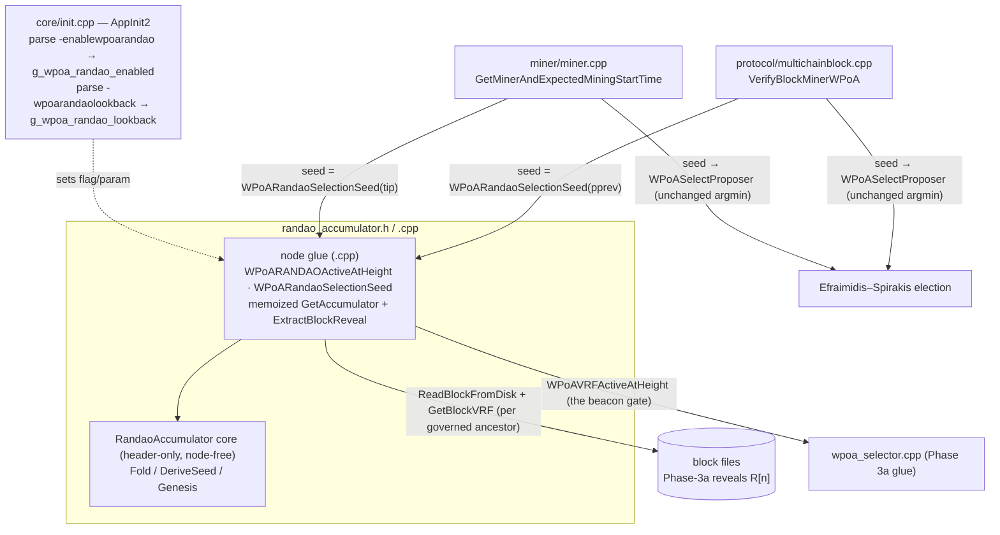
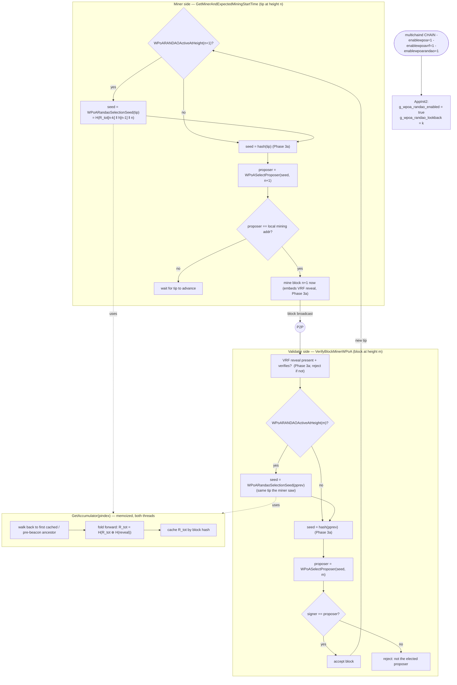

# wPoA RANDAO Beacon Seed — Implementation Guide (Phase 3b)

This document explains **how the Phase 3b code works, why every choice was made, and
how to change it**. It is the Phase 3b sibling of
[phase1-implementation-guide.md](phase1-implementation-guide.md),
[phase2-implementation-guide.md](phase2-implementation-guide.md) and
[phase3a-implementation-guide.md](phase3a-implementation-guide.md), and is written so
you can maintain and extend the RANDAO accumulator on your own.

Companion documents:
- [../README.md](../README.md) — feature entry point: introduction, architecture
  diagram, table of contents and implementation status.
- [implementation-guide.md](implementation-guide.md) — master phase index.
- [randao-accumulator.md](randao-accumulator.md) — deep line-by-line walkthrough of the
  pure accumulator/seed core (`randao_accumulator.h`) and the node glue (`.cpp`): the fold,
  the seed derivation, the memoized block-index walk, reveal extraction.
- [randao-miner.md](randao-miner.md) — the miner-side seed swap (`miner/miner.cpp`,
  `GetMinerAndExpectedMiningStartTime`).
- [randao-validator.md](randao-validator.md) — the validator-side seed swap
  (`protocol/multichainblock.cpp`, `VerifyBlockMinerWPoA`).
- [node-startup.md](node-startup.md) — how `-enablewpoarandao` / `-wpoarandaolookback`
  are wired into `AppInit2`.
- [phase3a-implementation-guide.md](phase3a-implementation-guide.md) — the VRF reveals
  this phase accumulates; the reveal itself is unchanged here.
- [phase2-implementation-guide.md](phase2-implementation-guide.md) — the public
  Efraimidis–Spirakis selection this beacon re-seeds without otherwise changing.
- [implementation-roadmap.md §6.2](implementation-roadmap.md#62-phase-3--randao-beacon--vrf-integration)
  — the phased plan (Phase 3 = the randomness-*generation* half; 3a = VRF, 3b = RANDAO).
- [thesis-project-overview.md §5.4–§5.5](thesis-project-overview.md#54-global-accumulator-update)
  — the formal accumulator + seed model this implements;
  [§7.3](thesis-project-overview.md#73-bias-analysis-cleves-impossibility-theorem-and-vdf-mitigation)
  — the last-revealer bias this bounds (and its residual, deferred to Phase 5).

---

## Module structure at a glance



The per-file walkthrough ([randao-accumulator.md](randao-accumulator.md)) zooms into each
box; this guide walks the whole subsystem end to end.

---

## Table of contents

1. [What this module does](#1-what-this-module-does)
2. [File map](#2-file-map)
3. [Mental model: 5 facts you must hold in your head](#3-mental-model)
4. [The algorithm](#4-the-algorithm)
5. [Design decisions (the "why" of every choice)](#5-design-decisions)
6. [Threading & locking model](#6-threading--locking-model)
7. [Full code walkthrough](#7-full-code-walkthrough)
8. [End-to-end control flow](#8-end-to-end-control-flow)
9. [Error handling & edge cases](#9-error-handling--edge-cases)
10. [Build integration](#10-build-integration)
11. [How to modify — concrete recipes](#11-how-to-modify)
12. [Tests](#12-tests)
13. [Accepted properties, risks & Phase 4 hooks](#13-accepted-properties-risks--phase-4-hooks)

---

## 1. What this module does

Phase 3a produces one **verifiable pseudorandom reveal** `R[n]` per block (the VRF
beacon's *generation* half). Phase 3b is the beacon's *accumulation* half: it folds
those reveals into a running **RANDAO accumulator** `R_tot` and derives the **seed** the
proposer election consumes, so selection is no longer seeded by the raw previous block
hash (Phase 2) but by a mixed, grinding-resistant beacon value.

Formally (see [thesis §5.4–§5.5](thesis-project-overview.md#54-global-accumulator-update)):

```
R_tot[n]  = H( R_tot[n-1] ⊕ H(R[n]) )               (global accumulator)
seed[n+1] = H( R_tot[n-k] ‖ h[n-1] ‖ n )            (lookback selection seed)
```

with `H` = SHA-256, `⊕` a byte-wise XOR over 32-byte values, `R[n]` the Phase-3a reveal
carried in block `n`, `h[n-1]` the hash of block `n-1`, `n` the current tip height, and
`k` a constant lookback distance.

When `-enablewpoarandao` is set, for a beacon-governed block:

- **Miner side** (`miner/miner.cpp`): the elected proposer computes `seed[n+1]` from the
  accumulator over its tip and feeds it to the same Efraimidis–Spirakis election.
- **Validator side** (`protocol/multichainblock.cpp`): each peer recomputes `seed[n+1]`
  from the *same* tip (the parent of the received block) and rejects the block if its
  signer is not the proposer that seed elects.

**What changes / what does not.** Phase 3b swaps **only the bytes fed to the selector**
(the `seed` argument of `WPoASelectProposer`). The scoring/argmin/tie-break and the
weight-read path are untouched, so the election stays weight-proportional
(`Pr[i]=w_i/Σw`, proven in [thesis §7.4](thesis-project-overview.md#74-probability-preservation-efraimidis-theorem)
and re-verified under the new seed by the functional test, §12.2). The **VRF reveal is
also unchanged** — its input stays `h[n-1]` exactly as in Phase 3a; the height term `n`
that [phase3a §4.4](phase3a-implementation-guide.md#4-the-vrf-construction) deferred is
(re)introduced here, via the seed's `n`, not in the reveal.

**What Phase 3b does and does not fix.** Selection is still **public** — anyone can
recompute the beacon from the public reveals, so leader unpredictability remains
Phase 4's job. Phase 3b's contribution is a *proper beacon*: grinding-resistant (VRF
uniqueness means a proposer cannot search for a favorable `R[n]`), and with the
last-revealer bias **bounded** to ≤ 1 bit per controlled slot (Cleve; fully removed only
by Phase 5's VDF — [thesis §7.3](thesis-project-overview.md#73-bias-analysis-cleves-impossibility-theorem-and-vdf-mitigation)).

Nodes touch two new knobs:

- `-enablewpoarandao` (default **off**; requires `-enablewpoavrf`), and
- `-wpoarandaolookback=<k>` (default **1**; consensus-critical, must match on all nodes).

Everything else (the accumulator math, the block-index walk, reveal extraction, the seed
derivation) is internal and hidden behind the `RandaoAccumulator` class, the
`WPoARANDAOActiveAtHeight` gate, and the `WPoARandaoSelectionSeed` helper.

---

## 2. File map

New files (the module):

| File | Role |
|------|------|
| [`randao_accumulator.h`](../randao_accumulator.h) | Header-only pure core `RandaoAccumulator` (`Fold`, `DeriveSeed`, `Genesis`) **plus** the declarations of the node-coupled glue (`g_wpoa_randao_enabled`, `g_wpoa_randao_lookback`, `WPoARANDAOActiveAtHeight`, `WPoARandaoSelectionSeed`). Depends only on `CSHA256`, so the core is unit-testable without the node. |
| [`randao_accumulator.cpp`](../randao_accumulator.cpp) | Definitions of the node-coupled glue: the runtime flag/lookback, the height activation predicate, the memoized block-index walk (`GetAccumulator`), the thread-local reveal extractor (`ExtractBlockReveal`) and the seed helper (`WPoARandaoSelectionSeed`). |
| [`test/randao_accumulator_tests.cpp`](../test/randao_accumulator_tests.cpp) | Boost.Test unit suite for the pure core (spec conformance vs. an independent reference, determinism, order/input sensitivity, chain consistency). |
| [`test/run_unit_tests.sh randao`](../test/run_unit_tests.sh) | Build + run the accumulator unit tests (no node build needed; links only SHA256). |
| [`test/functional_test_wpoa_system.sh`](../test/functional_test_wpoa_system.sh) | Multi-node end-to-end test: liveness + no-fork under the beacon seed, beacon-engaged evidence, and weight-proportional distribution under the seed. |

Files **modified** in the host tree (integration points):

| Site | File | Change | Detail doc |
|------|------|--------|------------|
| Startup flags | [`../../core/init.cpp`](../../core/init.cpp) | Parse `-enablewpoarandao`/`-wpoarandaolookback` into `g_wpoa_randao_enabled`/`g_wpoa_randao_lookback` in `AppInit2`; validate `k >= 0`; warn if RANDAO set without VRF; help lines. | [node-startup.md](node-startup.md) |
| Miner | [`../../miner/miner.cpp`](../../miner/miner.cpp) | In `GetMinerAndExpectedMiningStartTime`, when the beacon governs the next height, replace the prev-hash selection seed with `WPoARandaoSelectionSeed(pindexTip)`. | [randao-miner.md](randao-miner.md) (§7.3) |
| Validator | [`../../protocol/multichainblock.cpp`](../../protocol/multichainblock.cpp) | In `VerifyBlockMinerWPoA`, when the beacon governs the block, replace the prev-hash seed with `WPoARandaoSelectionSeed(pindexNew->pprev)` before the proposer check. | [randao-validator.md](randao-validator.md) (§7.4) |
| Build | [`../../Makefile.am`](../../Makefile.am) | Compile `wpoa/randao_accumulator.cpp`; track `wpoa/randao_accumulator.h`. | §10 |

Depends on:

| File | Used for |
|------|----------|
| [`../../crypto/sha256.h`](../../crypto/sha256.h) | `CSHA256` — the hash `H` for the fold, the seed and the genesis constant. |
| [`wpoa_selector.h`](../wpoa_selector.h) | `WPoAVRFActiveAtHeight` — the beacon gate the RANDAO requirement composes with. |
| [`../../protocol/multichainscript.h`](../../protocol/multichainscript.h) | `mc_Script::GetBlockVRF` — decoding the Phase-3a reveal out of a block's coinbase OP_RETURN. |
| [`../../core/main.h`](../../core/main.h) | `CBlockIndex`, `CBlock`, `ReadBlockFromDisk`, `BLOCK_HAVE_DATA` — the block-index walk and per-block reveal reads. |

---

## 3. Mental model

Five facts explain almost every design decision in this module.

**Fact 1 — The accumulator is a deterministic function of the block chain.**
`R_tot[n]` depends only on `R_tot[n-1]` and block `n`'s reveal `R[n]`, which is on-chain
(committed by PoW / the block hash). So every node that has the same chain of blocks
computes the *same* `R_tot` — no extra state, no messages. This is what keeps the beacon
seed consensus-safe: it is as deterministic as the prev-block-hash seed it replaces.

**Fact 2 — Only the seed changes; the election is byte-for-byte the Phase 2 election.**
`WPoARandaoSelectionSeed` produces 32 bytes that are handed to the *same*
`WPoASelector::SelectProposer`. Swapping the seed source cannot change the selection
*distribution* (Efraimidis–Spirakis is uniform in the seed), only *which* validator wins
each specific round. The VRF reveal, the weight read, the scoring and the tie-break are
all untouched.

**Fact 3 — The miner and validator seed off the SAME tip.**
For a block at height `m`, the honest miner's tip was `m-1`. The validator checks that
block against `WPoARandaoSelectionSeed(pindexNew->pprev)` — and `pindexNew->pprev` *is*
that height-`m-1` tip. Both therefore derive `seed[m] = H(R_tot[(m-1)-k] ‖ h[m-2] ‖ m-1)`
from identical inputs. A one-bit disagreement would make them elect different proposers
and the validator would reject the block — so agreement here is enforced by consensus,
not assumed.

**Fact 4 — The beacon engages exactly where the VRF does.**
`WPoARANDAOActiveAtHeight(h) = g_wpoa_randao_enabled AND WPoAVRFActiveAtHeight(h)`. The
accumulator *consumes* the per-block reveals, so it can only run where those reveals are
mandated. This also means a lone `-enablewpoarandao` (no `-enablewpoavrf`) is inert (and
warned about at startup) — there is nothing to accumulate.

**Fact 5 — The accumulator math is pure; only the walk touches the node.**
`RandaoAccumulator::Fold`/`DeriveSeed`/`Genesis` depend on nothing but `CSHA256`. The node
coupling — walking the block index, reading each ancestor's reveal from disk, memoizing
`R_tot` per block hash — lives in the `.cpp`. This mirrors the Phase 2 selector and Phase
3a VRF pure-core/glue split and lets the consensus-critical fold/seed be unit-tested
node-free against an independent reference implementation (§12.1).

The consequences:
- **Off by default** (`-enablewpoarandao` unset) → a Phase-3a or plain node is
  byte-for-byte unchanged; selection keeps the prev-hash seed.
- **Amortized O(1) per block** — `R_tot` is memoized per block hash, reorg-safe (a hash
  uniquely determines its ancestor chain), so a walk touches each block's reveal once.
- **The seed is fresh every round even if the accumulator moves slowly** — `h[n-1]` and
  `n` advance every block, so consecutive rounds never reuse a seed regardless of `k`.

---

## 4. The algorithm

### 4.1 The fold (`RandaoAccumulator::Fold`, thesis §5.4)

```
R_tot[n] = H( R_tot[n-1] ⊕ H(R[n]) )
```

Implemented as: `t = SHA256(reveal)`; `x = R_tot_prev ⊕ t` (byte-wise, 32 bytes);
`R_tot_out = SHA256(x)`. Hashing the reveal *before* the XOR normalizes its size and
removes structure; the final hash of the XOR breaks the linearity a bare XOR accumulator
would expose. The fold is **order-sensitive** (folding A then B ≠ B then A), which is
exactly what makes `R_tot` capture the *ordered history* of reveals — a chain, not a set.

### 4.2 The genesis base (`RandaoAccumulator::Genesis`)

`R_tot` *before* the first beacon-governed block (the left operand of the very first
fold) is a fixed, domain-separated constant: `SHA256("wPoA-RANDAO-accumulator-genesis-v1")`.
A tagged constant rather than all-zero, so the initial accumulator has no exploitable
structure and cannot collide with a plausible reveal-derived value.

### 4.3 The seed derivation (`RandaoAccumulator::DeriveSeed`, thesis §5.5)

```
seed[n+1] = H( R_tot[n-k] ‖ h[n-1] ‖ n )
```

`n` is serialized as **4 big-endian bytes** so the encoding is fixed and platform
independent (consensus-critical). The three terms play distinct roles: `R_tot[n-k]` is
the mixed, grinding-resistant beacon value; `h[n-1]` anchors the seed to the chain's
actually-finalized state; `n` disambiguates rounds. Because `h[n-1]` and `n` advance every
block, the seed is fresh per round even when `R_tot[n-k]` changes slowly.

### 4.4 The lookback `k`

`k` decouples the seed from the most recent reveals: with lookback, block `n`'s own reveal
`R[n]` does not enter the seed that elects block `n+1` (for `k ≥ 1`), so a validator that
just learned it is the tip cannot immediately steer its own next re-election. Larger `k`
gives stronger decoupling at the cost of "staler" randomness. Default `k = 1`;
consensus-critical, bound once from `-wpoarandaolookback`.

### 4.5 Computing `R_tot[n-k]` on a live chain

`R_tot` at a block is the fold of every governed ancestor's reveal, from the first
governed block up to that block. The glue computes it by an **iterative, memoized walk**
(`GetAccumulator`, §7.2): walk back only to the first cached ancestor (or the first
pre-beacon block, whose base is the genesis constant), then fold forward, caching each
`R_tot` keyed by block hash. Amortized O(1) per new block; each block's reveal is read
from disk exactly once.

---

## 5. Design decisions

### 5.1 SHA-256 fold matching the thesis, order-sensitive
- **Choice:** `R_tot = H(R_tot_prev ⊕ H(reveal))` with `H = SHA256`, exactly the thesis
  §5.4 form.
- **Why:** it is the adopted RANDAO construction; hashing before XOR and after the XOR are
  the two properties the thesis calls out (size normalization, killing XOR linearity). It
  is deterministic and needs no state beyond the previous value.
- **Rejected:** a bare running XOR of reveals (linear, and a last revealer could cancel
  prior contributions), or hashing a concatenation of all reveals (O(n) per step, no
  incremental state).

### 5.2 Seed = `H(R_tot[n-k] ‖ h[n-1] ‖ n)`, replacing the prev-hash seed at both call sites
- **Choice:** the selector's `seed` argument becomes the derived beacon seed; the argmin,
  scoring, tie-break and weight read are untouched.
- **Why:** this is precisely the Phase 2 "swap the seed" hook
  ([phase2 §11.2 / §13](phase2-implementation-guide.md#13-accepted-properties-risks--phase-34-hooks)):
  the election machinery was built seed-agnostic so later phases change only *how the seed
  is produced*. Both call sites must change identically or the chain forks — they do.
- **Rejected:** feeding the beacon seed into the *VRF input* as well. The reveal is the raw
  contribution accumulated *into* the beacon; making its input depend on the accumulator
  would create an unnecessary feedback loop and contradict the thesis model (reveal input
  is `h[n-1]`, independent of `R_tot`).

### 5.3 Beacon gated on the VRF beacon (`WPoARANDAOActiveAtHeight`)
- **Choice:** `g_wpoa_randao_enabled AND WPoAVRFActiveAtHeight(height)`.
- **Why:** the accumulator consumes the per-block reveals; without the VRF beacon there are
  no reveals to fold. Composing with the existing pure predicate means the miner and every
  validator agree, from the height alone, on which blocks are beacon-seeded.
- **Rejected:** a standalone height gate. It could switch the seed on for heights that carry
  no reveal, making `R_tot` undefined and forcing the fallback path (§9) into normal use.

### 5.4 Memoized accumulator keyed by block hash, not a `CBlockIndex` field
- **Choice:** an in-memory `std::map<uint256,uint256>` cache in the module, populated lazily
  by an iterative walk.
- **Why:** keeps Phase 3b self-contained (no change to the core chain structures or their
  serialization), and keying by *block hash* is automatically reorg-safe (a hash uniquely
  determines its ancestor chain, so a fork's `R_tot` never aliases the main chain's). Lazy
  population makes it O(chain) once and amortized O(1) thereafter; on restart it simply
  repopulates on first use.
- **Rejected:** an in-memory `CBlockIndex::hashRandao` field computed at `ConnectBlock`.
  More invasive (touches consensus-path connect logic), and it would still need lazy
  recomputation after restart — i.e. the same cache logic, but welded into the chain object.

### 5.5 Thread-local `mc_Script` for reveal extraction (not the shared scratch)
- **Choice:** `ExtractBlockReveal` uses a stack-local `mc_Script`, not
  `mc_gState->m_TmpScript1`.
- **Why:** the accumulator runs on the **miner thread** (computing the next selection seed)
  as well as the validation thread. `m_TmpScript1` is the single-threaded validation-path
  scratch object; touching it from the miner thread would race. A local instance is
  self-contained, exactly as Phase 1's `DecodeWeightRecord` does
  ([phase1 §6](phase1-implementation-guide.md#6-threading--locking-model)).
- **Rejected:** reusing `FindBlockVRF` from `multichainblock.cpp` — it uses the shared
  scratch and is validation-thread-only; the small extraction loop is duplicated instead,
  with a comment, precisely because the thread-safety requirement differs.

### 5.6 Deterministic fallback fold on unreadable reveal
- **Choice:** if a governed ancestor's reveal cannot be read (block data unavailable), fold
  the block *hash* instead and log a warning.
- **Why:** the branch is unreachable on an accepted chain — every governed block passed
  `VerifyBlockMinerWPoA`, which rejects a missing/invalid reveal — but if it ever triggers
  (e.g. pruning), a deterministic fallback keeps every node's `R_tot` in agreement rather
  than diverging. The functional test asserts this path is never taken (0 fallback folds).
- **Rejected:** aborting or returning the genesis value — either would desynchronize the
  seed between a node that can read the block and one that cannot.

### 5.7 New flags, default off, `k` validated and consensus-critical
- **Choice:** `-enablewpoarandao` (bool, off) + `-wpoarandaolookback=<k>` (int, default 1,
  validated `0 ≤ k ≤ 1e6`); a startup warning if RANDAO is set without VRF.
- **Why:** consensus-affecting behavior must be opt-in and uniform across validators, exactly
  like `-enablewpoa`/`-enablewpoavrf`/`-dumpfunction`. Validating `k` at startup turns a
  fork-inducing misconfiguration into a clean `InitError`.
- **Rejected:** hard-coding `k`. It is a genuine tuning knob (decoupling vs. freshness) worth
  exposing, and baking it in would make experiments require a recompile.

---

## 6. Threading & locking model

Four execution contexts touch this code:

1. **The init thread** (`AppInit2`) — only *parses* the flag/lookback into
   `g_wpoa_randao_enabled` / `g_wpoa_randao_lookback`. Written once before any miner/validator
   thread reads them, so they need no lock (identical treatment to `g_wpoa_enabled` /
   `g_wpoa_vrf_enabled`).
2. **The miner thread** (`GetMinerAndExpectedMiningStartTime`) — calls
   `WPoARandaoSelectionSeed(pindexTip)` once per new tip.
3. **The block-connection / validation thread** (`VerifyBlockMinerWPoA`) — calls
   `WPoARandaoSelectionSeed(pindexNew->pprev)` for a received block.

Locking rules the code follows:

- **The accumulator math takes no locks.** `Fold`/`DeriveSeed`/`Genesis` are pure functions
  over their byte arguments.
- **The cache is guarded by a dedicated leaf lock.** `GetAccumulator` takes
  `cs_randao_cache` around the walk and the `std::map` read/write. It is a private lock used
  nowhere else, so it cannot participate in a lock-order inversion. `ReadBlockFromDisk` runs
  under it (serializing accumulator computations across the two threads) but takes no
  chain lock of its own, so there is no deadlock risk.
- **Reveal extraction uses a stack-local `mc_Script`** (§5.5), so the miner and validation
  threads never contend on the shared scratch buffer.
- **No shared mutable state beyond the cache.** The flag/lookback are write-once-at-startup;
  the genesis constant is recomputed locally each call (cheap, avoids a shared static).

---

## 7. Full code walkthrough

This section summarizes each site; [randao-accumulator.md](randao-accumulator.md) gives the
exhaustive line-by-line treatment.

### 7.1 `randao_accumulator.h` — the pure core

- `Fold(rtot_prev32, reveal, reveal_len, rtot_out32)` — implements §4.1; supports in/out
  aliasing (the XOR term is built in a local buffer before the final hash writes out).
- `DeriveSeed(rtot_lookback32, h_prev32, height, seed_out32)` — implements §4.3; serializes
  `height` big-endian.
- `Genesis(out32)` — implements §4.2.
- At the bottom it **declares** the node glue (`extern bool g_wpoa_randao_enabled;`,
  `extern int g_wpoa_randao_lookback;`, `MC_WPOA_DEFAULT_RANDAO_LOOKBACK`,
  `WPoARANDAOActiveAtHeight`, `WPoARandaoSelectionSeed`) defined in the `.cpp`.

### 7.2 `randao_accumulator.cpp` — the node glue

- `g_wpoa_randao_enabled = false;` / `g_wpoa_randao_lookback = MC_WPOA_DEFAULT_RANDAO_LOOKBACK;`.
- `ExtractBlockReveal(block, reveal_out, reveal_len)` — scans the coinbase OP_RETURN elements
  with a **stack-local** `mc_Script` and returns the first `GetBlockVRF` suffix.
- `GetAccumulator(pindex)` — the memoized, iterative walk of §4.5: genesis for NULL/pre-beacon
  `pindex`; otherwise walk back to the first cached ancestor or the pre-beacon base under
  `cs_randao_cache`, then fold forward with `Fold`, caching each `R_tot` by block hash.
- `WPoARANDAOActiveAtHeight(height)` — §5.3.
- `WPoARandaoSelectionSeed(pindexTip, seed_out)` — locate the ancestor at height `n-k`
  (clamped at 0), `R_tot = GetAccumulator(that ancestor)`, `h_prev = hash(pindexTip->pprev)`,
  then `DeriveSeed(R_tot, h_prev, n, seed_out)`. Traces the derived seed under `-debug=wpoa`.

### 7.3 `../../miner/miner.cpp` integration

Full line-by-line treatment in [randao-miner.md](randao-miner.md). Inside
`GetMinerAndExpectedMiningStartTime`, in the Phase 2 wPoA branch, the seed is chosen just
before the election:

```cpp
uint256 hWPoASeed=pindexTip->GetBlockHash();
unsigned char randao_seed[32];
if(WPoARANDAOActiveAtHeight(nWPoAHeight) && WPoARandaoSelectionSeed(pindexTip,randao_seed))
{
    memcpy(hWPoASeed.begin(),randao_seed,sizeof(randao_seed));
}
std::string sProposer=WPoASelectProposer(hWPoASeed.begin(),hWPoASeed.size(),nWPoAHeight);
```

When RANDAO is inactive it falls back to the plain prev-hash seed (Phase 3a behavior). See §11.1.

### 7.4 `../../protocol/multichainblock.cpp` integration

Full line-by-line treatment in [randao-validator.md](randao-validator.md). In
`VerifyBlockMinerWPoA`, symmetrically, using the **same tip the miner saw**
(`pindexNew->pprev`):

```cpp
uint256 hSeed=pindexNew->pprev->GetBlockHash();
unsigned char randao_seed[32];
if(WPoARANDAOActiveAtHeight(pindexNew->nHeight) && WPoARandaoSelectionSeed(pindexNew->pprev,randao_seed))
{
    memcpy(hSeed.begin(),randao_seed,sizeof(randao_seed));
}
std::string sProposer=WPoASelectProposer(hSeed.begin(),hSeed.size(),pindexNew->nHeight);
```

The VRF-reveal check that precedes this (Phase 3a) is unchanged. `pindexNew->pprev` is
guaranteed non-NULL here (`VerifyBlockMiner` returns early for a genesis-parent block).

### 7.5 `../../core/init.cpp` integration

In `AppInit2`, next to the Phase 3a `-enablewpoavrf` handling: parse
`-enablewpoarandao`/`-wpoarandaolookback`, validate `k`, warn if RANDAO is set without VRF,
and log the resolved state. Plus two `HelpMessage` lines. See [node-startup.md](node-startup.md).

### 7.6 `../../Makefile.am`

- `wpoa/randao_accumulator.cpp` added to `libbitcoin_wallet_a_SOURCES`.
- `wpoa/randao_accumulator.h` added to `BITCOIN_CORE_H`.
- Regenerate after editing: `./autogen.sh && ./configure && make`.

---

## 8. End-to-end control flow



The crux: the miner and validator derive the seed from the **same tip** and the **same
on-chain reveals**, so an honest block is always accepted and a wrong-proposer block is
always rejected — the chain staying live and fork-free *is* the proof that the beacon seed
is identical network-wide.

---

## 9. Error handling & edge cases

| Situation | Where handled | Behaviour |
|-----------|---------------|-----------|
| `-enablewpoarandao` unset | `WPoARANDAOActiveAtHeight` | returns false → prev-hash seed (Phase 3a behavior). |
| `-enablewpoarandao` set but `-enablewpoavrf` unset | `WPoARANDAOActiveAtHeight` + startup warning | returns false (no reveals to fold) → inert; startup logs a warning. |
| Height not beacon-governed (bootstrap/native) | `WPoARANDAOActiveAtHeight` | returns false → prev-hash seed. |
| Lookback `n-k` before the first governed block | `GetAccumulator` (pre-beacon `pindex`) | returns the genesis accumulator (deterministic base). |
| `k` larger than the chain height | `WPoARandaoSelectionSeed` | target clamped to height 0 → genesis-based `R_tot`. |
| NULL tip | `WPoARandaoSelectionSeed` | returns false → caller keeps the prev-hash seed. |
| Governed ancestor's reveal unreadable | `GetAccumulator` fallback | folds the block hash deterministically + logs a warning (unreachable on an accepted chain, §5.6). |
| Invalid `-wpoarandaolookback` (< 0 or huge) | `AppInit2` | `InitError` → startup fails with a message. |
| Concurrent accumulator computation (miner + validator) | `cs_randao_cache` | serialized; the cache is shared and consistent. |
| Reorg to a different fork | cache keyed by block hash | the fork's `R_tot` is computed/looked up under its own hashes; no aliasing with the old chain. |

---

## 10. Build integration

- `randao_accumulator.cpp` compiles into `libbitcoin_wallet` (it references `WPoAVRFActiveAtHeight`,
  `ReadBlockFromDisk`, `GetBlockVRF` and `CSHA256`). `miner.cpp` / `multichainblock.cpp` /
  `init.cpp` reference `WPoARANDAOActiveAtHeight` / `WPoARandaoSelectionSeed` /
  `g_wpoa_randao_*`; the final binary links all libs, so they resolve — the same cross-lib
  pattern Phases 1–3a already rely on.
- The pure core (`randao_accumulator.h`) links against only `crypto/sha256` for the unit test
  — no wallet, no node.
- Regenerate after the `Makefile.am` change: `./autogen.sh && ./configure && make` (or just
  `make` under maintainer mode).
- **Verification done:** the accumulator unit tests pass (spec conformance, determinism,
  order/input sensitivity, chain consistency); the multi-node functional test drives the chain
  past setup under the beacon seed with no fork, zero fallback folds, and a passing chi-square
  distribution; with `-enablewpoarandao` unset a Phase-3a node is unchanged.

---

## 11. How to modify

### 11.1 Change the seed formula (e.g. add domain separation)
Edit `RandaoAccumulator::DeriveSeed` in [`randao_accumulator.h`](../randao_accumulator.h) and
add a unit test in [`test/randao_accumulator_tests.cpp`](../test/randao_accumulator_tests.cpp).
It is consumed identically by both call sites via `WPoARandaoSelectionSeed`, so there is a
single place to change — but it is **consensus-critical**: every node must run the same binary.

### 11.2 Change the lookback default
Edit `MC_WPOA_DEFAULT_RANDAO_LOOKBACK` in [`randao_accumulator.h`](../randao_accumulator.h).
Operators still override it with `-wpoarandaolookback`; it must match on all nodes.

### 11.3 Change the fold / accumulator construction
Reimplement `RandaoAccumulator::Fold` behind the same signature and re-run
[`test/run_unit_tests.sh randao`](../test/run_unit_tests.sh); no caller changes. Keep it
order-sensitive and deterministic, or the chain-history property (§4.1) breaks.

### 11.4 Change when the beacon seed engages
Edit `WPoARANDAOActiveAtHeight` in [`randao_accumulator.cpp`](../randao_accumulator.cpp). Keep it
a **pure function of data both the miner and validator share**, or they disagree on which blocks
are beacon-seeded and fork.

### 11.5 Persist / bound the accumulator cache
The cache currently grows one 32-byte entry per block seen and is never trimmed (fine for a
prototype). To bound it, evict entries below the finalized tip minus `k` (they are never looked
up again), or persist `R_tot` in the block index — see §5.4 for the trade-off.

---

## 12. Tests

### 12.1 Unit tests (node-free, pure math)

[test/randao_accumulator_tests.cpp](../test/randao_accumulator_tests.cpp), run with
[test/run_unit_tests.sh randao](../test/run_unit_tests.sh). Links only SHA256 +
Boost.Test. Covers, node-free:

- **spec conformance** — `Fold` and `DeriveSeed` match an *independent* re-implementation of
  the thesis §5.4/§5.5 formulas (so a bug in the header cannot hide behind a shared helper),
  and `Genesis` equals `SHA256` of the documented tag;
- **determinism** and **in/out aliasing** of the fold;
- **order sensitivity** — folding A then B ≠ B then A (the accumulator captures reveal order);
- **avalanche** — a one-bit change in any input (accumulator, reveal, prev-hash, height) flips
  the output;
- **chain consistency** — a 50-reveal chain matches the step-by-step recurrence with no
  collisions, and 4096 consecutive heights give 4096 distinct seeds.

Run it:

```
./src/wpoa/test/run_unit_tests.sh randao
```

### 12.2 Multi-node functional test

[test/functional_test_wpoa_system.sh](../test/functional_test_wpoa_system.sh). Bootstraps N
permissioned nodes with `-enablewpoa=1 -enablewpoavrf=1 -enablewpoarandao=1`, waits for weight
convergence, drives the chain `RANDAO_BLOCKS` blocks past the setup height, and asserts:

1. **Liveness under the beacon seed** — the chain advances past setup. Because the proposer is
   elected from the RANDAO seed, this is only possible if the miner and every validator derive
   the *same* seed (including the whole accumulator walk); a one-bit disagreement would stall
   block acceptance. This is the core end-to-end signal.
2. **No fork** — all nodes agree on the block hash at the sampled height.
3. **Beacon engaged, no fallback** — each node's `debug.log` shows `[wPoA-RANDAO] seed` lines
   and **zero** `reveal unavailable` fallback folds (every governed ancestor's reveal was read
   and folded).
4. **Weight-proportional distribution under the seed** — the observed proposer distribution
   still matches the weight ratios (chi-square goodness-of-fit via
   [analyze_distribution.py](../test/analyze_distribution.py)), confirming the seed swap did not
   disturb `Pr[i]=w_i/Σw`.

Run it:

```
# default 3-node run, k=1
./src/wpoa/test/functional_test_wpoa_system.sh

# quick validation with a non-trivial lookback
NODES=3 WEIGHTS="100 200 300" SETUP_BLOCKS=20 RANDAO_BLOCKS=60 RANDAO_LOOKBACK=2 \
    RANDAO_TIMEOUT=320 ./src/wpoa/test/functional_test_wpoa_system.sh
```

Representative run (`WEIGHTS="100 200 300"`, 60 blocks, k=2): chain advanced with **no fork**,
**550 RANDAO seed derivations logged, 0 fallback folds**, and χ² = 0.483 (df = 2, well under the
α=0.001 critical value of 14.13) — the distribution tracks the 1:2:3 weight ratio under the
beacon seed.

**On sample size and wall-clock.** As in the Phase 2/3a tests, MultiChain paces block
timestamps ~`target-block-time` seconds apart (2 s in this harness), so accruing `RANDAO_BLOCKS`
governed blocks takes ≈ `2·RANDAO_BLOCKS` seconds; raise `RANDAO_TIMEOUT` for large samples.

---

## 13. Accepted properties, risks & Phase 4 hooks

- **Selection is still public (accepted, by design).** Phase 3b re-seeds the *public*
  Efraimidis election from a proper beacon; it does not hide the proposer. Leader
  unpredictability is Phase 4's job (private VRF-scored sortition). The beacon seed is the raw
  material Phase 4 will evaluate under each validator's secret key.
- **Last-revealer bias is bounded, not removed (accepted).** The last proposer in a window can,
  per Cleve, bias `R_tot` by ≤ 1 bit per slot it controls by withholding its reveal. The lookback
  `k` limits *self*-steering; the residual bias is removed only by Phase 5's VDF over the beacon
  output ([thesis §7.3](thesis-project-overview.md#73-bias-analysis-cleves-impossibility-theorem-and-vdf-mitigation)).
- **Grinding resistance (inherited).** A proposer cannot search for a favorable reveal because
  the VRF output is unique per `(sk, input)` (Phase 3a / [thesis §7.1](thesis-project-overview.md#71-cryptographic-assumptions)).
- **Runtime-flag/lookback uniformity.** `-enablewpoarandao` and `-wpoarandaolookback` are
  consensus-affecting and must be identical across validators, exactly like the Phase 2/3a flags.
  Nothing enforces this automatically today — the same accepted-risk category as those flags.
- **Determinism of the beacon.** The accumulator and seed are integer/hash arithmetic over
  SHA-256, so they are bit-exact across platforms — there is no floating-point-determinism caveat
  here (unlike the Phase 2 score; [phase2 §13](phase2-implementation-guide.md#13-accepted-properties-risks--phase-34-hooks)).
  The floating-point caveat still applies to the *selector* the seed feeds, unchanged.
- **Cache growth (accepted for the prototype).** The `R_tot` cache is unbounded in-memory; see
  §11.5 for how to bound or persist it.
- **Phase 4 hook.** Replace the public HMAC/argmin score with a per-validator VRF score
  `u_i = VRF_sk_i(seed[n+1]) / 2^256` evaluated privately, and add the gossip/reveal window,
  tie-break and liveness fallback — the beacon seed produced here becomes that private
  evaluation's public input.
