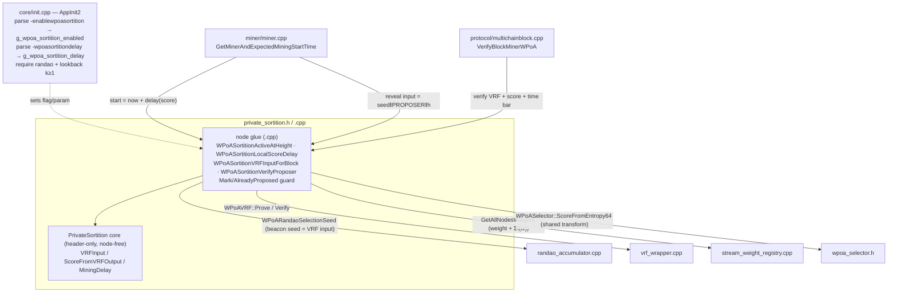

# wPoA Private Sortition — Implementation Guide (Phase 4)

This document explains **how the Phase 4 code works, why every choice was made, and
how to change it**. It is the Phase 4 sibling of
[phase1-implementation-guide.md](phase1-implementation-guide.md),
[phase2-implementation-guide.md](phase2-implementation-guide.md),
[phase3a-implementation-guide.md](phase3a-implementation-guide.md) and
[phase3b-implementation-guide.md](phase3b-implementation-guide.md), and is written so
you can maintain and extend the private-sortition layer on your own.

Phase 4 is **the security fix**: it is the phase that actually delivers *leader
unpredictability*. Phases 2/3a/3b built a weight-proportional election over a proper
VRF + RANDAO beacon, but selection stayed **public** — anyone could recompute the
next proposer a full block in advance. Phase 4 moves the election *score* inside each
validator's secret key, so the proposer is unknowable to the network until it acts.

Companion documents:
- [../README.md](../README.md) — feature entry point: introduction, architecture
  diagram, status.
- [implementation-guide.md](implementation-guide.md) — master phase index.
- [private-sortition.md](private-sortition.md) — line-by-line walkthrough of the pure
  core (`private_sortition.h`) and the node glue (`.cpp`).
- [sortition-miner.md](sortition-miner.md) — the miner-side score-timed self-election
  (`miner/miner.cpp`).
- [sortition-validator.md](sortition-validator.md) — the validator-side eligibility /
  time-bar check (`protocol/multichainblock.cpp`).
- [node-startup.md](node-startup.md) — how `-enablewpoasortition` / `-wpoasortitiondelay`
  are wired into `AppInit2`.
- [phase3b-implementation-guide.md](phase3b-implementation-guide.md) — the RANDAO
  beacon seed this phase evaluates privately; the seed is its public VRF input.
- [phase3a-implementation-guide.md](phase3a-implementation-guide.md) — the VRF whose
  reveal now doubles as the private election score.
- [phase2-implementation-guide.md](phase2-implementation-guide.md) — the public
  Efraimidis election whose *score transform* Phase 4 reuses verbatim.
- [implementation-roadmap.md §6.3](implementation-roadmap.md#63-phase-4--efraimidis-private-sortition-the-security-fix)
  — the phased plan and the design points this phase resolves.
- [thesis-project-overview.md §6.2](thesis-project-overview.md#62-efraimidisspirakis-sortition-private-local-score-computation),
  [§7.4](thesis-project-overview.md#74-probability-preservation-efraimidis-theorem)
  — the private local-score model and the probability-preservation proof.

---

## Module structure at a glance



The per-file walkthrough ([private-sortition.md](private-sortition.md)) zooms into each
box; this guide walks the whole subsystem end to end.

---

## Table of contents

1. [What this module does](#1-what-this-module-does)
2. [File map](#2-file-map)
3. [Mental model: 6 facts you must hold in your head](#3-mental-model)
4. [The algorithm](#4-the-algorithm)
5. [Design decisions (the "why" of every choice)](#5-design-decisions)
6. [Threading & locking model](#6-threading--locking-model)
7. [Full code walkthrough](#7-full-code-walkthrough)
8. [End-to-end control flow](#8-end-to-end-control-flow)
9. [Error handling & edge cases](#9-error-handling--edge-cases)
10. [Build integration](#10-build-integration)
11. [How to modify — concrete recipes](#11-how-to-modify)
12. [Tests](#12-tests)
13. [Accepted properties, risks & Phase 5 hooks](#13-accepted-properties-risks--phase-5-hooks)

---

## 1. What this module does

Through Phase 3b the election is **public**. Every node computes, for every validator,

```
u_i = HMAC-SHA256(seed, address_i);   score_i = -ln(u_i) / f(w_i);   winner = argmin_i score_i
```

over the public beacon `seed`, so **any** observer recomputes the next proposer a full
block in advance — the leader-predictability / targeted-DoS window the project exists
to close ([thesis §3](thesis-project-overview.md#3-threat-model--vulnerabilities)).

Phase 4 makes the score **private** by changing only the *source of the entropy* `u_i`:

```
(y_i, π_i) = VRF_sk_i( seed ‖ "PROPOSER" ‖ height )     # per-validator, secret-keyed
u_i        = top64(y_i) / 2^64                            # ∈ (0,1]
score_i    = -ln(u_i) / f(w_i)                            # SAME transform as Phase 2
winner     = argmin_i score_i
```

Because `score_i` depends on `sk_i` — known only to validator `i` — **no other node
can compute it**. The distribution is unchanged (`Pr[i]=w_i/Σw`, proven in
[thesis §7.4](thesis-project-overview.md#74-probability-preservation-efraimidis-theorem));
only *who* can compute the winner and *when* it becomes known change.

**Agreement without a reveal round (score-timed self-election).** A validator cannot
know it is the global argmin — it cannot compute the others' private scores — so the
Phase-2 "miner == recomputed argmin" check is impossible. Instead:

- **Miner side.** Validator `i` mines only after a delay that *increases* with its
  score: `start_i = now + MiningDelay(score_i, …)`. The lowest score (the argmin)
  proposes **first**; once its block propagates, higher-score validators see the new
  tip and stand down. So ~one block is produced per round and it is the argmin's.
- **Validator side.** A peer verifies `π_i`, recomputes `score_i` from the block-carried
  `y_i` and the signer's registry weight, and accepts iff the block's `nTime` is no
  earlier than the score entitles: `block.nTime ≥ parent.nTime + MiningDelay(score_i, …)`.
  This **eligibility / time-bar** test *replaces* the argmin equality.

This removes the zero-proposer gap entirely: there is no hard threshold, so the
minimum-score **online** validator always eventually proposes — the auto-relaxing time
bar *is* the liveness fallback (chosen over a public-argmin backstop precisely because
it stays private). When `-enablewpoasortition` is set, for a sortition-governed block:

- the reveal embedded in the block is the VRF over the sortition input (its output is
  the score), rather than the Phase-3a prev-hash reveal;
- selection is no longer a public recomputation; it is private self-election bounded by
  the time bar peers enforce.

Nodes touch two new knobs:

- `-enablewpoasortition` (default **off**; requires `-enablewpoarandao` and lookback `k ≥ 1`), and
- `-wpoasortitiondelay=<s>` (default **1.0**; consensus-critical delay scale, must match on all nodes).

Everything else (the VRF-input encoding, the score transform, the delay map, the
effective-weight sum, the time bar) is internal, hidden behind the `PrivateSortition`
class, the `WPoASortitionActiveAtHeight` gate, and the miner/validator glue helpers.

---

## 2. File map

New files (the module):

| File | Role |
|------|------|
| [`private_sortition.h`](../private_sortition.h) | Header-only pure core `PrivateSortition` (`VRFInput`, `ScoreFromVRFOutput`, `MiningDelay`) **plus** the node-glue declarations (`g_wpoa_sortition_enabled`, `g_wpoa_sortition_delay`, `WPoASortitionActiveAtHeight`, `WPoASortitionLocalScoreDelay`, `WPoASortitionVRFInputForBlock`, `WPoASortitionVerifyProposer`, the proposed-height guard). The core depends only on the Phase-2 score transform, so it is unit-testable without the node. |
| [`private_sortition.cpp`](../private_sortition.cpp) | Definitions of the node glue: the runtime flag/scale, the height activation predicate, the shared context builder (seed + weight map + Σf(w)), the miner-side local score/delay, the reveal VRF-input builder, the validator-side eligibility/time-bar verdict, and the miner-loop anti-respin guard. |
| [`test/private_sortition_tests.cpp`](../test/private_sortition_tests.cpp) | Boost.Test unit suite: VRF-input encoding, score reuse (single source of truth), delay map, key-dependence (privacy), and end-to-end probability preservation with **real** VRF keys. |
| [`test/run_sortition_unit_tests.sh`](../test/run_sortition_unit_tests.sh) | Build + run the unit tests (links SHA256 + HMAC + the VRF wrapper + secp256k1; no node build). |
| [`test/functional_test_wpoa_sortition.sh`](../test/functional_test_wpoa_sortition.sh) | Multi-node end-to-end test: liveness, no persistent fork, private-path-engaged (no public-argmin acceptances), weight-proportional distribution. |

Files **modified** in the host tree (integration points):

| Site | File | Change | Detail doc |
|------|------|--------|------------|
| Score transform | [`../wpoa_selector.h`](../wpoa_selector.h) | Factor the `u64 digest → -ln(u)/f(w)` step into `ScoreFromEntropy64` (+ `FoldTop64`) so Phase 2 and Phase 4 share **one** score transform. | [private-sortition.md](private-sortition.md) |
| Startup flags | [`../../core/init.cpp`](../../core/init.cpp) | Parse `-enablewpoasortition`/`-wpoasortitiondelay`; require RANDAO and `k >= 1`; help lines; log. | [node-startup.md](node-startup.md) |
| Miner | [`../../miner/miner.cpp`](../../miner/miner.cpp) | Sortition branch in `GetMinerAndExpectedMiningStartTime` (score-timed start + anti-respin guard); switch the reveal-embed input to the sortition input in `CreateBlockSignature`; mark the proposed height after `ProcessBlockFound`. | [sortition-miner.md](sortition-miner.md) |
| Validator | [`../../protocol/multichainblock.cpp`](../../protocol/multichainblock.cpp) | Sortition branch in `VerifyBlockMinerWPoA`: VRF-verify over the sortition input + score recompute + time bar, replacing the argmin equality on sortition heights. | [sortition-validator.md](sortition-validator.md) |
| Build | [`../../Makefile.am`](../../Makefile.am) | Compile `wpoa/private_sortition.cpp`; track the header. | §10 |

Depends on:

| File | Used for |
|------|----------|
| [`wpoa_selector.h`](../wpoa_selector.h) | `ScoreFromEntropy64`/`FoldTop64` (the shared transform), `ApplyDumping`, `g_dumping_function`. |
| [`randao_accumulator.h`](../randao_accumulator.h) | `WPoARANDAOActiveAtHeight` (the gate sortition composes with) and `WPoARandaoSelectionSeed` (the beacon seed = the public VRF input). |
| [`vrf_wrapper.h`](../vrf_wrapper.h) | `WPoAVRF::Prove`/`Verify` — the VRF, unchanged; only the input bytes differ. |
| [`stream_weight_registry.h`](../stream_weight_registry.h) | `GetAllNodesWeights` — the proposer's weight and the effective-weight sum Σf(w). |
| [`../../core/main.h`](../../core/main.h) | `CBlockIndex`, `CBlock`, `mapBlockIndex` — the parent lookup and the seed walk. |

---

## 3. Mental model

Six facts explain almost every design decision in this module.

**Fact 1 — Only the entropy source of the score changes; the transform is Phase 2's.**
`ScoreFromVRFOutput` folds the top 64 bits of the VRF output and calls the *same*
`WPoASelector::ScoreFromEntropy64` the public selector uses on its HMAC digest. Given
identical `(entropy, weight, dumping)` the scores are byte-identical. That single source
of truth is what lets the thesis reuse the Phase-2 probability-preservation proof
unchanged — the substitution is provably distribution-neutral.

**Fact 2 — The score is private because the VRF key is private.**
`u_i` comes from `VRF_sk_i(seed ‖ "PROPOSER" ‖ height)`. VRF pseudorandomness (thesis
§7.1) means no one without `sk_i` can compute `y_i`, hence `score_i`. That is the whole
security fix: the proposer is unknowable in advance.

**Fact 3 — Agreement is by timing, not by recomputation.**
No node can recompute the global argmin. Instead the argmin *reveals itself first*: the
mining delay increases with the score, so the lowest score proposes earliest and its
block wins the round. Peers do not check "are you the argmin?"; they check "were you
*allowed* to mine this early?" — the time bar.

**Fact 4 — The time bar is the same function on both sides, and it is the liveness fallback.**
`MiningDelay(score, Σf(w), scale)` is a pure, strictly-increasing map. The miner waits it
before mining; the validator rejects a block whose `nTime` beats it. Because it is finite
for every score, the minimum-score online validator always eventually clears its own bar
and proposes — so there is no zero-proposer stall (the "threshold auto-relaxation"
choice, realized as a continuous time bar rather than discrete threshold rounds).

**Fact 5 — Sortition engages exactly where the RANDAO beacon does.**
`WPoASortitionActiveAtHeight(h) = g_wpoa_sortition_enabled AND WPoARANDAOActiveAtHeight(h)`.
Sortition consumes the beacon seed as its public VRF input, so it can only run where that
seed exists. A lone `-enablewpoasortition` (no RANDAO) is inert (and warned about at
startup). It also requires lookback `k ≥ 1`: the reveal `R[n]` feeds `R_tot[n]` while its
own seed reads `R_tot[n-k]`, so `k = 0` would make the seed circular (rejected in AppInit2).

**Fact 6 — The block reveal now carries the score, at no new wire cost.**
On sortition heights the Phase-3a reveal `(y, π)` embedded in the block is the VRF over the
*sortition* input, so `y` *is* the proposer's score material. Peers re-score from it; the
RANDAO accumulator folds it exactly as before (it treats the reveal as opaque bytes). The
on-chain format is unchanged — only the VRF input changed.

---

## 4. The algorithm

For the block at height `n+1` after tip `n`, with `seed = seed[n+1]` the Phase-3b beacon
seed and `W = Σ_j f(w_j)` the effective-weight sum over all validators:

```
--- MINER side (validator i, private) ---
input   = seed ‖ "PROPOSER" ‖ BE32(n+1)
(y_i,π_i) = VRF_sk_i(input)
score_i = -ln( (top64(y_i)+1)/2^64 ) / f(w_i)
delay_i = scale · score_i · W
mine at: now + delay_i         # embed (y_i, π_i) as the block reveal

--- VALIDATOR side (every peer, on receiving block B at height n+1 from signer P) ---
verify  WPoAVRF::Verify(PK_P, seed ‖ "PROPOSER" ‖ BE32(n+1), y_B, π_B)      else REJECT
w_P     = registry weight of P                                             (absent ⇒ REJECT)
score_P = -ln( (top64(y_B)+1)/2^64 ) / f(w_P)
delay_P = scale · score_P · W
accept  iff  B.nTime ≥ parent.nTime + floor(delay_P)                       else REJECT
```

The argmin has the smallest `delay`, mines first, and wins the round; a higher-score
node that tries to mine early produces a block with `nTime < parent.nTime + floor(delay)`
that every honest peer rejects (front-run resistance). `W` and `f` are read identically on
both sides, so the delay — and hence the bar — is the same everywhere.

---

## 5. Design decisions

**Why score-timed self-election, not a P2P gossip/reveal protocol?** A gossip-window
protocol (validators broadcast `ProposerClaim`s, everyone collects, argmin wins) matches
the thesis §8 diagrams literally, but needs a new net message, serialization, gossip/relay,
per-height claim tracking and window timers — a large, high-risk change to the networking
layer. Score-timing achieves the same "argmin wins, unknown in advance" property by reusing
the existing block relay, the existing mining-start-time gate and the existing first-seen
fork choice, with **no** P2P or fork-choice changes. It is the natural continuation of the
Phase 2/3a/3b architecture (pure core + node glue + miner/validator hooks + one flag).

**Why the delay `scale · score · Σf(w)` and not just `scale · score`?** Multiplying by the
effective-weight sum makes the delay weight-**scale** invariant: the minimum score across
`m` validators is `~Exp(Σf(w))`, so `score·Σf(w)` is `~Exp(1)`-scaled regardless of the
absolute weight magnitudes, and `scale` (seconds) then sets the real-time spread between
successive proposers directly. Without it, the right `scale` would depend on the chain's
weight magnitudes. `Σf(w)` is summed in the `std::map`'s sorted-key order, identical on
every node, so the floating-point sum is reproducible.

**Why a continuous time bar instead of a discrete threshold + relaxation rounds?** They are
duals: "accept if `score ≤ τ(t)` with `τ` growing over time" is exactly "accept if
`nTime ≥ parent.nTime + f(score)`" with `f = τ⁻¹`. The continuous form needs no round
counter and no extra state, and it makes the liveness fallback automatic (Fact 4). This is
the concrete realization of the "threshold auto-relaxation" design decision.

**Why does the reveal input change to `seed ‖ "PROPOSER" ‖ height`?** The reveal must be the
VRF output that *is* the score, so peers can re-score it. The `"PROPOSER"` domain tag keeps a
sortition reveal from ever colliding with the Phase-3a prev-hash reveal or any other VRF use;
the big-endian height keeps rounds distinct. It is the exact input from thesis §6.2.

**Why is the validator time bar floored to whole seconds, and only coarse?** Block `nTime`
has 1-second resolution, so the bar is `nTime ≥ parent.nTime + floor(delay)` — a coarse
anti-front-run guard. The **fine**, sub-second ordering that actually prevents forks is done
miner-side with `mc_TimeNowAsDouble()`. So the two mechanisms split the work: miner-side
sub-second timing orders proposers; the validator-side integer-second bar bounds gross
front-running. Tune `-wpoasortitiondelay` so honest delays span at least a few seconds if you
want the bar itself to discriminate finely.

**Why an anti-respin guard in the miner?** MultiChain's timing function caches on the tip
hash. Under sortition a node's block can legitimately lose the fork race, leaving the tip
(the cache key) unchanged, so the loop would spin re-mining the same height. The guard
records the highest height already proposed and stands down until the tip advances.

---

## 6. Threading & locking model

- The `PrivateSortition` core is pure and stateless — no locks.
- `WPoASortitionLocalScoreDelay` and `WPoASortitionVRFInputForBlock` run on the **miner**
  thread; `WPoASortitionVerifyProposer` runs on the **block-connection/validation** thread.
  Each reads the weight registry (its own `StreamWeightRegistry` instance over
  `pwalletTxsMain`) and walks the block index for the seed via `WPoARandaoSelectionSeed`,
  which serializes its own accumulator cache with its own leaf lock (Phase 3b). No shared
  mutable state is added here beyond that.
- The anti-respin guard (`g_sortition_proposed_height`) is touched only by the miner thread
  but is guarded by a dedicated leaf `CCriticalSection` (`cs_sortition_proposed`) for safety.
- Block-index access (`mapBlockIndex`, `pprev` walks) follows the existing wPoA glue
  convention of relying on the caller's context (miner block-creation / block connection),
  exactly as the Phase 3b seed walk does.

---

## 7. Full code walkthrough

See [private-sortition.md](private-sortition.md) for the line-by-line core walkthrough,
[sortition-miner.md](sortition-miner.md) for the miner hook, and
[sortition-validator.md](sortition-validator.md) for the validator hook. In brief:

- **`PrivateSortition::VRFInput`** concatenates `seed(32) ‖ "PROPOSER"(8) ‖ BE32(height)` →
  44 bytes. **`ScoreFromVRFOutput`** = `WPoASelector::ScoreFromEntropy64(FoldTop64(y), w, dump)`.
  **`MiningDelay`** = `clamp(scale · score · Σf(w), 0, MaxDelaySeconds)`, with degenerate
  inputs saturating to the max (stand down).
- **`WPoASortitionLocalScoreDelay`** (miner): build context (seed + weights + Σf(w)); look up
  this node's weight; `VRFInput`; `WPoAVRF::Prove` under the node's secret key; score; delay.
- **`WPoASortitionVRFInputForBlock`** (miner, at signing): look the block's parent up in
  `mapBlockIndex`, and if the height is sortition-governed, return `VRFInput(seed, height)`.
- **`WPoASortitionVerifyProposer`** (validator): recompute the seed over the parent; verify
  the VRF over the sortition input (REJECT on failure); read weights (empty ⇒ SKIP leniency;
  signer absent ⇒ REJECT); recompute score + delay; enforce the time bar (REJECT if too early);
  else OK.
- **Miner branch** in `GetMinerAndExpectedMiningStartTime`: set `start = now + delay`; the
  anti-respin guard stands the node down once it has proposed a height until the tip advances.
- **Validator branch** in `VerifyBlockMinerWPoA`: on sortition heights, extract the reveal,
  call `WPoASortitionVerifyProposer`, map REJECT→false, SKIP/OK→`fPassedMinerPrecheck=true`.

---

## 8. End-to-end control flow

```mermaid
sequenceDiagram
    participant Tip as New tip n (all nodes)
    participant Vlow as Validator (low score)
    participant Vhigh as Validator (high score)
    participant Net as Network / peers

    Note over Tip: seed[n+1] = H(R_tot[n-k]‖h[n-1]‖n)  (public)
    Vlow->>Vlow: score_low = -ln(u)/f(w), delay_low = scale·score_low·W  (small)
    Vhigh->>Vhigh: score_high, delay_high  (larger)
    Note over Vlow,Vhigh: neither can compute the other's score (private VRF key)
    Vlow->>Net: after delay_low: mine block(n+1), embed (y_low, π_low)
    Net->>Net: verify π_low over seed‖PROPOSER‖(n+1); score_low; nTime ≥ parent+floor(delay_low) ✓
    Net->>Vhigh: new tip n+1 arrives before delay_high elapses
    Vhigh->>Vhigh: tip advanced → stand down (no block)
    Note over Net: argmin proposed first and won; distribution stays w_i/Σw
```

---

## 9. Error handling & edge cases

- **Weights not yet synced.** Miner: `WPoASortitionLocalScoreDelay` returns false → the node
  waits (cannot self-elect). Validator: `WPoASortitionVerifyProposer` returns SKIP → accept
  leniently (the VRF proof was still enforced). Mirrors the Phase 2/3b empty-registry leniency.
- **Signer not a weighted validator.** REJECT — a non-registered miner cannot be a proposer
  (the Phase-2 argmin recompute would reject it too).
- **Missing / forged reveal on a sortition height.** REJECT (missing) / VRF `Verify` fails
  → REJECT.
- **Simultaneous qualifiers (rare fork).** Two validators whose delays are within the network
  propagation time may both mine; the resulting short fork self-heals via the normal reorg
  once one branch extends. Accepted `network-delay-vs-sorting` property (roadmap §11); tuned
  down by a larger `-wpoasortitiondelay`.
- **A node's block loses the fork.** The anti-respin guard prevents it from re-mining the
  same height; it waits for the tip to advance.
- **Long idle chain.** `parent.nTime` becomes stale, so the integer-second time bar is
  non-binding for a round; miner-side timing still orders proposers, so this only weakens
  front-run resistance briefly (documented accepted risk, §13).
- **Degenerate score / weight.** `MiningDelay` saturates to `MaxDelaySeconds` rather than
  returning a negative/NaN delay, so a corrupt input makes the node stand down, never mine early.

---

## 10. Build integration

`wpoa/private_sortition.cpp` is added to `libbitcoin_*` sources and
`wpoa/private_sortition.h` to the tracked headers in
[`../../Makefile.am`](../../Makefile.am), next to the Phase 3b entries. Because the tree is
not built in maintainer mode, after editing `Makefile.am` regenerate the Makefile:

```bash
automake src/Makefile        # regenerate src/Makefile.in from Makefile.am
./config.status src/Makefile # regenerate src/Makefile from Makefile.in
make -C src -j"$(nproc)"     # incremental: new .cpp + the 3 touched files + relink
```

The unit tests do **not** need the node build (see §12).

---

## 11. How to modify

- **Change the delay shape.** Edit `PrivateSortition::MiningDelay` (pure, unit-tested). Keep
  it strictly increasing in `score` (or the argmin no longer proposes first) and finite for
  all scores (or liveness breaks). Re-run `run_sortition_unit_tests.sh`.
- **Change the reveal/VRF input.** Edit `PrivateSortition::VRFInput` (consensus-critical wire
  contract). Update both the miner embed (`WPoASortitionVRFInputForBlock`) and the validator
  verify (`WPoASortitionVerifyProposer`) — they must agree byte-for-byte.
- **Add a hard reveal threshold on top of the time bar.** Add a `Qualifies(score, τ)` predicate
  to the core and gate both the miner-side mine decision and the validator-side accept on it —
  but then you re-introduce a zero-proposer case and must add an explicit fallback (§13).
- **Harden front-running under idle chains.** Anchor the time bar on
  `max(parent.nTime, median-time-past)` or a slot clock instead of raw `parent.nTime`.
- **Harden floating-point determinism.** Same note as Phase 2 §11.5: replace the `double`
  `-ln`/division in the score with an integer/fixed-point comparison; the delay comparison
  would follow.

---

## 12. Tests

### 12.1 Unit tests (node-free)

[test/private_sortition_tests.cpp](../test/private_sortition_tests.cpp), run with
[test/run_sortition_unit_tests.sh](../test/run_sortition_unit_tests.sh). Links SHA256 +
HMAC-SHA256 + the VRF wrapper + secp256k1. Covers: the VRF-input encoding
(`seed ‖ "PROPOSER" ‖ BE32(height)`, 44 bytes, height/seed sensitive); score reuse (byte-
identical to `WPoASelector::ScoreFromEntropy64`); the delay map (zero at score 0, strictly
increasing, linear in score/weight/scale, clamped, degenerate-safe); privacy (different keys
→ different scores); and **probability preservation with real VRF keys** — argmin over real
per-validator VRF outputs elects `i` with `Pr = w_i/Σw` (chi-square table printed).

Representative run (equal weights, 20 000 trials; skewed 1:2:3:4, 20 000 trials):

```
  Private-sortition distribution over 20000 trials (4 validators, total weight 400):
  validator    weight   expected   observed    err%
  v0              100     0.2500     0.2466   -1.36
  ...            chi-square = 3.739 (df = 3)

  Private-sortition distribution over 20000 trials (4 validators, total weight 1000):
  v0 .. v3    100..400  0.10..0.40  0.098..0.398   chi-square = 1.762 (df = 3)
```

### 12.2 Multi-node functional test

[test/functional_test_wpoa_sortition.sh](../test/functional_test_wpoa_sortition.sh). Bootstraps
N permissioned nodes with `-enablewpoa -enablewpoavrf -enablewpoarandao -enablewpoasortition`,
waits for weight convergence, drives the chain past setup, and asserts:

1. **Liveness under private sortition** — the chain advances (miner and validators agree on
   the whole sortition path, else blocks are rejected and it stalls).
2. **No persistent fork** — all nodes agree on the block hash at the sampled height once it is
   buried under a confirmation buffer (transient forks self-heal first).
3. **Private path engaged, public path unused** — each node logs private scoring
   (`wPoA-sortition ... score=`) and private acceptance (`sortition OK`), and **zero**
   public-argmin acceptances (`miner==proposer==`) over the sample — nobody elected the
   proposer from public data.
4. **Weight-proportional distribution** — the observed proposer distribution matches the
   weight ratios (chi-square via [analyze_distribution.py](../test/analyze_distribution.py)).

---

## 13. Accepted properties, risks & Phase 5 hooks

- **Leader unpredictability achieved (the goal).** The proposer is unknowable to peers until
  it acts, because its score is a VRF under its own secret key. This is the security fix the
  whole project builds toward ([thesis §3](thesis-project-overview.md#3-threat-model--vulnerabilities)).
- **Distribution preserved (accepted, proven).** argmin over the private scores elects `i`
  with `Pr = w_i/Σw` — the same target as the public selector, because the score transform is
  literally shared ([thesis §7.4](thesis-project-overview.md#74-probability-preservation-efraimidis-theorem)).
- **Transient forks under simultaneous qualifiers (accepted).** Rare; self-healing; tuned down
  by `-wpoasortitiondelay`. The documented `network-delay-vs-sorting` property (roadmap §11);
  a strict "no sortition-induced reorg" (success-criterion §10) would need the gossip-window
  variant instead.
- **Front-running bounded, not zero (accepted).** The integer-second time bar plus the base-
  consensus `time-too-new` rule bound how early a high-score node can mine; under a long-idle
  chain (stale `parent.nTime`) the bar is briefly non-binding.
- **Floating-point determinism (inherited).** The score is a `double` `-ln`/division, so it
  assumes a common `libm` across nodes, exactly as Phase 2/3b; the time-bar boundary is
  measure-zero (like the tie-break). See §11 for the integer-comparison hardening.
- **Flag/scale uniformity (accepted).** `-enablewpoasortition` and `-wpoasortitiondelay` are
  consensus-affecting and must match across validators, like the Phase 2/3a/3b flags.
- **Requires `k ≥ 1` (enforced).** The seed↔reveal acyclicity constraint is validated in
  AppInit2; `k = 0` is rejected when sortition is enabled.
- **Phase 5 hook.** The last-revealer bias the RANDAO layer only bounds (Cleve; thesis §7.3)
  is unchanged by Phase 4 — sortition *consumes* the beacon seed, it does not produce it. A VDF
  over the beacon output (Phase 5) removes the residual bias; it would sit between the RANDAO
  seed and this module's VRF input, transparently to everything here.
