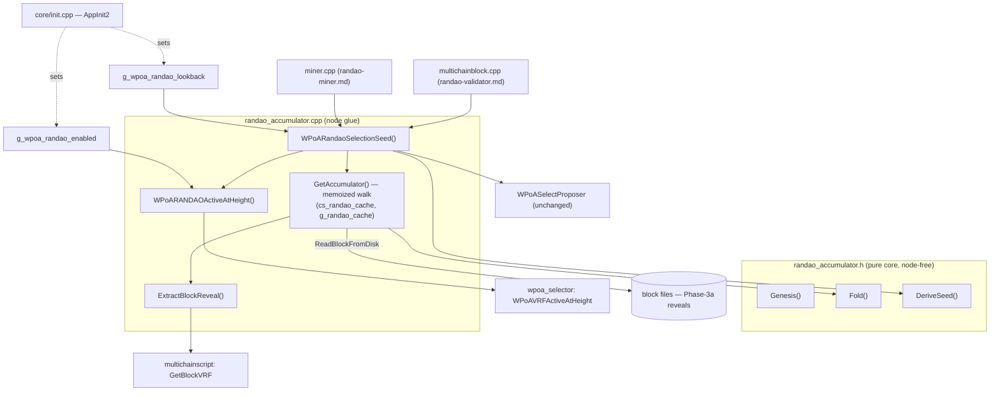

# `randao_accumulator.{h,cpp}` — Line-by-Line Walkthrough (Phase 3b)

> Exhaustive walkthrough of the **RANDAO beacon module**: every instruction, variable and
> library call in the two files that make up Phase 3b, why it is written the way it is, and
> how the file connects to the rest of the tree. This is the Phase 3b analogue of
> [vrf-wrapper.md](vrf-wrapper.md) (the Phase 3a deep dive).

The Phase 3b RANDAO beacon lives in two files, split the same way as the Phase 2 selector
([wpoa-selector.md](wpoa-selector.md)) and the Phase 3a VRF ([vrf-wrapper.md](vrf-wrapper.md)):

- [`randao_accumulator.h`](../randao_accumulator.h) — the **pure core** class
  `RandaoAccumulator` (`Genesis`, `Fold`, `DeriveSeed`), which is header-only, node-free and
  unit-tested, **plus** the *declarations* of the node glue.
- [`randao_accumulator.cpp`](../randao_accumulator.cpp) — the **node glue**: the runtime
  flag/lookback globals, the activation predicate, the memoized block-index walk, reveal
  extraction and the seed helper.

**Why this split.** The three functions in the header are the consensus-critical math: if
the miner and any validator compute them even one bit differently, they elect different
proposers and the chain forks (see [phase3b-implementation-guide.md §3](phase3b-implementation-guide.md#3-mental-model)).
Keeping them in a header that depends on **nothing but `CSHA256`** lets the Boost.Test unit
suite ([test/randao_accumulator_tests.cpp](../test/randao_accumulator_tests.cpp)) link them
against an independent reference implementation without pulling in the wallet or the node —
so a bug in the fold or the seed cannot hide behind shared node state. Everything that *does*
need the node (the block index, disk reads, the global flag) is quarantined in the `.cpp`.

For the design rationale and the end-to-end picture see
[phase3b-implementation-guide.md](phase3b-implementation-guide.md); for the formal model see
[thesis-project-overview.md §5.4–§5.5](thesis-project-overview.md#54-global-accumulator-update).

---

## Table of contents

1. [The pure core (`randao_accumulator.h`)](#1-the-pure-core-randao_accumulatorh)
2. [The node glue (`randao_accumulator.cpp`)](#2-the-node-glue-randao_accumulatorcpp)
3. [How the two call sites use it](#3-how-the-two-call-sites-use-it)
4. [Connections to the other files](#4-connections-to-the-other-files)

---

## 1. The pure core (`randao_accumulator.h`)

### 1.1 Includes and the class shape

```cpp
#include <stddef.h>
#include <stdint.h>

#include "crypto/sha256.h"
```

- **`<stddef.h>`** — for `size_t` (the length of the reveal buffer).
- **`<stdint.h>`** — for `uint32_t` (the block height passed to `DeriveSeed`). Fixed-width so
  the serialization below is the same on every platform.
- **`crypto/sha256.h`** — MultiChain's (Bitcoin-derived) `CSHA256` class, the single hash
  primitive `H` the whole module is built on. This is the **only** dependency of the core;
  there is deliberately no `uint256`, no `CBlock`, no logging, no `<cstring>`.

```cpp
class RandaoAccumulator
{
public:
    static const size_t HASH_SIZE = 32;
    ...
};
```

- Every method is **`static`** — the class is a namespace of pure functions, never
  instantiated. That is what makes it trivially unit-testable and thread-safe (no shared
  instance state).
- **`HASH_SIZE = 32`** — the byte width of every quantity the accumulator touches: a SHA-256
  digest, a block hash, a VRF reveal are all 32 bytes. Buffers and loops are sized from this
  one constant so the class can never disagree with itself about the width.

Every value crosses the API as a **raw `unsigned char*`**, not a `uint256` or a
`std::vector`. This keeps the core free of node types; the glue in the `.cpp` converts to and
from `uint256` at the boundary (§2.2).

### 1.2 `Genesis(unsigned char* out32)` — the base of the fold

```cpp
static void Genesis(unsigned char* out32)
{
    static const char* kTag = "wPoA-RANDAO-accumulator-genesis-v1";
    CSHA256 h;
    h.Write(reinterpret_cast<const unsigned char*>(kTag), strlen_const(kTag));
    h.Finalize(out32);
}
```

This is the accumulator value `R_tot` **before the first beacon-governed block** — the left
operand of the very first `Fold`. It implements
[§4.2 of the guide](phase3b-implementation-guide.md#4-the-algorithm):
`R_tot_base = SHA256("wPoA-RANDAO-accumulator-genesis-v1")`.

- **`kTag`** — a fixed, version-tagged domain-separation string. Using `SHA256(tag)` rather
  than all-zero means the initial accumulator has no exploitable structure and cannot be made
  to collide with a plausible reveal-derived value; the `-v1` suffix lets a future change to
  the construction pick a fresh, non-colliding base.
- **`CSHA256 h;`** — a fresh hasher on the stack. `CSHA256`'s contract is: `Write(ptr, len)`
  feeds bytes (and returns `*this` so calls can be chained — used in §1.4), and
  `Finalize(out)` writes exactly `CSHA256::OUTPUT_SIZE` (= 32) bytes to `out` and resets.
- **`reinterpret_cast<const unsigned char*>(kTag)`** — `Write` takes bytes; the tag is a
  `char*`, so the cast reinterprets the same storage as unsigned bytes (no copy, no
  conversion).
- **`strlen_const(kTag)`** — the tag length *excluding* the terminating NUL (see §1.5); the
  NUL is not hashed, matching the reference implementation the unit test checks against.
- **`h.Finalize(out32)`** — writes the 32-byte genesis digest into the caller's buffer.

### 1.3 `Fold(...)` — one accumulator step

```cpp
static void Fold(const unsigned char* rtot_prev32,
                 const unsigned char* reveal, size_t reveal_len,
                 unsigned char* rtot_out32)
{
    // t = H(reveal)
    unsigned char t[HASH_SIZE];
    CSHA256().Write(reveal, reveal_len).Finalize(t);

    // x = R_tot_prev ⊕ t   (into a local buffer so in/out may alias)
    unsigned char x[HASH_SIZE];
    for (size_t i = 0; i < HASH_SIZE; i++)
    {
        x[i] = (unsigned char)(rtot_prev32[i] ^ t[i]);
    }

    // R_tot_out = H(x)
    CSHA256().Write(x, HASH_SIZE).Finalize(rtot_out32);
}
```

Implements the thesis §5.4 recurrence `R_tot[n] = H( R_tot[n-1] ⊕ H(R[n]) )` in three steps:

1. **`t = SHA256(reveal)`.** `CSHA256()` constructs a temporary hasher; `.Write(reveal,
   reveal_len)` hashes the reveal; `.Finalize(t)` writes the 32-byte digest into the local
   `t`. Hashing the reveal *first* normalizes it to exactly 32 bytes (the reveal may in
   principle be any length — the parameter is `reveal_len`) and destroys any internal
   structure before it meets the XOR.
2. **`x = rtot_prev ⊕ t`.** The byte-wise XOR over all `HASH_SIZE` bytes, written into a
   **local** buffer `x`. Writing into `x` (not into `rtot_out32`) is what makes **in/out
   aliasing safe**: a caller may pass the same pointer for `rtot_prev32` and `rtot_out32`
   (fold in place), and the previous value is still fully read before anything is written
   back. The `(unsigned char)` cast silences the integer-promotion warning `^` produces.
3. **`rtot_out = SHA256(x)`.** The final hash of the XORed value. This outer hash is the
   crucial part: a *bare* XOR accumulator is linear, so a last revealer who could choose its
   reveal freely could cancel earlier contributions; wrapping the XOR in `H(·)` destroys that
   linearity. (The VRF makes the reveal itself unchooseable — this outer hash is the
   belt-and-braces algebraic defense.)

**Order sensitivity.** Because each step hashes, `Fold(Fold(g, A), B) != Fold(Fold(g, B),
A)`: folding reveals in a different order gives a different result. That is *intended* — it
is exactly what makes `R_tot` a function of the **ordered** reveal history (a chain, not a
set). The glue therefore always folds strictly in ascending block order (§2.4), and the unit
test asserts the inequality.

### 1.4 `DeriveSeed(...)` — the selection seed

```cpp
static void DeriveSeed(const unsigned char* rtot_lookback32,
                       const unsigned char* h_prev32,
                       uint32_t height,
                       unsigned char* seed_out32)
{
    unsigned char height_be[4];
    height_be[0] = (unsigned char)((height >> 24) & 0xff);
    height_be[1] = (unsigned char)((height >> 16) & 0xff);
    height_be[2] = (unsigned char)((height >>  8) & 0xff);
    height_be[3] = (unsigned char)( height        & 0xff);

    CSHA256()
        .Write(rtot_lookback32, HASH_SIZE)
        .Write(h_prev32, HASH_SIZE)
        .Write(height_be, sizeof(height_be))
        .Finalize(seed_out32);
}
```

Implements the thesis §5.5 seed `seed[n+1] = H( R_tot[n-k] ‖ h[n-1] ‖ n )`.

- **`height_be[4]` — manual big-endian serialization.** `height` (a `uint32_t`) is written
  out most-significant byte first by shifting and masking (`>> 24`, `>> 16`, `>> 8`, then the
  low byte), each masked with `& 0xff`. This is done **by hand** rather than
  `memcpy`-ing the `uint32_t` precisely *because it is consensus-critical*: a raw `memcpy`
  would embed the host's byte order (little-endian on x86, big-endian elsewhere), so two
  architectures would hash different bytes for the same height and fork. The explicit
  big-endian layout is identical on every platform.
- **The chained `Write`s.** `CSHA256()` builds a temporary; the three `.Write(...)` calls
  each return the same hasher by reference, so they chain into one expression that feeds, in
  order, the 32-byte looked-back accumulator, the 32-byte previous block hash, and the 4-byte
  height. **Order matters** — it defines the exact preimage; the validator feeds the same
  three fields in the same order.
- **The roles of the three terms.** `R_tot[n-k]` is the mixed, grinding-resistant beacon
  value; `h[n-1]` anchors the seed to the chain's actually-finalized parent (so the seed
  cannot be precomputed before that block exists); `n` (the height) disambiguates rounds.
  Because `h[n-1]` and `n` both advance every block, **the seed is fresh every round even
  when `R_tot[n-k]` moves slowly** (e.g. large lookback `k`) — consecutive rounds can never
  reuse a seed.
- **`.Finalize(seed_out32)`** — writes the 32-byte selection seed. This is the value handed
  verbatim to `WPoASelectProposer` at both call sites (§3).

### 1.5 `strlen_const` — the one private helper

```cpp
private:
    static size_t strlen_const(const char* s)
    {
        size_t n = 0;
        while (s[n] != '\0') n++;
        return n;
    }
```

A three-line NUL-terminated-string length. It exists **only** so `Genesis` can measure its
tag without `#include <cstring>` — keeping the header's include set to just `CSHA256` +
`<stddef.h>`/`<stdint.h>`, so the node-free unit-test translation unit stays minimal. It is
private because nothing outside the class needs it.

### 1.6 Glue declarations (bottom of the header)

```cpp
class CBlockIndex;   // forward-declared: the glue walks the block index

extern bool g_wpoa_randao_enabled;
extern int  g_wpoa_randao_lookback;
#define MC_WPOA_DEFAULT_RANDAO_LOOKBACK 1

bool WPoARANDAOActiveAtHeight(int height);
bool WPoARandaoSelectionSeed(const CBlockIndex* pindexTip, unsigned char* seed_out);
```

- **`class CBlockIndex;`** — a forward declaration, not an include. The glue's signatures
  mention `CBlockIndex*`, but the *header* never dereferences it, so a forward declaration is
  enough and the heavy `core/main.h` stays out of every file that only needs the math.
- **`extern bool g_wpoa_randao_enabled;` / `extern int g_wpoa_randao_lookback;`** — declare
  (do not define) the two runtime globals; the single definition lives in the `.cpp` (§2.1).
  `extern` lets `miner.cpp`, `multichainblock.cpp` and `init.cpp` all see them while exactly
  one translation unit owns the storage.
- **`#define MC_WPOA_DEFAULT_RANDAO_LOOKBACK 1`** — the default lookback `k`. Used in two
  places: the initializer of `g_wpoa_randao_lookback` (§2.1) and the `GetArg` default in
  `AppInit2` ([node-startup.md §2.7](node-startup.md)). A macro (not a `const int`) so it can
  appear in the `strprintf` help string as well.
- **The two function declarations** — `WPoARANDAOActiveAtHeight` (the activation gate) and
  `WPoARandaoSelectionSeed` (the seed helper), both defined in the `.cpp`. These are the
  *only* two symbols the rest of the tree calls; everything else in the glue is `static`
  (file-local).

None of these declarations is compiled into the unit test — it includes the header but only
references the `RandaoAccumulator` class, never the `extern`s or the glue functions, so it
links without the node.

---

## 2. The node glue (`randao_accumulator.cpp`)

### 2.1 Includes and globals

```cpp
#include "wpoa/randao_accumulator.h"

#include "wpoa/wpoa_selector.h"          // WPoAVRFActiveAtHeight (the beacon gate)
#include "core/main.h"                   // CBlockIndex, CBlock, ReadBlockFromDisk, BLOCK_HAVE_DATA
#include "chain/chain.h"                 // CBlockIndex members (defensive; via main.h)
#include "protocol/multichainscript.h"   // mc_Script, GetBlockVRF, MC_SCR_TYPE_SCRIPTPUBKEY
#include "utils/util.h"                  // LogPrint, LogPrintf, fDebug
#include "utils/sync.h"                  // CCriticalSection, LOCK

#include <map>
#include <vector>
#include <string.h>

using namespace std;
```

Each include earns its place:

- **`wpoa/wpoa_selector.h`** — for `WPoAVRFActiveAtHeight`, the Phase 3a beacon gate the
  RANDAO requirement composes with (§2.5). Reusing it (rather than re-deriving the height
  rule) guarantees the RANDAO seed engages on *exactly* the heights that carry a reveal.
- **`core/main.h`** — the block-index machinery: `CBlockIndex` (a node in the block tree,
  with `->pprev`, `->nHeight`, `->nStatus`, `->GetBlockHash()`), `CBlock` (a loaded block),
  `ReadBlockFromDisk(block, pindex)` (loads a block's full body from the block files), and the
  `BLOCK_HAVE_DATA` status bit (set when a block's body is actually on disk).
- **`chain/chain.h`** — a defensive include for the `CBlockIndex` member layout (normally
  reached transitively through `main.h`); harmless if redundant.
- **`protocol/multichainscript.h`** — `mc_Script` (MultiChain's script decoder),
  `GetBlockVRF` (the decoder that pulls the Phase-3a reveal suffix out of a signature
  element — see [block-vrf-encoding.md](block-vrf-encoding.md)), and the
  `MC_SCR_TYPE_SCRIPTPUBKEY` script-type tag.
- **`utils/util.h`** — `LogPrintf` (always-on log), `LogPrint(category, ...)` (category-gated
  log) and the `fDebug` flag.
- **`utils/sync.h`** — `CCriticalSection` (a recursive mutex) and the `LOCK(cs)` macro
  (RAII lock guard) that protect the cache.
- **`<map>` / `<vector>`** — the cache (`std::map`) and the back-walk work list
  (`std::vector`). **`<string.h>`** — `memcpy`.

```cpp
bool g_wpoa_randao_enabled = false;
int  g_wpoa_randao_lookback = MC_WPOA_DEFAULT_RANDAO_LOOKBACK;

static CCriticalSection cs_randao_cache;
static std::map<uint256, uint256> g_randao_cache;
```

- **`g_wpoa_randao_enabled = false`** — the definition of the flag declared `extern` in the
  header, defaulting **off** so a plain / Phase-3a node is byte-for-byte unchanged. Set once
  from `-enablewpoarandao` in `AppInit2`.
- **`g_wpoa_randao_lookback = MC_WPOA_DEFAULT_RANDAO_LOOKBACK`** — the lookback `k`, default
  1, set once from `-wpoarandaolookback`.
- **`cs_randao_cache`** — a **dedicated leaf lock** (used nowhere else in the codebase) that
  serializes access to the cache. Because it is private to this module and never held while
  taking another lock, it cannot participate in a lock-order inversion.
- **`g_randao_cache`** — the memoization table: `block hash → R_tot at that block`. Keying by
  **block hash** (not height, not a `CBlockIndex*`) is what makes it **reorg-safe**: a hash
  uniquely determines its entire ancestor chain, so a fork's `R_tot` computed under the
  fork's block hashes can never alias the main chain's entry for the same height.

### 2.2 `GenesisAccumulator()` — core → `uint256` bridge

```cpp
static uint256 GenesisAccumulator()
{
    unsigned char g[RandaoAccumulator::HASH_SIZE];
    RandaoAccumulator::Genesis(g);
    uint256 out;
    memcpy(out.begin(), g, RandaoAccumulator::HASH_SIZE);
    return out;
}
```

Wraps the byte-oriented core into a `uint256` so the glue can work in the node's native hash
type. `RandaoAccumulator::Genesis` fills a 32-byte stack buffer; `memcpy(out.begin(), g, 32)`
copies it into a `uint256` (`uint256::begin()` yields a pointer to its 32 bytes of storage).
Cheap enough to recompute on every call, which avoids a shared mutable static.

### 2.3 `ExtractBlockReveal(...)` — pull a block's reveal off the chain

```cpp
static bool ExtractBlockReveal(const CBlock& block,
                               unsigned char* reveal_out, int* reveal_len)
{
    mc_Script scriptTmp; // local instance -> thread-safe (no shared temp buffers)

    for (unsigned int i = 0; i < block.vtx.size(); i++)
    {
        const CTransaction& tx = block.vtx[i];
        if (!tx.IsCoinBase())
            continue;

        for (unsigned int j = 0; j < tx.vout.size(); j++)
        {
            const CScript& spk = tx.vout[j].scriptPubKey;
            if (spk.size() == 0)
                continue;

            scriptTmp.Clear();
            CScript::const_iterator pc = spk.begin();
            scriptTmp.SetScript((unsigned char*)(&pc[0]), (size_t)(spk.end() - pc),
                                MC_SCR_TYPE_SCRIPTPUBKEY);

            for (int e = 0; e < scriptTmp.GetNumElements(); e++)
            {
                scriptTmp.SetElement(e);
                unsigned char proof_buf[255];
                int rsize = *reveal_len;
                int psize = sizeof(proof_buf);
                if (scriptTmp.GetBlockVRF(reveal_out, &rsize, proof_buf, &psize) == 0)
                {
                    *reveal_len = rsize;
                    return true;
                }
            }
        }
    }
    return false;
}
```

This is the reveal reader. It is a near-copy of `FindBlockVRF` in
[multichainblock.cpp](../../protocol/multichainblock.cpp) (see
[vrf-verifier.md §1](vrf-verifier.md)), with **one deliberate difference**:

- **`mc_Script scriptTmp;` — a stack-local decoder, NOT `mc_gState->m_TmpScript1`.**
  `m_TmpScript1` is the single-threaded validation-path scratch object. The accumulator runs
  on the **miner thread** as well as the validation thread (it computes the *next* selection
  seed during block production), so touching the shared scratch here would race. A local
  instance is self-contained — exactly the choice Phase 1 makes in `DecodeWeightRecord` and
  the reason [phase3b §5.5](phase3b-implementation-guide.md#5-design-decisions) duplicates the
  small loop instead of calling `FindBlockVRF`.

The scan itself:

- **`for i over block.vtx`** — every transaction in the block; skip any that is not
  `IsCoinBase()` (`continue`). The block signature and its VRF suffix live only in the
  coinbase OP_RETURN.
- **`for j over tx.vout`** — every output of the coinbase. Skip empty scripts
  (`spk.size() == 0`).
- **Decode the output script.** `scriptTmp.Clear()` resets the decoder; `pc = spk.begin()`
  is an iterator to the script bytes; `SetScript((unsigned char*)(&pc[0]), spk.end()-pc,
  MC_SCR_TYPE_SCRIPTPUBKEY)` hands the raw byte range and its length to the decoder, tagged
  as a `scriptPubKey`. `&pc[0]` takes the address of the first byte; `spk.end() - pc` is the
  byte length as a pointer difference.
- **`for e over scriptTmp.GetNumElements()`** — every decoded element. `SetElement(e)` makes
  element `e` current, then `GetBlockVRF(reveal_out, &rsize, proof_buf, &psize)` tries to
  parse a VRF suffix out of it.
  - `rsize` is initialized to `*reveal_len` (the caller's buffer capacity) and overwritten
    with the actual decoded reveal length; `proof_buf[255]` and `psize` receive the proof
    (255 = the max a one-byte length prefix can express, so `GetBlockVRF` can never
    overflow). The proof is decoded but **discarded here** — the accumulator only needs the
    reveal `R[n]`; the proof was already verified when the block was accepted
    ([vrf-verifier.md §2](vrf-verifier.md)).
  - `GetBlockVRF` returns **`0` (`MC_ERR_NOERROR`)** only for the one signature element that
    actually carries a VRF suffix, and a non-zero error for every other element
    ([block-vrf-encoding.md §5](block-vrf-encoding.md)). On `0`, store the real length
    (`*reveal_len = rsize`) and return `true`.
- **`return false`** — no coinbase output carried a reveal. On an accepted beacon-governed
  chain this never happens (every such block passed `VerifyBlockMinerWPoA`); when it does,
  the caller folds a deterministic fallback (§2.4).

### 2.4 `GetAccumulator(pindex)` — the memoized walk

Returns `R_tot` **at** `pindex`: the fold of every beacon-governed ancestor's reveal, from
the first governed block up to and including `pindex`.

```cpp
static uint256 GetAccumulator(const CBlockIndex* pindex)
{
    const uint256 genesis = GenesisAccumulator();

    if (pindex == NULL)
        return genesis;
    if (!WPoAVRFActiveAtHeight(pindex->nHeight))
        return genesis;
```

- **`genesis`** — the base value (§2.2), computed once per call.
- **NULL `pindex`** → genesis. There is no chain to fold.
- **Pre-beacon `pindex`** (`!WPoAVRFActiveAtHeight(pindex->nHeight)`) → genesis. Blocks before
  the beacon engages carry no reveal and contribute nothing, so `R_tot` just below the first
  governed block *is* the genesis constant.

```cpp
    LOCK(cs_randao_cache);

    std::vector<const CBlockIndex*> pending;
    const CBlockIndex* p = pindex;
    uint256 rtot = genesis;
    while (p != NULL && WPoAVRFActiveAtHeight(p->nHeight))
    {
        std::map<uint256, uint256>::iterator it = g_randao_cache.find(p->GetBlockHash());
        if (it != g_randao_cache.end())
        {
            rtot = it->second;
            break;
        }
        pending.push_back(p);
        p = p->pprev;
    }
```

- **`LOCK(cs_randao_cache)`** — takes the leaf lock for the whole walk and the map
  read/write. This RAII guard (from `utils/sync.h`) releases on scope exit. It serializes the
  two threads that call in (miner + validator), so the cache is always consistent.
- **The back-walk.** Starting at `pindex`, follow `->pprev` toward genesis, collecting each
  **uncached, governed** ancestor into `pending`. Stop as soon as:
  - a block's hash is **already cached** — its stored `R_tot` becomes the fold's base
    (`rtot = it->second; break;`), so we never re-fold history that was folded before; or
  - the walk **leaves the governed range** (`p == NULL` or `!WPoAVRFActiveAtHeight`) — the
    base stays the genesis value.
  This is what makes the walk **amortized O(1) per new block**: on a live chain the tip's
  parent is already cached, so `pending` usually holds just the one new block.

```cpp
    for (int i = (int)pending.size() - 1; i >= 0; i--)
    {
        const CBlockIndex* b = pending[i];
        unsigned char out[RandaoAccumulator::HASH_SIZE];

        unsigned char reveal[255];
        int reveal_len = sizeof(reveal);
        CBlock blk;

        if (((b->nStatus & BLOCK_HAVE_DATA) != 0) && ReadBlockFromDisk(blk, b) &&
            ExtractBlockReveal(blk, reveal, &reveal_len))
        {
            RandaoAccumulator::Fold(rtot.begin(), reveal, (size_t)reveal_len, out);
        }
        else
        {
            uint256 h = b->GetBlockHash();
            RandaoAccumulator::Fold(rtot.begin(), h.begin(), RandaoAccumulator::HASH_SIZE, out);
            LogPrintf("[wPoA-RANDAO] WARNING: reveal unavailable for block %s (height %d); "
                      "using deterministic fallback fold\n",
                      b->GetBlockHash().ToString().c_str(), b->nHeight);
        }

        uint256 next;
        memcpy(next.begin(), out, RandaoAccumulator::HASH_SIZE);
        g_randao_cache[b->GetBlockHash()] = next;
        rtot = next;
    }

    return rtot;
}
```

- **Fold forward, oldest first.** `pending` was filled newest→oldest, so the loop iterates it
  **in reverse** (`i` from `size()-1` down to `0`) to fold in **ascending block order** — the
  order the fold's order-sensitivity (§1.3) requires.
- **Read the reveal — the happy path.** The three-part guard, evaluated left to right with
  short-circuit `&&`:
  1. `(b->nStatus & BLOCK_HAVE_DATA) != 0` — the block's body is actually on disk (not just a
     header). Cheap bit test first, so a headers-only block skips the disk read.
  2. `ReadBlockFromDisk(blk, b)` — load the full block; false on I/O failure.
  3. `ExtractBlockReveal(blk, reveal, &reveal_len)` — pull the reveal (§2.3).

  All three true → `Fold(rtot.begin(), reveal, reveal_len, out)` folds the reveal into the
  running value. `rtot.begin()` is the current accumulator's bytes; `out` receives the next.
- **The deterministic fallback — the `else`.** If any guard fails (block data unavailable),
  fold the **block hash** instead (`Fold(rtot.begin(), h.begin(), 32, out)`) and log a
  warning with `LogPrintf`. This branch is **unreachable on an accepted chain** — every
  governed block passed `VerifyBlockMinerWPoA`, which rejects a missing/invalid reveal — but
  if it ever fires (e.g. pruning removed the body), folding a *deterministic* value keeps
  every node's `R_tot` in agreement rather than letting a node that *can* read the block
  diverge from one that cannot. The functional test asserts this path is taken **zero** times
  ([phase3b §12.2](phase3b-implementation-guide.md#12-tests)).
- **Cache and advance.** `memcpy(next.begin(), out, 32)` copies the fold result into a
  `uint256`; `g_randao_cache[b->GetBlockHash()] = next` memoizes it under the block's hash;
  `rtot = next` carries it into the next iteration.
- **`return rtot`** — after the loop, `rtot` is `R_tot` at `pindex`.

### 2.5 `WPoARANDAOActiveAtHeight(height)` — the activation gate

```cpp
bool WPoARANDAOActiveAtHeight(int height)
{
    return g_wpoa_randao_enabled && WPoAVRFActiveAtHeight(height);
}
```

The RANDAO seed engages iff (a) the operator turned it on (`g_wpoa_randao_enabled`) **and**
(b) the VRF beacon already governs the height (`WPoAVRFActiveAtHeight`, see
[wpoa-selector.md §5](wpoa-selector.md)). The `&&` short-circuits on the cheap flag first.

The **AND with the VRF gate** is the load-bearing part: the accumulator *consumes* the
per-block VRF reveals, so it can only run where those reveals are mandated — a lone
`-enablewpoarandao` (VRF off) is inert, and `AppInit2` warns about it
([node-startup.md §2.7](node-startup.md)). Being a **pure function of shared data** (two
process-wide flags + chain params + the height argument), the miner and every validator
compute the same answer from the height alone, so they never disagree about which blocks are
beacon-seeded.

### 2.6 `WPoARandaoSelectionSeed(pindexTip, seed_out)` — the public helper

Computes `seed[n+1]` for the block that follows `pindexTip` (height `n`). This is the one
function the two call sites actually invoke.

```cpp
bool WPoARandaoSelectionSeed(const CBlockIndex* pindexTip, unsigned char* seed_out)
{
    if (pindexTip == NULL)
        return false;

    const int n = pindexTip->nHeight;
    int k = g_wpoa_randao_lookback;
    if (k < 0)
        k = 0;
```

- **NULL tip → `false`.** The one failure return; the caller then keeps its prev-hash seed
  default. (`seed_out` is left untouched.)
- **`n`** — the tip height; the next block is `n+1`.
- **`k`** — the lookback, snapshotted from the global and defensively clamped to `≥ 0`
  (`AppInit2` already rejects negatives, so this is belt-and-braces).

```cpp
    int target = n - k;
    if (target < 0)
        target = 0;
    const CBlockIndex* pAnc = pindexTip;
    while (pAnc != NULL && pAnc->nHeight > target)
        pAnc = pAnc->pprev;
    uint256 rtot = GetAccumulator(pAnc);
```

- **`target = max(n - k, 0)`** — the height whose accumulator seeds the election,
  `R_tot[n-k]`. Clamping at 0 handles a lookback larger than the current height (early chain):
  the target collapses to the base and `GetAccumulator` returns the genesis-based value.
- **Walk to the target ancestor.** From the tip, follow `->pprev` while the height is above
  `target`. On exit `pAnc` is the ancestor at height `target` (or NULL if the walk ran off the
  start, in which case `GetAccumulator(NULL)` returns genesis).
- **`rtot = GetAccumulator(pAnc)`** — `R_tot[n-k]` via the memoized walk (§2.4).

```cpp
    uint256 hprev = (pindexTip->pprev != NULL) ? pindexTip->pprev->GetBlockHash()
                                               : pindexTip->GetBlockHash();

    RandaoAccumulator::DeriveSeed(rtot.begin(), hprev.begin(), (uint32_t)n, seed_out);
```

- **`hprev = h[n-1]`** — the hash of the block *before* the tip, matching the thesis's
  `h[n-1]` term. It falls back to the tip's own hash only where `pprev` is absent (height 0),
  which is never reached once the beacon engages (activation height ≥ setup ≥ 1).
- **`DeriveSeed(rtot, hprev, n, seed_out)`** — the pure §1.4 derivation over
  `(R_tot[n-k], h[n-1], n)`, writing the 32-byte seed into the caller's buffer. `(uint32_t)n`
  is the height cast to the fixed-width type `DeriveSeed` serializes big-endian.

```cpp
    if (fDebug)
    {
        uint256 seed;
        memcpy(seed.begin(), seed_out, RandaoAccumulator::HASH_SIZE);
        LogPrint("wpoa", "[wPoA-RANDAO] seed for height=%d  k=%d  R_tot[%d]=%s  h[%d]=%s -> seed=%s\n",
                 n + 1, k, target, rtot.ToString().c_str(),
                 n - 1, hprev.ToString().c_str(), seed.ToString().c_str());
    }

    return true;
}
```

- **The trace.** Guarded by `fDebug` (so it costs nothing in production) and emitted with
  `LogPrint("wpoa", ...)` (only when `-debug=wpoa`). It prints the derived seed together with
  every input — `R_tot[target]`, `h[n-1]`, the height — which is the `[wPoA-RANDAO] seed`
  evidence the functional test greps to prove the beacon actually engaged
  ([phase3b §12.2](phase3b-implementation-guide.md#12-tests)).
- **`return true`** — a seed was produced; the caller overwrites its prev-hash default with
  it.

---

## 3. How the two call sites use it

Both call sites do the **same three things**: default the selection seed to the previous
block hash, then overwrite it with `WPoARandaoSelectionSeed(...)` when
`WPoARANDAOActiveAtHeight(...)` is true, then feed the result to the *unchanged*
`WPoASelectProposer`. The miner passes its current tip; the validator passes
`pindexNew->pprev` — **the same tip the honest miner saw** — so both derive an identical seed
and agree on the elected proposer.

```cpp
// identical shape at both sites:
uint256 hSeed = tip->GetBlockHash();                  // Phase 3a default
unsigned char randao_seed[32];
if (WPoARANDAOActiveAtHeight(height) && WPoARandaoSelectionSeed(tip, randao_seed))
    memcpy(hSeed.begin(), randao_seed, sizeof(randao_seed));   // Phase 3b overwrite
std::string sProposer = WPoASelectProposer(hSeed.begin(), hSeed.size(), height);
```

The per-site walkthroughs (which tip, which guarantees, why the gate is on both the predicate
*and* the return value) are in:

- [randao-miner.md](randao-miner.md) — `miner/miner.cpp`,
  `GetMinerAndExpectedMiningStartTime`.
- [randao-validator.md](randao-validator.md) — `protocol/multichainblock.cpp`,
  `VerifyBlockMinerWPoA`.

---

## 4. Connections to the other files



- **`crypto/sha256.h`** (`CSHA256`) — the hash `H` behind `Genesis`/`Fold`/`DeriveSeed`. The
  *only* dependency of the pure core.
- **`wpoa/wpoa_selector.h`** — `WPoAVRFActiveAtHeight` (the beacon gate `WPoARANDAOActiveAtHeight`
  composes with) and `WPoASelectProposer` (the unchanged election the seed feeds). See
  [wpoa-selector.md](wpoa-selector.md).
- **`protocol/multichainscript.h`** — `GetBlockVRF`, used by `ExtractBlockReveal` to decode
  the Phase-3a reveal. See [block-vrf-encoding.md](block-vrf-encoding.md).
- **`core/main.h`** — `CBlockIndex`, `CBlock`, `ReadBlockFromDisk`, `BLOCK_HAVE_DATA` for the
  index walk and per-block reveal reads.
- **`core/init.cpp`** — binds `g_wpoa_randao_enabled` / `g_wpoa_randao_lookback` from the
  flags. See [node-startup.md §2.7](node-startup.md).
- **`miner/miner.cpp`** and **`protocol/multichainblock.cpp`** — the two consumers of
  `WPoARandaoSelectionSeed`. See [randao-miner.md](randao-miner.md) and
  [randao-validator.md](randao-validator.md).

---

**Related documents:**
[phase3b-implementation-guide.md](phase3b-implementation-guide.md) ·
[randao-miner.md](randao-miner.md) ·
[randao-validator.md](randao-validator.md) ·
[wpoa-selector.md](wpoa-selector.md) ·
[vrf-wrapper.md](vrf-wrapper.md) ·
[node-startup.md](node-startup.md) ·
[thesis-project-overview.md](thesis-project-overview.md)
