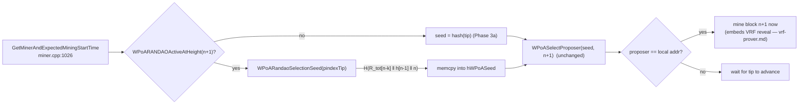

# `miner/miner.cpp` (wPoA Phase 3b — the RANDAO seed on the miner side)

> Documentation of the **miner-side integration** of the RANDAO beacon seed: how the block
> producer, when the beacon governs the next height, seeds proposer selection from the
> accumulator instead of the raw previous block hash. `miner.cpp` is a large file; this doc
> covers **only** the Phase 3b seed swap added to `GetMinerAndExpectedMiningStartTime`. The
> Phase 2 election in the *same* function is documented in
> [miner-integration.md](miner-integration.md); the Phase 3a VRF *reveal* production (a
> different function, `CreateBlockSignature`, in the same file) is in
> [vrf-prover.md](vrf-prover.md).

This is a **modified host file**, not a new module. The change is a small, self-contained
block inside the existing wPoA election branch. The include added at the top of the file:

```cpp
#include "wpoa/randao_accumulator.h"   // miner.cpp:27 — WPoARANDAOActiveAtHeight, WPoARandaoSelectionSeed
```

(`WPoAActiveAtHeight` / `WPoASelectProposer` come from `wpoa/wpoa_selector.h`, already
included for Phase 2; `WPoAVRF` from `wpoa/vrf_wrapper.h`, included for Phase 3a.)

## 1. Where the change lives and why there

The function (`miner.cpp:1026`):

```cpp
double GetMinerAndExpectedMiningStartTime(CWallet *pwallet,CPubKey *lpkMiner,
        set<CTxDestination> *lpsMinerPool,double *lpdMiningStartTime,double *lpdActiveMiners,
        uint256 *lphLastBlockHash,int *lpnMemPoolSize,double wAvBlockTime)
```

This is the miner's polling entry point: called once per new tip, it decides **whether this
node is the elected proposer for the next height** and, if so, returns "mine now". The wPoA
branch is gated by `WPoAActiveAtHeight(pindexTip->nHeight + 1)` (`miner.cpp:1099`) and, by the
insertion point, has already:

```cpp
int nWPoAHeight=pindexTip->nHeight+1;                       // the height being elected
...
pwallet->GetKeyFromAddressBook(kThisMiner,MC_PTP_MINE);     // this node's mining key
...
std::string sLocalAddr=CBitcoinAddress(kThisMiner.GetID()).ToString();  // its address
```

So at the insertion point the branch holds the height it is electing (`nWPoAHeight`), the
tip it is building on (`pindexTip`), and this node's own address (`sLocalAddr`). The seed swap
sits **immediately before `WPoASelectProposer`** — the last thing computed before the
election is run — because that is the only value the swap changes.

## 2. The added block, line by line

`miner.cpp:1116-1127`:

```cpp
// wPoA Phase 3b: when the RANDAO beacon governs this height, seed the
// election from the accumulator (seed[n+1]=H(R_tot[n-k]‖h[n-1]‖n)) rather
// than the plain previous block hash. The validator derives the identical
// seed from the same tip in VerifyBlockMinerWPoA, so both agree on the
// proposer. Falls back to the prev-hash seed if RANDAO is inactive.
uint256 hWPoASeed=pindexTip->GetBlockHash();
unsigned char randao_seed[32];
if(WPoARANDAOActiveAtHeight(nWPoAHeight) && WPoARandaoSelectionSeed(pindexTip,randao_seed))
{
    memcpy(hWPoASeed.begin(),randao_seed,sizeof(randao_seed));
}
std::string sProposer=WPoASelectProposer(hWPoASeed.begin(),hWPoASeed.size(),nWPoAHeight);
```

### `uint256 hWPoASeed=pindexTip->GetBlockHash();`
The **default seed** — the plain previous block hash, exactly the Phase 2/3a behavior.
`pindexTip` is the current tip; `GetBlockHash()` returns its 32-byte hash. Initializing here
means that if the beacon is inactive (or the seed helper declines), the code below leaves
`hWPoASeed` as the prev-hash seed and nothing else in the function changes.

### `unsigned char randao_seed[32];`
A 32-byte stack buffer to receive the derived beacon seed. 32 = `RandaoAccumulator::HASH_SIZE`
= the width of a SHA-256 seed. Stack-allocated — no heap, no cleanup.

### `if(WPoARANDAOActiveAtHeight(nWPoAHeight) && WPoARandaoSelectionSeed(pindexTip,randao_seed))`
The overwrite is guarded by **two** conditions, short-circuited left to right:

- **`WPoARANDAOActiveAtHeight(nWPoAHeight)`** — the cheap gate: the flag `AND`
  `WPoAVRFActiveAtHeight(nWPoAHeight)` (see [randao-accumulator.md §2.5](randao-accumulator.md)).
  Note it is evaluated at **`nWPoAHeight` (= the height being elected, `n+1`)**, not the tip
  height — the seed governs the block about to be produced. When false the whole `&&`
  short-circuits and the block is skipped: no accumulator walk, no disk reads.
- **`WPoARandaoSelectionSeed(pindexTip,randao_seed)`** — only evaluated if the gate passed.
  It runs the memoized accumulator walk over `pindexTip` and writes the derived seed into
  `randao_seed` ([randao-accumulator.md §2.6](randao-accumulator.md)). It returns `false`
  only for a NULL tip; guarding on the return value (not just the predicate) means a
  degenerate tip cleanly leaves the prev-hash default in place rather than using an
  unwritten buffer.

### `memcpy(hWPoASeed.begin(),randao_seed,sizeof(randao_seed));`
On success, overwrite the default seed with the beacon seed. `hWPoASeed.begin()` is the
`uint256`'s 32-byte storage; `sizeof(randao_seed)` = 32. After this, `hWPoASeed` **is** the
RANDAO seed but still a `uint256`, so the call below is byte-identical in shape to Phase 2.

### `std::string sProposer=WPoASelectProposer(hWPoASeed.begin(),hWPoASeed.size(),nWPoAHeight);`
The **unchanged** Efraimidis–Spirakis election. It receives the seed bytes
(`hWPoASeed.begin()`, `hWPoASeed.size()` = 32) and the height, and returns the elected
proposer's address. This is the single line that consumes the seed — everything Phase 3b does
is upstream of it, which is why the scoring/argmin/tie-break and the weight read are provably
untouched (the election is uniform in the seed, so swapping the seed source cannot change the
*distribution*, only which validator wins a given round — see
[phase3b §1](phase3b-implementation-guide.md#1-what-this-module-does)).

## 3. What happens after (unchanged)

The existing logic follows verbatim:

```cpp
if(!sProposer.empty() && sProposer==sLocalAddr)
    *lpdMiningStartTime=mc_TimeNowAsDouble();     // elected → mine now
else
    *lpdMiningStartTime=mc_TimeNowAsDouble()+3600; // not our slot → wait
```

If the elected proposer is this node, mine now; otherwise sleep until the tip advances. The
RANDAO change only altered *which* address `sProposer` holds — the decision that consumes it
is Phase 2 code.

## 4. Effect on the native / Phase 2 / Phase 3a path

- `-enablewpoarandao` **off** (or VRF off, so `WPoARANDAOActiveAtHeight` is false) → the `if`
  body never runs; `hWPoASeed` stays the prev-block hash and the election is byte-for-byte the
  Phase 3a behavior.
- `-enablewpoarandao` **on** at a governed height → the election is seeded by
  `H(R_tot[n-k] ‖ h[n-1] ‖ n)` instead.

The block adds no locks of its own; the only shared state it touches is read through
`WPoARandaoSelectionSeed`, whose cache is guarded internally by `cs_randao_cache`
([randao-accumulator.md §2.4](randao-accumulator.md)).

## 5. Miner ↔ validator symmetry (the seed)

The whole point is that this seed matches the one the validator computes. The mirror site is
[randao-validator.md](randao-validator.md):

| | Miner (`miner.cpp`, `GetMinerAndExpectedMiningStartTime`) | Validator (`multichainblock.cpp`, `VerifyBlockMinerWPoA`) |
|---|---|---|
| Height | `nWPoAHeight = pindexTip->nHeight + 1` | `pindexNew->nHeight` (== that same `n+1`) |
| Gate | `WPoARANDAOActiveAtHeight(nWPoAHeight)` | `WPoARANDAOActiveAtHeight(pindexNew->nHeight)` |
| Tip passed to the helper | `pindexTip` (the miner's tip, height `n`) | `pindexNew->pprev` (the block's parent — the **same** height-`n` tip) |
| Default seed | `pindexTip->GetBlockHash()` | `pindexNew->pprev->GetBlockHash()` |
| Election | `WPoASelectProposer(seed, nWPoAHeight)` | `WPoASelectProposer(seed, pindexNew->nHeight)` |

Because the validator passes the block's parent (which *is* the tip the honest miner built
on) and the accumulator/seed are deterministic functions of the chain, both derive the
identical seed and elect the identical proposer. An honest block is therefore always accepted;
a wrong-proposer block is always rejected.

## 6. Connections to the other files



- **`wpoa/randao_accumulator.h`** — provides `WPoARANDAOActiveAtHeight` and
  `WPoARandaoSelectionSeed`. See [randao-accumulator.md](randao-accumulator.md).
- **`wpoa/wpoa_selector.h`** — provides `WPoASelectProposer` (the unchanged election) and, via
  the RANDAO gate, `WPoAVRFActiveAtHeight`. See [wpoa-selector.md](wpoa-selector.md).
- **`protocol/multichainblock.cpp`** — the validator recomputes the identical seed over the
  same tip. See [randao-validator.md](randao-validator.md).
- **Phase 3a `CreateBlockSignature`** (same file) still embeds the VRF reveal into the block
  this branch decides to mine. See [vrf-prover.md](vrf-prover.md).
- **Phase 2 election** (same function) is what consumes `sProposer`. See
  [miner-integration.md](miner-integration.md).
