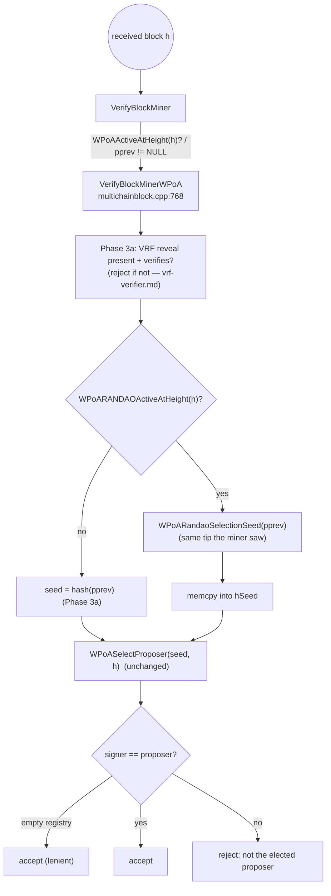

# `protocol/multichainblock.cpp` (wPoA Phase 3b — the RANDAO seed on the validator side)

> Documentation of the **validator-side integration** of the RANDAO beacon seed: how every
> peer, when the beacon governs a received block, recomputes the selection seed from the
> accumulator over the block's parent and checks the signer against the proposer that seed
> elects. This doc covers **only** the Phase 3b seed swap in `VerifyBlockMinerWPoA`. The
> Phase 2 proposer check in the *same* function is documented in
> [block-validation.md](block-validation.md); the Phase 3a VRF *reveal* check that immediately
> precedes it is in [vrf-verifier.md](vrf-verifier.md).

This is a **modified host file**, not a new module. The change is a small block inserted after
the Phase 3a VRF check and before the Phase 2 proposer computation. The include added at the
top of the file:

```cpp
#include "wpoa/randao_accumulator.h"   // multichainblock.cpp:15 — WPoARANDAOActiveAtHeight, WPoARandaoSelectionSeed
```

(`WPoAActiveAtHeight` / `WPoASelectProposer` come from `wpoa/wpoa_selector.h`, already
included for Phase 2; `WPoAVRF` / `WPoAVRFActiveAtHeight` from `wpoa/vrf_wrapper.h` +
`wpoa_selector.h`, from Phase 3a.)

## 1. Where the change lives and why there

`VerifyBlockMinerWPoA` (`multichainblock.cpp:768`) is the receiving-side enforcement of the
wPoA election: for a block that `VerifyBlockMiner` has routed here (wPoA active, `pprev`
non-NULL), it recovers the signer and rejects the block unless the signer is the proposer the
election would have chosen. By the insertion point the function has already, for the Phase 2
check ([block-validation.md](block-validation.md)):

```cpp
CPubKey pubKeyMiner;                                     // recovered from the block signature
std::vector<unsigned char> vchPubKey(pubKeyMiner.begin(),pubKeyMiner.end());
std::string sMinerAddr=CBitcoinAddress(pubKeyMiner.GetID()).ToString();  // the signer's address
```

and has run the **Phase 3a VRF reveal check** (`multichainblock.cpp:803-830`), which rejects
the block outright if a governed block's reveal is missing or forged
([vrf-verifier.md §2](vrf-verifier.md)). The Phase 3b seed swap sits **right after** that,
immediately before the proposer is computed — the same position as on the miner side, and the
only value it changes is the seed.

## 2. The added block, line by line

`multichainblock.cpp:832-842`:

```cpp
// wPoA Phase 3b: when the RANDAO beacon governs this block, derive the
// selection seed from the accumulator over the SAME tip the honest miner saw
// (pindexNew->pprev), instead of the plain previous block hash. Miner and
// validator therefore compute an identical seed and agree on the proposer.
uint256 hSeed=pindexNew->pprev->GetBlockHash();
unsigned char randao_seed[32];
if(WPoARANDAOActiveAtHeight(pindexNew->nHeight) && WPoARandaoSelectionSeed(pindexNew->pprev,randao_seed))
{
    memcpy(hSeed.begin(),randao_seed,sizeof(randao_seed));
}
std::string sProposer=WPoASelectProposer(hSeed.begin(),hSeed.size(),pindexNew->nHeight);
```

This is the **mirror image** of the miner-side block ([randao-miner.md §2](randao-miner.md)).
The three differences are all about "which tip": the validator does not have its own tip, it
has the received block, so it uses the block's **parent**.

### `uint256 hSeed=pindexNew->pprev->GetBlockHash();`
The **default seed** — the previous block hash, exactly the Phase 2/3a behavior.
`pindexNew` is the block under check; `pindexNew->pprev` is its parent, i.e. the tip the
honest miner built on. Dereferencing `pprev` is safe here because `VerifyBlockMiner` returns
early when `pprev == NULL` (a genesis-parented block) before ever delegating to this function
(see [block-validation.md §2](block-validation.md)).

### `unsigned char randao_seed[32];`
The 32-byte buffer for the derived beacon seed — identical to the miner side.

### `if(WPoARANDAOActiveAtHeight(pindexNew->nHeight) && WPoARandaoSelectionSeed(pindexNew->pprev,randao_seed))`
The same two-part, short-circuited guard as the miner:

- **`WPoARANDAOActiveAtHeight(pindexNew->nHeight)`** — the gate at the **block's own height**.
  This equals the miner's `nWPoAHeight` (the miner elected height `tip+1`; the received block
  *is* that height), so both evaluate the gate at the same height and agree on whether the
  block is beacon-seeded.
- **`WPoARandaoSelectionSeed(pindexNew->pprev,randao_seed)`** — derives the seed over the
  block's **parent** (`pindexNew->pprev`), which is exactly the tip the miner passed. Returns
  `false` only for a NULL tip (not reachable here, `pprev` is non-NULL), in which case the
  prev-hash default stands.

### `memcpy(hSeed.begin(),randao_seed,sizeof(randao_seed));`
On success, overwrite the default with the beacon seed — same as the miner side.

### `std::string sProposer=WPoASelectProposer(hSeed.begin(),hSeed.size(),pindexNew->nHeight);`
The **unchanged** election, run with the (possibly RANDAO-derived) seed and the block's
height. Because the miner ran the identical election with the identical seed, `sProposer` here
equals the miner's `sProposer` for an honest block.

## 3. What happens after (unchanged)

The existing Phase 2 acceptance logic follows verbatim:

```cpp
if(sProposer.empty()) { ... return true; }        // empty weight registry → lenient accept
if(sMinerAddr != sProposer) { ... return false; } // wrong proposer → reject
... return true;                                   // signer == proposer → accept
```

- **Empty registry (`sProposer.empty()`)** — a node that has not yet synced the weight stream
  cannot recompute the election, so it accepts rather than stalls (honest blocks come from the
  deterministic proposer and stay valid on any synced node). Note the **Phase 3a VRF check
  already ran and is *not* subject to this leniency** — a governed block with a missing/forged
  reveal was rejected above, before this point ([vrf-verifier.md §2](vrf-verifier.md)).
- **Wrong proposer (`sMinerAddr != sProposer`)** — reject: the signer is not the validator the
  seed elects. Under the beacon, "the seed" is the RANDAO seed, so this is where a block that
  used the wrong (or a manipulated) seed is caught.
- **Match** — accept and set `fPassedMinerPrecheck`.

The RANDAO change only altered *which* address `sProposer` holds; the accept/reject decision
around it is Phase 2 code.

## 4. Miner ↔ validator symmetry (the seed)

| | Miner (`miner.cpp`, `GetMinerAndExpectedMiningStartTime`) | Validator (`multichainblock.cpp`, `VerifyBlockMinerWPoA`) |
|---|---|---|
| Height | `nWPoAHeight = pindexTip->nHeight + 1` | `pindexNew->nHeight` (== that same `n+1`) |
| Gate | `WPoARANDAOActiveAtHeight(nWPoAHeight)` | `WPoARANDAOActiveAtHeight(pindexNew->nHeight)` |
| Tip → helper | `pindexTip` (height `n`) | `pindexNew->pprev` (the block's parent — the **same** height-`n` tip) |
| Default seed | `pindexTip->GetBlockHash()` | `pindexNew->pprev->GetBlockHash()` |
| Result | decide whether to mine | decide whether to accept |

The validator seeds off **`pindexNew->pprev`**, not `pindexNew`, precisely so it reconstructs
the state the miner saw *before* producing the block. Feeding the block's own hash would be
circular (the hash depends on the very contents being validated) and would not match the
miner. Because both sides derive the seed from the same parent tip and the same on-chain
reveals, the chain staying live and fork-free is itself the proof that the beacon seed is
identical network-wide ([phase3b §8](phase3b-implementation-guide.md#8-end-to-end-control-flow)).

## 5. Connections to the other files



- **`wpoa/randao_accumulator.h`** — provides `WPoARANDAOActiveAtHeight` and
  `WPoARandaoSelectionSeed`. See [randao-accumulator.md](randao-accumulator.md).
- **`wpoa/wpoa_selector.h`** — provides `WPoASelectProposer` (the unchanged election) and
  `WPoAVRFActiveAtHeight`. See [wpoa-selector.md](wpoa-selector.md).
- **`miner/miner.cpp`** — the proposer this file enforces; same tip, same seed, mirror
  decision. See [randao-miner.md](randao-miner.md).
- **Phase 3a VRF check** (same function, immediately before) — rejects a missing/forged
  reveal, and feeds the reveals the accumulator later folds. See
  [vrf-verifier.md](vrf-verifier.md).
- **Phase 2 proposer check** (same function, immediately after) — the accept/reject logic that
  consumes `sProposer`. See [block-validation.md](block-validation.md).
