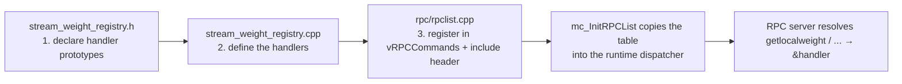
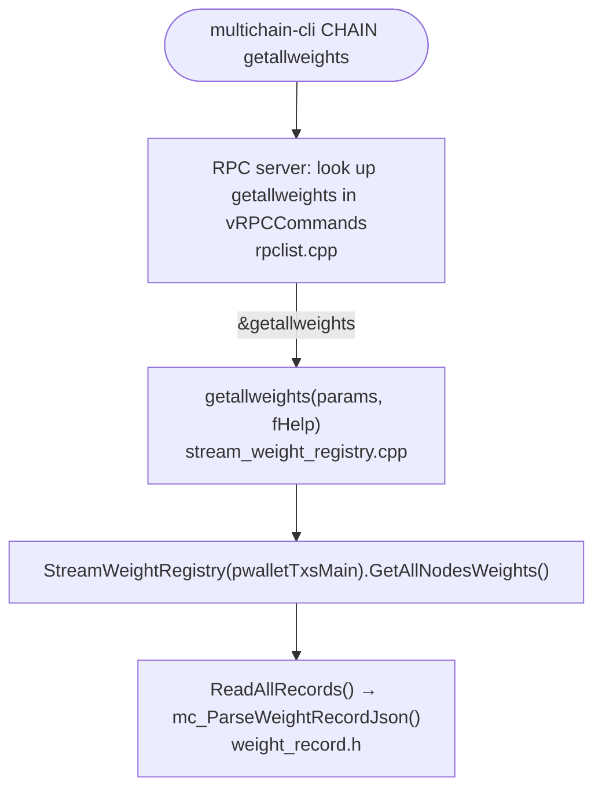

# `rpc/rpclist.cpp` (wPoA parts only)

> This file is documented at **the minimum necessary level**: what it is, how the RPC
> command registration mechanism works and **how the three wPoA commands were added**.
> The rest of the file is MultiChain's standard RPC command table and is not detailed.

## 1. What this file is for

`rpclist.cpp` contains the **dispatch table** of all the node's RPC commands: the map
"textual command name → C++ function that implements it". When a client sends an
RPC/JSON call (e.g. `getlocalweight`), the RPC server looks the name up in this table
and invokes the associated function.

The table is an array of `CRPCCommand` structs:

```cpp
static const CRPCCommand vRPCCommands[] =
{ //  category    name            actor (function)   okSafeMode  threadSafe  reqWallet
  ...
};
```

Each row has 6 fields (commented in the table header):

| Field | Meaning |
|-------|---------|
| `category` | Category shown in `help` (groups the commands). |
| `name` | The textual command name invoked by the client. |
| `actor (function)` | Pointer to the C++ function that implements the command (signature `Value f(const Array&, bool)`). |
| `okSafeMode` | Whether the command may run in "safe mode". |
| `threadSafe` | Whether it can run without the global RPC lock (manages its own locking). |
| `reqWallet` | Whether it requires an enabled wallet to work. |

## 2. Adding the wPoA commands



### 2.1 The include (line 13)

```cpp
#include "wpoa/stream_weight_registry.h"
```
This is the only link needed: it brings the **prototypes** of the three handler functions
declared in the registry's header into `rpclist.cpp`:

```cpp
json_spirit::Value getlocalweight(const json_spirit::Array& params, bool fHelp);
json_spirit::Value getallweights (const json_spirit::Array& params, bool fHelp);
json_spirit::Value getnodeweight (const json_spirit::Array& params, bool fHelp);
```
Without this include, the names `getlocalweight` etc. used in the table would be unknown
symbols to the compiler. **The functions are defined elsewhere** (in
`stream_weight_registry.cpp`): here only the declarations are needed in order to take
their address.

### 2.2 The three registered rows (lines 135-140)

```cpp
#ifdef ENABLE_WALLET
    /* wPoA weight registry (Phase 1) */
    { "wpoa",  "getlocalweight",  &getlocalweight,  true,  true,  true },
    { "wpoa",  "getallweights",   &getallweights,   true,  true,  true },
    { "wpoa",  "getnodeweight",   &getnodeweight,   true,  true,  true },
#endif
```

Reading the fields for these commands:

- **`category = "wpoa"`** — creates a new "wpoa" category in the `help` output, so the
  three commands appear grouped together.
- **`name`** — the name the client uses to invoke them: `getlocalweight`,
  `getallweights`, `getnodeweight`.
- **`actor = &getlocalweight` etc.** — the `&` operator takes the **address of the
  function** (a function pointer). This is how the table links the name to the
  implementation in `stream_weight_registry.cpp`.
- **`okSafeMode = true`** — they are read-only commands, safe even in safe mode.
- **`threadSafe = true`** — they do not require the global RPC lock. This is correct
  because the registry's read methods **self-lock** (they use
  `mc_WalletTxs::Lock()`/`UnLock()`, see [stream-weight-registry.md](stream-weight-registry.md)
  §2.7). They can therefore run concurrently and safely.
- **`reqWallet = true`** — they require the wallet: the reads use `pwalletTxsMain` and
  each handler throws `RPC_WALLET_ERROR` if the wallet is unavailable.
- **`#ifdef ENABLE_WALLET`** — as with the block in `init.cpp`, the commands exist only
  if the node is compiled with wallet support. A necessary consistency: without a wallet
  the handlers could not work.

### 2.3 How the table reaches the RPC server

At the bottom of the file:

```cpp
void mc_InitRPCList(std::vector<CRPCCommand>& vStaticRPCCommands,
                    std::vector<CRPCCommand>& vStaticRPCWalletReadCommands)
{
    ...
    for (vcidx = 0; vcidx < (sizeof(vRPCCommands)/sizeof(vRPCCommands[0])); vcidx++)
        vStaticRPCCommands.push_back(vRPCCommands[vcidx]);
    ...
}
```

- `mc_InitRPCList` is called at RPC-server startup and **copies** the static array
  `vRPCCommands` (including our 3 rows) into a vector the dispatcher will use at runtime.
- `sizeof(vRPCCommands) / sizeof(vRPCCommands[0])` is the classic C idiom for computing
  the **number of elements** of an array: total array size divided by the size of one
  element.

From this point on, typing `getlocalweight` on the client makes the server find the row,
call `&getlocalweight`, which runs the registry read logic and returns the resulting JSON.

## 3. Summary: what was "touched" to add the commands

Adding an RPC command in MultiChain requires exactly these three steps, all present here:

1. **Declare** the handler in a header (`stream_weight_registry.h`).
2. **Define** the handler in a `.cpp` (`stream_weight_registry.cpp`, functions
   `getlocalweight`/`getallweights`/`getnodeweight`).
3. **Register** it in the `vRPCCommands` table of `rpclist.cpp` (the 3 rows above) plus
   the `#include` of the header.

## 4. Links to the other files



- **`stream_weight_registry.h`** → provides the handler prototypes (via `#include`).
- **`stream_weight_registry.cpp`** → contains the real handler definitions.
- There is no link to `init.cpp`: RPC registration and the launch of the write thread are
  independent paths. The RPCs read the current state whatever it is (even empty).

---

## Related documents

- [../README.md](../README.md) — feature entry point and architecture diagram.
- [stream-weight-registry.md](stream-weight-registry.md) — the handler implementations
  and read internals.
- [weight-record.md](weight-record.md) — the record parsing used by the reads.
- [node-startup.md](node-startup.md) — the independent write-thread startup path.
