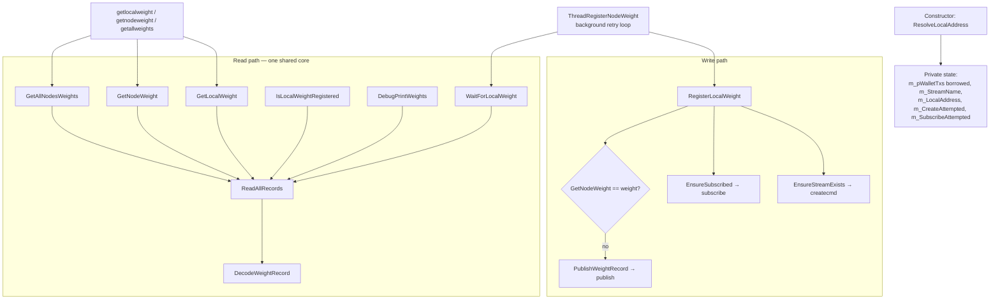
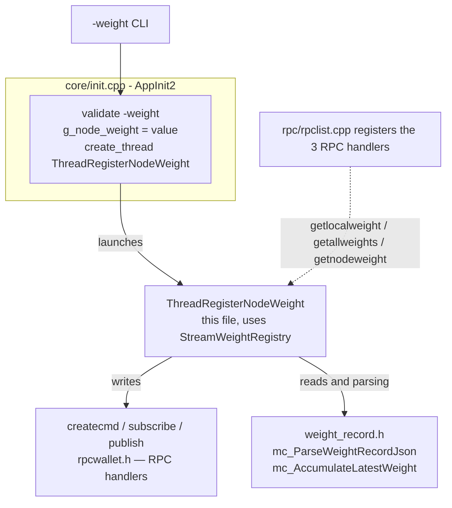

# `stream_weight_registry.h` + `stream_weight_registry.cpp`

> Detailed technical walkthrough of the **core of wPoA (Weighted Proof-of-Authority)
> weight management — Phase 1**.

These two files form a single logical compilation unit (interface + implementation)
and are documented together because they are tightly coupled:

| File | Role |
|------|------|
| `stream_weight_registry.h` | **Public interface** (declarations): the `StreamWeightRegistry` class, the constants, the global variable `g_node_weight`, the thread entry point `ThreadRegisterNodeWeight` and the prototypes of the three RPC functions. This is what the other files (`init.cpp`, `rpclist.cpp`) include in order to "see" the weight registry. |
| `stream_weight_registry.cpp` | **Implementation** (definitions): all the real logic for stream creation, subscription, publishing, reading and decoding of weight records. |

### Why the `.h` / `.cpp` split?

It is the classic C++ interface/implementation separation:

- **The header contains only declarations** (what exists) → it can be included by many
  files without duplicating code and without *multiple definition* errors at link time.
- **The `.cpp` contains the definitions** (how it works) → compiled once into a single
  `.o` object.

The header uses **forward declarations** instead of heavy `#include`s:

```cpp
struct mc_WalletTxs;
struct mc_EntityDetails;
```

This declares "these types exist" without pulling in all of their definitions (which
live in heavy MultiChain wallet headers). Since the header uses these types only as
**pointers** (`mc_WalletTxs*`, `mc_EntityDetails*`), the compiler only needs to know
they are types: the size of a pointer is known regardless. The full definitions are
included only in the `.cpp`, where they are actually needed. The result: a file that
includes the header (e.g. `rpclist.cpp`) compiles faster and does not depend on the
entire wallet subsystem.

---

## The class at a glance



---

## 1. The header `stream_weight_registry.h`

### 1.1 Includes and where they come from

```cpp
#include <map>
#include <string>
#include <stdint.h>
#include "json/json_spirit_value.h"
```

- `<map>` — `std::map`, the ordered key→value container from the **STL** (C++ Standard
  Template Library). Used for `std::map<std::string, uint32_t>` = address→weight map.
- `<string>` — `std::string`, also STL.
- `<stdint.h>` — the **standard C** header that defines the fixed-width integer types:
  `uint32_t` (32-bit unsigned integer, 0…4,294,967,295) and `int64_t` (64-bit signed
  integer). The weight is a `uint32_t`: it cannot be negative and 32 bits are more
  than enough.
- `"json/json_spirit_value.h"` — **json_spirit**, the JSON library used throughout
  MultiChain/Bitcoin Core. It provides `json_spirit::Value`, `Object`, `Array`, `Pair`.
  It is needed here because the RPC prototypes return `json_spirit::Value`.

### 1.2 The two constants (`#define`)

```cpp
#define MC_WPOA_WEIGHTS_STREAM_NAME     "wpoa-weights"
#define MC_WPOA_DEFAULT_WEIGHT          100
```

- `MC_WPOA_WEIGHTS_STREAM_NAME` — the name of the append-only **MultiChain stream** on
  which weight records are written. A "stream" in MultiChain is an append-only registry
  of key/data items, native to the protocol.
- `MC_WPOA_DEFAULT_WEIGHT` — the default weight (100) used if the node does not pass
  `-weight` on the command line.

They are `#define`s (preprocessor macros) rather than `const`: this is the MultiChain
code style, which prefixes all global constants with `MC_`. They are substituted
textually by the preprocessor before compilation.

### 1.3 The `StreamWeightRegistry` class — the "facade"

The header describes it as a *"thin, opaque facade over the wpoa-weights stream"*.
**Facade** = a pattern that hides internal complexity (the MultiChain stream,
transactions, DB reads) behind a few simple methods. The rest of the node never touches
the stream directly: it uses only these public methods.

#### Public methods (the contract with the outside)

| Method | What it returns / does |
|--------|------------------------|
| `StreamWeightRegistry(mc_WalletTxs* pwalletIn)` | Constructor: resolves the local address and stores the stream name. |
| `bool RegisterLocalWeight(uint32_t weight)` | Registers this node's weight on the stream (creates stream + subscribes + publishes if needed). |
| `uint32_t GetLocalWeight()` | Latest **confirmed** weight of this node, 0 if not registered. |
| `std::map<std::string,uint32_t> GetAllNodesWeights()` | address→weight map for every validator. |
| `uint32_t GetNodeWeight(const std::string&)` | Confirmed weight of a specific address. |
| `bool IsLocalWeightRegistered()` | true if at least one confirmed record exists for this node. |
| `void DebugPrintWeights()` | Prints the entire registry state to the log. |
| `bool WaitForLocalWeight(...)` | Blocks until the published weight is confirmed on-chain (with a timeout). |
| `std::string GetLocalAddress() const` | Inline getter of the resolved local address. |

Note on `GetLocalAddress() const`: it is defined **inline in the header**
(`{ return m_LocalAddress; }`) and marked `const`, meaning it promises not to modify
the object's state. It is a simple getter, so there is no reason to put it in the `.cpp`.

#### Private members (internal state)

```cpp
mc_WalletTxs* m_pWalletTxs;   //!< "borrowed" pointer, not owned
std::string   m_StreamName;   //!< "wpoa-weights"
std::string   m_LocalAddress; //!< node address, computed once
bool m_CreateAttempted;       //!< avoids emitting more than one create tx
bool m_SubscribeAttempted;    //!< avoids redundant subscribes
```

- The `m_` prefix denotes "member" (MultiChain convention).
- `//!<` is a **Doxygen**-style comment ("documents the member to its left").
- **"borrowed pointer, not owned"**: `m_pWalletTxs` points to an object
  (`pwalletTxsMain`) created and destroyed elsewhere (in `init.cpp`). The destructor
  `~StreamWeightRegistry` does **not** free it — see the comment in the `.cpp`. This
  avoids a double-free.
- The two flags `m_CreateAttempted`/`m_SubscribeAttempted` implement idempotency: they
  guarantee that the retry thread does not spam `create`/`subscribe` transactions on
  every pass.

#### Private methods (hidden implementation details)

```cpp
void ResolveLocalAddress();
bool GetStreamEntity(mc_EntityDetails* entity);
bool EnsureStreamExists();
bool EnsureSubscribed();
bool PublishWeightRecord(uint32_t weight);
bool ReadAllRecords(std::map<std::string, uint32_t>& out_latest);
```

They are private because they are the "building blocks" used by the public methods: no
other file should be able to call them.

### 1.4 Global elements declared in the header

```cpp
void ThreadRegisterNodeWeight(uint32_t weight);
extern uint32_t g_node_weight;

json_spirit::Value getlocalweight(const json_spirit::Array& params, bool fHelp);
json_spirit::Value getallweights(const json_spirit::Array& params, bool fHelp);
json_spirit::Value getnodeweight(const json_spirit::Array& params, bool fHelp);
```

- `ThreadRegisterNodeWeight` — a free function (not a method) executed as a
  **background thread**, launched by `AppInit2` in `init.cpp`.
- `extern uint32_t g_node_weight` — `extern` means "this variable is **defined
  elsewhere**" (in the `.cpp`, line 23). The header only declares it, so several files
  can refer to the same global variable without duplicating it. The `g_` prefix = global.
- The three RPC prototypes have the **standard Bitcoin/MultiChain RPC handler
  signature**: `Value f(const Array& params, bool fHelp)`. They are declared here and
  registered in `rpclist.cpp` (see [rpc-registration.md](rpc-registration.md)).

---

## 2. The implementation `stream_weight_registry.cpp`

### 2.1 Includes and what they bring

```cpp
#include "wpoa/stream_weight_registry.h"
#include "rpc/rpcwallet.h"      // create/publish/subscribe, wallet.h, wallettxs.h, multichain.h
#include "rpc/rpcutils.h"       // OpReturnFormatEntry
#include "structs/base58.h"     // CBitcoinAddress
#include "core/init.h"          // pwalletMain, pwalletTxsMain, ShutdownRequested
#include "core/main.h"          // chainActive, cs_main, IsInitialBlockDownload
#include "utils/util.h"         // GetArg, LogPrintf, RenameThread, GetBoolArg
#include "utils/utiltime.h"     // MilliSleep, GetTime
#include "wpoa/weight_record.h" // mc_ParseWeightRecordJson, mc_AccumulateLatestWeight
#include <boost/foreach.hpp>
```

Each include is the source of symbols used in the file:

- `rpcwallet.h` → declares the reused RPC handlers as C++ functions: `createcmd`,
  `subscribe`, `publish`. It also transitively pulls in `wallettxs.h` (types
  `mc_WalletTxs`, `mc_TxEntityStat`, `mc_TxEntityRow`, `mc_Buffer`) and `multichain.h`
  (`mc_gState`, `mc_EntityDetails`, constants `MC_ENT_TYPE_*`, `MC_TET_*`, `MC_AST_*`).
- `rpcutils.h` → `OpReturnFormatEntry`, the function that decodes an OP_RETURN payload
  into a `json_spirit::Value`.
- `base58.h` → `CBitcoinAddress`, the class that converts a public key / ID into an
  address string in Base58Check format.
- `init.h` → the global pointers `pwalletMain`, `pwalletTxsMain` and
  `ShutdownRequested()`.
- `main.h` → `chainActive` (the active chain), the global lock `cs_main`,
  `IsInitialBlockDownload()`.
- `util.h` → MultiChain utilities: `GetArg`/`GetBoolArg` (read CLI/config parameters),
  `LogPrintf` (log to `debug.log`), `RenameThread` (gives the thread an OS name).
- `utiltime.h` → `MilliSleep` (sleep in ms) and `GetTime` (UNIX timestamp in seconds).
- `weight_record.h` → the two pure parsing/aggregation helpers. See
  [weight-record.md](weight-record.md).
- `<boost/foreach.hpp>` → the `BOOST_FOREACH` macro from the **Boost** library
  (included here because it is used indirectly; the main loop uses classic `for` loops).

```cpp
using namespace std;
using namespace json_spirit;
```

These bring STL symbols (`string`, `map`…) and json_spirit symbols (`Value`, `Object`,
`Array`, `Pair`) into scope without having to qualify them with their namespace.

### 2.2 The global variable and module-level constants

```cpp
uint32_t g_node_weight = MC_WPOA_DEFAULT_WEIGHT;   // line 23 — THIS is the DEFINITION
```

This is the **definition** of the variable declared `extern` in the header. Initialised
to 100; overwritten by `init.cpp` with the value of `-weight`.

```cpp
static const int MC_WPOA_RETRY_INTERVAL_MS = 3000;   // how often the thread retries
static const int MC_WPOA_MAX_ATTEMPTS      = 200;    // ~10 minutes worst case
static const int MC_WPOA_CONFIRM_ATTEMPTS  = 20;     // 20*3s = ~60s waiting for confirmation
```

`static` at file scope = **visibility limited to this compilation unit** (internal
linkage): these do not collide with same-named symbols elsewhere. They are the timing
parameters of the registration thread.

### 2.3 Constructor, destructor and address resolution

```cpp
StreamWeightRegistry::StreamWeightRegistry(mc_WalletTxs* pwalletIn)
{
    m_pWalletTxs         = pwalletIn;
    m_StreamName         = MC_WPOA_WEIGHTS_STREAM_NAME;
    m_LocalAddress       = "";
    m_CreateAttempted    = false;
    m_SubscribeAttempted = false;
    ResolveLocalAddress();
}
```

The constructor stores the wallet-txs pointer, sets the stream name, clears the flags
and then immediately computes the local address.

```cpp
StreamWeightRegistry::~StreamWeightRegistry()
{
    // m_pWalletTxs is borrowed, nothing to free.
}
```

Empty destructor: it confirms that the pointer is "borrowed".

#### `ResolveLocalAddress()` — who is this validator?

```cpp
void StreamWeightRegistry::ResolveLocalAddress()
{
    m_LocalAddress = "unknown";
    if (pwalletMain == NULL) { /* WARNING, use placeholder */ return; }

    CPubKey pkey;
    {
        LOCK(pwalletMain->cs_wallet);
        if (!pwalletMain->GetKeyFromAddressBook(pkey, MC_PTP_MINE))
        {
            if (!pwalletMain->GetKeyFromAddressBook(pkey, MC_PTP_CONNECT))
            {
                pkey = pwalletMain->vchDefaultKey;
            }
        }
    }

    if (pkey.IsValid())
        m_LocalAddress = CBitcoinAddress(pkey.GetID()).ToString();
    else
        LogPrintf("... no valid node address, using placeholder\n");
}
```

Line by line:

- `CPubKey pkey;` — `CPubKey` is the MultiChain/Bitcoin class that represents an ECDSA
  **public key**.
- `LOCK(pwalletMain->cs_wallet);` — `LOCK` is a MultiChain macro (built on
  `boost::mutex`/`CCriticalSection`) that acquires a mutex for the duration of the `{}`
  scope. `cs_wallet` protects the wallet structures from concurrent access. It is
  needed because this function can be called both from an RPC (server thread) and from
  the background registration thread.
- **Address selection priority**: a wPoA weight belongs to a miner/validator, so the
  preference is:
  1. the **mining** address (`MC_PTP_MINE` = mine permission),
  2. otherwise the **connect** address (`MC_PTP_CONNECT` = connect permission),
  3. otherwise the wallet's **default key** (`vchDefaultKey`).

  `MC_PTP_*` are the MultiChain permission bits. `GetKeyFromAddressBook` looks up a key
  with that permission in the wallet.
- `pkey.IsValid()` — verifies that it is a valid key.
- `CBitcoinAddress(pkey.GetID()).ToString()` — `pkey.GetID()` produces a `CKeyID`
  (hash160 of the public key); `CBitcoinAddress(...)` wraps it and `.ToString()`
  serialises it into the readable Base58Check address format. This is the validator
  identifier used as the **key** in the stream.

### 2.4 Stream management

#### `GetStreamEntity()` — does the stream exist?

```cpp
bool StreamWeightRegistry::GetStreamEntity(mc_EntityDetails* entity)
{
    if (mc_gState == NULL || mc_gState->m_Assets == NULL) return false;
    if (mc_gState->m_Assets->FindEntityByName(entity, m_StreamName.c_str()) == 0) return false;
    return (entity->GetEntityType() == MC_ENT_TYPE_STREAM);
}
```

- `mc_gState` — the **MultiChain global state** (singleton), which holds all entities
  (assets, streams, etc.).
- `mc_gState->m_Assets` — the entity database (`mc_AssetDB`).
- `FindEntityByName(entity, name)` — looks up an entity by name; returns 0 if not found,
  fills `*entity` if found.
- `entity->GetEntityType() == MC_ENT_TYPE_STREAM` — confirms the found entity really is
  a stream and not, e.g., an asset with the same name.
- `m_StreamName.c_str()` — converts the `std::string` into a `const char*` C-string,
  as required by the MultiChain API.

#### `EnsureStreamExists()` — create the stream if missing

```cpp
mc_EntityDetails entity;
if (GetStreamEntity(&entity)) return true;      // already exists
if (m_CreateAttempted) return false;            // create already sent, awaiting confirmation

Array params;
params.push_back(string("stream"));
params.push_back(m_StreamName);
params.push_back(true);

m_CreateAttempted = true;
try {
    Value result = createcmd(params, false);
    LogPrintf("... create tx broadcast: %s\n", ..., result.get_str().c_str());
}
catch (const Object& objError) { /* missing create permission? */ }
catch (const std::exception& e) { /* other error */ }
return false; // not usable until confirmed
```

Key points:

- It builds a json_spirit `Array` equivalent to the RPC parameters
  `create ["stream", "wpoa-weights", true]`. The trailing `true` makes the stream
  **open**: any address with write permission can publish.
- `createcmd(params, false)` — calls the `create` RPC handler **directly in-process**
  (the same one invoked from the command line). The second parameter `false` = `fHelp`
  (we do not want the help, we want to execute). This is the central pattern:
  **writes reuse MultiChain's RPC handlers** rather than re-implementing transaction
  construction.
- **Double `catch`**: MultiChain RPC handlers throw a `json_spirit::Object` (the JSON-RPC
  error object) on a domain error, or a `std::exception` on a generic error. Both are
  caught.
- `m_CreateAttempted = true` **before** the try: even if it fails, we will not retry
  creation on every pass (avoids transaction spam).
- It returns `false` even when the broadcast succeeds: the stream becomes usable **only
  once the `create` transaction is confirmed in a block**.

#### `EnsureSubscribed()` — does this node read the stream?

```cpp
mc_EntityDetails entity;
if (!GetStreamEntity(&entity)) return false;

mc_TxEntityStat entStat;
entStat.Zero();
memcpy(&entStat, entity.GetTxID() + MC_AST_SHORT_TXID_OFFSET, MC_AST_SHORT_TXID_SIZE);
entStat.m_Entity.m_EntityType = MC_TET_STREAM | MC_TET_CHAINPOS;
if (m_pWalletTxs != NULL && m_pWalletTxs->WRPFindEntity(&entStat)) return true;  // already subscribed

if (m_SubscribeAttempted) return false;

Array params;
params.push_back(m_StreamName);
m_SubscribeAttempted = true;
try {
    subscribe(params, false);
    return m_pWalletTxs != NULL && m_pWalletTxs->WRPFindEntity(&entStat);
}
catch (...) { ... }
return false;
```

- `mc_TxEntityStat` — a struct that identifies an "entity" (here the stream) in the
  **wallet transaction database** (`mc_WalletTxs`). `Zero()` clears it.
- `entity.GetTxID()` returns the TXID (32 bytes) of the transaction that created the
  stream. `MC_AST_SHORT_TXID_OFFSET` and `MC_AST_SHORT_TXID_SIZE` extract the
  **short-txid** (a portion of the txid used as a compact stream identifier). The
  `memcpy` copies those bytes into `entStat`.
- `entStat.m_Entity.m_EntityType = MC_TET_STREAM | MC_TET_CHAINPOS;` — combines two
  flags: `MC_TET_STREAM` (it is a stream) and `MC_TET_CHAINPOS` (indexed by chain
  position). The bitwise OR (`|`) merges the two flags into a single value.
- `WRPFindEntity` — looks the entity up in the wallet index: if found, the node is
  already subscribed.
- If not subscribed, it calls the RPC handler `subscribe(["wpoa-weights"])`. After the
  subscribe it re-checks, because for a short stream the import can complete
  immediately.

### 2.5 Writing a record: `PublishWeightRecord()`

```cpp
Object record;
record.push_back(Pair("timestamp", (int64_t)GetTime()));
record.push_back(Pair("node_address", m_LocalAddress));
record.push_back(Pair("weight", (int64_t)weight));

int height = 0;
{
    LOCK(cs_main);
    if (chainActive.Tip() != NULL) height = chainActive.Height();
}
record.push_back(Pair("height", height));

Object data_obj;
data_obj.push_back(Pair("json", record));

Array params;
params.push_back(m_StreamName);
params.push_back(m_LocalAddress);
params.push_back(data_obj);

try {
    Value result = publish(params, false);
    LogPrintf("... Weight registered: %s = %u (tx %s)\n", ...);
    return true;
}
catch (...) { ... }
return false;
```

It builds the record's JSON payload:

- `Object` and `Pair` are json_spirit types. `Pair(name, value)` is a key/value pair;
  `Object` is the list of pairs.
- `GetTime()` → current UNIX timestamp (seconds). Cast to `int64_t` because json_spirit
  distinguishes 64-bit integers.
- `node_address` → the validator's address.
- `weight` → the weight (cast to `int64_t`).
- `height` → the current chain height. `chainActive.Tip()` is the top block;
  `chainActive.Height()` its height. Protected by `LOCK(cs_main)` because the chain can
  change concurrently.
- The record is wrapped in `{"json": <record>}`: this is the format MultiChain uses to
  represent a **UBJSON** datum in a stream item.

Finally it calls `publish(["wpoa-weights", <address-as-key>, {"json":{...}}])`. The
stream item's **key** is the node's address: this way each node writes records under
its own key, and reading the history shows each address's weight evolution.

### 2.6 Orchestrating the write: `RegisterLocalWeight()`

```cpp
if (weight == 0) { /* ERROR: weight must be > 0 */ return false; }
if (m_pWalletTxs == NULL || pwalletMain == NULL) { /* ERROR wallet */ return false; }

if (!EnsureStreamExists()) return false;   // created now or awaiting confirmation
if (!EnsureSubscribed())   return false;   // subscribe/import in progress

uint32_t current = GetNodeWeight(m_LocalAddress);
if (current == weight) { /* already registered */ return true; }   // IDEMPOTENCY

return PublishWeightRecord(weight);
```

Sequence: validate input → ensure stream → ensure subscription → **check idempotency**
(if the latest confirmed weight already equals it, do not re-publish) → publish. This
method is designed to be called repeatedly in a retry loop without side effects.

### 2.7 Reading records — the most delicate path

#### `DecodeWeightRecord()` (file-static function)

```cpp
static bool DecodeWeightRecord(const CWalletTx& wtx, const unsigned char* stream_short_txid,
                               string& out_addr, uint32_t& out_weight)
{
    mc_Script script; // local instance -> thread-safe (no shared buffer)

    for (int j = 0; j < (int)wtx.vout.size(); j++)
    {
        const CScript& spk = wtx.vout[j].scriptPubKey;
        if (spk.size() == 0) continue;
        CScript::const_iterator pc = spk.begin();

        script.Clear();
        script.SetScript((unsigned char*)(&pc[0]), (size_t)(spk.end() - pc), MC_SCR_TYPE_SCRIPTPUBKEY);

        if (!script.IsOpReturnScript())  continue;
        if (script.GetNumElements() == 0) continue;

        uint32_t format;
        unsigned char* chunk_hashes = NULL;
        int chunk_count = 0;
        int64_t total_chunk_size = 0;
        script.ExtractAndDeleteDataFormat(&format, &chunk_hashes, &chunk_count, &total_chunk_size);

        unsigned char short_txid[MC_AST_SHORT_TXID_SIZE];
        script.SetElement(0);
        if (script.GetEntity(short_txid) != 0) continue;
        if (memcmp(short_txid, stream_short_txid, MC_AST_SHORT_TXID_SIZE) != 0) continue;

        int n = script.GetNumElements();
        if (n < 1) continue;
        size_t data_size = 0;
        const unsigned char* data = script.GetData(n - 1, &data_size);
        if (data == NULL || data_size == 0) continue;

        string format_text;
        Value v = OpReturnFormatEntry(data, data_size, wtx.GetHash(), j, format, &format_text);
        if (mc_ParseWeightRecordJson(v, out_addr, out_weight)) return true;
    }
    return false;
}
```

`static` = a function visible only in this file. It extracts `(address, weight)` from a
stream-item transaction. Steps:

- `CWalletTx` — a transaction as stored in the wallet; `wtx.vout` is the vector of
  outputs.
- `CScript` / `scriptPubKey` — the output's locking script. A stream item's data travels
  in an **OP_RETURN** output.
- `mc_Script` — the MultiChain script parser. **It is created locally inside the
  function**: this is the key to thread-safety, because it avoids sharing global temporary
  buffers between different threads (the comment stresses this).
- `SetScript(...)` — loads the raw scriptPubKey bytes into the parser. The cast
  `(unsigned char*)(&pc[0])` takes the byte pointer, `spk.end() - pc` the length,
  `MC_SCR_TYPE_SCRIPTPUBKEY` the type.
- `IsOpReturnScript()` — skips outputs that are not OP_RETURN (e.g. the change output).
- `ExtractAndDeleteDataFormat(...)` — removes the data-format meta element (mirroring
  `StreamItemEntry`, the MultiChain function that formats items).
- `SetElement(0)` + `GetEntity(short_txid)` — element 0 of the OP_RETURN must identify
  the stream. `memcmp` compares the short-txid with our stream's: if different, the item
  belongs to another stream → skip.
- `GetData(n-1, &data_size)` — the last element holds the item's data (in Phase 1,
  on-chain records only).
- **`OpReturnFormatEntry(...)`** — the critical point. It decodes the bytes into a
  `json_spirit::Value`. The comment explains why the **6-argument overload** is used
  (with `format_text` as an out-parameter): this directly produces `{"json": {...}}`,
  exactly as `StreamItemEntry`/`liststreamitems` do. The 3-argument overload would
  instead wrap it as `{"format":"json","formatdata":{"json":{...}}}`, and
  `mc_ParseWeightRecordJson` would reject it because there is no `"json"` key at the top
  level. **This discrepancy was the cause of the bug** where decoding silently failed
  for every item (cf. the "stream read bug fix" commit). See
  [multichain-internals.md](multichain-internals.md) §5.
- Finally `mc_ParseWeightRecordJson(v, out_addr, out_weight)` (from `weight_record.h`)
  extracts the address and weight. If it succeeds, it returns.

#### `ReadAllRecords()` — the read core

```cpp
static const bool dbg = GetBoolArg("-wpoadebug", false);
out_latest.clear();
if (m_pWalletTxs == NULL) { ...; return false; }

mc_EntityDetails entity;
if (!GetStreamEntity(&entity)) { ...; return false; } // stream not created

mc_TxEntityStat entStat;
entStat.Zero();
memcpy(&entStat, entity.GetTxID() + MC_AST_SHORT_TXID_OFFSET, MC_AST_SHORT_TXID_SIZE);
entStat.m_Entity.m_EntityType = MC_TET_STREAM | MC_TET_CHAINPOS;
```

`static const bool dbg` — read **once** (because of `static`) from the `-wpoadebug`
flag. It enables verbose tracing logs.

Then the fundamental part, explained by a long comment in the code:

```cpp
bool found;
m_pWalletTxs->Lock();
found = m_pWalletTxs->FindEntity(&entStat);
m_pWalletTxs->UnLock();
if (!found) return false; // not subscribed
```

**Why `FindEntity` and not `WRPFindEntity`?** (the key design difference)

- The **WRP\*** family (`WRPGetListSize`/`WRPGetList`/`WRPGetWalletTx`) reads from a
  *snapshot* whose position (`m_ReadLastPos`) is advanced **only** inside the RPC
  read-lock protocol: a reader must hold `WRPReadLock()` and the snapshot advances on the
  writer side via `WRPSync()`. A self-contained reader that does **not** participate in
  that protocol (this background thread, and read RPCs that do not take the WRP read
  lock) would see a **stale** snapshot and report 0 items forever, even after the publish
  tx is mined.
- The **non-WRP** methods (`FindEntity`/`GetListSize`/`GetList`/`GetWalletTx`) self-lock
  via `Lock(0,0)` and read the **live** position (`m_LastPos`), so they see every
  confirmed item as soon as its block connects.
- `FindEntity` does not lock internally, so it must be guarded manually with
  `Lock()`/`UnLock()`.

This is the reason for the note in the header: *"We deliberately do NOT use the WRP\*
read family."* See [multichain-internals.md](multichain-internals.md) §4.

```cpp
int confirmed = 0;
int total = m_pWalletTxs->GetListSize(&entStat.m_Entity, entStat.m_Generation, &confirmed);
if (confirmed <= 0) return true; // subscribed but no confirmed items -> empty map
```

`GetListSize` returns in its return value the total (including unconfirmed mempool
items) and, via the **out-param** `&confirmed`, the number of **confirmed** items
(`m_LastClearedPos`). Only the confirmed ones are used: **a weight registry that feeds
consensus must be identical on every node**, whereas the mempool differs per node. A
weight only "counts" when it is on-chain.

```cpp
mc_Buffer rows;
rows.Initialize(MC_TDB_ENTITY_KEY_SIZE, sizeof(mc_TxEntityRow), MC_BUF_MODE_DEFAULT);

int list_err = m_pWalletTxs->GetList(&entStat.m_Entity, entStat.m_Generation, 1, confirmed, &rows);
if (list_err != MC_ERR_NOERROR) return false;
```

- `mc_Buffer` — a generic MultiChain buffer; `Initialize` tells it the key size and row
  size (`sizeof(mc_TxEntityRow)`).
- `GetList(entity, generation, 1, confirmed, &rows)` — reads items from position **1**
  up to `confirmed`, i.e. **only the confirmed prefix**, in **ascending** order (oldest
  to newest).

```cpp
const unsigned char* stream_short_txid = entity.GetTxID() + MC_AST_SHORT_TXID_OFFSET;

for (int i = 0; i < rows.GetCount(); i++)
{
    mc_TxEntityRow* er = (mc_TxEntityRow*)rows.GetRow(i);

    if (er->m_Flags & MC_TFL_IS_EXTENSION) continue;   // skip extension (chunked) rows

    uint256 hash;
    memcpy(hash.begin(), er->m_TxId, MC_TDB_TXID_SIZE);

    int err = MC_ERR_NOERROR;
    mc_TxDefRow txdef;
    CWalletTx wtx = m_pWalletTxs->GetWalletTx(hash, &txdef, &err);
    if (err != MC_ERR_NOERROR) continue;

    string addr; uint32_t w = 0;
    bool decoded = DecodeWeightRecord(wtx, stream_short_txid, addr, w);
    if (decoded)
        mc_AccumulateLatestWeight(out_latest, addr, w); // newest wins
}
return true;
```

- Each row (`mc_TxEntityRow`) represents a stream item.
- `MC_TFL_IS_EXTENSION` — the flag for extension rows (chunked/off-chain items). Since we
  only publish small on-chain JSON, these never occur; they are skipped defensively.
- `uint256` — the Bitcoin type for 256-bit hashes. The TXID is reconstructed from the
  row bytes.
- `GetWalletTx(hash, &txdef, &err)` — retrieves the full transaction from the wallet.
- `DecodeWeightRecord(...)` — extracts `(addr, w)` as seen above.
- **`mc_AccumulateLatestWeight(out_latest, addr, w)`** — because we iterate in ascending
  order (old→new), overwriting the per-address map makes the **last record win**. This
  helper lives in `weight_record.h`.

### 2.8 The public read methods (thin wrappers over `ReadAllRecords`)

They all call `ReadAllRecords` and then filter/aggregate:

```cpp
uint32_t GetNodeWeight(addr)  → look up addr in the map, return weight or 0
uint32_t GetLocalWeight()     → same but for m_LocalAddress, with a WARNING if 0
std::map GetAllNodesWeights() → return the whole map (and log sum/count)
bool IsLocalWeightRegistered()→ true if m_LocalAddress is in the map
void DebugPrintWeights()      → formatted print of the whole registry
```

`WaitForLocalWeight(weight, max_attempts, interval_ms)`:

```cpp
for (int i = 0; i < max_attempts; i++)
{
    if (ShutdownRequested()) return false;
    std::map<std::string,uint32_t> weights;
    ReadAllRecords(weights);
    auto it = weights.find(m_LocalAddress);
    if (it != weights.end() && it->second == weight) return true;
    MilliSleep(interval_ms);
}
return false;
```

Polling: it re-reads the state every `interval_ms` until this node's confirmed weight
equals the expected value, with a shutdown guard. It exists so the thread can print the
debug dump with the **confirmed** value rather than 0.

### 2.9 The deferred registration thread

```cpp
static bool NodeReadyForWeightRegistration()
{
    { LOCK(cs_main); if (chainActive.Tip() == NULL) return false; }   // need a tip
    if (GetBoolArg("-offline", false)) return true;                   // offline: OK right away
    return !IsInitialBlockDownload();                                 // otherwise wait for IBD to finish
}
```

The node is "ready" when a chain tip exists and (unless `-offline`) the **Initial Block
Download** has finished. Deliberately **not** requiring peers: a single permitted miner
produces blocks on its own.

```cpp
void ThreadRegisterNodeWeight(uint32_t weight)
{
    RenameThread("mc-wpoa-weight");
    if (pwalletTxsMain == NULL || pwalletMain == NULL) { ...; return; }

    StreamWeightRegistry registry(pwalletTxsMain);
    int attempts = 0;

    while (!ShutdownRequested())
    {
        MilliSleep(MC_WPOA_RETRY_INTERVAL_MS);
        if (ShutdownRequested()) break;
        if (!NodeReadyForWeightRegistration()) continue;   // gate, does not count as an attempt

        attempts++;
        if (registry.RegisterLocalWeight(weight))
        {
            if (registry.WaitForLocalWeight(weight, MC_WPOA_CONFIRM_ATTEMPTS, MC_WPOA_RETRY_INTERVAL_MS))
                LogPrintf("... Weight confirmed on-chain\n");
            else
                LogPrintf("... Weight submitted; awaiting a block ...\n");
            registry.DebugPrintWeights();
            return;   // success -> the thread terminates
        }

        if (attempts >= MC_WPOA_MAX_ATTEMPTS) { ...; return; }  // give up
    }
}
```

- `RenameThread("mc-wpoa-weight")` — gives the thread a name (useful in `top`/debug).
- It creates **only one** `StreamWeightRegistry` instance (so the flags
  `m_CreateAttempted`/`m_SubscribeAttempted` persist across attempts).
- A retry loop with `MilliSleep` between passes; it exits on the first success or after
  `MC_WPOA_MAX_ATTEMPTS` (200) attempts (~10 minutes). The readiness gate does not consume
  attempts.
- After a successful `RegisterLocalWeight`, it waits for on-chain confirmation and prints
  the dump.

### 2.10 The three RPC functions (defined here, registered in `rpclist.cpp`)

Common structure (example `getlocalweight`):

```cpp
Value getlocalweight(const Array& params, bool fHelp)
{
    if (fHelp || params.size() != 0)
        throw runtime_error("getlocalweight\n...help...");
    if (pwalletTxsMain == NULL)
        throw JSONRPCError(RPC_WALLET_ERROR, "Wallet not available");

    StreamWeightRegistry registry(pwalletTxsMain);
    Object obj;
    obj.push_back(Pair("address",    registry.GetLocalAddress()));
    obj.push_back(Pair("weight",     (int64_t)registry.GetLocalWeight()));
    obj.push_back(Pair("registered", registry.IsLocalWeightRegistered()));
    return obj;
}
```

- **Standard RPC signature**: `Value f(const Array& params, bool fHelp)`.
- If `fHelp` is true or the arguments are wrong, it throws `runtime_error` with the help
  text (the RPC server intercepts it and shows it to the user).
- `JSONRPCError(code, message)` — a helper that builds the JSON-RPC error object;
  `RPC_WALLET_ERROR` is a standard code.
- Each handler creates a `StreamWeightRegistry` **on the fly** (reading `pwalletTxsMain`),
  queries the public methods and packs the result into a json_spirit `Object`.

The other two:

- `getallweights` — returns `{validators, total, weights:{addr:weight,...}}`, summing the
  weights.
- `getnodeweight "address"` — requires 1 argument (`params.size() != 1`), reads
  `params[0].get_str()` and returns `{address, weight}`.

---

## 3. How this file connects to the others



- **`core/init.h`** declares `pwalletMain`, `pwalletTxsMain`, `ShutdownRequested()` that
  this file uses; **`core/init.cpp`** reads `-weight`, sets `g_node_weight` and launches
  `ThreadRegisterNodeWeight`. → see [node-startup.md](node-startup.md).
- **`weight_record.h`** provides the two pure parsing/aggregation helpers used by
  `DecodeWeightRecord`/`ReadAllRecords`. → see [weight-record.md](weight-record.md).
- **`rpc/rpclist.cpp`** registers the three RPC functions in the server dispatcher. →
  see [rpc-registration.md](rpc-registration.md).
- **`rpcwallet.h`** provides the `createcmd`/`subscribe`/`publish` handlers reused for
  writes. → see [multichain-internals.md](multichain-internals.md) §6.

---

## Related documents

- [../README.md](../README.md) — feature entry point and architecture diagram.
- [phase1-implementation-guide.md](phase1-implementation-guide.md) — the design rationale (the "why").
- [multichain-internals.md](multichain-internals.md) — the host APIs this class calls.
- [weight-record.md](weight-record.md) — the pure helpers used on the read path.
