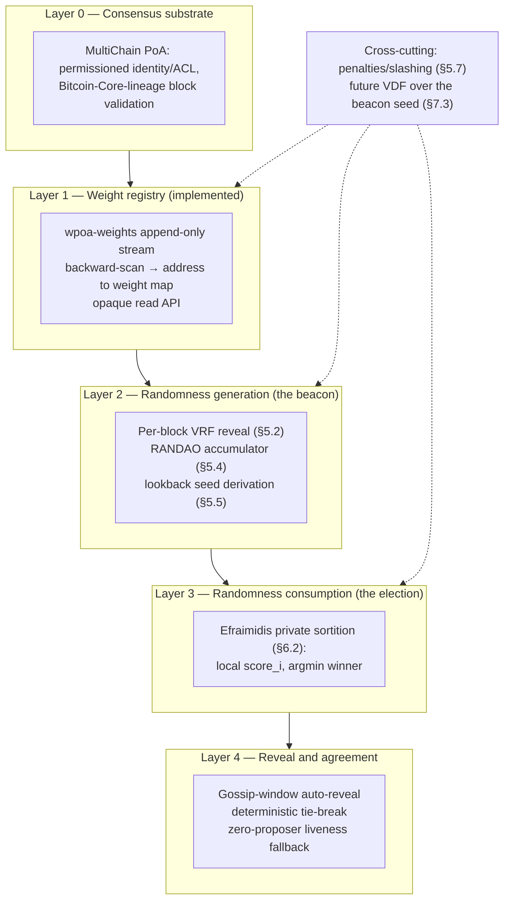
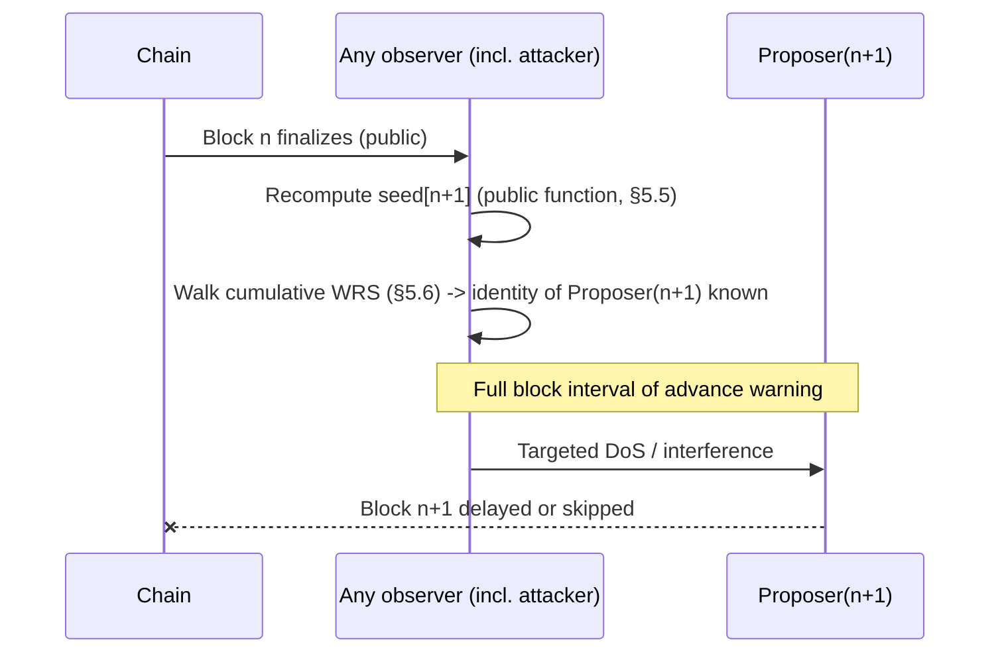
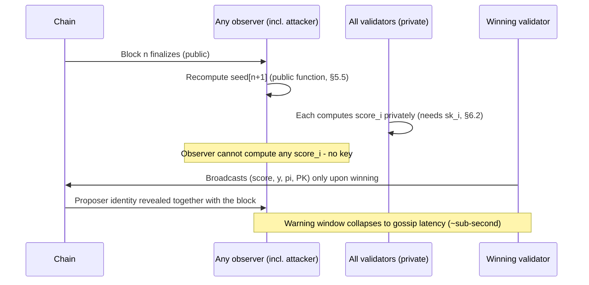
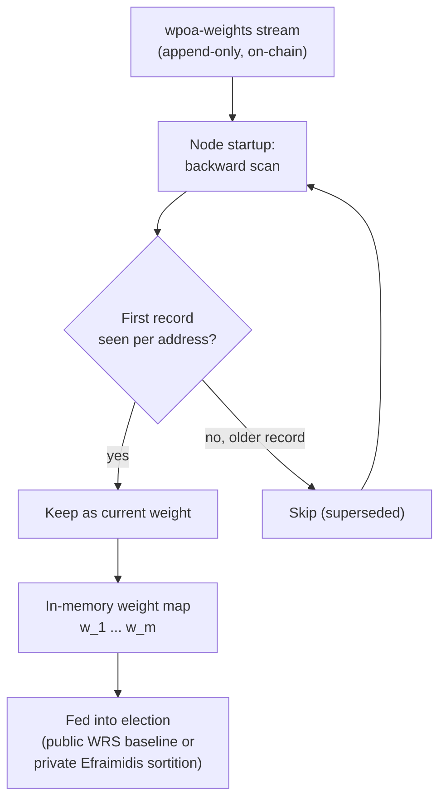
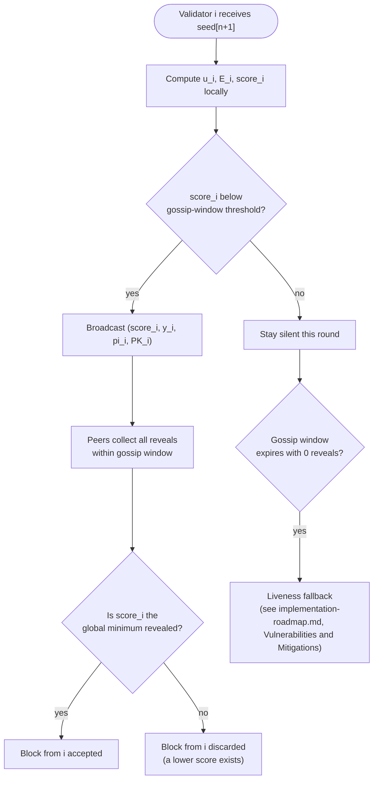
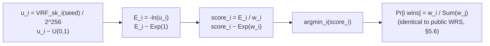

# Private Proposer Sortition for Weighted Proof-of-Authority: A Thesis Overview

> **Scope of this document.** This is the *research* companion to the wPoA
> project: problem, threat model, formal model, and
> theoretical justification for the design. It contains **no implementation
> detail** — for the engineering plan, phased status, and code-level pointers,
> see [implementation-roadmap.md](implementation-roadmap.md).

**Author's note.** This is a bachelor's thesis project (Università degli Studi
di Pisa, supervisors: Prof. Damiano Di Francesco Maesa, Prof. Laura Ricci), implemented as a fork
of [MultiChain 2.3](https://github.com/MultiChain/MultiChain). It should be
read as a scoped, undergraduate-level treatment: the contribution is a
disciplined *application* of known cryptographic primitives (VRF, RANDAO,
Efraimidis–Spirakis WRS) to a concrete predictability non-weighted problem in permissioned
consensus, not a novel algorithm.

---

## Table of Contents

1. [Abstract](#1-abstract)
2. [Problem Statement](#2-problem-statement)
3. [Threat Model & Vulnerabilities](#3-threat-model--vulnerabilities)
4. [Literature Review Map](#4-literature-review-map)
5. [Formal Model](#5-formal-model)
6. [Proposed Solution Overview](#6-proposed-solution-overview)
7. [Theoretical Contributions](#7-theoretical-contributions)
8. [Thesis Chapters Breakdown](#8-thesis-chapters-breakdown)
9. [Key Diagrams](#9-key-diagrams)
10. [References](#10-references)

---

## 1. Abstract

Deterministic leader election is a hard requirement for BFT-style consensus:
every honest node must, at any given height, agree on who is authorized to
propose the next block. This determinism, however, is a double-edged sword —
if the leader schedule can be computed in advance by anyone, it can also be
*targeted* in advance by anyone. This thesis studies a **Weighted Proof-of-Authority (wPoA)**
consensus mechanism and its predictability problem, where block-production 
weight is proportional to a validator-specific weight rather than uniform round-robin.
It shows that a naïve weighted-random-selection (WRS) scheme, evaluated
publicly over a shared seed, leaks the identity of the next proposer a full
block in advance — an exploitable window for denial-of-service. The thesis
then analyzes and adopts, as a design choice, a combination of three existing
primitives — a **VRF**-based per-validator evaluation, a **RANDAO**-style
commit-reveal beacon, and the **Efraimidis–Spirakis** weighted-sampling
transform — reassembled so that each validator computes its own election
*score* privately and reveals it only if it wins, collapsing the
predictability window from "one block ahead" to "a sub-second gossip
interval." The thesis formalizes the threat, proves that the private
reformulation preserves the original weight-proportional selection
probability, and evaluates the residual attack surface (last-revealer bias,
liveness under churn) that remains open for future work.

---

## 2. Problem Statement

Any Byzantine-fault-tolerant or PoA-style consensus protocol must solve two
requirements simultaneously:

1. **Safety / agreement.** All honest nodes must independently compute the
   *same* proposer for height `n+1`, without an extra communication round.
   This forces the election function to be a deterministic function of
   state that is already common knowledge (chain state, previous block hash,
   registered weights).
2. **Liveness under attack.** The elected proposer must actually be able to
   produce and propagate a block. If an adversary can identify the proposer
   *before* that block is produced, it can attack exactly that node —
   flooding its network interface, spoofing its NTP source, or otherwise
   degrading it — with a success probability far higher than attacking a
   random node.

These two requirements pull in opposite directions: agreement wants the
election function to be *publicly computable*; liveness wants it to be
*unpredictable*. Requirement (1) is non-negotiable for consensus correctness.
The research question this thesis addresses is therefore:

> **Can we keep the election function publicly verifiable and deterministic
> — so that safety is untouched — while making its *output* unknowable to
> anyone except the elected node itself, until the moment that node chooses
> to reveal it?**

The wPoA design under study answers this affirmatively by moving the
*evaluation* of the election function inside each validator's private key,
and only using a public, deterministic beacon as the *input* to that private
evaluation (see [§6](#6-proposed-solution-overview)).

---

## 3. Threat Model & Vulnerabilities

### 3.1 Leader Predictability Attack

Consider the baseline design formalized in [§5](#5-formal-model): a public,
deterministic seed `seed[n+1]` is combined with a **cumulative
weighted-random-selection** — every node walks the ordered list of
validators, accumulating weights, until the running sum exceeds
`ρ[n+1] = MapToRange(seed[n+1], 0, W[n+1]-1)` [1][3]. Because `seed[n+1]` is
computable by *any* observer as soon as block `n` finalizes (it is a public
function of `h[n-1]`, height, and a public accumulator), the identity of the
proposer of block `n+1` is public knowledge one full block interval in
advance.

**Attack timeline** (see [§9.2](#92-attack-timeline-public-wrs-vs-private-sortition)):

1. Block `n` finalizes and propagates.
2. Every observer — validator or outside attacker — recomputes `seed[n+1]`
   and evaluates the cumulative WRS. The proposer of `n+1` is now known.
3. The attacker has the entire inter-block interval (order of seconds,
   depending on network configuration) to act against that specific node:
   packet flooding, connection exhaustion, BGP-level interference, or
   simply timing a legitimate-looking burst of load to push the node's
   block past the network's propagation deadline.
4. If the attack succeeds, block `n+1` is skipped or delayed — a direct hit
   on liveness. Repeated across heights, this degrades throughput and may
   force a fallback path (if one exists) to be exercised far more often than
   its design intended.

**Impact.** This is not a safety attack (no fork is produced by a skipped
proposer in a correctly designed fallback), but a **liveness** and
**availability** attack, with a low cost per attempt: the attacker needs no
special access, no participation in consensus, no compromised key — only
public chain data and a way to degrade one network endpoint.

### 3.2 Permissioned Context: Mitigating but Not Eliminating

A wPoA deployment is **permissioned**: the validator set is known, vetted,
and admitted under an identity/authorization policy inherited from
MultiChain. This weakens, but does not remove, the threat:

- **Trusted ≠ immune.** A validator can be honest in its protocol logic and
  still be a target of network-layer attacks it does not control: NTP
  spoofing that skews its clock relative to consensus timing, targeted DDoS
  against its public IP, or route manipulation upstream of its own
  infrastructure. None of these require the validator itself to misbehave.
- **External attackers still exist.** Permissioned membership constrains who
  can *propose* blocks; it does not constrain who can *observe* the chain or
  *send packets* to a validator's IP. Any outside party with network reach to
  a validator can mount the timing attack in §3.1 without ever holding a key
  in the system.
- **Internal threat is not zero either.** A rogue or compromised validator
  benefits from knowing a peer's proposer slot in advance in the same way an
  external attacker does — the permissioned assumption bounds the *set* of
  possible internal adversaries, not their capability once inside that set.

The thesis therefore treats leader unpredictability as a **design goal worth
retaining even in a trusted-validator network**, rather than an assumption
that can be discharged by the permissioning layer alone.

### 3.3 Other Vulnerabilities Considered

- **Last-revealer bias (Cleve's impossibility theorem).** In any
  commit-reveal randomness beacon, the last party to reveal in a round has
  strictly more information than everyone else and can, in the worst case,
  bias the outcome by withholding its reveal. Cleve (1986) shows this bias
  cannot be fully eliminated by any protocol without a trusted third party or
  an additional primitive; it can only be *bounded* — in RANDAO-style
  designs, to roughly one bit of influence per round the adversary controls
  [4]. This motivates the long-horizon VDF mitigation (see
  [§7.3](#73-bias-analysis-cleves-impossibility-theorem-and-vdf-mitigation)).
- **Value grinding.** An adversary who could choose or replay its own random
  contribution to bias the beacon in its favor is mitigated by the VRF's
  uniqueness property: for a fixed key and input there is exactly one valid
  output, so a validator cannot search over alternative reveals for a
  favorable outcome [2].

---

## 4. Literature Review Map

| Area | Key references | Relevance to this thesis |
|---|---|---|
| Weighted random sampling | Efraimidis & Spirakis, 2006 [1] | Source of the exponential-key transform used to preserve `Pr[i] = w_i / Σw_j` while allowing local, private evaluation. |
| Verifiable Random Functions | Micali, Rabin & Vadhan, 1999 [2] | Formal basis for "unique, privately-evaluable, publicly-verifiable" pseudorandom output — the primitive that makes private sortition possible. |
| Randomness beacons / bias bounds | Cleve, 1986 [4] | Formal limit on how unbiased a commit-reveal beacon can be; frames the residual risk this thesis leaves open. |
| Verifiable Delay Functions | Boneh, Bonneau, Bünz & Fisch, 2018 [5] | Proposed long-horizon mitigation for the residual last-revealer bias (Phase 5 / future work). |
| Public randomness beacons in production | Ethereum Consensus Specifications — RANDAO [6] | Baseline comparison: a *public* beacon where the leader schedule is known in advance; illustrates the predictability problem this thesis avoids. |
| Private cryptographic sortition | Algorand (Chen & Micali) [7] | Baseline comparison: a system that already privatizes leader/committee selection via VRF; closest prior-art shape to the design adopted here. |
| Weighted PoA in applied settings | Kokate & Shrawankar, 2021 [8] | Prior applied use of trust-weighted PoA (IoT context); motivates weight-proportional election as a design axis independent of privacy. |
| Base platform | MultiChain Project, 2015 — White Paper [3] | Describes the permissioned, stream-based substrate this thesis builds on (see [§6.3](#63-stream-based-weight-registry-conceptual)). |
| Enforcement / penalty precedent | Bitcoin Core validation model; PoS/PoSA slashing literature [9] | Architectural precedent for the penalty mechanisms sketched in [§5.7](#57-penalties-and-malicious-behavior). |

See [§10](#10-references) for the full, single, self-contained bibliography
used throughout this document.

---

## 5. Formal Model

This section restates, in full, the formal baseline model this thesis builds
on and then privatizes. It is reproduced here so that this document does not
depend on any external technical report.

### 5.1 State and Notation

Consider a blockchain indexed by height. The following state quantities are
defined:

- `h[n]`: hash of the block at height `n`.
- `PK_i`: public key of node `i`.
- `w_i[n]`: weight of node `i` toward the consensus share relevant to block
  `n`.
- `R[n]`: pseudorandom reveal included in block `n`.
- `π[n]`: cryptographic VRF proof associated with `R[n]`.
- `R_tot[n]`: global randomness accumulator after processing block `n`.
- `k`: constant lookback parameter, used to decouple the selection seed from
  the very latest contributions.
- `seed[n+1]`: pseudorandom seed used to select the proposer of the next
  block.

The protocol further assumes the availability of a cryptographic hash
function `H(·)`, a bitwise XOR operator `⊕`, and a publicly verifiable VRF
[1][2].

### 5.2 Local VRF Phase

When a node becomes block proposer for block `n`, it locally produces a
verifiable pseudorandom contribution via VRF. The contribution is
deterministic with respect to the protocol inputs, but is not predictable in
advance by other nodes without knowledge of the proposer's private key [2][3].

A concrete formal instantiation of the reveal is:

```
R[n] = VRF_sk_i( H(h[n-1] ‖ n) )
```

with associated proof:

```
π[n] = VRF_Proof_sk_i( H(h[n-1] ‖ n) )
```

The node includes at least three additional fields in block `n`: the reveal
`R[n]`, the proof `π[n]`, and its public key `PK_i`. This lets every other
participant re-run the cryptographic verification of the reveal's correctness
using the proposer's public key and the public input `H(h[n-1] ‖ n)`. The
pseudorandom contribution is therefore not an arbitrary choice by the node,
but an output bound to its cryptographic identity and to the chain's prior
state [2][3].

### 5.3 VRF Data Included in the Block

For every valid block `B_n`, the consensus header or payload must contain at
least the structural tuple:

```
V_n = (R[n], π[n], PK_prop(n))
```

where `prop(n)` denotes the node that proposed block `n`. Block validation
requires every honest node to simultaneously check:

1. the block's standard validity under the consensus rules;
2. the correctness of the VRF proof;
3. consistency between reveal, proof, public key, and the round's public
   input;
4. the absence of evidence of misconduct already sanctionable under the
   protocol [3][4].

This scheme preserves an important property: the reveal is *on-chain*, while
the global accumulator `R_tot` is *on-state* — the elementary contribution is
persisted in the block, while the aggregated state is derived deterministically
from the sequence of valid blocks [3].

### 5.4 Global Accumulator Update

After validating block `n`, every node locally updates the shared global
randomness state. The update is deterministic and depends only on the
accumulator's previous value and the validated reveal contained in the block
[1][3]:

```
R_tot[n] = H( R_tot[n-1] ⊕ H(R[n]) )
```

This form has three relevant functional properties. First, every new reveal
contributes to network randomness only after being verified. Second, hashing
the reveal before the XOR operation normalizes the input size and stabilizes
the accumulator's behavior even if the reveal's internal serialized
representation varies. Third, the final hashing of the accumulator prevents
the linearity of the XOR alone from making the incremental mixing structure
too transparent [1].

Formally, all nodes observing the same sequence of valid blocks compute the
same value `R_tot[n]`. This property is essential so that the seed used to
select the next proposer is identical across the whole network and does not
introduce forks caused by computational divergence [3][4].

### 5.5 Seed Computation for the Next Block

The seed used to select the proposer of block `n+1` is not derived directly
from the reveal just produced, but from a combination of the historical
accumulator, a recent chain hash, and the block height. The protocol adopts a
lookback mechanism parameterized by `k`, whose purpose is to reduce the
possibility that a single validator immediately influences its own future
re-election probability [1][3]:

```
seed[n+1] = H( R_tot[n-k] ‖ h[n-1] ‖ n )
```

Introducing the term `R_tot[n-k]` temporally decouples the randomness used
for selection from the reveal just emitted or from the most recent
contributions. The joint use of the previous block hash `h[n-1]` anchors the
seed to the chain's actually-finalized historical state, while including the
index `n` avoids ambiguity between different rounds even in the presence of
similar state prefixes [3].

This construction makes the seed a public, deterministic, locally
recomputable function for every node, while being less exposed to immediate
manipulation than a dependency on the current block alone.

### 5.6 Baseline Weighted Random Selection

The actual choice of block proposer for block `n+1` is performed via a
Weighted Random Selection procedure. The WRS does not use the VRF reveal or
the RANDAO accumulator directly, but the final seed derived from their
functional coupling [3][4].

Let `C[n+1] = {v_1, v_2, …, v_m}` be the set of candidate nodes for round
`n+1`, with non-negative weights `w_1[n+1], …, w_m[n+1]`. Define the total
weight:

```
W[n+1] = Σ_{j=1}^{m} w_j[n+1]
```

A deterministic pseudorandom integer is extracted from the seed:

```
ρ[n+1] = MapToRange(seed[n+1], 0, W[n+1]-1)
```

Selection picks the first index `t` such that:

```
Σ_{j=1}^{t} w_j[n+1] > ρ[n+1]
```

Node `v_t` is then elected proposer of block `n+1`. This scheme guarantees
that the theoretical selection probability of node `v_i` is proportional to
its weight:

```
Pr[v_i elected at round n+1] = w_i[n+1] / W[n+1]
```

provided the `MapToRange` function adequately preserves uniformity over the
desired interval [4][3]. In this baseline model, the semantic meaning of the
weights is irrelevant — it suffices to assume they are already computed by
sub-mechanisms external to the selection module, and that all honest nodes
hold the same weight vector at the moment of election [3].

### 5.7 Penalties and Malicious Behavior

The selection mechanism is paired with a set of penalties applied to nodes
that misbehave, inspired architecturally by the strict validity-enforcement
philosophy of Bitcoin Core and, at the economic/functional level, by slashing
systems used in PoS/PoSA protocols [4][3][9]. Sanctionable cases include at
least:

- proposing invalid blocks;
- inconsistency between published VRF data and the proof provided;
- double-proposing or behavior equivalent to double-signing, where applicable
  to the consensus model;
- persistent non-participation or conduct that degrades network liveness.

Penalties can act on multiple dimensions of node state: temporary exclusion
from the candidate set, reduction of elective weight, economic action on
collateral, or negative reputational marking. The point relevant to this
model is that such penalties indirectly or directly modify the node's future
selection probability in the WRS, making misbehavior disadvantageous both in
security and in expected-return terms [3][4].

### 5.8 Functional Properties of the Baseline Model

Public verifiability follows from the fact that the reveal included in the
block carries a VRF proof and can be checked by every node without trusting
the proposer [2]. The accumulator update is deterministically replicable and
therefore introduces no non-determinism into consensus, provided the sequence
of valid blocks is identical across all nodes [3]. The WRS further guarantees
that the final selection is weighted but not rigidly deterministic, reducing
absolute leader predictability while preserving probabilistic control over
the weights [4].

The use of lookback `k` improves robustness against immediate seed
manipulation, because the contribution of the just-produced block does not
enter directly into the lottery for the next block. In this sense, the
protocol realizes a hybrid randomness-beacon form: the VRF prevents a single
proposer from arbitrarily choosing its own reveal, while the network RANDAO
accumulates, over time, verified contributions drawn from the chain's history
[3][1].

**This baseline model is exactly what §3.1's leader-predictability attack
targets** — `seed[n+1]` above is a public function, so §5.6's WRS walk is
computable by anyone, one full block interval before block `n+1` is produced.
[§6](#6-proposed-solution-overview) shows how this thesis privatizes the
consumption of `seed[n+1]` without changing anything in §5.1–§5.5.

---

## 6. Proposed Solution Overview

### 6.1 VRF + RANDAO Beacon (Deterministic, Public Seed)

The public half of the design is unchanged from the baseline model in
[§5](#5-formal-model): a per-block VRF reveal, verified by every peer, feeds
the RANDAO-style accumulator `R_tot[n] = H(R_tot[n-1] ⊕ H(R[n]))`, and a
lookback-`k` seed `seed[n+1] = H(R_tot[n-k] ‖ h[n-1] ‖ n)` is derived
deterministically from that accumulator. Every honest node computes the
*same* `seed[n+1]` — this is what preserves agreement (§2, requirement 1).

### 6.2 Efraimidis–Spirakis Sortition (Private, Local Score Computation)

What changes is *how the seed is consumed*. Instead of the single, publicly
computable cumulative-WRS walk of [§5.6](#56-baseline-weighted-random-selection),
each validator `i` privately evaluates:

```
u_i     = VRF_sk_i(seed[n+1] ‖ "PROPOSER" ‖ n+1) / 2^256    # ∈ (0,1)
E_i     = -ln(u_i)                                          # Exp(1)-distributed
score_i = E_i / w_i                                          # weighted score
```

and only broadcasts `(score_i, y_i, π_i, PK_i)` if `score_i` clears a
top-N / gossip-window threshold. Peers accept the block from whichever
revealed proposer has the globally smallest `score_i` (`argmin`). Because
`score_i` depends on `sk_i` — known only to validator `i` — **no other node
can compute it**, so the proposer's identity is unknown to the rest of the
network until that node chooses to reveal it. See
[§7.4](#74-probability-preservation-efraimidis-theorem) for why this
substitution does not change the election *probabilities*, only who can
compute them and when.

### 6.3 Stream-Based Weight Registry (Conceptual)

Weights `w_i` are treated as an already-synchronized input to the above
computation, exactly as in [§5.6](#56-baseline-weighted-random-selection) of
the formal model. Concretely, in the current MultiChain-based implementation,
weights are recorded on a native append-only stream (`wpoa-weights`); at
startup, each node reconstructs the current weight map by scanning that
stream backward and keeping the first (i.e. most recent) record per validator
address. This is described here only at the level needed to reason about the
protocol — implementation mechanics are out of scope for this document and
live in
[implementation-roadmap.md §7](implementation-roadmap.md#7-weight-retrieval-via-streams-conceptual).

### 6.4 Why This Solves the Predictability Problem

| | Public cumulative WRS (§5.6) | Private Efraimidis sortition (§6.2) |
|---|---|---|
| Who can compute the proposer before it acts? | Anyone (public seed + public weights) | No one but the proposer itself |
| Window of predictability | ~1 full block interval | ~gossip-window only (design target: sub-second), and only *after* the proposer has already committed to acting |
| Attack surface | Targeted DoS on a known node | Attack must be untargeted (network-wide) or arrive too late to matter |
| Agreement (safety) | Preserved (deterministic function) | Preserved (same deterministic seed; only evaluation locus moves) |

### 6.5 Comparison with Prior Art

| System | Randomness source | Leader visibility before action | Notes |
|---|---|---|---|
| Ethereum (RANDAO, pre-VDF) | Public commit-reveal accumulator | Public, known in advance | Subject to last-revealer bias; leader schedule is intentionally public (different threat model — no targeted-DoS concern at the validator-selection layer since committee sizes are large). |
| Algorand | VRF-based cryptographic sortition | Private until self-selected leader reveals | Closest prior-art shape; this thesis adopts the same "private local evaluation" principle, scoped to a permissioned, weight-proportional PoA setting. |
| wPoA (this thesis) | RANDAO beacon (public seed) + VRF (private evaluation) + Efraimidis WRS (private score) | Private until auto-reveal in gossip window | Combines a public, agreed seed with private per-validator evaluation, in a small-validator-set permissioned network where per-node targeting is far cheaper for an attacker than in a large public network — making privacy proportionally more valuable. |

---

## 7. Theoretical Contributions

### 7.1 Cryptographic Assumptions

- **VRF pseudorandomness & uniqueness.** For a fixed key pair, `VRF_sk(x)`
  is (a) indistinguishable from random to anyone without `sk`, and (b)
  unique — there is exactly one valid `(y, π)` pair per `(sk, x)`. Assumption
  (a) is what hides `score_i` from other nodes; assumption (b) is what
  prevents a validator from grinding over alternative outputs [2].
- **Hash function as a random oracle.** The RANDAO accumulator's use of
  `H(·)` before combining terms with XOR ([§5.4](#54-global-accumulator-update))
  is only sound under the standard random-oracle idealization of the hash
  function [1][4]. Cryptographic hash functions are treated as this
  idealization throughout this model, following standard practice in the
  beacon literature.
- **Append-only streams.** The weight registry assumes an append-only,
  tamper-evident log (inherited directly from MultiChain's native stream
  primitive) so that "most recent record per address" is a well-defined,
  non-ambiguous read [3].

### 7.2 Security Properties

- **Byzantine tolerance bound.** As in any PoA/BFT system, safety holds as
  long as a bounded fraction of weighted stake is Byzantine; this thesis
  does not re-derive the general bound but inherits it from the underlying
  consensus model, focusing specifically on the *proposer-selection* layer.
- **Grinding resistance.** Directly from VRF uniqueness (§7.1): a validator
  cannot try multiple `sk`-independent reveals to search for a favorable
  `score_i`, because there is only one valid reveal per round per key.

### 7.3 Bias Analysis: Cleve's Impossibility Theorem and VDF Mitigation

Cleve's theorem establishes that no protocol relying purely on commit-reveal
rounds among mutually distrusting parties can produce output that is
*provably* unbiased against a party willing to abort — the last party to
reveal always has at least a small, bounded advantage (bias ≤ 1 bit per
controlled round in the RANDAO construction used here) [4]. This thesis
accepts that bound as a known, quantified residual risk rather than
attempting to eliminate it — full elimination is out of scope and is
earmarked as future work via a Verifiable Delay Function (VDF) applied to the
beacon output, which would make "wait and see, then decide whether to
reveal" computationally useless because the delay imposed by the VDF removes
the time advantage the last revealer would otherwise exploit [5].

### 7.4 Probability Preservation (Efraimidis Theorem)

The central mathematical claim this thesis relies on — proved in Efraimidis
& Spirakis (2006) [1] and restated here for the exponential-score
formulation used in this design — is that:

```
Pr[ argmin_i (E_i / w_i) = j ] = w_j / Σ_k w_k
```

*Proof sketch.* Each `E_i = -ln(u_i)` is independently `Exp(1)`-distributed
(inverse-transform sampling from `u_i ~ U(0,1)`). Dividing by `w_i` rescales
`E_i` to an `Exp(w_i)`-distributed variable (a standard property of the
exponential distribution: if `X ~ Exp(1)` then `X/w ~ Exp(w)`). The
`argmin` of a set of independent exponential races with rates `w_1, …, w_m`
is won by index `i` with probability exactly `w_i / Σ w_j` — this is the
classical "race of independent Poisson clocks" result. This is **the same
target distribution** as the baseline model's cumulative-WRS scheme
([§5.6](#56-baseline-weighted-random-selection):
`Pr[v_i elected] = w_i[n+1] / W[n+1]`), so **substituting private, local
score evaluation for a public cumulative walk changes nothing about the
election probabilities** — it only changes *who* can compute the result and
*when* it becomes known. This equivalence is the theoretical justification
for calling the private-sortition redesign a security fix rather than a
change in consensus semantics.

---

## 8. Thesis Chapters Breakdown

| Chapter | Working title | Contents |
|---|---|---|
| 1 | Introduction & Motivation | Consensus in permissioned DLT, attack vectors against leader election, why PoA needs an unpredictability property even when validators are trusted. |
| 2 | State of the Art | DLT consensus families, PoA/PoS variants, VRF and RANDAO constructions, Algorand's cryptographic sortition, weighted-PoA precedents. |
| 3 | Threat Modeling & Requirements | Formalization of the predictability attack, permissioned-context analysis, liveness/safety requirements the solution must preserve. |
| 4 | Theoretical Model | Formal definitions (seed derivation, VRF fields, RANDAO update rule — [§5](#5-formal-model)), Efraimidis transform derivation, probability-preservation proof, diagrammed data flow. |
| 5 | Proposed wPoA Mechanism | Architecture of the combined VRF + RANDAO + Efraimidis design, algorithmic description (pseudocode-level, no source code), comparison with the public-WRS baseline. |
| 6 | Implementation Approach & Phases | High-level roadmap only (detail deferred to [implementation-roadmap.md](implementation-roadmap.md)); mapping from theoretical model to phased engineering milestones. |
| 7 | Evaluation & Future Work | Residual bias analysis, VDF integration path, resilience under churn and Byzantine behavior, open questions for future theses. |

---

## 9. Key Diagrams

### 9.1 Layered Architecture



### 9.2 Attack Timeline: Public WRS vs Private Sortition

**Public cumulative WRS — proposer known one block ahead:**



**Private Efraimidis sortition — proposer unknown until self-reveal:**



### 9.3 Stream-Based Weight Retrieval Flow (Conceptual)



### 9.4 Leader Election Decision Tree (Auto-Reveal Condition)



### 9.5 Efraimidis Transformation Pipeline



---

## 10. References

1. Efraimidis, P. S. & Spirakis, P. G. (2006). *Weighted random sampling with
   a reservoir.* Information Processing Letters, 97(5), 181–185.
2. Micali, S., Rabin, M. & Vadhan, S. (1999). *Verifiable random functions.*
   FOCS.
3. MultiChain Project (2015). *MultiChain Private Blockchain — White Paper.*
4. Cleve, R. (1986). *Limits on the security of coin flips when half the
   processors are faulty.* STOC.
5. Boneh, D., Bonneau, J., Bünz, B. & Fisch, B. (2018). *Verifiable delay
   functions.* CRYPTO.
6. Ethereum Consensus Specifications — RANDAO beacon and validator selection.
7. Chen, J. & Micali, S. — Algorand: cryptographic sortition for scalable,
   Byzantine-agreement-based consensus.
8. Kokate, P. & Shrawankar, U. (2021). *IoT Data Transmission Security Using
   Blockchain With a Trust-Weighted Proof of Authority Consensus Mechanism.*
9. Bitcoin Core validation model (block/transaction validity enforcement);
   PoS/PoSA slashing literature (economic penalty precedent for §5.7).

---

**Related documents:** [Implementation Roadmap](implementation-roadmap.md)
