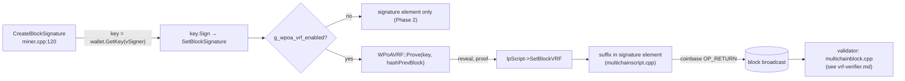

# `miner/miner.cpp` (wPoA Phase 3a — the VRF prover)

> Documentation of the **prover-side integration** of the wPoA VRF beacon: how the elected
> proposer produces its reveal and embeds it in the block. `miner.cpp` is a large file; this
> doc covers **only** the Phase 3a branch added to `CreateBlockSignature`. The Phase 2
> mining hook in the *same* file (`GetMinerAndExpectedMiningStartTime`) is a separate
> concern documented in [miner-integration.md](miner-integration.md).

This is a **modified host file**, not a new module. The change is one self-contained branch
delimited by `/* MCHN START - wPoA Phase 3a … */ … /* MCHN END */`.

## 1. Where the change lives and why there

The function (`miner.cpp:120`):

```cpp
bool CreateBlockSignature(CBlock *block,uint32_t hash_type,CWallet *pwallet,uint256 *cachedMerkleRoot)
```

`CreateBlockSignature` is called during block assembly to **sign the block** and stamp the
signature into the coinbase OP_RETURN. It computes a local `uint256 hash_to_verify`
(the block hash to sign). By the time the Phase 3a branch runs, the function has already:

```cpp
vchPubKey=std::vector<unsigned char>(block->vSigner+1, block->vSigner+1+block->vSigner[0]);
CPubKey pubKeyOut(vchPubKey);
CKey key;
if(!pwallet->GetKey(pubKeyOut.GetID(), key)) return false;   // the signer's PRIVATE key

vector<unsigned char> vchSig;
key.Sign(hash_to_verify, vchSig);                            // the block signature

mc_Script *lpScript = new mc_Script;
lpScript->SetBlockSignature(vchSig.data(),vchSig.size(),hash_type,block->vSigner+1,block->vSigner[0]);
```

So at the insertion point the function holds exactly the two things the VRF needs:

- **`key`** — the signer's secp256k1 *private* key (a `CKey`), just fetched from the wallet
  for `block->vSigner`. Under wPoA this signer is the elected proposer.
- **`lpScript`** — the `mc_Script` whose *current* element is the block-signature element
  that `SetBlockSignature` just created.

That is why the reveal is produced **here** and **immediately after** `SetBlockSignature`:
the private key is in scope, and `SetBlockVRF` appends to the current element (it must
follow `SetBlockSignature` with no `AddElement` in between — see
[block-vrf-encoding.md §4](block-vrf-encoding.md)). The include added at the top of the
file:

```cpp
#include "wpoa/vrf_wrapper.h"   // miner.cpp:26 — WPoAVRF
```

(`g_wpoa_vrf_enabled` comes from `wpoa/wpoa_selector.h`, already included for Phase 2.)

## 2. The added branch, line by line

```cpp
/* MCHN START - wPoA Phase 3a: embed the proposer's VRF reveal */
if(g_wpoa_vrf_enabled)
{
    unsigned char vrf_out[WPoAVRF::OUTPUT_SIZE];
    unsigned char vrf_proof[WPoAVRF::PROOF_SIZE];
    if(WPoAVRF::Prove(key.begin(),block->hashPrevBlock.begin(),block->hashPrevBlock.size(),
                      vrf_out,vrf_proof))
    {
        lpScript->SetBlockVRF(vrf_out,WPoAVRF::OUTPUT_SIZE,vrf_proof,WPoAVRF::PROOF_SIZE);
    }
    else
    {
        LogPrintf("wPoA-VRF: failed to produce VRF reveal for block, prev %s\n",
                  block->hashPrevBlock.ToString().c_str());
    }
}
/* MCHN END */
```

### `if(g_wpoa_vrf_enabled)`
- The flag set once from `-enablewpoavrf` in `AppInit2` (see [node-startup.md §2.6](node-startup.md)).
  When unset the whole branch is skipped and `CreateBlockSignature` behaves exactly as in
  Phase 2 — **zero change when the beacon is off**.
- **Note it gates on the *flag*, not on `WPoAVRFActiveAtHeight`.** Embedding is deliberately
  height-independent (the comment explains: *"Embedding is height-independent here … the
  receiving side only REQUIRES it on wPoA-governed heights, so a stray reveal on a pre-setup
  block is harmless."*). The signing path does not cheaply have the target height, and a
  reveal on a pre-setup block is never checked, so producing one unconditionally is simpler
  and cannot cause a false rejection. See
  [phase3a-implementation-guide.md §6.6](phase3a-implementation-guide.md#6-design-decisions).

### The output buffers
```cpp
unsigned char vrf_out[WPoAVRF::OUTPUT_SIZE];    // 32 bytes — the reveal R[n]
unsigned char vrf_proof[WPoAVRF::PROOF_SIZE];   // 97 bytes — the proof π[n]
```
Sized from the class constants so they always match the wire format
([vrf-wrapper.md §2.2](vrf-wrapper.md)). Stack buffers — no allocation.

### `WPoAVRF::Prove(key.begin(), block->hashPrevBlock.begin(), block->hashPrevBlock.size(), …)`
- **`key.begin()`** — a pointer to the 32 raw bytes of the signer's private key. `CKey`
  stores the secret as a byte range; `begin()` yields its start. This is what makes the VRF
  prover *identical* to the block signer — the reveal is produced with the same key that
  just signed the block, so no separate VRF key exists.
- **`block->hashPrevBlock.begin()` / `.size()`** — the previous block hash as raw bytes
  (`uint256`, 32 bytes) and its length. This is the VRF **input** `h[n-1]`, exactly the
  Phase 2 selection seed. The validator recomputes the check over the same bytes
  (`pindexNew->pprev` hash) — see [vrf-verifier.md](vrf-verifier.md).
- **`vrf_out` / `vrf_proof`** — filled on success. `Prove` runs the ECVRF construction
  ([vrf-wrapper.md §3.8](vrf-wrapper.md)): `H = HashToCurve(prevhash)`, `Gamma = sk·H`,
  reveal `= SHA256(…Gamma)`, and the DLEQ proof `Gamma ‖ c ‖ s`.

### On success — `SetBlockVRF`
```cpp
lpScript->SetBlockVRF(vrf_out,WPoAVRF::OUTPUT_SIZE,vrf_proof,WPoAVRF::PROOF_SIZE);
```
Appends `[reveal_len][reveal][proof_len][proof]` to the current (signature) element. After
this, the `for` loop that follows (unchanged) serializes every element of `lpScript` into
the coinbase OP_RETURN — the suffix rides along inside the one signature element, keeping
the element count at 1 (see [block-vrf-encoding.md §2](block-vrf-encoding.md)).

### On failure — log and embed nothing (fail-safe)
```cpp
else
    LogPrintf("wPoA-VRF: failed to produce VRF reveal for block, prev %s\n", …);
```
`Prove` returns false only if the key is invalid or a (negligible) degenerate scalar is hit
([vrf-wrapper.md §2.3](vrf-wrapper.md)). The branch does **not** abort block creation; it
logs and leaves the signature element with no VRF suffix. This is **fail-safe**: on a
VRF-governed height a block with no reveal is rejected by every peer
([vrf-verifier.md](vrf-verifier.md)), so a prover that cannot reveal simply fails to get its
block accepted — it can never produce a block that looks valid but lacks a verifiable
reveal. `LogPrintf` (always-on) makes the rare failure visible.

## 3. Effect on the native / Phase 2 path

- `-enablewpoavrf` **off** → the branch is skipped; `CreateBlockSignature` is byte-for-byte
  the Phase 2 function.
- `-enablewpoavrf` **on** → every block this node signs carries a reveal, regardless of
  height; only wPoA-governed heights have it checked.

The branch adds no locks and touches no shared state beyond reading the write-once flag and
the block it was handed (see
[phase3a-implementation-guide.md §7](phase3a-implementation-guide.md#7-threading--locking-model)).

## 4. Connections to the other files



- **`wpoa/vrf_wrapper.h`** — provides `WPoAVRF::Prove` and the size constants. See
  [vrf-wrapper.md](vrf-wrapper.md).
- **`wpoa/wpoa_selector.h`** — provides `g_wpoa_vrf_enabled` (Phase 3a glue). See
  [wpoa-selector.md §5](wpoa-selector.md).
- **`protocol/multichainscript.cpp`** — `SetBlockVRF` carries the reveal on-chain. See
  [block-vrf-encoding.md](block-vrf-encoding.md).
- **`protocol/multichainblock.cpp`** — the validator recomputes the same VRF over the same
  prev-hash and rejects a missing/invalid reveal. See [vrf-verifier.md](vrf-verifier.md).
- **Phase 2 `GetMinerAndExpectedMiningStartTime`** (same file) decides *whether* this node
  mines the block at all; only if it is the elected proposer does `CreateBlockSignature`
  run for it. See [miner-integration.md](miner-integration.md).
