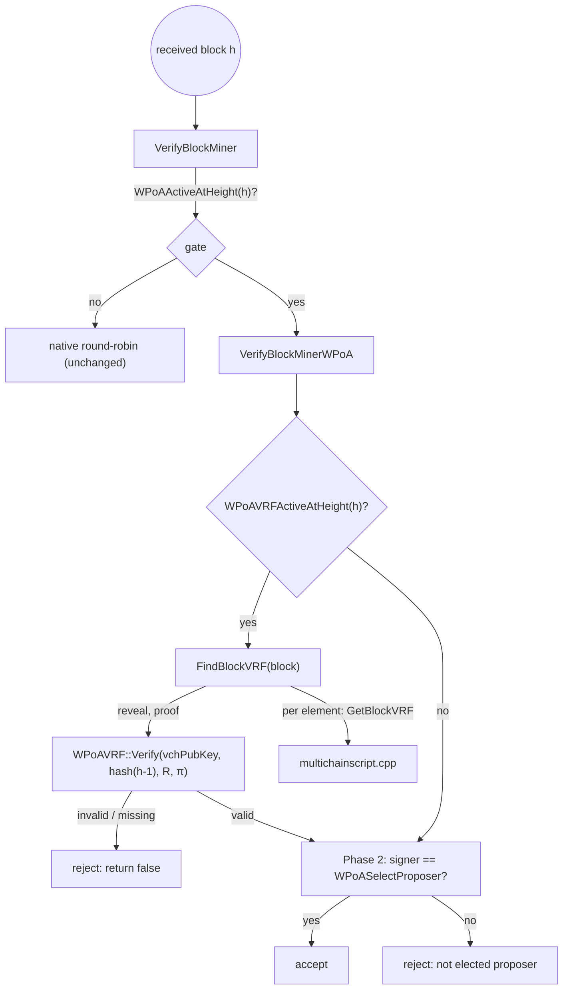

# `protocol/multichainblock.cpp` (wPoA Phase 3a — the VRF verifier)

> Documentation of the **verifier-side integration** of the wPoA VRF beacon: how every peer
> extracts the proposer's reveal and rejects a block whose reveal is missing or invalid.
> This doc covers **only** the Phase 3a additions — the new static `FindBlockVRF` and the
> VRF-check block inserted into `VerifyBlockMinerWPoA`. The Phase 2 proposer check in the
> *same* function is documented in [block-validation.md](block-validation.md).

This is a **modified host file**, not a new module. The additions are delimited by
`/* MCHN START - wPoA Phase 3a … */ … /* MCHN END */`. The include added at the top:

```cpp
#include "wpoa/vrf_wrapper.h"   // multichainblock.cpp:14 — WPoAVRF
```

(`WPoAVRFActiveAtHeight` comes from `wpoa/wpoa_selector.h`, already included for Phase 2.)

## 1. `FindBlockVRF` — extract the reveal from the coinbase

```cpp
static bool FindBlockVRF(CBlock *block,std::vector<unsigned char>& reveal,
                         std::vector<unsigned char>& proof)
{
    unsigned char reveal_buf[255];
    unsigned char proof_buf[255];

    reveal.clear();
    proof.clear();

    if(!mc_gState->m_NetworkParams->IsProtocolMultichain())
        return false;

    for (unsigned int i = 0; i < block->vtx.size(); i++)
    {
        const CTransaction &tx = block->vtx[i];
        if (tx.IsCoinBase())
        {
            for (unsigned int j = 0; j < tx.vout.size(); j++)
            {
                mc_gState->m_TmpScript1->Clear();
                const CScript& script1 = tx.vout[j].scriptPubKey;
                CScript::const_iterator pc1 = script1.begin();
                mc_gState->m_TmpScript1->SetScript((unsigned char*)(&pc1[0]),
                                                   (size_t)(script1.end()-pc1),
                                                   MC_SCR_TYPE_SCRIPTPUBKEY);

                for (int e = 0; e < mc_gState->m_TmpScript1->GetNumElements(); e++)
                {
                    mc_gState->m_TmpScript1->SetElement(e);
                    int reveal_size=sizeof(reveal_buf);
                    int proof_size=sizeof(proof_buf);
                    if(mc_gState->m_TmpScript1->GetBlockVRF(reveal_buf,&reveal_size,
                                                            proof_buf,&proof_size) == 0)
                    {
                        reveal.assign(reveal_buf,reveal_buf+reveal_size);
                        proof.assign(proof_buf,proof_buf+proof_size);
                        return true;
                    }
                }
            }
        }
    }
    return false;
}
```

- **`static`** — file-local; it mirrors the existing `FindSigner` in the same file
  (which scans the coinbase for the block signature). It scans for the *VRF suffix* the
  proposer embedded in the signature element (see [vrf-prover.md](vrf-prover.md) and
  [block-vrf-encoding.md](block-vrf-encoding.md)).
- **`reveal_buf`/`proof_buf` are 255 bytes** — the maximum a one-byte length field can
  express, so `GetBlockVRF` can never overflow them. The actual lengths come back through
  `reveal_size`/`proof_size` (initialized to the buffer capacity, overwritten with the
  decoded length).
- **`reveal.clear(); proof.clear();`** — the out-parameters start empty, so a `false`
  return leaves them empty (the caller only inspects them on `true`).
- **`IsProtocolMultichain()` guard** — VRF carriage only exists on a MultiChain-protocol
  chain; bail early otherwise.
- **The scan:** over every transaction that `IsCoinBase()`, over every output, decode the
  output's `scriptPubKey` into the shared scratch script `m_TmpScript1`
  (`Clear()` → `SetScript(bytes, len, MC_SCR_TYPE_SCRIPTPUBKEY)`), then over every element
  `SetElement(e)` and try `GetBlockVRF`. `GetBlockVRF` returns `0` (`MC_ERR_NOERROR`) only
  for the block-signature element that actually carries a VRF suffix, and
  `MC_ERR_WRONG_SCRIPT` for every other element or a suffix-less signature
  ([block-vrf-encoding.md §5](block-vrf-encoding.md)). The **first** match is copied into
  the vectors and `true` is returned.
- **`false`** means "this block carries no VRF reveal" — a pre-Phase-3a block, or a block
  signed with the beacon disabled, or one whose suffix is malformed/truncated.

`m_TmpScript1` is `mc_gState`'s single-threaded validation-path scratch script — the same
object the surrounding block-check code reuses — so `FindBlockVRF` allocates nothing and
introduces no shared mutable state beyond that per-validation scratch.

## 2. The VRF check in `VerifyBlockMinerWPoA`

`VerifyBlockMinerWPoA` (the Phase 2 function documented in
[block-validation.md](block-validation.md)) has, by the insertion point, already recovered
the signer's public key into `vchPubKey` and its address into `sMinerAddr`. The Phase 3a
block is inserted **before** the Phase 2 proposer computation:

```cpp
/* MCHN START - wPoA Phase 3a: verify the proposer's VRF reveal */
if(WPoAVRFActiveAtHeight(pindexNew->nHeight))
{
    std::vector<unsigned char> vrf_reveal,vrf_proof;
    if(!FindBlockVRF(pblock,vrf_reveal,vrf_proof))
    {
        LogPrintf("VerifyBlockMinerWPoA: REJECT block %s (height %d): missing VRF reveal\n",
                  pindexNew->GetBlockHash().ToString().c_str(),pindexNew->nHeight);
        return false;
    }
    uint256 hVRFInput=pindexNew->pprev->GetBlockHash();
    std::vector<unsigned char> vVRFInput(hVRFInput.begin(),hVRFInput.end());
    if(!WPoAVRF::Verify(vchPubKey,vVRFInput,vrf_reveal,vrf_proof))
    {
        LogPrintf("VerifyBlockMinerWPoA: REJECT block %s (height %d): invalid VRF reveal from signer %s\n",
                  pindexNew->GetBlockHash().ToString().c_str(),pindexNew->nHeight,sMinerAddr.c_str());
        return false;
    }
    LogPrint("wpoa","VerifyBlockMinerWPoA: VRF reveal OK block %s (height %d) signer %s\n",
             pindexNew->GetBlockHash().ToString().c_str(),pindexNew->nHeight,sMinerAddr.c_str());
}
/* MCHN END */

uint256 hSeed=pindexNew->pprev->GetBlockHash();                 // ← Phase 2 proposer check follows
std::string sProposer=WPoASelectProposer(hSeed.begin(),hSeed.size(),pindexNew->nHeight);
```

### `if(WPoAVRFActiveAtHeight(pindexNew->nHeight))`
- The gate = `-enablewpoavrf` AND `WPoAActiveAtHeight(height)` (see
  [wpoa-selector.md §5](wpoa-selector.md)). When false the block is skipped and validation
  proceeds exactly as in Phase 2. Because the gate is a pure function of the flag + chain
  params + height, the miner (which embedded a reveal because *its* flag was on) and the
  validator agree on which heights **require** one.

### Missing reveal → reject
```cpp
if(!FindBlockVRF(pblock,vrf_reveal,vrf_proof)) { … return false; }
```
On a VRF-governed height, a block with no extractable reveal is **rejected**. This is what
makes the reveal *mandatory*: an out-of-turn or Phase-2-only block cannot slip through on a
beacon chain. `LogPrintf` (always-on) records the rejection with height and block hash.

### Recompute the input and verify
```cpp
uint256 hVRFInput=pindexNew->pprev->GetBlockHash();
std::vector<unsigned char> vVRFInput(hVRFInput.begin(),hVRFInput.end());
if(!WPoAVRF::Verify(vchPubKey,vVRFInput,vrf_reveal,vrf_proof)) { … return false; }
```
- **`hVRFInput = pindexNew->pprev->GetBlockHash()`** — the previous block hash, i.e. the
  **same bytes** the prover used (there `block->hashPrevBlock`). Safe to dereference `pprev`
  because `VerifyBlockMiner` already ruled out `pprev == NULL` before delegating (see
  [block-validation.md §2](block-validation.md)).
- **`vVRFInput`** — the 32 hash bytes as a `std::vector`, to match the `WPoAVRF::Verify`
  vector overload.
- **`WPoAVRF::Verify(vchPubKey, vVRFInput, vrf_reveal, vrf_proof)`** — verifies the DLEQ
  proof against the **signer's own public key** (`vchPubKey`, already recovered for the
  Phase 2 check — no second key handling) and the prev-hash input, and checks that the
  reveal is the one the proof commits to ([vrf-wrapper.md §3.9](vrf-wrapper.md)). The vector
  overload also enforces the exact `32`/`97` byte lengths, so a well-framed but wrong-sized
  suffix is rejected here. A `false` → **reject**, naming the signer for diagnosis.

### Success → trace only
```cpp
LogPrint("wpoa","VerifyBlockMinerWPoA: VRF reveal OK …");
```
Category-gated (`-debug=wpoa`) success line — this is the `VRF reveal OK` evidence the
functional test greps for. No side effect; execution falls through to the Phase 2
`signer == proposer` check.

### Why *before* the proposer check
The VRF block runs **before** `WPoASelectProposer` and is independent of the weight
registry. Two consequences:

1. It is enforced **even on the empty-registry leniency path** — a node that cannot compute
   the Phase 2 election (unsynced weights → the lenient accept in
   [block-validation.md §3.4](block-validation.md)) still requires and verifies the reveal.
   The reveal check depends only on the block's own signer key and its parent hash, both of
   which every node has, so there is no reason to be lenient about it.
2. A forged/absent reveal is rejected without even reading the weight map — cheaper, and it
   closes the beacon requirement independently of selection.

## 3. Miner ↔ validator symmetry (VRF)

| | Prover (`miner.cpp`, `CreateBlockSignature`) | Verifier (`multichainblock.cpp`, `VerifyBlockMinerWPoA`) |
|---|---|---|
| Gate | `g_wpoa_vrf_enabled` (flag only) | `WPoAVRFActiveAtHeight(pindexNew->nHeight)` (flag AND height) |
| Key | signer private key `key.begin()` | signer public key `vchPubKey` (from `vSigner`) |
| Input | `block->hashPrevBlock` | `hash(pindexNew->pprev)` |
| Op | `WPoAVRF::Prove` → `SetBlockVRF` | `FindBlockVRF` → `WPoAVRF::Verify` |
| Action | embed reveal (or log + skip) | reveal valid → continue; missing/invalid → reject |

The private/public halves of the same secp256k1 key and the identical prev-hash input mean
that an honestly-produced reveal always verifies, and only the holder of the signer's
secret could have produced it — the reveal is bound to the block's proposer identity.

## 4. Connections to the other files



- **`wpoa/vrf_wrapper.h`** — provides `WPoAVRF::Verify`. See [vrf-wrapper.md](vrf-wrapper.md).
- **`wpoa/wpoa_selector.h`** — provides `WPoAVRFActiveAtHeight` (Phase 3a glue). See
  [wpoa-selector.md §5](wpoa-selector.md).
- **`protocol/multichainscript.cpp`** — `GetBlockVRF` (called by `FindBlockVRF`) decodes the
  on-chain suffix. See [block-vrf-encoding.md](block-vrf-encoding.md).
- **`miner/miner.cpp`** — the prover this file enforces; same key, same input, mirror
  operation. See [vrf-prover.md](vrf-prover.md).
- **Phase 2 proposer check** (same function) runs immediately after the VRF check. See
  [block-validation.md](block-validation.md).
