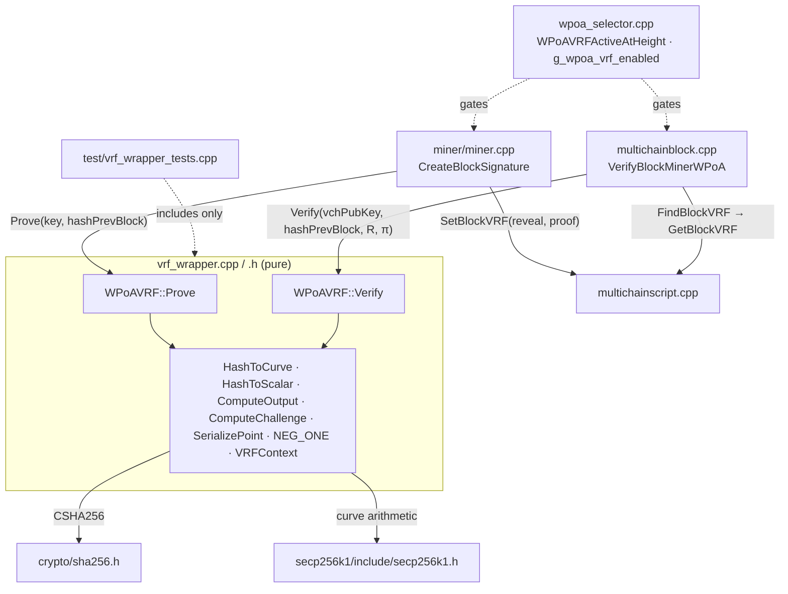

# `vrf_wrapper.h` + `vrf_wrapper.cpp`

> Detailed technical walkthrough of the **pure cryptographic core of wPoA Phase 3a**: the
> `WPoAVRF` class — an ECVRF / Chaum–Pedersen DLEQ Verifiable Random Function over the
> secp256k1 curve already bundled with MultiChain.

These two files are documented together (interface header + implementation). The split is
the same pure-core / node-glue discipline used in Phase 2's
[wpoa-selector.md](wpoa-selector.md), taken to its limit: here **both** files are
node-free.

| File | Role |
|------|------|
| `vrf_wrapper.h` | The `WPoAVRF` class declaration: the on-chain wire-format size constants and the four static `Prove`/`Verify` entry points (raw-pointer + `std::vector`). Depends only on `<stddef.h>`, `<stdint.h>`, `<vector>`. |
| `vrf_wrapper.cpp` | The ECVRF implementation over the **core** secp256k1 API: an anonymous namespace of helpers (context singleton, hash-to-curve, hash-to-scalar, output/challenge hashes, point negation) plus the `Prove`/`Verify` bodies. |

### 1. Why is the whole thing node-free?

Because the VRF is **consensus-critical** and must be tested exhaustively without a
running node — the same reasoning as the Phase 2 selector core. The header comment states
the intent directly:

> *"This wrapper is PURE and node-free (it depends only on secp256k1 + SHA256), so it is
> unit-tested in isolation (test/vrf_wrapper_tests.cpp) exactly like the Phase 2 selector
> core. The node-coupled activation flag/predicate (g_wpoa_vrf_enabled,
> WPoAVRFActiveAtHeight) live with the rest of the wPoA node glue in wpoa_selector.{h,cpp},
> not here."*

- **The core depends only on secp256k1 + SHA256.** The unit test
  ([`test/vrf_wrapper_tests.cpp`](../test/vrf_wrapper_tests.cpp)) compiles
  `vrf_wrapper.cpp` + `crypto/sha256.cpp` and links `libsecp256k1.a` — no wallet, no
  chain, no node runtime. That lets the soundness properties (tamper/forgery/cross-key
  rejection) be validated in milliseconds.
- **All methods are `static`.** There is no per-instance state; you never construct a
  `WPoAVRF`. Keys are the ordinary secp256k1 validator keys (a 32-byte secret and a
  33-byte compressed / 65-byte uncompressed public key) — no separate VRF key material is
  introduced. This is what makes "the block signer" and "the VRF prover" one identity.

---

## 2. `vrf_wrapper.h`

### 2.1 Includes and their provenance

```cpp
#include <stddef.h>    // size_t
#include <stdint.h>    // uint8_t / uint32_t used across the API and impl
#include <vector>      // std::vector for the convenience overloads
```

Deliberately minimal: no secp256k1 or SHA256 header appears in the **public** header, so a
caller only needs to know the byte-length constants and the method signatures. The
implementation-only includes (`crypto/sha256.h`, `secp256k1.h`) live in the `.cpp`. This
keeps `WPoAVRF` a clean boundary and means callers (`miner.cpp`, `multichainblock.cpp`)
pull in no crypto headers transitively.

### 2.2 The wire-format size constants

```cpp
static const size_t OUTPUT_SIZE = 32;        // reveal R[n] = SHA256(...)
static const size_t GAMMA_SIZE  = 33;        // compressed pre-output point
static const size_t SCALAR_SIZE = 32;        // c and s
static const size_t PROOF_SIZE  = GAMMA_SIZE + SCALAR_SIZE + SCALAR_SIZE; // 97
```

- `OUTPUT_SIZE = 32` — the reveal is a single SHA-256 digest.
- `GAMMA_SIZE = 33` — `Gamma = sk·H` serialized as a **compressed** secp256k1 point
  (1 prefix byte + 32-byte x-coordinate).
- `SCALAR_SIZE = 32` — the DLEQ challenge `c` and response `s` are each a 256-bit scalar.
- `PROOF_SIZE = 97` — the proof is `compressed(Gamma) ‖ c ‖ s` = 33 + 32 + 32.

These are **part of the on-chain wire format** (the miner writes exactly `OUTPUT_SIZE`
reveal bytes and `PROOF_SIZE` proof bytes into the block; the verifier's vector overload
rejects anything else — §3.6). They are `static const` class members so both the crypto
and the callers share one source of truth; the callers size their stack buffers as
`unsigned char vrf_out[WPoAVRF::OUTPUT_SIZE]` etc.

Because they are **odr-used** (e.g. bound to a `const&` inside Boost.Test macros, and used
as array bounds), the `.cpp` provides out-of-line definitions (§3.1). Without those, a
non-inlined use would fail to link on a strict compiler.

### 2.3 The `Prove` entry points

```cpp
static bool Prove(const unsigned char* sk32,
                  const unsigned char* input, size_t input_len,
                  unsigned char* output32, unsigned char* proof);
```

- `sk32` — 32-byte secret key (a valid secp256k1 scalar in `[1,n-1]`). This is the block
  signer's key; the caller passes `key.begin()`.
- `input` / `input_len` — the public VRF input bytes. In Phase 3a this is the previous
  block hash (`block->hashPrevBlock`, 32 bytes), but the API is length-generic so Phase 3b
  can feed a RANDAO seed of any length.
- `output32` — `[out]` `OUTPUT_SIZE` bytes: the reveal `R[n]`.
- `proof` — `[out]` `PROOF_SIZE` bytes: the proof `π[n]`.
- Returns `true` on success; `false` if the key is invalid or a (negligible) degenerate
  scalar is hit — **callers treat `false` as "cannot reveal"** and embed nothing
  (fail-safe; see [vrf-prover.md](vrf-prover.md)).

The doc comment stresses the two properties that matter to the beacon: it is
**deterministic in `(sk, input)`** (same key + input ⇒ same `(output, proof)`), and by VRF
uniqueness **no other `(output, proof)` will verify**. It uses a hash-derived deterministic
nonce, so it needs no external randomness and never leaks the key through a bad nonce.

### 2.4 The `Verify` entry points

```cpp
static bool Verify(const unsigned char* pubkey, size_t pubkey_len,
                   const unsigned char* input, size_t input_len,
                   const unsigned char* output32, const unsigned char* proof);
```

- `pubkey` / `pubkey_len` — the proposer's serialized public key, **33-byte compressed or
  65-byte uncompressed** (secp256k1 parses both; the unit test checks both).
- `input` / `input_len` — must match what `Prove` was given.
- `output32` / `proof` — the claimed reveal and proof.
- Returns `true` iff `proof` is a valid DLEQ proof for `pubkey` over `input` **and**
  `output32` is exactly the reveal that `proof` commits to.

The comment records the contract for the caller: *a validator MUST reject a wPoA-VRF block
whose reveal does not verify, and MAY then trust the reveal as an unbiased, unpredictable
contribution bound to the proposer's identity.*

### 2.5 The `std::vector` convenience overloads

```cpp
static bool Prove (const std::vector<unsigned char>& sk,
                   const std::vector<unsigned char>& input,
                   std::vector<unsigned char>& output,
                   std::vector<unsigned char>& proof);
static bool Verify(const std::vector<unsigned char>& pubkey,
                   const std::vector<unsigned char>& input,
                   const std::vector<unsigned char>& output,
                   const std::vector<unsigned char>& proof);
```

Thin wrappers that (a) size/validate the buffers and (b) call the raw-pointer versions.
The verifier (`multichainblock.cpp`) uses the vector `Verify` because it already has the
reveal/proof as `std::vector<unsigned char>` from `FindBlockVRF`. Their body is in §3.6.

---

## 3. `vrf_wrapper.cpp` — the implementation

### 3.1 Includes and the static-constant definitions

```cpp
#include "wpoa/vrf_wrapper.h"
#include "crypto/sha256.h"     // CSHA256
#include <cstring>             // memcpy / memcmp
#include <secp256k1.h>         // the curve API

const size_t WPoAVRF::OUTPUT_SIZE;   // out-of-line definitions of the in-class
const size_t WPoAVRF::GAMMA_SIZE;    // static constants (required when odr-used,
const size_t WPoAVRF::SCALAR_SIZE;   // e.g. bound to a const& by Boost.Test)
const size_t WPoAVRF::PROOF_SIZE;
```

- `crypto/sha256.h` → **`CSHA256`**, MultiChain/Bitcoin's streaming SHA-256. Its interface:
  `Write(const unsigned char*, size_t)` (chainable, returns `*this`) and
  `Finalize(unsigned char[32])`. Used for hash-to-curve, hash-to-scalar, and the output.
- `secp256k1.h` → the curve arithmetic (§3.2 lists every function used).
- The four `const size_t WPoAVRF::… ;` lines are the C++ requirement: an in-class
  `static const` needs a namespace-scope definition when its address is taken or it is
  bound to a reference. Boost.Test's `BOOST_CHECK_EQUAL(output.size(), WPoAVRF::OUTPUT_SIZE)`
  does exactly that, so these must exist or the test would not link.

### 3.2 Which secp256k1 functions, and why they are safe here

The comment header lists the constraint precisely: **only the *core* secp256k1 API is
used**, none of it behind an optional module, so it is present in MultiChain's build (which
enables only the recovery module). The functions:

| Function | Use |
|----------|-----|
| `secp256k1_context_create(SIGN\|VERIFY)` | the one process-wide context |
| `secp256k1_ec_seckey_verify` | validate `sk`; accept a hash as a scalar in `[1,n-1]` |
| `secp256k1_ec_pubkey_create` | `PK = sk·G`, `U = k·G`, `s·G` |
| `secp256k1_ec_pubkey_parse` | parse `PK`, `Gamma`, and the hash-to-curve candidate |
| `secp256k1_ec_pubkey_serialize` | compress a point to 33 bytes |
| `secp256k1_ec_pubkey_tweak_mul` | scalar·point: `sk·H`, `k·H`, `c·PK`, `c·Gamma`, and negation |
| `secp256k1_ec_pubkey_combine` | point addition: `U' = s·G + (−c·PK)`, `V' = s·H + (−c·Gamma)` |
| `secp256k1_ec_privkey_tweak_mul` / `_tweak_add` | scalar arithmetic mod n: `s = sk·c + k` |

The header also records **why the plain DLEQ is a sound VRF here**: secp256k1 has cofactor
1, so `H` (a curve point) has prime order — there is no small-subgroup / cofactor-clearing
step, and the Chaum–Pedersen proof of equal discrete logs suffices. This is what lets the
code skip the cofactor machinery of the full RFC 9381 suites.

### 3.3 The anonymous-namespace constants and the context singleton

```cpp
namespace {

const char        VRF_SUITE_TAG[]   = "MC-wPoA-VRF-secp256k1-v1";
const size_t      VRF_SUITE_TAG_LEN = sizeof(VRF_SUITE_TAG) - 1; // drop the NUL
const unsigned char ROLE_NONCE      = 0x01;
const unsigned char ROLE_CHALLENGE  = 0x02;
const unsigned char ROLE_OUTPUT     = 0x03;
const unsigned char ROLE_H2C        = 0x04;

const unsigned char NEG_ONE[32] = { 0xFF,…,0xFE,0xBA,0xAE,…,0x41,0x40 };

secp256k1_context* VRFContext()
{
    static secp256k1_context* ctx =
        secp256k1_context_create(SECP256K1_CONTEXT_SIGN | SECP256K1_CONTEXT_VERIFY);
    return ctx;
}

} // anonymous namespace
```

- **`VRF_SUITE_TAG` + role bytes = domain separation.** Every hash in the construction is
  prefixed with the suite tag *and* a one-byte role, so the four distinct hash usages
  (curve `0x04`, challenge `0x02`, output `0x03`, nonce `0x01`) can never collide on their
  inputs — and a future VRF variant with a different tag is cleanly separated from this
  one. `VRF_SUITE_TAG_LEN` uses `sizeof(...) - 1` to drop the C-string NUL terminator so it
  is not fed into the hash.
- **`NEG_ONE` = `n − 1`** where `n` is the secp256k1 group order. Multiplying a point by
  this constant negates it, because `n − 1 ≡ −1 (mod n)`, so `(n−1)·P = −P`. This is the
  workaround for the missing `secp256k1_ec_pubkey_negate` in this library vintage — the
  code needs `−c·PK` and `−c·Gamma` during verification (§3.9). The 32 bytes are the
  big-endian encoding of `n−1`.
- **`VRFContext()`** returns a single sign+verify context, created once. C++11 guarantees a
  function-local `static` is initialized exactly once and thread-safely, so concurrent
  first calls from the miner and validation threads cannot race. The context is used
  read-only after creation, so all later concurrent use is safe (see
  [phase3a-implementation-guide.md §7](phase3a-implementation-guide.md#7-threading--locking-model)).
- The anonymous namespace gives all of these **internal linkage** — they are private to
  this translation unit and cannot clash with any other symbol in the node.

### 3.4 `SerializePoint` — compress a point to 33 bytes

```cpp
bool SerializePoint(const secp256k1_pubkey* p, unsigned char out33[33])
{
    size_t len = 33;
    if (!secp256k1_ec_pubkey_serialize(VRFContext(), out33, &len, p, SECP256K1_EC_COMPRESSED))
        return false;
    return len == 33;
}
```

Every point that goes into a hash (`H`, `PK`, `Gamma`, `U`, `V`) is first serialized to its
canonical **compressed** 33-byte form, so prover and verifier hash byte-identical
representations. `SECP256K1_EC_COMPRESSED` selects the 33-byte encoding. The `len == 33`
check is belt-and-suspenders; it never fails for a valid in-memory point.

### 3.5 `HashToCurve` — deterministic map from bytes to a curve point

```cpp
bool HashToCurve(const unsigned char* input, size_t input_len, secp256k1_pubkey* out)
{
    unsigned char candidate[33];
    candidate[0] = 0x02; // even-Y compressed prefix; the branch is irrelevant to soundness
    for (uint32_t counter = 0; counter < 256; counter++)
    {
        unsigned char ctr = (unsigned char)counter;
        CSHA256 h;
        h.Write((const unsigned char*)VRF_SUITE_TAG, VRF_SUITE_TAG_LEN);
        h.Write(&ROLE_H2C, 1);
        h.Write(&ctr, 1);
        h.Write(input, input_len);
        h.Finalize(candidate + 1);
        if (secp256k1_ec_pubkey_parse(VRFContext(), out, candidate, 33))
            return true;
    }
    return false; // unreachable in practice
}
```

This is **try-and-increment**. Each iteration hashes `suite ‖ ROLE_H2C ‖ counter ‖ input`
into the 32 bytes *after* a fixed `0x02` prefix, producing a 33-byte compressed-point
candidate, and tries to parse it as a curve point:

- `candidate[0] = 0x02` fixes the "even Y" prefix. A random 32-byte value is a valid
  x-coordinate for roughly **half** of all strings (an `x` is valid iff `x³ + 7` is a
  quadratic residue), so a parse succeeds with ≈ 1/2 probability per try and the loop
  terminates after ≈ 2 tries on average. Which of the two Y values you take does not affect
  soundness — both are honest points on the curve; the prover and verifier just need the
  *same* one, and the deterministic hash guarantees that.
- The `counter` (a single byte, `0..255`) is mixed in so a failed candidate is retried with
  fresh bytes. 256 iterations is astronomically more than enough (probability of failing
  all 256 is ~`2^-256`), so the trailing `return false` is unreachable — it exists only so
  the function is total.
- **Determinism is the whole point:** every node computes the identical `H` from the public
  input, so the DLEQ statement (`log_H(Gamma) = log_G(PK)`) is over the same `H` on both
  sides.

### 3.6 `HashToScalar` — uniform scalar in `[1, n-1]`

```cpp
bool HashToScalar(unsigned char role,
                  const unsigned char* const* chunks, const size_t* chunk_lens,
                  size_t n_chunks, unsigned char out32[32])
{
    for (uint32_t counter = 0; counter < 256; counter++)
    {
        unsigned char ctr = (unsigned char)counter;
        CSHA256 h;
        h.Write((const unsigned char*)VRF_SUITE_TAG, VRF_SUITE_TAG_LEN);
        h.Write(&role, 1);
        h.Write(&ctr, 1);
        for (size_t i = 0; i < n_chunks; i++)
            h.Write(chunks[i], chunk_lens[i]);
        h.Finalize(out32);
        if (secp256k1_ec_seckey_verify(VRFContext(), out32))
            return true;
    }
    return false; // unreachable in practice
}
```

Hashes an arbitrary list of byte-chunks (prefixed by suite + role + counter) and **rejects
until valid**: `secp256k1_ec_seckey_verify` accepts exactly the scalars in `[1, n-1]`
(it rejects `0` and anything `≥ n`), so the returned 32 bytes are a uniform valid scalar.

- **Why a rejection loop rather than reduce-mod-n?** Reducing a 256-bit hash mod `n`
  introduces a tiny modular bias toward the low end (the top `2^256 − n` values wrap). The
  rejection loop removes both the `== 0` and the `≥ n` cases with no bias. In any case `n`
  is within ~`2^-128` of `2^256`, so a rejection almost never happens (≈ 1 in `2^128`); the
  loop essentially always returns on `counter == 0`.
- **`chunks` is an array of pointers** so the same helper serves both scalar hashes: the
  nonce (`sk ‖ compressed(H)`) and the challenge (`H ‖ PK ‖ Gamma ‖ U ‖ V`). `role`
  separates them.
- Both prover and verifier run this identical deterministic loop, so they derive the
  identical scalar — essential for the challenge to match.

### 3.7 `ComputeOutput` and `ComputeChallenge`

```cpp
void ComputeOutput(const unsigned char gamma33[33], unsigned char out32[32])
{
    CSHA256 h;
    h.Write((const unsigned char*)VRF_SUITE_TAG, VRF_SUITE_TAG_LEN);
    h.Write(&ROLE_OUTPUT, 1);      // 0x03
    h.Write(gamma33, 33);
    h.Finalize(out32);
}

bool ComputeChallenge(const unsigned char H33[33], const unsigned char PK33[33],
                      const unsigned char Gamma33[33], const unsigned char U33[33],
                      const unsigned char V33[33], unsigned char out_c[32])
{
    const unsigned char* chunks[5] = { H33, PK33, Gamma33, U33, V33 };
    const size_t lens[5]           = { 33, 33, 33, 33, 33 };
    return HashToScalar(ROLE_CHALLENGE, chunks, lens, 5, out_c);  // 0x02
}
```

- **`ComputeOutput`** — the reveal is `R = SHA256(suite ‖ 0x03 ‖ compressed(Gamma))`. It
  depends **only on `Gamma`**, which is why the verifier can recompute the expected output
  from the proof's `Gamma` bytes and reject a swapped reveal (§3.9) without redoing the
  DLEQ.
- **`ComputeChallenge`** — the Fiat–Shamir challenge `c` binds the proof to *both*
  statement points (`PK = sk·G`, `Gamma = sk·H`) and *both* commitments (`U = k·G`,
  `V = k·H`). Hashing all five compressed points is what makes the transcript
  non-malleable: change any point and `c` changes, so the verifier's recomputed `c'` will
  not match.

### 3.8 `WPoAVRF::Prove` — putting it together

```cpp
bool WPoAVRF::Prove(const unsigned char* sk32,
                    const unsigned char* input, size_t input_len,
                    unsigned char* output32, unsigned char* proof)
{
    secp256k1_context* ctx = VRFContext();

    if (!secp256k1_ec_seckey_verify(ctx, sk32))            return false;   // (1)

    secp256k1_pubkey PK;
    if (!secp256k1_ec_pubkey_create(ctx, &PK, sk32))       return false;   // (2) PK = sk·G

    secp256k1_pubkey H;
    if (!HashToCurve(input, input_len, &H))                return false;   // (3) H
    secp256k1_pubkey Gamma = H;
    if (!secp256k1_ec_pubkey_tweak_mul(ctx, &Gamma, sk32)) return false;   //     Gamma = sk·H

    unsigned char H33[33], PK33[33], Gamma33[33];
    if (!SerializePoint(&H, H33) || !SerializePoint(&PK, PK33) ||
        !SerializePoint(&Gamma, Gamma33))                  return false;   // (4)

    unsigned char k[32];                                                   // (5) deterministic nonce
    {
        const unsigned char* chunks[2] = { sk32, H33 };
        const size_t lens[2]           = { 32, 33 };
        if (!HashToScalar(ROLE_NONCE, chunks, lens, 2, k)) return false;
    }

    secp256k1_pubkey U;
    if (!secp256k1_ec_pubkey_create(ctx, &U, k))           return false;   // (6) U = k·G
    secp256k1_pubkey V = H;
    if (!secp256k1_ec_pubkey_tweak_mul(ctx, &V, k))        return false;   //     V = k·H

    unsigned char U33[33], V33[33];
    if (!SerializePoint(&U, U33) || !SerializePoint(&V, V33)) return false;

    unsigned char c[32];
    if (!ComputeChallenge(H33, PK33, Gamma33, U33, V33, c)) return false;  // (7) c

    unsigned char s[32];                                                   // (8) s = sk·c + k
    memcpy(s, sk32, 32);
    if (!secp256k1_ec_privkey_tweak_mul(ctx, s, c))        return false;   //     s = sk·c
    if (!secp256k1_ec_privkey_tweak_add(ctx, s, k))        return false;   //     s = sk·c + k

    ComputeOutput(Gamma33, output32);                                      // (9) output
    memcpy(proof,           Gamma33, 33);                                  //     proof = Gamma‖c‖s
    memcpy(proof + 33,      c,       32);
    memcpy(proof + 33 + 32, s,       32);
    return true;
}
```

Step by step, mapping to §4.1 of the guide:

1. **Reject an invalid key** up front (`seckey_verify`). Callers rely on this to know a
   `false` return means "cannot reveal".
2. **`PK = sk·G`** via `pubkey_create` (the standard "public key from secret key" call).
3. **`H = HashToCurve(input)`**, then **`Gamma = sk·H`** by tweaking a copy of `H` by `sk`
   (`Gamma = H` copies the point, then `tweak_mul` multiplies it by the scalar in place).
4. **Serialize** `H`, `PK`, `Gamma` to compressed bytes for the hashes.
5. **Deterministic nonce** `k = HashToScalar(0x01, sk ‖ compressed(H))`. Binding `k` to
   the secret and the input (via `H`) is the RFC 6979-style construction that removes the
   nonce-reuse footgun.
6. **`U = k·G`, `V = k·H`** — the DLEQ commitments.
7. **`c`** — the Fiat–Shamir challenge over the five points.
8. **`s = sk·c + k mod n`** — computed with the *private-key* tweak helpers so the modular
   reduction is handled by the library: copy `sk` into `s`, multiply by `c`, add `k`.
9. **Assemble outputs**: the reveal is `SHA256(…Gamma)`; the proof is the concatenation
   `Gamma ‖ c ‖ s` written at offsets 0, 33, 65.

Any library failure at any step returns `false` — the caller embeds no reveal, and the
block will fail verification (fail-safe).

### 3.9 `WPoAVRF::Verify` — recompute and compare

```cpp
bool WPoAVRF::Verify(const unsigned char* pubkey, size_t pubkey_len,
                     const unsigned char* input, size_t input_len,
                     const unsigned char* output32, const unsigned char* proof)
{
    secp256k1_context* ctx = VRFContext();

    secp256k1_pubkey PK;
    if (!secp256k1_ec_pubkey_parse(ctx, &PK, pubkey, pubkey_len)) return false;   // (1)

    const unsigned char* Gamma_bytes = proof;                                     // (2) split proof
    const unsigned char* c           = proof + 33;
    const unsigned char* s           = proof + 33 + 32;

    secp256k1_pubkey Gamma;
    if (!secp256k1_ec_pubkey_parse(ctx, &Gamma, Gamma_bytes, 33)) return false;
    if (!secp256k1_ec_seckey_verify(ctx, c) ||
        !secp256k1_ec_seckey_verify(ctx, s))                     return false;    // (3) range-check c,s

    unsigned char expected_output[32];                                            // (4) reveal must match Gamma
    ComputeOutput(Gamma_bytes, expected_output);
    if (memcmp(expected_output, output32, 32) != 0)             return false;

    secp256k1_pubkey H;
    if (!HashToCurve(input, input_len, &H))                     return false;     // (5) same H as prover

    secp256k1_pubkey sG;                                                          // (6) U' = s·G − c·PK
    if (!secp256k1_ec_pubkey_create(ctx, &sG, s))              return false;
    secp256k1_pubkey negcPK = PK;
    if (!secp256k1_ec_pubkey_tweak_mul(ctx, &negcPK, c) ||        // c·PK
        !secp256k1_ec_pubkey_tweak_mul(ctx, &negcPK, NEG_ONE))   // −(c·PK)
                                                                  return false;
    secp256k1_pubkey Uprime;
    { const secp256k1_pubkey* ins[2] = { &sG, &negcPK };
      if (!secp256k1_ec_pubkey_combine(ctx, &Uprime, ins, 2))    return false; }  // infinity ⇒ reject

    secp256k1_pubkey sH = H;                                                      // (7) V' = s·H − c·Gamma
    if (!secp256k1_ec_pubkey_tweak_mul(ctx, &sH, s))           return false;
    secp256k1_pubkey negcGamma = Gamma;
    if (!secp256k1_ec_pubkey_tweak_mul(ctx, &negcGamma, c) ||
        !secp256k1_ec_pubkey_tweak_mul(ctx, &negcGamma, NEG_ONE)) return false;
    secp256k1_pubkey Vprime;
    { const secp256k1_pubkey* ins[2] = { &sH, &negcGamma };
      if (!secp256k1_ec_pubkey_combine(ctx, &Vprime, ins, 2))    return false; }

    unsigned char H33[33], PK33[33], Gamma33[33], Up33[33], Vp33[33];             // (8) c' and compare
    if (!SerializePoint(&H, H33) || !SerializePoint(&PK, PK33) ||
        !SerializePoint(&Gamma, Gamma33) || !SerializePoint(&Uprime, Up33) ||
        !SerializePoint(&Vprime, Vp33))                         return false;

    unsigned char cprime[32];
    if (!ComputeChallenge(H33, PK33, Gamma33, Up33, Vp33, cprime)) return false;

    return memcmp(cprime, c, 32) == 0;
}
```

Step by step, mapping to §4.2:

1. **Parse `PK`** from the caller's bytes; `pubkey_parse` accepts both 33-byte compressed
   and 65-byte uncompressed encodings, so either serialization of the signer key verifies.
2. **Split the 97-byte proof** into `Gamma` (0..32), `c` (33..64), `s` (65..96) and parse
   `Gamma` as a point.
3. **Range-check `c` and `s`** with `seckey_verify`: they must be valid scalars in
   `[1,n-1]` before being used as tweaks (a `0` or `≥ n` scalar would make the tweak calls
   fail or be ill-defined). This rejects a proof with an out-of-range scalar outright.
4. **Reveal-binding check:** recompute `SHA256(…Gamma)` and `memcmp` against the claimed
   `output32`. A block that swaps in a different reveal (but keeps a valid DLEQ) is rejected
   here — the reveal is *bound to* `Gamma`.
5. **Recompute `H`** from the input, identically to the prover.
6. **`U' = s·G − c·PK`:** compute `s·G` (`pubkey_create` on the scalar `s`), compute
   `−(c·PK)` by tweak-multiplying `PK` first by `c` then by `NEG_ONE`, and add the two with
   `pubkey_combine`. If the sum is the **point at infinity** (`s·G == c·PK`, which requires
   `k == 0`), `pubkey_combine` fails and the function rejects — an honest proof never
   produces this.
7. **`V' = s·H − c·Gamma`:** same pattern with `H` and `Gamma`.
8. **Recompute the challenge** `c' = ComputeChallenge(H, PK, Gamma, U', V')` and accept iff
   `c' == c`. For an honest proof `U' = U` and `V' = V` (the algebra in §4.2), so `c' = c`;
   any tampering with the reveal, a proof field, the key, or the input perturbs at least one
   hashed value and the comparison fails.

### 3.10 The `std::vector` overloads

```cpp
bool WPoAVRF::Prove(const std::vector<unsigned char>& sk,
                    const std::vector<unsigned char>& input,
                    std::vector<unsigned char>& output,
                    std::vector<unsigned char>& proof)
{
    output.clear(); proof.clear();
    if (sk.size() != 32) return false;
    unsigned char out_buf[OUTPUT_SIZE], proof_buf[PROOF_SIZE];
    if (!Prove(sk.data(), input.data(), input.size(), out_buf, proof_buf)) return false;
    output.assign(out_buf, out_buf + OUTPUT_SIZE);
    proof.assign(proof_buf, proof_buf + PROOF_SIZE);
    return true;
}

bool WPoAVRF::Verify(const std::vector<unsigned char>& pubkey,
                     const std::vector<unsigned char>& input,
                     const std::vector<unsigned char>& output,
                     const std::vector<unsigned char>& proof)
{
    if (output.size() != OUTPUT_SIZE || proof.size() != PROOF_SIZE) return false;
    return Verify(pubkey.data(), pubkey.size(), input.data(), input.size(),
                  output.data(), proof.data());
}
```

- **`Prove` (vector)** — clears the outputs first (so on failure they are left empty, per
  the doc contract), validates the key length (`sk.size() != 32` → clean `false`, which
  the unit test exercises with a 16-byte key), fills fixed stack buffers, and copies them
  into the output vectors on success.
- **`Verify` (vector)** — rejects any reveal/proof whose length is not exactly
  `OUTPUT_SIZE`/`PROOF_SIZE`. This is the **wire-format length gate**: the on-chain suffix
  is variable-length-prefixed (`GetBlockVRF` can return any lengths up to 255), so this
  check is what forces a wPoA-VRF reveal to be exactly 32 + 97 bytes before the crypto even
  runs. The verifier in `multichainblock.cpp` calls this overload.

---

## 4. Connections to the other files



- **`vrf_wrapper.{h,cpp}` (core) ← unit test:** the test compiles the `.cpp` and links only
  secp256k1 + SHA256 — the entire reason the crypto is node-free. See
  [phase3a-implementation-guide.md §13.1](phase3a-implementation-guide.md#13-tests).
- **`crypto/sha256.h`** supplies `CSHA256` for hash-to-curve, hash-to-scalar and the
  output.
- **`secp256k1/include/secp256k1.h`** supplies the curve arithmetic — the same library the
  validator signing keys use, which is why the VRF prover *is* the block signer.
- **`miner/miner.cpp`** calls `Prove` and then `SetBlockVRF`. See [vrf-prover.md](vrf-prover.md).
- **`protocol/multichainblock.cpp`** calls `FindBlockVRF`/`GetBlockVRF` then `Verify`. See
  [vrf-verifier.md](vrf-verifier.md).
- **`protocol/multichainscript.cpp`** carries the reveal on-chain. See
  [block-vrf-encoding.md](block-vrf-encoding.md).
- **`wpoa_selector.cpp`** provides the `g_wpoa_vrf_enabled` flag and
  `WPoAVRFActiveAtHeight` gate that decide *when* `Prove`/`Verify` are invoked. See
  [wpoa-selector.md §5](wpoa-selector.md).
