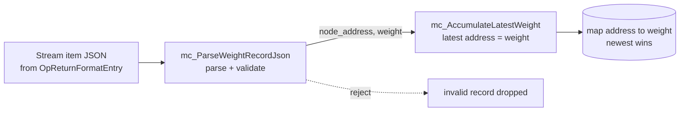
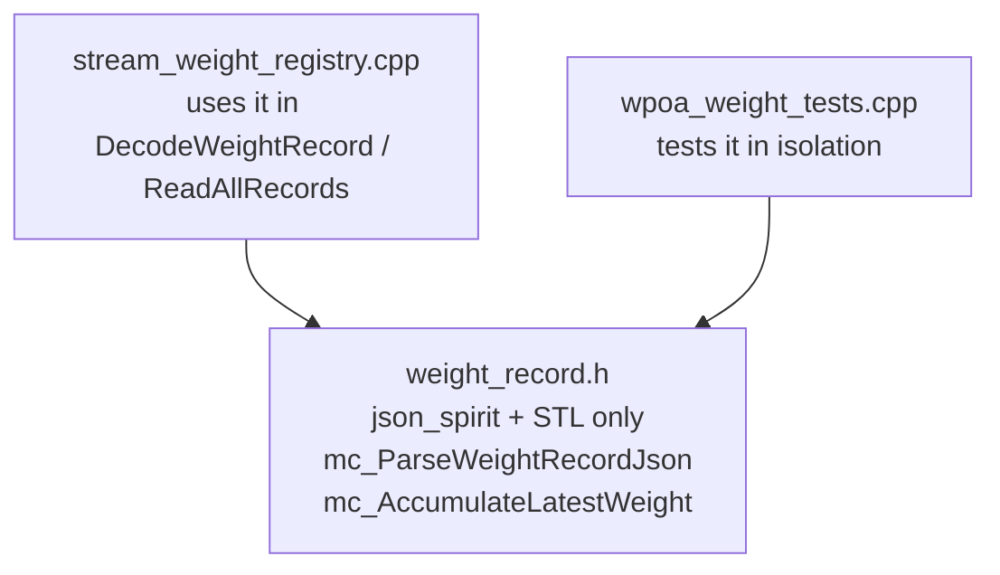

# `weight_record.h`

> Detailed technical walkthrough of the **pure weight-record helpers** — wPoA Phase 1.

## 1. Role and philosophy of the file

This is a **header-only** header (all functions are `inline`, there is no associated
`.cpp`). It contains just two free functions:

- `mc_ParseWeightRecordJson(...)` — turns the JSON payload of a stream item into
  `(node_address, weight)`.
- `mc_AccumulateLatestWeight(...)` — folds one record into the "address → latest
  weight" map.



### Why a separate, "dependency-light" file?

The comment at the top of the file explains it:
> *"This header intentionally depends only on json_spirit (plus `<string>`), so the
> parsing/aggregation logic can be unit-tested in isolation, without linking the
> wallet / node runtime."*

In other words: the **parsing logic** is isolated from the rest of the system.
`stream_weight_registry.cpp` depends on the entire node runtime (wallet, chain,
transaction DB). If the parsing lived there, testing it would require booting half a
node. By extracting it into a header that depends **only** on `json_spirit` +
`<string>` + `<map>`, the unit test (`src/wpoa/test/wpoa_weight_tests.cpp`) can include
only this header, hand-build a `json_spirit::Value` and verify the parsing — without
linking the wallet, network or database.

### Why `inline` and header-only?

`inline` functions defined in a header can be included in several `.cpp` files without
violating the **ODR** (One Definition Rule): the linker merges identical definitions.
This avoids having to create a `weight_record.cpp` and add it to the Makefile just for
two tiny functions. It is the typical pattern for pure, testable utilities.

## 2. Includes

```cpp
#include <map>
#include <string>
#include <stdint.h>
#include "json/json_spirit_value.h"
#include <boost/foreach.hpp>
```

- `<map>` → `std::map` for the accumulation function.
- `<string>` → `std::string`.
- `<stdint.h>` → `uint32_t`, `int64_t` (fixed-width integer types, standard C).
- `json/json_spirit_value.h` → **json_spirit**: `Value`, `Object`, `Pair`, and the type
  enum (`obj_type`, `str_type`, `int_type`, `real_type`).
- `boost/foreach.hpp` → the `BOOST_FOREACH` macro, used to iterate over the members of
  JSON objects in a C++98/03-compatible way (the style of the MultiChain codebase, which
  predates C++11 range-based `for`).

Note: there is **no** `#include` of any wallet/network header here. That is exactly the
point: minimal dependencies.

## 3. `mc_ParseWeightRecordJson` — parsing and validation

```cpp
inline bool mc_ParseWeightRecordJson(const json_spirit::Value& data_value,
                                     std::string& node_address, uint32_t& weight)
```

### Contract (from the Doxygen comment)
- **Input** `data_value`: the value produced by `OpReturnFormatEntry` for a JSON item,
  i.e. an object of the form `{ "json": { "node_address": "...", "weight": n, ... } }`.
- **Output** (by reference): `node_address` and `weight`.
- **Return**: `true` only for a well-formed record with a non-empty address and a
  **strictly positive** integer weight; `false` otherwise.

Passing by reference (`std::string&`, `uint32_t&`) is the idiomatic pre-C++17 way of
"returning multiple values": the function returns a `bool` for success and writes the
results into the caller's variables.

### 3.1 Zeroing and type check

```cpp
node_address = "";
weight = 0;
if (data_value.type() != json_spirit::obj_type) return false;
```

It first clears the outputs (so on failure the caller has clean values), then checks
that the JSON value is an **object** (`obj_type`). `.type()` is the json_spirit method
that returns the type of a `Value`.

### 3.2 The two `OpReturnFormatEntry` shapes (robustness)

```cpp
const json_spirit::Object* obj = &data_value.get_obj();

json_spirit::Value formatdata_val;
bool have_formatdata = false;
BOOST_FOREACH(const json_spirit::Pair& p, *obj)
{
    if (p.name_ == "formatdata" && p.value_.type() == json_spirit::obj_type)
    {
        formatdata_val = p.value_;
        have_formatdata = true;
        break;
    }
}
if (have_formatdata)
    obj = &formatdata_val.get_obj();
```

The comment in the file explains that `OpReturnFormatEntry` has **two output shapes**
depending on the overload used:
- the **6/7-argument** overload (like `StreamItemEntry`): `{"json": {...}}` — direct;
- the **3-argument** overload: `{"format":"json","formatdata":{"json":{...}}}` — wrapped.

This function accepts **both**: if it finds a `"formatdata"` key that is an object, it
"descends into it" and keeps looking for `"json"` at that level. This makes the parser
tolerant of whichever overload feeds it.

Technical details:
- `.get_obj()` → extracts the `json_spirit::Object` (a list of `Pair`s) from the `Value`.
- `obj` is a **pointer** to `Object` so it can be redirected to the nested level without
  copying.
- `json_spirit::Pair` has two fields: `p.name_` (key, `std::string`) and `p.value_`
  (value, `Value`). The trailing underscore is json_spirit's convention for members.
- `BOOST_FOREACH(const Pair& p, *obj)` → iterates over all pairs of the object.

> Important link: this is exactly where the bug fix described in
> `stream_weight_registry.cpp` intersects. `DecodeWeightRecord` uses the 6-argument
> overload (the direct `{"json":{...}}` shape); this parser also accepts the wrapped
> shape for safety. See [multichain-internals.md](multichain-internals.md) §5.

### 3.3 Extracting the `"json"` object

```cpp
json_spirit::Value json_val;
bool have_json = false;
BOOST_FOREACH(const json_spirit::Pair& p, *obj)
{
    if (p.name_ == "json") { json_val = p.value_; have_json = true; break; }
}
if (!have_json || json_val.type() != json_spirit::obj_type) return false;
```

It looks for the `"json"` key. If it is missing, or is not an object, the record is
invalid → `false`.

### 3.4 Reading the `node_address` and `weight` fields

```cpp
std::string addr;
int64_t w = -1;
BOOST_FOREACH(const json_spirit::Pair& p, json_val.get_obj())
{
    if (p.name_ == "node_address" && p.value_.type() == json_spirit::str_type)
        addr = p.value_.get_str();
    else if (p.name_ == "weight")
    {
        if (p.value_.type() == json_spirit::int_type)
            w = p.value_.get_int64();
        else if (p.value_.type() == json_spirit::real_type)
            w = (int64_t)p.value_.get_real();
    }
}
```

- `node_address` must be a string (`str_type`) → `.get_str()`.
- `weight` is accepted both as an **integer** (`int_type` → `.get_int64()`) and as a
  **real** (`real_type` → `.get_real()` cast to `int64_t`). This is because json_spirit
  may classify a number as a real depending on how it was serialised/deserialised by the
  UBJSON layer; accepting both avoids false negatives.
- `w` is initialised to `-1` so that, if the `weight` field is missing entirely, it stays
  negative and fails the subsequent validation.

### 3.5 Final validation and conversion

```cpp
if (addr.empty() || w <= 0) return false;
node_address = addr;
weight = (uint32_t)w;
return true;
```

- Rejects an empty address or a weight ≤ 0 (the weight must be **strictly positive** —
  consistent with `RegisterLocalWeight`, which rejects `weight == 0`).
- Only once validation passes does it write the outputs and return `true`. The cast
  `(uint32_t)w` is safe because `w > 0` is already guaranteed.

## 4. `mc_AccumulateLatestWeight` — "newest wins" aggregation

```cpp
inline void mc_AccumulateLatestWeight(std::map<std::string, uint32_t>& latest,
                                      const std::string& node_address, uint32_t weight)
{
    latest[node_address] = weight;
}
```

A single line, but with a precise semantics documented by the comment:
> *"...the newest value for an address overwrites any earlier one."*

`latest[node_address] = weight` uses `std::map`'s `operator[]`: if the key exists, it
**overwrites** the value; if not, it inserts it. Because `ReadAllRecords` in
`stream_weight_registry.cpp` iterates records in **ascending chronological order**
(old → new), the overwrite makes the **last confirmed record** of each address prevail.
Extracting this line into its own function makes it:
1. self-documenting (the name expresses intent),
2. testable in isolation,
3. the single place where the "newest wins" policy is encoded (if the policy changed,
   only one spot is touched).

## 5. Links to the other files

- **`stream_weight_registry.cpp`** includes this header
  (`#include "wpoa/weight_record.h"`) and uses:
  - `mc_ParseWeightRecordJson` inside `DecodeWeightRecord` to extract `(addr, weight)`
    from the `Value` produced by `OpReturnFormatEntry`;
  - `mc_AccumulateLatestWeight` inside `ReadAllRecords` to build the address→weight map.
- **`src/wpoa/test/wpoa_weight_tests.cpp`** includes **only** this header to test the
  parsing in isolation — which is the entire reason the file exists.
- It depends on no other wPoA file: it is the pure "leaf" of the subsystem.



---

## Related documents

- [../README.md](../README.md) — feature entry point and architecture diagram.
- [stream-weight-registry.md](stream-weight-registry.md) — the class that uses these
  helpers on the read path.
- [implementation-guide.md](implementation-guide.md) §5.6 — why the pure logic is
  extracted for unit testing.
- [testing.md](testing.md) §2 — the Boost.Test suite that exercises these functions.
