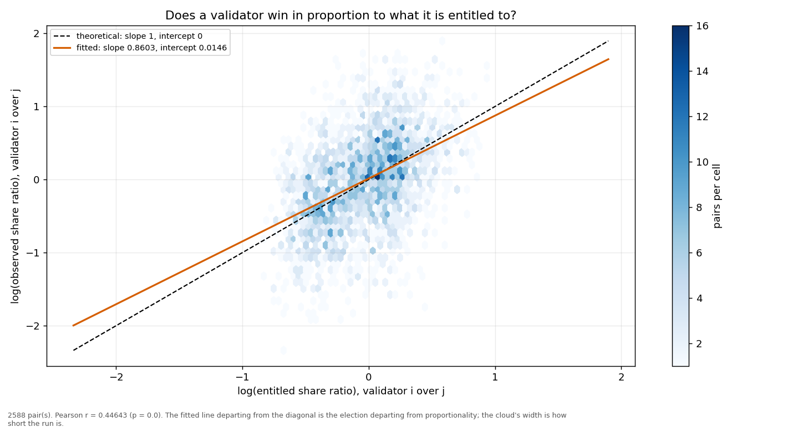
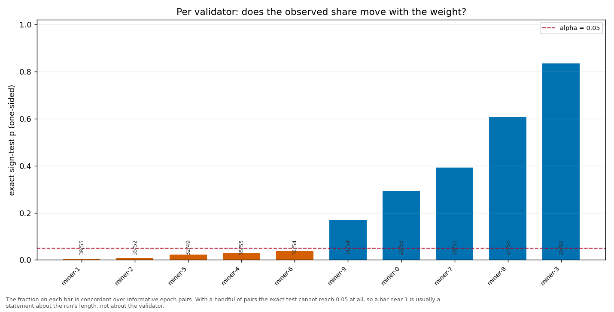

# Longitudinal behaviour

> Across epochs rather than within one: does a validator's share move with its weight, and does it move in proportion?

- **GLM logit on log(weight)**: beta1 = 0.8418 (95% CI [0.7340, 0.9496], n = 600, converged = True). H0 of weighted sortition is beta1 = 1 — NOT consistent.
- **Pairwise log-ratio regression**: slope = 0.8603, intercept = 0.0146, Pearson r = 0.4464 (p = 0.0000), n = 2588 pairs. Proportional selection implies slope 1 and intercept 0.
- **Sign test (weight ↔ share monotonicity)**: 10 validator(s) tested; p-values 0.0032, 0.0380, 0.6061, 0.8341, 0.3919, 0.0088.

