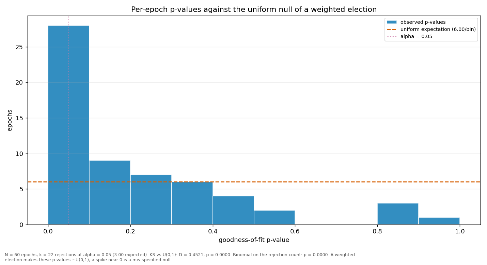

# Streaks and repeats

> Does a validator win more consecutive rounds, or repeat more often, than a weighted draw would produce? Both are compared against a Monte-Carlo reference built from the same weights the election used.

| epoch | L_max obs | L_max MC mean | p | repeat obs | repeat MC mean | p |
|---|---:|---:|---:|---:|---:|---:|
| 2 | 4 | 2.86 | 0.1281 | 0.2857 | 0.1048 | 0.0001 |
| 3 | 3 | 2.89 | 0.7319 | 0.2689 | 0.1064 | 0.0001 |
| 4 | 4 | 2.84 | 0.1218 | 0.2941 | 0.1038 | 0.0001 |
| 5 | 5 | 2.88 | 0.0180 | 0.2101 | 0.1059 | 0.0007 |
| 6 | 4 | 2.83 | 0.1163 | 0.2605 | 0.1030 | 0.0001 |
| 7 | 5 | 2.88 | 0.0186 | 0.2857 | 0.1062 | 0.0001 |
| 8 | 5 | 2.87 | 0.0169 | 0.2605 | 0.1053 | 0.0001 |
| 9 | 4 | 2.83 | 0.1167 | 0.2521 | 0.1035 | 0.0001 |
| 10 | 4 | 2.90 | 0.1408 | 0.2521 | 0.1071 | 0.0001 |
| 11 | 4 | 2.88 | 0.1341 | 0.2605 | 0.1063 | 0.0001 |
| 12 | 4 | 2.86 | 0.1256 | 0.2269 | 0.1048 | 0.0001 |
| 13 | 6 | 2.87 | 0.0023 | 0.2269 | 0.1054 | 0.0003 |
| 14 | 4 | 2.88 | 0.1339 | 0.1933 | 0.1056 | 0.0021 |
| 15 | 5 | 2.85 | 0.0154 | 0.2437 | 0.1042 | 0.0001 |
| 16 | 4 | 2.86 | 0.1271 | 0.2017 | 0.1048 | 0.0014 |
| 17 | 4 | 2.86 | 0.1280 | 0.2353 | 0.1050 | 0.0001 |
| 18 | 2 | 2.88 | 1.0000 | 0.1933 | 0.1059 | 0.0028 |
| 19 | 3 | 2.88 | 0.7184 | 0.2521 | 0.1057 | 0.0001 |
| 20 | 4 | 2.87 | 0.1351 | 0.2185 | 0.1058 | 0.0004 |
| 21 | 4 | 2.84 | 0.1188 | 0.1933 | 0.1038 | 0.0020 |
| 22 | 7 | 2.91 | 0.0004 | 0.3782 | 0.1077 | 0.0001 |
| 23 | 4 | 2.87 | 0.1303 | 0.2521 | 0.1056 | 0.0001 |
| 24 | 4 | 2.85 | 0.1283 | 0.2437 | 0.1046 | 0.0001 |
| 25 | 4 | 2.89 | 0.1368 | 0.2857 | 0.1065 | 0.0001 |
| 26 | 5 | 2.86 | 0.0160 | 0.2353 | 0.1051 | 0.0001 |
| 27 | 4 | 2.85 | 0.1252 | 0.3109 | 0.1043 | 0.0001 |
| 28 | 3 | 2.86 | 0.7131 | 0.2017 | 0.1048 | 0.0013 |
| 29 | 5 | 2.92 | 0.0226 | 0.2269 | 0.1080 | 0.0001 |
| 30 | 6 | 2.89 | 0.0027 | 0.3025 | 0.1065 | 0.0001 |
| 31 | 4 | 2.88 | 0.1356 | 0.1765 | 0.1063 | 0.0138 |
| 32 | 3 | 2.88 | 0.7230 | 0.2521 | 0.1059 | 0.0001 |
| 33 | 3 | 2.86 | 0.7174 | 0.1681 | 0.1054 | 0.0246 |
| 34 | 4 | 2.88 | 0.1364 | 0.2185 | 0.1062 | 0.0003 |
| 35 | 5 | 2.86 | 0.0169 | 0.2773 | 0.1050 | 0.0001 |
| 36 | 3 | 2.89 | 0.7309 | 0.2017 | 0.1067 | 0.0023 |
| 37 | 5 | 2.88 | 0.0174 | 0.2689 | 0.1061 | 0.0001 |
| 38 | 6 | 2.88 | 0.0023 | 0.2689 | 0.1060 | 0.0001 |
| 39 | 4 | 2.86 | 0.1294 | 0.3025 | 0.1049 | 0.0001 |
| 40 | 6 | 2.89 | 0.0022 | 0.2185 | 0.1066 | 0.0004 |
| 41 | 4 | 2.88 | 0.1362 | 0.2269 | 0.1057 | 0.0003 |
| 42 | 5 | 2.86 | 0.0151 | 0.2437 | 0.1044 | 0.0001 |
| 43 | 4 | 2.86 | 0.1297 | 0.2857 | 0.1048 | 0.0001 |
| 44 | 5 | 2.88 | 0.0189 | 0.2437 | 0.1060 | 0.0001 |
| 45 | 3 | 2.85 | 0.7042 | 0.2101 | 0.1045 | 0.0006 |
| 46 | 5 | 2.88 | 0.0180 | 0.2605 | 0.1064 | 0.0001 |
| 47 | 4 | 2.90 | 0.1432 | 0.2689 | 0.1073 | 0.0001 |
| 48 | 3 | 2.87 | 0.7170 | 0.1933 | 0.1051 | 0.0029 |
| 49 | 4 | 2.87 | 0.1297 | 0.2437 | 0.1051 | 0.0001 |
| 50 | 4 | 2.87 | 0.1322 | 0.2437 | 0.1049 | 0.0001 |
| 51 | 5 | 2.88 | 0.0188 | 0.2185 | 0.1056 | 0.0004 |
| 52 | 4 | 2.89 | 0.1387 | 0.2521 | 0.1066 | 0.0001 |
| 53 | 4 | 2.88 | 0.1368 | 0.2353 | 0.1063 | 0.0001 |
| 54 | 6 | 2.86 | 0.0020 | 0.3866 | 0.1049 | 0.0001 |
| 55 | 5 | 2.87 | 0.0178 | 0.2101 | 0.1060 | 0.0009 |
| 56 | 4 | 2.87 | 0.1334 | 0.2605 | 0.1050 | 0.0001 |
| 57 | 5 | 2.85 | 0.0164 | 0.2437 | 0.1046 | 0.0001 |
| 58 | 6 | 2.84 | 0.0018 | 0.3361 | 0.1038 | 0.0001 |
| 59 | 6 | 2.83 | 0.0016 | 0.4286 | 0.1032 | 0.0001 |
| 60 | 5 | 2.85 | 0.0157 | 0.2857 | 0.1045 | 0.0001 |
| 61 | 3 | 2.10 | 0.1831 | 0.3000 | 0.1046 | 0.0155 |
| all | 7 | 4.78 | 0.0153 | 0.2516 | 0.1053 | 0.0001 |

