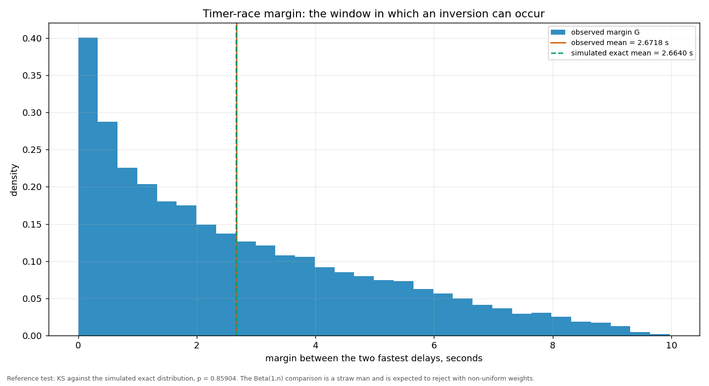
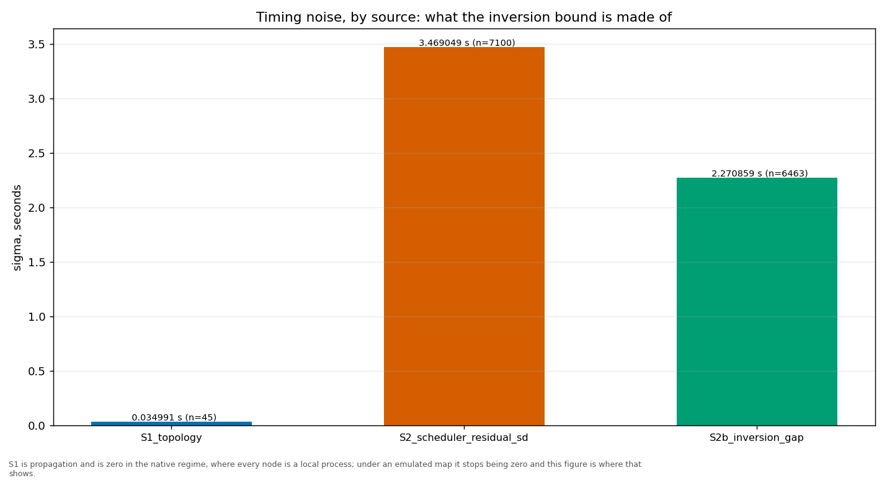
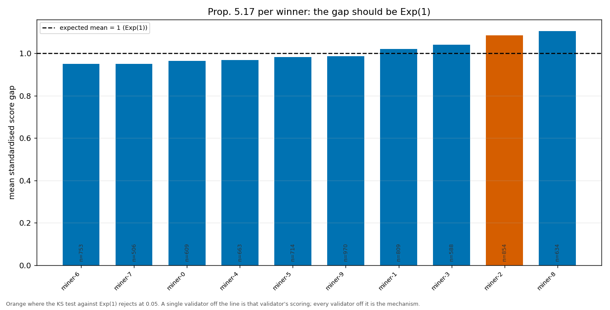
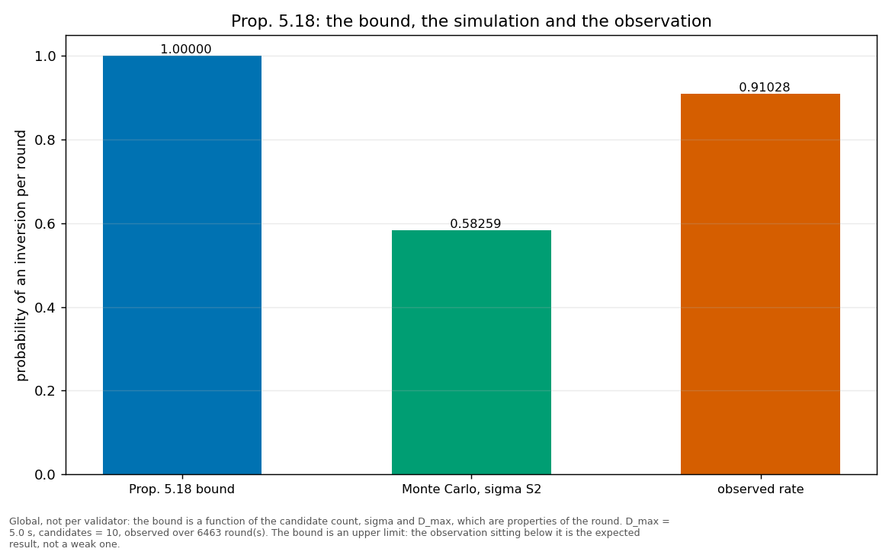

# The timer race

> The margin between the two fastest delays is the window in which an inversion can occur. This report carries the margin itself, what the timing noise is made of, and the two propositions that bound it.

| quantity | value |
|---|---|
| rounds measured | 7101 |
| margins observed | 7101 |
| mean margin G (s) | 2.67176 |
| KS vs Beta(1,n) — straw man, p | 0.00000 |
| KS vs simulated exact — reference, p | 0.85904 |
| sigma S1 (topology) | 0.034991 |
| sigma S2 (scheduler residual) | 3.469049 |
| inversion bound (Prop. 5.18) | 1.00000 |
| inversion probability, MC with sigma_S2 | 0.58259 |
| inversions observed | 6463 |
| inversion rate observed | 0.91028 |

The Beta(1,n) test is a **straw man**: it assumes uniform weights and is expected to reject whenever they are not uniform. The reference test is the KS against the simulated exact distribution of the implemented sortition.

S1 is the propagation term: the spread of the end-to-end one-way delay between validator pairs, over the shortest paths of the map this run used. Under an emulated map it is a measurement; in the native regime every node is a local process, so there is no map and S1 is reported as 0 because it is absent, not because it came out small. Either way the bound below rests on S2 alone -- whether the two sources should be combined is a modelling decision that has not been taken here, so S1 is reported beside the bound and not inside it.

