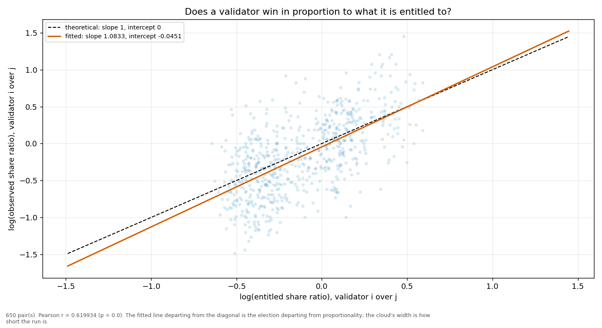
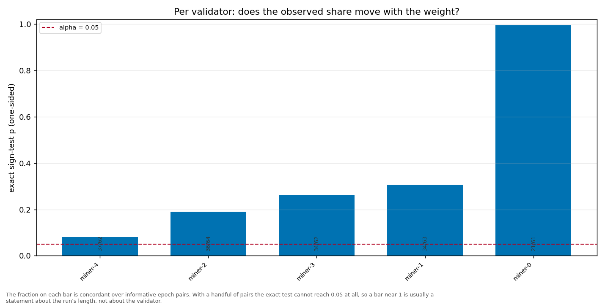

# Longitudinal behaviour

> Across epochs rather than within one: does a validator's share move with its weight, and does it move in proportion?

- **GLM logit on log(weight)**: beta1 = 1.3518 (95% CI [1.2100, 1.4935], n = 325, converged = True). H0 of weighted sortition is beta1 = 1 — NOT consistent.
- **Pairwise log-ratio regression**: slope = 1.0833, intercept = -0.0451, Pearson r = 0.6199 (p = 0.0000), n = 650 pairs. Proportional selection implies slope 1 and intercept 0.
- **Sign test (weight ↔ share monotonicity)**: 5 validator(s) tested; p-values 0.9951, 0.1909, 0.3073, 0.0809, 0.2629.

