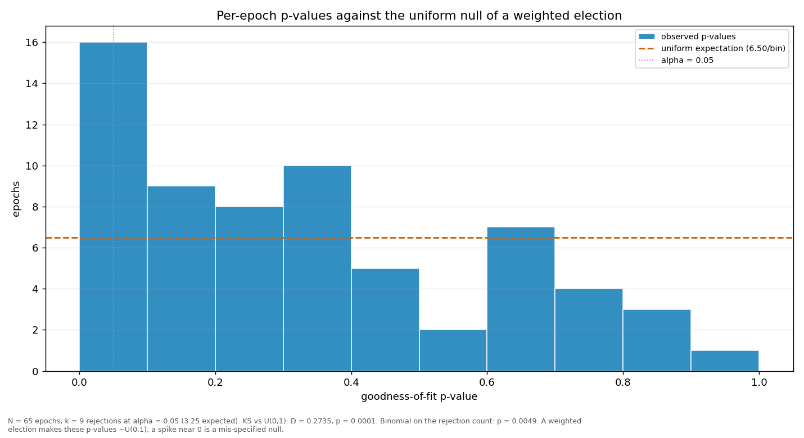

# Streaks and repeats

> Does a validator win more consecutive rounds, or repeat more often, than a weighted draw would produce? Both are compared against a Monte-Carlo reference built from the same weights the election used.

| epoch | L_max obs | L_max MC mean | p | repeat obs | repeat MC mean | p |
|---|---:|---:|---:|---:|---:|---:|
| 2 | 5 | 3.69 | 0.1454 | 0.3131 | 0.2071 | 0.0101 |
| 3 | 8 | 3.73 | 0.0036 | 0.2727 | 0.2088 | 0.0781 |
| 4 | 3 | 3.76 | 0.9791 | 0.2525 | 0.2109 | 0.1844 |
| 5 | 6 | 3.71 | 0.0370 | 0.3333 | 0.2072 | 0.0035 |
| 6 | 3 | 3.72 | 0.9756 | 0.2020 | 0.2079 | 0.5987 |
| 7 | 6 | 3.70 | 0.0364 | 0.3333 | 0.2067 | 0.0031 |
| 8 | 4 | 3.70 | 0.5253 | 0.2222 | 0.2067 | 0.3911 |
| 9 | 4 | 3.69 | 0.5171 | 0.2727 | 0.2059 | 0.0671 |
| 10 | 4 | 3.66 | 0.5084 | 0.2222 | 0.2050 | 0.3736 |
| 11 | 3 | 3.68 | 0.9748 | 0.2424 | 0.2060 | 0.2136 |
| 12 | 3 | 3.75 | 0.9802 | 0.2626 | 0.2102 | 0.1266 |
| 13 | 5 | 3.72 | 0.1543 | 0.2525 | 0.2074 | 0.1608 |
| 14 | 4 | 3.70 | 0.5272 | 0.3131 | 0.2065 | 0.0103 |
| 15 | 3 | 3.71 | 0.9777 | 0.2626 | 0.2082 | 0.1158 |
| 16 | 4 | 3.73 | 0.5376 | 0.3030 | 0.2086 | 0.0205 |
| 17 | 5 | 3.70 | 0.1491 | 0.3434 | 0.2078 | 0.0020 |
| 18 | 4 | 3.66 | 0.5065 | 0.3030 | 0.2048 | 0.0157 |
| 19 | 6 | 3.72 | 0.0382 | 0.3232 | 0.2080 | 0.0064 |
| 20 | 4 | 3.74 | 0.5450 | 0.2323 | 0.2093 | 0.3217 |
| 21 | 4 | 3.76 | 0.5558 | 0.2727 | 0.2109 | 0.0869 |
| 22 | 4 | 3.72 | 0.5306 | 0.3434 | 0.2080 | 0.0021 |
| 23 | 5 | 3.68 | 0.1421 | 0.2525 | 0.2066 | 0.1563 |
| 24 | 5 | 3.70 | 0.1485 | 0.3030 | 0.2075 | 0.0188 |
| 25 | 4 | 3.71 | 0.5287 | 0.3030 | 0.2068 | 0.0172 |
| 26 | 4 | 3.78 | 0.5594 | 0.3434 | 0.2108 | 0.0025 |
| 27 | 6 | 3.79 | 0.0461 | 0.4141 | 0.2123 | 0.0001 |
| 28 | 4 | 3.71 | 0.5308 | 0.3131 | 0.2081 | 0.0102 |
| 29 | 4 | 3.77 | 0.5548 | 0.3030 | 0.2106 | 0.0222 |
| 30 | 4 | 3.69 | 0.5198 | 0.2929 | 0.2061 | 0.0266 |
| 31 | 4 | 3.71 | 0.5300 | 0.2727 | 0.2077 | 0.0738 |
| 32 | 4 | 3.73 | 0.5361 | 0.3131 | 0.2087 | 0.0115 |
| 33 | 7 | 3.73 | 0.0105 | 0.3636 | 0.2081 | 0.0007 |
| 34 | 4 | 3.71 | 0.5290 | 0.3737 | 0.2078 | 0.0004 |
| 35 | 6 | 3.66 | 0.0319 | 0.3469 | 0.2052 | 0.0011 |
| 36 | 4 | 3.72 | 0.5370 | 0.3469 | 0.2093 | 0.0015 |
| 37 | 6 | 3.74 | 0.0416 | 0.3333 | 0.2089 | 0.0033 |
| 38 | 5 | 3.71 | 0.1524 | 0.3737 | 0.2073 | 0.0006 |
| 39 | 6 | 3.73 | 0.0379 | 0.3939 | 0.2096 | 0.0001 |
| 40 | 7 | 3.67 | 0.0072 | 0.4592 | 0.2056 | 0.0001 |
| 41 | 3 | 3.70 | 0.9762 | 0.3131 | 0.2073 | 0.0107 |
| 42 | 4 | 3.72 | 0.5328 | 0.3838 | 0.2083 | 0.0003 |
| 43 | 5 | 3.76 | 0.1684 | 0.3636 | 0.2106 | 0.0010 |
| 44 | 4 | 3.71 | 0.5295 | 0.2727 | 0.2077 | 0.0731 |
| 45 | 6 | 3.68 | 0.0349 | 0.3434 | 0.2058 | 0.0016 |
| 46 | 4 | 3.73 | 0.5403 | 0.4141 | 0.2093 | 0.0001 |
| 47 | 5 | 3.71 | 0.1513 | 0.4545 | 0.2076 | 0.0001 |
| 48 | 4 | 3.67 | 0.5071 | 0.4242 | 0.2049 | 0.0001 |
| 49 | 6 | 3.66 | 0.0324 | 0.4184 | 0.2046 | 0.0001 |
| 50 | 6 | 3.67 | 0.0335 | 0.3878 | 0.2054 | 0.0001 |
| 51 | 5 | 3.78 | 0.1753 | 0.3939 | 0.2120 | 0.0002 |
| 52 | 4 | 3.72 | 0.5342 | 0.3434 | 0.2082 | 0.0029 |
| 53 | 6 | 3.70 | 0.0353 | 0.4444 | 0.2078 | 0.0001 |
| 54 | 4 | 3.71 | 0.5303 | 0.3776 | 0.2081 | 0.0001 |
| 55 | 7 | 3.75 | 0.0112 | 0.4286 | 0.2110 | 0.0001 |
| 56 | 6 | 3.67 | 0.0340 | 0.4082 | 0.2051 | 0.0001 |
| 57 | 5 | 3.67 | 0.1407 | 0.4694 | 0.2053 | 0.0001 |
| 58 | 4 | 3.68 | 0.5183 | 0.3838 | 0.2063 | 0.0002 |
| 59 | 4 | 3.72 | 0.5368 | 0.3939 | 0.2079 | 0.0001 |
| 60 | 4 | 3.68 | 0.5154 | 0.3838 | 0.2061 | 0.0003 |
| 61 | 6 | 3.67 | 0.0330 | 0.4141 | 0.2052 | 0.0001 |
| 62 | 7 | 3.69 | 0.0077 | 0.3939 | 0.2074 | 0.0001 |
| 63 | 4 | 3.68 | 0.5139 | 0.3232 | 0.2058 | 0.0052 |
| 64 | 7 | 3.69 | 0.0091 | 0.4040 | 0.2060 | 0.0001 |
| 65 | 6 | 3.73 | 0.0386 | 0.4343 | 0.2088 | 0.0001 |
| 66 | 6 | 3.35 | 0.0198 | 0.4237 | 0.2065 | 0.0003 |
| all | 8 | 6.52 | 0.1246 | 0.3398 | 0.2074 | 0.0001 |

