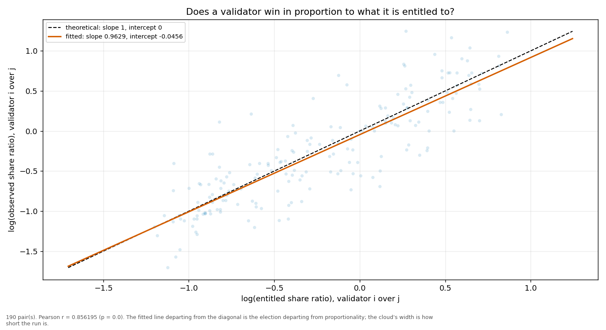
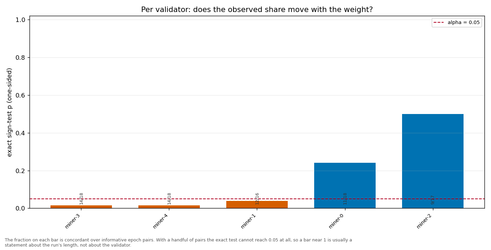

# Longitudinal behaviour

> Across epochs rather than within one: does a validator's share move with its weight, and does it move in proportion?

- **GLM logit on log(weight)**: beta1 = 0.5136 (95% CI [0.4357, 0.5916], n = 95, converged = True). H0 of weighted sortition is beta1 = 1 — NOT consistent.
- **Pairwise log-ratio regression**: slope = 0.9629, intercept = -0.0456, Pearson r = 0.8562 (p = 0.0000), n = 190 pairs. Proportional selection implies slope 1 and intercept 0.
- **Sign test (weight ↔ share monotonicity)**: 5 validator(s) tested; p-values 0.0154, 0.0384, 0.2403, 0.5000, 0.0154.

