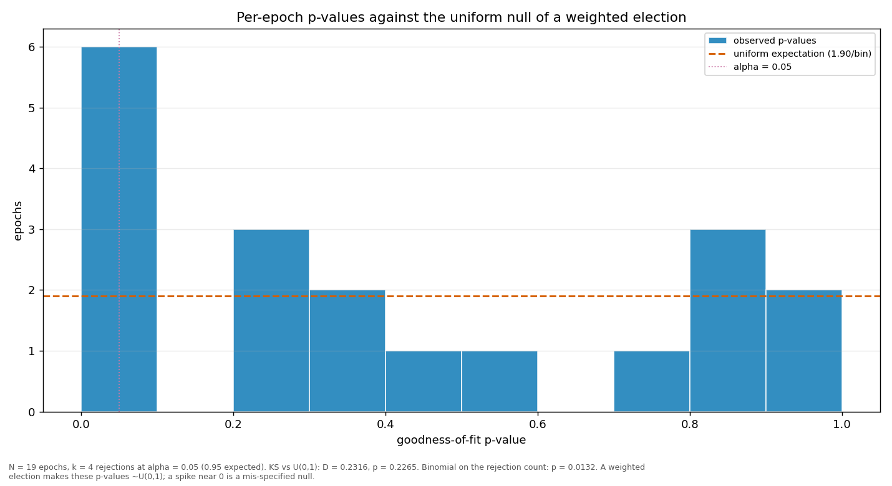

# Streaks and repeats

> Does a validator win more consecutive rounds, or repeat more often, than a weighted draw would produce? Both are compared against a Monte-Carlo reference built from the same weights the election used.

| epoch | L_max obs | L_max MC mean | p | repeat obs | repeat MC mean | p |
|---|---:|---:|---:|---:|---:|---:|
| 1 | 5 | 4.14 | 0.2850 | 0.3803 | 0.2197 | 0.0001 |
| 2 | 6 | 4.10 | 0.0739 | 0.2953 | 0.2161 | 0.0160 |
| 3 | 4 | 4.43 | 0.8442 | 0.3221 | 0.2343 | 0.0121 |
| 4 | 6 | 4.42 | 0.1277 | 0.3691 | 0.2330 | 0.0007 |
| 5 | 7 | 4.41 | 0.0368 | 0.3423 | 0.2325 | 0.0026 |
| 6 | 5 | 4.35 | 0.3613 | 0.2685 | 0.2277 | 0.1419 |
| 7 | 6 | 4.37 | 0.1225 | 0.3221 | 0.2293 | 0.0079 |
| 8 | 6 | 4.49 | 0.1464 | 0.3154 | 0.2335 | 0.0191 |
| 9 | 5 | 4.26 | 0.3305 | 0.3624 | 0.2231 | 0.0002 |
| 10 | 4 | 4.23 | 0.7753 | 0.3557 | 0.2213 | 0.0003 |
| 11 | 4 | 4.30 | 0.8069 | 0.2752 | 0.2256 | 0.0925 |
| 12 | 9 | 4.50 | 0.0060 | 0.3557 | 0.2365 | 0.0013 |
| 13 | 4 | 4.19 | 0.7643 | 0.3490 | 0.2191 | 0.0004 |
| 14 | 5 | 4.38 | 0.3726 | 0.3356 | 0.2269 | 0.0026 |
| 15 | 5 | 4.20 | 0.3092 | 0.3087 | 0.2233 | 0.0123 |
| 16 | 6 | 4.33 | 0.1143 | 0.2886 | 0.2276 | 0.0545 |
| 17 | 6 | 4.28 | 0.0986 | 0.3490 | 0.2270 | 0.0009 |
| 18 | 6 | 4.16 | 0.0831 | 0.3557 | 0.2173 | 0.0003 |
| 19 | 4 | 3.15 | 0.2774 | 0.2941 | 0.2229 | 0.2124 |
| all | 9 | 6.57 | 0.0512 | 0.3266 | 0.2265 | 0.0001 |

