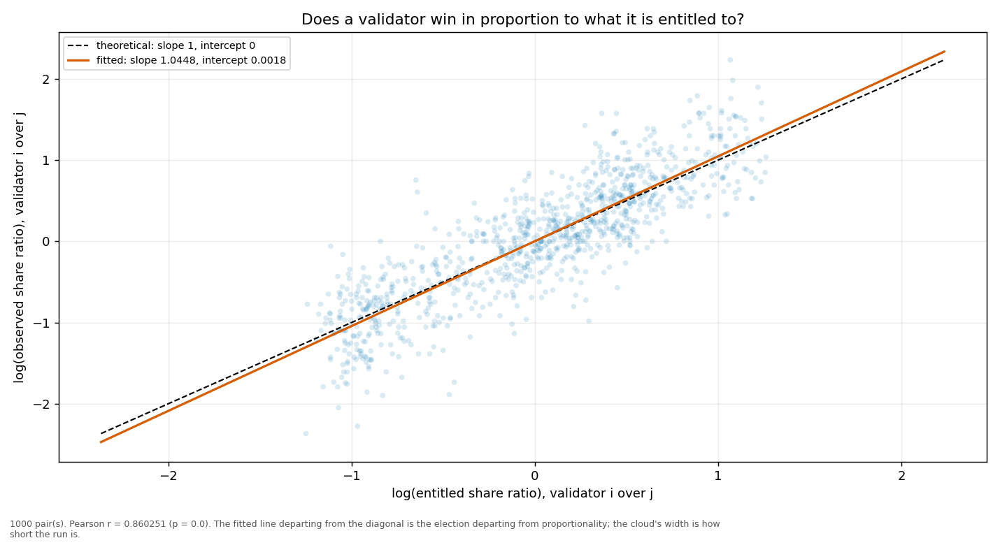
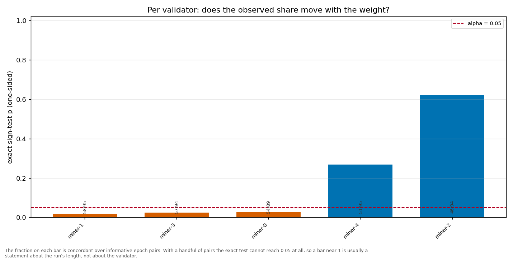

# Longitudinal behaviour

> Across epochs rather than within one: does a validator's share move with its weight, and does it move in proportion?

- **GLM logit on log(weight)**: beta1 = 1.1914 (95% CI [1.1267, 1.2561], n = 500, converged = True). H0 of weighted sortition is beta1 = 1 — NOT consistent.
- **Pairwise log-ratio regression**: slope = 1.0448, intercept = 0.0018, Pearson r = 0.8603 (p = 0.0000), n = 1000 pairs. Proportional selection implies slope 1 and intercept 0.
- **Sign test (weight ↔ share monotonicity)**: 5 validator(s) tested; p-values 0.6214, 0.0279, 0.0247, 0.2692, 0.0198.

