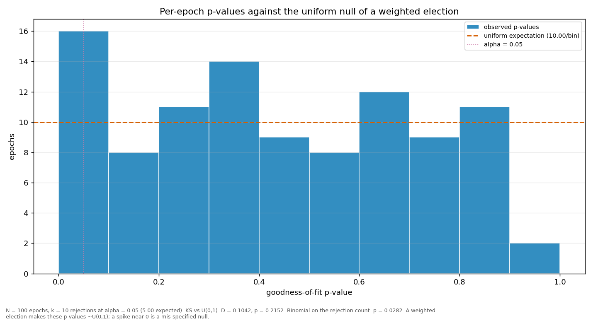

# Streaks and repeats

> Does a validator win more consecutive rounds, or repeat more often, than a weighted draw would produce? Both are compared against a Monte-Carlo reference built from the same weights the election used.

| epoch | L_max obs | L_max MC mean | p | repeat obs | repeat MC mean | p |
|---|---:|---:|---:|---:|---:|---:|
| 2 | 5 | 3.80 | 0.1783 | 0.3232 | 0.2161 | 0.0108 |
| 3 | 4 | 3.96 | 0.6501 | 0.3131 | 0.2273 | 0.0354 |
| 4 | 5 | 4.07 | 0.2660 | 0.3737 | 0.2325 | 0.0019 |
| 5 | 4 | 4.01 | 0.6653 | 0.3131 | 0.2293 | 0.0382 |
| 6 | 5 | 3.94 | 0.2195 | 0.3131 | 0.2249 | 0.0300 |
| 7 | 6 | 3.90 | 0.0579 | 0.3333 | 0.2229 | 0.0097 |
| 8 | 5 | 3.99 | 0.2416 | 0.2929 | 0.2276 | 0.0835 |
| 9 | 5 | 3.84 | 0.1887 | 0.2929 | 0.2172 | 0.0511 |
| 10 | 4 | 3.85 | 0.5968 | 0.3232 | 0.2176 | 0.0115 |
| 11 | 4 | 3.87 | 0.6048 | 0.3535 | 0.2186 | 0.0026 |
| 12 | 4 | 3.97 | 0.6533 | 0.2929 | 0.2278 | 0.0816 |
| 13 | 9 | 3.82 | 0.0008 | 0.3838 | 0.2171 | 0.0005 |
| 14 | 4 | 3.95 | 0.6381 | 0.3131 | 0.2236 | 0.0295 |
| 15 | 4 | 3.87 | 0.6104 | 0.3232 | 0.2212 | 0.0163 |
| 16 | 4 | 3.90 | 0.6230 | 0.3030 | 0.2227 | 0.0435 |
| 17 | 4 | 3.94 | 0.6373 | 0.3333 | 0.2244 | 0.0103 |
| 18 | 5 | 3.79 | 0.1740 | 0.2626 | 0.2149 | 0.1478 |
| 19 | 7 | 3.87 | 0.0136 | 0.3737 | 0.2220 | 0.0008 |
| 20 | 5 | 3.86 | 0.1943 | 0.3232 | 0.2195 | 0.0143 |
| 21 | 6 | 4.03 | 0.0789 | 0.4141 | 0.2302 | 0.0001 |
| 22 | 4 | 3.96 | 0.6431 | 0.2828 | 0.2248 | 0.1113 |
| 23 | 4 | 3.89 | 0.6167 | 0.2424 | 0.2214 | 0.3383 |
| 24 | 4 | 3.87 | 0.6133 | 0.3535 | 0.2206 | 0.0038 |
| 25 | 5 | 3.97 | 0.2348 | 0.3333 | 0.2255 | 0.0128 |
| 26 | 3 | 4.12 | 0.9944 | 0.2323 | 0.2354 | 0.5641 |
| 27 | 4 | 4.04 | 0.6764 | 0.3131 | 0.2312 | 0.0440 |
| 28 | 4 | 3.90 | 0.6222 | 0.3939 | 0.2222 | 0.0003 |
| 29 | 6 | 4.12 | 0.0979 | 0.3434 | 0.2328 | 0.0110 |
| 30 | 8 | 3.87 | 0.0049 | 0.3434 | 0.2199 | 0.0041 |
| 31 | 4 | 4.00 | 0.6572 | 0.2626 | 0.2272 | 0.2319 |
| 32 | 5 | 3.91 | 0.2133 | 0.2525 | 0.2221 | 0.2626 |
| 33 | 4 | 3.90 | 0.6223 | 0.2828 | 0.2216 | 0.0939 |
| 34 | 6 | 3.99 | 0.0736 | 0.3535 | 0.2265 | 0.0035 |
| 35 | 5 | 3.87 | 0.1995 | 0.3333 | 0.2213 | 0.0103 |
| 36 | 6 | 3.86 | 0.0557 | 0.3838 | 0.2196 | 0.0004 |
| 37 | 4 | 4.05 | 0.6790 | 0.2828 | 0.2298 | 0.1358 |
| 38 | 4 | 3.88 | 0.6131 | 0.3131 | 0.2203 | 0.0250 |
| 39 | 6 | 3.92 | 0.0617 | 0.3131 | 0.2239 | 0.0289 |
| 40 | 5 | 3.83 | 0.1859 | 0.2828 | 0.2171 | 0.0797 |
| 41 | 5 | 3.90 | 0.2092 | 0.3838 | 0.2218 | 0.0003 |
| 42 | 4 | 3.92 | 0.6348 | 0.2929 | 0.2252 | 0.0736 |
| 43 | 6 | 4.08 | 0.0859 | 0.2828 | 0.2339 | 0.1554 |
| 44 | 5 | 3.89 | 0.2049 | 0.3333 | 0.2225 | 0.0106 |
| 45 | 6 | 3.89 | 0.0575 | 0.3333 | 0.2212 | 0.0089 |
| 46 | 4 | 3.98 | 0.6565 | 0.3434 | 0.2286 | 0.0082 |
| 47 | 7 | 3.89 | 0.0153 | 0.3030 | 0.2220 | 0.0420 |
| 48 | 4 | 3.82 | 0.5895 | 0.3232 | 0.2165 | 0.0121 |
| 49 | 4 | 3.90 | 0.6178 | 0.2727 | 0.2198 | 0.1295 |
| 50 | 5 | 3.90 | 0.2081 | 0.3434 | 0.2222 | 0.0055 |
| 51 | 7 | 4.04 | 0.0246 | 0.3434 | 0.2317 | 0.0105 |
| 52 | 8 | 3.91 | 0.0050 | 0.3535 | 0.2214 | 0.0027 |
| 53 | 4 | 3.92 | 0.6344 | 0.2626 | 0.2243 | 0.2146 |
| 54 | 5 | 3.98 | 0.2351 | 0.2727 | 0.2293 | 0.1820 |
| 55 | 4 | 4.01 | 0.6669 | 0.3535 | 0.2297 | 0.0049 |
| 56 | 3 | 3.82 | 0.9838 | 0.2121 | 0.2165 | 0.5815 |
| 57 | 4 | 3.83 | 0.5883 | 0.3131 | 0.2161 | 0.0181 |
| 58 | 6 | 3.85 | 0.0513 | 0.3030 | 0.2202 | 0.0364 |
| 59 | 4 | 3.94 | 0.6388 | 0.3030 | 0.2241 | 0.0511 |
| 60 | 5 | 3.89 | 0.2012 | 0.3030 | 0.2213 | 0.0417 |
| 61 | 3 | 3.79 | 0.9833 | 0.2626 | 0.2154 | 0.1514 |
| 62 | 5 | 3.96 | 0.2298 | 0.3535 | 0.2269 | 0.0047 |
| 63 | 5 | 3.85 | 0.1894 | 0.2525 | 0.2195 | 0.2453 |
| 64 | 4 | 3.89 | 0.6206 | 0.2727 | 0.2207 | 0.1323 |
| 65 | 7 | 3.93 | 0.0148 | 0.3838 | 0.2248 | 0.0004 |
| 66 | 4 | 3.91 | 0.6271 | 0.3232 | 0.2226 | 0.0172 |
| 67 | 4 | 3.90 | 0.6198 | 0.3061 | 0.2220 | 0.0349 |
| 68 | 6 | 3.88 | 0.0558 | 0.3434 | 0.2214 | 0.0046 |
| 69 | 5 | 3.90 | 0.2085 | 0.3776 | 0.2238 | 0.0002 |
| 70 | 4 | 3.85 | 0.5982 | 0.2424 | 0.2180 | 0.3117 |
| 71 | 5 | 3.97 | 0.2286 | 0.1616 | 0.2273 | 0.9585 |
| 72 | 4 | 3.88 | 0.6131 | 0.3232 | 0.2197 | 0.0144 |
| 73 | 6 | 3.91 | 0.0594 | 0.3636 | 0.2232 | 0.0018 |
| 74 | 6 | 3.89 | 0.0598 | 0.3939 | 0.2203 | 0.0003 |
| 75 | 4 | 3.88 | 0.6174 | 0.3030 | 0.2209 | 0.0399 |
| 76 | 4 | 3.90 | 0.6207 | 0.3980 | 0.2235 | 0.0002 |
| 77 | 3 | 3.82 | 0.9831 | 0.1919 | 0.2168 | 0.7579 |
| 78 | 5 | 4.04 | 0.2551 | 0.3737 | 0.2336 | 0.0019 |
| 79 | 6 | 3.87 | 0.0537 | 0.3265 | 0.2222 | 0.0125 |
| 80 | 3 | 3.79 | 0.9838 | 0.3163 | 0.2156 | 0.0131 |
| 81 | 4 | 3.88 | 0.6169 | 0.2828 | 0.2218 | 0.0955 |
| 82 | 3 | 3.91 | 0.9861 | 0.3434 | 0.2216 | 0.0058 |
| 83 | 5 | 3.93 | 0.2191 | 0.2959 | 0.2236 | 0.0625 |
| 84 | 4 | 3.86 | 0.6082 | 0.2857 | 0.2211 | 0.0805 |
| 85 | 5 | 4.01 | 0.2468 | 0.2828 | 0.2294 | 0.1303 |
| 86 | 4 | 3.85 | 0.6020 | 0.3061 | 0.2190 | 0.0290 |
| 87 | 5 | 3.87 | 0.1966 | 0.3838 | 0.2206 | 0.0007 |
| 88 | 4 | 3.87 | 0.6145 | 0.2828 | 0.2215 | 0.0941 |
| 89 | 5 | 3.88 | 0.2019 | 0.3131 | 0.2210 | 0.0236 |
| 90 | 5 | 3.90 | 0.2066 | 0.2653 | 0.2238 | 0.1965 |
| 91 | 4 | 3.97 | 0.6606 | 0.3232 | 0.2284 | 0.0231 |
| 92 | 4 | 3.88 | 0.6153 | 0.2653 | 0.2216 | 0.1753 |
| 93 | 4 | 3.88 | 0.6139 | 0.2929 | 0.2204 | 0.0581 |
| 94 | 6 | 3.95 | 0.0673 | 0.3878 | 0.2256 | 0.0003 |
| 95 | 5 | 3.93 | 0.2178 | 0.3737 | 0.2258 | 0.0009 |
| 96 | 4 | 3.97 | 0.6574 | 0.3030 | 0.2288 | 0.0593 |
| 97 | 3 | 3.82 | 0.9835 | 0.2551 | 0.2165 | 0.2083 |
| 98 | 4 | 3.84 | 0.5970 | 0.2347 | 0.2184 | 0.3855 |
| 99 | 7 | 3.97 | 0.0205 | 0.3571 | 0.2280 | 0.0026 |
| 100 | 5 | 3.91 | 0.2132 | 0.2857 | 0.2220 | 0.0858 |
| 101 | 2 | 2.80 | 0.9921 | 0.1579 | 0.2258 | 0.8341 |
| all | 9 | 7.33 | 0.1175 | 0.3136 | 0.2228 | 0.0001 |

