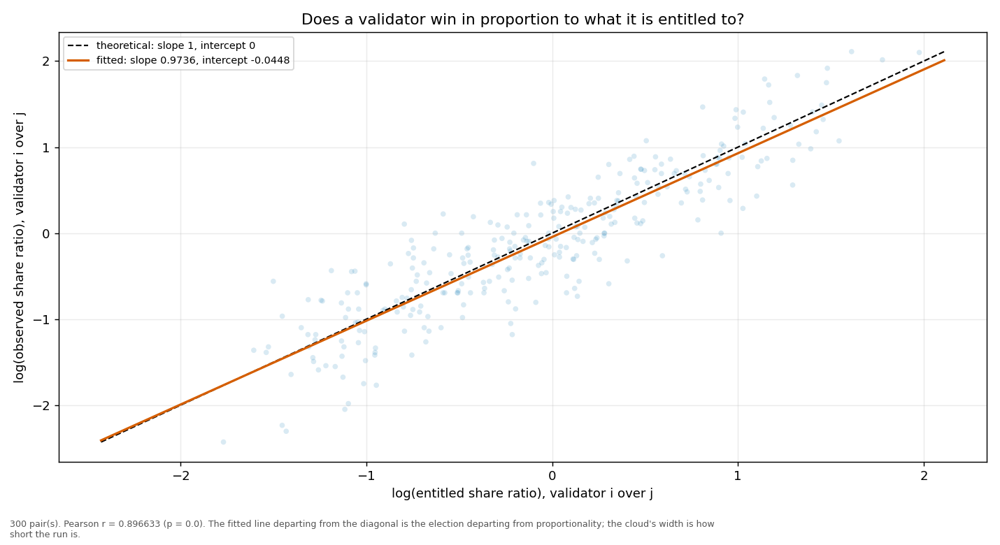
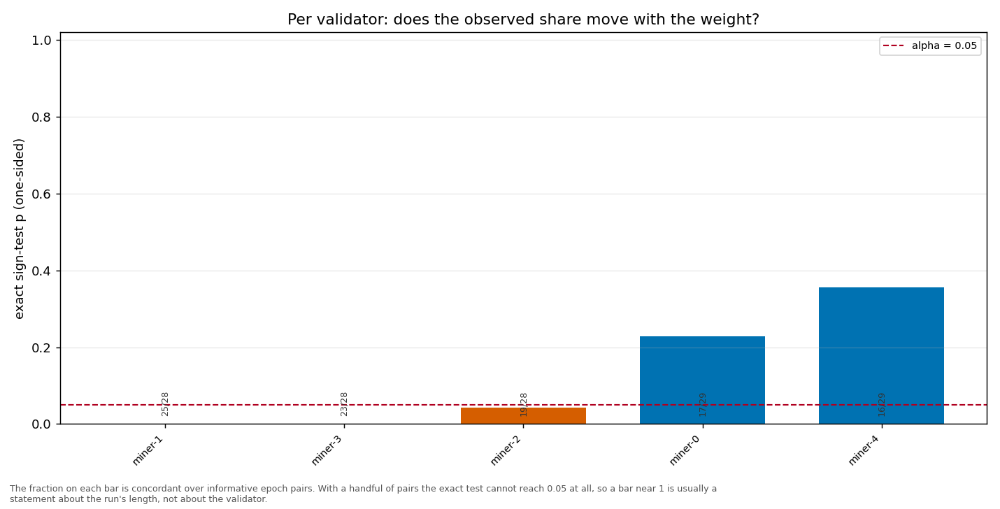

# Longitudinal behaviour

> Across epochs rather than within one: does a validator's share move with its weight, and does it move in proportion?

- **GLM logit on log(weight)**: beta1 = 1.0480 (95% CI [0.9632, 1.1327], n = 150, converged = True). H0 of weighted sortition is beta1 = 1 — consistent.
- **Pairwise log-ratio regression**: slope = 0.9736, intercept = -0.0448, Pearson r = 0.8966 (p = 0.0000), n = 300 pairs. Proportional selection implies slope 1 and intercept 0.
- **Sign test (weight ↔ share monotonicity)**: 5 validator(s) tested; p-values 0.2291, 0.0005, 0.0436, 0.3555, 0.0000.

