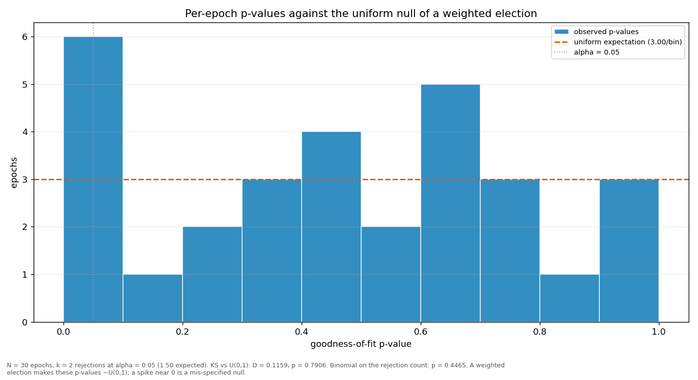

# Streaks and repeats

> Does a validator win more consecutive rounds, or repeat more often, than a weighted draw would produce? Both are compared against a Monte-Carlo reference built from the same weights the election used.

| epoch | L_max obs | L_max MC mean | p | repeat obs | repeat MC mean | p |
|---|---:|---:|---:|---:|---:|---:|
| 2 | 5 | 3.83 | 0.1875 | 0.2828 | 0.2174 | 0.0777 |
| 3 | 3 | 3.69 | 0.9785 | 0.1414 | 0.2072 | 0.9663 |
| 4 | 3 | 4.12 | 0.9947 | 0.2626 | 0.2408 | 0.3428 |
| 5 | 3 | 4.23 | 0.9955 | 0.2525 | 0.2417 | 0.4332 |
| 6 | 4 | 4.48 | 0.8226 | 0.3030 | 0.2662 | 0.2413 |
| 7 | 4 | 4.12 | 0.7085 | 0.2525 | 0.2352 | 0.3781 |
| 8 | 4 | 4.29 | 0.7773 | 0.2828 | 0.2565 | 0.3104 |
| 9 | 3 | 4.38 | 0.9971 | 0.2525 | 0.2550 | 0.5547 |
| 10 | 3 | 4.24 | 0.9948 | 0.2020 | 0.2387 | 0.8309 |
| 11 | 7 | 4.36 | 0.0481 | 0.2828 | 0.2462 | 0.2358 |
| 12 | 3 | 4.34 | 0.9977 | 0.2525 | 0.2556 | 0.5566 |
| 13 | 7 | 4.68 | 0.0851 | 0.2929 | 0.2598 | 0.2645 |
| 14 | 6 | 3.95 | 0.0695 | 0.2727 | 0.2224 | 0.1443 |
| 15 | 3 | 4.05 | 0.9940 | 0.1919 | 0.2353 | 0.8714 |
| 16 | 3 | 4.01 | 0.9901 | 0.2222 | 0.2288 | 0.5954 |
| 17 | 4 | 3.93 | 0.6369 | 0.1919 | 0.2257 | 0.8189 |
| 18 | 6 | 4.12 | 0.0851 | 0.2525 | 0.2414 | 0.4334 |
| 19 | 3 | 4.07 | 0.9916 | 0.1919 | 0.2305 | 0.8483 |
| 20 | 6 | 4.16 | 0.0973 | 0.2222 | 0.2398 | 0.6926 |
| 21 | 5 | 4.42 | 0.3939 | 0.2626 | 0.2546 | 0.4593 |
| 22 | 6 | 4.94 | 0.2825 | 0.2222 | 0.2641 | 0.8363 |
| 23 | 5 | 3.93 | 0.2241 | 0.2020 | 0.2215 | 0.7128 |
| 24 | 3 | 3.79 | 0.9846 | 0.1919 | 0.2151 | 0.7478 |
| 25 | 7 | 5.86 | 0.2861 | 0.2727 | 0.3072 | 0.7715 |
| 26 | 4 | 5.25 | 0.9317 | 0.2626 | 0.2883 | 0.7270 |
| 27 | 5 | 4.34 | 0.3672 | 0.2929 | 0.2545 | 0.2272 |
| 28 | 4 | 4.05 | 0.6758 | 0.2424 | 0.2268 | 0.3896 |
| 29 | 3 | 4.17 | 0.9927 | 0.2323 | 0.2337 | 0.5441 |
| 30 | 4 | 4.53 | 0.8122 | 0.2929 | 0.2528 | 0.2170 |
| 31 | 2 | 2.99 | 0.9953 | 0.1500 | 0.2440 | 0.8907 |
| all | 7 | 7.66 | 0.8045 | 0.2435 | 0.2431 | 0.4855 |

