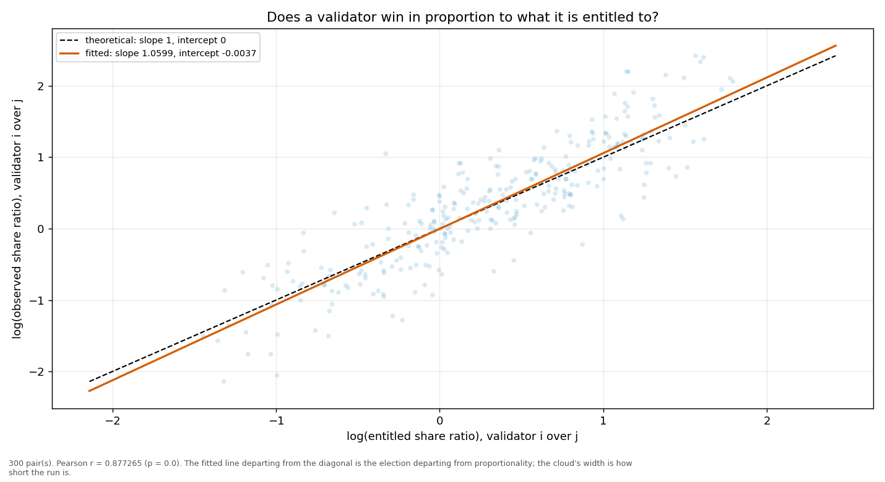
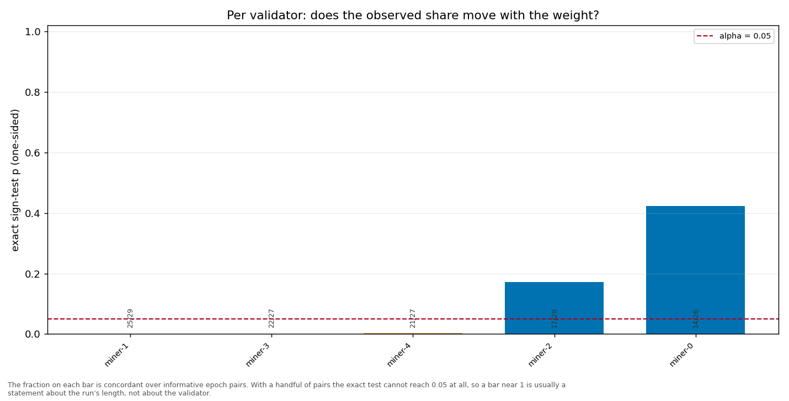

# Longitudinal behaviour

> Across epochs rather than within one: does a validator's share move with its weight, and does it move in proportion?

- **GLM logit on log(weight)**: beta1 = 1.1040 (95% CI [1.0164, 1.1916], n = 150, converged = True). H0 of weighted sortition is beta1 = 1 — NOT consistent.
- **Pairwise log-ratio regression**: slope = 1.0599, intercept = -0.0037, Pearson r = 0.8773 (p = 0.0000), n = 300 pairs. Proportional selection implies slope 1 and intercept 0.
- **Sign test (weight ↔ share monotonicity)**: 5 validator(s) tested; p-values 0.0030, 0.1725, 0.4225, 0.0008, 0.0001.

